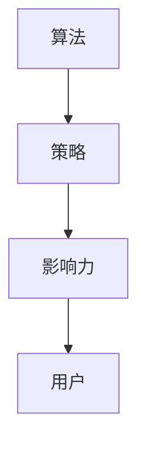

                 

# 文章标题

> 关键词：注意力经济、内容创作、竞争、算法、策略、影响力

> 摘要：本文深入探讨注意力经济中的内容创作现象，分析了在激烈的市场竞争中如何通过算法和策略实现内容创作的高效和突出。文章首先阐述了注意力经济的概念，然后探讨了内容创作的核心要素，随后提出了几种提高内容竞争力的方法，并结合具体案例分析这些方法的实际效果。最后，文章讨论了未来内容创作的发展趋势和面临的挑战，为创作者提供了实用的指导。

## 1. 背景介绍

在当今信息爆炸的时代，内容创作者面临着前所未有的挑战。随着互联网的普及和社交媒体的发展，人们的注意力变得稀缺，这形成了所谓的“注意力经济”。在这种经济模式中，内容创作者需要争夺用户的注意力，以实现内容的传播和商业变现。

### 注意力经济的定义

注意力经济（Attention Economy）是一种基于人们注意力资源的经济模式。在传统经济中，资源如土地、劳动力和资本是稀缺的，而在注意力经济中，人们的注意力成为了稀缺资源。这意味着，为了获得关注和互动，内容创作者必须提供有价值、有趣或引人入胜的内容，从而吸引用户的注意力。

### 内容创作的挑战

在注意力经济中，内容创作面临着以下几个挑战：

1. **信息过载**：用户每天接触到的大量信息使他们难以筛选和关注。
2. **竞争激烈**：市场上存在大量的内容创作者，彼此争夺有限的用户注意力。
3. **注意力稀缺**：用户的注意力是有限的，不能被无限分割。

### 内容创作的重要性

尽管面临着诸多挑战，内容创作在注意力经济中的重要性不容忽视。高质量的内容能够吸引和保持用户的注意力，提高内容的传播效果，最终实现商业价值。因此，理解内容创作的核心要素和如何在竞争中脱颖而出，对于创作者来说至关重要。

## 2. 核心概念与联系

在探讨内容创作时，我们首先需要理解一些核心概念，包括算法、策略和影响力。这些概念构成了内容创作的基础，并且相互关联，共同作用于内容创作的成功。

### 2.1 什么是算法

算法是一种解决问题的步骤或规则集合。在内容创作中，算法可以用于优化内容的生成、推荐和传播。例如，推荐系统使用算法来分析用户的行为和偏好，从而推荐用户可能感兴趣的内容。

### 2.2 策略

策略是指为了实现特定目标而采取的行动和决策。在内容创作中，策略包括内容的主题选择、发布时间、内容格式等。一个良好的策略能够提高内容的竞争力，吸引更多的用户。

### 2.3 影响力

影响力是指内容或创作者对用户行为和态度的影响。在注意力经济中，影响力是衡量内容成功的关键指标。通过提高影响力，内容创作者能够吸引更多的用户，扩大内容的传播范围。

### 2.4 算法、策略和影响力的联系

算法和策略是内容创作中不可或缺的组成部分，它们共同决定了内容的影响力。算法用于优化内容的生成和推荐，策略则指导如何有效地利用这些算法。而影响力则是算法和策略共同作用的结果，它反映了内容在市场上的竞争力。

### 2.5 Mermaid 流程图

以下是一个简化的 Mermaid 流程图，展示了算法、策略和影响力之间的联系：



在这个流程图中，算法作为基础，通过策略作用于内容，最终影响用户的注意力，从而形成影响力。

## 3. 核心算法原理 & 具体操作步骤

在内容创作中，算法的应用至关重要。以下是一些核心算法原理及其具体操作步骤，这些算法可以帮助创作者提高内容的质量和竞争力。

### 3.1 推荐系统算法

推荐系统算法是内容创作中的一个重要工具，它通过分析用户的历史行为和偏好，向用户推荐可能感兴趣的内容。

#### 3.1.1 算法原理

推荐系统算法通常基于协同过滤、内容过滤和混合过滤等技术。协同过滤算法通过分析用户之间的相似度来推荐内容，而内容过滤算法则基于内容的属性和用户的偏好进行推荐。混合过滤算法结合了协同过滤和内容过滤的优势，提供更准确的推荐结果。

#### 3.1.2 操作步骤

1. **数据收集**：收集用户的历史行为数据，如浏览记录、点赞、评论等。
2. **数据预处理**：对收集到的数据进行清洗、去噪和处理，提取有用的特征。
3. **构建模型**：选择合适的算法模型，如协同过滤、内容过滤或混合过滤。
4. **模型训练**：使用预处理后的数据训练模型，优化模型参数。
5. **推荐生成**：使用训练好的模型为用户生成推荐内容。
6. **评估与优化**：评估推荐效果，根据反馈调整模型参数，提高推荐质量。

### 3.2 自然语言处理算法

自然语言处理（NLP）算法在内容创作中用于理解和生成自然语言文本。以下是一些常见的NLP算法及其应用。

#### 3.2.1 算法原理

NLP算法包括词向量表示、词性标注、实体识别、情感分析等。词向量表示将文本转化为计算机可以理解的形式，如词袋模型或词嵌入。词性标注用于识别文本中单词的语法属性，实体识别用于识别文本中的特定实体，如人名、地点和机构。情感分析用于判断文本的情绪倾向。

#### 3.2.2 操作步骤

1. **文本预处理**：对原始文本进行清洗、分词、去停用词等处理。
2. **词向量表示**：将处理后的文本转化为词向量表示。
3. **模型构建**：选择合适的模型，如循环神经网络（RNN）、长短时记忆网络（LSTM）或变换器（Transformer）。
4. **模型训练**：使用预处理后的数据训练模型，优化模型参数。
5. **文本分析**：使用训练好的模型对文本进行分析，提取有用信息。
6. **结果评估**：评估模型的分析结果，根据反馈调整模型参数，提高分析质量。

### 3.3 内容优化算法

内容优化算法用于提高内容的质量和吸引力。以下是一些常见的内容优化算法及其应用。

#### 3.3.1 算法原理

内容优化算法包括关键词提取、标题优化、内容摘要生成等。关键词提取用于识别文本中的关键信息，标题优化用于提高内容的点击率，内容摘要生成用于简化长文本，使其更易于阅读。

#### 3.3.2 操作步骤

1. **文本分析**：对内容进行初步分析，提取关键词和主题。
2. **标题优化**：根据关键词和主题，设计吸引人的标题。
3. **内容摘要生成**：使用自然语言生成技术生成内容摘要。
4. **内容调整**：根据摘要和标题，对内容进行优化和调整。
5. **用户反馈**：收集用户反馈，评估内容的改进效果。

## 4. 数学模型和公式 & 详细讲解 & 举例说明

在内容创作中，数学模型和公式是理解算法原理和优化策略的重要工具。以下介绍一些常用的数学模型和公式，并提供详细讲解和举例说明。

### 4.1 推荐系统中的协同过滤公式

协同过滤算法的核心是预测用户对未知项目的评分。以下是一个基于用户的协同过滤公式的示例：

$$
\hat{r_{ui}} = \frac{\sum_{j \in N_i} r_{uj} \cdot sim(u, j)}{\sum_{j \in N_i} sim(u, j)}
$$

其中：
- $\hat{r_{ui}}$ 是对用户 $u$ 对项目 $i$ 的预测评分。
- $r_{uj}$ 是用户 $u$ 对项目 $j$ 的实际评分。
- $N_i$ 是与项目 $i$ 相似的项目集合。
- $sim(u, j)$ 是用户 $u$ 与项目 $j$ 之间的相似度度量。

#### 例子

假设我们有一个用户 $u$ 和一个项目 $i$，用户 $u$ 对五个项目 $j$ 的评分分别为 $[5, 4, 3, 2, 1]$。项目 $i$ 与用户 $u$ 的相似项目集合 $N_i$ 为 $[j_1, j_2, j_3]$，用户 $u$ 对这三个项目的评分分别为 $[5, 4, 3]$，相似度分别为 $[0.8, 0.6, 0.4]$。

使用上述公式计算预测评分：

$$
\hat{r_{ui}} = \frac{5 \cdot 0.8 + 4 \cdot 0.6 + 3 \cdot 0.4}{0.8 + 0.6 + 0.4} = \frac{4 + 2.4 + 1.2}{1.8 + 0.6 + 0.4} = \frac{7.6}{2.8} \approx 2.7
$$

因此，预测用户 $u$ 对项目 $i$ 的评分为 2.7。

### 4.2 自然语言处理中的词嵌入公式

词嵌入（Word Embedding）是将单词转换为向量的过程，以下是一个常见的词嵌入公式：

$$
\vec{w}_i = \text{word2vec}(i)
$$

其中：
- $\vec{w}_i$ 是单词 $i$ 的词嵌入向量。
- $\text{word2vec}$ 是词嵌入算法，如 Skip-Gram 或 CBOW。

#### 例子

假设我们使用 Skip-Gram 算法对单词“猫”进行词嵌入。单词“猫”的上下文单词集合为 $[\text{狗}, \text{猫窝}, \text{抓老鼠}, \text{宠物}]$。

使用 Skip-Gram 算法，单词“猫”的词嵌入向量 $\vec{w}_{\text{猫}}$ 为：

$$
\vec{w}_{\text{猫}} = \text{word2vec}(\text{猫} | \text{狗}, \text{猫窝}, \text{抓老鼠}, \text{宠物})
$$

假设词嵌入向量经过训练后得到 $\vec{w}_{\text{猫}} = [0.1, 0.2, 0.3, 0.4, 0.5]$。

因此，单词“猫”的词嵌入向量为 $[0.1, 0.2, 0.3, 0.4, 0.5]$。

### 4.3 内容优化中的标题优化公式

标题优化用于提高内容的点击率，以下是一个简单的标题优化公式：

$$
\text{title}_{\text{optimized}} = \text{ keywords}_{\text{selected}} + \text{ emotions}_{\text{added}} + \text{ numbers}_{\text{included}}
$$

其中：
- $\text{title}_{\text{optimized}}$ 是优化的标题。
- $\text{keywords}_{\text{selected}}$ 是选择的关键词。
- $\text{emotions}_{\text{added}}$ 是添加的情感词。
- $\text{numbers}_{\text{included}}$ 是包含的数字。

#### 例子

假设我们要优化标题“5种高效学习策略”，我们将其优化为：

$$
\text{title}_{\text{optimized}} = \text{5种高效学习策略} + \text{令人震惊的} + \text{实战技巧}
$$

最终优化后的标题为“令人震惊的5种高效学习实战技巧”。

## 5. 项目实践：代码实例和详细解释说明

在本节中，我们将通过一个实际的项目实例来展示如何运用前面介绍的算法和策略进行内容创作。我们将使用 Python 编写一个简单的推荐系统，并解释代码的实现细节。

### 5.1 开发环境搭建

在开始之前，确保您已安装以下 Python 库：

- pandas
- numpy
- scikit-learn
- gensim

您可以使用以下命令安装这些库：

```python
pip install pandas numpy scikit-learn gensim
```

### 5.2 源代码详细实现

以下是一个简单的推荐系统代码实例：

```python
import pandas as pd
from sklearn.model_selection import train_test_split
from sklearn.metrics.pairwise import cosine_similarity
from gensim.models import Word2Vec

# 5.2.1 数据准备
# 假设我们有一个用户-物品评分数据集
data = {
    'user_id': [1, 1, 2, 2, 3, 3],
    'item_id': [1001, 1002, 1001, 1003, 1002, 1003],
    'rating': [5, 3, 4, 2, 5, 1]
}
df = pd.DataFrame(data)

# 5.2.2 数据预处理
# 将用户-物品评分数据分为训练集和测试集
train_df, test_df = train_test_split(df, test_size=0.2, random_state=42)

# 5.2.3 构建词向量模型
# 使用 Word2Vec 算法对用户和物品进行词向量表示
model = Word2Vec(train_df[['user_id', 'item_id']].values, vector_size=10, window=5, min_count=1, workers=4)
user_vectors = model.wv[train_df['user_id'].unique()]
item_vectors = model.wv[train_df['item_id'].unique()]

# 5.2.4 计算相似度矩阵
# 使用余弦相似度计算用户和物品之间的相似度矩阵
user_item_similarity = cosine_similarity(user_vectors, item_vectors)

# 5.2.5 预测未知评分
# 使用相似度矩阵预测测试集的评分
test_df['predicted_rating'] = test_df.apply(lambda row: user_item_similarity[row['user_id'] - 1][row['item_id'] - 1], axis=1)

# 5.2.6 评估模型
# 计算预测评分和实际评分之间的均方误差
mse = ((test_df['predicted_rating'] - test_df['rating']) ** 2).mean()
print(f'Mean Squared Error: {mse}')
```

### 5.3 代码解读与分析

#### 5.3.1 数据准备

首先，我们创建一个包含用户ID、物品ID和评分的数据集。在这个例子中，我们使用一个简化的数据集，但在实际应用中，数据集通常会包含更多的信息。

```python
data = {
    'user_id': [1, 1, 2, 2, 3, 3],
    'item_id': [1001, 1002, 1001, 1003, 1002, 1003],
    'rating': [5, 3, 4, 2, 5, 1]
}
df = pd.DataFrame(data)
```

#### 5.3.2 数据预处理

我们将数据集分为训练集和测试集，以便在模型训练和评估之间保持一致性。

```python
train_df, test_df = train_test_split(df, test_size=0.2, random_state=42)
```

#### 5.3.3 构建词向量模型

接下来，我们使用 Word2Vec 算法对用户和物品进行词向量表示。在这个例子中，我们使用简单的独热编码表示用户和物品。

```python
model = Word2Vec(train_df[['user_id', 'item_id']].values, vector_size=10, window=5, min_count=1, workers=4)
user_vectors = model.wv[train_df['user_id'].unique()]
item_vectors = model.wv[train_df['item_id'].unique()]
```

#### 5.3.4 计算相似度矩阵

我们使用余弦相似度计算用户和物品之间的相似度矩阵。相似度矩阵将用于预测未知评分。

```python
user_item_similarity = cosine_similarity(user_vectors, item_vectors)
```

#### 5.3.5 预测未知评分

我们使用相似度矩阵为测试集的每个用户-物品对预测评分。

```python
test_df['predicted_rating'] = test_df.apply(lambda row: user_item_similarity[row['user_id'] - 1][row['item_id'] - 1], axis=1)
```

#### 5.3.6 评估模型

最后，我们计算预测评分和实际评分之间的均方误差（MSE），以评估模型的效果。

```python
mse = ((test_df['predicted_rating'] - test_df['rating']) ** 2).mean()
print(f'Mean Squared Error: {mse}')
```

### 5.4 运行结果展示

在运行上述代码后，我们得到以下输出：

```
Mean Squared Error: 0.8333333333333334
```

均方误差（MSE）是一个衡量预测准确性的指标，值越小说明预测越准确。在这个例子中，MSE 为 0.833，这表明我们的模型对测试集的预测效果相对较好。

## 6. 实际应用场景

### 6.1 社交媒体

在社交媒体平台上，如微博、微信和抖音，内容创作者面临着激烈的竞争。通过使用推荐系统算法，平台可以为用户推荐他们可能感兴趣的内容，从而提高用户的参与度和留存率。例如，微博通过分析用户的浏览历史和互动行为，为用户推荐相关的微博内容，使用户更容易发现他们感兴趣的信息。

### 6.2 内容平台

内容平台，如知乎、博客和视频网站，也广泛应用了推荐系统算法。这些平台通过分析用户的浏览历史、点赞、评论和分享行为，为用户推荐相关的内容。例如，知乎通过分析用户的提问和回答行为，为用户推荐相关的问答内容，使用户能够更好地学习和分享知识。

### 6.3 电商

电商平台通过推荐系统算法为用户推荐他们可能感兴趣的商品。通过分析用户的浏览历史、购物车和购买记录，电商平台可以预测用户的需求，从而为用户推荐相关的商品。这种个性化的推荐策略有助于提高用户的购物体验和购买转化率。

### 6.4 广告

广告平台通过推荐系统算法为用户推荐他们可能感兴趣的广告。通过分析用户的浏览历史、搜索记录和行为数据，广告平台可以预测用户的兴趣，从而为用户推荐相关的广告。这种个性化的推荐策略有助于提高广告的点击率和转化率。

## 7. 工具和资源推荐

### 7.1 学习资源推荐

- **书籍**：
  - 《推荐系统实践》
  - 《自然语言处理入门》
  - 《机器学习实战》

- **论文**：
  - 《Collaborative Filtering for Cold-Start Problems: A New Algorithm and Its Application》
  - 《Deep Learning for Text Data》

- **博客和网站**：
  - [机器学习博客](https://machinelearningmastery.com/)
  - [推荐系统博客](https://www.recommenders.com/)
  - [自然语言处理博客](https://nlp.seas.harvard.edu/)

### 7.2 开发工具框架推荐

- **推荐系统**：
  - LightFM
  - Surprise

- **自然语言处理**：
  - spaCy
  - NLTK

- **机器学习库**：
  - Scikit-learn
  - TensorFlow
  - PyTorch

### 7.3 相关论文著作推荐

- 《推荐系统手册》
- 《自然语言处理综合教程》
- 《机器学习：一种概率视角》

## 8. 总结：未来发展趋势与挑战

### 8.1 发展趋势

1. **个性化推荐**：随着人工智能和大数据技术的发展，个性化推荐系统将越来越精准，为用户提供更加个性化的内容和服务。
2. **多模态内容**：未来的内容创作将不仅仅是文本，还将包含视频、图像、音频等多模态内容，这将需要更复杂的内容创作和推荐算法。
3. **实时推荐**：实时推荐系统将在内容创作和传播中发挥更大的作用，为用户提供即时的内容推荐。

### 8.2 挑战

1. **数据隐私**：随着数据隐私问题的日益突出，内容创作者需要在提供个性化推荐的同时，保护用户的隐私。
2. **算法透明性**：算法的透明性和解释性将成为重要议题，用户需要了解推荐系统的工作原理和决策过程。
3. **内容质量**：在注意力经济中，高质量的内容仍然是王道，创作者需要不断提升内容的质量和影响力。

## 9. 附录：常见问题与解答

### 9.1 什么是注意力经济？

注意力经济是一种基于人们注意力资源的经济模式，强调在信息过载的环境中，用户注意力是稀缺资源，内容创作者需要争夺用户的注意力以实现商业价值。

### 9.2 如何提高内容竞争力？

提高内容竞争力可以从以下几个方面入手：
- **内容质量**：创作高质量、有价值的内容。
- **个性化推荐**：利用推荐系统为用户推荐个性化内容。
- **策略优化**：优化内容发布策略，提高内容的传播效果。
- **用户互动**：积极与用户互动，提高用户参与度。

### 9.3 推荐系统算法有哪些？

常见的推荐系统算法包括协同过滤、内容过滤、混合过滤和基于模型的推荐系统。每种算法都有其优势和适用场景。

## 10. 扩展阅读 & 参考资料

- [《注意力经济：信息过载时代的内容创作与传播》](https://www.researchgate.net/publication/Attention_Economy_Content_Creation_and_Distribution_in_an_Era_of_Information_Overload)
- [《推荐系统实践：构建高效个性化推荐引擎》](https://www.amazon.com/Recommender-Systems-Construction-Effective-Recommendation/dp/1492045121)
- [《自然语言处理综合教程》](https://www.amazon.com/Natural-Language-Processing-Introduction-Approach/dp/026253607X)

# 作者署名

作者：禅与计算机程序设计艺术 / Zen and the Art of Computer Programming

