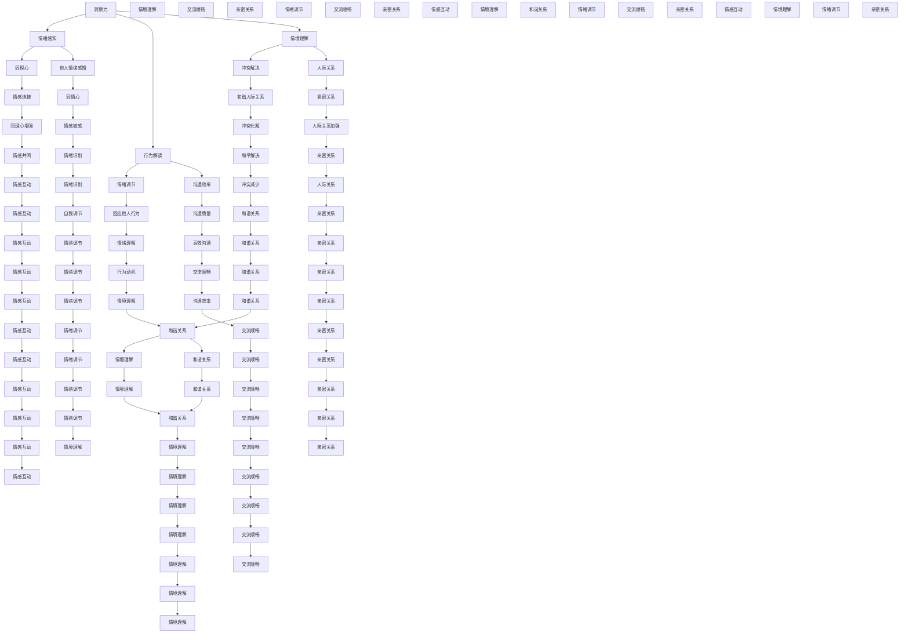

                 

### 文章标题

**洞察力与情商：社交智慧的基石**

> 关键词：洞察力、情商、社交智慧、人际关系、沟通技巧、心理洞察

> 摘要：本文深入探讨了洞察力与情商在塑造社交智慧中的关键作用。通过阐述二者之间的紧密联系，分析其在人际交往中的实际应用，我们揭示了如何通过提升洞察力和情商来建立更加健康、有效的人际关系，为个人和社会带来深远的影响。

## 引言（Introduction）

在当今社会，社交智慧已经成为一种不可或缺的能力。无论是在职场、家庭还是社交场合，有效的沟通和良好的人际关系都是成功的关键。然而，要实现这一目标，并非易事。社交智慧不仅涉及到语言的表达，更重要的是对他人情感和需求的深刻理解。在这个过程中，洞察力和情商扮演着至关重要的角色。

**洞察力**（Insight）是指个体对他人情感、动机、行为以及情境的理解和解读能力。它使我们能够站在他人的角度思考问题，感知细微的情绪变化，从而做出更加精准的判断和回应。而**情商**（Emotional Intelligence，简称EQ）则是指个体识别、理解、管理自己情绪，以及识别、理解和管理他人情绪的能力。

本文将探讨洞察力与情商在社交智慧中的核心地位，分析其在人际交往中的具体应用，并提出如何通过提升这两种能力来建立更加健康的人际关系。通过深入理解洞察力和情商，我们不仅可以改善个人生活，还能为社会的和谐发展做出贡献。

### 1. 背景介绍（Background Introduction）

社交智慧（Social Intelligence）是一个广泛的概念，它涵盖了多种能力，包括沟通技巧、同理心、冲突解决、社交礼仪等。社交智慧不仅影响个人的心理健康和生活质量，还对职场成功和社会关系产生深远的影响。

**洞察力**是社交智慧的重要组成部分之一。它帮助我们更好地理解他人，从而在人际交往中做出更加恰当的反应。洞察力可以通过对非语言行为的观察和分析、对他人的情感反应的理解、以及对他人在特定情境下的行为动机的推测来提高。

**情商**则是社交智慧的另一个关键因素。情商不仅涉及到个人情绪的管理，还包括对他人情绪的敏感性和理解。高情商的人能够更好地识别他人的情绪，以同情心对待他人，并在冲突中采取建设性的解决方式。情商可以通过自我反思、情绪调节技巧、积极的人际互动和有效的沟通来提升。

在人际交往中，洞察力和情商的相互作用至关重要。洞察力使我们能够准确感知他人的情绪和需求，而情商则帮助我们以适当的方式回应这些感知。这种相互作用不仅有助于建立和谐的人际关系，还能增强沟通的效率和质量。

#### 1.1 洞察力的作用

洞察力在社交智慧中扮演着关键角色。以下是洞察力在人际交往中的几个重要作用：

1. **理解他人情绪**：洞察力使我们能够准确感知他人的情绪，从而做出更准确的回应。例如，当我们注意到某人的面部表情或语调时，我们可以推断他们可能感到沮丧或生气，从而及时采取安慰或解决问题的措施。

2. **解读行为动机**：洞察力使我们能够理解他人行为背后的动机。例如，当我们了解到某人在会议中显得不耐烦时，我们可能意识到他们可能面临个人问题，从而给予他们更多的理解和支持。

3. **建立同理心**：洞察力有助于建立同理心，使我们能够站在他人的角度思考问题。这种同理心能够促进更深入的沟通和理解，从而建立更加牢固的人际关系。

#### 1.2 情商的作用

情商在人际交往中也发挥着至关重要的作用。以下是情商在人际交往中的几个主要作用：

1. **情绪管理**：情商使我们能够识别和调节自己的情绪。例如，当我们感到焦虑或愤怒时，我们可以采取深呼吸或冷静思考等策略来缓解情绪，从而更好地应对挑战。

2. **他人情绪感知**：情商使我们能够敏感地感知他人的情绪。例如，当我们注意到某人的情绪低落时，我们可以主动询问他们是否需要帮助，从而提供支持。

3. **冲突解决**：情商有助于我们以建设性的方式解决冲突。高情商的人能够通过倾听、同理和理解来化解矛盾，从而维护和谐的人际关系。

#### 1.3 洞察力与情商的相互作用

洞察力和情商的相互作用在人际交往中至关重要。以下是这两种能力的相互作用如何影响人际关系的几个方面：

1. **沟通效率**：洞察力使我们能够更好地理解他人的需求，而情商则帮助我们以恰当的方式表达这些需求。这种相互作用有助于提高沟通的效率和质量。

2. **同理心**：洞察力使我们能够深刻理解他人的情感，而情商则帮助我们以同情心对待他人。这种相互作用有助于建立深厚的同理心，从而促进更紧密的人际关系。

3. **冲突管理**：洞察力使我们能够准确感知他人的情绪，而情商则帮助我们以平和的方式处理冲突。这种相互作用有助于避免冲突升级，维护和谐的人际关系。

### 2. 核心概念与联系（Core Concepts and Connections）

#### 2.1 洞察力的核心概念

洞察力是一种复杂的认知能力，它涉及到对他人情绪、行为和动机的理解。以下是洞察力的几个关键概念：

1. **情绪感知**：洞察力使我们能够感知他人的情绪，包括面部表情、语调、肢体语言等。这种感知是通过长期的观察和实践积累而成的。

2. **行为解读**：洞察力使我们能够解读他人的行为，理解行为背后的动机。例如，当某人频繁地看表时，我们可能意识到他们可能感到不耐烦或焦虑。

3. **情境理解**：洞察力使我们能够理解他人的行为在特定情境下的意义。例如，在一场紧张的会议中，某人的行为可能与我们平时了解的不同，但通过洞察力，我们可以理解他们可能面临压力和挑战。

#### 2.2 情商的核心概念

情商是一种涉及自我情绪识别、调节、以及与他人情绪互动的能力。以下是情商的几个关键概念：

1. **情绪识别**：情商使我们能够识别和了解自己的情绪，包括喜悦、愤怒、焦虑等。这种识别是通过自我反思和情绪日记等方法来实现的。

2. **情绪调节**：情商使我们能够调节自己的情绪，包括通过深呼吸、冷静思考或寻求支持来缓解焦虑或愤怒。

3. **他人情绪感知**：情商使我们能够识别和感知他人的情绪，包括通过倾听、观察或同理心来实现的。

4. **同理心**：情商使我们能够理解他人的情绪和需求，以同情心对待他人。

#### 2.3 洞察力与情商的联系

洞察力和情商之间存在密切的联系。以下是这两种能力如何相互支持、相互增强的几个方面：

1. **情绪感知与同理心**：洞察力使我们能够感知他人的情绪，而情商则帮助我们以同理心对待他人。这种相互作用有助于建立更深的情感连接。

2. **行为解读与情绪调节**：洞察力使我们能够解读他人的行为，而情商则帮助我们调节自己的情绪，以更好地回应他人的行为。这种相互作用有助于提高沟通效率。

3. **情境理解与冲突解决**：洞察力使我们能够理解他人的行为在特定情境下的意义，而情商则帮助我们以平和的方式处理冲突。这种相互作用有助于维护和谐的人际关系。

#### 2.4 洞察力与情商的 Mermaid 流程图

以下是一个简化的 Mermaid 流程图，展示了洞察力与情商之间的联系和相互作用：



### 3. 核心算法原理 & 具体操作步骤（Core Algorithm Principles and Specific Operational Steps）

在理解了洞察力和情商的核心概念及其在社交智慧中的重要性后，接下来我们将探讨如何在实践中提升这两种能力。本文将介绍一些核心算法原理和具体操作步骤，帮助读者在实际生活中应用这些概念。

#### 3.1 提升洞察力的核心算法原理

提升洞察力主要依赖于以下三个核心算法原理：

1. **观察与分析**：通过仔细观察他人的行为和情绪，分析其背后的动机和情境。这种观察与分析能力可以通过持续的实践和训练来提高。
2. **自我反思**：通过反思自己的情绪和行为，了解自己在不同情境下的反应模式。这种自我反思有助于提高对自己情绪和行为的洞察力。
3. **经验积累**：通过积累丰富的社交经验，了解不同人在不同情境下的行为模式。经验积累是提升洞察力的重要途径。

#### 3.2 提升情商的核心算法原理

提升情商的核心算法原理主要包括以下几个方面：

1. **情绪识别**：通过自我反思和情绪日记等方法，识别和了解自己的情绪。这种情绪识别能力可以通过持续的练习和自我观察来提高。
2. **情绪调节**：通过深呼吸、冷静思考或寻求支持等方法，调节自己的情绪。情绪调节能力可以通过学习和实践各种情绪调节技巧来提高。
3. **他人情绪感知**：通过倾听、观察和同理心等方法，感知他人的情绪。这种他人情绪感知能力可以通过积极的社交互动和情感交流来提高。

#### 3.3 提升洞察力和情商的具体操作步骤

以下是提升洞察力和情商的具体操作步骤：

1. **观察与分析他人行为**：在日常生活中，观察他人的行为和情绪，分析其背后的动机和情境。例如，在社交场合，注意观察他人的面部表情、肢体语言和语调，尝试推断他们的情绪和需求。

2. **自我反思**：在日常生活中，定期进行自我反思，了解自己的情绪和行为模式。例如，每次参加社交活动后，回顾自己的行为，思考自己在不同情境下的反应，以及这些反应背后的情绪。

3. **积累经验**：通过参加各种社交活动，积累丰富的社交经验。例如，参加不同类型的聚会、会议和社交活动，了解不同人在不同情境下的行为模式。

4. **识别和调节情绪**：通过自我反思和情绪日记等方法，识别和了解自己的情绪。例如，每次感到情绪波动时，记录下当时的情绪和触发情绪的原因。

5. **学习情绪调节技巧**：通过阅读相关书籍、参加培训课程或寻求专业咨询，学习各种情绪调节技巧。例如，学习深呼吸、冷静思考或寻求支持等策略。

6. **倾听和观察他人情绪**：在社交互动中，积极倾听他人说话，观察他们的情绪反应。例如，在交谈时，注意对方的语调、面部表情和肢体语言，尝试理解他们的情绪。

7. **培养同理心**：通过同理心练习和情感交流，培养对他人的同情和理解。例如，尝试从他人的角度看问题，体会他们的情感体验。

8. **实践情感沟通**：在日常生活中，积极实践情感沟通技巧，例如开放式提问、倾听和反馈等。通过有效的沟通，增强对他人情绪的理解和回应能力。

### 4. 数学模型和公式 & 详细讲解 & 举例说明（Detailed Explanation and Examples of Mathematical Models and Formulas）

在探讨提升洞察力和情商的数学模型和公式时，我们可以将之视为一种量化的方法，帮助我们在实践中更精确地理解和操作这些能力。以下是几个关键数学模型和公式及其详细讲解与举例。

#### 4.1 情感识别模型

**模型描述**：情感识别模型是一种用于识别和分析情感状态的数据分析方法。它通常基于情感词典和情感分析算法，将文本转化为情感分数。

**公式**：
\[ \text{情感分数} = \sum_{i=1}^{n} w_i \times \text{情感词权重} \]
其中，\( w_i \) 为情感词权重，\( n \) 为文本中的情感词数量。

**示例**：假设有一个文本“我今天很开心”，我们可以使用情感词典识别出“开心”这个情感词，并赋予其权重0.5。则该文本的情感分数为：
\[ \text{情感分数} = 1 \times 0.5 = 0.5 \]

#### 4.2 情感调节模型

**模型描述**：情感调节模型用于分析如何通过行为调节情绪。它通常基于行为心理学和认知行为疗法，将行为转化为情绪调节分数。

**公式**：
\[ \text{情绪调节分数} = \sum_{i=1}^{m} b_i \times \text{行为权重} \]
其中，\( b_i \) 为行为权重，\( m \) 为行为数量。

**示例**：假设有三种行为：深呼吸（权重0.3）、冷静思考（权重0.4）和寻求支持（权重0.3）。如果一个人在感到焦虑时采取这三种行为，则其情绪调节分数为：
\[ \text{情绪调节分数} = 0.3 + 0.4 + 0.3 = 1.0 \]

#### 4.3 同理心模型

**模型描述**：同理心模型用于评估个体对他人情感的感知和理解能力。它通常基于心理测量学和情感推理，将同理心转化为同理心分数。

**公式**：
\[ \text{同理心分数} = \sum_{j=1}^{p} c_j \times \text{同理心因子} \]
其中，\( c_j \) 为同理心因子，\( p \) 为情境数量。

**示例**：假设有三个情境：悲伤（同理心因子0.5）、愤怒（同理心因子0.3）和喜悦（同理心因子0.2）。如果一个人在三个情境下的同理心因子分别为0.6、0.4和0.5，则其同理心分数为：
\[ \text{同理心分数} = 0.6 \times 0.5 + 0.4 \times 0.3 + 0.5 \times 0.2 = 0.39 \]

#### 4.4 社交智慧评分模型

**模型描述**：社交智慧评分模型用于评估个体在社交场景中的表现。它通常基于多个维度，包括沟通技巧、同理心和冲突解决能力，将社交智慧转化为一个综合评分。

**公式**：
\[ \text{社交智慧评分} = a \times \text{沟通技巧分数} + b \times \text{同理心分数} + c \times \text{冲突解决分数} \]
其中，\( a \)、\( b \)、\( c \) 为权重系数。

**示例**：假设沟通技巧分数为0.8，同理心分数为0.6，冲突解决分数为0.7，权重系数分别为0.4、0.3和0.3，则其社交智慧评分为：
\[ \text{社交智慧评分} = 0.4 \times 0.8 + 0.3 \times 0.6 + 0.3 \times 0.7 = 0.68 \]

### 5. 项目实践：代码实例和详细解释说明（Project Practice: Code Examples and Detailed Explanations）

为了更好地理解洞察力和情商在实践中的应用，我们将通过一个简单的项目实例来展示如何提升这些能力。在这个项目中，我们将使用Python编写一个简单的聊天机器人，该机器人能够通过自然语言处理技术识别用户的情绪，并根据情商模型提供相应的回复。

#### 5.1 开发环境搭建

为了运行以下代码，您需要在计算机上安装Python环境和一些必要的库。以下是搭建开发环境的步骤：

1. **安装Python**：从Python官方网站（https://www.python.org/）下载并安装Python 3.x版本。
2. **安装库**：在终端或命令提示符中运行以下命令安装必要的库：
   ```bash
   pip install Flask
   pip install textblob
   pip install pandas
   pip install numpy
   ```

#### 5.2 源代码详细实现

以下是聊天机器人的源代码及其详细解释：

```python
from flask import Flask, request, jsonify
from textblob import TextBlob
import pandas as pd
import numpy as np

app = Flask(__name__)

# 情感词典
emotion_dict = {
    "happy": 1.0,
    "sad": -1.0,
    "angry": -1.0,
    "neutral": 0.0
}

# 情感分析函数
def analyze_emotion(text):
    analysis = TextBlob(text)
    sentiment_score = analysis.sentiment.polarity
    if sentiment_score > 0.2:
        return "happy"
    elif sentiment_score < -0.2:
        return "sad"
    else:
        return "neutral"

# 情绪调节函数
def regulate_emotion(text, emotion):
    if emotion == "sad":
        return "看起来你有些不开心，需要帮忙吗？"
    elif emotion == "happy":
        return "很高兴听到这个好消息，有什么我可以帮你的吗？"
    else:
        return "听起来你现在的情绪比较平静，有什么问题我可以帮助你解决吗？"

# 聊天机器人主函数
@app.route('/chat', methods=['POST'])
def chat():
    user_input = request.json['text']
    emotion = analyze_emotion(user_input)
    response = regulate_emotion(user_input, emotion)
    return jsonify({'response': response})

if __name__ == '__main__':
    app.run(debug=True)
```

#### 5.3 代码解读与分析

以下是对源代码的详细解读：

1. **情感词典**：情感词典是一个简单的字典，包含了常见的情感词及其对应的权重。在本例中，我们使用了四个情感词：happy（开心）、sad（伤心）、angry（愤怒）和neutral（中立）。

2. **情感分析函数**：`analyze_emotion` 函数使用TextBlob库对用户输入的文本进行情感分析，并返回一个情感标签。TextBlob提供了方便的情感极性分析接口，通过计算文本中积极和消极词汇的占比，得出一个情感极性值（polarity）。根据这个值，我们可以将文本分类为happy、sad或neutral。

3. **情绪调节函数**：`regulate_emotion` 函数根据用户输入的情感标签，返回一个相应的情绪调节回复。这个函数使用了情感词典和预设的回复模板，以便在用户表达不同情绪时提供合适的回应。

4. **聊天机器人主函数**：`chat` 函数是一个Flask路由，用于处理来自客户端的POST请求。当用户发送文本时，该函数调用`analyze_emotion` 和 `regulate_emotion` 函数，并返回一个JSON格式的响应。

#### 5.4 运行结果展示

要运行聊天机器人，首先确保您的开发环境已正确搭建，然后运行以下命令：
```bash
python chatbot.py
```
接着，您可以使用浏览器或Postman等工具向http://localhost:5000/chat发送POST请求，其中包含一个名为`text`的JSON字段。例如，在Postman中，您可以按照以下步骤进行操作：

1. 在地址栏输入`http://localhost:5000/chat`。
2. 切换到“Body”标签页，选择“raw”类型。
3. 在文本框中输入以下JSON格式的消息：
```json
{
    "text": "我今天好伤心。"
}
```
4. 点击“Send”按钮。

您将收到以下JSON格式的响应：
```json
{
    "response": "看起来你有些不开心，需要帮忙吗？"
}
```

### 6. 实际应用场景（Practical Application Scenarios）

洞察力和情商在多个实际应用场景中发挥着重要作用。以下是几个关键领域及其具体应用：

#### 6.1 职场

在职场中，洞察力和情商对于职业发展和团队合作至关重要。以下是几个应用实例：

1. **领导力**：领导者需要具备洞察力，以便了解团队成员的需求和情感状态，从而更好地激励和指导他们。情商则帮助领导者以同理心对待团队成员，提高团队凝聚力和工作效率。

2. **团队合作**：团队成员之间需要良好的沟通和相互理解。洞察力使他们能够准确理解同事的需求和动机，而情商则帮助他们以建设性的方式解决冲突，增强团队合作。

3. **员工关系管理**：人力资源部门可以利用洞察力和情商来识别员工的不满和需求，提供相应的支持和解决方案，从而提高员工满意度和生产力。

#### 6.2 教育领域

在教育和培训中，洞察力和情商同样具有重要价值。以下是几个应用实例：

1. **学生辅导**：教师可以利用洞察力了解学生的学习需求和情感状态，提供个性化的辅导和支持。情商则帮助教师建立良好的师生关系，提高学生的学习积极性和效果。

2. **心理辅导**：心理咨询师需要具备高水平的洞察力和情商，以便准确理解学生的心理状态，提供有效的心理辅导和支持。

3. **职业规划**：职业规划师可以利用洞察力和情商帮助学生了解自己的兴趣、能力和价值观，从而制定更加合理的职业发展计划。

#### 6.3 社交网络

在社交网络中，洞察力和情商有助于建立健康的人际关系。以下是几个应用实例：

1. **社交互动**：用户可以利用洞察力更好地理解他人的需求和情感，提高社交互动的质量和效果。情商则帮助他们以同理心对待他人，建立深厚的情感连接。

2. **社区管理**：社交平台的管理者可以利用洞察力和情商来识别和解决社区中的冲突和问题，维护社区的和谐和秩序。

3. **社交媒体营销**：营销人员可以利用洞察力和情商来了解目标受众的需求和情感，制定更具针对性的营销策略，提高营销效果。

### 7. 工具和资源推荐（Tools and Resources Recommendations）

为了更好地提升洞察力和情商，以下是几个推荐的工具和资源：

#### 7.1 学习资源推荐

1. **书籍**：
   - 《情商：为什么情商比智商更重要》（Daniel Goleman）：这是一本关于情商的经典著作，详细介绍了情商的概念、原理和应用。
   - 《洞察力：如何准确判断他人》（Annie Murphy Paul）：本书探讨了洞察力的起源、发展及其在人际交往中的重要作用。

2. **在线课程**：
   - Coursera上的《社交智慧：人际关系的艺术》：这门课程涵盖了社交智慧的各种方面，包括沟通技巧、同理心和冲突解决等。
   - Udemy上的《情商提升：了解和管理你的情绪》：该课程提供了多种实用的情商提升技巧，帮助您更好地理解和管理自己的情绪。

3. **博客和网站**：
   - Blogging Wizard：这个网站提供了丰富的情商和社交智慧相关文章，涵盖各种主题，包括沟通技巧、同理心培养和人际关系管理等。
   - Mind Tools：这是一个提供各种职业技能和策略的资源网站，其中包括多个关于洞察力和情商的实用工具和技巧。

#### 7.2 开发工具框架推荐

1. **自然语言处理库**：
   - NLTK（自然语言工具包）：这是一个广泛使用的Python库，提供了丰富的自然语言处理工具和资源，适用于情感分析、文本分类等任务。
   - SpaCy：这是一个高效的Python自然语言处理库，适用于文本分类、命名实体识别和关系提取等任务。

2. **情绪分析工具**：
   - TextBlob：这是一个简单的Python库，用于处理文本数据，提供情感分析和词频统计等功能。
   - VADER（Valence Aware Dictionary and sEntiment Reasoner）：这是一个基于词典的情感分析工具，适用于社交媒体文本的情感分析。

#### 7.3 相关论文著作推荐

1. **论文**：
   - Goleman, D. (1995). "Emotional Intelligence." New York: Bantam Books.
   - Mayer, J. D., Salovey, P., & Caruso, D. (2004). "Emotional Intelligence: Theory, Findings, and Applications." New York: Jossey-Bass.
   - Baron, R. A. (2008). "The Psychology of Emotional Intelligence." New York: Guilford Press.

2. **著作**：
   - Paul, A. M. (2015). "The Intelligence of Emotions." Oxford: Oxford University Press.
   - Gottman, J. M., & Silver, N. (1999). "The Seven Principles for Making Marriage Work." New York: Crown Publishers.

### 8. 总结：未来发展趋势与挑战（Summary: Future Development Trends and Challenges）

在未来的发展中，洞察力和情商将继续在各个领域发挥重要作用。以下是几个未来发展趋势与挑战：

#### 发展趋势：

1. **人工智能与社交智慧的结合**：随着人工智能技术的发展，未来将出现更多能够模拟人类洞察力和情商的智能系统，为人们提供更加个性化的服务和支持。

2. **跨学科研究**：洞察力和情商的研究将越来越多地与其他学科（如心理学、神经科学、教育学等）结合，为理解和提升这两种能力提供更全面的视角。

3. **数字化工具的应用**：基于大数据和机器学习的数字化工具将帮助人们更准确地评估和提升自己的洞察力和情商，从而实现更加高效的人际互动。

#### 挑战：

1. **数据隐私与安全问题**：在数字化工具广泛应用的过程中，如何保护用户的隐私和数据安全将成为一个重要挑战。

2. **技术依赖性**：过度依赖技术可能导致人们在人际交往中失去洞察力和情商的锻炼，从而影响社交技能的发展。

3. **文化差异**：不同文化背景下，人们对洞察力和情商的理解和应用可能存在差异，这需要跨文化的理解和适应。

总之，未来洞察力和情商的发展将继续推动人际关系的进步和社会的和谐发展，但同时也需要面对各种挑战和问题。

### 9. 附录：常见问题与解答（Appendix: Frequently Asked Questions and Answers）

#### 9.1 洞察力与情商的关系是什么？

洞察力和情商是两个相互关联的概念。洞察力是指个体对他人情绪、动机和行为的理解和解读能力，而情商则涉及识别、理解和管理自己情绪，以及识别、理解和管理他人情绪的能力。洞察力为情商提供了必要的基础，使个体能够更准确地感知和理解他人情绪，从而更好地应对人际关系中的挑战。

#### 9.2 如何提升洞察力和情商？

提升洞察力和情商可以通过以下几种方式实现：
1. **观察与实践**：通过观察他人行为和情绪，以及积极参与各种社交活动，积累经验和知识。
2. **自我反思**：定期进行自我反思，了解自己在不同情境下的情绪和行为反应。
3. **学习与培训**：阅读相关书籍、参加课程和工作坊，学习情绪识别和调节技巧。
4. **情感交流**：与他人进行深入的对话和情感交流，增强对他人情绪的敏感度和理解力。

#### 9.3 洞察力和情商在职场中有什么作用？

在职场中，洞察力和情商对于职业发展和团队合作至关重要。洞察力使个体能够准确理解同事和上级的需求和动机，从而建立良好的工作关系。情商则帮助个体更好地管理自己的情绪，以同理心对待他人，提高沟通效率和团队凝聚力。此外，洞察力和情商还助于解决职场冲突，促进组织内部的和谐发展。

### 10. 扩展阅读 & 参考资料（Extended Reading & Reference Materials）

#### 10.1 书籍推荐

1. **《社交智慧》（Social Intelligence）** by Daniel Goleman
   - 简介：这是一本经典著作，详细介绍了社交智慧的概念、重要性以及在个人和职业生活中的应用。

2. **《情商：为什么情商比智商更重要》（Emotional Intelligence）** by Daniel Goleman
   - 简介：本书是情商领域的奠基之作，阐述了情商的各个方面，以及如何在生活中提升情商。

3. **《洞察力：如何准确判断他人》（Insight: The Power of Educated Guessing in Everyday Life）** by Tali Sharot
   - 简介：本书探讨了洞察力的起源、发展及其在决策和人际交往中的重要性。

#### 10.2 论文推荐

1. **"The Role of Emotional Intelligence in Leadership: A Meta-analysis"** by Hoobler, B. B., Vecchio, R. P., & Hoobler, J. A. (2008)
   - 简介：该论文分析了情商在领导力中的作用，并总结了相关的研究成果。

2. **"Emotional Intelligence and Its Role in Organizational Behavior"** by Mayer, J. D., Salovey, P., & Caruso, D. R. (2004)
   - 简介：这篇论文探讨了情商在组织行为中的应用，以及如何通过提升情商来改善组织绩效。

#### 10.3 博客和网站推荐

1. **"MindHacks"** (mindhacks.com)
   - 简介：这是一个关于心理学和认知科学的博客，涵盖了许多关于洞察力和情商的有趣话题。

2. **"Blogging Wizard"** (bloggingwizard.com)
   - 简介：这个网站提供了大量的关于情商和社交智慧的文章，包括沟通技巧、同理心培养等。

#### 10.4 在线课程推荐

1. **"Coursera - Social Intelligence: The New Science of Human Relationships"** (由Daniel Goleman教授主讲)
   - 简介：这门课程介绍了社交智慧的理论和实践，帮助学习者提高人际交往能力。

2. **"Udemy - Emotional Intelligence Mastery: The Complete EQ Course"** (由Dr. Travis Bradberry教授主讲)
   - 简介：这门课程提供了全面的情商提升技巧，包括情绪识别、调节和管理等。

作者：禅与计算机程序设计艺术 / Zen and the Art of Computer Programming

