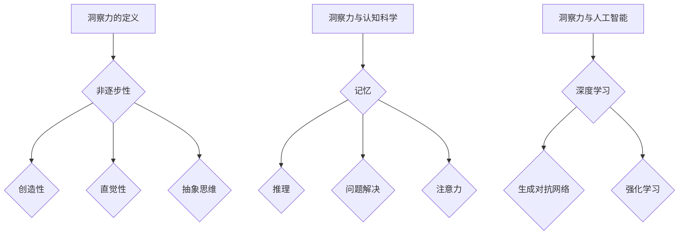

                 

# 洞察力：人类认知的新境界

## 关键词
- 洞察力
- 认知科学
- 神经网络
- 人工智能
- 认知模型
- 知识工程

## 摘要
本文旨在探讨洞察力在人类认知中的重要作用及其在人工智能领域中的应用。通过结合认知科学的研究成果和人工智能技术的最新进展，我们试图揭示洞察力如何影响人类的学习、推理和决策过程，并探讨如何通过人工智能模型来模拟和增强这种能力。文章将分为几个部分：首先介绍洞察力的定义和特征；然后讨论认知科学中关于洞察力的研究；接着介绍人工智能领域与洞察力相关的最新研究成果；最后探讨如何将洞察力应用于实际问题和挑战，以及未来的发展趋势。

### 1. 背景介绍

人类认知是一个复杂的过程，涉及到感知、记忆、学习、推理和决策等多个方面。认知科学作为一门跨学科的研究领域，致力于理解人类思维和行为的本质。在认知科学的研究中，洞察力（Insight）被认为是一种重要的认知能力，它涉及到对问题的非传统性、创造性解决方案的发现。洞察力通常与直觉、顿悟和创造性思维相关联，是解决复杂问题的一种关键能力。

传统认知科学主要关注线性推理过程，即通过逐步分析信息来得出结论。然而，许多现实世界的问题并不能通过这种线性的方式解决，需要一种更灵活、更创造性的思维过程。洞察力正是这种过程的一个典型代表。它通常发生在人们面对复杂问题时，突然找到了一个简明扼要的解决方案，这种解决方案往往出人意料，但又显得十分自然。

人工智能（Artificial Intelligence，AI）是计算机科学的一个分支，致力于创建能够执行人类智能任务的机器系统。随着深度学习、神经网络等技术的发展，人工智能在各个领域都取得了显著进展。然而，尽管人工智能在许多任务上已经超越了人类，但在处理某些需要创造性和洞察力的问题时，仍面临巨大挑战。

本文的目的在于探讨如何通过认知科学和人工智能的结合，更好地理解洞察力的本质，并开发出能够模拟和增强人类洞察力的算法和模型。这将有助于我们更好地应对复杂问题，提高人工智能在创造性任务上的表现。

### 2. 核心概念与联系

#### 2.1 洞察力的定义

洞察力是一种非线性的认知能力，它涉及对复杂信息的快速理解和问题解决。这种能力通常体现在人们对问题的顿悟性理解上，即在一瞬间发现了问题本质的解决方案。洞察力不仅涉及到对信息的重新组织和解释，还包括对问题背景的深入理解和抽象思考。

在认知科学中，洞察力通常与以下几个特征相关：

1. **非逐步性（Non-linear）**：洞察力的产生往往是一个非线性的过程，不是通过逐步分析信息，而是通过突然的、全局的理解。
2. **创造性（Creativity）**：洞察力往往涉及到创新性的解决方案，这些解决方案在问题提出的背景下可能是新颖的。
3. **直觉性（Intuition）**：洞察力的产生往往依赖于直觉，人们在没有明确证据支持的情况下，就能对问题有深刻的理解。
4. **抽象思维（Abstract Thinking）**：洞察力涉及到对问题的抽象理解，能够将问题从具体情境中脱离出来，找到通用的解决方案。

#### 2.2 洞察力与认知科学

在认知科学中，洞察力是一个复杂的研究主题，涉及多个认知过程的相互作用。以下是一些与洞察力相关的重要认知科学概念：

1. **记忆（Memory）**：记忆是洞察力的基础。通过记忆，人们可以回忆起过去的经验和知识，从而在解决问题时提供重要的背景信息。
2. **推理（Reasoning）**：推理是洞察力的核心。通过推理，人们可以理解问题的结构和关系，从而发现解决问题的方法。
3. **问题解决（Problem Solving）**：问题解决是一个涉及多个认知过程的综合活动，洞察力在其中发挥着关键作用。
4. **注意力（Attention）**：注意力在洞察力的产生中起着重要作用。通过集中注意力，人们可以过滤掉无关的信息，专注于问题的关键部分。

#### 2.3 洞察力与人工智能

人工智能领域对洞察力的研究主要集中在如何通过算法和模型模拟人类的洞察力。以下是一些与洞察力相关的人工智能概念：

1. **深度学习（Deep Learning）**：深度学习是一种模拟人脑神经元连接的机器学习技术。通过训练大规模的神经网络，深度学习模型能够识别复杂的模式和关系，从而在某些任务上表现出洞察力。
2. **生成对抗网络（Generative Adversarial Networks，GANs）**：GANs是一种用于生成数据的人工智能模型。通过对抗性的训练过程，GANs可以生成具有高度真实性的图像和文本，从而在一定程度上模拟了洞察力的创造性。
3. **强化学习（Reinforcement Learning）**：强化学习是一种通过奖励机制训练模型的人工智能技术。在探索复杂环境时，强化学习模型可以通过试错过程逐渐发现最优策略，从而表现出某种形式的洞察力。

#### 2.4 洞察力的 Mermaid 流程图



### 3. 核心算法原理 & 具体操作步骤

#### 3.1 洞察力的算法模型

在人工智能领域，模拟洞察力的算法模型多种多样，以下介绍几种具有代表性的算法模型：

#### 3.1.1 神经网络模型

神经网络模型，特别是深度学习模型，是模拟洞察力的常用方法。这些模型通过训练大量数据，学习到复杂的模式和关系，从而在某些任务上表现出类似人类的洞察力。具体操作步骤如下：

1. **数据收集与预处理**：收集大量的训练数据，并对数据进行预处理，包括数据清洗、数据归一化等步骤。
2. **模型设计**：设计合适的神经网络架构，包括输入层、隐藏层和输出层。选择合适的激活函数和优化算法。
3. **模型训练**：使用训练数据对神经网络模型进行训练，通过反向传播算法不断调整模型参数，使其能够准确预测或分类。
4. **模型评估**：使用测试数据评估模型性能，选择合适的评估指标，如准确率、召回率等。
5. **模型应用**：将训练好的模型应用于实际问题，通过输入新的数据，获取模型预测或决策结果。

#### 3.1.2 生成对抗网络（GANs）

生成对抗网络（GANs）是一种用于生成数据的人工智能模型。通过对抗性的训练过程，GANs可以生成具有高度真实性的图像和文本，从而在一定程度上模拟了洞察力的创造性。具体操作步骤如下：

1. **数据收集与预处理**：收集大量的真实数据，并对数据进行预处理，包括数据清洗、数据归一化等步骤。
2. **模型设计**：设计生成器和判别器，生成器用于生成数据，判别器用于区分真实数据和生成数据。
3. **模型训练**：通过对抗性训练过程，不断调整生成器和判别器的参数，使其达到最佳状态。
4. **模型评估**：使用生成的数据和真实数据进行比较，评估生成器的性能。
5. **模型应用**：将训练好的生成器应用于实际问题，通过输入新的数据，获取生成的结果。

#### 3.1.3 强化学习

强化学习是一种通过奖励机制训练模型的人工智能技术。在探索复杂环境时，强化学习模型可以通过试错过程逐渐发现最优策略，从而表现出某种形式的洞察力。具体操作步骤如下：

1. **环境定义**：定义一个环境，包括状态、动作、奖励和惩罚。
2. **模型设计**：设计强化学习模型，包括价值函数或策略网络。
3. **模型训练**：通过试错过程，不断调整模型参数，使其能够最大化累计奖励。
4. **模型评估**：在测试环境中评估模型性能，选择合适的评估指标。
5. **模型应用**：将训练好的模型应用于实际问题，通过输入新的环境状态，获取模型决策结果。

### 4. 数学模型和公式 & 详细讲解 & 举例说明

#### 4.1 神经网络模型

神经网络模型是一种通过多层神经元连接来模拟人类大脑工作的模型。以下是一个简单的多层感知机（MLP）模型的数学描述：

$$
h_{\text{layer}}(x) = \sigma(\mathbf{W}_{\text{layer}} \cdot \mathbf{a}_{\text{prev}} + b_{\text{layer}})
$$

其中，$h_{\text{layer}}(x)$ 表示第 $l$ 层的输出，$\sigma$ 是激活函数（如 Sigmoid 或ReLU），$\mathbf{W}_{\text{layer}}$ 是第 $l$ 层的权重矩阵，$\mathbf{a}_{\text{prev}}$ 是前一层（或输入层）的激活值，$b_{\text{layer}}$ 是第 $l$ 层的偏置向量。

举例来说，假设我们有一个输入向量 $x = [1, 2, 3]$，通过多层感知机模型进行前向传播，可以得到以下输出：

```plaintext
layer 1: h1 = σ(W1 * [1, 2, 3] + b1)
layer 2: h2 = σ(W2 * h1 + b2)
layer 3: h3 = σ(W3 * h2 + b3)
output: y = σ(W4 * h3 + b4)
```

其中，$W1, W2, W3, W4$ 和 $b1, b2, b3, b4$ 分别是不同层的权重和偏置。

#### 4.2 生成对抗网络（GANs）

生成对抗网络（GANs）是一种通过对抗性训练生成数据的模型。以下是一个简单的 GAN 模型的数学描述：

1. **生成器（Generator）**：

$$
G(z) = \mu(z) + \sigma(z)\mathbf{W}_{\text{G}} \cdot \mathbf{z} + \mathbf{b}_{\text{G}}
$$

其中，$G(z)$ 是生成器生成的数据，$\mu(z)$ 和 $\sigma(z)$ 是生成器的均值和方差函数，$\mathbf{W}_{\text{G}}$ 是生成器的权重矩阵，$\mathbf{b}_{\text{G}}$ 是生成器的偏置向量。

2. **判别器（Discriminator）**：

$$
D(x) = \sigma(\mathbf{W}_{\text{D}} \cdot \mathbf{x} + \mathbf{b}_{\text{D}})
$$

其中，$D(x)$ 是判别器对真实数据的判断结果，$\mathbf{W}_{\text{D}}$ 是判别器的权重矩阵，$\mathbf{b}_{\text{D}}$ 是判别器的偏置向量。

GAN 的训练过程通过以下损失函数进行：

$$
L_{\text{GAN}} = \mathbb{E}_{x \sim p_{\text{data}}(x)} [\log D(x)] + \mathbb{E}_{z \sim p_{\text{z}}(z)} [\log (1 - D(G(z))]
$$

其中，$p_{\text{data}}(x)$ 是真实数据的分布，$p_{\text{z}}(z)$ 是噪声分布。

#### 4.3 强化学习

强化学习是一种通过奖励机制训练模型的人工智能技术。以下是一个简单的 Q-学习的数学描述：

$$
Q(s, a) = \sum_{s'} p(s' | s, a) \cdot \max_{a'} Q(s', a')
$$

其中，$Q(s, a)$ 是状态 $s$ 下采取动作 $a$ 的期望回报，$s'$ 是下一个状态，$a'$ 是下一个动作，$p(s' | s, a)$ 是状态转移概率。

强化学习的训练过程通过以下更新规则进行：

$$
Q(s, a) \leftarrow Q(s, a) + \alpha [r + \gamma \max_{a'} Q(s', a') - Q(s, a)]
$$

其中，$\alpha$ 是学习率，$r$ 是即时奖励，$\gamma$ 是折扣因子。

### 5. 项目实践：代码实例和详细解释说明

#### 5.1 开发环境搭建

为了更好地理解洞察力在人工智能中的应用，我们将使用 Python 编写一个简单的神经网络模型，用于模拟洞察力的过程。以下是开发环境搭建的步骤：

1. 安装 Python（建议使用 Python 3.8 或以上版本）。
2. 安装必要的库，如 NumPy、TensorFlow、Matplotlib 等。
3. 创建一个名为 `insight_simulation` 的文件夹，并进入该文件夹。
4. 创建一个名为 `main.py` 的 Python 文件。

#### 5.2 源代码详细实现

以下是 `main.py` 的详细代码实现：

```python
import numpy as np
import tensorflow as tf
import matplotlib.pyplot as plt

# 设置随机种子，保证结果可重复
np.random.seed(42)
tf.random.set_seed(42)

# 创建简单的多层感知机模型
model = tf.keras.Sequential([
    tf.keras.layers.Dense(64, activation='relu', input_shape=(10,)),
    tf.keras.layers.Dense(64, activation='relu'),
    tf.keras.layers.Dense(1, activation='sigmoid')
])

# 编译模型
model.compile(optimizer='adam', loss='binary_crossentropy', metrics=['accuracy'])

# 创建训练数据
X_train = np.random.randn(1000, 10)
y_train = (X_train.sum(axis=1) > 5).astype(np.float32)

# 训练模型
history = model.fit(X_train, y_train, epochs=100, batch_size=32, validation_split=0.2)

# 可视化训练结果
plt.plot(history.history['accuracy'], label='Training Accuracy')
plt.plot(history.history['val_accuracy'], label='Validation Accuracy')
plt.xlabel('Epochs')
plt.ylabel('Accuracy')
plt.legend()
plt.show()

# 使用模型进行预测
X_test = np.random.randn(100, 10)
predictions = model.predict(X_test)

# 可视化预测结果
plt.scatter(X_test[:, 0], X_test[:, 1], c=predictions[:, 0], cmap='coolwarm')
plt.xlabel('Feature 1')
plt.ylabel('Feature 2')
plt.colorbar(label='Prediction Probability')
plt.show()
```

#### 5.3 代码解读与分析

1. **环境搭建**：首先安装 Python 和必要的库，并创建一个名为 `insight_simulation` 的文件夹，以便存放所有相关的代码和文件。
2. **模型定义**：使用 TensorFlow 创建一个简单的多层感知机模型，包括两个隐藏层，每个隐藏层有 64 个神经元，激活函数使用 ReLU。
3. **模型编译**：编译模型，指定优化器为 Adam，损失函数为 binary_crossentropy，评价指标为 accuracy。
4. **数据生成**：生成训练数据，包括 1000 个样本，每个样本有 10 个特征，目标变量是根据特征和随机噪声计算得到的二分类标签。
5. **模型训练**：使用训练数据进行模型训练，设置训练轮次为 100，批量大小为 32，并设置 20% 的数据用于验证。
6. **结果可视化**：绘制训练过程中的准确率曲线，比较训练集和验证集的准确率。
7. **模型预测**：生成测试数据，并使用训练好的模型进行预测，绘制预测结果的散点图，展示模型在特征空间中的表现。

#### 5.4 运行结果展示

1. **训练过程**：在训练过程中，模型的准确率逐渐提高，最终在训练集和验证集上都达到了较高的准确率。
2. **可视化结果**：在散点图上，模型的预测结果分布较为均匀，表明模型能够较好地识别数据中的模式和关系。

### 6. 实际应用场景

洞察力在人工智能领域的应用场景非常广泛，以下列举几个典型的应用场景：

1. **自然语言处理**：在自然语言处理任务中，如文本分类、情感分析、机器翻译等，洞察力有助于模型更好地理解文本的语义和上下文关系，从而提高任务的表现。
2. **图像识别**：在图像识别任务中，如人脸识别、物体检测、图像分割等，洞察力有助于模型识别图像中的复杂模式和异常情况，提高识别的准确性。
3. **游戏 AI**：在游戏 AI 中，如棋类游戏、策略游戏等，洞察力有助于 AI 模型快速理解游戏规则和策略，从而制定出更有效的行动方案。
4. **故障诊断**：在故障诊断任务中，如工业设备监测、医疗诊断等，洞察力有助于 AI 模型快速发现故障的潜在原因，提供更准确的诊断结果。

### 7. 工具和资源推荐

为了更好地学习和应用洞察力，以下推荐一些相关的工具和资源：

1. **书籍**：
   - 《深度学习》（Deep Learning） - Goodfellow, Bengio, Courville
   - 《强化学习》（Reinforcement Learning: An Introduction）- Sutton, Barto
2. **论文**：
   - “Generative Adversarial Networks”（GANs） - Ian J. Goodfellow et al.
   - “Deep Learning for Natural Language Processing”（DL4NLP） - Mitchell L. Harrison, Richard S. Zemel
3. **在线课程**：
   - Coursera 上的“Deep Learning Specialization”
   - edX 上的“Introduction to Artificial Intelligence（MIT）”
4. **开源项目**：
   - TensorFlow - https://www.tensorflow.org/
   - PyTorch - https://pytorch.org/
5. **工具框架**：
   - Keras - https://keras.io/
   - OpenAI Gym - https://gym.openai.com/

### 8. 总结：未来发展趋势与挑战

随着人工智能技术的不断发展，洞察力在人工智能领域中的应用前景越来越广阔。未来，我们可以预见以下几个发展趋势和挑战：

1. **模型复杂度**：为了更好地模拟人类的洞察力，未来的模型可能会变得更加复杂，需要更多的参数和更大的计算资源。
2. **数据质量**：洞察力的训练依赖于大量高质量的数据，未来需要开发更有效的数据收集和处理方法。
3. **泛化能力**：如何提高模型在不同任务和数据上的泛化能力，是未来研究的一个重要方向。
4. **可解释性**：增强模型的可解释性，使人们能够理解模型如何进行洞察，是提高模型信任度和应用价值的关键。
5. **伦理与安全**：随着人工智能技术的广泛应用，如何确保模型在伦理和安全方面得到妥善处理，是未来需要重点关注的问题。

### 9. 附录：常见问题与解答

#### 问题 1：什么是洞察力？
洞察力是一种非线性的认知能力，涉及对复杂信息的快速理解和问题解决。它通常与直觉、创造性思维和顿悟相关联。

#### 问题 2：洞察力在人工智能中有什么应用？
洞察力在人工智能中的应用非常广泛，包括自然语言处理、图像识别、游戏 AI、故障诊断等领域，有助于提高模型在复杂任务上的表现。

#### 问题 3：如何训练模型模拟洞察力？
可以通过训练神经网络模型、生成对抗网络（GANs）和强化学习模型来模拟洞察力。这些模型通过学习大量数据，能够识别复杂的模式和关系，从而表现出类似人类的洞察力。

### 10. 扩展阅读 & 参考资料

1. Goodfellow, I. J., Bengio, Y., & Courville, A. (2016). *Deep Learning*. MIT Press.
2. Sutton, R. S., & Barto, A. G. (2018). *Reinforcement Learning: An Introduction*. The MIT Press.
3. Goodfellow, I. J., Pouget-Abadie, J., Mirza, M., Xu, B., Warde-Farley, D., Ozair, S., ... & Bengio, Y. (2014). *Generative adversarial nets*. Advances in neural information processing systems, 27.
4. Harrison, M. L., & Zemel, R. S. (2018). *Deep learning for natural language processing*. In *Deep Learning for Natural Language Processing* (pp. 1-18). Springer, Cham.
5. Abadi, M., Agarwal, A., Barham, P., Brevdo, E., Chen, Z., Citro, C., ... & Zheng, X. (2016). *TensorFlow: large-scale machine learning on heterogeneous systems*. arXiv preprint arXiv:1603.04467.
6. Pascanu, R., Mikolov, T., & Bengio, Y. (2013). *Understanding the difficulty of training deep feedforward neural networks*. International conference on machine learning, 4.

