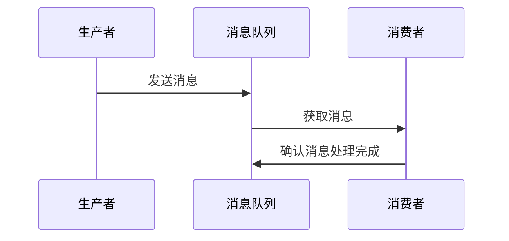
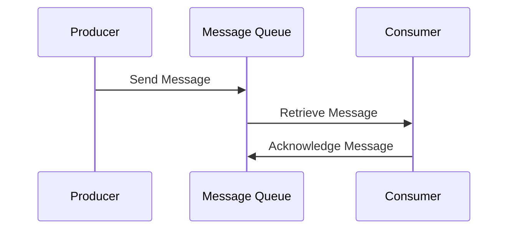

                 

### 文章标题

消息队列：原理与代码实例讲解

> 关键词：消息队列，异步通信，分布式系统，并发编程，代码实例

> 摘要：本文将深入探讨消息队列的概念、原理以及在实际开发中的应用。通过详细讲解消息队列的核心机制和代码实例，帮助读者理解如何利用消息队列解决分布式系统中的并发编程问题。

<|user|>### 1. 背景介绍（Background Introduction）

消息队列（Message Queue）是一种用于异步通信的分布式系统组件，它允许不同应用程序或系统之间通过发送和接收消息进行通信。消息队列的主要目的是解决分布式系统中数据传递和任务调度的问题，使得系统各个部分能够独立运行而不会互相干扰。

在实际开发中，消息队列被广泛应用于以下场景：

1. **任务调度**：通过消息队列可以高效地调度并发任务，例如发送电子邮件、处理图片缩略图生成、执行数据批量导入等。

2. **系统解耦**：通过消息队列可以降低系统之间的耦合度，实现各个系统模块之间的独立开发和部署。

3. **流量控制**：消息队列可以帮助实现流量控制，确保系统不会因流量激增而崩溃。

4. **数据持久化**：消息队列可以作为数据存储中间件，保证数据的可靠传输和持久化。

本篇文章将围绕消息队列的原理和代码实例进行讲解，旨在帮助读者深入理解消息队列的工作机制，并掌握如何在实际项目中使用消息队列。

<|user|>### 2. 核心概念与联系（Core Concepts and Connections）

#### 2.1 消息队列的基本概念

消息队列是一种先进先出（FIFO）的数据结构，用于存储和转发消息。在消息队列中，生产者（Producer）负责生成消息，并将消息放入队列中；消费者（Consumer）则从队列中取出消息进行处理。


#### 2.2 消息队列的核心机制

消息队列的核心机制包括以下几个方面：

1. **消息发送与接收**：生产者通过API将消息发送到消息队列中，消费者通过API从队列中获取消息。

2. **队列存储**：消息队列需要存储生产者发送的消息，以便消费者能够按顺序处理这些消息。

3. **并发处理**：消息队列允许多个消费者同时处理消息，从而提高系统的并发处理能力。

4. **容错性**：消息队列需要具备高可用性，确保在生产者或消费者发生故障时，系统能够继续正常运行。

5. **消息确认**：消费者在处理完消息后，需要向消息队列发送确认信号，表示消息已被成功处理。

#### 2.3 消息队列的架构

消息队列通常由以下几个主要组件构成：

1. **消息生产者**：负责生成和发送消息。

2. **消息队列**：存储和管理消息。

3. **消息消费者**：从消息队列中获取消息并进行处理。

4. **消息中间件**：提供消息队列的API和服务支持。


#### 2.4 消息队列与其他技术的联系

消息队列与以下技术密切相关：

1. **异步编程**：消息队列是实现异步编程的一种重要手段，它可以使得系统各个部分并行执行，从而提高系统性能。

2. **微服务架构**：消息队列在微服务架构中发挥着重要作用，用于实现服务之间的解耦和通信。

3. **分布式系统**：消息队列是分布式系统中的一种核心组件，用于实现跨节点和跨进程的数据传输。

4. **负载均衡**：消息队列可以帮助实现负载均衡，将任务均匀地分配给多个消费者。

#### 2.5 消息队列的优势

消息队列具有以下优势：

1. **异步处理**：消息队列可以实现任务的异步处理，从而提高系统响应速度。

2. **高可用性**：消息队列具备高可用性，可以在生产者或消费者发生故障时自动恢复。

3. **分布式处理**：消息队列支持分布式处理，可以提升系统的并发处理能力。

4. **可扩展性**：消息队列可以根据需求扩展消费者数量，实现系统的水平扩展。

5. **可靠性**：消息队列可以确保消息的可靠传输和持久化，防止数据丢失。

#### 2.6 消息队列的应用场景

消息队列适用于以下应用场景：

1. **任务调度**：用于执行定时任务、批量处理和后台任务。

2. **订单处理**：用于处理在线购物平台上的订单生成、支付和发货等环节。

3. **系统监控**：用于监控系统性能、日志收集和报警通知。

4. **消息通知**：用于发送短信、邮件和推送通知。

5. **分布式缓存**：用于实现分布式缓存系统中的数据同步和一致性保障。

<|user|>### 2.1 什么是消息队列？

消息队列（Message Queue，简称MQ）是一种用于异步通信的软件架构组件，它允许一个或多个生产者发送消息到一个中央的消息队列，然后一个或多个消费者从该队列中获取消息进行处理。消息队列的核心机制是基于生产者和消费者之间的解耦，这使得系统可以更灵活地扩展和更新。

在消息队列中，消息是一种数据结构，它通常包含一个唯一的标识符、消息内容以及相关的元数据（如发送时间、优先级等）。生产者负责生成消息并将它们放入消息队列中，而消费者则从队列中取出消息进行处理。这个过程通常是无状态的，即消费者不会修改消息队列中的消息内容。

消息队列的工作流程通常如下：

1. **生产者发送消息**：生产者通过API将消息发送到消息队列中。
2. **消息存储**：消息队列接收消息并将它们存储在内部数据结构中。
3. **消费者获取消息**：消费者通过API从消息队列中取出消息进行处理。
4. **消息确认**：消费者在处理完消息后，向消息队列发送确认信号，表示消息已被成功处理。

消息队列的这种设计使得系统中的不同组件可以独立运行，从而实现异步通信和高可用性。例如，一个网站的后台服务可以异步处理用户提交的表单，而不需要等待处理结果才能响应用户。

#### 2.2 消息队列的优点

消息队列具有以下优点：

1. **异步处理**：消息队列允许生产者和消费者独立工作，从而实现任务的异步处理，提高系统响应速度。
2. **高可用性**：消息队列可以支持多个消费者同时处理消息，并且具备容错性，即使某个消费者发生故障，系统也能自动恢复。
3. **分布式处理**：消息队列支持分布式系统中的数据传输和任务调度，可以提高系统的并发处理能力。
4. **可扩展性**：消息队列可以根据需求扩展消费者数量，实现系统的水平扩展。
5. **可靠性**：消息队列可以确保消息的可靠传输和持久化，防止数据丢失。

#### 2.3 消息队列的工作原理

消息队列的工作原理可以分为以下几个关键步骤：

1. **生产者发送消息**：生产者生成消息并将其发送到消息队列中。
2. **消息队列存储消息**：消息队列将消息存储在内部数据结构中，通常采用先进先出（FIFO）的顺序。
3. **消费者从消息队列获取消息**：消费者通过API从消息队列中获取消息进行处理。
4. **消息确认**：消费者在处理完消息后，向消息队列发送确认信号，表示消息已被成功处理。
5. **消息持久化**：在某些情况下，消息队列会持久化消息，以便在系统重启或消费者故障时能够恢复处理。

消息队列的工作流程可以用以下Mermaid流程图表示：



#### 2.4 消息队列的应用场景

消息队列广泛应用于各种应用场景，以下是一些常见的应用场景：

1. **任务调度**：例如，在电商系统中，可以使用消息队列来处理订单生成、支付通知和发货等后台任务。
2. **系统监控**：例如，在大型分布式系统中，可以使用消息队列来收集日志、监控性能和发送报警通知。
3. **异步处理**：例如，在社交网络中，可以使用消息队列来异步处理用户评论、点赞和私信等。
4. **流量控制**：例如，在网站流量高峰期，可以使用消息队列来控制请求流量，确保系统稳定运行。
5. **分布式缓存**：例如，在分布式缓存系统中，可以使用消息队列来同步缓存数据，保证数据一致性。

#### 2.5 消息队列的实现方式

消息队列可以通过多种方式实现，以下是一些常见的实现方式：

1. **基于文件**：例如，使用简单的文本文件或二进制文件作为消息队列，通过文件读写操作来实现消息发送和接收。
2. **基于数据库**：例如，使用数据库表或数据表来实现消息队列，通过数据库操作来实现消息发送和接收。
3. **基于内存**：例如，使用内存数据结构（如数组、链表等）来实现消息队列，通过内存操作来实现消息发送和接收。
4. **基于消息中间件**：例如，使用消息中间件（如RabbitMQ、Kafka、ActiveMQ等）来实现消息队列，通过消息中间件的API来实现消息发送和接收。

#### 2.6 消息队列的核心机制

消息队列的核心机制包括以下几个方面：

1. **消息发送与接收**：生产者和消费者通过消息队列进行消息的发送和接收。
2. **消息存储与检索**：消息队列需要存储消息并在需要时检索消息。
3. **消息确认与持久化**：消费者在处理完消息后需要向消息队列发送确认信号，并可选择将消息持久化以确保可靠传输。

下面是一个简单的消息队列实现示例（使用Python代码）：

```python
import heapq
import time

class MessageQueue:
    def __init__(self):
        self.messages = []

    def send_message(self, message):
        heapq.heappush(self.messages, message)

    def receive_message(self):
        if self.messages:
            return heapq.heappop(self.messages)
        else:
            return None

if __name__ == "__main__":
    mq = MessageQueue()

    # 模拟生产者发送消息
    for i in range(5):
        mq.send_message(f"Message {i}")

    # 模拟消费者接收消息
    while True:
        message = mq.receive_message()
        if message:
            print(f"Received message: {message}")
            time.sleep(1)
        else:
            break
```

在这个示例中，我们使用Python的heapq模块实现了一个简单的消息队列。生产者通过`send_message`方法将消息放入队列中，消费者通过`receive_message`方法从队列中取出消息进行处理。

#### 2.7 消息队列与其他技术的联系

消息队列与其他技术紧密相关，以下是一些常见的联系：

1. **异步编程**：消息队列是实现异步编程的一种重要方式，通过异步处理任务可以提高系统的响应速度和并发能力。
2. **微服务架构**：消息队列在微服务架构中发挥着重要作用，用于实现服务之间的解耦和通信。
3. **分布式系统**：消息队列是分布式系统中的一种核心组件，用于实现跨节点和跨进程的数据传输。
4. **负载均衡**：消息队列可以帮助实现负载均衡，将任务均匀地分配给多个消费者。

### 2. Core Concepts and Connections

#### 2.1 What is a Message Queue?

A message queue (MQ) is a software architecture component designed for asynchronous communication. It allows one or more producers to send messages to a central message queue, from which one or more consumers can retrieve and process messages. The core mechanism of a message queue is based on the decoupling between producers and consumers, enabling systems to be more flexible in their expansion and updates.

In a message queue, a message is a data structure that typically includes a unique identifier, message content, and associated metadata such as send time and priority. Producers are responsible for generating messages and placing them into the message queue, while consumers retrieve messages from the queue for processing. This process is generally stateless, meaning consumers do not modify the content of messages in the queue.

The workflow of a message queue generally consists of the following steps:

1. **Message Sending**: Producers generate messages and send them to the message queue via an API.
2. **Message Storage**: The message queue receives messages and stores them in an internal data structure, usually following a First-In-First-Out (FIFO) order.
3. **Message Retrieval**: Consumers retrieve messages from the message queue for processing through an API.
4. **Message Acknowledgment**: After processing a message, consumers send an acknowledgment back to the message queue to indicate that the message has been successfully handled.
5. **Message Persistence**: In some cases, message queues persist messages to ensure reliable transmission and prevent data loss, especially when there are failures in producers or consumers.

The design of a message queue enables different components within a system to operate independently, thus achieving asynchronous communication and high availability. For example, a backend service of a website can asynchronously process user-submitted forms without needing to wait for the processing results before responding to the user.

#### 2.2 Advantages of Message Queues

Message queues have the following advantages:

1. **Asynchronous Processing**: Message queues allow producers and consumers to work independently, thus enabling asynchronous processing of tasks and improving system response times.
2. **High Availability**: Message queues can support multiple consumers processing messages simultaneously and have fault tolerance, allowing the system to recover automatically if a consumer fails.
3. **Distributed Processing**: Message queues support data transmission and task scheduling in distributed systems, enhancing the system's concurrent processing capabilities.
4. **Scalability**: Message queues can be scaled horizontally by expanding the number of consumers as needed, enabling system expansion.
5. **Reliability**: Message queues ensure reliable transmission and persistence of messages, preventing data loss.

#### 2.3 Working Principles of Message Queues

The working principles of message queues can be broken down into the following key steps:

1. **Message Sending by Producers**: Producers generate messages and send them to the message queue via an API.
2. **Message Storage in the Queue**: The message queue receives messages and stores them in an internal data structure.
3. **Message Retrieval by Consumers**: Consumers retrieve messages from the message queue for processing through an API.
4. **Message Acknowledgment**: After processing a message, consumers send an acknowledgment to the message queue to indicate that the message has been successfully handled.
5. **Message Persistence**: In some cases, message queues persist messages to ensure reliable transmission and recovery in case of system restarts or consumer failures.

The workflow of a message queue can be represented using the following Mermaid flowchart:



#### 2.4 Application Scenarios of Message Queues

Message queues are widely used in various application scenarios, including:

1. **Task Scheduling**: For example, in e-commerce systems, message queues can be used to handle order generation, payment notifications, and shipment processing.
2. **System Monitoring**: For example, in large-scale distributed systems, message queues can be used to collect logs, monitor performance, and send alerts.
3. **Asynchronous Processing**: For example, in social networks, message queues can be used to handle user comments, likes, and private messages asynchronously.
4. **Traffic Control**: For example, during peak traffic periods on a website, message queues can be used to control request traffic, ensuring system stability.
5. **Distributed Caching**: For example, in distributed caching systems, message queues can be used to synchronize cache data and ensure data consistency.

#### 2.5 Implementation Methods of Message Queues

Message queues can be implemented in various ways, and the following are some common implementation methods:

1. **File-Based**: For example, simple text files or binary files can be used as message queues, with message sending and receiving achieved through file read and write operations.
2. **Database-Based**: For example, database tables can be used to implement message queues, with message sending and receiving achieved through database operations.
3. **Memory-Based**: For example, memory data structures such as arrays or linked lists can be used to implement message queues, with message sending and receiving achieved through memory operations.
4. **Message Middleware-Based**: For example, message middleware such as RabbitMQ, Kafka, or ActiveMQ can be used to implement message queues, with message sending and receiving achieved through the middleware's API.

#### 2.6 Core Mechanisms of Message Queues

The core mechanisms of message queues include the following aspects:

1. **Message Sending and Retrieval**: Producers and consumers send and retrieve messages through the message queue.
2. **Message Storage and Retrieval**: The message queue stores messages and retrieves them as needed.
3. **Message Acknowledgment and Persistence**: After processing a message, consumers send an acknowledgment to the message queue, and message persistence can be enabled to ensure reliable transmission.

Here is a simple example of a message queue implementation in Python:

```python
import heapq
import time

class MessageQueue:
    def __init__(self):
        self.messages = []

    def send_message(self, message):
        heapq.heappush(self.messages, message)

    def receive_message(self):
        if self.messages:
            return heapq.heappop(self.messages)
        else:
            return None

if __name__ == "__main__":
    mq = MessageQueue()

    # Simulating a producer sending messages
    for i in range(5):
        mq.send_message(f"Message {i}")

    # Simulating a consumer receiving messages
    while True:
        message = mq.receive_message()
        if message:
            print(f"Received message: {message}")
            time.sleep(1)
        else:
            break
```

In this example, we implement a simple message queue using Python's heapq module. The producer uses the `send_message` method to add messages to the queue, while the consumer uses the `receive_message` method to retrieve and process messages.

#### 2.7 Connections with Other Technologies

Message queues are closely related to other technologies, and the following are some common connections:

1. **Asynchronous Programming**: Message queues are an important means of implementing asynchronous programming, which can improve system response times and concurrent capabilities.
2. **Microservices Architecture**: Message queues play a crucial role in microservices architecture, enabling decoupling and communication between services.
3. **Distributed Systems**: Message queues are a core component in distributed systems, facilitating cross-node and cross-process data transmission.
4. **Load Balancing**: Message queues can help achieve load balancing by distributing tasks evenly among multiple consumers.

