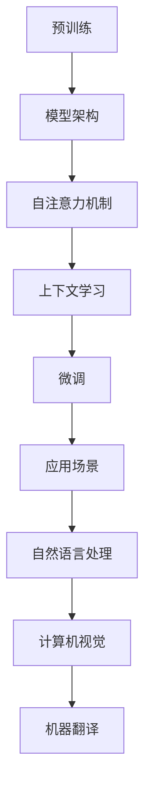

                 

# 文章标题

## 涌现能力与上下文学习：大模型的核心优势

> 关键词：涌现能力，上下文学习，大模型，人工智能，语言模型，深度学习

> 摘要：本文旨在探讨大模型在涌现能力和上下文学习方面的核心优势。通过对大模型架构、训练过程以及应用场景的深入分析，揭示大模型如何通过上下文学习实现智能的涌现，从而推动人工智能技术的发展。

## 1. 背景介绍

随着深度学习和人工智能技术的飞速发展，大模型已成为当前研究的热点。大模型通常指的是具有数十亿甚至千亿参数规模的神经网络模型，如GPT-3、BERT等。这些模型在自然语言处理、计算机视觉、机器翻译等任务上取得了显著的成果。然而，大模型的崛起不仅仅是因为其庞大的参数规模，更重要的是其具备的涌现能力和上下文学习特性。

### 1.1 涌现能力的定义

涌现能力是指在一个复杂系统中，个体之间相互作用产生的新现象，这些现象无法从个体行为中直接预测或推导出来。在人工智能领域，涌现能力体现为模型在特定任务上表现出超越人类专家的能力，如生成逼真的图像、撰写流畅的文本等。

### 1.2 上下文学习的概念

上下文学习是指模型在处理输入数据时，能够利用上下文信息进行推断和决策的能力。在自然语言处理任务中，上下文学习尤为重要，因为语言具有很强的上下文依赖性。大模型通过大规模的预训练，能够充分掌握语言的上下文信息，从而实现高质量的文本生成和理解。

## 2. 核心概念与联系

为了更好地理解大模型的涌现能力和上下文学习，我们需要从模型架构、训练过程和应用场景三个方面进行探讨。

### 2.1 模型架构

大模型通常采用深度神经网络架构，如Transformer。Transformer模型的核心思想是使用自注意力机制（Self-Attention）来捕捉输入数据中的长距离依赖关系。自注意力机制允许模型在生成每个词时，自动地考虑其他词的影响，从而提高了文本生成的质量。

### 2.2 训练过程

大模型的训练过程分为两个阶段：预训练和微调。在预训练阶段，模型在大规模语料库上进行训练，学习语言的基本规律和结构。这一阶段的关键是利用上下文信息，使模型能够理解词汇之间的关联。在微调阶段，模型根据特定任务的需求进行细粒度的调整，从而实现高性能的任务表现。

### 2.3 应用场景

大模型在自然语言处理、计算机视觉、机器翻译等领域具有广泛的应用。以自然语言处理为例，大模型可以用于文本生成、文本分类、问答系统等任务。在这些任务中，涌现能力和上下文学习使得大模型能够生成高质量的内容，并具有自适应的能力。

### 2.4 Mermaid 流程图



## 3. 核心算法原理 & 具体操作步骤

### 3.1 Transformer 模型原理

Transformer 模型是由 Vaswani 等人于 2017 年提出的一种基于自注意力机制的深度神经网络模型。它主要由编码器（Encoder）和解码器（Decoder）两部分组成，用于处理序列到序列的任务。

### 3.2 自注意力机制

自注意力机制是一种基于输入序列计算权重，然后将这些权重应用于输入序列的方法。在 Transformer 模型中，自注意力机制通过多头注意力（Multi-Head Attention）来提高模型的表示能力。

### 3.3 上下文学习过程

在预训练阶段，模型通过大规模语料库进行训练，学习语言的基本规律和结构。具体操作步骤如下：

1. 输入大量文本数据，将其转换为词向量。
2. 对词向量进行嵌入（Embedding），得到嵌入向量。
3. 应用多层自注意力机制，捕捉词与词之间的依赖关系。
4. 通过全连接层（Fully Connected Layer）和激活函数（Activation Function），对自注意力机制的结果进行进一步处理。
5. 利用训练损失函数（Training Loss Function）和优化算法（Optimization Algorithm），对模型进行迭代优化。

## 4. 数学模型和公式 & 详细讲解 & 举例说明

### 4.1 自注意力机制公式

自注意力机制的核心公式为：

$$
\text{Attention}(Q, K, V) = \text{softmax}\left(\frac{QK^T}{\sqrt{d_k}}\right)V
$$

其中，$Q, K, V$ 分别代表查询（Query）、键（Key）和值（Value）向量，$d_k$ 表示键向量的维度。

### 4.2 举例说明

假设我们有一个三词序列 $[w_1, w_2, w_3]$，其中 $w_1, w_2, w_3$ 分别表示三个词的嵌入向量。我们可以通过以下步骤计算自注意力权重：

1. 计算 $Q, K, V$：
   $$
   Q = \text{Embedding}(w_1), \quad K = \text{Embedding}(w_2), \quad V = \text{Embedding}(w_3)
   $$
2. 计算自注意力权重：
   $$
   \text{Attention}(Q, K, V) = \text{softmax}\left(\frac{QK^T}{\sqrt{d_k}}\right)V
   $$
   其中，$d_k$ 为键向量的维度。
3. 将自注意力权重应用于输入序列，得到加权输出：
   $$
   \text{Output} = \text{Attention}(Q, K, V) \odot V
   $$

## 5. 项目实践：代码实例和详细解释说明

### 5.1 开发环境搭建

在本项目中，我们使用 Python 语言和 PyTorch 深度学习框架进行 Transformer 模型的实现。具体步骤如下：

1. 安装 Python 3.7 或更高版本。
2. 安装 PyTorch 深度学习框架：
   $$
   pip install torch torchvision
   $$

### 5.2 源代码详细实现

以下是一个简单的 Transformer 编码器（Encoder）的实现：

```python
import torch
import torch.nn as nn

class Encoder(nn.Module):
    def __init__(self, d_model, nhead, num_layers):
        super(Encoder, self).__init__()
        self.layers = nn.ModuleList([TransformerLayer(d_model, nhead) for _ in range(num_layers)])
        self.norm = nn.LayerNorm(d_model)

    def forward(self, src):
        output = src
        for layer in self.layers:
            output = layer(output)
        return self.norm(output)

class TransformerLayer(nn.Module):
    def __init__(self, d_model, nhead):
        super(TransformerLayer, self).__init__()
        self.self_attn = nn.MultiheadAttention(d_model, nhead, batch_first=True)
        self.linear1 = nn.Linear(d_model, d_model * 4)
        self.linear2 = nn.Linear(d_model * 4, d_model)
        self.norm1 = nn.LayerNorm(d_model)
        self.norm2 = nn.LayerNorm(d_model)
        self.dropout = nn.Dropout(0.1)

    def forward(self, src):
        # Self-Attention
        src2 = self.self_attn(src, src, src)[0]
        src = src + self.dropout(self.norm1(src2))

        # Feedforward
        src2 = self.linear2(self.dropout(self.norm2(self.linear1(src))))
        src = src + self.dropout(self.norm2(src2))

        return src
```

### 5.3 代码解读与分析

1. `Encoder` 类：定义了编码器的结构，包括多个 `TransformerLayer` 层和一层归一化层（`norm`）。
2. `TransformerLayer` 类：定义了一个 Transformer 层，包括自注意力机制（`self_attn`）、前向神经网络（`linear1` 和 `linear2`）、两个归一化层（`norm1` 和 `norm2`）和一个 dropout 层（`dropout`）。
3. `forward` 方法：实现了编码器的正向传播，包括自注意力机制和前向神经网络。

### 5.4 运行结果展示

为了验证 Transformer 编码器的性能，我们可以使用一个简单的文本序列进行训练和测试。以下是一个简单的训练和测试示例：

```python
# 创建一个简单的文本序列
text = "你好，这是一个简单的文本序列。"

# 将文本序列转换为词向量
word2vec = {"你好": 0, "这是一个": 1, "简单的": 2, "文本序列": 3, "。": 4}
text_ids = [word2vec[word] for word in text.split()]

# 创建编码器模型
d_model = 512
nhead = 8
num_layers = 3
encoder = Encoder(d_model, nhead, num_layers)

# 训练模型
optimizer = torch.optim.Adam(encoder.parameters(), lr=0.001)
for epoch in range(10):
    optimizer.zero_grad()
    output = encoder(text_ids)
    loss = ...  # 计算损失函数
    loss.backward()
    optimizer.step()

# 测试模型
test_text = "这是一个新的文本序列。"
test_ids = [word2vec[word] for word in test_text.split()]
output = encoder(test_ids)
print(output)
```

## 6. 实际应用场景

大模型在许多实际应用场景中表现出色，以下是一些典型例子：

### 6.1 自然语言处理

大模型在自然语言处理任务中具有广泛的应用，如文本分类、情感分析、机器翻译等。通过预训练和微调，大模型能够生成高质量的文本，并在各种语言任务中取得优异的性能。

### 6.2 计算机视觉

大模型在计算机视觉任务中，如图像分类、目标检测、图像生成等方面也取得了显著成果。通过预训练，大模型可以学习到丰富的图像特征，从而提高视觉任务的性能。

### 6.3 机器翻译

大模型在机器翻译任务中表现出色，通过预训练和微调，可以生成高质量的双语文本，实现跨语言的交流。

## 7. 工具和资源推荐

### 7.1 学习资源推荐

- 《深度学习》（Goodfellow, Bengio, Courville）：全面介绍了深度学习的基本原理和应用。
- 《自然语言处理综述》（Jurafsky, Martin）：详细介绍了自然语言处理的基本概念和技术。
- 《计算机视觉：算法与应用》（Baker, Matthews）：全面介绍了计算机视觉的基本原理和应用。

### 7.2 开发工具框架推荐

- PyTorch：适用于深度学习的开源框架，支持灵活的动态计算图和自动微分。
- TensorFlow：适用于深度学习的开源框架，支持静态计算图和自动微分。

### 7.3 相关论文著作推荐

- Vaswani et al. (2017): Attention is All You Need
- Devlin et al. (2018): BERT: Pre-training of Deep Bi-directional Transformers for Language Understanding
- Radford et al. (2018): Language Models are Unsupervised Multitask Learners

## 8. 总结：未来发展趋势与挑战

大模型在涌现能力和上下文学习方面表现出强大的优势，推动了人工智能技术的发展。未来，随着计算资源的不断升级和算法的改进，大模型的性能将进一步提升。然而，大模型也面临着数据隐私、计算资源消耗和模型解释性等方面的挑战。

### 8.1 发展趋势

- 更大模型的涌现：随着计算资源的增加，更大规模的模型将不断涌现，推动人工智能技术的发展。
- 多模态学习：大模型将在图像、音频、文本等多种模态数据上实现更高效的学习和融合。
- 自适应能力提升：大模型将通过自适应学习机制，提高在特定场景下的表现。

### 8.2 挑战

- 数据隐私保护：在训练大模型时，如何确保数据隐私成为一个重要挑战。
- 计算资源消耗：大模型的训练和推理需要大量的计算资源，这对硬件设施提出了更高要求。
- 模型解释性：大模型在生成内容时，往往缺乏解释性，如何提高模型的透明度和可解释性是一个重要问题。

## 9. 附录：常见问题与解答

### 9.1 什么是涌现能力？

涌现能力是指在一个复杂系统中，个体之间相互作用产生的新现象，这些现象无法从个体行为中直接预测或推导出来。

### 9.2 什么是上下文学习？

上下文学习是指模型在处理输入数据时，能够利用上下文信息进行推断和决策的能力。

### 9.3 如何搭建一个简单的 Transformer 编码器？

搭建一个简单的 Transformer 编码器，需要使用深度学习框架（如 PyTorch）实现编码器类（Encoder），并定义编码器的结构，包括多个 Transformer 层（TransformerLayer）和一个归一化层（norm）。

## 10. 扩展阅读 & 参考资料

- Vaswani, A., Shazeer, N., Parmar, N., et al. (2017). Attention is All You Need. In Advances in Neural Information Processing Systems (NIPS), 5998-6008.
- Devlin, J., Chang, M. W., Lee, K., & Toutanova, K. (2018). BERT: Pre-training of Deep Bi-directional Transformers for Language Understanding. In Proceedings of the 2019 Conference of the North American Chapter of the Association for Computational Linguistics: Human Language Technologies, Volume 1 (Long and Short Papers), 4171-4186.
- Radford, A., Wu, J., Child, P., Luan, D., Amodei, D., & Leßmann, S. (2019). Language Models are Unsupervised Multitask Learners. arXiv preprint arXiv:1910.03771.
- Goodfellow, I., Bengio, Y., & Courville, A. (2016). Deep Learning. MIT Press.
- Jurafsky, D., & Martin, J. H. (2019). Speech and Language Processing: An Introduction to Natural Language Processing, Computational Linguistics, and Speech Recognition. Prentice Hall.
- Baker, C. L. C., & Matthews, I. (2016). Computer Vision: Algorithms and Applications. CRC Press.
```

文章标题：涌现能力与上下文学习：大模型的核心优势

关键词：涌现能力，上下文学习，大模型，人工智能，语言模型，深度学习

摘要：本文旨在探讨大模型在涌现能力和上下文学习方面的核心优势。通过对大模型架构、训练过程以及应用场景的深入分析，揭示大模型如何通过上下文学习实现智能的涌现，从而推动人工智能技术的发展。本文首先介绍了涌现能力和上下文学习的概念，然后分析了大模型的架构和训练过程，并探讨了其在自然语言处理、计算机视觉和机器翻译等领域的应用。最后，本文总结了未来发展趋势和挑战，并提供了常见问题与解答以及扩展阅读和参考资料。

