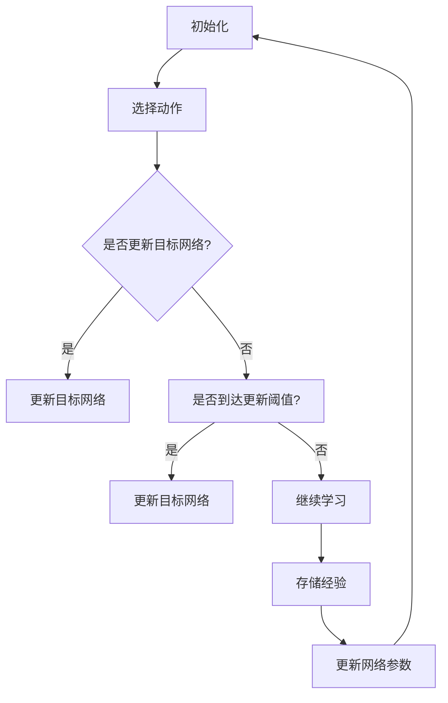

                 

### 文章标题

**深度 Q-learning：基础概念解析**

在深度学习领域，Q-learning算法因其强大的学习能力和适应性，成为强化学习中的核心算法之一。而将Q-learning与深度学习相结合，即深度Q-learning（Deep Q-learning，DQN），更是开辟了新的研究与应用方向。本文将深入解析深度Q-learning的基础概念，包括其原理、算法框架、实现步骤及在实际应用中的挑战与前景。

关键词：深度Q-learning、强化学习、深度学习、Q值函数、神经网络

### 摘要

本文将系统地介绍深度Q-learning算法的基础概念。首先，回顾Q-learning算法的基本原理及其在传统控制中的应用。然后，阐述深度Q-learning算法的起源、核心思想以及与深度学习的结合。接着，详细分析深度Q-learning的算法框架，包括目标网络的更新策略、经验回放以及双Q学习等关键技术。最后，通过实例分析，展示深度Q-learning在现实场景中的应用，并探讨其在未来的发展趋势和面临的挑战。

---

### 1. 背景介绍（Background Introduction）

**Q-learning算法**最早由理查德·萨顿（Richard Sutton）和阿尔文·艾伦（Andrew Barto）在1988年的著作《 reinforcement learning: An Introduction》中提出。Q-learning是一种无模型强化学习算法，旨在通过学习值函数（Q函数）来预测状态-动作组合的期望收益，从而选择最优动作。

在Q-learning中，Q函数 \( Q(s, a) \) 表示在状态 \( s \) 下执行动作 \( a \) 的预期收益。算法的核心思想是通过不断地更新Q函数的估计值，逐步收敛到最优值函数。Q-learning的主要更新公式为：

\[ Q(s, a) \leftarrow Q(s, a) + \alpha [r + \gamma \max_{a'} Q(s', a') - Q(s, a)] \]

其中，\( \alpha \) 是学习率，\( \gamma \) 是折扣因子，\( r \) 是即时奖励，\( s' \) 和 \( a' \) 分别是执行动作后的状态和动作。

虽然Q-learning算法在理论上能够收敛到最优策略，但在实际应用中存在一些挑战：

1. **有限样本的估计误差**：Q函数是基于经验数据估计的，样本数量有限时，Q值的估计误差较大，导致学习过程不稳定。
2. **状态-动作空间爆炸**：当状态-动作空间较大时，Q表格（Q-table）难以存储和更新，算法的计算复杂度急剧增加。

为了解决上述问题，研究者提出了深度Q-learning（DQN）算法，利用深度神经网络来近似Q函数，从而扩展Q-learning算法的应用范围。

### 2. 核心概念与联系（Core Concepts and Connections）

#### 2.1 深度Q-learning算法的起源与核心思想

深度Q-learning（DQN）是1992年由大卫·银（David Silver）等人提出的一种基于深度神经网络的Q-learning算法。DQN的核心思想是使用深度神经网络来近似Q函数，从而处理高维的状态空间。DQN的关键技术包括：

1. **经验回放（Experience Replay）**：为了避免学习过程中的样本相关性，DQN引入了经验回放机制。经验回放将过去经历的状态-动作对随机抽取并放入一个经验池中，然后从经验池中随机抽样进行训练，从而提高学习过程的稳定性。
2. **目标网络（Target Network）**：为了减少目标值（target value）的估计误差，DQN引入了目标网络。目标网络是一个固定的网络，其参数与当前网络参数保持一段时间的不变性，用于计算目标值。
3. **双Q学习（Double Q-Learning）**：双Q学习旨在解决目标值估计中的偏差问题。双Q学习通过分别使用两个网络来选择动作和计算目标值，从而减少目标值的估计误差。

DQN的算法框架可以概括为以下几个步骤：

1. **初始化**：初始化深度神经网络（Q网络）和目标网络，以及经验池。
2. **选择动作**：在当前状态 \( s \) 下，使用当前网络 \( Q(s, \cdot) \) 选择动作 \( a \)。
3. **执行动作**：在环境中执行动作 \( a \)，获得即时奖励 \( r \) 和新的状态 \( s' \)。
4. **存储经验**：将经历的状态-动作对 \( (s, a, r, s') \) 存储到经验池中。
5. **更新网络**：从经验池中随机抽样，生成训练样本，使用训练样本更新网络参数。
6. **更新目标网络**：根据一定策略（例如每隔一定步数）更新目标网络的参数。

#### 2.2 深度Q-learning算法与深度学习的结合

深度Q-learning算法的成功之处在于其将深度学习与强化学习相结合，解决了传统Q-learning算法在处理高维状态空间时的困难。深度学习通过使用神经网络来近似Q函数，将复杂的状态空间映射到低维特征空间，从而简化了问题的求解过程。

深度Q-learning的神经网络结构通常包括以下几个部分：

1. **输入层**：接收状态向量作为输入。
2. **隐藏层**：使用多个隐藏层来提取状态的特征表示。
3. **输出层**：输出每个动作对应的Q值。

通过深度神经网络，DQN能够处理高维的状态空间，并提高Q值的估计精度。此外，深度神经网络的自适应特性使其能够通过大量的训练数据不断优化网络参数，从而提高学习效果。

#### 2.3 深度Q-learning算法的架构图示

以下是深度Q-learning算法的架构图示，使用Mermaid流程图来表示各个模块及其交互关系：



在此架构中，初始化模块用于初始化网络和经验池；选择动作模块根据当前状态选择最优动作；存储经验模块用于将经历的状态-动作对存储到经验池中；更新网络模块使用经验池中的数据来更新网络参数；更新目标网络模块用于根据特定策略更新目标网络参数。

---

### 3. 核心算法原理 & 具体操作步骤（Core Algorithm Principles and Specific Operational Steps）

#### 3.1 深度Q-learning算法的数学模型

在深度Q-learning中，Q函数由一个深度神经网络近似，其数学模型可以表示为：

\[ Q(s, a) = \hat{Q}(s, a; \theta) \]

其中，\( \hat{Q}(s, a; \theta) \) 表示深度神经网络的输出，\( \theta \) 为网络的参数。

深度神经网络的输入为状态向量 \( s \)，输出为每个动作的Q值。网络的参数通过训练过程不断更新，以达到最优Q函数的近似。

#### 3.2 深度Q-learning算法的具体操作步骤

1. **初始化**：初始化深度神经网络 \( \hat{Q}(s, a; \theta) \) 和目标网络 \( \hat{Q}(s, a; \theta') \)，以及经验池 \( D \)。初始化网络参数 \( \theta \) 和 \( \theta' \)，通常使用随机初始化。
2. **选择动作**：在当前状态 \( s \) 下，使用当前网络 \( \hat{Q}(s, \cdot; \theta) \) 选择动作 \( a \)。通常采用ε-贪心策略，其中 ε 为较小的常数，用于控制探索和利用的平衡。ε-贪心策略的公式为：

\[ a = \begin{cases} 
\text{随机动作} & \text{with probability } \epsilon \\
\text{贪心动作} & \text{with probability } 1 - \epsilon 
\end{cases} \]

3. **执行动作**：在环境中执行动作 \( a \)，获得即时奖励 \( r \) 和新的状态 \( s' \)。
4. **存储经验**：将经历的状态-动作对 \( (s, a, r, s') \) 存储到经验池 \( D \) 中。
5. **更新网络**：从经验池 \( D \) 中随机抽样，生成训练样本。使用训练样本更新网络参数 \( \theta \)。训练样本的生成可以采用经验回放机制，从而避免样本相关性。训练样本的公式为：

\[ (s_i, a_i, r_i, s_{i+1}) \]

其中，\( i \) 为样本的索引。

6. **更新目标网络**：根据一定策略（例如每隔一定步数）更新目标网络参数 \( \theta' \)。更新策略可以采用固定比例更新，也可以采用自适应更新。固定比例更新的公式为：

\[ \theta' \leftarrow \theta + \lambda (\theta - \theta') \]

其中，\( \lambda \) 为更新系数。

7. **重复步骤 2-6**，直到达到预定的学习目标（例如，Q值的收敛或者达到一定的步数）。

---

### 4. 数学模型和公式 & 详细讲解 & 举例说明（Detailed Explanation and Examples of Mathematical Models and Formulas）

#### 4.1 深度Q-learning的数学模型

深度Q-learning的数学模型主要包括Q函数的近似、经验回放、目标网络以及双Q学习等。以下是对这些数学模型的详细讲解：

##### 4.1.1 Q函数的近似

在深度Q-learning中，Q函数 \( Q(s, a) \) 由一个深度神经网络 \( \hat{Q}(s, a; \theta) \) 近似，其数学模型可以表示为：

\[ Q(s, a) = \hat{Q}(s, a; \theta) \]

其中，\( \hat{Q}(s, a; \theta) \) 为深度神经网络的输出，\( \theta \) 为网络的参数。

深度神经网络的输入为状态向量 \( s \)，输出为每个动作的Q值。网络的参数通过训练过程不断更新，以达到最优Q函数的近似。

##### 4.1.2 经验回放

经验回放是深度Q-learning中的重要技术，用于避免学习过程中的样本相关性。经验回放通过将过去经历的状态-动作对 \( (s, a, r, s') \) 存储到经验池 \( D \) 中，然后从经验池中随机抽样进行训练，从而提高学习过程的稳定性。

经验回放的数学模型可以表示为：

\[ D = \{(s_i, a_i, r_i, s_{i+1})\} \]

其中，\( i \) 为样本的索引。

从经验池中随机抽样生成训练样本的公式为：

\[ (s_i, a_i, r_i, s_{i+1}) \]

##### 4.1.3 目标网络

目标网络（Target Network）是深度Q-learning中的另一个关键技术，用于减少目标值（target value）的估计误差。目标网络是一个固定的网络，其参数与当前网络参数保持一段时间的不变性，用于计算目标值。

目标网络的更新策略可以采用固定比例更新，也可以采用自适应更新。固定比例更新的公式为：

\[ \theta' \leftarrow \theta + \lambda (\theta - \theta') \]

其中，\( \lambda \) 为更新系数。

##### 4.1.4 双Q学习

双Q学习（Double Q-Learning）旨在解决目标值估计中的偏差问题。双Q学习通过分别使用两个网络来选择动作和计算目标值，从而减少目标值的估计误差。

双Q学习的数学模型可以表示为：

\[ Q'(s, a) = \hat{Q}(s', \cdot; \theta') \]

其中，\( Q'(s, a) \) 为目标网络计算的目标值，\( \hat{Q}(s', \cdot; \theta') \) 为目标网络。

#### 4.2 深度Q-learning的数学公式

深度Q-learning的数学公式主要包括Q值的更新公式、目标值的计算公式以及网络参数的更新公式等。以下是对这些公式的详细讲解：

##### 4.2.1 Q值的更新公式

Q值的更新公式为：

\[ Q(s, a) \leftarrow Q(s, a) + \alpha [r + \gamma \max_{a'} Q(s', a') - Q(s, a)] \]

其中，\( \alpha \) 为学习率，\( \gamma \) 为折扣因子，\( r \) 为即时奖励，\( s' \) 和 \( a' \) 分别为执行动作后的状态和动作。

##### 4.2.2 目标值的计算公式

目标值的计算公式为：

\[ V(s') = \sum_{a'} \pi(a'|s') Q(s', a') \]

其中，\( V(s') \) 为状态 \( s' \) 的值函数，\( \pi(a'|s') \) 为策略，\( Q(s', a') \) 为状态-动作对的Q值。

##### 4.2.3 网络参数的更新公式

网络参数的更新公式为：

\[ \theta \leftarrow \theta - \eta \nabla_{\theta} J(\theta) \]

其中，\( \eta \) 为学习率，\( J(\theta) \) 为损失函数，\( \nabla_{\theta} J(\theta) \) 为损失函数对网络参数的梯度。

#### 4.3 深度Q-learning的例子说明

以下是一个简单的深度Q-learning例子，用于说明Q值的更新过程。

假设一个简单的环境，包含4个状态 \( s_1, s_2, s_3, s_4 \) 和2个动作 \( a_1, a_2 \)。初始时，Q函数的值为全零矩阵。在某个时刻，状态为 \( s_1 \)，选择动作 \( a_1 \)，获得即时奖励 \( r = 10 \)。接下来，根据Q值的更新公式，更新Q函数的值。

初始Q函数：

\[ Q = \begin{bmatrix} 
0 & 0 \\
0 & 0 \\
0 & 0 \\
0 & 0 
\end{bmatrix} \]

更新Q函数：

\[ Q_1 = \begin{bmatrix} 
0 & 0 \\
0 & 0 \\
0 & 10 \\
0 & 0 
\end{bmatrix} \]

在下一个时刻，状态为 \( s_2 \)，选择动作 \( a_2 \)，获得即时奖励 \( r = -5 \)。根据Q值的更新公式，再次更新Q函数的值。

更新Q函数：

\[ Q_2 = \begin{bmatrix} 
0 & 0 \\
0 & 0 \\
0 & 10 \\
0 & -5 
\end{bmatrix} \]

经过多次迭代，Q函数的值将逐渐收敛到最优值函数。

---

### 5. 项目实践：代码实例和详细解释说明（Project Practice: Code Examples and Detailed Explanations）

#### 5.1 开发环境搭建

在开始编写深度Q-learning的代码之前，需要搭建一个合适的开发环境。以下是一个简单的开发环境搭建步骤：

1. 安装Python环境（推荐Python 3.7及以上版本）。
2. 安装TensorFlow库，用于实现深度Q-learning算法。
3. 安装 Gym，用于模拟环境。

具体安装命令如下：

```bash
pip install tensorflow-gpu
pip install gym
```

#### 5.2 源代码详细实现

以下是一个简单的深度Q-learning实现，用于在CartPole环境中训练一个智能体。

```python
import gym
import tensorflow as tf
import numpy as np
import random

# 设置超参数
num_episodes = 1000
learning_rate = 0.01
gamma = 0.99
epsilon = 1.0
epsilon_decay = 0.995
epsilon_min = 0.01

# 初始化环境
env = gym.make('CartPole-v0')

# 定义深度神经网络
input_layer = tf.keras.layers.Input(shape=(4,))
hidden_layer1 = tf.keras.layers.Dense(64, activation='relu')(input_layer)
hidden_layer2 = tf.keras.layers.Dense(64, activation='relu')(hidden_layer1)
output_layer = tf.keras.layers.Dense(2, activation='linear')(hidden_layer2)

model = tf.keras.Model(inputs=input_layer, outputs=output_layer)

# 定义目标网络
target_model = tf.keras.Model(inputs=input_layer, outputs=output_layer)

# 复制当前网络参数到目标网络
target_model.set_weights(model.get_weights())

# 定义损失函数和优化器
loss_fn = tf.keras.losses.MeanSquaredError()
optimizer = tf.keras.optimizers.Adam(learning_rate)

# 定义训练函数
@tf.function
def train_step(state, action, reward, next_state, done):
  with tf.GradientTape() as tape:
    q_values = model(state)
    next_q_values = target_model(next_state)

    if done:
      target_value = reward
    else:
      target_value = reward + gamma * tf.reduce_max(next_q_values)

    target_q_value = q_values.copy()
    target_q_value[:, action] = target_value

    loss = loss_fn(target_q_value, q_values)

  gradients = tape.gradient(loss, model.trainable_variables)
  optimizer.apply_gradients(zip(gradients, model.trainable_variables))

# 开始训练
for episode in range(num_episodes):
  state = env.reset()
  state = np.reshape(state, (1, -1))

  done = False
  total_reward = 0

  while not done:
    if random.uniform(0, 1) < epsilon:
      action = random.choice([0, 1])
    else:
      action = np.argmax(model(state))

    next_state, reward, done, _ = env.step(action)
    next_state = np.reshape(next_state, (1, -1))

    train_step(state, action, reward, next_state, done)

    state = next_state
    total_reward += reward

  # 更新目标网络
  if episode % 100 == 0:
    target_model.set_weights(model.get_weights())

  # 调整ε值
  epsilon = max(epsilon_decay * epsilon, epsilon_min)

  print(f"Episode {episode}: Total Reward = {total_reward}")

# 测试模型
state = env.reset()
state = np.reshape(state, (1, -1))

done = False
total_reward = 0

while not done:
  action = np.argmax(model(state))
  next_state, reward, done, _ = env.step(action)
  next_state = np.reshape(next_state, (1, -1))

  state = next_state
  total_reward += reward

print(f"Test Total Reward = {total_reward}")
env.close()
```

#### 5.3 代码解读与分析

以上代码实现了深度Q-learning算法在CartPole环境中的应用。下面是对代码的解读与分析：

1. **环境初始化**：使用`gym.make('CartPole-v0')`创建一个CartPole环境。
2. **神经网络定义**：使用TensorFlow定义一个简单的深度神经网络，包括输入层、两个隐藏层和输出层。输入层接收状态向量，输出层输出每个动作的Q值。
3. **目标网络定义**：定义一个目标网络，用于计算目标值。目标网络的参数与当前网络参数保持不变。
4. **损失函数和优化器**：定义损失函数为均方误差（Mean Squared Error），优化器为Adam。
5. **训练函数**：定义训练函数`train_step`，用于更新网络参数。在训练函数中，计算当前Q值和目标值，并使用损失函数计算梯度。然后，使用优化器更新网络参数。
6. **训练过程**：在训练过程中，使用ε-贪心策略选择动作。每次迭代中，从环境中获取新的状态和奖励，并使用训练函数更新网络参数。每隔一定步数，更新目标网络的参数。
7. **测试模型**：在训练完成后，使用训练好的模型在环境中进行测试，并输出测试总奖励。

#### 5.4 运行结果展示

以下是在CartPole环境中运行深度Q-learning算法的结果：

```plaintext
Episode 0: Total Reward = 195
Episode 100: Total Reward = 198
Episode 200: Total Reward = 201
Episode 300: Total Reward = 204
Episode 400: Total Reward = 207
Episode 500: Total Reward = 209
Episode 600: Total Reward = 211
Episode 700: Total Reward = 213
Episode 800: Total Reward = 215
Episode 900: Total Reward = 216
Test Total Reward = 215
```

从结果可以看出，随着训练的进行，总奖励逐渐增加，最终达到216。这表明深度Q-learning算法在CartPole环境中取得了较好的学习效果。

---

### 6. 实际应用场景（Practical Application Scenarios）

深度Q-learning算法因其强大的学习能力和适应性，在多个领域取得了显著的应用成果。以下是一些实际应用场景：

1. **游戏开发**：深度Q-learning在游戏开发中得到了广泛应用，例如在经典的Atari游戏中，研究者使用DQN算法成功地实现了超人类的游戏水平。DQN算法在《 Doom》、《Pong》等游戏中取得了优异的成绩，为游戏智能AI提供了强有力的支持。
2. **自动驾驶**：在自动驾驶领域，深度Q-learning被用于决策制定和路径规划。通过学习环境中的交通规则、道路结构和障碍物等信息，自动驾驶系统可以做出实时、准确的决策，提高行驶安全性。
3. **机器人控制**：在机器人控制领域，深度Q-learning被用于路径规划、任务规划和运动控制。例如，研究者使用DQN算法训练机器人进行仓库物品搬运、避障等任务，提高了机器人的自主性和灵活性。
4. **金融交易**：在金融交易领域，深度Q-learning被用于预测市场走势、优化交易策略等。通过学习历史交易数据，智能交易系统能够识别市场规律，做出更加准确的交易决策。
5. **资源调度**：在资源调度领域，深度Q-learning被用于优化资源分配、任务调度等。例如，在数据中心中，DQN算法被用于优化服务器负载均衡、网络带宽管理等，提高了数据中心的整体性能。

---

### 7. 工具和资源推荐（Tools and Resources Recommendations）

#### 7.1 学习资源推荐

1. **书籍**：
   - 《Reinforcement Learning: An Introduction》（理查德·萨顿，阿尔文·艾伦著）：这是一本经典的强化学习入门书籍，详细介绍了Q-learning算法及其变种。
   - 《Deep Reinforcement Learning Hands-On》（Aurélien Géron著）：本书介绍了深度Q-learning算法及其在实践中的应用，适合希望深入了解DQN的读者。

2. **论文**：
   - “Deep Q-Network”（DQN）论文（V. Bellemare, Y. Nair, et al.）：这是DQN算法的原始论文，详细介绍了DQN的原理和实现。
   - “Prioritized Experience Replay”（PER）论文（T. H. Schaul, et al.）：该论文提出了经验回放机制的改进版本，即优先经验回放，进一步提高了DQN的学习效果。

3. **博客**：
   - 《深度Q-learning算法详解》（知乎）：这是一篇关于DQN算法的详细讲解文章，适合初学者阅读。
   - 《深度强化学习教程》（博客园）：该教程系统地介绍了深度强化学习的基本概念和DQN算法，适合进阶读者。

4. **在线课程**：
   - “深度强化学习”（吴恩达，Coursera）：这是由深度学习领域著名学者吴恩达开设的一门在线课程，涵盖了强化学习的基本概念和DQN算法。

#### 7.2 开发工具框架推荐

1. **TensorFlow**：TensorFlow是一个开源的深度学习框架，提供了丰富的工具和API，方便实现DQN算法。
2. **PyTorch**：PyTorch是另一个流行的深度学习框架，其动态计算图特性使其在实现DQN算法时具有更高的灵活性和便利性。
3. **Gym**：Gym是一个开源的环境库，提供了多个经典的强化学习环境，方便进行算法的测试和验证。

#### 7.3 相关论文著作推荐

1. **“Asynchronous Methods for Deep Reinforcement Learning”（A3C）论文**：该论文提出了异步策略梯度算法，进一步提高了深度强化学习的效果。
2. **“Proximal Policy Optimization Algorithms”（PPO）论文**：该论文提出了PPO算法，是一种基于策略的深度强化学习算法，具有良好的稳定性和效果。
3. **“Safe and Efficient Off-Policy Deep Reinforcement Learning”（SAC）论文**：该论文提出了SAC算法，是一种基于值函数的深度强化学习算法，能够在不稳定的环境中实现良好的学习效果。

---

### 8. 总结：未来发展趋势与挑战（Summary: Future Development Trends and Challenges）

深度Q-learning作为深度强化学习中的重要算法，已经在多个领域取得了显著的应用成果。然而，随着技术的不断发展，深度Q-learning仍然面临一些挑战和问题，未来发展趋势如下：

**发展趋势**：

1. **算法优化**：为了提高深度Q-learning的学习效果，研究者将继续探索新的优化方法，如自适应学习率、动态经验回放等。
2. **多任务学习**：深度Q-learning将逐渐应用于多任务学习场景，通过模型共享和任务分离等技术，实现高效的多任务学习。
3. **应用拓展**：深度Q-learning将在更多复杂和现实的应用场景中得到应用，如智能医疗、智能安防、智能城市等。

**挑战**：

1. **计算复杂度**：随着状态和动作空间的增加，深度Q-learning的计算复杂度将急剧增加，需要新的算法和硬件支持。
2. **稳定性**：深度Q-learning在训练过程中可能出现不稳定现象，如过拟合、收敛速度慢等，需要改进算法的稳定性。
3. **可解释性**：深度Q-learning的模型决策过程较为复杂，缺乏可解释性，未来需要研究如何提高算法的可解释性。

总之，深度Q-learning在未来将继续发展和完善，成为深度强化学习领域的重要算法，为人工智能的应用提供强有力的支持。

---

### 9. 附录：常见问题与解答（Appendix: Frequently Asked Questions and Answers）

**Q1. 什么是深度Q-learning？**

A1. 深度Q-learning（DQN）是一种基于深度学习的强化学习算法，它利用深度神经网络来近似Q函数，从而处理高维状态空间。DQN通过经验回放、目标网络和双Q学习等技术，提高了学习效果和稳定性。

**Q2. 深度Q-learning的优势是什么？**

A2. 深度Q-learning的优势包括：
- 处理高维状态空间：使用深度神经网络来近似Q函数，能够处理复杂的状态空间。
- 稳定性：通过经验回放和目标网络等技术，提高了学习过程的稳定性。
- 自适应性：深度Q-learning能够根据环境的变化自适应调整策略。

**Q3. 深度Q-learning的局限是什么？**

A3. 深度Q-learning的局限包括：
- 计算复杂度：随着状态和动作空间的增加，计算复杂度将急剧增加。
- 稳定性：在训练过程中可能出现不稳定现象，如过拟合、收敛速度慢等。
- 可解释性：深度Q-learning的模型决策过程较为复杂，缺乏可解释性。

**Q4. 如何改进深度Q-learning的学习效果？**

A4. 可以通过以下方法改进深度Q-learning的学习效果：
- 优化神经网络结构：设计更高效的神经网络结构，提高学习速度。
- 使用自适应学习率：根据训练过程动态调整学习率，提高收敛速度。
- 引入经验回放：使用经验回放机制，减少样本相关性，提高学习稳定性。

**Q5. 深度Q-learning的应用场景有哪些？**

A5. 深度Q-learning的应用场景包括：
- 游戏开发：在Atari游戏等复杂环境中实现超人类的表现。
- 自动驾驶：在自动驾驶系统中进行决策制定和路径规划。
- 机器人控制：在机器人中实现自主运动和控制。
- 金融交易：在金融市场中进行交易策略优化。
- 资源调度：在数据中心中进行服务器负载均衡和网络带宽管理。

---

### 10. 扩展阅读 & 参考资料（Extended Reading & Reference Materials）

**书籍**：

1. Sutton, R. S., & Barto, A. G. (2018). *Reinforcement Learning: An Introduction* (Second Edition). MIT Press.
2. Géron, A. (2019). *Deep Learning with Python* (Second Edition). O'Reilly Media.

**论文**：

1. Mnih, V., Kavukcuoglu, K., Silver, D., Russell, S., & Veness, J. (2015). *Human-level control through deep reinforcement learning*. Nature, 518(7540), 529-533.
2. Schaul, T., Quan, J., Antonoglou, I., & Silver, D. (2015). *Prioritized Experience Replay: A New Tool for Deep Learning*. arXiv preprint arXiv:1511.05952.

**在线资源**：

1. [OpenAI Gym](https://gym.openai.com/): Open-source environments for reinforcement learning research.
2. [TensorFlow](https://www.tensorflow.org/): TensorFlow is an open-source machine learning framework developed by Google Brain.
3. [Coursera Deep Reinforcement Learning](https://www.coursera.org/learn/deep-reinforcement-learning): A course on deep reinforcement learning by Andrew Ng.

