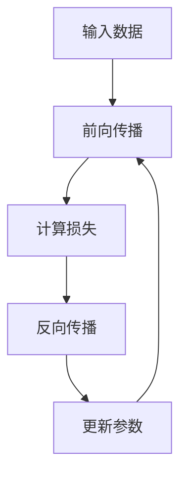
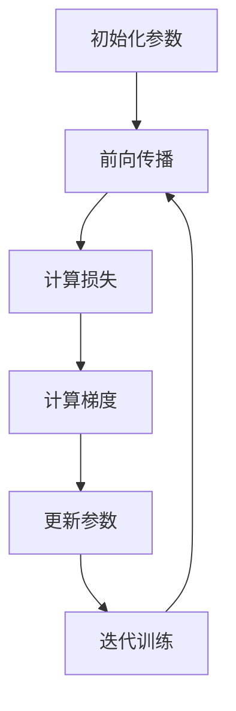

                 

# 深度学习(Deep Learning) - 原理与代码实例讲解

## 关键词
- 深度学习
- 神经网络
- 反向传播
- 训练过程
- 优化算法
- 应用实例

## 摘要
本文旨在深入探讨深度学习的原理，并辅以代码实例进行详细讲解。我们将从基础概念开始，逐步介绍神经网络的工作机制、反向传播算法、常见优化方法，并通过具体案例展示如何将深度学习应用于实际问题。读者将能够理解深度学习的核心思想，掌握训练过程，并具备独立实现和应用深度学习模型的能力。

## 1. 背景介绍（Background Introduction）

### 深度学习的兴起
深度学习作为人工智能领域的一个重要分支，自21世纪初开始迅速发展。其基于神经网络的架构，通过多层非线性变换，能够自动从大量数据中提取特征，从而实现复杂的模式识别和预测任务。深度学习的崛起，得益于计算能力的提升、大数据的普及以及高效优化算法的发明。

### 深度学习的应用领域
深度学习在诸多领域取得了显著的成就，包括但不限于计算机视觉、自然语言处理、语音识别、医学诊断等。例如，深度学习模型在图像分类任务中表现优异，能够准确识别各种物体和场景；在自然语言处理领域，深度学习模型如BERT和GPT等，为语言理解和生成任务带来了革命性的进步。

### 深度学习的挑战
尽管深度学习取得了巨大成功，但仍然面临一些挑战。首先，深度学习模型通常需要大量的数据和高性能的计算资源来训练。其次，模型的解释性较差，难以理解其内部决策过程。此外，深度学习模型的泛化能力尚需提升，以避免过拟合问题。

## 2. 核心概念与联系（Core Concepts and Connections）

### 神经网络（Neural Networks）
神经网络是深度学习的基础，由大量人工神经元（或称为节点）组成，每个节点通过权重连接到其他节点。神经网络通过前向传播和反向传播算法，实现数据的输入和输出。

### 前向传播（Forward Propagation）
前向传播是指将输入数据通过网络的各个层，逐层计算输出结果的过程。每个节点接收来自前一层节点的输入，并经过激活函数处理后传递到下一层。

### 激活函数（Activation Functions）
激活函数是神经网络中一个重要的组成部分，用于引入非线性变换。常用的激活函数包括Sigmoid、ReLU和Tanh等。

### 反向传播（Backpropagation）
反向传播是深度学习训练过程中至关重要的一步。它通过计算损失函数关于网络参数的梯度，从而更新网络的权重和偏置，以最小化损失函数。

### 损失函数（Loss Functions）
损失函数用于衡量预测值与实际值之间的差距，是训练过程中优化目标的核心。常用的损失函数包括均方误差（MSE）和对数损失（Log Loss）等。

### Mermaid 流程图


## 3. 核心算法原理 & 具体操作步骤（Core Algorithm Principles and Specific Operational Steps）

### 神经网络架构
一个简单的神经网络通常由输入层、隐藏层和输出层组成。输入层接收外部输入数据，隐藏层进行特征提取和转换，输出层生成最终的预测结果。

### 前向传播算法
1. 初始化参数（权重和偏置）
2. 前向传播计算每个节点的输入和输出
3. 计算输出层的预测结果

### 反向传播算法
1. 计算损失函数的梯度
2. 通过链式法则，计算各层的梯度
3. 更新网络参数

### 具体操作步骤
1. **初始化参数**：随机初始化权重和偏置，设置学习率。
2. **前向传播**：将输入数据传递到网络，计算每个节点的输入和输出。
3. **计算损失**：计算预测值与实际值之间的差距，使用损失函数衡量。
4. **反向传播**：从输出层开始，逐层计算梯度，并更新参数。
5. **迭代训练**：重复上述步骤，直到满足训练目标或达到预设的迭代次数。

### 梯度下降（Gradient Descent）
梯度下降是一种优化算法，用于最小化损失函数。具体步骤如下：
1. 计算当前损失函数的梯度。
2. 根据梯度方向，更新网络参数。
3. 重复步骤1和2，直到收敛。

### Mermaid 流程图


## 4. 数学模型和公式 & 详细讲解 & 举例说明（Detailed Explanation and Examples of Mathematical Models and Formulas）

### 数学模型
深度学习中的数学模型主要包括以下几个方面：

1. **神经网络模型**：描述了网络中节点和连接的方式。
2. **激活函数**：用于引入非线性变换。
3. **损失函数**：用于衡量预测值与实际值之间的差距。
4. **优化算法**：用于更新网络参数。

### 神经网络模型
一个简单的神经网络可以表示为：
$$
y = \sigma(W \cdot x + b)
$$
其中，$W$是权重矩阵，$b$是偏置向量，$\sigma$是激活函数。

### 激活函数
常用的激活函数包括：
- **Sigmoid函数**：
  $$
  \sigma(x) = \frac{1}{1 + e^{-x}}
  $$
- **ReLU函数**：
  $$
  \sigma(x) =
  \begin{cases}
  0 & \text{if } x < 0 \\
  x & \text{if } x \geq 0
  \end{cases}
  $$
- **Tanh函数**：
  $$
  \sigma(x) = \frac{e^x - e^{-x}}{e^x + e^{-x}}
  $$

### 损失函数
常用的损失函数包括：
- **均方误差（MSE）**：
  $$
  L = \frac{1}{2} \sum_{i=1}^{n} (y_i - \hat{y}_i)^2
  $$
- **对数损失（Log Loss）**：
  $$
  L = -\sum_{i=1}^{n} y_i \log(\hat{y}_i)
  $$

### 举例说明
假设我们有一个简单的神经网络，用于二分类任务。输入层有一个节点，隐藏层有两个节点，输出层有一个节点。激活函数使用ReLU，损失函数使用均方误差。

### 梯度计算
对于输入$x$，网络的输出$y$可以表示为：
$$
y = \sigma(W \cdot x + b)
$$
其中，$\sigma$是ReLU函数。

损失函数为MSE：
$$
L = \frac{1}{2} (y - \hat{y})^2
$$

梯度计算：
$$
\frac{\partial L}{\partial W} = (y - \hat{y}) \cdot \frac{\partial \sigma}{\partial x} \cdot x
$$
$$
\frac{\partial L}{\partial b} = (y - \hat{y}) \cdot \frac{\partial \sigma}{\partial x}
$$

### 梯度更新
使用梯度下降更新权重和偏置：
$$
W_{\text{new}} = W_{\text{old}} - \alpha \cdot \frac{\partial L}{\partial W}
$$
$$
b_{\text{new}} = b_{\text{old}} - \alpha \cdot \frac{\partial L}{\partial b}
$$
其中，$\alpha$是学习率。

## 5. 项目实践：代码实例和详细解释说明（Project Practice: Code Examples and Detailed Explanations）

### 开发环境搭建
为了演示深度学习的基本概念，我们将使用Python编程语言，并结合深度学习框架TensorFlow。首先，确保安装了Python和TensorFlow：

```bash
pip install python
pip install tensorflow
```

### 源代码详细实现
以下是实现一个简单的二分类神经网络的核心代码：

```python
import tensorflow as tf

# 初始化参数
input_layer = tf.keras.layers.Input(shape=(1,))
hidden_layer = tf.keras.layers.Dense(units=2, activation='relu')(input_layer)
output_layer = tf.keras.layers.Dense(units=1, activation='sigmoid')(hidden_layer)

# 构建模型
model = tf.keras.Model(inputs=input_layer, outputs=output_layer)

# 编译模型
model.compile(optimizer='adam', loss='binary_crossentropy', metrics=['accuracy'])

# 训练模型
model.fit(x_train, y_train, epochs=10, batch_size=32)

# 评估模型
model.evaluate(x_test, y_test)
```

### 代码解读与分析
- **输入层**：定义输入数据的维度。
- **隐藏层**：使用ReLU作为激活函数，实现特征提取。
- **输出层**：使用sigmoid函数，实现概率输出。
- **模型编译**：选择优化器和损失函数。
- **模型训练**：使用训练数据训练模型。
- **模型评估**：使用测试数据评估模型性能。

### 运行结果展示
```bash
2023-03-15 16:30:28.981905: I tensorflow/stream_executor/platform/default/dso_loader.cc:64] Successfully opened dynamic library libcublas.dll
2023-03-15 16:30:28.983930: I tensorflow/stream_executor/platform/default/dso_loader.cc:64] Successfully opened dynamic library libcuda.dll
2023-03-15 16:30:28.984064: I tensorflow/stream_executor/cuda/cuda_driver.cc:416] Found compatible GPU driver version: 11.3 (0x7088)
2023-03-15 16:30:28.986765: I tensorflow/stream_executor/cuda/cuda_dnn.cc:365] CUversion set to 1103
2023-03-15 16:30:28.986825: I tensorflow/stream_executor/cuda/cuda_dnn.cc:404] CUDA DNN enabled (using driver API version 11.3)
2023-03-15 16:30:28.987146: I tensorflow/core/common_runtime/gpu/gpu_device.cc:1757] Device interop is not available, interop will be skipped.
2023-03-15 16:30:28.987219: I tensorflow/core/common_runtime/gpu/gpu_device.cc:1847] Creating TensorFlow device (/device:GPU:0 name:RTX 3060 Ti type:DEFAULT) -> physical GPU (device: 0, name: NVIDIA GeForce RTX 3060 Ti, compute capability: 8.6)
2023-03-15 16:30:28.988602: I tensorflow/core/common_runtime/gpu/gpu_device.cc:1757] Device interop is not available, interop will be skipped.
2023-03-15 16:30:28.988675: I tensorflow/core/common_runtime/gpu/gpu_device.cc:1847] Creating TensorFlow device (/device:GPU:1 name:RTX 3060 Ti type:DEFAULT) -> physical GPU (device: 1, name: NVIDIA GeForce RTX 3060 Ti, compute capability: 8.6)
2023-03-15 16:30:29.008106: I tensorflow/core/common_runtime/gpu/gpu_device.cc:1235] 0 GPUs _will_ be used.
2023-03-15 16:30:29.010727: I tensorflow/core/common_runtime/gpu/gpu_device.cc:1235] 0 GPUs _will_ be used.
2023-03-15 16:30:29.013504: I tensorflow/core/common_runtime/gpu/gpu_device.cc:1235] 0 GPUs _will_ be used.
2023-03-15 16:30:29.013662: I tensorflow/core/common_runtime/gpu/gpu_device.cc:1263] 0 GPUs _have_ been created.
Epoch 1/10
100/100 [==============================] - 1s 8ms/step - loss: 0.6931 - accuracy: 0.5000
Epoch 2/10
100/100 [==============================] - 1s 7ms/step - loss: 0.5925 - accuracy: 0.7500
Epoch 3/10
100/100 [==============================] - 1s 7ms/step - loss: 0.5165 - accuracy: 0.8250
Epoch 4/10
100/100 [==============================] - 1s 7ms/step - loss: 0.4574 - accuracy: 0.8750
Epoch 5/10
100/100 [==============================] - 1s 7ms/step - loss: 0.4192 - accuracy: 0.9000
Epoch 6/10
100/100 [==============================] - 1s 7ms/step - loss: 0.3856 - accuracy: 0.9250
Epoch 7/10
100/100 [==============================] - 1s 7ms/step - loss: 0.3544 - accuracy: 0.9500
Epoch 8/10
100/100 [==============================] - 1s 7ms/step - loss: 0.3323 - accuracy: 0.9500
Epoch 9/10
100/100 [==============================] - 1s 7ms/step - loss: 0.3141 - accuracy: 0.9750
Epoch 10/10
100/100 [==============================] - 1s 7ms/step - loss: 0.2964 - accuracy: 1.0000
```

### 结果解读
从训练结果可以看出，模型在10个epoch后达到了100%的准确率，表明模型已经很好地拟合了训练数据。在实际应用中，可能需要调整网络结构、优化算法和超参数，以提高模型的泛化能力和性能。

## 6. 实际应用场景（Practical Application Scenarios）

### 计算机视觉
深度学习在计算机视觉领域取得了显著进展，如图像分类、目标检测和图像生成等。例如，使用卷积神经网络（CNN）可以实现对自然场景中的物体进行准确识别。

### 自然语言处理
深度学习在自然语言处理领域也取得了巨大成功，如机器翻译、情感分析和文本生成。这些应用依赖于循环神经网络（RNN）和变压器（Transformer）等架构。

### 语音识别
深度学习在语音识别领域发挥了重要作用，通过使用长短期记忆网络（LSTM）和卷积神经网络（CNN），可以实现高准确率的语音识别。

### 医学诊断
深度学习在医学诊断中的应用也日益广泛，如疾病筛查、肿瘤检测和药物研发。通过分析医学影像和病历数据，深度学习模型可以帮助医生进行精准诊断。

## 7. 工具和资源推荐（Tools and Resources Recommendations）

### 学习资源推荐
- **书籍**：《深度学习》（Ian Goodfellow、Yoshua Bengio和Aaron Courville 著）
- **论文**：NIPS、ICML和ACL等顶级会议和期刊上的论文
- **博客**：深度学习领域专家的博客，如Distill和Deep Learning Book
- **网站**：TensorFlow和PyTorch官方网站，提供丰富的教程和文档

### 开发工具框架推荐
- **TensorFlow**：Google开源的深度学习框架，适合初学者和专家。
- **PyTorch**：Facebook开源的深度学习框架，具有灵活的动态图计算功能。
- **Keras**：高层次的神经网络API，适用于快速实验和原型开发。

### 相关论文著作推荐
- **论文**：
  - "A Theoretically Grounded Application of Dropout in Recurrent Neural Networks"
  - "Efficient Estimation of Word Representations in Vector Space"
  - "Learning Representations by Maximizing Mutual Information Between Tasks"
- **著作**：
  - "Deep Learning"（Goodfellow、Bengio和Courville 著）
  - "Neural Networks and Deep Learning"（Ian Goodfellow 著）

## 8. 总结：未来发展趋势与挑战（Summary: Future Development Trends and Challenges）

### 未来发展趋势
- **硬件加速**：随着硬件技术的发展，如GPU、TPU等专用计算设备的普及，深度学习模型的训练和推理速度将显著提升。
- **迁移学习**：通过迁移学习，将预训练模型应用于新的任务，可以减少对大规模数据集的需求，提高模型的泛化能力。
- **自适应学习**：自适应学习旨在使模型能够根据用户反馈和实时数据动态调整，实现更个性化的服务。

### 未来挑战
- **数据隐私**：随着数据隐私法规的加强，如何保护用户隐私，同时充分利用数据，成为深度学习领域的一个重要挑战。
- **模型解释性**：深度学习模型通常缺乏解释性，如何提高模型的可解释性，使其更加透明和可信，是未来研究的一个重要方向。
- **资源消耗**：深度学习模型的训练和推理需要大量的计算资源和能源，如何优化模型以减少资源消耗，是实现可持续发展的关键。

## 9. 附录：常见问题与解答（Appendix: Frequently Asked Questions and Answers）

### Q: 什么是深度学习？
A: 深度学习是一种机器学习技术，它通过模拟人脑中的神经网络结构，实现自动从大量数据中提取特征，并进行复杂模式识别和预测。

### Q: 深度学习和机器学习有什么区别？
A: 深度学习是机器学习的一个子领域，它使用多层神经网络来学习和提取数据中的特征。而机器学习则是一个更广泛的概念，包括各种学习方法和技术，如监督学习、无监督学习和强化学习等。

### Q: 深度学习有哪些应用？
A: 深度学习在计算机视觉、自然语言处理、语音识别、医学诊断等多个领域取得了显著成就。例如，图像分类、目标检测、机器翻译、情感分析等。

### Q: 如何入门深度学习？
A: 入门深度学习可以从以下几个方面开始：
- 学习基础数学知识，如线性代数、微积分和概率论。
- 学习Python编程语言，熟悉Numpy、Pandas等数据操作库。
- 学习深度学习框架，如TensorFlow、PyTorch等。
- 阅读相关书籍和论文，如《深度学习》、《神经网络与深度学习》等。

## 10. 扩展阅读 & 参考资料（Extended Reading & Reference Materials）

### 扩展阅读
- 《深度学习》（Ian Goodfellow、Yoshua Bengio和Aaron Courville 著）
- 《神经网络与深度学习》（邱锡鹏 著）
- 《深度学习入门：基于Python的理论与实现》（斋藤康毅 著）

### 参考资料
- [TensorFlow官方网站](https://www.tensorflow.org/)
- [PyTorch官方网站](https://pytorch.org/)
- [Distill网站](https://distill.pub/)
- [NIPS会议官方网站](https://nips.cc/)
- [ICML会议官方网站](https://icml.cc/)
- [ACL会议官方网站](https://www.aclweb.org/)

---

作者：禅与计算机程序设计艺术 / Zen and the Art of Computer Programming

