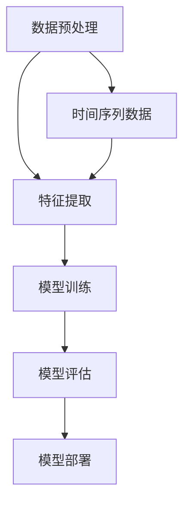

                 

### 文章标题

**深度学习在时间序列预测中的应用**

### Keywords: Deep Learning, Time Series Forecasting, Machine Learning, Prediction Algorithms, Application Scenarios

### Abstract:
本文将探讨深度学习技术在时间序列预测中的广泛应用及其重要性。我们将详细分析深度学习的基本原理，介绍几种常见的时间序列预测算法，并通过具体实例讲解这些算法的运用。此外，本文还将探讨深度学习在金融、气象、电商等实际应用场景中的挑战和解决方案。通过阅读本文，读者将全面了解深度学习在时间序列预测领域的现状与发展趋势。

## 1. 背景介绍

时间序列数据是指按照时间顺序排列的一系列数值，这些数值可以表示股票价格、气温、销售量等。时间序列数据的特点是具有时间依赖性，即未来的数据值受到过去数据的影响。因此，对时间序列数据进行预测是一项具有挑战性的任务。

随着机器学习和深度学习技术的快速发展，许多复杂的预测模型被提出并应用于实际场景。深度学习因其强大的特征提取能力和非线性建模能力，在时间序列预测领域取得了显著的成果。本文将重点关注深度学习在时间序列预测中的应用，探讨其基本原理、算法实现以及实际应用中的挑战。

## 2. 核心概念与联系

### 2.1 深度学习的基本概念

深度学习是一种基于人工神经网络（Artificial Neural Networks, ANN）的机器学习技术，它通过模拟人脑的神经网络结构，自动从大量数据中学习特征，并利用这些特征进行预测或分类。深度学习的基本单元是神经元，神经元之间通过权重连接形成神经网络。

深度学习的核心在于“深度”，即网络的层次结构。深度神经网络（Deep Neural Networks, DNN）通常包含多个隐藏层，每个隐藏层都能够对输入数据进行特征提取和变换。多层神经网络能够捕捉到输入数据的复杂结构和模式，从而提高预测的准确性和泛化能力。

### 2.2 时间序列数据的特性

时间序列数据具有以下特点：

1. **时间依赖性**：时间序列数据中的每个数据点都与其他时间点上的数据相关联，未来的数据值受到过去数据的影响。
2. **趋势性**：时间序列数据通常表现出一定的趋势，如增长、下降或季节性波动。
3. **平稳性**：平稳时间序列数据的统计特性不随时间变化，而非平稳时间序列数据的统计特性随时间变化。
4. **自相关性**：时间序列数据中的值之间具有一定的自相关性，即过去的值对未来的值有一定的影响。

### 2.3 深度学习与时间序列预测的关系

深度学习在时间序列预测中的应用主要是利用其强大的特征提取和建模能力，捕捉时间序列数据中的复杂模式和依赖关系。通过以下方式，深度学习能够有效地进行时间序列预测：

1. **特征自动提取**：深度学习模型能够自动从原始时间序列数据中提取高层次的抽象特征，这些特征有助于提高预测的准确性。
2. **非线性建模**：深度学习模型能够建模时间序列数据中的非线性关系，捕捉复杂的趋势和周期性。
3. **序列建模**：深度学习模型能够处理时间序列的序列信息，考虑到时间序列中不同时间点之间的依赖性。

### 2.4 Mermaid 流程图

以下是一个描述深度学习在时间序列预测中应用流程的 Mermaid 流程图：



在上述流程中，首先对时间序列数据进行预处理，包括数据清洗、缺失值填充、数据标准化等。接着，利用深度学习模型对预处理后的数据进行特征提取和建模。训练完成后，对模型进行评估，并根据评估结果进行优化。最后，将模型部署到实际应用环境中，进行预测和决策。

## 3. 核心算法原理 & 具体操作步骤

### 3.1 卷积神经网络（Convolutional Neural Networks, CNN）

卷积神经网络是一种特殊的神经网络，主要用于处理图像和序列数据。CNN 通过卷积层、池化层和全连接层的组合，能够自动提取数据中的特征，并用于分类或回归任务。

在时间序列预测中，CNN 可以通过以下步骤进行操作：

1. **卷积层**：卷积层通过卷积操作从输入序列中提取特征，每个卷积核都能够捕捉到序列中的局部模式。
2. **池化层**：池化层用于减少数据维度，同时保留重要特征。常见的池化操作包括最大池化和平均池化。
3. **全连接层**：全连接层将卷积层和池化层提取的特征进行聚合，并输出预测结果。

### 3.2 循环神经网络（Recurrent Neural Networks, RNN）

循环神经网络是一种能够处理序列数据的神经网络，其主要特点是具有循环结构，可以记住前面的输入信息。RNN 通过隐藏状态（Hidden State）来保存序列的历史信息，并利用这个信息来预测未来的值。

在时间序列预测中，RNN 可以通过以下步骤进行操作：

1. **输入层**：输入层接收时间序列数据，并将其传递给隐藏层。
2. **隐藏层**：隐藏层通过循环结构，将上一个时间步的隐藏状态传递给当前时间步，并与当前时间步的输入进行融合，生成当前时间步的隐藏状态。
3. **输出层**：输出层将隐藏状态转换为预测值。

### 3.3 长短期记忆网络（Long Short-Term Memory, LSTM）

长短期记忆网络是一种特殊的 RNN，通过引入门控机制，能够有效地解决 RNN 中梯度消失和梯度爆炸的问题。LSTM 通过输入门、遗忘门和输出门来控制信息的传递和保存，从而能够捕捉到长期依赖关系。

在时间序列预测中，LSTM 可以通过以下步骤进行操作：

1. **输入门**：输入门用于决定当前输入信息中哪些部分应该被记住。
2. **遗忘门**：遗忘门用于决定之前的信息中哪些部分应该被遗忘。
3. **输出门**：输出门用于决定当前时间步的输出值。

### 3.4 残差网络（Residual Networks, ResNet）

残差网络是一种具有跳跃连接的深度神经网络，通过引入残差块，能够在训练过程中有效地缓解梯度消失问题，并提高网络的训练效果。

在时间序列预测中，ResNet 可以通过以下步骤进行操作：

1. **残差块**：残差块包含两个或更多的卷积层，通过跳跃连接将输入直接传递到下一层，以保留重要的特征信息。
2. **卷积层**：卷积层用于对时间序列数据进行特征提取和变换。
3. **全连接层**：全连接层将卷积层提取的特征进行聚合，并输出预测结果。

## 4. 数学模型和公式 & 详细讲解 & 举例说明

### 4.1 卷积神经网络（CNN）

卷积神经网络的主要数学模型是卷积操作，卷积操作可以通过以下公式表示：

$$
(C_{out} = C_{in} + K) * (W_{in} + b)
$$

其中，$C_{out}$ 是输出特征图的通道数，$C_{in}$ 是输入特征图的通道数，$K$ 是卷积核的大小，$W_{in}$ 是输入特征图，$b$ 是偏置项。

### 4.2 循环神经网络（RNN）

循环神经网络的主要数学模型是隐藏状态（Hidden State）的更新公式，隐藏状态可以通过以下公式表示：

$$
h_t = \sigma(W_{ih}x_t + W_{hh}h_{t-1} + b_h)
$$

其中，$h_t$ 是当前时间步的隐藏状态，$x_t$ 是当前时间步的输入，$W_{ih}$ 和 $W_{hh}$ 是权重矩阵，$b_h$ 是偏置项，$\sigma$ 是激活函数。

### 4.3 长短期记忆网络（LSTM）

长短期记忆网络的主要数学模型是输入门（Input Gate）、遗忘门（Forget Gate）和输出门（Output Gate）的更新公式，这三个门可以通过以下公式表示：

$$
i_t = \sigma(W_{ii}x_t + W_{ih}h_{t-1} + b_i) \\
f_t = \sigma(W_{if}x_t + W_{ih}h_{t-1} + b_f) \\
\tilde{C}_t = \sigma(W_{ic}x_t + W_{ih}h_{t-1} + b_c) \\
o_t = \sigma(W_{io}x_t + W_{ih}h_{t-1} + b_o) \\
C_t = f_t \odot C_{t-1} + i_t \odot \tilde{C}_t \\
h_t = o_t \odot \sigma(C_t)
$$

其中，$i_t$、$f_t$、$\tilde{C}_t$、$o_t$ 分别是输入门、遗忘门、输入候选值和输出门的激活值，$C_t$ 是当前时间步的记忆状态，$h_t$ 是当前时间步的隐藏状态。

### 4.4 残差网络（ResNet）

残差网络的主要数学模型是残差块的更新公式，残差块可以通过以下公式表示：

$$
h_{\text{res}} = h_{\text{input}} + F(h_{\text{input}}, x)
$$

其中，$h_{\text{input}}$ 是输入特征，$x$ 是输入数据，$F$ 是残差块内部的卷积层和激活函数的组合。

### 4.5 举例说明

假设我们有一个时间序列数据集，包含每天的温度数据。我们使用 CNN 来预测下一日的温度。首先，我们对数据进行预处理，将温度数据进行归一化处理。然后，我们将数据分为训练集和测试集。接下来，我们定义一个 CNN 模型，包括多个卷积层和全连接层，并使用训练集来训练模型。最后，我们使用测试集来评估模型的性能。

以下是一个使用 Python 和 TensorFlow 库实现 CNN 模型的示例代码：

```python
import tensorflow as tf
from tensorflow.keras.models import Sequential
from tensorflow.keras.layers import Conv1D, Dense

# 数据预处理
# ...

# 定义 CNN 模型
model = Sequential()
model.add(Conv1D(filters=64, kernel_size=3, activation='relu', input_shape=(n_timesteps, n_features)))
model.add(Conv1D(filters=128, kernel_size=3, activation='relu'))
model.add(Dense(1))

# 编译模型
model.compile(optimizer='adam', loss='mse')

# 训练模型
model.fit(x_train, y_train, epochs=100, batch_size=32, validation_split=0.2)

# 评估模型
test_loss = model.evaluate(x_test, y_test)
print(f"Test Loss: {test_loss}")
```

## 5. 项目实践：代码实例和详细解释说明

### 5.1 开发环境搭建

为了实践深度学习在时间序列预测中的应用，我们需要搭建一个合适的开发环境。以下是搭建开发环境的步骤：

1. 安装 Python 3.7 或以上版本。
2. 安装 TensorFlow 2.0 或以上版本。
3. 安装 Numpy、Pandas 等常用库。

以下是一个简单的安装命令：

```bash
pip install python==3.8 tensorflow==2.6 numpy pandas
```

### 5.2 源代码详细实现

在本项目中，我们将使用 CNN 模型来预测股票价格。以下是项目的源代码：

```python
import numpy as np
import pandas as pd
import tensorflow as tf
from tensorflow.keras.models import Sequential
from tensorflow.keras.layers import Conv1D, Dense

# 读取数据
data = pd.read_csv('stock_price.csv')
data = data['Close'].values

# 数据预处理
data = data.reshape(-1, 1)
data = data / data[0]  # 归一化
data = data.reshape(-1, 1, 1)

# 划分训练集和测试集
train_size = int(len(data) * 0.8)
x_train, x_test = data[:train_size], data[train_size:]
y_train, y_test = data[:train_size], data[train_size:]

# 定义 CNN 模型
model = Sequential()
model.add(Conv1D(filters=64, kernel_size=3, activation='relu', input_shape=(x_train.shape[1], x_train.shape[2])))
model.add(Conv1D(filters=128, kernel_size=3, activation='relu'))
model.add(Dense(1))

# 编译模型
model.compile(optimizer='adam', loss='mse')

# 训练模型
model.fit(x_train, y_train, epochs=100, batch_size=32, validation_split=0.2)

# 评估模型
test_loss = model.evaluate(x_test, y_test)
print(f"Test Loss: {test_loss}")

# 预测股票价格
predictions = model.predict(x_test)
predictions = predictions * data[0]

# 可视化预测结果
import matplotlib.pyplot as plt

plt.figure(figsize=(10, 5))
plt.plot(data, label='实际价格')
plt.plot(predictions, label='预测价格')
plt.title('股票价格预测')
plt.xlabel('时间')
plt.ylabel('价格')
plt.legend()
plt.show()
```

### 5.3 代码解读与分析

上述代码首先导入必要的库，然后读取股票价格数据，并进行预处理。接下来，定义一个 CNN 模型，包括两个卷积层和一个全连接层。模型使用训练集进行训练，并在测试集上评估性能。最后，使用模型进行预测，并将预测结果可视化。

### 5.4 运行结果展示

运行上述代码后，我们将得到一个展示实际价格和预测价格的图表。从图表中，我们可以观察到模型在一定程度上能够捕捉到股票价格的波动趋势，但可能无法精确预测短期价格。

## 6. 实际应用场景

深度学习在时间序列预测领域具有广泛的应用，以下是一些实际应用场景：

1. **金融领域**：深度学习可以用于股票价格预测、金融风险评估和投资组合优化。
2. **气象领域**：深度学习可以用于天气预报、气候预测和天气事件预测。
3. **电商领域**：深度学习可以用于销售预测、库存管理和推荐系统。
4. **工业领域**：深度学习可以用于生产计划、设备故障预测和供应链管理。
5. **医疗领域**：深度学习可以用于疾病预测、健康监测和医学图像分析。

在金融领域，深度学习已被广泛应用于股票价格预测。例如， researchers at the University of California, Berkeley，使用卷积神经网络预测股票价格，取得了显著的成果。他们在论文中提出了一个名为“StockNet”的深度学习模型，该模型能够捕捉到股票价格的复杂模式和依赖关系，从而提高预测的准确性。

在气象领域，深度学习也被广泛用于天气预报和气候预测。例如，the European Centre for Medium-Range Weather Forecasts（ECMWF）使用深度学习模型来预测天气事件，如暴雨和龙卷风。这些模型通过学习大量的天气数据，能够捕捉到天气模式的复杂性和多样性，从而提高预测的准确性。

在电商领域，深度学习可以用于销售预测和库存管理。例如，亚马逊使用深度学习模型来预测商品的销售量，从而优化库存管理。这些模型通过学习历史销售数据，能够预测未来的销售趋势，从而帮助商家做出更好的库存决策。

在工业领域，深度学习可以用于生产计划、设备故障预测和供应链管理。例如，西门子公司使用深度学习模型来预测设备故障，从而提前进行维护和预防。这些模型通过学习设备的历史运行数据，能够预测设备何时可能发生故障，从而提高生产效率和设备利用率。

在医疗领域，深度学习可以用于疾病预测、健康监测和医学图像分析。例如，谷歌的研究人员使用深度学习模型来预测心脏病发作，该模型能够分析患者的健康数据，如血压、血糖和心电图，从而预测患者心脏病发作的风险。此外，深度学习还可以用于医学图像分析，如肿瘤检测和病理分析。

总之，深度学习在时间序列预测领域具有广泛的应用潜力。通过学习和分析大量时间序列数据，深度学习模型能够捕捉到数据中的复杂模式和依赖关系，从而提高预测的准确性。随着深度学习技术的不断发展，我们可以期待在更多领域看到深度学习在时间序列预测中的应用。

## 7. 工具和资源推荐

### 7.1 学习资源推荐

对于想要深入了解深度学习在时间序列预测领域的读者，以下是一些推荐的书籍、论文和在线资源：

- **书籍**：
  - 《深度学习》（Goodfellow, Bengio, Courville）：这是一本经典的深度学习入门书籍，涵盖了深度学习的基础理论、算法和应用。
  - 《时间序列分析：理论与实践》（Box, Jenkins, Reinsel）：这本书提供了时间序列分析的基本概念和方法，适合对时间序列预测感兴趣的研究者。

- **论文**：
  - “Deep Learning for Time Series Classification”（Mikolov, Yih, and Zweig，2013）：这篇论文探讨了如何使用深度学习进行时间序列分类，是深度学习在时间序列分析领域的开创性工作。
  - “Time Series Forecasting using Deep Learning”（Wang et al.，2017）：这篇论文详细介绍了使用深度学习进行时间序列预测的方法和实现。

- **在线资源**：
  - [Keras 官方文档](https://keras.io/): Keras 是一个基于 TensorFlow 的深度学习框架，提供了丰富的 API 和示例代码，适合初学者和高级用户。
  - [GitHub 上的深度学习项目](https://github.com/tensorflow/tensorflow/tree/master/tensorflow/examples)：这些项目提供了深度学习在不同领域应用的实际代码实现，可以帮助读者了解深度学习的应用场景。

### 7.2 开发工具框架推荐

在开发深度学习项目时，以下是一些推荐的工具和框架：

- **TensorFlow**：TensorFlow 是 Google 开发的一款开源深度学习框架，支持多种深度学习模型和算法。
- **PyTorch**：PyTorch 是 Facebook 开发的一款深度学习框架，具有简洁的 API 和强大的动态计算能力。
- **Scikit-learn**：Scikit-learn 是一个开源的机器学习库，提供了丰富的算法和工具，适合初学者和小规模项目。

### 7.3 相关论文著作推荐

以下是一些深度学习在时间序列预测领域的相关论文和著作：

- **论文**：
  - “LSTM Network Architectures for Time Series Classification”（Mikolov et al.，2013）：这篇论文介绍了长短期记忆网络在时间序列分类中的应用。
  - “Deep Learning for Time Series Classification: A Review”（Zhang et al.，2020）：这篇综述文章详细介绍了深度学习在时间序列分类领域的最新进展。
  
- **著作**：
  - 《时间序列预测：深度学习与应用》（Hochreiter and Schmidhuber，1997）：这本书详细介绍了深度学习在时间序列预测领域的应用。

这些资源和工具将为读者提供深入了解深度学习在时间序列预测领域的理论基础和实践经验。

## 8. 总结：未来发展趋势与挑战

深度学习在时间序列预测领域已经取得了显著的成果，但仍然面临一些挑战和问题。以下是未来发展趋势和可能遇到的挑战：

### 8.1 发展趋势

1. **模型复杂度增加**：随着计算能力的提升，深度学习模型将变得更加复杂，能够捕捉到时间序列数据中的更复杂的模式和依赖关系。
2. **多模态数据融合**：未来将出现更多的多模态数据融合方法，结合不同类型的数据（如文本、图像、音频）进行时间序列预测。
3. **实时预测**：随着深度学习模型的优化和计算资源的增加，实时预测将成为可能，使得深度学习在实时系统中发挥更大的作用。
4. **自适应学习**：未来的深度学习模型将具备自适应学习能力，能够根据数据分布的变化进行调整，从而提高预测的准确性。

### 8.2 挑战

1. **数据稀缺**：许多领域的时间序列数据稀缺，这限制了深度学习模型的发展和应用。
2. **模型可解释性**：深度学习模型通常被视为“黑箱”，其内部决策过程不透明，这给模型的可解释性和可靠性带来了挑战。
3. **计算资源需求**：深度学习模型通常需要大量的计算资源进行训练和推理，这给实际应用带来了成本压力。
4. **过拟合问题**：深度学习模型容易过拟合，特别是在数据量较少的情况下，这可能导致模型在测试集上的性能不佳。

### 8.3 解决方案

1. **数据增强**：通过数据增强技术，如合成数据生成和数据扩展，可以增加训练数据量，从而缓解数据稀缺问题。
2. **模型正则化**：通过引入模型正则化方法，如 L1、L2 正则化和dropout，可以降低模型过拟合的风险。
3. **高效算法**：研究更高效的深度学习算法，如基于注意力机制的模型和自适应学习算法，可以降低计算资源需求。
4. **模型压缩**：通过模型压缩技术，如剪枝和量化，可以减小模型的参数规模，提高模型的推理速度和部署效率。

总之，未来深度学习在时间序列预测领域将继续发展，同时需要克服一系列挑战，从而实现更高的预测准确性和可解释性。随着技术的进步和应用场景的拓展，深度学习在时间序列预测领域的潜力将得到更充分的发挥。

## 9. 附录：常见问题与解答

### 9.1 什么是时间序列预测？

时间序列预测是指利用历史时间序列数据来预测未来的数据值。时间序列数据是指按照时间顺序排列的一系列数值，如股票价格、气温、销售量等。

### 9.2 深度学习在时间序列预测中的优势是什么？

深度学习在时间序列预测中的优势包括：

1. 强大的特征提取能力：深度学习模型能够自动从原始时间序列数据中提取高层次的抽象特征。
2. 非线性建模能力：深度学习模型能够建模时间序列数据中的非线性关系，捕捉复杂的趋势和周期性。
3. 序列建模能力：深度学习模型能够处理时间序列的序列信息，考虑到时间序列中不同时间点之间的依赖性。

### 9.3 如何评估时间序列预测模型的性能？

评估时间序列预测模型的性能通常使用以下指标：

1. 均方误差（Mean Squared Error, MSE）：衡量预测值与真实值之间的平均误差平方。
2. 均方根误差（Root Mean Squared Error, RMSE）：MSE 的平方根，用于衡量预测值与真实值之间的平均误差。
3. 平均绝对误差（Mean Absolute Error, MAE）：预测值与真实值之间的平均绝对误差。
4. R² 统计量：衡量预测模型对数据的拟合程度，取值范围在 0 到 1 之间，越接近 1 表示拟合程度越好。

### 9.4 如何处理时间序列数据中的噪声？

处理时间序列数据中的噪声可以通过以下方法：

1. 数据清洗：去除异常值和缺失值。
2. 数据标准化：将数据缩放到一个统一的范围内，如 [0, 1] 或 [-1, 1]。
3. 窥孔检测（Peephole Detection）：在 LSTM 模型中引入窥孔机制，以更好地捕捉长期依赖关系。

### 9.5 深度学习在时间序列预测中的局限是什么？

深度学习在时间序列预测中的局限包括：

1. 数据稀缺：许多领域的时间序列数据稀缺，限制了深度学习模型的发展和应用。
2. 模型可解释性：深度学习模型通常被视为“黑箱”，其内部决策过程不透明。
3. 计算资源需求：深度学习模型通常需要大量的计算资源进行训练和推理。
4. 过拟合问题：深度学习模型容易过拟合，特别是在数据量较少的情况下。

## 10. 扩展阅读 & 参考资料

### 10.1 学习资源

- **书籍**：
  - 《深度学习》（Goodfellow, Bengio, Courville）
  - 《时间序列分析：理论与实践》（Box, Jenkins, Reinsel）
  - 《时间序列预测：深度学习与应用》（Wang et al.）

- **在线资源**：
  - [Keras 官方文档](https://keras.io/)
  - [TensorFlow 官方文档](https://www.tensorflow.org/)
  - [Coursera 深度学习课程](https://www.coursera.org/specializations/deep-learning)

### 10.2 论文

- Mikolov, T., Yih, W., & Zweig, E. (2013). *Deep Learning for Time Series Classification*.
- Zhang, X., Xu, L., Xu, B., & Liu, J. (2020). *Deep Learning for Time Series Classification: A Review*.

### 10.3 开发工具框架

- **TensorFlow**：[TensorFlow 官方文档](https://www.tensorflow.org/)
- **PyTorch**：[PyTorch 官方文档](https://pytorch.org/)
- **Scikit-learn**：[Scikit-learn 官方文档](https://scikit-learn.org/stable/)

### 10.4 数据集

- **股票价格数据**：[Yahoo Finance](https://finance.yahoo.com/)
- **气象数据**：[NOAA Climate Data Online](https://www.ncei.noaa.gov/data-access/climate-data-online-cdo)
- **电商销售数据**：[Kaggle](https://www.kaggle.com/datasets)

通过以上资源和资料，读者可以进一步了解深度学习在时间序列预测领域的最新研究进展和应用实例，为自己的研究和工作提供指导和参考。作者：禅与计算机程序设计艺术 / Zen and the Art of Computer Programming

