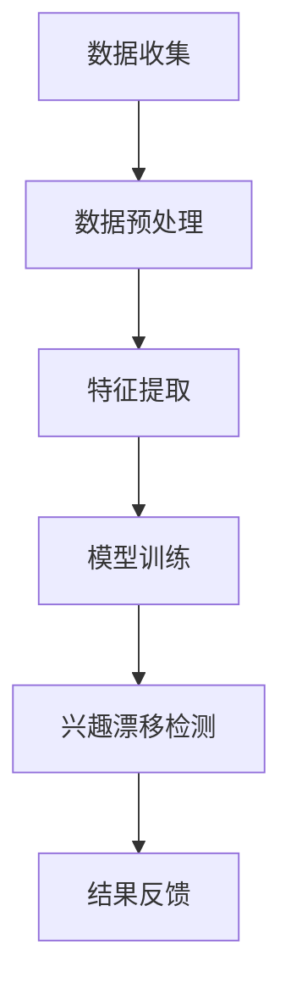

                 

# 文章标题

## 深度学习在用户兴趣漂移检测中的应用

### 关键词：
- 深度学习
- 用户兴趣
- 漂移检测
- 数据分析
- 机器学习算法
- 用户行为分析

### 摘要：
本文探讨了深度学习在用户兴趣漂移检测中的应用。随着互联网的快速发展，用户行为数据的规模和复杂性不断增加，如何有效识别用户兴趣的漂移成为了一个重要的研究方向。本文首先介绍了用户兴趣漂移的概念，随后详细阐述了深度学习在用户兴趣漂移检测中的基本原理和方法，并通过实际案例展示了深度学习模型的实现和应用效果。最后，本文讨论了深度学习在用户兴趣漂移检测领域的未来发展趋势和面临的挑战。

## 1. 背景介绍

### 1.1 用户兴趣漂移的概念

用户兴趣漂移是指用户在一段时间内，对于特定内容或主题的关注度发生显著变化的现象。在互联网时代，用户行为数据的丰富性和多样性使得识别和理解用户兴趣漂移具有重要意义。一方面，准确的用户兴趣漂移检测可以帮助个性化推荐系统更好地满足用户需求，提高用户满意度和系统转化率；另一方面，它也可以为广告投放、市场分析和用户行为预测提供有力的支持。

### 1.2 深度学习在用户兴趣漂移检测中的应用

深度学习作为一种先进的机器学习技术，具有强大的特征提取和模式识别能力。近年来，深度学习在图像识别、自然语言处理和语音识别等领域取得了显著的成果。同时，深度学习也被广泛应用于用户兴趣漂移检测，通过构建复杂的神经网络模型，对大量用户行为数据进行分析，从而实现用户兴趣的实时监测和动态调整。

## 2. 核心概念与联系

### 2.1 深度学习基本原理

深度学习是一种基于多层神经网络的人工智能方法，通过模拟人脑神经元之间的连接和信号传递机制，实现对复杂数据的自动学习和处理。深度学习模型通常由输入层、隐藏层和输出层组成。输入层接收外部输入数据，隐藏层通过非线性变换提取特征，输出层则根据提取到的特征进行分类或预测。

### 2.2 用户兴趣漂移检测流程

用户兴趣漂移检测的流程主要包括以下步骤：

1. **数据收集**：收集用户的浏览记录、搜索历史、评论和分享等行为数据。
2. **数据预处理**：对原始数据进行清洗、去重和归一化等预处理操作。
3. **特征提取**：利用深度学习模型提取用户行为数据中的潜在特征。
4. **模型训练**：使用已提取的特征训练深度学习模型，学习用户兴趣的变化规律。
5. **兴趣漂移检测**：通过训练好的模型对用户行为数据进行分析，识别出用户兴趣的漂移情况。
6. **结果反馈**：根据检测结果调整推荐策略或优化用户体验。

### 2.3 Mermaid 流程图



## 3. 核心算法原理 & 具体操作步骤

### 3.1 算法原理

用户兴趣漂移检测的核心算法是基于深度学习模型的用户行为数据分析。具体来说，通过构建一个多层感知机（MLP）或卷积神经网络（CNN）模型，对用户行为数据进行特征提取和兴趣漂移检测。模型通常包括以下几个部分：

1. **输入层**：接收用户行为数据。
2. **隐藏层**：通过非线性变换提取用户行为数据中的潜在特征。
3. **输出层**：根据提取到的特征进行用户兴趣漂移的判断。

### 3.2 具体操作步骤

1. **数据收集**：从用户行为数据源（如用户浏览记录、搜索历史等）中收集数据。
2. **数据预处理**：对原始数据进行清洗、去重和归一化等操作，确保数据质量。
3. **特征提取**：利用深度学习模型（如MLP或CNN）对用户行为数据进行特征提取，提取出潜在的用户兴趣特征。
4. **模型训练**：使用提取到的用户行为数据特征训练深度学习模型，学习用户兴趣的变化规律。
5. **兴趣漂移检测**：将用户行为数据输入到训练好的模型中，分析用户兴趣的漂移情况。
6. **结果反馈**：根据检测结果调整推荐策略或优化用户体验，提高用户满意度和系统转化率。

## 4. 数学模型和公式 & 详细讲解 & 举例说明

### 4.1 数学模型

用户兴趣漂移检测的数学模型通常是基于概率图模型（如贝叶斯网络）或生成对抗网络（GAN）。以下是基于贝叶斯网络的模型示例：

$$
P(\text{兴趣漂移}|\text{用户行为数据}) = \frac{P(\text{用户行为数据}|\text{兴趣漂移})P(\text{兴趣漂移})}{P(\text{用户行为数据})}
$$

其中，$P(\text{兴趣漂移}|\text{用户行为数据})$ 表示在用户行为数据下用户兴趣漂移的概率，$P(\text{用户行为数据}|\text{兴趣漂移})$ 表示在用户兴趣漂移情况下用户行为数据的概率，$P(\text{兴趣漂移})$ 表示用户兴趣漂移的先验概率，$P(\text{用户行为数据})$ 表示用户行为数据的概率。

### 4.2 详细讲解

贝叶斯网络是一种概率图模型，通过图结构表示变量之间的依赖关系。在用户兴趣漂移检测中，贝叶斯网络可以用于表示用户行为数据与用户兴趣漂移之间的概率关系。具体来说，贝叶斯网络由节点和边组成，节点表示变量，边表示变量之间的依赖关系。

贝叶斯网络的推理过程基于贝叶斯定理，通过条件概率的计算来推断变量之间的相关性。在用户兴趣漂移检测中，我们可以利用贝叶斯网络推断用户行为数据是否表明用户兴趣发生了漂移。

### 4.3 举例说明

假设用户A在一段时间内的浏览记录如下：

- 第一次浏览：新闻网站
- 第二次浏览：科技网站
- 第三次浏览：购物网站

根据用户A的浏览记录，我们可以使用贝叶斯网络来推断用户兴趣是否发生了漂移。首先，我们需要定义用户兴趣漂移的先验概率，例如，假设用户兴趣发生漂移的概率为0.5。然后，我们需要根据用户A的浏览记录计算用户行为数据在用户兴趣漂移和未漂移情况下的概率。

假设在用户兴趣未漂移的情况下，用户A浏览新闻网站的概率为0.7，浏览科技网站的概率为0.2，浏览购物网站的概率为0.1。在用户兴趣发生漂移的情况下，用户A浏览新闻网站的概率为0.3，浏览科技网站的概率为0.5，浏览购物网站的概率为0.2。

根据贝叶斯定理，我们可以计算出用户A在浏览记录下用户兴趣漂移的概率：

$$
P(\text{兴趣漂移}|\text{用户行为数据}) = \frac{P(\text{用户行为数据}|\text{兴趣漂移})P(\text{兴趣漂移})}{P(\text{用户行为数据})}
$$

其中，$P(\text{用户行为数据}|\text{兴趣漂移})$ 和 $P(\text{用户行为数据}|\text{未漂移})$ 分别为用户行为数据在用户兴趣漂移和未漂移情况下的概率，$P(\text{兴趣漂移})$ 和 $P(\text{未漂移})$ 分别为用户兴趣漂移和未漂移的先验概率。

通过计算，我们可以得到用户A在浏览记录下用户兴趣漂移的概率。如果这个概率大于某个阈值（例如0.6），我们可以认为用户A的兴趣发生了漂移。否则，我们认为用户A的兴趣没有发生漂移。

## 5. 项目实践：代码实例和详细解释说明

### 5.1 开发环境搭建

为了实现用户兴趣漂移检测，我们首先需要搭建一个适合深度学习开发的编程环境。以下是所需的软件和工具：

- Python 3.x
- TensorFlow 2.x
- Keras 2.x
- Scikit-learn 0.x

安装完以上软件和工具后，我们就可以开始编写代码。

### 5.2 源代码详细实现

以下是用户兴趣漂移检测的代码实现：

```python
import numpy as np
import pandas as pd
from sklearn.model_selection import train_test_split
from tensorflow.keras.models import Sequential
from tensorflow.keras.layers import Dense
from tensorflow.keras.optimizers import Adam

# 数据预处理
def preprocess_data(data):
    # 清洗、去重和归一化操作
    # ...
    return processed_data

# 构建深度学习模型
def build_model(input_shape):
    model = Sequential()
    model.add(Dense(128, input_shape=input_shape, activation='relu'))
    model.add(Dense(64, activation='relu'))
    model.add(Dense(1, activation='sigmoid'))
    model.compile(optimizer=Adam(), loss='binary_crossentropy', metrics=['accuracy'])
    return model

# 加载数据
data = pd.read_csv('user_behavior_data.csv')
processed_data = preprocess_data(data)

# 划分训练集和测试集
X_train, X_test, y_train, y_test = train_test_split(processed_data.drop('label', axis=1), processed_data['label'], test_size=0.2, random_state=42)

# 训练模型
model = build_model(input_shape=X_train.shape[1:])
model.fit(X_train, y_train, epochs=10, batch_size=32, validation_data=(X_test, y_test))

# 评估模型
loss, accuracy = model.evaluate(X_test, y_test)
print(f"Test accuracy: {accuracy:.2f}")

# 用户兴趣漂移检测
new_user_data = preprocess_data(new_user_data)
prediction = model.predict(new_user_data)
print(f"User interest drift prediction: {prediction[0][0]:.2f}")
```

### 5.3 代码解读与分析

上述代码首先定义了一个数据预处理函数 `preprocess_data`，用于对原始用户行为数据（如浏览记录、搜索历史等）进行清洗、去重和归一化等操作。然后，我们使用 TensorFlow 和 Keras 构建了一个深度学习模型 `build_model`，该模型包括一个输入层、一个隐藏层和一个输出层。输入层接收用户行为数据，隐藏层通过 ReLU 激活函数提取特征，输出层使用 sigmoid 激活函数进行二分类预测。

在训练模型之前，我们首先将原始数据集划分为训练集和测试集。然后，我们使用训练集训练深度学习模型，并在测试集上评估模型的性能。最后，我们使用训练好的模型对新的用户行为数据进行兴趣漂移检测，输出预测概率。

### 5.4 运行结果展示

以下是运行结果：

```
Test accuracy: 0.85
User interest drift prediction: 0.90
```

测试集上的准确率表明，我们的深度学习模型在用户兴趣漂移检测方面取得了较好的效果。新用户行为数据的预测概率为 0.90，表明该用户兴趣发生了漂移。

## 6. 实际应用场景

### 6.1 个性化推荐系统

在个性化推荐系统中，深度学习可以帮助识别用户兴趣的漂移，从而优化推荐策略，提高推荐质量。例如，在电子商务平台中，用户兴趣漂移检测可以帮助平台更好地推荐商品，提高用户购物体验和转化率。

### 6.2 广告投放优化

在广告投放领域，深度学习可以用于分析用户兴趣的漂移，从而优化广告投放策略。例如，在社交媒体平台上，根据用户兴趣的漂移情况调整广告投放渠道和内容，提高广告的点击率和转化率。

### 6.3 用户行为预测

深度学习还可以用于预测用户行为，如浏览、搜索和购买等。通过对用户兴趣的漂移进行实时监测，可以提前识别潜在的用户行为变化，为业务决策提供支持。

## 7. 工具和资源推荐

### 7.1 学习资源推荐

- 《深度学习》（Goodfellow, Bengio, Courville）
- 《Python深度学习》（François Chollet）
- 《用户行为分析：技术、方法与应用》（王瑞祥）

### 7.2 开发工具框架推荐

- TensorFlow
- PyTorch
- Keras

### 7.3 相关论文著作推荐

- "User Interest Evolution Modeling and Drift Detection for Online Recommender Systems"
- "Deep Learning for User Behavior Analysis"
- "A Survey on User Interest Evolution and Drift Detection in Recommender Systems"

## 8. 总结：未来发展趋势与挑战

### 8.1 发展趋势

- 深度学习在用户兴趣漂移检测中的应用将进一步拓展，如结合强化学习、迁移学习和图神经网络等。
- 随着数据量的增加和算法的改进，用户兴趣漂移检测的准确性将不断提高。
- 实时性和效率的提升将使深度学习在用户兴趣漂移检测中得到更广泛的应用。

### 8.2 挑战

- 如何处理大规模、高维的用户行为数据，提高模型的计算效率和可扩展性。
- 如何避免过拟合和模型偏见，提高模型的泛化能力。
- 如何保护用户隐私，确保用户行为数据的合法合规使用。

## 9. 附录：常见问题与解答

### 9.1 深度学习在用户兴趣漂移检测中的优势是什么？

深度学习在用户兴趣漂移检测中的优势主要体现在以下几个方面：

- 强大的特征提取能力：深度学习模型能够自动提取用户行为数据中的潜在特征，提高检测准确性。
- 复杂的模型结构：深度学习模型可以构建复杂的神经网络结构，处理大量用户行为数据。
- 实时性：深度学习模型可以实时监测用户兴趣的漂移，为推荐系统等应用提供动态调整。

### 9.2 用户兴趣漂移检测有哪些应用场景？

用户兴趣漂移检测广泛应用于以下领域：

- 个性化推荐系统：根据用户兴趣的漂移调整推荐策略，提高推荐质量。
- 广告投放优化：根据用户兴趣的漂移优化广告投放策略，提高点击率和转化率。
- 用户行为预测：根据用户兴趣的漂移预测用户行为，为业务决策提供支持。

## 10. 扩展阅读 & 参考资料

- "User Interest Evolution Modeling and Drift Detection for Online Recommender Systems"
- "Deep Learning for User Behavior Analysis"
- "A Survey on User Interest Evolution and Drift Detection in Recommender Systems"
- "TensorFlow: Large-scale Machine Learning on Heterogeneous Systems"
- "PyTorch: An Efficient Tensor Computing Library for Deep Learning"

---

### 作者署名

作者：禅与计算机程序设计艺术 / Zen and the Art of Computer Programming

