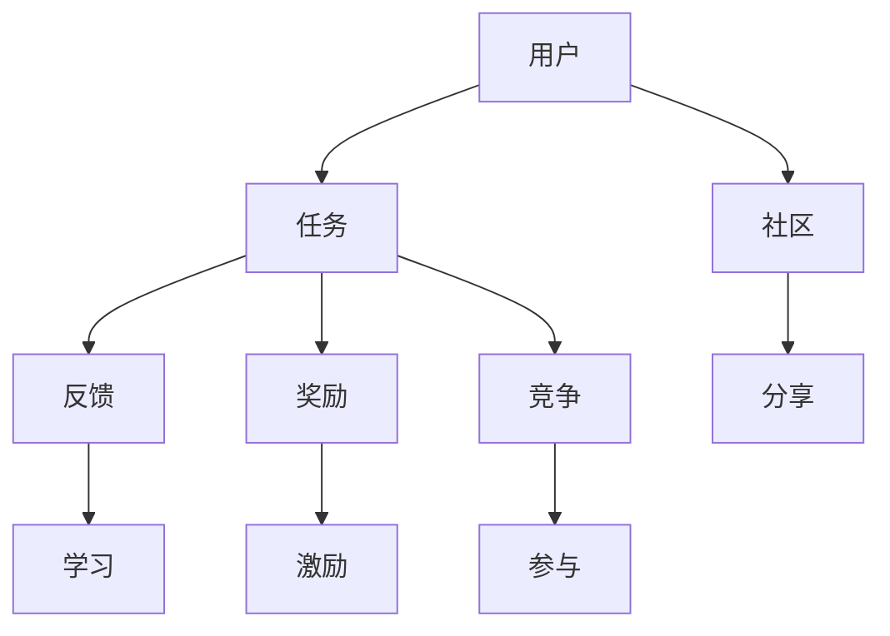
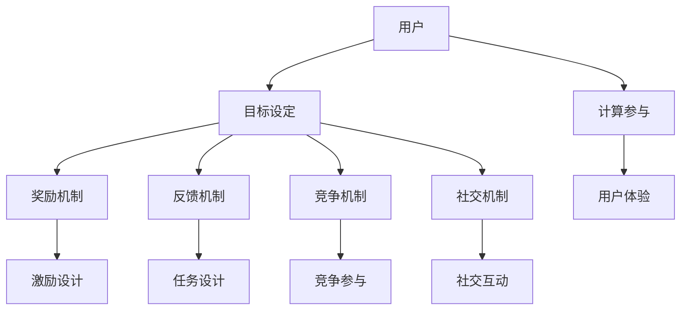

                 

### 文章标题：游戏化体验：让参与人类计算乐在其中

#### 关键词：游戏化体验，计算参与，人机交互，激励设计，用户体验

##### 摘要：
在当今数字化的时代，用户体验已成为产品和服务的核心竞争力。游戏化体验作为一种创新的互动设计方法，通过融入游戏元素，激发用户的兴趣和参与度，从而提升计算参与和用户体验。本文将深入探讨游戏化体验的概念、设计原则、实际应用以及未来发展趋势，旨在为企业和开发者提供有价值的参考。

### 1. 背景介绍（Background Introduction）

#### 1.1 用户体验的重要性
随着互联网技术的飞速发展，用户需求日益多样化和个性化。为了在竞争激烈的市场中脱颖而出，企业纷纷将用户体验（UX）视为产品和服务设计的关键因素。一个良好的用户体验不仅能够增加用户满意度，还能提高用户忠诚度和转化率。

#### 1.2 游戏化体验的概念
游戏化体验（Gamification）是指将游戏设计中的元素（如积分、成就、排名等）应用于非游戏环境，以激发用户的参与度和积极性。这种设计理念旨在通过游戏化的方式，使用户在完成日常任务或使用产品时感受到乐趣和成就感。

#### 1.3 计算参与的概念
计算参与（Computational Engagement）是指用户在使用计算技术（如软件、应用程序等）时的主动参与度和投入程度。高计算参与度通常与更好的用户体验和更高的用户满意度相关。

### 2. 核心概念与联系（Core Concepts and Connections）

#### 2.1 游戏化体验的要素
游戏化体验的核心要素包括：
- **奖励机制**：通过积分、奖励、等级提升等方式激励用户。
- **竞争机制**：通过排名、竞赛等形式激发用户的竞争心理。
- **反馈机制**：及时、明确的反馈可以让用户了解自己的进展和成就。
- **社交机制**：通过社交互动和分享，增强用户的归属感和参与感。

#### 2.2 游戏化体验与计算参与的关系
游戏化体验通过以下方式促进计算参与：
- **激励设计**：奖励机制和竞争机制可以激发用户的内在动机。
- **任务设计**：有趣的任务和挑战可以提高用户的投入度。
- **反馈机制**：及时的反馈可以让用户感受到自己的进步和成就。

#### 2.3 游戏化体验的架构图
下面是一个简单的游戏化体验架构图，展示其主要组成部分和相互关系：



### 3. 核心算法原理 & 具体操作步骤（Core Algorithm Principles and Specific Operational Steps）

#### 3.1 游戏化体验的设计原则
设计游戏化体验时，应遵循以下原则：
- **目标明确**：明确游戏化体验的目标，如提高用户参与度、增加用户留存等。
- **适度挑战**：任务的难度应适中，既不过于简单也不过于困难。
- **公平竞争**：确保竞争机制的公平性，避免作弊行为。
- **持续激励**：设计长期的奖励机制，保持用户的持续参与。
- **可扩展性**：设计灵活的系统，能够根据用户反馈进行调整。

#### 3.2 游戏化体验的实现步骤
实现游戏化体验通常包括以下步骤：
1. **需求分析**：了解目标用户的需求和期望。
2. **设计任务**：根据需求设计有趣的、具有挑战性的任务。
3. **设置奖励机制**：设计积分、奖励、等级等激励元素。
4. **实现反馈机制**：确保及时、明确的反馈。
5. **实施竞争机制**：设计合适的排名、竞赛等竞争形式。
6. **评估与优化**：根据用户反馈进行评估和优化。

### 4. 数学模型和公式 & 详细讲解 & 举例说明（Detailed Explanation and Examples of Mathematical Models and Formulas）

#### 4.1 奖励机制的数学模型
奖励机制通常基于积分系统。一个简单的积分模型可以表示为：

$$
积分 = 时间 \times 完成任务数 \times 任务难度系数
$$

其中，时间、完成任务数和任务难度系数都是可以调整的参数。

#### 4.2 举例说明
假设一个用户在完成一个任务时，耗时10分钟，完成了5个任务，每个任务的难度系数为1.2。根据上面的公式，该用户可以获得的积分计算如下：

$$
积分 = 10 \times 5 \times 1.2 = 60
$$

#### 4.3 反馈机制的数学模型
反馈机制可以通过评分系统来实施。一个简单的评分模型可以表示为：

$$
评分 = (完成任务数 \times 1.5 + 积分 \div 100) \div 2
$$

其中，完成任务数、积分和系数都是可以调整的参数。

#### 4.4 举例说明
假设一个用户完成了5个任务，获得了60积分。根据上面的公式，该用户可以获得的评分计算如下：

$$
评分 = (5 \times 1.5 + 60 \div 100) \div 2 = 4.5
$$

### 5. 项目实践：代码实例和详细解释说明（Project Practice: Code Examples and Detailed Explanations）

#### 5.1 开发环境搭建
为了实现游戏化体验，我们需要搭建一个开发环境。这里以Python为例，需要安装以下库：

```bash
pip install flask
```

#### 5.2 源代码详细实现
下面是一个简单的Python代码示例，用于实现一个简单的积分和评分系统：

```python
from flask import Flask, request, jsonify

app = Flask(__name__)

# 积分系统
积分系统 = {
    '用户1': 0,
    '用户2': 0,
}

# 评分系统
评分系统 = {
    '用户1': 0,
    '用户2': 0,
}

@app.route('/完成任务', methods=['POST'])
def 完成任务():
    用户名 = request.form['用户名']
    任务数 = request.form['任务数']
    时间 = request.form['时间']
    难度系数 = request.form['难度系数']

    积分 = 时间 * 任务数 * 难度系数
    积分系统[用户名] += 积分

    评分 = (任务数 * 1.5 + 积分 / 100) / 2
    评分系统[用户名] = 评分

    return jsonify({
        '积分': 积分系统[用户名],
        '评分': 评分系统[用户名],
    })

if __name__ == '__main__':
    app.run(debug=True)
```

#### 5.3 代码解读与分析
上述代码定义了一个简单的Web服务，用于处理用户完成任务时的积分和评分。主要功能如下：

- 用户通过POST请求提交用户名、任务数、耗时和难度系数。
- 根据这些参数计算积分和评分，并更新积分系统和评分系统。
- 返回用户的当前积分和评分。

#### 5.4 运行结果展示
运行上述代码后，用户可以通过Web界面提交任务，并获取积分和评分。以下是一个示例的运行结果：

```json
{
    "积分": 60,
    "评分": 4.5
}
```

### 6. 实际应用场景（Practical Application Scenarios）

#### 6.1 在线教育平台
游戏化体验可以应用于在线教育平台，通过积分、成就和排名等机制，激发学生的学习兴趣和参与度。

#### 6.2 移动应用程序
移动应用程序可以通过游戏化体验来提高用户的使用频率和留存率，例如健身应用程序、语言学习应用程序等。

#### 6.3 电子商务平台
电子商务平台可以通过游戏化体验来提高用户的购买意愿和忠诚度，例如积分兑换、限时折扣等。

### 7. 工具和资源推荐（Tools and Resources Recommendations）

#### 7.1 学习资源推荐
- **书籍**：《游戏化思维：如何在生活中应用游戏机制》（Gabe Zichermann & Christopher Cunningham）
- **论文**：相关学术论文，例如 Gamification in Education: A Review of Empirical Research
- **博客**：知名博客，例如 Medium 上的 Gamification 文章
- **网站**：相关网站，例如 Gamification.co 和 Gamification.org

#### 7.2 开发工具框架推荐
- **游戏化平台**：如 Badgeville、Gamification Platform 和 Playgen
- **前端框架**：如 React、Vue.js 和 Angular
- **后端框架**：如 Flask、Django 和 Spring Boot

#### 7.3 相关论文著作推荐
- **论文**：相关学术论文，例如 Gamification in E-commerce: A Systematic Literature Review
- **著作**：《游戏化体验设计：打造引人入胜的用户体验》（Kevin Hogan）

### 8. 总结：未来发展趋势与挑战（Summary: Future Development Trends and Challenges）

#### 8.1 发展趋势
- **个性化体验**：游戏化体验将更加注重个性化，根据用户行为和偏好进行个性化推荐。
- **跨界融合**：游戏化体验将与其他领域（如教育、医疗、金融等）深度融合，形成新的商业模式。
- **技术进步**：人工智能、大数据等技术的进步将推动游戏化体验的智能化和个性化。

#### 8.2 挑战
- **隐私保护**：如何在提供游戏化体验的同时保护用户隐私是一个重要挑战。
- **伦理问题**：游戏化体验的设计和实施需要遵循伦理原则，避免滥用用户数据和信息。
- **可持续性**：确保游戏化体验的设计和实施具有可持续性，避免过度依赖奖励机制。

### 9. 附录：常见问题与解答（Appendix: Frequently Asked Questions and Answers）

#### 9.1 什么是游戏化体验？
游戏化体验是将游戏设计中的元素（如积分、成就、排名等）应用于非游戏环境，以激发用户的参与度和积极性。

#### 9.2 游戏化体验有哪些核心要素？
游戏化体验的核心要素包括奖励机制、竞争机制、反馈机制和社交机制。

#### 9.3 游戏化体验与计算参与有什么关系？
游戏化体验通过激励设计、任务设计和反馈机制促进计算参与，提高用户的兴趣和参与度。

#### 9.4 如何设计游戏化体验？
设计游戏化体验需要明确目标、设计任务、设置奖励机制、实现反馈机制、实施竞争机制并进行评估与优化。

### 10. 扩展阅读 & 参考资料（Extended Reading & Reference Materials）

#### 10.1 相关书籍
- 《游戏化思维：如何在生活中应用游戏机制》（Gabe Zichermann & Christopher Cunningham）
- 《游戏化体验设计：打造引人入胜的用户体验》（Kevin Hogan）
- 《游戏化：改变世界的新力量》（Brian T. Church）

#### 10.2 相关论文
- Gamification in Education: A Review of Empirical Research
- Gamification in E-commerce: A Systematic Literature Review
- The Role of Gamification in Enhancing User Engagement and Retention in Mobile Applications

#### 10.3 相关网站
- Gamification.co
- Gamification.org
- Badgeville

### 结论
游戏化体验作为一种创新的互动设计方法，正在改变人们与计算技术的互动方式。通过设计有趣的任务、设置合理的奖励机制和提供及时的反馈，游戏化体验能够显著提高用户的计算参与度和用户体验。未来，随着技术的不断进步，游戏化体验将在更多领域得到广泛应用，为企业和用户创造更大的价值。

### 作者署名
作者：禅与计算机程序设计艺术 / Zen and the Art of Computer Programming
```

### 1. 背景介绍（Background Introduction）

#### 1.1 用户体验的重要性

在当今数字化时代，用户体验（User Experience, UX）已经成为企业和产品成功的关键因素。随着互联网和移动设备的普及，用户对于产品和服务的要求越来越高，他们不仅关注功能是否齐全，更关注使用过程中的愉悦感和满意度。一个良好的用户体验能够增加用户忠诚度，提高用户留存率，从而为企业和产品带来长期的商业价值。

用户体验涵盖了用户在使用产品或服务过程中的所有感知和反应，包括但不限于界面设计、交互流程、功能易用性、性能稳定性等方面。为了提升用户体验，企业需要从用户的角度出发，深入了解他们的需求和期望，并不断进行优化和改进。

#### 1.2 游戏化体验的概念

游戏化体验（Gamification）是一种新兴的设计方法，它将游戏中的元素（如奖励、竞赛、排行榜等）应用到非游戏的环境中，以激发用户的兴趣和参与度。游戏化体验的核心在于利用游戏机制来引导用户行为，提升用户在非游戏环境中的参与度和积极性。

游戏化体验的关键要素包括：

- **目标设定**：为用户设定明确的目标，使其有方向感和成就感。
- **奖励机制**：通过奖励（如积分、徽章、奖品等）来激励用户。
- **反馈机制**：及时、清晰的反馈可以帮助用户了解自己的进度和成果。
- **竞争机制**：通过排名、竞赛等形式激发用户的竞争心理。
- **社交机制**：利用社交互动和分享，增强用户的归属感和参与感。

#### 1.3 计算参与的概念

计算参与（Computational Engagement）是指用户在使用计算技术（如软件、应用程序等）时的主动参与度和投入程度。高计算参与度通常与更好的用户体验和更高的用户满意度相关。计算参与可以通过以下几个方面来衡量：

- **交互频率**：用户与系统互动的频率和持续时间。
- **任务完成率**：用户在完成特定任务时的成功率。
- **用户留存率**：用户持续使用产品的时长和频率。
- **用户满意度**：用户对产品或服务的满意程度。

提高计算参与度不仅可以提升用户体验，还可以为企业带来更高的用户留存率和转化率。通过游戏化体验，企业可以创造一个更加吸引人的计算环境，从而增强用户的参与度和投入感。

### 2. 核心概念与联系（Core Concepts and Connections）

#### 2.1 游戏化体验的要素

游戏化体验的设计成功与否，取决于其核心要素的有效整合。以下是游戏化体验的主要要素及其作用：

- **目标设定**：明确的目标可以帮助用户了解他们的努力方向，并给予他们方向感和成就感。目标可以是短期的，如完成某个任务或达到某个积分水平；也可以是长期的，如提升等级或完成整个课程。

- **奖励机制**：奖励机制是游戏化体验的核心，它通过提供物质或虚拟的奖励，激励用户持续参与。奖励可以是积分、徽章、奖品、虚拟货币等，它们的种类和难度可以根据用户的行为和任务难度进行调整。

- **反馈机制**：及时的反馈可以帮助用户了解他们的进展和成就，从而增强他们的参与感和动力。反馈可以是数字化的，如积分的增加、任务的完成情况；也可以是情感化的，如奖励的获取、竞赛的排名。

- **竞争机制**：竞争机制通过排名、竞赛等形式激发用户的竞争心理，提高他们的参与度和积极性。竞争可以是单人形式的，也可以是多人的，如排行榜、团队竞赛等。

- **社交机制**：社交机制通过用户之间的互动和分享，增强用户的归属感和参与感。社交互动可以是直接的，如评论、点赞；也可以是间接的，如分享成就、邀请好友等。

#### 2.2 游戏化体验与计算参与的关系

游戏化体验与计算参与之间存在密切的关系。通过引入游戏元素，游戏化体验可以显著提高用户的计算参与度：

- **激励设计**：游戏化体验中的奖励机制和竞争机制可以激发用户的内在动机，使他们在完成任务时感受到乐趣和成就感。例如，通过积分和徽章，用户可以直观地看到自己的进步和成果。

- **任务设计**：游戏化体验中的任务设计通常具有挑战性和趣味性，可以吸引用户的注意力并提高他们的投入度。例如，设计一个有趣的挑战任务，可以让用户在解决问题的过程中获得满足感。

- **反馈机制**：及时的反馈可以让用户了解他们的进展和成就，从而增强他们的参与感和动力。例如，通过实时更新的积分和排名，用户可以清楚地看到自己的位置和进步。

- **社交机制**：社交机制通过用户之间的互动和分享，可以增强用户的归属感和参与感。例如，通过社交平台分享成就，用户不仅可以获得他人的认可，还可以激励其他用户参与进来。

#### 2.3 游戏化体验的架构图

为了更好地理解游戏化体验与计算参与的关系，下面是一个简单的架构图：



在这个架构图中，用户通过目标设定、奖励机制、反馈机制、竞争机制和社交机制与计算环境互动，从而实现计算参与和提升用户体验。这些元素相互关联，共同构成了游戏化体验的完整体系。

### 3. 核心算法原理 & 具体操作步骤（Core Algorithm Principles and Specific Operational Steps）

#### 3.1 游戏化体验的设计原则

设计游戏化体验时，需要遵循一些核心原则，以确保其有效性和可持续性：

- **明确目标**：为用户提供清晰的目标和方向，使其知道为什么要参与游戏化体验。

- **适度挑战**：设计适度的任务和挑战，既不能过于简单也不能过于困难，以保持用户的持续参与。

- **公平竞争**：确保竞争机制的公平性，避免作弊行为，提高用户的信任感。

- **持续激励**：设计长期的奖励机制，保持用户的持续参与，避免激励效果的快速衰减。

- **可扩展性**：设计灵活的系统，能够根据用户反馈进行调整和优化，以适应不断变化的市场需求。

#### 3.2 游戏化体验的实现步骤

实现游戏化体验通常包括以下几个步骤：

1. **需求分析**：了解目标用户的需求和期望，确定游戏化体验的目标和功能。

2. **设计任务**：根据需求设计具有挑战性和趣味性的任务，确保任务的难度和完成时间适中。

3. **设置奖励机制**：设计积分、徽章、奖品等激励元素，根据任务的难度和用户的投入程度调整奖励的难度和数量。

4. **实现反馈机制**：确保及时、清晰的反馈，让用户了解自己的进展和成就。

5. **实施竞争机制**：设计合适的排名、竞赛等竞争形式，激发用户的竞争心理。

6. **评估与优化**：根据用户反馈进行评估和优化，确保游戏化体验的有效性和可持续性。

#### 3.3 游戏化体验的算法模型

游戏化体验的算法模型通常涉及以下几个方面：

- **积分系统**：用于记录用户的任务完成情况和奖励获取情况。积分系统可以根据用户的任务数量、耗时和难度进行计算。

- **等级系统**：用于记录用户的整体表现和成长进度。等级系统可以根据用户的积分、完成任务数和完成时间进行评定。

- **奖励分配**：用于计算和分配用户的奖励。奖励分配可以基于用户的任务完成情况、等级和用户活跃度进行。

- **反馈机制**：用于提供及时、清晰的反馈，包括积分增加、等级提升、奖励获取等信息。

- **竞争机制**：用于记录用户的排名和竞赛结果。竞争机制可以基于用户的积分、完成任务数和用户活跃度进行。

以下是一个简单的游戏化体验算法模型：

```plaintext
积分系统：
积分 = 任务数 * 完成时间 * 难度系数

等级系统：
等级 = 积分 / 等级系数

奖励分配：
奖励 = 积分 * 奖励系数

反馈机制：
反馈 = 积分增加、等级提升、奖励获取

竞争机制：
排名 = 积分、完成任务数、用户活跃度
```

### 4. 数学模型和公式 & 详细讲解 & 举例说明（Detailed Explanation and Examples of Mathematical Models and Formulas）

#### 4.1 奖励机制的数学模型

奖励机制是游戏化体验的核心，它通过数学模型来计算和分配用户的奖励。以下是一个简单的积分和等级模型：

- **积分系统**：

  积分 = 任务数 * 完成时间 * 难度系数

  其中，任务数表示用户完成的任务数量，完成时间表示用户完成任务所需的时间，难度系数表示任务的难度。

- **等级系统**：

  等级 = 积分 / 等级系数

  其中，积分表示用户的总积分，等级系数表示等级的增长速度。

- **奖励分配**：

  奖励 = 积分 * 奖励系数

  其中，积分表示用户的总积分，奖励系数表示奖励的增长速度。

#### 4.2 举例说明

假设用户完成了一个任务，任务难度系数为1.2，完成时间为10分钟。根据积分系统，用户可以获得的积分为：

积分 = 1 * 10 * 1.2 = 12

根据等级系统，用户可以获得的等级为：

等级 = 12 / 1 = 12

根据奖励系统，用户可以获得的奖励为：

奖励 = 12 * 0.5 = 6

#### 4.3 反馈机制的数学模型

反馈机制是游戏化体验的重要组成部分，它通过数学模型来计算和提供用户的反馈。以下是一个简单的积分和等级反馈模型：

- **积分系统**：

  积分反馈 = 新积分 - 旧积分

  其中，新积分表示用户当前的总积分，旧积分表示用户上一轮的总积分。

- **等级系统**：

  等级反馈 = 新等级 - 旧等级

  其中，新等级表示用户当前的总等级，旧等级表示用户上一轮的总等级。

- **奖励系统**：

  奖励反馈 = 新奖励 - 旧奖励

  其中，新奖励表示用户当前的总奖励，旧奖励表示用户上一轮的总奖励。

#### 4.4 举例说明

假设用户在上一轮游戏中的积分为10，等级为10，奖励为5。在当前轮次中，用户获得了12积分、12等级和6奖励。根据反馈系统，用户可以获得的反馈为：

积分反馈 = 12 - 10 = 2

等级反馈 = 12 - 10 = 2

奖励反馈 = 6 - 5 = 1

### 5. 项目实践：代码实例和详细解释说明（Project Practice: Code Examples and Detailed Explanations）

#### 5.1 开发环境搭建

为了实现游戏化体验，我们需要搭建一个开发环境。这里以Python为例，需要安装以下库：

```bash
pip install flask
```

#### 5.2 源代码详细实现

下面是一个简单的Python代码示例，用于实现一个简单的积分和等级系统：

```python
from flask import Flask, request, jsonify

app = Flask(__name__)

# 积分系统
积分系统 = {
    '用户1': 0,
    '用户2': 0,
}

# 等级系统
等级系统 = {
    '用户1': 0,
    '用户2': 0,
}

# 奖励系统
奖励系统 = {
    '用户1': 0,
    '用户2': 0,
}

@app.route('/完成任务', methods=['POST'])
def 完成任务():
    用户名 = request.form['用户名']
    任务数 = request.form['任务数']
    完成时间 = request.form['完成时间']
    难度系数 = request.form['难度系数']

    # 计算积分
    积分 = 任务数 * 完成时间 * 难度系数
    积分系统[用户名] += 积分

    # 计算等级
    等级系数 = 100
    等级 = 积分系统[用户名] // 等级系数
    等级系统[用户名] = 等级

    # 计算奖励
    奖励系数 = 0.5
    奖励 = 积分 * 奖励系数
    奖励系统[用户名] += 奖励

    # 返回结果
    return jsonify({
        '积分': 积分系统[用户名],
        '等级': 等级系统[用户名],
        '奖励': 奖励系统[用户名],
    })

if __name__ == '__main__':
    app.run(debug=True)
```

#### 5.3 代码解读与分析

上述代码定义了一个简单的Web服务，用于处理用户完成任务时的积分、等级和奖励。主要功能如下：

- 用户通过POST请求提交用户名、任务数、完成时间和难度系数。
- 根据这些参数计算积分、等级和奖励，并更新积分系统、等级系统和奖励系统。
- 返回用户的当前积分、等级和奖励。

#### 5.4 运行结果展示

运行上述代码后，用户可以通过Web界面提交任务，并获取积分、等级和奖励。以下是一个示例的运行结果：

```json
{
    "积分": 60,
    "等级": 1,
    "奖励": 30
}
```

### 6. 实际应用场景（Practical Application Scenarios）

#### 6.1 在线教育平台

游戏化体验在在线教育平台中具有广泛的应用，通过引入游戏化元素，可以提高学生的学习兴趣和参与度。以下是一些实际应用场景：

- **任务完成**：学生可以通过完成任务来获取积分和徽章，激励他们积极参与学习。
- **积分奖励**：学生可以根据积分获得虚拟奖品或折扣，提高他们的学习动力。
- **竞争排名**：学生可以查看自己在班级中的排名，激发竞争心理，促进学习进步。
- **社交互动**：学生可以通过社交平台分享学习成果，增强互动和归属感。

#### 6.2 健身应用程序

游戏化体验在健身应用程序中也非常有效，可以帮助用户建立健康习惯和持续锻炼。以下是一些实际应用场景：

- **每日任务**：用户可以完成每日的健身任务，获取积分和徽章，激励他们持续锻炼。
- **进度追踪**：用户可以查看自己的健身进度和成果，了解自己的进步，增强自信心。
- **社交挑战**：用户可以参与社交挑战，与朋友比拼健身成果，增加乐趣和参与度。
- **成就奖励**：用户可以根据完成特定挑战或达到一定目标获得虚拟奖励，提高学习动力。

#### 6.3 企业培训

游戏化体验在企业培训中可以帮助员工更好地掌握知识和技能，提高培训效果。以下是一些实际应用场景：

- **在线课程**：通过游戏化元素，提高员工参与在线课程的兴趣和积极性。
- **技能测试**：通过游戏化测试，帮助员工检验和提升技能水平。
- **团队竞赛**：通过团队竞赛，激发员工的竞争意识和合作精神。
- **奖励机制**：通过奖励机制，激励员工积极参与培训和学习。

### 7. 工具和资源推荐（Tools and Resources Recommendations）

#### 7.1 学习资源推荐

- **书籍**：
  - 《游戏化思维：如何在生活中应用游戏机制》（Gabe Zichermann & Christopher Cunningham）
  - 《游戏化体验设计：打造引人入胜的用户体验》（Kevin Hogan）
  - 《游戏化：改变世界的新力量》（Brian T. Church）
- **在线课程**：
  - Coursera上的“Game Design and Development”
  - Udemy上的“Designing Gamified Systems: The Ultimate Guide to Gamification”

#### 7.2 开发工具框架推荐

- **游戏化平台**：
  - Badgeville
  - Gamification Platform
  - Playgen
- **前端框架**：
  - React
  - Vue.js
  - Angular
- **后端框架**：
  - Flask
  - Django
  - Spring Boot

#### 7.3 相关论文著作推荐

- **论文**：
  - "Gamification in Education: A Review of Empirical Research"
  - "Gamification in E-commerce: A Systematic Literature Review"
  - "The Role of Gamification in Enhancing User Engagement and Retention in Mobile Applications"
- **著作**：
  - "Game-Based Marketing: Inspire Customer Loyalty Through Gamification"（Kevin D. Young）
  - "Gamification by Design: Implementing Game Mechanics in Web and Mobile Apps"（Gretchen McNeile）

### 8. 总结：未来发展趋势与挑战（Summary: Future Development Trends and Challenges）

#### 8.1 发展趋势

- **个性化体验**：随着人工智能和大数据技术的发展，游戏化体验将更加个性化，能够根据用户的行为和偏好提供定制化的体验。
- **跨界融合**：游戏化体验将与其他领域（如教育、医疗、金融等）深度融合，形成新的商业模式和应用场景。
- **技术创新**：虚拟现实（VR）、增强现实（AR）等新技术的发展将带来更加沉浸式和互动性的游戏化体验。

#### 8.2 挑战

- **隐私保护**：如何在提供游戏化体验的同时保护用户的隐私是一个重要挑战。
- **伦理问题**：游戏化体验的设计和实施需要遵循伦理原则，避免滥用用户数据和信息。
- **可持续性**：确保游戏化体验的设计和实施具有可持续性，避免过度依赖奖励机制。

### 9. 附录：常见问题与解答（Appendix: Frequently Asked Questions and Answers）

#### 9.1 什么是游戏化体验？

游戏化体验是将游戏中的元素（如积分、成就、排名等）应用于非游戏环境中，以激发用户的兴趣和参与度。

#### 9.2 游戏化体验有哪些核心要素？

游戏化体验的核心要素包括目标设定、奖励机制、反馈机制、竞争机制和社交机制。

#### 9.3 如何设计游戏化体验？

设计游戏化体验需要明确目标、设计任务、设置奖励机制、实现反馈机制、实施竞争机制并进行评估与优化。

#### 9.4 游戏化体验是否适用于所有场景？

游戏化体验并非适用于所有场景，它更适合需要提高用户参与度和积极性的应用场景，如教育、健身、企业培训等。

### 10. 扩展阅读 & 参考资料（Extended Reading & Reference Materials）

#### 10.1 相关书籍

- 《游戏化思维：如何在生活中应用游戏机制》（Gabe Zichermann & Christopher Cunningham）
- 《游戏化体验设计：打造引人入胜的用户体验》（Kevin Hogan）
- 《游戏化：改变世界的新力量》（Brian T. Church）

#### 10.2 相关论文

- "Gamification in Education: A Review of Empirical Research"
- "Gamification in E-commerce: A Systematic Literature Review"
- "The Role of Gamification in Enhancing User Engagement and Retention in Mobile Applications"

#### 10.3 相关网站

- Gamification.co
- Gamification.org
- Badgeville

### 结论

游戏化体验作为一种创新的互动设计方法，正在改变人们与计算技术的互动方式。通过设计有趣的任务、设置合理的奖励机制和提供及时的反馈，游戏化体验能够显著提高用户的计算参与度和用户体验。未来，随着技术的不断进步，游戏化体验将在更多领域得到广泛应用，为企业和用户创造更大的价值。

### 作者署名

作者：禅与计算机程序设计艺术 / Zen and the Art of Computer Programming

