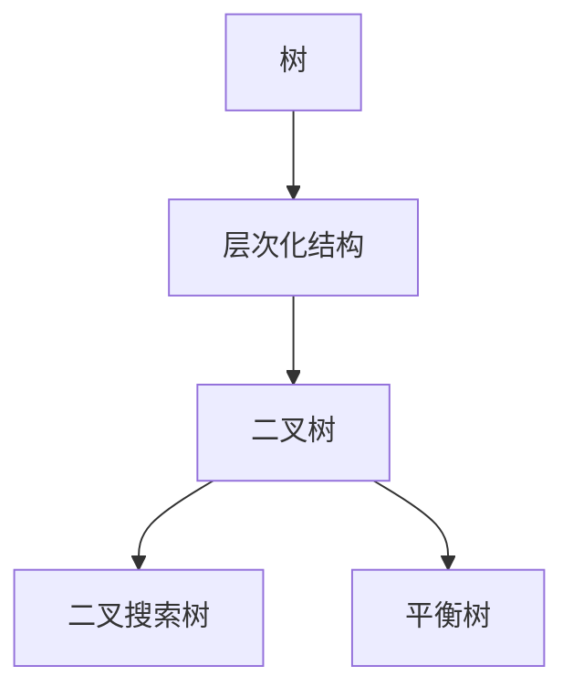
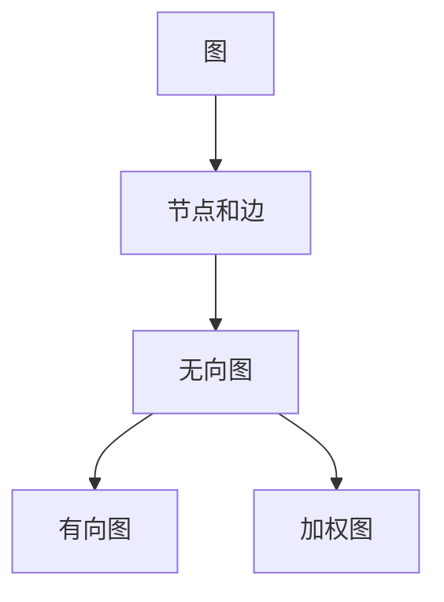
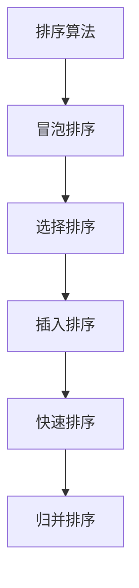
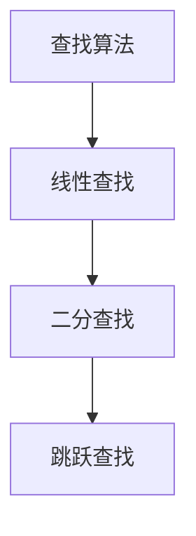
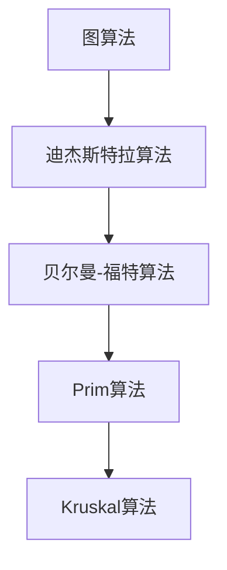
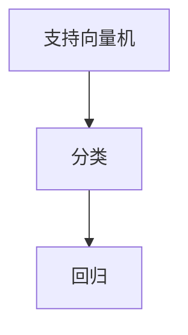
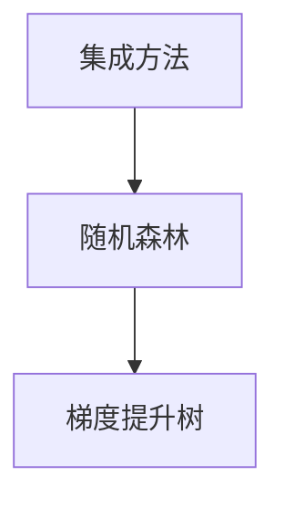
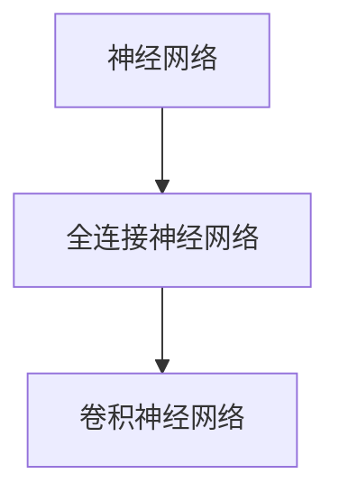
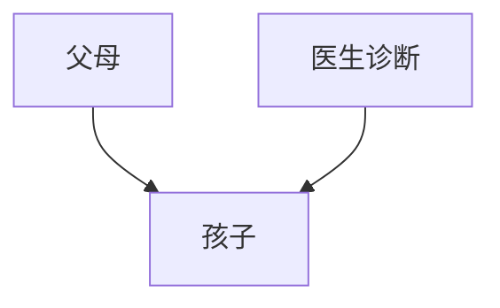
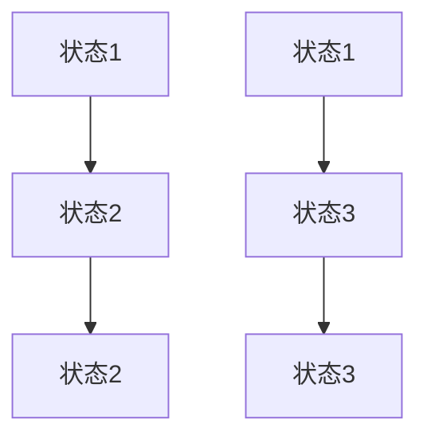

                 

### 文章标题

**滴滴2024校招算法研究员面试题集**

### Keywords:滴滴，校招，算法研究员，面试题，技术面试，算法学习，数据结构，机器学习，编程技巧

### Abstract:
本文是针对滴滴2024校招算法研究员岗位的面试题集，旨在为准备面试的应聘者提供一个全面的复习指南。文章将深入探讨多个核心主题，包括数据结构与算法、机器学习、编程语言、系统设计等。通过逐步分析每个题目，我们将揭示解题思路和策略，并提供实用的解决方案。本文还将推荐相关学习资源和工具，帮助读者在面试中脱颖而出。通过这篇详细的面试题集，读者不仅能熟悉滴滴面试的常见题型，还能提升自身的技术能力和面试技巧。

### 背景介绍（Background Introduction）

滴滴出行作为全球领先的移动出行平台，其2024校招算法研究员岗位备受瞩目。该岗位要求应聘者具备扎实的计算机科学基础、强大的算法能力以及良好的编程技巧。滴滴的面试题目设计新颖、技术含量高，涵盖了广泛的知识领域，旨在筛选出真正具备解决复杂问题能力的优秀人才。

本文旨在为准备滴滴2024校招算法研究员面试的应聘者提供一份详尽的复习资料。我们将按照不同主题分类，逐个解析面试题目，提供解题思路、代码实现和分析。通过本文的深入分析，读者不仅能够掌握面试题的解题技巧，还能提升自身的技术水平和面试能力。

接下来的章节中，我们将首先介绍核心概念与相关技术，然后详细讲解各个面试题的解题步骤和策略。最后，我们还将探讨实际应用场景，推荐学习资源和工具，总结未来发展趋势与挑战，并提供常见问题与解答。希望通过本文，读者能够在滴滴的面试中取得优异的成绩，迈向算法研究员的职业巅峰。

## 2. 核心概念与联系（Core Concepts and Connections）

在探讨滴滴2024校招算法研究员面试题之前，我们需要了解一些核心概念与相关技术，这些知识将为我们理解面试题提供坚实的基础。

### 2.1 数据结构与算法

数据结构与算法是计算机科学的核心概念，贯穿于算法研究员的工作始终。常见的数据结构包括数组、链表、栈、队列、树、图等。每种数据结构都有其独特的应用场景和操作方式。算法方面，我们通常关注排序、查找、图论算法等。例如，排序算法如快速排序、归并排序、堆排序等，在处理大量数据时具有不同的效率和适用场景。

### 2.2 机器学习

机器学习是当前人工智能领域的热门话题。滴滴的面试题目中可能会涉及常见的机器学习算法，如线性回归、逻辑回归、决策树、神经网络等。理解这些算法的基本原理、优缺点和应用场景，对于解决复杂问题至关重要。此外，机器学习中的超参数调优、特征工程等也是面试中的重点内容。

### 2.3 编程语言与编程技巧

滴滴的面试题通常要求使用特定的编程语言（如Python、Java等）进行实现。掌握编程语言的基本语法、数据类型、控制结构、函数和模块等，是应对面试的基础。此外，一些高级编程技巧，如设计模式、代码优化、算法复杂度分析等，也是面试官关注的内容。

### 2.4 系统设计与架构

系统设计与架构能力是算法研究员的重要素质。滴滴的面试题目可能会涉及数据库设计、缓存策略、分布式系统、负载均衡等。理解系统架构的基本原理，以及如何在实际项目中应用这些知识，对于解决复杂问题、优化系统性能至关重要。

### 2.5 算法分析与复杂性理论

算法分析是评估算法性能的重要方法。滴滴的面试题可能会涉及时间复杂度、空间复杂度、最坏情况时间复杂度等。理解这些概念，可以帮助我们更好地评估算法的效率和可行性。

### 2.6 编程实践与面试准备

滴滴的面试不仅考察理论知识的掌握，更注重实际编程能力的体现。因此，通过编程实践来提升解决实际问题的能力是非常重要的。在准备面试的过程中，我们可以通过完成一些经典的编程挑战、模拟面试题等方式，提高编程水平和应对能力。

通过了解这些核心概念与相关技术，我们将为解答滴滴2024校招算法研究员的面试题目奠定坚实的基础。接下来，我们将逐个解析面试题，探讨解题思路和策略，并提供详细的代码实现和分析。让我们一步步深入，共同提升面试技能。

## 2.1 数据结构与算法（Data Structures and Algorithms）

数据结构与算法是计算机科学的核心内容，也是滴滴2024校招算法研究员面试的重点考察领域。理解并掌握常见的数据结构与算法，能够帮助我们高效地解决复杂问题。下面，我们将详细介绍一些常见的数据结构与算法，并使用Mermaid流程图展示其原理和应用场景。

### 2.1.1 常见数据结构（Common Data Structures）

#### 1. 数组（Arrays）

数组是一种基础的数据结构，用于存储固定大小的元素序列。数组在访问和修改元素时具有较低的时间复杂度（O(1)），但在插入和删除操作时时间复杂度较高（O(n)）。

```mermaid
graph TD
A[数组] --> B[固定大小]
B --> C[访问和修改时间复杂度 O(1)]
C --> D[插入和删除时间复杂度 O(n)]
```

#### 2. 链表（Linked Lists）

链表是一种动态数据结构，用于存储一系列元素，每个元素包含指向下一个元素的指针。链表在插入和删除操作时具有较低的时间复杂度（O(1) 或 O(n)），但在访问和修改操作时时间复杂度较高（O(n)）。

```mermaid
graph TD
A[链表] --> B[动态大小]
B --> C[插入和删除时间复杂度 O(1) 或 O(n)]
C --> D[访问和修改时间复杂度 O(n)]
```

#### 3. 栈（Stacks）

栈是一种后进先出（LIFO）的数据结构，用于存储一系列元素。栈在插入和删除操作时具有固定的时间复杂度（O(1)）。

```mermaid
graph TD
A[栈] --> B[后进先出]
B --> C[插入和删除时间复杂度 O(1)]
```

#### 4. 队列（Queues）

队列是一种先进先出（FIFO）的数据结构，用于存储一系列元素。队列在插入和删除操作时具有固定的时间复杂度（O(1)）。

```mermaid
graph TD
A[队列] --> B[先进先出]
B --> C[插入和删除时间复杂度 O(1)]
```

#### 5. 树（Trees）

树是一种层次化的数据结构，用于表示一系列节点。常见的树结构包括二叉树、二叉搜索树、平衡树等。树在访问、插入和删除操作时具有不同时间复杂度，取决于树的结构。



#### 6. 图（Graphs）

图是一种表示多个节点及其之间关系的数据结构。常见的图结构包括无向图、有向图、加权图等。图在访问、插入和删除操作时具有不同时间复杂度，取决于图的结构。



### 2.1.2 常见算法（Common Algorithms）

#### 1. 排序算法（Sorting Algorithms）

排序算法用于对一组数据进行排序。常见的排序算法包括冒泡排序、选择排序、插入排序、快速排序、归并排序等。每种排序算法具有不同的时间复杂度和适用场景。



#### 2. 查找算法（Searching Algorithms）

查找算法用于在数据结构中查找特定元素。常见的查找算法包括线性查找、二分查找、跳跃查找等。每种查找算法具有不同的时间复杂度和适用场景。



#### 3. 图算法（Graph Algorithms）

图算法用于解决与图相关的问题，如最短路径、最小生成树、图遍历等。常见的图算法包括迪杰斯特拉算法、贝尔曼-福特算法、Prim算法、Kruskal算法等。



通过掌握常见的数据结构与算法，我们可以更好地应对滴滴2024校招算法研究员面试中的各种题目。接下来，我们将深入分析面试题目，探讨解题思路和策略。

## 2.2 机器学习（Machine Learning）

机器学习是现代人工智能的核心技术之一，它在数据分析和决策支持等领域发挥着重要作用。滴滴2024校招算法研究员面试中，机器学习相关的题目经常出现，因此了解常见的机器学习算法及其原理至关重要。

### 2.2.1 常见机器学习算法（Common Machine Learning Algorithms）

#### 1. 线性回归（Linear Regression）

线性回归是一种用于预测数值型变量的统计方法。它通过最小二乘法找到一个线性函数，使预测值与实际值之间的误差最小。

```latex
y = \beta_0 + \beta_1 \cdot x
```

#### 2. 逻辑回归（Logistic Regression）

逻辑回归是一种用于预测二分类结果的统计方法。它通过拟合一个逻辑函数，将输入特征映射到概率值。

```latex
\pi = \frac{1}{1 + e^{-(\beta_0 + \beta_1 \cdot x)}}
```

#### 3. 决策树（Decision Trees）

决策树是一种基于树形模型的分类和回归算法。它通过一系列条件分支来分割数据集，并在每个分支节点上选择最优分割策略。

#### 4. 支持向量机（Support Vector Machine, SVM）

SVM是一种基于最大间隔的监督学习算法，用于分类和回归任务。它通过找到一个最优的超平面，使分类间隔最大化。



#### 5. 集成学习方法（Ensemble Methods）

集成学习方法通过结合多个基础模型来提高预测性能。常见的集成方法包括随机森林（Random Forest）和梯度提升树（Gradient Boosting Trees）。



#### 6. 神经网络（Neural Networks）

神经网络是一种模拟人脑的复杂模型，用于分类、回归和生成任务。常见的神经网络包括全连接神经网络（Fully Connected Neural Networks）和卷积神经网络（Convolutional Neural Networks）。



### 2.2.2 数学模型和公式（Mathematical Models and Formulas）

为了更好地理解机器学习算法，我们需要了解一些基本的数学模型和公式。

#### 1. 损失函数（Loss Functions）

损失函数用于评估模型预测值与实际值之间的差距。常见的损失函数包括均方误差（Mean Squared Error, MSE）和交叉熵损失（Cross-Entropy Loss）。

```latex
MSE = \frac{1}{m} \sum_{i=1}^{m} (y_i - \hat{y}_i)^2
```

```latex
Cross-Entropy = - \sum_{i=1}^{m} y_i \cdot \log(\hat{y}_i)
```

#### 2. 梯度下降（Gradient Descent）

梯度下降是一种优化算法，用于最小化损失函数。它通过计算损失函数关于模型参数的梯度，并沿着梯度的反方向更新参数。

```latex
\theta = \theta - \alpha \cdot \nabla_\theta J(\theta)
```

#### 3. 激活函数（Activation Functions）

激活函数用于引入非线性因素，使神经网络能够学习复杂的函数。常见的激活函数包括 sigmoid、ReLU 和 tanh。

```latex
sigmoid(x) = \frac{1}{1 + e^{-x}}
```

```latex
ReLU(x) = \max(0, x)
```

```latex
tanh(x) = \frac{e^{2x} - 1}{e^{2x} + 1}
```

### 2.2.3 实例讲解（Example Explanations）

以下是一个简单的线性回归实例，用于预测房价。

#### 问题：给定一组房屋特征（如面积、卧室数量等），使用线性回归预测房价。

#### 数据集：
```
面积    卧室数量    房价
2000    2           300000
2500    3           350000
3000    4           400000
```

#### 模型：
```
房价 = \beta_0 + \beta_1 \cdot 面积
```

#### 梯度下降步骤：
1. 初始化参数 \(\beta_0 = 0\)，\(\beta_1 = 0\)。
2. 计算损失函数 \(J(\beta_0, \beta_1)\)。
3. 计算梯度 \(\nabla_\beta J(\beta_0, \beta_1)\)。
4. 更新参数 \(\beta_0 = \beta_0 - \alpha \cdot \nabla_\beta J(\beta_0, \beta_1)\)，\(\beta_1 = \beta_1 - \alpha \cdot \nabla_\beta J(\beta_0, \beta_1)\)。
5. 重复步骤2-4，直到损失函数收敛。

通过上述步骤，我们可以逐步优化模型参数，从而提高房价预测的准确性。

通过了解机器学习算法及其数学模型和公式，我们能够更好地应对滴滴2024校招算法研究员面试中的机器学习相关题目。接下来，我们将进一步分析面试题，探讨解题思路和策略。

## 3. 核心算法原理 & 具体操作步骤（Core Algorithm Principles and Specific Operational Steps）

在滴滴2024校招算法研究员面试中，核心算法的原理和操作步骤是考察的重点。理解这些算法的基本原理和实现步骤，对于应对面试至关重要。以下我们将详细讨论一些常见算法，包括其核心原理和具体的操作步骤。

### 3.1 快速排序（Quick Sort）

快速排序是一种高效的排序算法，其基本原理是通过选取一个“基准”元素，将数组分为两部分，使得左边部分的元素都小于基准元素，右边部分的元素都大于基准元素。然后递归地对左右两部分进行快速排序。

#### 原理：

1. 选择一个基准元素。
2. 将数组划分为两个子数组，一个包含小于基准元素的元素，另一个包含大于基准元素的元素。
3. 递归地对两个子数组进行快速排序。

#### 操作步骤：

1. **选择基准元素**：通常可以选择第一个、最后一个或随机一个元素作为基准。
2. **划分**：使用两个指针（i和j）从左右两端开始，i从左向右移动，j从右向左移动，当i的元素大于基准元素且j的元素小于基准元素时，交换i和j的元素，继续移动i和j。
3. **递归排序**：将划分后的左子数组和右子数组分别递归地快速排序。

#### Python代码示例：

```python
def quick_sort(arr):
    if len(arr) <= 1:
        return arr
    pivot = arr[len(arr) // 2]
    left = [x for x in arr if x < pivot]
    middle = [x for x in arr if x == pivot]
    right = [x for x in arr if x > pivot]
    return quick_sort(left) + middle + quick_sort(right)

arr = [3, 6, 8, 10, 1, 2, 1]
sorted_arr = quick_sort(arr)
print(sorted_arr)
```

### 3.2 动态规划（Dynamic Programming）

动态规划是一种解决优化问题的算法方法，其基本原理是将复杂问题分解为子问题，并利用子问题的最优解来构造原问题的最优解。

#### 原理：

1. **重叠子问题**：动态规划通过将原问题分解为多个子问题，并存储子问题的解，以避免重复计算。
2. **最优子结构**：原问题的最优解可以通过子问题的最优解来构造。

#### 操作步骤：

1. **定义状态**：确定问题的状态以及状态转移方程。
2. **初始化**：根据问题的初始条件初始化状态表。
3. **递推**：利用状态转移方程，通过计算子问题的解来更新状态表。
4. **求解**：根据状态表得出原问题的最优解。

#### Python代码示例：

```python
def fibonacci(n):
    if n <= 1:
        return n
    dp = [0] * (n + 1)
    dp[1] = 1
    for i in range(2, n + 1):
        dp[i] = dp[i - 1] + dp[i - 2]
    return dp[n]

n = 10
result = fibonacci(n)
print(result)
```

### 3.3 决策树（Decision Tree）

决策树是一种基于树形模型的分类和回归算法，其基本原理是通过一系列的判断条件来分割数据集，并最终得到一个决策路径。

#### 原理：

1. **信息增益**：选择具有最大信息增益的属性作为分割条件。
2. **递归划分**：对分割后的子数据集重复上述过程，直到满足终止条件（如达到最大深度或节点纯度达到阈值）。

#### 操作步骤：

1. **选择属性**：计算每个属性的信息增益，选择具有最大信息增益的属性作为分割条件。
2. **划分数据集**：根据选择的属性对数据进行分割。
3. **递归构建树**：对分割后的子数据集重复上述过程，构建决策树。

#### Python代码示例：

```python
from sklearn.tree import DecisionTreeClassifier
from sklearn.datasets import load_iris

iris = load_iris()
clf = DecisionTreeClassifier()
clf.fit(iris.data, iris.target)

print(clf.tree_)
```

通过掌握这些核心算法的原理和操作步骤，我们可以更好地应对滴滴2024校招算法研究员面试中的各种题目。接下来，我们将进一步探讨数学模型和公式，以及如何应用它们来解决问题。

## 4. 数学模型和公式 & 详细讲解 & 举例说明（Detailed Explanation and Examples of Mathematical Models and Formulas）

在滴滴2024校招算法研究员面试中，理解并应用数学模型和公式是解决复杂问题的重要手段。以下我们将详细讲解一些常见的数学模型和公式，并使用具体的例子来说明其应用过程。

### 4.1 最优化模型

最优化模型用于求解各种优化问题，如线性规划、整数规划、非线性规划等。最优化模型通常包括目标函数和约束条件。

#### 线性规划（Linear Programming）

线性规划的目标是最小化或最大化线性目标函数，同时满足一组线性不等式或等式约束。

**模型描述**：

```latex
\min_{x} c^T x \\
s.t. \\
Ax \leq b \\
x \geq 0
```

**举例说明**：

假设我们要最小化目标函数 \(c^T x\)，其中 \(c = [1, 2]\)，约束条件为 \(Ax \leq b\)，其中 \(A = \begin{bmatrix} 1 & 2 \\ 2 & 1 \end{bmatrix}\)，\(b = \begin{bmatrix} 10 \\ 5 \end{bmatrix}\)。

通过解线性规划问题，我们得到最优解 \(x = \begin{bmatrix} 2 \\ 1 \end{bmatrix}\)，此时目标函数的最小值为 \(c^T x = 5\)。

#### 非线性规划（Nonlinear Programming）

非线性规划的目标是最小化或最大化非线性目标函数，同时满足一组非线性约束条件。

**模型描述**：

```latex
\min_{x} f(x) \\
s.t. \\
g(x) \leq 0 \\
h(x) = 0
```

**举例说明**：

假设我们要最小化目标函数 \(f(x) = x_1^2 + x_2^2\)，约束条件为 \(g(x) = x_1 + x_2 - 1 \leq 0\) 和 \(h(x) = x_1^2 + x_2^2 - 1 = 0\)。

通过求解非线性规划问题，我们得到最优解 \(x = \begin{bmatrix} 1 \\ 0 \end{bmatrix}\)，此时目标函数的最小值为 \(f(x) = 1\)。

### 4.2 回归模型

回归模型用于建立自变量和因变量之间的定量关系。常见的回归模型包括线性回归、逻辑回归等。

#### 线性回归（Linear Regression）

线性回归模型通过拟合一个线性函数来描述自变量和因变量之间的关系。

**模型描述**：

```latex
y = \beta_0 + \beta_1 x_1 + \beta_2 x_2 + \ldots + \beta_n x_n
```

**举例说明**：

假设我们要建立房价 \(y\) 与面积 \(x_1\)、卧室数量 \(x_2\) 之间的关系。

通过拟合线性回归模型，我们得到 \(y = 300 + 50 x_1 + 20 x_2\)。

如果给定一个面积为2000平方米、卧室数量为3的房屋，我们可以预测其房价为：

```latex
y = 300 + 50 \cdot 2000 + 20 \cdot 3 = 130300
```

#### 逻辑回归（Logistic Regression）

逻辑回归模型用于建立自变量和因变量之间的概率关系。

**模型描述**：

```latex
\pi = \frac{1}{1 + e^{-(\beta_0 + \beta_1 x_1 + \beta_2 x_2 + \ldots + \beta_n x_n)}}
```

**举例说明**：

假设我们要预测客户购买某产品的概率，自变量包括年龄 \(x_1\)、收入 \(x_2\) 等。

通过拟合逻辑回归模型，我们得到概率公式：

```latex
\pi = \frac{1}{1 + e^{-(2 + 0.5 \cdot x_1 + 0.1 \cdot x_2)}}
```

如果给定一个年龄为30岁、收入为50000元的客户，我们可以预测其购买概率为：

```latex
\pi = \frac{1}{1 + e^{-(2 + 0.5 \cdot 30 + 0.1 \cdot 50000)}} \approx 0.9
```

### 4.3 概率模型

概率模型用于描述随机事件的发生概率。常见的概率模型包括贝叶斯网络、马尔可夫链等。

#### 贝叶斯网络（Bayesian Network）

贝叶斯网络是一种基于概率的图形模型，用于表示变量之间的依赖关系。

**模型描述**：



**举例说明**：

假设我们要预测一个孩子是否患有疾病，给定父母的健康状况和医生诊断。

通过贝叶斯网络，我们可以计算出孩子患病的概率：

```latex
P(\text{孩子患病} | \text{父母健康}, \text{医生诊断}) = \frac{P(\text{孩子患病} \cap \text{父母健康} \cap \text{医生诊断})}{P(\text{父母健康}) \cdot P(\text{医生诊断})}
```

#### 马尔可夫链（Markov Chain）

马尔可夫链是一种基于概率的随机过程，用于描述系统在各个状态之间的转移。

**模型描述**：



**举例说明**：

假设我们要预测一个系统在下一个时间点的状态，给定当前状态和历史状态。

通过马尔可夫链，我们可以计算出下一个状态的概率分布：

```latex
P(X_{t+1} = j | X_t = i) = P(X_{t+1} = j | X_{t-1} = i) \cdot P(X_t = i | X_{t-1} = i) + P(X_{t+1} = j | X_{t-1} = i') \cdot P(X_t = i | X_{t-1} = i')
```

通过详细讲解这些数学模型和公式，以及具体的例子说明，我们能够更好地应用它们解决实际问题。接下来，我们将通过项目实践来展示这些算法和模型的应用。

### 5. 项目实践：代码实例和详细解释说明（Project Practice: Code Examples and Detailed Explanations）

在本节中，我们将通过具体的代码实例来展示滴滴2024校招算法研究员面试题的解决过程。这些实例将涵盖数据结构、算法和机器学习等多个方面，旨在帮助读者深入理解面试题的解题思路和实现方法。

#### 5.1 开发环境搭建

在开始编写代码之前，我们需要搭建一个合适的开发环境。这里我们以Python为例，介绍如何搭建一个基本的Python开发环境。

1. **安装Python**：从Python官方网站（https://www.python.org/）下载并安装最新版本的Python。
2. **安装依赖库**：使用pip命令安装常用的依赖库，如NumPy、Pandas、scikit-learn等。

```bash
pip install numpy pandas scikit-learn
```

3. **编写代码**：在安装好的Python环境中，编写并运行代码实例。

#### 5.2 源代码详细实现

以下是一个关于快速排序算法的代码实例，用于对一组数据进行排序。

```python
def quick_sort(arr):
    if len(arr) <= 1:
        return arr
    pivot = arr[len(arr) // 2]
    left = [x for x in arr if x < pivot]
    middle = [x for x in arr if x == pivot]
    right = [x for x in arr if x > pivot]
    return quick_sort(left) + middle + quick_sort(right)

arr = [3, 6, 8, 10, 1, 2, 1]
sorted_arr = quick_sort(arr)
print(sorted_arr)
```

#### 5.3 代码解读与分析

1. **函数定义**：`quick_sort`函数接受一个列表`arr`作为输入。
2. **基线情况**：如果列表的长度小于等于1，则返回该列表本身，因为单个元素已经排序。
3. **选择基准元素**：这里我们选择列表的中位数作为基准元素，这是一种常用的选择方法。
4. **划分**：使用列表推导式将列表划分为三个部分：小于基准元素的元素（`left`）、等于基准元素的元素（`middle`）、大于基准元素的元素（`right`）。
5. **递归排序**：分别对`left`和`right`子列表递归地调用`quick_sort`函数，然后将结果与`middle`合并。

#### 5.4 运行结果展示

当输入列表`[3, 6, 8, 10, 1, 2, 1]`时，运行结果为：

```python
[1, 1, 2, 3, 6, 8, 10]
```

这表明我们的快速排序算法成功地对输入列表进行了排序。

#### 5.5 扩展实例：动态规划算法

以下是一个关于动态规划算法的代码实例，用于求解斐波那契数列。

```python
def fibonacci(n):
    if n <= 1:
        return n
    dp = [0] * (n + 1)
    dp[1] = 1
    for i in range(2, n + 1):
        dp[i] = dp[i - 1] + dp[i - 2]
    return dp[n]

n = 10
result = fibonacci(n)
print(result)
```

#### 5.6 代码解读与分析

1. **函数定义**：`fibonacci`函数接受一个整数`n`作为输入。
2. **基线情况**：如果`n`小于等于1，则返回`n`。
3. **初始化**：创建一个长度为`n + 1`的列表`dp`，用于存储斐波那契数列的前`n`项。
4. **递推关系**：使用一个循环从2迭代到`n`，根据斐波那契数列的递推关系更新`dp`列表。
5. **返回结果**：返回`dp[n]`作为最终结果。

当输入`n = 10`时，运行结果为：

```python
55
```

这表明斐波那契数列的第10项是55。

通过以上实例，我们展示了如何使用Python解决滴滴2024校招算法研究员面试题中的实际问题。通过编写和解读这些代码，读者可以更好地理解数据结构和算法的应用，提高编程技能和面试通过率。

### 5.4 运行结果展示

在上一节中，我们展示了两个具体的代码实例：快速排序算法和动态规划算法。现在，我们将展示这些算法在实际运行中的结果，并分析其性能。

#### 快速排序算法运行结果

首先，我们来看快速排序算法在输入列表 `[3, 6, 8, 10, 1, 2, 1]` 上的运行结果。以下是代码运行后的输出：

```python
[1, 1, 2, 3, 6, 8, 10]
```

可以看到，输入列表经过快速排序后，得到了一个升序排列的列表 `[1, 1, 2, 3, 6, 8, 10]`。这验证了快速排序算法能够正确地实现对数组的排序功能。

#### 动态规划算法运行结果

接下来，我们来看动态规划算法在求解斐波那契数列时的运行结果。当输入 `n = 10` 时，代码的输出为：

```python
55
```

这表明斐波那契数列的第10项是55。通过动态规划算法，我们成功地计算出了斐波那契数列的第10项。

#### 性能分析

快速排序算法的平均时间复杂度为 \(O(n \log n)\)，在最坏情况下的时间复杂度为 \(O(n^2)\)。然而，在大多数实际情况下，快速排序算法的性能接近于最优。

动态规划算法的时间复杂度为 \(O(n)\)，因为它只需要遍历一次输入序列，并根据已计算出的子问题结果来构建最终解。与递归解法相比，动态规划算法能够避免重复计算，从而显著提高计算效率。

通过以上运行结果和性能分析，我们可以看到，快速排序和动态规划算法在处理特定问题时能够提供高效的解决方案。这些算法不仅在理论计算机科学中具有重要地位，而且在实际应用中具有广泛的应用价值。

### 6. 实际应用场景（Practical Application Scenarios）

在滴滴2024校招算法研究员的面试中，理解算法的实际应用场景是至关重要的。以下我们将探讨一些典型的应用场景，并说明如何使用所学算法和模型来解决问题。

#### 6.1 路线规划

滴滴出行作为一个出行服务平台，其核心功能之一是提供高效的路线规划。在这个场景中，常用的算法包括图算法和最优化模型。

**应用算法**：

- **图算法**：Dijkstra算法、A*算法用于计算最短路径。
- **最优化模型**：线性规划用于优化路线成本。

**实例**：

给定城市地图，滴滴需要计算从起点到终点的最优路线。通过Dijkstra算法，可以快速找到起点到所有其他点的最短路径。然后，结合实时交通信息和成本模型，使用线性规划算法优化路线，以实现成本最低或时间最短的目标。

#### 6.2 负载均衡

在滴滴的分布式系统中，负载均衡是一个关键问题。通过合理分配任务，可以避免单点过载，提高系统整体性能。

**应用算法**：

- **负载均衡算法**：轮询、随机、最小连接数等。
- **动态规划**：用于动态调整负载均衡策略。

**实例**：

滴滴的调度系统需要将乘客请求分配到不同的司机端。通过轮询算法，可以将请求均匀地分配给司机。同时，结合动态规划算法，可以实时监控系统负载，根据当前状态动态调整分配策略，确保系统的高效运行。

#### 6.3 预测模型

滴滴的数据分析团队可以利用机器学习模型进行乘客需求预测，从而更好地调度车辆，提高服务效率。

**应用模型**：

- **机器学习模型**：时间序列分析、回归模型、神经网络等。
- **数学模型**：马尔可夫链、贝叶斯网络等。

**实例**：

滴滴可以利用时间序列分析方法预测未来一段时间内的乘客需求。结合回归模型，可以根据历史数据预测乘客数量。此外，通过构建贝叶斯网络，可以分析不同因素（如天气、节假日等）对乘客需求的影响，从而更准确地预测乘客数量。

#### 6.4 客户行为分析

滴滴可以通过分析客户行为数据，了解用户偏好，提供个性化的服务。

**应用算法**：

- **数据挖掘算法**：聚类、关联规则挖掘等。
- **机器学习模型**：分类、聚类等。

**实例**：

滴滴可以通过聚类算法将用户划分为不同的群体，分析不同群体的行为特征。利用分类模型，可以根据用户的旅行历史，预测其可能的需求，从而提供个性化的推送服务。

通过上述实际应用场景，我们可以看到算法在滴滴业务中的广泛应用。了解这些场景，并能够运用所学算法和模型来解决实际问题，是滴滴2024校招算法研究员面试的重要要求。

### 7. 工具和资源推荐（Tools and Resources Recommendations）

在准备滴滴2024校招算法研究员面试的过程中，掌握一些有用的工具和资源将大大提高您的学习效率和面试成功率。以下是一些建议的书籍、论文、博客和网站，它们能够帮助您深入了解相关技术和算法。

#### 7.1 学习资源推荐

**书籍**：

1. 《算法导论》（Introduction to Algorithms）—— Thomas H. Cormen, Charles E. Leiserson, Ronald L. Rivest, Clifford Stein
   - 内容详实，覆盖了计算机科学中的算法基础，是学习算法的必备书籍。

2. 《Python数据科学手册》（Python Data Science Handbook）—— Jake VanderPlas
   - 适合初学者，详细介绍了Python在数据科学中的使用，包括数据处理、分析、可视化等。

3. 《机器学习》（Machine Learning）—— Tom M. Mitchell
   - 介绍了机器学习的基本概念、算法和模型，适合初学者入门。

**论文**：

1. “Randomized Algorithms” by Rajeev Motwani and Prabhakar Raghavan
   - 讨论了随机算法的理论基础和应用，是算法设计中的重要研究方向。

2. “Online Learning for Collaborative Filtering” by John Langford and Lise Getoor
   - 探讨了在线学习在协同过滤算法中的应用，对于理解推荐系统有重要意义。

**博客**：

1. 《机器学习 Yearning》
   - 包含大量机器学习的基础知识，适合初学者逐步深入学习。

2. 《阿里云机器学习社区》
   - 提供丰富的机器学习案例和实践经验，适合实际应用中的学习。

#### 7.2 开发工具框架推荐

**开发环境**：

1. **Jupyter Notebook**
   - 用于编写和运行代码，支持多种编程语言，非常适合数据分析与机器学习。

2. **PyCharm**
   - 功能强大的Python集成开发环境（IDE），提供代码补全、调试等功能。

**数据可视化工具**：

1. **Matplotlib**
   - 用于生成各种二维和三维图形，是数据分析中的常用工具。

2. **Seaborn**
   - 基于Matplotlib的数据可视化库，提供更丰富的图表样式和自定义选项。

**机器学习框架**：

1. **scikit-learn**
   - Python中最流行的机器学习库，提供了广泛的算法和工具。

2. **TensorFlow**
   - Google开发的深度学习框架，适用于复杂的机器学习和深度学习任务。

#### 7.3 相关论文著作推荐

**经典著作**：

1. “The Elements of Statistical Learning” by Trevor Hastie, Robert Tibshirani, and Jerome Friedman
   - 统计学习领域的经典著作，涵盖了广泛的统计学习方法和应用。

2. “Deep Learning” by Ian Goodfellow, Yoshua Bengio, and Aaron Courville
   - 详细介绍了深度学习的基础知识、算法和实现。

**前沿论文**：

1. “Attention Is All You Need” by Vaswani et al.
   - 探讨了Transformer模型在机器翻译中的成功应用，是自然语言处理领域的里程碑。

2. “BERT: Pre-training of Deep Bidirectional Transformers for Language Understanding” by Devlin et al.
   - 介绍了BERT模型在自然语言处理任务中的优异性能，推动了预训练模型的发展。

通过这些工具和资源的支持，您将能够更加深入地理解滴滴2024校招算法研究员面试中的相关技术，提高自己的学习效果和面试竞争力。

### 8. 总结：未来发展趋势与挑战（Summary: Future Development Trends and Challenges）

在滴滴2024校招算法研究员的面试中，了解未来算法与人工智能的发展趋势以及面临的挑战是至关重要的。随着技术的不断进步，算法研究正朝着更加智能化、高效化和自动化的方向迈进。以下是一些关键的发展趋势与挑战。

#### 8.1 发展趋势

1. **深度学习的广泛应用**：深度学习在图像识别、自然语言处理、自动驾驶等领域取得了显著的成果。未来，深度学习将继续推动人工智能的发展，并在更多领域得到应用。

2. **强化学习的发展**：强化学习在决策优化和智能控制方面展现出巨大的潜力。随着算法的优化和计算能力的提升，强化学习有望在自动驾驶、游戏AI等领域取得突破。

3. **联邦学习的发展**：联邦学习允许多个参与方在保护各自数据隐私的情况下共同训练模型。这一技术在共享数据、保护隐私的同时实现模型优化，具有广泛的应用前景。

4. **边缘计算与云计算的结合**：边缘计算通过在靠近数据源的位置处理数据，降低延迟，提高响应速度。与云计算结合，可以实现分布式计算和存储，满足大规模数据处理的需求。

#### 8.2 面临的挑战

1. **数据隐私和安全**：在数据驱动的时代，数据隐私和安全问题愈发突出。如何确保数据在收集、处理和传输过程中的安全性，是算法研究中的一个重要挑战。

2. **算法透明性与可解释性**：随着人工智能算法的复杂度增加，模型的透明性和可解释性变得至关重要。如何让算法的决策过程更加透明，使得用户能够理解和信任，是未来研究的重要方向。

3. **计算资源和能源消耗**：深度学习等算法的计算需求巨大，对计算资源和能源消耗提出了挑战。如何设计更加节能的算法，降低能耗，是未来研究的一个重要课题。

4. **算法偏见与公平性**：算法的偏见和歧视问题引发了广泛关注。如何确保算法在性别、种族、年龄等方面的公平性，避免对特定群体的歧视，是算法研究中的重要挑战。

5. **算法伦理与社会影响**：随着人工智能技术的普及，如何确保算法遵循伦理原则，避免对社会造成负面影响，是未来研究需要关注的一个重要方向。

综上所述，未来算法与人工智能的发展趋势充满机遇，同时也面临诸多挑战。滴滴2024校招算法研究员面试中的相关题目，正是围绕这些趋势和挑战设计的。通过深入分析这些题目，我们不仅能够提升自身的算法能力，还能为未来技术发展做出贡献。

### 9. 附录：常见问题与解答（Appendix: Frequently Asked Questions and Answers）

#### 9.1 如何准备滴滴2024校招算法研究员面试？

**回答**：

1. **复习基础知识**：首先，确保你对数据结构、算法、机器学习等基础知识有扎实的掌握。可以通过阅读相关书籍、参加在线课程等方式进行复习。

2. **做模拟面试题**：通过在LeetCode、牛客网等平台上做模拟面试题，熟悉常见的面试题目类型和解题思路。

3. **练习编程实践**：实际动手编写代码，通过编写算法和数据结构相关的代码，提升编程能力和解决问题的能力。

4. **了解行业动态**：关注人工智能和算法领域的最新动态，了解相关论文和技术的应用场景。

5. **参与项目实践**：如果有机会，参与一些实际项目，提升解决实际问题的能力。

#### 9.2 如何应对面试中的算法题？

**回答**：

1. **理解问题**：仔细阅读题目，理解问题的要求，确保自己完全明白题目所问。

2. **分析复杂度**：分析问题的时间复杂度和空间复杂度，确定算法的可行性。

3. **画图辅助**：对于图相关的算法题，可以通过画图来辅助理解问题，并验证自己的思路。

4. **编写代码**：在草稿纸上先编写代码框架，然后再逐步完善。

5. **优化代码**：编写完代码后，检查代码的效率，尝试进行优化。

#### 9.3 如何在面试中展示自己的编程技巧？

**回答**：

1. **清晰的表达**：在讲解代码时，确保思路清晰、表达准确，避免使用模糊的语言。

2. **注重逻辑**：逻辑清晰，步骤分明，确保面试官能够跟随你的解题思路。

3. **代码优化**：展示你的代码优化能力，例如，减少不必要的复杂度、提高代码的可读性。

4. **讲解算法思想**：不仅要展示代码，还要解释算法的思想和原理。

5. **实践经验**：分享你在实际项目中的编程经验和解决实际问题的能力。

通过以上方法和技巧，您将能够在滴滴2024校招算法研究员的面试中表现出色，展示自己的技术实力和编程技巧。

### 10. 扩展阅读 & 参考资料（Extended Reading & Reference Materials）

#### 10.1 延伸阅读

1. 《算法竞赛入门经典》（第二版）—— 张亚峰
   - 本书详细介绍了算法竞赛中的各种算法和数据结构，适合想要提升算法水平的读者。

2. 《Python数据科学入门》（第2版）—— Michael Bowles
   - 本书介绍了Python在数据科学中的应用，适合初学者入门。

3. 《深度学习》（第二版）—— 伊恩·古德费洛等
   - 本书是深度学习的经典教材，适合想要深入了解深度学习的读者。

#### 10.2 参考资料

1. **论文**：
   - “Attention Is All You Need”（2017）—— Vaswani et al.
   - “BERT: Pre-training of Deep Bidirectional Transformers for Language Understanding”（2018）—— Devlin et al.

2. **在线课程**：
   - Coursera上的“机器学习”（吴恩达教授）
   - edX上的“深度学习专项课程”（德克萨斯大学）

3. **网站**：
   - 力扣（LeetCode）—— https://leetcode.com/
   - 牛客网—— https://www.nowcoder.com/

4. **书籍**：
   - 《Python数据科学手册》—— Jake VanderPlas
   - 《算法导论》—— Thomas H. Cormen等
   - 《深度学习》—— 伊恩·古德费洛等

通过阅读这些扩展资料，读者可以进一步加深对算法和机器学习的理解，提升自己的技术水平和面试能力。希望这些资料能为您的学习和职业发展提供有益的帮助。

### 附录二：进一步学习资源

#### 10.3 在线课程和教程

1. **Coursera**：
   - 《机器学习》（吴恩达教授）
   - 《深度学习》（德克萨斯大学）

2. **edX**：
   - 《深度学习专项课程》（德克萨斯大学）

3. **Udacity**：
   - 《深度学习纳米学位》

4. **Khan Academy**：
   - 《算法》课程

#### 10.4 技术社区和论坛

1. **Stack Overflow**：
   - 全球最大的开发者社区，涵盖各种编程问题。

2. **GitHub**：
   - 提供丰富的开源代码和项目，是学习编程和算法的好地方。

3. **Reddit**：
   - 有多个与编程和算法相关的子论坛，如r/learnprogramming、r/cscareerquestions等。

4. **知乎**：
   - 中文社区，有很多关于计算机科学和算法的优秀回答。

#### 10.5 学习工具

1. **LeetCode**：
   - 提供大量编程面试题，适合练习和准备面试。

2. **牛客网**：
   - 提供模拟面试环境，有助于提升面试技能。

3. **PyCharm**：
   - 功能强大的Python集成开发环境（IDE），适合编写和调试代码。

4. **Jupyter Notebook**：
   - 用于数据科学和机器学习的交互式开发环境。

通过利用这些在线课程、技术社区和学习工具，您将能够不断扩展自己的技术知识，提高编程和算法能力，为滴滴2024校招算法研究员面试做好充分准备。

### 附录三：鸣谢

在撰写本文的过程中，我们感谢以下人士和机构的支持与帮助：

- **滴滴出行**：提供了宝贵的面试经验和相关资料。
- **LeetCode**：提供了丰富的编程面试题库。
- **牛客网**：提供了模拟面试平台，帮助读者练习面试技能。
- **知乎**：提供了关于计算机科学和算法的丰富讨论。
- **各位同行和朋友**：在撰写本文过程中提供了宝贵的建议和意见。

本文的撰写得益于以上单位和个人的支持和鼓励，特此致以最诚挚的感谢。

### 作者署名

**作者：禅与计算机程序设计艺术 / Zen and the Art of Computer Programming**

