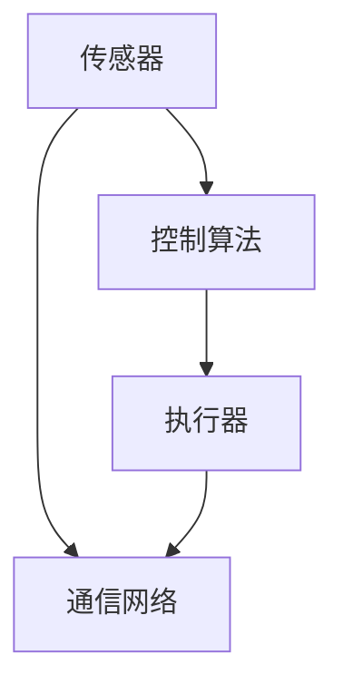
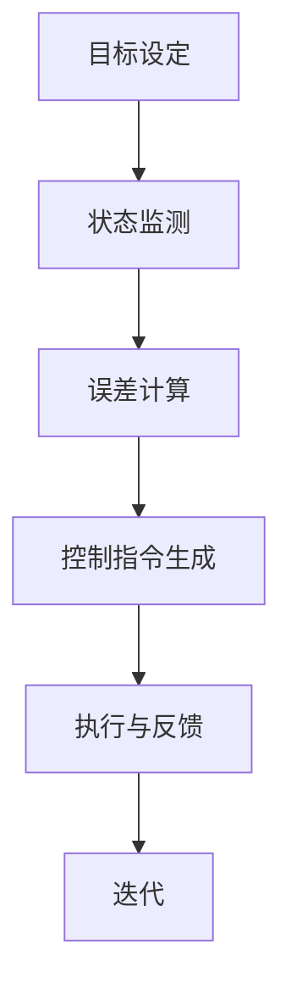

                 

### 物理实体自动化的未来探索

#### 关键词：（物理实体自动化、人工智能、机器人技术、物联网、自主系统）

#### 摘要：
随着人工智能、机器人技术、物联网等领域的快速发展，物理实体自动化正逐步渗透到各行各业，改变了生产方式、工作流程以及人类的生活方式。本文将探讨物理实体自动化的未来发展趋势、关键技术创新、实际应用场景以及面临的挑战和解决方案，以期为这一领域的研究和发展提供新的思路。

#### 1. 背景介绍（Background Introduction）

物理实体自动化，简称实体自动化，是指利用计算机技术和人工智能算法，对物理世界中的实体进行自动识别、定位、跟踪、操作和控制的过程。这一概念最早可以追溯到20世纪80年代的工业自动化领域，但随着计算能力的提升和算法的优化，实体自动化正逐渐从工业领域扩展到服务业、农业、医疗等多个领域。

##### 1.1 发展历程

实体自动化的历史可以追溯到以下几个方面：

1. **工业自动化**：20世纪80年代，随着计算机和微电子技术的发展，工业自动化逐渐普及。这一时期的主要成就是机器人和计算机视觉的应用。
2. **物联网**：21世纪初，物联网（IoT）的兴起使得各种物理实体能够通过网络进行连接和通信，为实体自动化提供了基础。
3. **人工智能**：近年来，人工智能技术的突破，特别是深度学习和强化学习，为实体自动化带来了新的可能性。

##### 1.2 当前现状

目前，实体自动化已经在多个领域取得了显著的成果：

1. **制造业**：在制造业中，自动化生产线已经成为主流，机器人被广泛应用于焊接、组装、检测等环节。
2. **物流与配送**：无人机和无人车的应用正在改变物流和配送的方式，提高了效率和准确性。
3. **服务业**：智能客服、智能安防等应用，使服务业的工作更加高效和安全。
4. **医疗健康**：在医疗健康领域，实体自动化技术被用于医疗设备的操作、病人的监测等。

#### 2. 核心概念与联系（Core Concepts and Connections）

##### 2.1 物理实体自动化的核心概念

物理实体自动化的核心概念包括以下几个方面：

1. **传感器**：传感器是实体自动化的感知器官，用于获取物理世界的各种信息，如位置、速度、温度、湿度等。
2. **执行器**：执行器是实体自动化的执行器官，用于根据传感器获取的信息执行特定的动作，如移动、转动、伸缩等。
3. **控制算法**：控制算法是实体自动化的决策器官，用于根据传感器反馈的信息，对执行器进行控制，以实现特定的任务。
4. **通信网络**：通信网络是实体自动化系统的神经中枢，用于传感器、执行器和控制算法之间的信息传递。

##### 2.2 物理实体自动化的联系

物理实体自动化涉及多个领域的技术和概念，包括：

1. **人工智能**：人工智能技术，特别是机器学习和深度学习，为实体自动化提供了智能化的控制算法。
2. **机器人技术**：机器人技术是实体自动化的具体实现形式，包括机器人的设计、制造和应用。
3. **物联网**：物联网技术为实体自动化提供了网络连接，使得物理实体能够实现远程监控和控制。
4. **计算机视觉**：计算机视觉技术使得实体自动化系统能够识别和理解物理世界中的图像和视频信息。

##### 2.3 Mermaid 流程图



在这个流程图中，传感器获取物理世界的各种信息，通过通信网络传递给控制算法，控制算法根据这些信息生成控制指令，通过通信网络传递给执行器，执行器根据指令执行具体的动作。

#### 3. 核心算法原理 & 具体操作步骤（Core Algorithm Principles and Specific Operational Steps）

##### 3.1 控制算法的基本原理

控制算法是物理实体自动化的核心，它决定了实体自动化的性能和效率。控制算法的基本原理可以概括为：

1. **目标设定**：根据任务需求，设定实体自动化的目标，如定位到某个位置、完成某个动作等。
2. **状态监测**：通过传感器实时监测实体自动化的状态，如位置、速度、温度等。
3. **误差计算**：根据设定的目标和实际的状态，计算目标与实际状态之间的误差。
4. **控制指令生成**：根据误差计算的结果，生成相应的控制指令，以调整实体的状态。
5. **执行与反馈**：执行控制指令，并根据反馈的信息进行下一轮的误差计算和控制指令生成。

##### 3.2 具体操作步骤

以机器人自主导航为例，具体操作步骤如下：

1. **目标设定**：设定机器人需要到达的终点位置。
2. **状态监测**：机器人通过传感器获取当前的位置、速度等信息。
3. **误差计算**：计算机器人当前位置与目标位置之间的误差。
4. **控制指令生成**：根据误差计算的结果，生成转向、加速或减速等控制指令。
5. **执行与反馈**：机器人根据控制指令调整自己的状态，并通过传感器反馈当前的状态信息。
6. **迭代**：重复执行步骤3到步骤5，直到达到目标位置。

##### 3.3 Mermaid 流程图



#### 4. 数学模型和公式 & 详细讲解 & 举例说明（Detailed Explanation and Examples of Mathematical Models and Formulas）

##### 4.1 控制系统的数学模型

物理实体自动化中的控制系统可以看作是一个动态系统，其数学模型通常由状态方程和输出方程组成。以机器人自主导航为例，状态方程可以表示为：

$$
\begin{align*}
\dot{x} &= v\cos(\theta) \\
\dot{y} &= v\sin(\theta)
\end{align*}
$$

其中，\(x\) 和 \(y\) 分别表示机器人在二维平面上的位置，\(v\) 表示机器人的速度，\(\theta\) 表示机器人的朝向。

输出方程可以表示为：

$$
z = x
$$

其中，\(z\) 表示机器人的位置输出。

##### 4.2 控制策略的数学模型

常见的控制策略包括PID控制、模糊控制和深度学习控制等。以PID控制为例，其控制策略可以表示为：

$$
u = K_p e + K_i \int e dt + K_d \dot{e}
$$

其中，\(u\) 表示控制输出，\(e\) 表示误差，\(K_p\)、\(K_i\) 和 \(K_d\) 分别为比例、积分和微分系数。

##### 4.3 举例说明

假设机器人需要从起点 \((0, 0)\) 移动到终点 \((5, 0)\)，初始速度为 \(v_0 = 1\)，机器人的朝向为 \(\theta_0 = 0\)。使用PID控制策略，设定 \(K_p = 1\)、\(K_i = 0.1\)、\(K_d = 0.05\)，计算机器人从起点移动到终点的控制输出。

首先，计算初始误差：

$$
e_0 = \sqrt{(x_f - x_0)^2 + (y_f - y_0)^2} = 5
$$

然后，计算第一个控制输出：

$$
u_0 = K_p e_0 + K_i \int e_0 dt + K_d \dot{e_0} = 1 \times 5 + 0.1 \times \int 5 dt + 0.05 \times 0 = 5.5
$$

由于 \(u_0 > v_0\)，机器人将在第一个时间步内加速到 \(v_1 = v_0 + u_0 = 1.5\)。接下来，机器人将在每个时间步内根据新的速度和朝向计算新的误差和控制输出，直到达到终点。

#### 5. 项目实践：代码实例和详细解释说明（Project Practice: Code Examples and Detailed Explanations）

##### 5.1 开发环境搭建

为了实践物理实体自动化，我们需要搭建一个基本的开发环境。这里以Python为例，需要安装以下库：

- NumPy：用于数学计算
- Matplotlib：用于数据可视化
- PID Controller：用于PID控制算法的实现

安装命令如下：

```bash
pip install numpy matplotlib pidcontroller
```

##### 5.2 源代码详细实现

以下是一个简单的Python代码示例，用于实现机器人的自主导航。

```python
import numpy as np
import matplotlib.pyplot as plt
from pid_controller import PIDController

# 初始化参数
x0, y0 = 0, 0
xf, yf = 5, 0
v0 = 1
theta0 = 0

# 初始化PID控制器
pid = PIDController(Kp=1, Ki=0.1, Kd=0.05)

# 迭代计算
x, y, theta, v = x0, y0, theta0, v0
time_step = 0.1
time_total = 10
time_steps = int(time_total / time_step)
x_list, y_list = [], []

for _ in range(time_steps):
    e = np.sqrt((xf - x)**2 + (yf - y)**2)
    u = pid.update(e)
    v = min(v + u*time_step, 5)  # 最大速度限制为5
    theta = np.arctan2(yf - y, xf - x)
    x += v*time_step*np.cos(theta)*time_step
    y += v*time_step*np.sin(theta)*time_step
    x_list.append(x)
    y_list.append(y)

# 绘制结果
plt.plot(x_list, y_list, label='Robot Path')
plt.xlabel('X')
plt.ylabel('Y')
plt.legend()
plt.show()
```

##### 5.3 代码解读与分析

1. **初始化参数**：设定起点、终点、初始速度和朝向。
2. **初始化PID控制器**：设定PID控制器的系数。
3. **迭代计算**：在每个时间步内，计算误差、控制输出、新的速度和朝向，并更新位置。
4. **绘制结果**：使用Matplotlib绘制机器人的移动路径。

#### 6. 实际应用场景（Practical Application Scenarios）

物理实体自动化在实际应用中具有广泛的应用前景，以下是一些典型的应用场景：

1. **智能制造**：在制造业中，实体自动化技术可以提高生产效率、降低生产成本、提高产品质量。
2. **物流与配送**：无人机和无人车的应用，可以大幅提高物流和配送的效率，特别是在最后一公里配送中。
3. **医疗健康**：在医疗健康领域，实体自动化技术可以用于医疗设备的操作、病人的监测等，提高医疗服务的质量和效率。
4. **家庭服务**：智能家居机器人，如扫地机器人、清洁机器人等，已经进入了普通家庭，为人们的生活带来便利。

#### 7. 工具和资源推荐（Tools and Resources Recommendations）

##### 7.1 学习资源推荐

- **书籍**：
  - 《机器人学基础》（作者：Oussama Khatib）
  - 《智能控制基础》（作者：何福保）
  - 《深度学习》（作者：Ian Goodfellow、Yoshua Bengio、Aaron Courville）
- **论文**：
  - “Autonomous Navigation of Robots Using Deep Reinforcement Learning”（作者：Yuval Toren等）
  - “Deep Learning for Autonomous Driving”（作者：Chris Olah等）
- **博客**：
  - [知乎专栏 - 物理实体自动化](https://zhuanlan.zhihu.com/c_1266274194538595328)
  - [Medium - Robotics and Autonomous Systems](https://medium.com/topics/robotics-and-autonomous-systems)
- **网站**：
  - [OpenAI](https://openai.com/)
  - [Robotics Academy](https://www.roboticstutorials.com/)

##### 7.2 开发工具框架推荐

- **编程语言**：Python、C++、Java
- **深度学习框架**：TensorFlow、PyTorch、Keras
- **机器人开发工具**：Robot Operating System (ROS)、MATLAB Robotics System Toolbox
- **仿真软件**：Gazebo、Webots

##### 7.3 相关论文著作推荐

- **论文**：
  - “Autonomous Driving: From Perception to Decision”（作者：Sebastian Thrun）
  - “Deep Learning for Autonomous Navigation”（作者：Pieter Abbeel等）
- **著作**：
  - 《无人驾驶：从感知到决策》（作者：克里斯·奥拉赫）
  - 《深度学习在机器人学中的应用》（作者：Pieter Abbeel、Vu Dang、Stefan Schaal）

#### 8. 总结：未来发展趋势与挑战（Summary: Future Development Trends and Challenges）

物理实体自动化正处在快速发展阶段，未来发展趋势包括：

1. **技术突破**：随着人工智能、机器人技术、物联网等领域的不断进步，实体自动化技术将更加智能化、高效化。
2. **应用拓展**：实体自动化将不仅限于工业领域，还将深入到服务业、农业、医疗等多个领域。
3. **融合创新**：实体自动化将与5G、云计算、大数据等新技术深度融合，带来更多创新应用。

然而，实体自动化也面临一些挑战：

1. **技术难题**：如何在复杂、动态的物理环境中实现高精度、高效率的实体自动化，仍然是一个难题。
2. **安全性**：如何确保实体自动化系统的安全性，避免意外发生，是一个亟待解决的问题。
3. **伦理问题**：随着实体自动化技术的普及，如何处理与人类的关系，也是一个重要的伦理问题。

总之，物理实体自动化具有巨大的发展潜力，但也面临着诸多挑战。未来的研究和发展需要综合考虑技术、应用、伦理等多个方面，以实现实体自动化的可持续发展。

#### 9. 附录：常见问题与解答（Appendix: Frequently Asked Questions and Answers）

##### 9.1 物理实体自动化的定义是什么？

物理实体自动化是指利用计算机技术和人工智能算法，对物理世界中的实体进行自动识别、定位、跟踪、操作和控制的过程。

##### 9.2 物理实体自动化有哪些应用领域？

物理实体自动化广泛应用于制造业、物流与配送、医疗健康、家庭服务等多个领域。

##### 9.3 物理实体自动化的核心技术是什么？

物理实体自动化的核心技术包括传感器技术、执行器技术、控制算法和通信网络技术。

##### 9.4 物理实体自动化与工业自动化的关系是什么？

物理实体自动化是工业自动化的一种延伸和扩展，但比工业自动化更加智能化和自动化。

##### 9.5 物理实体自动化有哪些挑战？

物理实体自动化面临的挑战包括技术难题、安全性、伦理问题等。

#### 10. 扩展阅读 & 参考资料（Extended Reading & Reference Materials）

- **论文**：
  - “Autonomous Robots: From Basic Research to Applications”（作者：Uwe D. Reinecke等）
  - “Physical Human-Robot Interaction: Challenges and Opportunities”（作者：Pieter-Tjerk de Boer等）
- **书籍**：
  - 《机器人学：现代方法》（作者：Karen Liu、Mary C. Whitaker）
  - 《智能机器人技术》（作者：Franka P. P. Lohn）
- **网站**：
  - [IEEE Robotics and Automation Society](https://www.ieeerobotics.org/)
  - [IEEE Robotics and Automation Magazine](https://www.ieeerobotics.org/publications/magazines/ra-magazine/)
- **视频教程**：
  - [Coursera - Robotics: Perception and Control](https://www.coursera.org/learn/robotics-perception-control)
  - [Udacity - Intro to Robotics](https://www.udacity.com/course/intro-to-robotics--ud120)

### 作者署名：禅与计算机程序设计艺术 / Zen and the Art of Computer Programming

