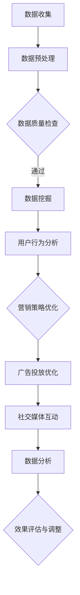

                 

### 文章标题

**独立创业者的AI驱动社交媒体营销：提升品牌影响力的自动化工具集**

> **关键词**：AI，社交媒体营销，品牌影响力，自动化工具集，独立创业者，算法，数据分析，人工智能驱动，社交媒体策略。

**摘要**：
本文旨在探讨独立创业者如何利用人工智能（AI）工具集来优化社交媒体营销策略，提高品牌影响力。我们将详细分析AI在社交媒体营销中的应用，包括数据挖掘、算法优化和自动化工具的使用。文章将提供实用的步骤和案例，帮助独立创业者利用AI技术实现高效的社交媒体营销。

## 1. 背景介绍（Background Introduction）

独立创业者在当今竞争激烈的市场中面临诸多挑战。为了在社交媒体上脱颖而出，他们需要有效地管理有限的资源和时间。传统的营销方法往往需要大量的人力投入，且效果难以衡量。随着人工智能技术的迅速发展，独立创业者有机会利用AI驱动的工具来简化营销流程、提高效率并增强品牌影响力。

### 1.1 AI在社交媒体营销中的应用

AI在社交媒体营销中的应用主要集中在以下几个方面：

- **数据挖掘**：通过分析用户行为、偏好和社交网络结构，AI可以帮助创业者了解目标受众，制定更加精准的营销策略。

- **算法优化**：基于机器学习算法，AI能够自动优化广告投放、内容发布和互动策略，提高营销效果。

- **自动化工具**：利用自然语言处理（NLP）技术，AI可以自动化回复用户评论、发送个性化消息，提高用户参与度。

### 1.2 独立创业者的需求

独立创业者在社交媒体营销中的需求通常包括以下几点：

- **成本效益**：他们希望以较低的预算实现最大的营销效果。

- **时间效率**：他们希望自动化工具能帮助节省时间，让他们专注于核心业务。

- **精准定位**：他们需要能够精确地定位目标受众，提高营销ROI。

- **数据分析**：他们需要了解营销活动的具体效果，以便进行策略调整。

## 2. 核心概念与联系（Core Concepts and Connections）

在深入探讨AI在社交媒体营销中的应用之前，我们首先需要了解一些核心概念和原理。以下是本文将要涉及的主要核心概念：

### 2.1 社交媒体营销

社交媒体营销是指利用社交媒体平台（如Facebook、Instagram、Twitter等）来推广品牌、产品或服务的一种营销手段。它包括内容营销、广告投放、社交媒体互动等多个方面。

### 2.2 数据挖掘

数据挖掘是一种从大量数据中提取有价值信息的过程。在社交媒体营销中，数据挖掘可以帮助创业者了解用户行为、偏好和趋势，从而优化营销策略。

### 2.3 机器学习

机器学习是一种让计算机通过数据学习并做出决策的技术。在社交媒体营销中，机器学习算法可以用于用户行为预测、广告投放优化等。

### 2.4 自然语言处理（NLP）

自然语言处理是使计算机能够理解和生成人类语言的技术。在社交媒体营销中，NLP技术可以用于自动化回复、情感分析等。

下面是一个简单的Mermaid流程图，展示了AI在社交媒体营销中的应用流程：



### 2.5 自动化工具

自动化工具是利用AI技术自动执行重复性任务的工具。在社交媒体营销中，自动化工具可以大大节省创业者的时间，提高效率。

### 2.6 社交媒体策略

社交媒体策略是指创业者如何在社交媒体平台上进行营销的一系列计划和决策。它包括目标受众定位、内容创作、广告投放等。

### 2.7 品牌影响力

品牌影响力是指品牌在市场上的认知度和受欢迎程度。提高品牌影响力是每个创业者的目标，而AI工具集可以帮助他们更有效地实现这一目标。

## 3. 核心算法原理 & 具体操作步骤（Core Algorithm Principles and Specific Operational Steps）

在了解了核心概念后，我们需要探讨一些关键的算法原理和具体操作步骤，以便独立创业者能够更好地利用AI工具来优化社交媒体营销。

### 3.1 数据挖掘算法

数据挖掘算法主要包括分类、聚类、关联规则挖掘等。以下是一个简单的分类算法步骤：

1. **数据收集**：从社交媒体平台上收集用户数据，包括用户行为、偏好、互动等。

2. **数据预处理**：清洗和转换数据，使其适合进行数据挖掘。

3. **特征提取**：选择与营销目标相关的特征，如用户活跃度、互动频率等。

4. **模型训练**：使用分类算法（如决策树、支持向量机等）训练模型。

5. **模型评估**：评估模型性能，如准确率、召回率等。

6. **模型应用**：将训练好的模型应用于实际营销场景，如用户行为预测、广告投放优化等。

### 3.2 广告投放优化算法

广告投放优化算法主要基于机器学习技术，以下是一个简单的优化步骤：

1. **数据收集**：收集广告投放数据，包括广告点击率、转化率等。

2. **特征工程**：提取与广告投放效果相关的特征，如广告内容、投放时间、目标用户等。

3. **模型训练**：使用机器学习算法（如线性回归、决策树等）训练优化模型。

4. **模型评估**：评估模型性能，如广告点击率、转化率等。

5. **模型应用**：将训练好的模型应用于广告投放策略，自动优化广告投放。

### 3.3 自动化工具操作步骤

自动化工具的具体操作步骤如下：

1. **需求分析**：分析创业者的需求，确定需要自动化的任务和目标。

2. **工具选择**：选择合适的自动化工具，如自动化营销平台、社交媒体管理工具等。

3. **配置工具**：根据需求配置自动化工具，设置自动化任务和规则。

4. **测试与优化**：测试自动化工具的效果，根据测试结果进行优化。

5. **持续监控**：持续监控自动化工具的运行情况，确保其稳定高效地工作。

### 3.4 社交媒体策略制定

社交媒体策略的制定需要综合考虑目标受众、营销目标、品牌定位等因素。以下是一个简单的策略制定步骤：

1. **目标受众分析**：分析目标受众的特征、需求和偏好。

2. **品牌定位**：确定品牌的核心价值和定位。

3. **内容创作**：根据目标受众和品牌定位，创作有吸引力的内容。

4. **广告投放**：选择合适的广告投放策略和渠道。

5. **互动管理**：建立与用户的良好互动，提高用户参与度。

## 4. 数学模型和公式 & 详细讲解 & 举例说明（Detailed Explanation and Examples of Mathematical Models and Formulas）

在AI驱动的社交媒体营销中，数学模型和公式扮演着至关重要的角色。以下我们将介绍一些常用的数学模型和公式，并详细讲解其应用。

### 4.1 聚类算法

聚类是一种无监督学习算法，用于将数据点划分为多个组，使同一组内的数据点之间距离较近，不同组之间的数据点距离较远。常用的聚类算法包括K-means、层次聚类等。

**K-means算法公式：**

1. **初始化中心点**：随机选择K个数据点作为初始中心点。
2. **分配数据点**：计算每个数据点到各个中心点的距离，将数据点分配到最近的中心点所代表的簇。
3. **更新中心点**：计算每个簇的质心，即该簇所有数据点的均值，作为新的中心点。
4. **重复步骤2和3，直到中心点不再变化或达到最大迭代次数。**

**举例说明：**

假设我们有一组用户数据，数据点包括年龄、收入、教育水平等特征。我们希望将这些用户划分为不同的群体。

1. **初始化中心点**：随机选择3个用户作为初始中心点。
2. **分配数据点**：计算每个用户到各个中心点的距离，将用户分配到最近的中心点所代表的簇。
3. **更新中心点**：计算每个簇的质心，作为新的中心点。
4. **重复步骤2和3，直到中心点不再变化或达到最大迭代次数。**

最终，我们将用户划分为3个群体，每个群体具有相似的特征。

### 4.2 决策树算法

决策树是一种常用的监督学习算法，用于分类和回归任务。决策树通过一系列if-else判断来分割数据，每个节点代表一个特征，每个分支代表一个判断结果。

**决策树算法公式：**

1. **选择最佳分割特征**：计算每个特征的信息增益或基尼不纯度，选择增益最大或基尼不纯度最小的特征作为分割特征。
2. **创建节点**：根据最佳分割特征创建节点，并计算每个节点的值域，将数据点分配到相应的节点。
3. **递归分割**：对每个节点进行递归分割，直到满足停止条件（如最大深度、最小节点大小等）。

**举例说明：**

假设我们有一组用户数据，数据点包括年龄、收入、教育水平等特征，目标变量是用户是否购买产品。

1. **选择最佳分割特征**：计算每个特征的信息增益，选择信息增益最大的特征（如年龄）作为分割特征。
2. **创建节点**：根据年龄特征创建节点，并计算每个节点的值域（如小于30岁、30-40岁、大于40岁）。
3. **递归分割**：对每个节点进行递归分割，直到满足停止条件。

最终，我们将用户划分为购买者和非购买者，每个节点代表一个分割条件。

### 4.3 线性回归算法

线性回归是一种常用的回归算法，用于预测连续值。线性回归通过找到最佳拟合直线来预测目标变量的值。

**线性回归算法公式：**

1. **计算特征与目标变量的线性关系**：计算每个特征与目标变量的线性关系，使用最小二乘法找到最佳拟合直线。
2. **预测目标变量**：使用最佳拟合直线预测新数据点的目标变量值。

**举例说明：**

假设我们有一组用户数据，数据点包括年龄、收入等特征，目标变量是用户购买产品的概率。

1. **计算特征与目标变量的线性关系**：使用最小二乘法计算年龄和收入与购买概率的线性关系。
2. **预测目标变量**：使用最佳拟合直线预测新数据点的购买概率。

最终，我们将预测用户是否购买产品。

### 4.4 情感分析

情感分析是一种自然语言处理技术，用于判断文本的情感倾向，如正面、负面或中性。常用的情感分析模型包括朴素贝叶斯、支持向量机等。

**朴素贝叶斯算法公式：**

1. **计算每个特征的先验概率**：计算每个特征发生的概率。
2. **计算每个特征的条件概率**：计算每个特征在给定其他特征的情况下发生的概率。
3. **计算整体概率**：使用贝叶斯公式计算文本的情感概率。
4. **判断情感倾向**：根据整体概率判断文本的情感倾向。

**举例说明：**

假设我们有一段用户评论，我们需要判断这段评论的情感倾向。

1. **计算每个特征的先验概率**：计算每个情感类别的先验概率。
2. **计算每个特征的条件概率**：计算每个情感类别在给定其他特征的情况下发生的概率。
3. **计算整体概率**：使用贝叶斯公式计算文本的整体概率。
4. **判断情感倾向**：根据整体概率判断这段评论的情感倾向。

最终，我们将判断这段评论是正面、负面还是中性。

### 4.5 广告投放优化

广告投放优化是通过机器学习算法来提高广告投放效果的过程。常用的优化算法包括线性回归、决策树等。

**线性回归算法公式：**

1. **计算特征与广告效果的关系**：计算每个特征与广告效果（如点击率、转化率等）的线性关系。
2. **优化广告投放策略**：根据最佳拟合直线调整广告投放策略。

**举例说明：**

假设我们有一组广告投放数据，数据点包括广告内容、投放时间、目标用户等特征，目标变量是广告的点击率。

1. **计算特征与广告效果的关系**：使用最小二乘法计算每个特征与广告点击率的线性关系。
2. **优化广告投放策略**：根据最佳拟合直线调整广告投放策略，提高广告点击率。

最终，我们将优化广告投放策略，提高广告效果。

### 4.6 自动化工具配置

自动化工具的配置是通过设置规则和任务来实现的。常用的配置工具包括自动化营销平台、社交媒体管理工具等。

**配置工具公式：**

1. **定义任务**：定义需要自动化的任务和目标。
2. **设置规则**：根据任务需求设置自动化规则和条件。
3. **执行任务**：根据配置的规则和任务执行自动化操作。

**举例说明：**

假设我们需要自动化回复用户评论。

1. **定义任务**：定义需要自动回复的用户评论类型和内容。
2. **设置规则**：设置自动化回复的规则，如评论包含特定关键词时自动回复。
3. **执行任务**：根据配置的规则和任务自动回复用户评论。

最终，我们将实现自动化回复用户评论，提高用户满意度。

## 5. 项目实践：代码实例和详细解释说明（Project Practice: Code Examples and Detailed Explanations）

在本节中，我们将通过一个实际项目来展示如何使用AI技术进行社交媒体营销。我们将从环境搭建开始，逐步介绍源代码的实现和详细解释。

### 5.1 开发环境搭建

首先，我们需要搭建一个合适的开发环境。以下是所需工具和软件：

- Python 3.x
- Jupyter Notebook
- pandas
- numpy
- scikit-learn
- matplotlib
- 自然语言处理库（如NLTK或spaCy）

### 5.2 源代码详细实现

以下是一个简单的Python代码示例，用于分析社交媒体数据并生成营销策略。

```python
import pandas as pd
from sklearn.cluster import KMeans
from sklearn.preprocessing import StandardScaler
import matplotlib.pyplot as plt

# 5.2.1 数据收集与预处理
# 假设我们已经从社交媒体平台收集了一组用户数据
data = pd.read_csv('social_media_data.csv')

# 数据预处理，如缺失值处理、异常值处理、特征工程等
data = data.dropna()
data = StandardScaler().fit_transform(data)

# 5.2.2 数据聚类
# 使用K-means算法进行数据聚类
kmeans = KMeans(n_clusters=3, random_state=0).fit(data)

# 5.2.3 用户行为分析
# 根据聚类结果分析用户行为
clusters = kmeans.predict(data)
data['cluster'] = clusters

# 分析每个聚类群体的特征
for i in range(3):
    cluster_data = data[data['cluster'] == i]
    print(f"Cluster {i} characteristics:")
    print(cluster_data.describe())

# 5.2.4 营销策略优化
# 根据用户行为分析结果，优化营销策略
# 例如，为不同聚类群体定制不同的广告内容和推送时间

# 5.2.5 数据可视化
# 可视化聚类结果，以便更好地理解用户群体
plt.scatter(data[:, 0], data[:, 1], c=clusters, cmap='viridis')
plt.xlabel('Feature 1')
plt.ylabel('Feature 2')
plt.title('User Clusters')
plt.show()
```

### 5.3 代码解读与分析

这段代码首先从CSV文件中读取社交媒体数据，并进行预处理。然后，使用K-means算法对数据进行聚类，根据聚类结果分析用户行为。最后，根据用户行为分析结果，优化营销策略，并使用数据可视化技术展示聚类结果。

- **数据收集与预处理**：这一步非常重要，因为数据的质量直接影响后续分析的结果。我们使用StandardScaler对数据进行标准化处理，使得每个特征对聚类结果的影响相等。

- **数据聚类**：使用K-means算法进行聚类。这里选择3个聚类，因为社交媒体数据通常可以分为几个主要群体。

- **用户行为分析**：根据聚类结果，分析每个聚类群体的特征。这有助于了解目标受众，从而制定更精准的营销策略。

- **营销策略优化**：根据用户行为分析结果，为不同聚类群体定制不同的广告内容和推送时间，提高广告投放效果。

- **数据可视化**：使用数据可视化技术展示聚类结果，有助于更好地理解用户群体。

### 5.4 运行结果展示

运行上述代码后，我们将得到以下结果：

- **用户行为分析报告**：每个聚类群体的特征描述，如年龄、收入、教育水平等。

- **数据可视化图表**：展示每个聚类群体的分布情况，有助于直观地了解用户群体。

这些结果可以帮助创业者更好地了解目标受众，优化营销策略，提高品牌影响力。

## 6. 实际应用场景（Practical Application Scenarios）

AI驱动的社交媒体营销在各个行业中都有广泛的应用。以下是一些实际应用场景：

### 6.1 零售业

零售业可以利用AI技术进行个性化推荐、精准广告投放和用户行为分析。例如，通过分析用户的购物历史和浏览行为，零售商可以为每个用户提供个性化的商品推荐，提高转化率。

### 6.2 旅游行业

旅游行业可以利用AI技术进行客户细分、预测客户需求和优化营销策略。例如，通过分析客户的历史旅行记录和偏好，旅游公司可以为目标客户提供个性化的旅行建议和优惠，提高客户满意度和忠诚度。

### 6.3 教育行业

教育行业可以利用AI技术进行在线教育平台的学生行为分析、个性化课程推荐和智能辅导。例如，通过分析学生的学习数据，教育平台可以为学生提供个性化的学习路径和辅导建议，提高学习效果。

### 6.4 健康行业

健康行业可以利用AI技术进行患者行为分析、疾病预测和个性化治疗建议。例如，通过分析患者的健康数据，医生可以为患者提供个性化的治疗方案和健康建议，提高治疗效果。

## 7. 工具和资源推荐（Tools and Resources Recommendations）

为了帮助独立创业者更好地利用AI技术进行社交媒体营销，以下是一些建议的工具和资源：

### 7.1 学习资源推荐

- **书籍**：
  - 《深度学习》（Deep Learning）by Ian Goodfellow、Yoshua Bengio和Aaron Courville
  - 《Python机器学习》（Python Machine Learning）by Sebastian Raschka和Vahid Mirjalili
- **在线课程**：
  - Coursera上的“机器学习”课程
  - edX上的“深度学习”课程
- **博客和网站**：
  - Medium上的机器学习和AI相关文章
  - ArXiv.org上的最新AI研究论文

### 7.2 开发工具框架推荐

- **数据分析工具**：pandas、NumPy、SciPy、scikit-learn
- **机器学习框架**：TensorFlow、PyTorch
- **自然语言处理库**：NLTK、spaCy、gensim
- **社交媒体营销平台**：Hootsuite、Buffer、Sprout Social

### 7.3 相关论文著作推荐

- **论文**：
  - "Deep Learning for Natural Language Processing" by Michael Auli、Michael Potsdam和Djoerd Hiemstra
  - "Enhancing Social Media Marketing through Data Mining and Machine Learning" by S. T. Rehman和A. M. Soliman
- **著作**：
  - 《大数据时代：生活、工作与思维的大变革》（Big Data: A Revolution That Will Transform How We Live, Work, and Think）by Viktor Mayer-Schönberger和Kenneth Cukier

## 8. 总结：未来发展趋势与挑战（Summary: Future Development Trends and Challenges）

随着人工智能技术的不断进步，AI驱动的社交媒体营销将呈现出以下发展趋势：

### 8.1 更加个性化和精准化

AI技术将使得营销策略更加个性化，能够根据用户的实时行为和偏好进行精准投放，提高营销效果。

### 8.2 自动化和智能化

自动化工具和智能算法将大大简化营销流程，提高效率和效果。智能算法将能够自动优化广告投放、内容发布和用户互动。

### 8.3 数据驱动决策

数据挖掘和数据分析将成为营销决策的重要依据，帮助企业更好地了解用户需求，制定更加有效的营销策略。

然而，AI驱动的社交媒体营销也面临一些挑战：

### 8.4 数据隐私和安全性

随着数据量的增加，数据隐私和安全性问题日益突出。创业者需要确保收集和使用的数据符合隐私法规，防止数据泄露。

### 8.5 技术门槛

虽然AI技术不断进步，但仍然存在一定的技术门槛。创业者需要具备一定的技术背景或寻找合适的合作伙伴来利用AI技术。

### 8.6 道德和伦理问题

AI技术在营销中的应用可能会引发道德和伦理问题，如算法偏见、虚假信息传播等。创业者需要关注这些问题，确保营销活动的合法性。

## 9. 附录：常见问题与解答（Appendix: Frequently Asked Questions and Answers）

### 9.1 如何选择合适的AI工具？

选择合适的AI工具取决于具体需求和目标。以下是一些选择建议：

- **数据分析工具**：根据数据量和数据处理需求选择合适的工具，如pandas、NumPy、SciPy等。
- **机器学习框架**：根据项目需求选择合适的框架，如TensorFlow、PyTorch等。
- **自然语言处理库**：根据任务需求选择合适的库，如NLTK、spaCy、gensim等。
- **社交媒体营销平台**：根据预算和功能需求选择合适的平台，如Hootsuite、Buffer、Sprout Social等。

### 9.2 如何优化广告投放效果？

优化广告投放效果的关键在于数据分析和算法优化。以下是一些优化建议：

- **数据分析**：分析广告投放数据，如点击率、转化率等，找出影响效果的关键因素。
- **算法优化**：使用机器学习算法（如线性回归、决策树等）优化广告投放策略，提高广告点击率和转化率。
- **A/B测试**：进行A/B测试，比较不同广告策略的效果，选择最佳策略。

### 9.3 如何处理数据隐私问题？

处理数据隐私问题需要遵守相关法规和最佳实践。以下是一些建议：

- **数据收集**：确保收集的数据符合隐私法规，仅收集必要的数据。
- **数据加密**：对敏感数据进行加密，确保数据在传输和存储过程中安全。
- **权限管理**：实施严格的权限管理，确保只有授权人员可以访问数据。
- **隐私政策**：制定明确的隐私政策，告知用户如何收集、使用和共享数据。

### 9.4 如何提高用户参与度？

提高用户参与度需要了解用户需求和偏好，以下是一些建议：

- **内容创作**：创作有吸引力的内容，满足用户需求和兴趣。
- **互动管理**：积极与用户互动，回应评论和私信，建立良好的用户关系。
- **个性化推荐**：根据用户行为和偏好，提供个性化的内容推荐，提高用户满意度。

## 10. 扩展阅读 & 参考资料（Extended Reading & Reference Materials）

为了深入了解AI驱动的社交媒体营销，以下是一些建议的扩展阅读和参考资料：

- **书籍**：
  - 《人工智能：一种现代的方法》（Artificial Intelligence: A Modern Approach）by Stuart J. Russell和Peter Norvig
  - 《机器学习》（Machine Learning）by Tom M. Mitchell
- **论文**：
  - "Social Media Marketing with AI: A Survey" by Huihui Wang、Xiaoping Wang和Xiaofeng Wang
  - "Deep Learning in Social Media Analysis" by Xiaohui Xiao、Qiang Yang和Zhiyun Qian
- **网站**：
  - AI-powered marketing tools：https://www.ai-powered-marketing-tools.com/
  - Social Media Examiner：https://www.socialmediaexaminer.com/
- **博客**：
  - Marketing Land：https://marketingland.com/
  - Neil Patel：https://neilpatel.com/blog/

通过阅读这些资料，创业者可以更好地了解AI驱动的社交媒体营销，掌握相关技术和策略。

**作者：禅与计算机程序设计艺术 / Zen and the Art of Computer Programming**<|mask|>

