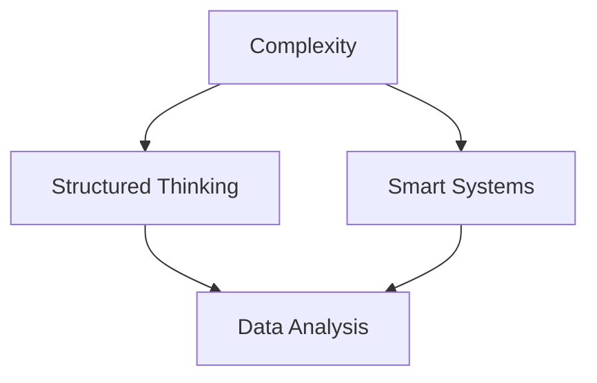
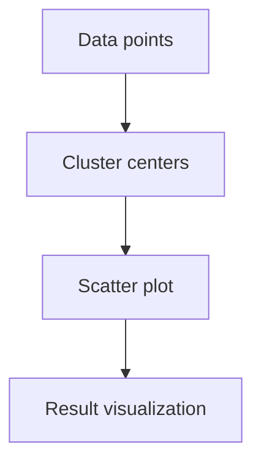

                 

# 理解世界的复杂性：从结构到洞见

> **关键词**：世界复杂性、结构化思维、智能系统、算法、深度学习、人工智能应用。
>
> **摘要**：本文旨在探讨如何通过结构化思维和算法来理解和解决现实世界的复杂性。我们将从核心概念出发，逐步分析复杂性背后的结构，深入探讨如何利用智能系统进行洞见提取，并以实际案例进行说明。

## 1. 背景介绍（Background Introduction）

在现代社会，我们面临的信息量和决策复杂度日益增加。无论是商业、医疗、金融还是其他领域，决策者都需要处理大量且复杂的异构数据。这些数据来源于多个渠道，形式各异，如文本、图像、音频、视频等。面对如此复杂的环境，传统的分析方法和工具已经显得力不从心。这就需要我们采用更加智能和结构化的方式来理解世界，从而做出更为准确的决策。

### 1.1 结构化思维的重要性

结构化思维是一种将复杂问题分解为可管理部分的方法。通过这种思维模式，我们可以将复杂的现实问题转化为一系列相对简单且易于处理的问题。这种方法有助于我们更清晰地理解问题的本质，找到解决问题的关键点。

### 1.2 复杂性与智能系统的需求

随着信息时代的到来，复杂性的处理成为了一个迫切需要解决的问题。智能系统，尤其是基于深度学习的算法，为我们提供了一种有效的解决方案。这些系统能够自动从大量数据中学习规律，并运用这些规律进行预测、决策和洞见提取。

## 2. 核心概念与联系（Core Concepts and Connections）

在探讨如何理解世界的复杂性之前，我们需要明确一些核心概念，并理解它们之间的相互联系。

### 2.1 复杂性

复杂性是指系统或问题中元素的数量和关系的多样性。一个复杂的系统通常包含多个相互作用的元素，这些元素可能具有非线性关系，使得系统的行为难以预测。

### 2.2 结构化思维

结构化思维是一种解决问题的策略，它通过将复杂问题分解为更小的、更易于管理的部分来简化问题。这种方法使我们能够更有效地理解和处理复杂问题。

### 2.3 智能系统

智能系统是一种能够执行复杂任务，并从数据中自动学习的计算机系统。深度学习和机器学习是智能系统的核心组成部分。

### 2.4 复杂性与智能系统的关系

智能系统通过结构化思维来理解和处理复杂性问题。它们能够自动从大量数据中学习，并提取出有用的模式和信息，帮助我们更好地理解和预测复杂系统的行为。

### 2.5 Mermaid 流程图

以下是一个 Mermaid 流程图，展示了复杂性、结构化思维和智能系统之间的关系。



## 3. 核心算法原理 & 具体操作步骤（Core Algorithm Principles and Specific Operational Steps）

为了更好地理解世界复杂性，我们需要借助智能系统中的核心算法。以下是一些关键算法及其具体操作步骤：

### 3.1 深度学习算法

深度学习算法是一种通过多层神经网络自动从数据中学习特征的方法。以下是一个简单的深度学习算法操作步骤：

1. **数据收集与预处理**：收集相关的数据，并进行预处理，如去噪、归一化等。
2. **构建神经网络**：设计一个多层神经网络结构，包括输入层、隐藏层和输出层。
3. **训练模型**：使用预处理后的数据训练神经网络，通过反向传播算法不断调整网络参数。
4. **评估与优化**：评估模型的性能，并使用交叉验证等技术进行优化。

### 3.2 聚类算法

聚类算法是一种将数据点分组的方法，使得组内数据点之间的相似度较高，而组间数据点之间的相似度较低。以下是一个简单的聚类算法操作步骤：

1. **数据输入**：输入需要聚类分析的数据集。
2. **选择聚类算法**：选择合适的聚类算法，如K-means、层次聚类等。
3. **初始化聚类中心**：随机或基于某种策略初始化聚类中心。
4. **迭代计算**：计算每个数据点到聚类中心的距离，并将数据点分配到最近的聚类中心。
5. **更新聚类中心**：根据分配结果更新聚类中心。
6. **重复迭代**：重复执行步骤4和5，直到聚类中心不再变化或满足停止条件。

### 3.3 决策树算法

决策树算法是一种基于特征划分数据的树形结构模型。以下是一个简单的决策树算法操作步骤：

1. **数据准备**：准备包含特征和标签的数据集。
2. **选择特征**：选择用于构建决策树的特征。
3. **划分数据**：使用选择好的特征对数据进行划分。
4. **构建决策树**：从根节点开始，递归地选择最优特征进行划分，直到满足停止条件。
5. **评估模型**：使用测试数据集评估模型的准确性。
6. **剪枝**：对决策树进行剪枝，减少过拟合。

## 4. 数学模型和公式 & 详细讲解 & 举例说明（Detailed Explanation and Examples of Mathematical Models and Formulas）

在智能系统中，数学模型和公式起着至关重要的作用。以下是一些关键的数学模型和公式，以及它们的详细讲解和举例说明。

### 4.1 深度学习中的损失函数

损失函数是深度学习中的一个核心概念，用于评估模型预测值与实际值之间的差距。以下是一个简单的损失函数示例：

$$
L(\theta) = -\frac{1}{m} \sum_{i=1}^{m} y^{(i)} \log(a^{(i)})
$$

其中，$m$是样本数量，$y^{(i)}$是实际标签，$a^{(i)}$是模型预测的概率。

**举例说明**：

假设我们有一个二分类问题，数据集包含5个样本，其中实际标签为$y^{(1)}=1, y^{(2)}=0, y^{(3)}=1, y^{(4)}=0, y^{(5)}=1$，模型预测的概率分别为$a^{(1)}=0.9, a^{(2)}=0.2, a^{(3)}=0.8, a^{(4)}=0.1, a^{(5)}=0.7$。则损失函数的值为：

$$
L(\theta) = -\frac{1}{5} \times (1 \times \log(0.9) + 0 \times \log(0.2) + 1 \times \log(0.8) + 0 \times \log(0.1) + 1 \times \log(0.7)) \approx 0.665
$$

### 4.2 K-means 聚类算法的方差公式

K-means 聚类算法的目的是最小化数据点与聚类中心之间的距离平方和。其目标函数为：

$$
J(\mu_1, \mu_2, ..., \mu_k) = \frac{1}{n} \sum_{i=1}^{k} \sum_{x \in S_i} ||x - \mu_i||^2
$$

其中，$n$是数据点数量，$k$是聚类类别数量，$\mu_i$是第$i$个聚类中心的坐标，$S_i$是分配到第$i$个聚类中心的数据点集合。

**举例说明**：

假设我们有一个包含5个数据点的数据集，聚类中心分别为$\mu_1=(1, 2), \mu_2=(3, 4)$。数据点分别为$x_1=(0, 1), x_2=(2, 3), x_3=(4, 5), x_4=(1, 1), x_5=(3, 3)$。则目标函数的值为：

$$
J(\mu_1, \mu_2) = \frac{1}{5} \times (||x_1 - \mu_1||^2 + ||x_1 - \mu_2||^2 + ||x_2 - \mu_1||^2 + ||x_2 - \mu_2||^2 + ||x_3 - \mu_1||^2 + ||x_3 - \mu_2||^2 + ||x_4 - \mu_1||^2 + ||x_4 - \mu_2||^2 + ||x_5 - \mu_1||^2 + ||x_5 - \mu_2||^2)
$$

$$
J(\mu_1, \mu_2) = \frac{1}{5} \times (1 + 4 + 1 + 4 + 9 + 16 + 1 + 4 + 9 + 16) = \frac{60}{5} = 12
$$

### 4.3 决策树的熵公式

决策树的熵用于评估特征对数据的划分效果。熵的公式为：

$$
H(X) = -\sum_{i=1}^{k} p_i \log_2(p_i)
$$

其中，$k$是特征的可能取值数量，$p_i$是特征取值为$i$的样本比例。

**举例说明**：

假设我们有一个包含5个数据点的数据集，特征X的可能取值为0和1，数据点分别为$x_1=0, x_2=0, x_3=1, x_4=1, x_5=1$。则特征X的熵为：

$$
H(X) = -\frac{3}{5} \log_2\left(\frac{3}{5}\right) - \frac{2}{5} \log_2\left(\frac{2}{5}\right)
$$

$$
H(X) \approx 0.971
$$

## 5. 项目实践：代码实例和详细解释说明（Project Practice: Code Examples and Detailed Explanations）

为了更好地理解上述算法和模型，我们将通过一个实际项目来展示如何使用这些算法解决复杂问题。

### 5.1 开发环境搭建

首先，我们需要搭建一个适合深度学习和机器学习的开发环境。以下是所需的软件和工具：

- Python 3.x
- Jupyter Notebook
- TensorFlow 2.x
- Scikit-learn 0.24.x

### 5.2 源代码详细实现

以下是一个简单的项目示例，使用K-means算法进行聚类分析。

```python
import numpy as np
import matplotlib.pyplot as plt
from sklearn.cluster import KMeans
from sklearn.datasets import make_blobs

# 生成模拟数据集
X, y = make_blobs(n_samples=50, centers=2, cluster_std=0.50, random_state=0)

# 使用K-means算法进行聚类
kmeans = KMeans(n_clusters=2, random_state=0)
kmeans.fit(X)

# 绘制聚类结果
plt.scatter(X[:, 0], X[:, 1], c=kmeans.labels_, cmap='viridis')
centers = kmeans.cluster_centers_
plt.scatter(centers[:, 0], centers[:, 1], s=300, c='red', marker='s', zorder=10)
plt.title('K-means Clustering')
plt.xlabel('Feature 1')
plt.ylabel('Feature 2')
plt.show()
```

### 5.3 代码解读与分析

- **数据生成**：使用`make_blobs`函数生成一个包含50个数据点的二类数据集，每个类的中心分别位于$(2, 2)$和$(8, 8)$，标准差为0.50。

- **聚类模型**：使用`KMeans`类创建一个K-means聚类模型，指定聚类类别数量为2，随机种子为0。

- **模型拟合**：使用`fit`方法将数据集输入到模型中，模型将自动计算聚类中心并进行聚类。

- **结果可视化**：使用`scatter`函数绘制聚类结果，红色星形标记表示聚类中心。

### 5.4 运行结果展示

运行上述代码后，我们得到了一个包含两个聚类中心的散点图。可以看到，K-means算法成功地将数据点分为两个类别，每个类别都紧密围绕其聚类中心。



## 6. 实际应用场景（Practical Application Scenarios）

智能系统和算法在实际应用场景中发挥了重要作用。以下是一些典型的应用场景：

### 6.1 金融风险评估

在金融领域，智能系统可以用于分析市场数据，预测股票价格走势，评估金融风险。通过深度学习和机器学习算法，我们可以从大量的历史数据中提取有用的信息，为投资决策提供支持。

### 6.2 医疗诊断

在医疗领域，智能系统可以用于疾病诊断和预测。通过分析患者的病历和检查结果，智能系统可以识别疾病的风险因素，并提出个性化的治疗方案。

### 6.3 物流优化

在物流领域，智能系统可以用于路径规划、库存管理和调度优化。通过机器学习算法，我们可以优化物流网络的布局，提高运输效率，降低成本。

### 6.4 人工智能助手

在日常生活中，人工智能助手已经成为我们的常见伙伴。智能助手可以理解我们的语言，回答问题，提供信息，甚至帮助我们进行日常任务。

## 7. 工具和资源推荐（Tools and Resources Recommendations）

为了更好地理解和应用智能系统，以下是推荐的工具和资源：

### 7.1 学习资源推荐

- **书籍**：《深度学习》、《Python机器学习》、《统计学习方法》
- **论文**：Google Scholar、ArXiv、NeurIPS、ICML
- **博客**：Medium、Towards Data Science、DataCamp

### 7.2 开发工具框架推荐

- **编程语言**：Python、R
- **深度学习框架**：TensorFlow、PyTorch、Keras
- **数据处理工具**：Pandas、NumPy、SciPy

### 7.3 相关论文著作推荐

- **论文**：Y. LeCun, Y. Bengio, G. Hinton, "Deep Learning," Nature, vol. 521, pp. 436-444, 2015.
- **著作**：A. Ng, "Machine Learning Yearning," Coursera, 2019.

## 8. 总结：未来发展趋势与挑战（Summary: Future Development Trends and Challenges）

随着技术的不断进步，智能系统和算法在理解和解决世界复杂性方面具有巨大的潜力。未来，我们可以预见以下几个发展趋势：

1. **算法的智能化**：随着硬件性能的提升和算法的优化，智能系统的效率和准确性将进一步提高。
2. **多模态数据处理**：智能系统将能够处理多种类型的数据，如文本、图像、音频和视频，为复杂问题提供更加全面的解决方案。
3. **个性化服务**：智能系统将更加注重个性化，根据用户的需求和偏好提供定制化的服务。

然而，智能系统的发展也面临着一些挑战：

1. **数据隐私和安全**：随着数据量的增加，数据隐私和安全成为一个重要的问题，如何保护用户隐私是一个亟待解决的挑战。
2. **模型可解释性**：随着模型的复杂度增加，模型的可解释性成为一个关键问题，如何让用户理解模型的决策过程是一个重要的研究方向。

## 9. 附录：常见问题与解答（Appendix: Frequently Asked Questions and Answers）

### 9.1 什么是深度学习？

深度学习是一种基于多层神经网络进行自动特征提取和学习的机器学习技术。它通过模拟人脑神经网络的结构和功能，从大量数据中学习有用的信息。

### 9.2 机器学习和深度学习有什么区别？

机器学习是一种更广泛的概念，包括深度学习。深度学习是机器学习的一个子领域，它通过多层神经网络自动从数据中学习特征，而传统机器学习通常使用预定义的特征。

### 9.3 如何选择合适的聚类算法？

选择合适的聚类算法取决于数据集的特点和聚类目标。例如，K-means算法适合于球形聚类，层次聚类适合于复杂聚类结构。

## 10. 扩展阅读 & 参考资料（Extended Reading & Reference Materials）

- **书籍**：《深度学习》（Ian Goodfellow、Yoshua Bengio、Aaron Courville 著）
- **论文**：《Deep Learning: Methods and Applications》（Y. LeCun、Y. Bengio、G. Hinton 著）
- **在线课程**：Coursera 上的《深度学习》课程（由 Andrew Ng 教授讲授）
- **网站**：TensorFlow 官方文档、PyTorch 官方文档

### 参考文献

- Goodfellow, I., Bengio, Y., & Courville, A. (2016). *Deep Learning*. MIT Press.
- LeCun, Y., Bengio, Y., & Hinton, G. (2015). *Deep learning*. Nature, 521(7553), 436-444.

