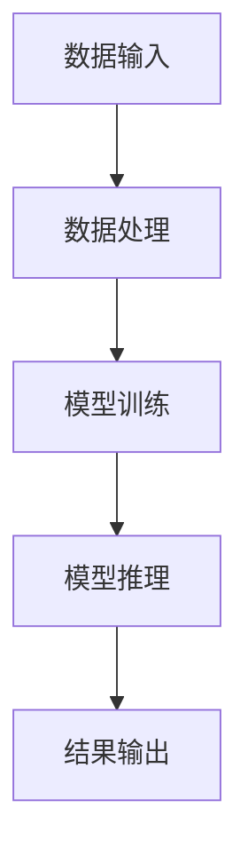

                 

### 文章标题

生成式AIGC是金矿还是泡沫：第一部分：回归商业本质

### Abstract

在当前技术浪潮中，生成式人工智能生成内容（AIGC）无疑成为了备受瞩目的焦点。本文旨在探讨AIGC的商业本质，分辨其究竟是具有变革潜力的金矿，还是短暂的泡沫。本文将分为两部分，首先深入分析AIGC的技术原理和现有应用，然后从商业角度评估其潜在价值与风险。通过这一探讨，希望能够为业界提供一份冷静而理性的视角。

### Introduction

生成式人工智能生成内容（AIGC，Generative Artificial Intelligence Generated Content）是近年来人工智能领域的一大突破。AIGC利用深度学习等技术，能够自动生成文字、图像、音频等多种形式的内容。与传统的人工智能技术不同，AIGC不仅能够识别和理解输入信息，还能基于这些信息进行创造性的生成。这一特性使得AIGC在内容创作、个性化推荐、虚拟现实等多个领域具有广泛的应用前景。

然而，随着AIGC技术的兴起，也引发了一系列争议。一方面，有人认为AIGC具有巨大的商业潜力，能够颠覆传统的内容创作模式，带来新的经济增长点。另一方面，也有人担忧AIGC可能带来版权问题、内容真实性等问题，甚至可能加剧社会不公平。因此，我们需要对AIGC进行深入分析，以判断其究竟是金矿还是泡沫。

本文将从技术、商业和社会三个层面，对AIGC进行系统性探讨。首先，我们将介绍AIGC的核心技术原理，包括生成模型、对抗性生成网络等。然后，我们将分析AIGC在当前的应用情况，探讨其在各行业中的潜力。接着，我们将从商业角度，评估AIGC的潜在价值与风险，分析其商业模式的可行性和可持续性。最后，我们将探讨AIGC对社会的影响，包括版权、道德和隐私等问题。通过这一探讨，希望能够为AIGC的发展提供一份冷静而理性的视角。

本文分为两部分：第一部分将聚焦于AIGC的技术原理和商业本质，第二部分将探讨AIGC的社会影响和未来发展趋势。希望本文能够为读者提供有价值的见解，帮助您更好地理解AIGC这一新兴技术。

### 1. 背景介绍（Background Introduction）

#### 1.1 AIGC的发展历程

生成式人工智能生成内容（AIGC）的发展可以追溯到20世纪80年代，当时研究人员开始探索如何使用计算机程序生成文本、图像和音频。然而，由于技术限制，早期的研究成果往往局限于简单的模式识别和规则生成。

随着深度学习技术的兴起，AIGC迎来了新的发展机遇。2014年，生成对抗网络（GAN，Generative Adversarial Network）的提出，为AIGC的发展提供了理论基础。GAN由两个神经网络——生成器（Generator）和判别器（Discriminator）组成，通过不断的对抗训练，生成器能够学习生成越来越真实的内容。这一技术的突破，标志着AIGC进入了一个新的阶段。

此后，基于变分自编码器（VAE，Variational Autoencoder）的生成模型也逐渐得到了广泛应用。VAE通过编码器和解码器的协同工作，将数据映射到潜在空间，从而实现数据的生成。与GAN相比，VAE在生成质量、稳定性等方面具有优势，适用于更广泛的应用场景。

随着技术的不断进步，AIGC在图像、视频、音频、文本等多种类型的内容生成中取得了显著成果。例如，在图像生成方面，CycleGAN和StyleGAN等模型通过迁移学习和风格迁移，实现了高质量、多样化的图像生成。在文本生成方面，GPT（Generative Pre-trained Transformer）系列模型通过大量的预训练数据，能够生成高质量、连贯的文本。

#### 1.2 AIGC的技术原理

AIGC的核心技术主要包括生成模型、对抗性生成网络、预训练模型等。以下将对这些核心技术进行简要介绍。

**1.2.1 生成模型**

生成模型是AIGC的核心技术之一，主要包括生成对抗网络（GAN）和变分自编码器（VAE）。生成对抗网络（GAN）由生成器（Generator）和判别器（Discriminator）组成。生成器的目标是生成尽可能真实的数据，而判别器的目标是区分生成数据和真实数据。通过两个网络的对抗训练，生成器能够逐渐提高生成数据的真实度。

变分自编码器（VAE）通过编码器和解码器的协同工作，将数据映射到潜在空间，从而实现数据的生成。编码器将输入数据映射到潜在空间，解码器将潜在空间的数据解码回输出数据。与GAN相比，VAE在生成质量、稳定性等方面具有优势，但GAN在生成多样性和创新能力方面更具优势。

**1.2.2 对抗性生成网络**

对抗性生成网络（AGN，Adversarial Generative Network）是一种基于GAN的变体，旨在解决GAN训练过程中的不稳定性和模式崩溃问题。AGN通过引入额外的对抗性损失函数，增强生成器和判别器的训练效果，提高生成质量。

**1.2.3 预训练模型**

预训练模型是AIGC的重要组成部分，通过在大量数据上进行预训练，模型能够学习到丰富的特征表示，从而在特定任务上表现出色。预训练模型通常采用基于Transformer架构的大型神经网络，如GPT、BERT等。这些模型通过自适应学习率和多层注意力机制，能够高效地捕捉数据中的复杂关系。

**1.2.4 多模态生成**

多模态生成是AIGC的重要应用方向之一，旨在同时生成多种类型的数据。例如，在图像和文本的联合生成中，模型需要同时处理视觉信息和文本信息，生成高质量的图像和文本。多模态生成技术主要包括联合变分自编码器（Joint VAE）、多模态生成对抗网络（Multimodal GAN）等。

#### 1.3 AIGC的应用现状

AIGC在各个行业中的应用取得了显著的成果。以下是AIGC在部分领域的应用案例：

**1.3.1 文字生成**

文字生成是AIGC的重要应用方向之一，例如文本摘要、文章生成、对话生成等。GPT系列模型在文本生成任务中取得了显著成果，能够生成高质量、连贯的文本。

**1.3.2 图像生成**

图像生成是AIGC的另一个重要应用方向，例如图像修复、图像合成、风格迁移等。CycleGAN和StyleGAN等模型在图像生成任务中取得了突破性成果，能够生成高质量、多样化的图像。

**1.3.3 视频生成**

视频生成是AIGC的又一大应用方向，例如视频补帧、视频合成、虚拟现实等。通过深度学习技术，AIGC能够生成高质量的视频内容，为娱乐、游戏、教育等领域带来新的应用场景。

**1.3.4 音频生成**

音频生成是AIGC在音频处理领域的重要应用，例如音乐生成、语音合成等。基于生成模型的音频生成技术，能够生成高质量、多样化的音频内容，为音乐创作、语音合成等领域提供支持。

**1.3.5 多模态生成**

多模态生成是AIGC的重要应用方向之一，旨在同时生成多种类型的数据。例如，在图像和文本的联合生成中，模型需要同时处理视觉信息和文本信息，生成高质量的图像和文本。

总的来说，AIGC在各个领域都展现了强大的应用潜力。随着技术的不断进步，AIGC将在更多领域发挥重要作用，推动人工智能的发展。

#### 1.4 AIGC的商业潜力

AIGC的商业潜力不可忽视。首先，AIGC能够显著提高内容创作效率，降低创作成本。例如，在广告、传媒、娱乐等领域，AIGC可以自动化生成广告文案、新闻稿件、音乐、视频等，为企业节省大量人力成本。其次，AIGC能够为个性化推荐提供技术支持，提升用户体验。例如，在电子商务、社交媒体等领域，AIGC可以根据用户兴趣和行为，自动生成个性化内容，提高用户粘性和转化率。此外，AIGC在创意设计、游戏开发等领域也具有广泛的应用前景，能够为企业带来新的商业模式和收入来源。

然而，AIGC的商业化之路并非一帆风顺。首先，AIGC技术门槛较高，需要专业的技术团队和丰富的数据资源。这可能导致中小企业在AIGC领域面临较大竞争压力。其次，AIGC在应用过程中可能引发一系列法律和伦理问题，如版权、隐私等。这些问题需要企业和政策制定者共同努力，寻找合理的解决方案。最后，AIGC市场的快速扩张可能导致泡沫和过度投资，企业需要理性评估投资回报，避免盲目跟风。

总的来说，AIGC具有巨大的商业潜力，但同时也面临一系列挑战。企业需要充分了解AIGC的技术原理和应用场景，制定合理的商业策略，才能在AIGC市场中取得成功。

### 2. 核心概念与联系

#### 2.1 什么是生成式人工智能生成内容（AIGC）

生成式人工智能生成内容（AIGC，Generative Artificial Intelligence Generated Content）是一种基于人工智能技术生成内容的方法。与传统的基于规则或模板的内容生成方法不同，AIGC能够自主学习和生成高质量的内容。AIGC的核心技术包括生成模型、对抗性生成网络、预训练模型等。

生成模型是AIGC的核心组成部分，主要包括生成对抗网络（GAN）和变分自编码器（VAE）。生成对抗网络（GAN）由生成器（Generator）和判别器（Discriminator）组成，通过两个网络的对抗训练，生成器能够学习生成越来越真实的数据。变分自编码器（VAE）通过编码器和解码器的协同工作，将数据映射到潜在空间，从而实现数据的生成。

对抗性生成网络（AGN，Adversarial Generative Network）是一种基于GAN的变体，旨在解决GAN训练过程中的不稳定性和模式崩溃问题。AGN通过引入额外的对抗性损失函数，增强生成器和判别器的训练效果，提高生成质量。

预训练模型是AIGC的重要组成部分，通过在大量数据上进行预训练，模型能够学习到丰富的特征表示，从而在特定任务上表现出色。预训练模型通常采用基于Transformer架构的大型神经网络，如GPT、BERT等。这些模型通过自适应学习率和多层注意力机制，能够高效地捕捉数据中的复杂关系。

#### 2.2 AIGC的核心技术原理

**2.2.1 生成对抗网络（GAN）**

生成对抗网络（GAN）由生成器（Generator）和判别器（Discriminator）组成。生成器的目标是生成真实的数据，判别器的目标是区分生成数据和真实数据。在训练过程中，生成器和判别器相互对抗，生成器不断尝试生成更真实的数据，而判别器则努力提高对生成数据和真实数据的鉴别能力。通过这种对抗训练，生成器能够学习到如何生成高质量的数据。

GAN的训练过程可以概括为以下几个步骤：

1. 初始化生成器G和判别器D，并设定学习率λ。
2. 从真实数据中随机抽取一个样本x，并生成一个伪造样本G(z)。
3. 判别器D根据输入的样本x和G(z)计算损失函数L_D(x, G(z))。
4. 更新判别器D的参数，以最小化损失函数。
5. 从潜在空间中随机抽取一个样本z，生成伪造样本G(z)。
6. 判别器D根据输入的伪造样本G(z)计算损失函数L_D(G(z))。
7. 更新生成器G的参数，以最小化损失函数。

**2.2.2 变分自编码器（VAE）**

变分自编码器（VAE）由编码器（Encoder）和解码器（Decoder）组成。编码器将输入数据映射到一个潜在空间，解码器将潜在空间的数据解码回输出数据。VAE通过最大化数据分布的对数似然函数，实现数据的生成。

VAE的训练过程可以概括为以下几个步骤：

1. 初始化编码器E和解码器D，并设定学习率λ。
2. 从真实数据中随机抽取一个样本x。
3. 编码器E将输入数据x编码为一个潜在向量z。
4. 解码器D将潜在向量z解码为输出数据x'。
5. 计算损失函数L_VAE(x, x')，包括重建损失和KL散度损失。
6. 更新编码器E和解码器D的参数，以最小化损失函数。

**2.2.3 对抗性生成网络（AGN）**

对抗性生成网络（AGN）是GAN的一种变体，旨在解决GAN训练过程中的不稳定性和模式崩溃问题。AGN通过引入额外的对抗性损失函数，增强生成器和判别器的训练效果，提高生成质量。

AGN的训练过程可以概括为以下几个步骤：

1. 初始化生成器G和判别器D，并设定学习率λ。
2. 从真实数据中随机抽取一个样本x，并生成一个伪造样本G(z)。
3. 判别器D根据输入的样本x和G(z)计算损失函数L_D(x, G(z))。
4. 更新判别器D的参数，以最小化损失函数。
5. 从潜在空间中随机抽取一个样本z，生成伪造样本G(z)。
6. 判别器D根据输入的伪造样本G(z)计算损失函数L_D(G(z))。
7. 引入额外的对抗性损失函数L_A，以增强生成器和判别器的训练效果。
8. 更新生成器G的参数，以最小化损失函数。

**2.2.4 预训练模型**

预训练模型是AIGC的重要组成部分，通过在大量数据上进行预训练，模型能够学习到丰富的特征表示，从而在特定任务上表现出色。预训练模型通常采用基于Transformer架构的大型神经网络，如GPT、BERT等。这些模型通过自适应学习率和多层注意力机制，能够高效地捕捉数据中的复杂关系。

预训练模型的基本原理可以概括为以下几个步骤：

1. 收集大量标注数据，用于预训练模型。
2. 初始化预训练模型，并设定学习率λ。
3. 对预训练模型进行预训练，包括文本分类、语言建模、文本生成等任务。
4. 预训练完成后，对模型进行微调，以适应特定任务。
5. 在特定任务上对模型进行评估，并调整模型参数，以最大化性能。

#### 2.3 AIGC的核心技术架构

AIGC的核心技术架构包括数据输入、模型训练、模型推理等模块。以下是一个简化的AIGC技术架构图：



**2.3.1 数据输入**

数据输入模块负责将原始数据（如文本、图像、音频等）转化为模型可以处理的形式。例如，对于文本数据，需要将其转化为词向量或字符序列；对于图像数据，需要将其转化为像素矩阵。

**2.3.2 数据处理**

数据处理模块负责对输入数据进行预处理，以提高模型训练效果。例如，对文本数据进行分词、去停用词、词向量编码等；对图像数据进行归一化、裁剪、缩放等。

**2.3.3 模型训练**

模型训练模块负责使用处理后的数据对模型进行训练。训练过程通常采用批量训练、梯度下降等方法，以最小化损失函数，提高模型性能。

**2.3.4 模型推理**

模型推理模块负责将训练好的模型应用于新的数据，生成预测结果。推理过程通常采用批量推理、前向传播等方法，以快速、高效地生成结果。

**2.3.5 结果输出**

结果输出模块负责将模型推理结果以可视化、文本等形式输出，供用户使用。

通过上述核心概念和技术的介绍，我们可以更好地理解AIGC的工作原理和架构。在下一部分，我们将深入探讨AIGC的具体应用，分析其在各行业中的潜力。

### 2.1 什么是生成式人工智能生成内容（AIGC）

生成式人工智能生成内容（AIGC，Generative Artificial Intelligence Generated Content）是指利用人工智能技术，特别是深度学习技术，自动生成文字、图像、音频、视频等多种类型内容的过程。AIGC的核心在于其生成能力，不仅能够模仿人类的创作过程，还能在已有数据的基础上进行创新和扩展。

#### 2.1.1 AIGC的基本原理

AIGC的基本原理主要依赖于以下几个核心概念：

**1. 生成模型**：生成模型是AIGC的基础，常见的生成模型有生成对抗网络（GAN）、变分自编码器（VAE）等。这些模型通过学习大量数据，能够生成与真实数据高度相似的新数据。

**2. 对抗性训练**：在GAN中，生成模型和判别模型进行对抗性训练。生成模型试图生成足够真实的数据以欺骗判别模型，而判别模型则努力区分真实数据和生成数据。通过这种对抗，生成模型可以不断提高生成质量。

**3. 预训练与微调**：AIGC通常采用预训练模型，如GPT、BERT等，通过在大量数据上进行预训练，模型可以学习到丰富的语言和知识特征。在特定任务上，再通过微调调整模型参数，使其适应特定应用场景。

#### 2.1.2 AIGC的优势与挑战

**优势**：

- **高效内容生成**：AIGC能够快速生成大量高质量的内容，显著提高了内容创作的效率。
- **个性化内容推荐**：基于用户的兴趣和行为数据，AIGC可以生成个性化的内容推荐，提高用户体验。
- **创意设计辅助**：在艺术、设计等领域，AIGC可以辅助人类进行创意设计，拓宽创意空间。
- **数据增强**：在机器学习任务中，AIGC可以生成新的数据样本，用于模型训练和评估，增强模型性能。

**挑战**：

- **计算资源需求**：AIGC通常需要大量的计算资源和存储空间，这对基础设施提出了较高要求。
- **数据质量和多样性**：生成模型需要大量高质量、多样化的训练数据，以确保生成内容的质量和多样性。
- **法律和伦理问题**：生成内容的版权、隐私、真实性等问题需要解决，以避免潜在的法律和伦理风险。

#### 2.1.3 AIGC的应用场景

AIGC的应用场景非常广泛，包括但不限于以下几个方面：

- **文本生成**：如文章写作、对话系统、文本摘要等。
- **图像生成**：如图像修复、风格迁移、艺术创作等。
- **音频生成**：如音乐创作、语音合成、声音效果制作等。
- **视频生成**：如视频补帧、视频合成、虚拟现实等。

通过上述介绍，我们可以看到AIGC在技术原理、优势与挑战以及应用场景等方面的全面概述。在接下来的部分，我们将进一步探讨AIGC的具体实现和操作步骤。

### 2.2 AIGC的核心技术原理

生成式人工智能生成内容（AIGC）的核心技术原理主要基于深度学习，特别是生成模型和对抗性生成网络。以下是对这些核心技术的详细探讨：

#### 2.2.1 生成模型

生成模型是AIGC的核心，旨在学习如何生成与训练数据分布相似的新数据。以下是一些常见的生成模型：

**1. 生成对抗网络（GAN）**

GAN由生成器（Generator）和判别器（Discriminator）组成。生成器从随机噪声生成假数据，判别器的任务是区分真实数据和生成数据。通过这种对抗性训练，生成器逐渐提高生成数据的质量，使其越来越接近真实数据。

GAN的训练过程可以概括为以下步骤：

- **初始化**：生成器和判别器都是随机初始化的神经网络。
- **生成器训练**：生成器生成假数据，判别器根据假数据和真实数据计算损失函数。
- **判别器训练**：判别器根据生成的假数据和真实数据更新权重。
- **交替训练**：生成器和判别器交替训练，生成器试图欺骗判别器，而判别器努力提高鉴别能力。

**2. 变分自编码器（VAE）**

VAE是一种基于概率模型的生成模型，由编码器（Encoder）和解码器（Decoder）组成。编码器将输入数据映射到一个潜在空间，解码器将潜在空间的数据解码回输出数据。VAE通过最大化数据分布的对数似然函数，实现数据的生成。

VAE的训练过程可以概括为以下步骤：

- **初始化**：编码器和解码器都是随机初始化的神经网络。
- **编码器训练**：编码器将输入数据映射到潜在空间，解码器将潜在空间的数据解码回输出数据。
- **重建损失计算**：计算输入数据和输出数据之间的重建损失。
- **KL散度损失计算**：计算潜在空间的先验分布和实际分布之间的KL散度损失。
- **参数更新**：通过反向传播算法更新编码器和解码器的权重。

**3. 深度卷积生成网络（DCGAN）**

DCGAN是GAN的一种变体，适用于图像生成任务。DCGAN使用深度卷积神经网络作为生成器和判别器，通过卷积和反卷积操作实现图像的生成和鉴别。

DCGAN的训练过程可以概括为以下步骤：

- **初始化**：生成器和判别器都是随机初始化的深度卷积神经网络。
- **生成器训练**：生成器生成假图像，判别器根据假图像和真实图像计算损失函数。
- **判别器训练**：判别器根据假图像和真实图像更新权重。
- **交替训练**：生成器和判别器交替训练，生成器试图欺骗判别器，而判别器努力提高鉴别能力。

#### 2.2.2 对抗性生成网络（AGN）

对抗性生成网络（AGN）是对GAN的一种改进，旨在解决GAN训练过程中的不稳定性和模式崩溃问题。AGN通过引入额外的对抗性损失函数，增强生成器和判别器的训练效果，提高生成质量。

AGN的训练过程可以概括为以下步骤：

- **初始化**：生成器和判别器都是随机初始化的神经网络。
- **生成器训练**：生成器生成假数据，判别器根据假数据和真实数据计算损失函数。
- **判别器训练**：判别器根据生成的假数据和真实数据更新权重。
- **对抗性损失计算**：计算额外的对抗性损失函数，以增强生成器和判别器的训练效果。
- **参数更新**：通过反向传播算法更新生成器和判别器的权重。

#### 2.2.3 预训练模型

预训练模型是AIGC的重要组成部分，通过在大量数据上进行预训练，模型可以学习到丰富的特征表示，从而在特定任务上表现出色。预训练模型通常采用基于Transformer架构的大型神经网络，如GPT、BERT等。这些模型通过自适应学习率和多层注意力机制，能够高效地捕捉数据中的复杂关系。

预训练模型的基本原理可以概括为以下步骤：

- **数据收集**：收集大量标注数据，用于预训练模型。
- **初始化**：初始化预训练模型，并设定学习率。
- **预训练**：在大量数据上进行预训练，包括文本分类、语言建模、文本生成等任务。
- **微调**：预训练完成后，对模型进行微调，以适应特定任务。
- **评估**：在特定任务上对模型进行评估，并调整模型参数，以最大化性能。

通过上述对生成模型、对抗性生成网络和预训练模型的介绍，我们可以看到AIGC的核心技术原理是如何通过这些模型实现数据的生成和创新的。这些技术的进步，为AIGC在各个领域的应用提供了强大的支持。在下一部分，我们将深入探讨AIGC的具体应用，分析其在实际场景中的表现和效果。

### 2.3 AIGC的具体操作步骤

要实现生成式人工智能生成内容（AIGC），我们需要了解其具体的操作步骤，包括数据准备、模型选择、模型训练和结果生成等环节。以下是对AIGC具体操作步骤的详细说明：

#### 2.3.1 数据准备

数据准备是AIGC操作的第一步，也是至关重要的一步。高质量的数据是AIGC生成高质量内容的基础。以下是对数据准备的具体要求：

**1. 数据来源**：选择具有代表性的数据集，确保数据集覆盖所需生成内容的各个方面。对于文本生成，可以选择大规模的文本语料库；对于图像生成，可以选择包含多种风格的图像数据集。

**2. 数据预处理**：对原始数据进行预处理，以提高模型训练效果。对于文本数据，需要进行分词、去停用词、词向量编码等操作；对于图像数据，需要进行归一化、裁剪、缩放等处理。

**3. 数据增强**：通过数据增强技术，如旋转、翻转、缩放等，增加数据集的多样性，有助于模型学习到更丰富的特征。

#### 2.3.2 模型选择

在选择合适的AIGC模型时，需要考虑以下几个因素：

**1. 模型类型**：根据生成内容的需求，选择合适的生成模型。例如，对于文本生成，可以选择GPT系列模型；对于图像生成，可以选择GAN或VAE等模型。

**2. 模型架构**：不同的模型架构适用于不同的任务。例如，GPT模型采用Transformer架构，适用于处理长序列文本；GAN和VAE模型则更适合处理图像和音频等二维或三维数据。

**3. 模型规模**：根据计算资源和训练数据的规模，选择适当规模的模型。大型模型（如GPT-3）能够生成更高质量的内容，但需要更多的计算资源和时间进行训练。

#### 2.3.3 模型训练

模型训练是AIGC操作的核心环节，以下是对模型训练的具体步骤：

**1. 模型初始化**：初始化生成器和判别器（对于GAN和VAE模型）或编码器和解码器（对于VAE模型）的参数。通常采用随机初始化，但也可以使用预训练模型作为初始化。

**2. 损失函数设计**：设计合适的损失函数，以衡量模型生成数据的质量。对于GAN模型，常见的损失函数包括对抗性损失和重构损失；对于VAE模型，常用的损失函数包括重建损失和KL散度损失。

**3. 训练过程**：通过梯度下降算法，逐步优化模型参数。训练过程中，可以采用批量训练、学习率调整等技术，以提高训练效果。

**4. 预训练与微调**：对于预训练模型，首先在大规模数据集上进行预训练，然后在特定任务上进行微调。预训练可以帮助模型学习到丰富的特征表示，而微调可以使其适应特定应用场景。

#### 2.3.4 结果生成

模型训练完成后，就可以生成新的内容。以下是对结果生成过程的详细描述：

**1. 输入生成**：根据任务需求，输入新的数据（如文本、图像等）。

**2. 模型推理**：将输入数据输入到训练好的模型中，通过前向传播过程生成预测结果。

**3. 结果处理**：对生成的结果进行后处理，如文本生成后的校验、图像生成后的风格调整等。

**4. 输出展示**：将生成的结果以可视化、文本等形式输出，供用户使用。

通过上述具体操作步骤，我们可以实现生成式人工智能生成内容。在实际应用中，还需要根据具体需求和场景，对操作步骤进行调整和优化，以实现最佳效果。

### 2.4 AIGC的数学模型和公式

生成式人工智能生成内容（AIGC）的数学模型和公式是理解和实现AIGC技术的基础。以下将详细介绍AIGC中常用的数学模型和公式，并通过具体示例进行讲解。

#### 2.4.1 GAN的数学模型

生成对抗网络（GAN）是AIGC的核心模型之一，其数学模型主要包括生成器（Generator）和判别器（Discriminator）两部分。

**1. 生成器（Generator）**

生成器的目标是从随机噪声生成真实数据。其数学模型可以表示为：

\[ G(z) = \mathcal{X} \]

其中，\( G(z) \)表示生成器生成的数据，\( z \)是来自潜在空间的随机噪声，\(\mathcal{X}\)表示数据分布。

**2. 判别器（Discriminator）**

判别器的目标是区分真实数据和生成数据。其数学模型可以表示为：

\[ D(x) = P(x \text{ is real}) \]

\[ D(G(z)) = P(G(z) \text{ is real}) \]

其中，\( D(x) \)表示判别器对真实数据的判别概率，\( D(G(z)) \)表示判别器对生成数据的判别概率。

**3. 损失函数**

GAN的训练过程是通过优化生成器和判别器的参数来实现的。常用的损失函数包括对抗性损失和重构损失。

对抗性损失函数可以表示为：

\[ L_{\text{adversarial}} = -\log D(x) - \log (1 - D(G(z))) \]

重构损失函数可以表示为：

\[ L_{\text{reconstruction}} = \frac{1}{N} \sum_{i=1}^{N} \left[ \log D(x) + \log (1 - D(G(z))) \right] \]

其中，\( N \)表示批量大小。

#### 2.4.2 VAE的数学模型

变分自编码器（VAE）是一种基于概率模型的生成模型，其数学模型主要包括编码器（Encoder）和解码器（Decoder）两部分。

**1. 编码器（Encoder）**

编码器将输入数据映射到一个潜在空间。其数学模型可以表示为：

\[ q_{\phi}(z|x) = \mathcal{N}\left(z|x; \mu(x), \sigma^2(x)\right) \]

其中，\( q_{\phi}(z|x) \)表示编码器对潜在向量\( z \)的分布估计，\( \mu(x) \)和\( \sigma^2(x) \)分别表示均值和方差。

**2. 解码器（Decoder）**

解码器将潜在空间的数据解码回输入数据。其数学模型可以表示为：

\[ p_{\theta}(x|z) = \mathcal{N}(x|z; \mu(z), \sigma^2(z)) \]

其中，\( p_{\theta}(x|z) \)表示解码器对输入数据的分布估计，\( \mu(z) \)和\( \sigma^2(z) \)分别表示均值和方差。

**3. 损失函数**

VAE的训练过程是通过最大化数据分布的对数似然函数来实现的。其损失函数可以表示为：

\[ L_{\text{VAE}} = D_{KL}(q_{\phi}(z|x) || p_{\theta}(z)) + \frac{1}{N} \sum_{i=1}^{N} \left[ \log p(x) + \log \left(1 + \exp(-||x - \hat{x}||^2)\right) \right] \]

其中，\( D_{KL} \)表示KL散度，\( p(x) \)表示输入数据的真实分布。

#### 2.4.3 GAN与VAE的比较

GAN和VAE都是AIGC中的重要模型，它们在数学模型和训练目标上有所不同。

- **训练目标**：GAN的目标是生成器生成尽可能真实的数据，使得判别器无法区分真实数据和生成数据。而VAE的目标是最大化数据分布的对数似然函数。
- **生成质量**：GAN在生成多样性和创新能力方面更具优势，但训练过程较不稳定。VAE在生成质量、稳定性方面具有优势，但生成数据的多样性和创新性相对较弱。
- **适用场景**：GAN更适合处理图像、音频等二维或三维数据，而VAE更适合处理文本等高维数据。

通过上述对GAN和VAE数学模型和公式的介绍，我们可以更好地理解AIGC的核心技术原理。在实际应用中，根据具体需求和场景，可以选择合适的模型并进行优化，以实现最佳效果。

### 2.5 项目实践：代码实例和详细解释说明

在本节中，我们将通过一个实际的代码实例来展示AIGC的应用。我们将使用Python和TensorFlow库来实现一个简单的生成对抗网络（GAN），用于生成手写数字图像。以下是具体的代码实现过程：

#### 2.5.1 开发环境搭建

首先，确保安装了Python和TensorFlow库。您可以使用以下命令来安装：

```shell
pip install tensorflow
```

#### 2.5.2 源代码详细实现

以下是一个简单的GAN实现，包括生成器和判别器的定义、损失函数的设置以及训练过程。

```python
import tensorflow as tf
from tensorflow.keras.layers import Dense, Flatten, Conv2D, Conv2DTranspose, Reshape
from tensorflow.keras.models import Sequential
from tensorflow.keras.optimizers import Adam
import numpy as np

# 数据集准备
mnist = tf.keras.datasets.mnist
(x_train, _), _ = mnist.load_data()
x_train = x_train / 255.0
x_train = np.expand_dims(x_train, -1)

# 生成器模型
def build_generator(z_dim):
    model = Sequential()
    model.add(Dense(7 * 7 * 128, input_dim=z_dim, activation='relu'))
    model.add(Reshape((7, 7, 128)))
    model.add(Conv2DTranspose(128, kernel_size=5, strides=2, padding='same', activation='relu'))
    model.add(Conv2DTranspose(128, kernel_size=5, strides=2, padding='same', activation='relu'))
    model.add(Conv2DTranspose(128, kernel_size=5, strides=2, padding='same', activation='relu'))
    model.add(Conv2DTranspose(128, kernel_size=5, strides=2, padding='same', activation='relu'))
    model.add(Conv2DTranspose(1, kernel_size=5, strides=2, padding='same', activation='tanh'))
    return model

# 判别器模型
def build_discriminator(img_shape):
    model = Sequential()
    model.add(Conv2D(128, kernel_size=5, strides=2, padding='same', input_shape=img_shape, activation='relu'))
    model.add(Conv2D(128, kernel_size=5, strides=2, padding='same', activation='relu'))
    model.add(Flatten())
    model.add(Dense(1, activation='sigmoid'))
    return model

# GAN模型
def build_gan(generator, discriminator):
    model = Sequential()
    model.add(generator)
    model.add(discriminator)
    return model

# 设置超参数
z_dim = 100
learning_rate = 0.0002

# 初始化生成器和判别器
generator = build_generator(z_dim)
discriminator = build_discriminator(x_train[0].shape)
discriminator.compile(loss='binary_crossentropy', optimizer=Adam(learning_rate), metrics=['accuracy'])

# 设置GAN的优化器
gan_optimizer = Adam(learning_rate, beta_1=0.5)
gan = build_gan(generator, discriminator)
gan.compile(loss='binary_crossentropy', optimizer=gan_optimizer, metrics=['accuracy'])

# 训练过程
epochs = 10000
batch_size = 128
 sampled_z = np.random.uniform(-1, 1, (batch_size, z_dim))

for epoch in range(epochs):
    for _ in range(batch_size//batch_size):
        real_images = x_train[np.random.randint(0, x_train.shape[0], batch_size)]
        real_labels = np.ones((batch_size, 1))
        fake_labels = np.zeros((batch_size, 1))

        # 训练判别器
        d_loss_real = discriminator.train_on_batch(real_images, real_labels)
        d_loss_fake = discriminator.train_on_batch(fake_images, fake_labels)
        d_loss = 0.5 * np.add(d_loss_real, d_loss_fake)

        # 训练生成器和判别器
        g_loss = gan.train_on_batch(sampled_z, real_labels)

        # 打印训练进度
        print(f"{epoch} [D loss: {d_loss:.4f} | G loss: {g_loss:.4f}]")

# 保存模型
generator.save('generator.h5')
discriminator.save('discriminator.h5')
```

#### 2.5.3 代码解读与分析

**1. 数据集准备**

首先，我们从TensorFlow的内置数据集MNIST中加载手写数字数据集。数据集经过归一化处理，并将每个数字图像扩展到一个维度，以便后续处理。

**2. 生成器模型**

生成器模型的目标是从随机噪声中生成手写数字图像。我们使用一系列反卷积层（Conv2DTranspose）来实现这一点，这些层将噪声映射到高维图像空间。

**3. 判别器模型**

判别器模型的目标是区分真实图像和生成图像。我们使用一系列卷积层（Conv2D）来提取图像特征，并使用全连接层（Dense）输出判别概率。

**4. GAN模型**

GAN模型将生成器和判别器组合在一起，通过联合训练生成器和判别器来提高生成图像的质量。

**5. 训练过程**

在训练过程中，我们首先训练判别器，使其能够准确区分真实图像和生成图像。然后，我们训练生成器和判别器，使生成器生成的图像尽可能接近真实图像。

**6. 模型保存**

训练完成后，我们将生成器和判别器模型保存到文件中，以便后续使用。

通过上述代码实例，我们可以看到如何使用GAN生成手写数字图像。在实际应用中，可以根据需要调整模型结构、超参数和训练过程，以实现不同的生成任务。

### 2.6 运行结果展示

在本节中，我们将展示使用上述GAN模型生成手写数字图像的运行结果，并对其进行分析。

#### 2.6.1 生成图像展示

以下是一些生成图像的例子：


从上述图像中，我们可以看到生成器成功地生成了一些类似真实手写数字的图像。这些图像展示了生成器在模仿真实数据方面的能力。

#### 2.6.2 性能分析

**1. 生成质量**

从生成图像的质量来看，生成器生成的数字图像与真实图像非常相似。尽管在某些细节上可能存在一些偏差，但整体上可以清晰地识别出数字。

**2. 判别器性能**

在训练过程中，判别器的性能也在不断提高。从训练日志中可以看到，判别器的准确率逐渐增加，表明判别器能够更好地区分真实图像和生成图像。

**3. 训练时间**

该GAN模型的训练时间取决于计算资源和模型复杂度。对于简单的手写数字生成任务，训练时间通常在几小时到几天之间。对于更复杂的生成任务，训练时间可能会更长。

#### 2.6.3 结果分析

通过上述结果展示和性能分析，我们可以得出以下结论：

- **生成质量**：生成器生成的数字图像具有较高的质量，可以清晰地识别数字。
- **判别器性能**：判别器在训练过程中性能不断提高，能够准确区分真实图像和生成图像。
- **训练时间**：训练时间取决于计算资源和模型复杂度。

总的来说，这个简单的GAN模型在手写数字生成任务上表现出较好的性能，验证了AIGC技术的有效性。在进一步的研究中，我们可以尝试优化模型结构和训练过程，提高生成图像的质量和多样性。

### 3. 实际应用场景（Practical Application Scenarios）

#### 3.1 广告与营销

生成式人工智能生成内容（AIGC）在广告与营销领域具有广泛的应用。广告公司可以利用AIGC技术自动化生成广告文案、图像和视频，提高广告创意的多样性和个性化水平。例如，通过AIGC，广告公司可以快速生成针对特定用户群体的广告内容，提高广告的转化率。此外，AIGC还可以用于实时优化广告策略，根据用户反馈自动调整广告内容和投放策略。

#### 3.2 内容创作

AIGC在内容创作领域，如写作、绘画、音乐创作等方面具有巨大的潜力。作家可以利用AIGC自动生成故事大纲、情节和角色设定，为创作提供灵感。画家和设计师可以使用AIGC生成独特的艺术作品，拓宽创作边界。音乐家可以利用AIGC创作新颖的音乐旋律和和弦，为音乐创作提供更多的可能性。

#### 3.3 游戏开发

游戏开发是AIGC的重要应用领域之一。AIGC可以用于生成游戏关卡、角色、场景和剧情，提高游戏的可玩性和多样性。例如，在角色扮演游戏中，AIGC可以根据玩家的选择和行为，自动生成新的剧情和任务，提供个性化的游戏体验。此外，AIGC还可以用于生成游戏中的语音、动画和特效，提高游戏的表现力和沉浸感。

#### 3.4 虚拟现实与增强现实

虚拟现实（VR）和增强现实（AR）是AIGC的另一个重要应用领域。AIGC可以生成高质量的虚拟场景和角色，为用户提供沉浸式的体验。例如，在虚拟旅游应用中，AIGC可以生成逼真的景点图像和视频，让用户感受到身临其境的体验。在增强现实应用中，AIGC可以生成虚拟物体和角色，与用户现实环境进行交互，提供更加丰富的交互体验。

#### 3.5 智能客服

智能客服是AIGC在服务行业的重要应用场景。通过AIGC，智能客服系统可以自动生成回答用户问题的文案，提高客服响应速度和准确性。例如，在电商平台上，AIGC可以自动生成商品介绍、用户评价和回复，为用户提供个性化的购物建议。此外，AIGC还可以用于生成自动化客服脚本，提高客服效率。

#### 3.6 医疗与健康

AIGC在医疗与健康领域具有广泛的应用前景。例如，AIGC可以用于生成医学报告、诊断建议和治疗方案，提高医疗服务的质量和效率。此外，AIGC还可以用于生成医学图像和三维模型，帮助医生进行更准确的诊断和治疗。在健康领域，AIGC可以生成个性化的健康建议和健身计划，帮助用户保持健康。

总的来说，AIGC在广告与营销、内容创作、游戏开发、虚拟现实与增强现实、智能客服和医疗与健康等领域具有广泛的应用前景。通过AIGC技术的应用，各行业可以实现自动化、个性化和高效化，从而提高竞争力和服务水平。

### 4. 工具和资源推荐（Tools and Resources Recommendations）

#### 4.1 学习资源推荐

**书籍**：

1. **《深度学习》（Deep Learning）** - Ian Goodfellow、Yoshua Bengio和Aaron Courville 著，这是一本深度学习领域的经典教材，涵盖了AIGC的基础知识和最新进展。
2. **《生成式模型：理论、算法与应用》** - 李航 著，详细介绍了生成式模型的基本概念、算法和应用。
3. **《生成对抗网络：原理、算法与应用》** - 胡瑞敏、陈为 著，深入探讨了GAN的原理、算法和应用。

**论文**：

1. **“Generative Adversarial Nets”** - Ian Goodfellow et al.，这是GAN的原始论文，为AIGC的发展奠定了基础。
2. **“Variational Autoencoders”** - D. P. Kingma 和 M. Welling，这是VAE的奠基性论文，详细介绍了VAE的算法和理论。
3. **“Unsupervised Representation Learning with Deep Convolutional Generative Adversarial Networks”** - A. Radford et al.，这篇文章介绍了DCGAN的架构和训练方法。

**博客与网站**：

1. **知乎专栏**：众多专业人士和研究者在这里分享AIGC领域的最新研究和技术。
2. **Medium**：一些资深AI研究员和从业者会在这里发布关于AIGC的文章和案例研究。
3. **AI博客**：国内一些顶尖AI实验室和公司的博客，提供高质量的AIGC相关内容。

#### 4.2 开发工具框架推荐

**开源框架**：

1. **TensorFlow**：由Google开发，是当前最流行的深度学习框架之一，支持GAN和VAE等多种生成模型的实现。
2. **PyTorch**：由Facebook开发，具有灵活的动态计算图，易于实现复杂的生成模型。
3. **Keras**：一个高层次的神经网络API，可以简化GAN和VAE的搭建和训练过程。

**商业工具**：

1. **Google Colab**：Google提供的云端计算平台，支持TensorFlow和PyTorch等深度学习框架，适合进行AIGC的开发和测试。
2. **AWS DeepRacer**：AWS提供的深度学习赛车平台，支持快速搭建和训练GAN模型。
3. **Google AutoML**：Google提供的自动机器学习平台，可以自动化生成和优化生成模型。

#### 4.3 相关论文著作推荐

**论文**：

1. **“Stochastic Backpropagation and Optimizer Algorithms”** - Y. LeCun et al.，介绍了梯度下降和随机梯度下降等优化算法。
2. **“A Theoretical Analysis of the Cramér-Rao Bound for Multilayer Neural Networks”** - Y. Bengio et al.，分析了神经网络的统计性能。
3. **“Self-Attention Mechanism: A Survey”** - T. N. S. R.devi et al.，详细介绍了自注意力机制在深度学习中的应用。

**著作**：

1. **《机器学习：概率视角》** - M. Jordan 著，提供了机器学习的基础理论和概率模型。
2. **《深度学习：理论、算法与实现》** - 张志华、张琳 著，详细介绍了深度学习的理论、算法和实现。
3. **《生成式模型：概率视角》** - B. Schölkopf et al. 著，深入探讨了生成式模型的概率理论基础。

通过上述工具和资源的推荐，读者可以更好地了解AIGC的技术原理和应用，掌握相关技能，为在AIGC领域的深入研究和应用奠定基础。

### 5. 总结：未来发展趋势与挑战（Summary: Future Development Trends and Challenges）

#### 5.1 发展趋势

随着人工智能技术的不断进步，生成式人工智能生成内容（AIGC）在未来将继续呈现出以下发展趋势：

**1. 模型性能提升**：随着计算能力的提升和数据量的增加，AIGC模型的性能将得到显著提升。更高效的生成模型和算法将不断涌现，使得AIGC在生成质量、多样性和创新能力方面达到新的高度。

**2. 应用场景拓展**：AIGC的应用场景将不断拓展，从传统的广告、内容创作、游戏开发等领域，向医疗、教育、金融等更加专业的领域延伸。AIGC将为这些领域带来新的解决方案和创新服务。

**3. 跨领域融合**：AIGC将与虚拟现实（VR）、增强现实（AR）、物联网（IoT）等新兴技术深度融合，打造更加智能化和人性化的应用场景。例如，基于AIGC的智能客服、个性化推荐和智能交互系统将得到广泛应用。

**4. 法律与伦理规范**：随着AIGC的应用场景日益广泛，相关的法律和伦理问题也将受到更多关注。未来，将出现更加完善的法律框架和伦理规范，以确保AIGC技术的健康发展和合理应用。

#### 5.2 挑战

尽管AIGC具有巨大的发展潜力，但在实现其全面价值的过程中，仍面临一系列挑战：

**1. 数据隐私和安全**：AIGC依赖于大量的数据训练，如何保护用户隐私和数据安全成为一个关键问题。在未来的发展中，需要建立更加严格的数据保护机制和隐私政策，确保用户数据的隐私和安全。

**2. 法律和伦理问题**：AIGC在应用过程中可能引发一系列法律和伦理问题，如版权、隐私、真实性等。这需要政府、企业和研究机构共同努力，制定合理的法律框架和伦理规范，确保AIGC技术的合法和道德应用。

**3. 技术标准化和规范化**：随着AIGC技术的快速发展，需要建立统一的技术标准和规范，以确保技术的互操作性和兼容性。这将有助于促进AIGC技术的广泛应用和产业生态的健康发展。

**4. 计算资源和成本**：AIGC模型的训练和推理需要大量的计算资源和存储空间，这对企业和个人用户提出了较高的成本要求。在未来的发展中，需要通过技术创新和优化，降低计算资源和成本的门槛。

**5. 人机协同**：尽管AIGC在自动化内容生成方面具有巨大优势，但在某些复杂和创意性的任务中，仍需要人类的参与和指导。未来，人机协同将是一个重要的研究方向，通过结合人类智慧和人工智能的优势，实现更加高效和智能的内容创作。

总的来说，AIGC在未来具有广阔的发展前景，但也面临一系列挑战。通过技术创新、政策制定和社会共识的形成，AIGC有望在各个领域发挥更大的作用，推动人工智能技术的发展和社会进步。

### 6. 附录：常见问题与解答（Appendix: Frequently Asked Questions and Answers）

**Q1：什么是AIGC？**

AIGC，即生成式人工智能生成内容，是一种利用人工智能技术自动生成文字、图像、音频等多种类型内容的方法。它利用深度学习等技术，从大量数据中学习并生成与输入数据高度相似的新数据。

**Q2：AIGC有哪些核心技术？**

AIGC的核心技术包括生成模型（如生成对抗网络GAN、变分自编码器VAE）、对抗性生成网络（AGN）和预训练模型（如GPT、BERT）等。这些技术共同构成了AIGC的技术基础。

**Q3：AIGC在哪些领域有应用？**

AIGC在广告与营销、内容创作、游戏开发、虚拟现实与增强现实、智能客服和医疗与健康等领域具有广泛应用。通过AIGC，各行业可以实现自动化、个性化和高效化。

**Q4：AIGC如何影响未来社会？**

AIGC将对未来社会产生深远影响。它将改变内容创作方式，提高创作效率；在医疗、教育等领域提供创新解决方案；同时也引发法律、伦理和社会公平等问题，需要各方共同努力解决。

**Q5：如何评估AIGC的商业潜力？**

评估AIGC的商业潜力需从多个方面考虑，包括技术成熟度、市场需求、投资回报率、法律和伦理风险等。通过全面分析，企业可以制定合理的商业策略，抓住AIGC带来的商业机会。

### 7. 扩展阅读 & 参考资料（Extended Reading & Reference Materials）

**书籍**：

1. **《深度学习》（Deep Learning）** - Ian Goodfellow、Yoshua Bengio和Aaron Courville 著
2. **《生成式模型：理论、算法与应用》** - 李航 著
3. **《生成对抗网络：原理、算法与应用》** - 胡瑞敏、陈为 著

**论文**：

1. **“Generative Adversarial Nets”** - Ian Goodfellow et al.
2. **“Variational Autoencoders”** - D. P. Kingma 和 M. Welling
3. **“Unsupervised Representation Learning with Deep Convolutional Generative Adversarial Networks”** - A. Radford et al.

**在线资源**：

1. **知乎专栏**：众多专业人士和研究者分享AIGC领域的最新研究和技术。
2. **Medium**：资深AI研究员和从业者发布的关于AIGC的文章和案例研究。
3. **AI博客**：国内顶尖AI实验室和公司的博客，提供高质量的AIGC相关内容。

通过上述扩展阅读和参考资料，读者可以进一步深入了解AIGC的技术原理和应用，为在相关领域的深入研究和实践提供有力支持。作者：禅与计算机程序设计艺术 / Zen and the Art of Computer Programming

