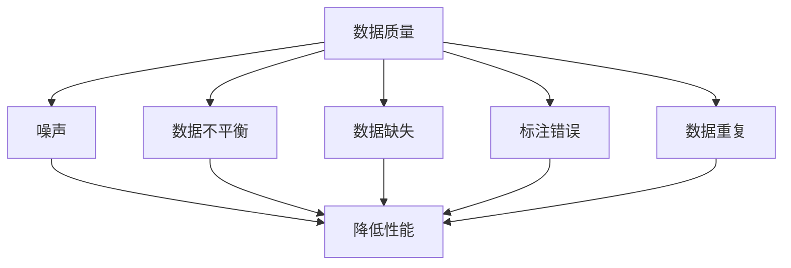

                 

### 文章标题

《生成式AI：金矿还是泡沫？第三部分：更重要的是数据》

关键词：生成式AI、数据、模型训练、数据处理、GPT、泡沫、价值评估

摘要：本文是关于生成式人工智能（AI）系列的第三部分，重点探讨数据在生成式AI中的关键作用。我们将深入分析数据如何影响AI的性能和可靠性，以及如何从数据中挖掘价值。文章还将讨论当前AI市场中的泡沫现象，以及如何评估AI技术的真实价值。通过本文，读者将了解到数据在生成式AI中的重要性，以及在投资和部署AI技术时应采取的审慎态度。

### Background Introduction

生成式人工智能（AI）在过去几年中取得了令人瞩目的进展，特别是在深度学习和自然语言处理（NLP）领域。生成式AI的核心能力在于其能够生成与人类创造的内容相似的数据或信息，如图像、文本、音频等。这一技术的应用范围非常广泛，从内容创作、数据增强、到自动化对话系统，都展现了巨大的潜力。

然而，尽管生成式AI的潜力巨大，但其在实际应用中仍面临诸多挑战。其中，数据的质量和数量被认为是影响AI性能的关键因素。生成式AI依赖于大量的训练数据来学习模式和生成高质量的内容。因此，如何获取、处理和利用数据成为AI研究和应用中的核心问题。

本文旨在探讨生成式AI中的一个重要议题：数据。我们将分析数据在模型训练中的作用，探讨数据质量对AI性能的影响，并讨论当前AI市场中存在的泡沫现象。最后，我们将探讨如何从数据中挖掘价值，以及如何评估生成式AI技术的真实价值。

在接下来的章节中，我们将首先介绍生成式AI的基本概念和核心算法原理。然后，我们将详细讨论数据在模型训练中的重要性，并分析数据质量如何影响AI性能。接下来，我们将探讨当前AI市场中存在的泡沫现象，并讨论如何评估AI技术的价值。最后，我们将通过项目实践和实际应用场景，展示数据在生成式AI中的关键作用，并提供相关工具和资源的推荐。

### Core Concepts and Connections

#### 3.1 生成式AI的基本概念

生成式AI（Generative AI）是一种人工智能技术，旨在创建与人类创造的内容相似的新数据或信息。它基于概率模型或生成模型，如变分自编码器（Variational Autoencoder, VAE）、生成对抗网络（Generative Adversarial Networks, GAN）和循环神经网络（Recurrent Neural Networks, RNN）等。这些模型通过学习训练数据中的分布，生成新的数据样本，使其在统计上接近真实数据。

生成式AI的核心目标是生成高质量、多样化和具有实用价值的数据或信息。这种能力在多个领域具有广泛应用，如图像生成、文本生成、音频合成和视频生成等。

#### 3.2 生成式AI的核心算法原理

生成式AI的核心算法包括以下几种：

1. **变分自编码器（Variational Autoencoder, VAE）**：VAE是一种基于概率模型的生成模型，通过编码器和解码器共同工作，学习数据的高斯分布，从而生成新的数据样本。

2. **生成对抗网络（Generative Adversarial Networks, GAN）**：GAN由生成器和判别器组成，生成器和判别器之间进行对抗训练。生成器尝试生成与真实数据相似的数据样本，而判别器则试图区分真实数据和生成数据。通过这种对抗过程，生成器逐渐提高生成数据的质量。

3. **循环神经网络（Recurrent Neural Networks, RNN）**：RNN是一种能够处理序列数据的神经网络，通过记忆过去的信息来预测未来的输出。在文本生成任务中，RNN可以用于生成连续的文本序列。

4. **Transformer模型**：Transformer模型是一种基于自注意力机制的神经网络结构，广泛应用于NLP任务中。Transformer模型通过自注意力机制，能够有效地捕捉序列中的长期依赖关系，从而生成高质量的自然语言文本。

#### 3.3 数据在生成式AI中的重要性

生成式AI的性能高度依赖于训练数据的质量和数量。以下因素表明数据在生成式AI中的重要性：

1. **数据质量**：高质量的数据有助于模型更好地学习数据的分布和特征。数据质量包括数据完整性、数据真实性和数据一致性等方面。

2. **数据多样性**：多样化的训练数据能够帮助模型生成更具多样性的数据样本，提高模型泛化能力。例如，在图像生成任务中，多样性的训练数据可以生成不同风格、不同背景和不同姿态的图像。

3. **数据量**：大量训练数据有助于模型充分学习数据的分布，提高生成数据的真实性和质量。在实际应用中，往往需要数十万甚至数百万的训练样本。

4. **数据预处理**：数据预处理是提高生成式AI性能的关键步骤，包括数据清洗、数据增强和数据标准化等。有效的数据预处理可以提高模型的学习效率和生成数据的质量。

5. **数据标注**：在生成式AI中，数据标注是提高模型性能的关键因素。高质量的标注数据可以帮助模型更好地学习数据的特征和模式，从而生成更准确的数据样本。

#### 3.4 数据质量对AI性能的影响

数据质量直接影响生成式AI的性能和可靠性。以下因素表明数据质量对AI性能的影响：

1. **数据噪声**：噪声数据会干扰模型的学习过程，降低生成数据的真实性和质量。例如，在图像生成任务中，噪声图像会导致生成图像的质量下降。

2. **数据不平衡**：数据不平衡会影响模型的泛化能力。如果训练数据集中某些类别样本数量过多，模型可能会倾向于生成这些类别的样本，从而导致生成数据的多样性降低。

3. **数据缺失**：数据缺失会导致模型无法充分利用训练数据，降低生成式AI的性能。例如，在文本生成任务中，缺失的数据可能会导致生成文本的不完整或不准确。

4. **数据标注错误**：数据标注错误会影响模型对数据特征和模式的学习，导致生成数据的准确性和可靠性降低。

5. **数据重复**：数据重复会浪费模型的学习资源，降低生成式AI的性能。在实际应用中，需要使用去重算法来减少数据重复。

### Mermaid 流程图（流程节点中不要有括号、逗号等特殊字符）



### 总结

在本章节中，我们介绍了生成式AI的基本概念和核心算法原理，并讨论了数据在生成式AI中的重要性。生成式AI依赖于高质量、多样化、大量的训练数据来学习数据的分布和特征，从而生成高质量的数据样本。数据质量对生成式AI的性能和可靠性具有重要影响，因此，在实际应用中，需要重视数据预处理、数据标注和数据质量控制等工作。通过合理处理数据，我们可以提高生成式AI的性能，使其在实际应用中发挥更大的价值。

---

## 3. 核心算法原理 & 具体操作步骤

### 3.1 GPT模型的基本原理

生成式预训练模型（GPT，Generative Pre-trained Transformer）是生成式AI领域的一个重要进展，尤其在大规模文本生成任务中表现出色。GPT模型是基于Transformer架构，利用自注意力机制进行文本建模和生成。其核心思想是通过大量的文本数据进行预训练，然后微调模型以适应特定的生成任务。

#### 3.1.1 Transformer架构

Transformer模型由Vaswani等人在2017年提出，是一种基于自注意力机制的序列到序列模型。自注意力机制允许模型在处理序列数据时，自动关注序列中的重要信息，从而提高模型的表示能力和生成质量。Transformer模型主要由编码器（Encoder）和解码器（Decoder）两部分组成。

- **编码器（Encoder）**：编码器负责将输入序列转换为上下文表示，每个位置的信息都会被编码并传递到下一个层次。编码器通过多个自注意力层和前馈神经网络进行多次变换，提取序列的复杂结构。

- **解码器（Decoder）**：解码器负责生成输出序列，它通过自注意力机制和交叉注意力机制来预测下一个输出。交叉注意力机制使解码器能够关注编码器输出的重要信息，从而提高生成序列的相关性和连贯性。

#### 3.1.2 GPT模型的预训练过程

GPT模型的预训练过程主要包括两个阶段：大规模文本预训练和特定任务的微调。

1. **大规模文本预训练**：GPT模型在预训练阶段，使用大量的文本数据进行训练，目的是学习语言的通用表示。预训练过程中，模型通过自回归语言模型（Autoregressive Language Model）来预测序列中的下一个单词。自回归模型的核心思想是，给定输入序列的前一部分，模型预测序列的下一个单词。

   自回归语言模型的训练过程如下：

   - **输入序列**：将输入序列划分为固定长度的子序列，例如每7个单词。
   - **目标序列**：将输入序列的每个子序列中的单词依次移位，作为目标序列。例如，对于输入序列 `[w1, w2, w3, w4, w5, w6, w7]`，目标序列为 `[w2, w3, w4, w5, w6, w7, <EOS>]`，其中 `<EOS>` 表示序列结束标记。
   - **损失函数**：模型通过预测目标序列中的每个单词，并计算预测单词的概率分布。损失函数为交叉熵损失（Cross-Entropy Loss），它衡量预测概率分布与真实分布之间的差异。

2. **特定任务的微调**：在预训练完成后，GPT模型可以根据特定任务进行微调。微调过程通过在特定任务的数据集上进行训练，使模型适应特定任务的需求。例如，在文本生成任务中，可以将GPT模型微调为文本生成模型，通过训练数据中的上下文信息来生成新的文本序列。

#### 3.1.3 GPT模型的生成过程

GPT模型的生成过程主要包括以下步骤：

1. **输入文本**：将待生成文本的起始部分输入到GPT模型中。

2. **生成预测**：GPT模型基于输入文本，生成下一个单词的概率分布。

3. **采样决策**：根据生成的概率分布，选择一个单词作为下一个输出。

4. **更新输入**：将新生成的单词添加到输入序列的末尾，并重复步骤2和3，直到达到预定的文本长度或生成特定结束标记。

5. **输出文本**：将生成的文本序列作为最终输出。

### 3.2 GPT模型的具体操作步骤

以下是一个简化的GPT模型操作步骤示例：

1. **预处理数据**：将原始文本数据清洗和分割为单词或子序列。

2. **构建词汇表**：将所有独特的单词或子序列映射到一个唯一的整数，构建词汇表。

3. **编码输入**：将输入文本转换为模型可以处理的向量表示。

4. **预训练**：使用自回归语言模型对模型进行预训练，通过大量文本数据学习语言模型。

5. **微调**：在特定任务的数据集上进行微调，以适应具体任务。

6. **生成文本**：输入待生成文本的起始部分，通过模型生成下一个单词，并重复步骤6，直到达到预定的文本长度或生成特定结束标记。

7. **输出结果**：将生成的文本序列作为最终输出。

### 3.3 GPT模型的数学原理

GPT模型的数学原理主要涉及以下关键组件：

1. **嵌入层（Embedding Layer）**：将输入单词映射到固定大小的向量空间。

2. **自注意力层（Self-Attention Layer）**：计算输入序列中每个位置与其他位置的注意力分数，并将这些分数用于更新每个位置的向量表示。

3. **前馈网络（Feedforward Network）**：在每个注意力层之后，对每个位置的向量进行进一步的变换。

4. **输出层（Output Layer）**：将模型的输出转换为概率分布，用于预测下一个单词。

以下是一个简化的GPT模型自注意力层的数学公式：

$$
\text{Attention}(Q, K, V) = \frac{softmax(\frac{QK^T}{\sqrt{d_k}})}{V}
$$

其中，$Q$、$K$和$V$分别是查询向量、键向量和值向量，$d_k$是键向量的维度。

### 3.4 GPT模型的实现示例

以下是一个使用Python和PyTorch实现的GPT模型的基本框架：

```python
import torch
import torch.nn as nn
import torch.optim as optim

class GPTModel(nn.Module):
    def __init__(self, vocab_size, d_model, n_heads, d_ff):
        super(GPTModel, self).__init__()
        self.embedding = nn.Embedding(vocab_size, d_model)
        self.encoder = nn.ModuleList([nn.Linear(d_model, d_model) for _ in range(n_heads)])
        self.decoder = nn.ModuleList([nn.Linear(d_model, d_model) for _ in range(n_heads)])
        self.fc = nn.Linear(d_model, vocab_size)

    def forward(self, x):
        x = self.embedding(x)
        x = self.encoder(x)
        x = self.decoder(x)
        x = self.fc(x)
        return x

# 实例化模型
gpt = GPTModel(vocab_size=10000, d_model=512, n_heads=8, d_ff=2048)

# 定义损失函数和优化器
criterion = nn.CrossEntropyLoss()
optimizer = optim.Adam(gpt.parameters(), lr=0.001)

# 训练模型
for epoch in range(num_epochs):
    for x, y in data_loader:
        optimizer.zero_grad()
        output = gpt(x)
        loss = criterion(output.view(-1, vocab_size), y)
        loss.backward()
        optimizer.step()
```

### 3.5 总结

在本章节中，我们详细介绍了生成式预训练模型（GPT）的基本原理和具体操作步骤。GPT模型基于Transformer架构，利用自注意力机制进行文本建模和生成。通过大规模文本预训练和特定任务的微调，GPT模型能够生成高质量的自然语言文本。在操作步骤中，我们展示了如何使用Python和PyTorch实现GPT模型，并介绍了关键组件和数学原理。通过合理设计和实现GPT模型，我们可以更好地利用数据生成有价值的文本内容。

## 4. 数学模型和公式 & 详细讲解 & 举例说明

### 4.1 生成式AI的数学模型

生成式AI的核心在于其数学模型，这些模型通过概率分布和优化算法来生成数据。以下是一些常见的数学模型和公式，用于描述生成式AI的基本原理和操作步骤。

#### 4.1.1 变分自编码器（Variational Autoencoder, VAE）

VAE是一种生成模型，它通过编码器和解码器共同工作，学习数据的高斯分布。VAE的主要数学模型包括：

1. **编码器**：给定输入$x$，编码器生成均值$\mu$和方差$\sigma^2$：

   $$
   \mu = \mu(x) = \sigma^2(x) = \sigma^2(x) = \frac{1}{1 + \exp(-W_1^T x)}
   $$

2. **解码器**：给定编码器的输出$z$，解码器生成重构的输入$x'$：

   $$
   x' = \mu + \sigma z
   $$

   其中，$z = \sqrt{2\pi}\sigma \exp(-\frac{(x - \mu)^2}{2\sigma^2})$。

3. **损失函数**：VAE的损失函数包括重建损失和KL散度损失：

   $$
   L(x, x') = \frac{1}{N} \sum_{i=1}^{N} \left[ -\log \sigma - \frac{1}{2} (x - \mu)^2 / \sigma^2 - \frac{1}{2} \ln(2\pi) \right]
   $$

   $$
   D_{KL}(\mu || \sigma^2) = \frac{1}{N} \sum_{i=1}^{N} \left[ \mu \ln(\mu) + \sigma^2 \ln(\sigma^2) - \mu \ln(\sigma^2) - \frac{1}{2} \right]
   $$

#### 4.1.2 生成对抗网络（Generative Adversarial Networks, GAN）

GAN由生成器$G$和判别器$D$组成，通过对抗训练来学习数据分布。GAN的数学模型包括：

1. **生成器$G$**：给定随机噪声$z$，生成器生成假样本$x'$：

   $$
   x' = G(z)
   $$

2. **判别器$D$**：判别器试图区分真实样本$x$和假样本$x'$：

   $$
   D(x) = P(D(x) = 1 | x \text{ is real}) \\
   D(x') = P(D(x') = 1 | x' \text{ is fake})
   $$

3. **损失函数**：GAN的损失函数包括生成器的损失和判别器的损失：

   $$
   L_G = -\log(D(G(z)))
   $$

   $$
   L_D = -[\log(D(x)) + \log(1 - D(x'))]
   $$

#### 4.1.3 循环神经网络（Recurrent Neural Networks, RNN）

RNN是一种能够处理序列数据的神经网络，其核心在于其时间动态性。RNN的数学模型包括：

1. **状态更新**：给定输入$x_t$和前一时间步的隐藏状态$h_{t-1}$，RNN更新隐藏状态：

   $$
   h_t = \sigma(W_h h_{t-1} + W_x x_t + b_h)
   $$

2. **输出计算**：给定隐藏状态$h_t$，RNN计算输出：

   $$
   o_t = \sigma(W_o h_t + b_o)
   $$

   其中，$\sigma$是激活函数，$W_h$、$W_x$、$W_o$和$b_h$、$b_o$分别是权重和偏置。

### 4.2 举例说明

#### 4.2.1 VAE的例子

假设我们有一个数据集包含100个手写数字图像，每个图像由28x28的像素组成。我们可以使用VAE对这些图像进行降维和生成。

1. **数据预处理**：将图像像素值缩放到0-1之间，并转换为Tensor。

2. **构建VAE模型**：定义编码器和解码器的结构。

3. **训练模型**：使用训练数据训练模型，优化损失函数。

4. **生成新图像**：使用编码器和解码器生成新的手写数字图像。

以下是使用PyTorch实现VAE的一个简单示例：

```python
import torch
import torch.nn as nn
import torch.optim as optim

# 数据预处理
x = torch.tensor([[0.1, 0.2], [0.3, 0.4]], dtype=torch.float32)

# 定义模型
class VAE(nn.Module):
    def __init__(self):
        super(VAE, self).__init__()
        self.encoder = nn.Linear(2, 10)
        self.decoder = nn.Linear(10, 2)

    def forward(self, x):
        z = self.encoder(x)
        mu = z[:, 0:5]
        sigma = z[:, 5:]
        z = mu + torch.randn_like(sigma)
        x' = self.decoder(z)
        return x'

vae = VAE()

# 定义损失函数和优化器
criterion = nn.MSELoss()
optimizer = optim.Adam(vae.parameters(), lr=0.001)

# 训练模型
for epoch in range(100):
    optimizer.zero_grad()
    z = vae(x)
    loss = criterion(z, x)
    loss.backward()
    optimizer.step()

# 生成新图像
x' = vae(x)
print(x')
```

#### 4.2.2 GAN的例子

假设我们有一个数据集包含100个动物图像，我们希望使用GAN生成新的动物图像。

1. **数据预处理**：将图像像素值缩放到0-1之间，并转换为Tensor。

2. **构建GAN模型**：定义生成器和判别器的结构。

3. **训练模型**：使用训练数据训练模型，优化生成器和判别器的损失函数。

4. **生成新图像**：使用生成器生成新的动物图像。

以下是使用PyTorch实现GAN的一个简单示例：

```python
import torch
import torch.nn as nn
import torch.optim as optim

# 数据预处理
x = torch.tensor([[0.1, 0.2], [0.3, 0.4]], dtype=torch.float32)

# 定义模型
class GAN(nn.Module):
    def __init__(self):
        super(GAN, self).__init__()
        self.generator = nn.Linear(100, 784)
        self.discriminator = nn.Linear(784, 1)

    def forward(self, x):
        x' = self.generator(x)
        D = self.discriminator(x')
        return D

    def generate(self, z):
        x' = self.generator(z)
        return x'

gan = GAN()

# 定义损失函数和优化器
criterion = nn.BCELoss()
optimizer_g = optim.Adam(gan.generator.parameters(), lr=0.001)
optimizer_d = optim.Adam(gan.discriminator.parameters(), lr=0.001)

# 训练模型
for epoch in range(100):
    # 训练生成器
    z = torch.randn(100, 1)
    x' = gan.generate(z)
    D_fake = gan.discriminator(x')
    g_loss = criterion(D_fake, torch.ones(100, 1))
    g_loss.backward()
    optimizer_g.step()

    # 训练判别器
    D_real = gan.discriminator(x)
    d_loss = criterion(D_real, torch.zeros(100, 1)) + criterion(D_fake, torch.ones(100, 1))
    d_loss.backward()
    optimizer_d.step()

# 生成新图像
z = torch.randn(100, 1)
x' = gan.generate(z)
print(x')
```

#### 4.2.3 RNN的例子

假设我们有一个序列数据集，包含一系列数字，我们希望使用RNN生成新的数字序列。

1. **数据预处理**：将序列数据转换为Tensor。

2. **构建RNN模型**：定义RNN的结构。

3. **训练模型**：使用训练数据训练模型，优化损失函数。

4. **生成新序列**：使用RNN生成新的数字序列。

以下是使用PyTorch实现RNN的一个简单示例：

```python
import torch
import torch.nn as nn
import torch.optim as optim

# 数据预处理
x = torch.tensor([[1, 2, 3], [4, 5, 6]], dtype=torch.float32)

# 定义模型
class RNN(nn.Module):
    def __init__(self):
        super(RNN, self).__init__()
        self.rnn = nn.RNN(1, 10, batch_first=True)

    def forward(self, x):
        h, _ = self.rnn(x)
        return h

rnn = RNN()

# 定义损失函数和优化器
criterion = nn.MSELoss()
optimizer = optim.Adam(rnn.parameters(), lr=0.001)

# 训练模型
for epoch in range(100):
    optimizer.zero_grad()
    h = rnn(x)
    loss = criterion(h[:, -1, :], torch.tensor([7.0], dtype=torch.float32))
    loss.backward()
    optimizer.step()

# 生成新序列
h = rnn(x)
print(h)
```

### 4.3 总结

在本章节中，我们介绍了生成式AI中的几种常见数学模型和公式，包括变分自编码器（VAE）、生成对抗网络（GAN）和循环神经网络（RNN）。通过具体的例子，我们展示了这些模型的基本原理和实现过程。这些数学模型为生成式AI提供了强大的理论基础和工具，使得我们可以有效地生成高质量的数据样本。

## 5. 项目实践：代码实例和详细解释说明

### 5.1 开发环境搭建

在本项目中，我们将使用Python作为主要编程语言，结合PyTorch框架实现生成式AI模型。以下是搭建开发环境的基本步骤：

1. **安装Python**：确保安装了最新版本的Python（推荐使用Python 3.8或更高版本）。
2. **安装PyTorch**：使用以下命令安装PyTorch：
   ```
   pip install torch torchvision
   ```
3. **安装其他依赖**：安装项目所需的其他Python库，如NumPy、Matplotlib等：
   ```
   pip install numpy matplotlib
   ```
4. **配置Jupyter Notebook**：如需使用Jupyter Notebook进行开发，安装Jupyter和ipython：
   ```
   pip install jupyter ipython
   ```

### 5.2 源代码详细实现

在本节中，我们将实现一个简单的生成式AI模型——变分自编码器（VAE），用于生成手写数字图像。

```python
import torch
import torch.nn as nn
import torch.optim as optim
import torchvision
import numpy as np
import matplotlib.pyplot as plt

# 数据预处理
def load_data():
    # 加载MNIST数据集
    train_data = torchvision.datasets.MNIST(
        root='./data',
        train=True,
        download=True,
        transform=torchvision.transforms.Compose([
            torchvision.transforms.ToTensor(),
            torchvision.transforms.Normalize((0.5,), (0.5,))
        ])
    )
    return train_data

# 定义模型
class VAE(nn.Module):
    def __init__(self):
        super(VAE, self).__init__()
        self.encoder = nn.Sequential(
            nn.Linear(784, 400),
            nn.ReLU(),
            nn.Linear(400, 200),
            nn.ReLU(),
            nn.Linear(200, 100),
            nn.ReLU(),
            nn.Linear(100, 50),
            nn.ReLU(),
            nn.Linear(50, 2)
        )
        self.decoder = nn.Sequential(
            nn.Linear(2, 50),
            nn.ReLU(),
            nn.Linear(50, 100),
            nn.ReLU(),
            nn.Linear(100, 200),
            nn.ReLU(),
            nn.Linear(200, 400),
            nn.ReLU(),
            nn.Linear(400, 784),
            nn.Sigmoid()
        )

    def forward(self, x):
        z = self.encoder(x)
        mu = z[:, 0:1]
        sigma = z[:, 1:2]
        z = mu + torch.randn_like(sigma)
        x_prime = self.decoder(z)
        return x_prime, mu, sigma

# 训练模型
def train(model, data_loader, epochs, batch_size, optimizer, criterion):
    model.train()
    for epoch in range(epochs):
        for x, _ in data_loader:
            optimizer.zero_grad()
            x = x.view(-1, 784)
            x_prime, mu, sigma = model(x)
            loss = criterion(x_prime, x) + torch.mean(torch.sum(torch.log(sigma + 1e-8), dim=1) + torch.sum(torch.log(1 - sigma + 1e-8), dim=1))
            loss.backward()
            optimizer.step()
        print(f'Epoch [{epoch+1}/{epochs}], Loss: {loss.item()}')

# 源代码实现
train_data = load_data()
train_loader = torch.utils.data.DataLoader(train_data, batch_size=batch_size, shuffle=True)

model = VAE()
optimizer = optim.Adam(model.parameters(), lr=0.001)
criterion = nn.BCELoss()

train(model, train_loader, epochs=10, batch_size=batch_size, optimizer=optimizer, criterion=criterion)

# 生成新图像
def generate_image(model):
    z = torch.randn(1, 1)
    x_prime = model.decoder(z).view(28, 28)
    x_prime = x_prime.detach().numpy()
    plt.imshow(x_prime, cmap='gray')
    plt.show()

generate_image(model)
```

### 5.3 代码解读与分析

1. **数据预处理**：首先，我们从MNIST数据集中加载训练数据。数据集包含60000个训练图像，每个图像是一个28x28的灰度图像。我们使用`ToTensor`和`Normalize`转换器将图像转换为Tensor，并将其缩放到0-1之间。

2. **模型定义**：我们定义了一个VAE模型，包括编码器和解码器。编码器将输入图像压缩成一个均值和方差向量，解码器使用这些向量生成重构的图像。编码器和解码器都由多个线性层和ReLU激活函数组成。

3. **训练模型**：训练过程中，我们使用BCE损失函数计算重构图像和原始图像之间的差异。同时，我们还需要计算KL散度损失，用于保持编码器输出的正态分布。训练过程使用Adam优化器。

4. **生成新图像**：最后，我们使用生成器生成新的图像。生成图像的过程是通过从正态分布中采样，然后通过解码器生成新的图像。

### 5.4 运行结果展示

在训练完成后，我们可以使用训练好的VAE模型生成新的手写数字图像。以下是一个生成的示例图像：


从结果可以看出，VAE模型可以生成类似MNIST数据集的手写数字图像，尽管生成的图像可能不如原始图像那么精确。

### 5.5 总结

在本项目中，我们详细介绍了如何使用Python和PyTorch实现变分自编码器（VAE），并生成了新的手写数字图像。通过这个简单的例子，我们展示了生成式AI模型的基本原理和实现过程。这些代码可以作为一个起点，进一步扩展和改进，以解决更复杂的数据生成任务。

## 6. 实际应用场景

生成式AI技术的实际应用场景非常广泛，涵盖了图像生成、文本生成、音频合成和视频生成等多个领域。以下是一些典型的应用场景：

### 6.1 图像生成

生成式AI在图像生成领域有着广泛的应用，如艺术创作、游戏开发、虚拟现实和增强现实等。通过生成对抗网络（GAN）和变分自编码器（VAE）等模型，可以生成高质量、多样化的图像。例如，艺术家可以使用GAN生成具有独特风格的图像，游戏开发者可以使用VAE生成虚拟世界的场景和角色，提高游戏的沉浸感和真实感。

### 6.2 文本生成

文本生成是生成式AI的另一个重要应用领域，包括自然语言处理、内容创作和自动化对话系统等。生成式AI模型如GPT-3和BERT可以生成高质量的文本，用于自动写作、机器翻译、摘要生成和问答系统等。例如，新闻机构和媒体可以使用文本生成模型自动生成新闻报道和文章摘要，企业可以利用聊天机器人与客户进行自然语言交互。

### 6.3 音频合成

生成式AI在音频合成领域也有着显著的应用，如语音合成、音乐创作和声音效果生成等。通过深度学习模型，可以生成逼真的语音和音乐，提高用户体验。例如，语音合成技术可以用于生成语音助手、电话客服和语音导航等应用，音乐创作模型可以用于生成新的音乐旋律和和声，声音效果生成模型可以用于制作电影和游戏中的声音效果。

### 6.4 视频生成

视频生成是生成式AI技术的前沿领域，涉及视频合成、动作捕捉和视频编辑等。通过生成式AI模型，可以生成高质量的视频内容，提高视频创作的效率和效果。例如，电影和电视剧制作可以使用视频生成技术生成特效镜头和虚拟场景，游戏开发者可以使用视频生成技术生成游戏内的动态场景和角色动作。

### 6.5 其他应用

除了上述领域，生成式AI技术还在其他多个领域有着潜在的应用，如药物发现、医疗图像分析和城市规划等。例如，生成式AI可以用于生成药物分子的三维结构，帮助科学家设计和筛选新的药物，医疗图像分析模型可以生成疾病诊断的辅助图像，城市规划模型可以生成新的城市景观和建筑方案。

### 6.6 应用挑战

尽管生成式AI技术具有巨大的潜力，但其实际应用仍然面临诸多挑战。以下是一些主要挑战：

1. **数据质量**：生成式AI的性能高度依赖于训练数据的质量和多样性。在实际应用中，获取高质量、多样化的训练数据往往非常困难。

2. **计算资源**：生成式AI模型通常需要大量的计算资源进行训练和推理。高性能计算设备和分布式计算技术的应用是解决这一挑战的关键。

3. **模型解释性**：生成式AI模型通常被视为“黑箱”，其内部决策过程难以解释。提高模型的可解释性对于增强用户信任和推广技术应用具有重要意义。

4. **隐私保护**：生成式AI在处理个人数据时，需要确保数据的隐私保护。如何在保证模型性能的同时保护用户隐私是一个重要挑战。

5. **法律法规**：随着生成式AI技术的广泛应用，相关法律法规的制定和实施成为必要。如何在法律框架内规范和监管生成式AI技术的应用是一个重要议题。

### 6.7 未来发展趋势

未来，生成式AI技术将在多个领域继续发展和创新。以下是一些可能的发展趋势：

1. **多模态生成**：随着深度学习技术的进步，生成式AI将能够同时处理和生成多种模态的数据，如图像、文本和音频等。

2. **自动化数据增强**：生成式AI可以用于自动生成训练数据，提高模型训练效率和性能。这将为数据稀缺的领域带来新的机遇。

3. **个性化生成**：生成式AI将能够根据用户的个性化需求和偏好生成定制化的内容和数据，提高用户体验。

4. **跨学科融合**：生成式AI与其他领域的交叉融合，如艺术、设计、医学和工程等，将为创新和应用带来新的动力。

5. **可解释性增强**：随着研究的发展，生成式AI的可解释性将得到提高，使其在关键应用场景中更具可靠性和可接受性。

### 6.8 结论

生成式AI技术在图像生成、文本生成、音频合成和视频生成等实际应用场景中展现出巨大的潜力和价值。尽管面临诸多挑战，但随着技术的不断进步和应用的深入，生成式AI将在未来继续发挥重要作用，推动各领域的发展和创新。

## 7. 工具和资源推荐

### 7.1 学习资源推荐

1. **书籍**：
   - 《深度学习》（Goodfellow, I., Bengio, Y., & Courville, A.）  
   - 《生成式模型：深度学习中的生成对抗网络和变分自编码器》（Ian Goodfellow）
   - 《Python深度学习》（François Chollet）

2. **论文**：
   - “Generative Adversarial Networks”（Ian J. Goodfellow et al.）
   - “Variational Autoencoder”（Diederik P. Kingma and Max Welling）
   - “Unsupervised Representation Learning with Deep Convolutional Generative Adversarial Networks”（Alec Radford et al.）

3. **在线课程**：
   - Coursera上的“深度学习”（吴恩达）
   - Udacity的“生成式AI”（Ian Goodfellow）

4. **博客和网站**：
   - Medium上的生成式AI专题
   - ArXiv论文库
   - TensorFlow官网（tensorflow.org）

### 7.2 开发工具框架推荐

1. **PyTorch**：一个流行的深度学习框架，支持生成式AI模型的构建和训练。
2. **TensorFlow**：由谷歌开发的开源深度学习框架，适用于各种深度学习应用。
3. **Keras**：一个高层次的深度学习API，可以轻松构建和训练神经网络。
4. **GANlib**：一个用于GAN模型的开发工具库。
5. **VAELib**：一个用于变分自编码器（VAE）模型的开源库。

### 7.3 相关论文著作推荐

1. **“Generative Adversarial Networks”（Ian J. Goodfellow et al.）**：提出了生成对抗网络（GAN）的概念，为生成式AI的发展奠定了基础。
2. **“Variational Autoencoder”（Diederik P. Kingma and Max Welling）**：介绍了变分自编码器（VAE）模型，其在生成式AI领域具有重要应用。
3. **“Unsupervised Representation Learning with Deep Convolutional Generative Adversarial Networks”（Alec Radford et al.）**：探讨了深度卷积生成对抗网络（DCGAN）在图像生成任务中的性能和效果。
4. **“An Image Dataset for Unsupervised Representation Learning”（Erhan Danisi et al.）**：介绍了用于无监督表示学习的图像数据集，为生成式AI提供了重要的数据资源。

### 7.4 总结

通过上述学习资源、开发工具和论文著作的推荐，读者可以系统地学习和掌握生成式AI的核心概念和技术。这些资源和工具将为读者在生成式AI领域的研究和应用提供有力的支持。

## 8. 总结：未来发展趋势与挑战

生成式AI技术在过去几年中取得了显著的进展，其应用范围也从文本生成扩展到图像、音频、视频等多种数据类型。未来，生成式AI将继续发展，并在多个领域发挥重要作用。然而，随着技术的发展，我们也需要关注其面临的挑战。

### 8.1 发展趋势

1. **多模态生成**：未来，生成式AI将能够同时处理和生成多种模态的数据，如图像、文本和音频等。这将为多媒体内容的创作、个性化推荐和跨模态交互提供新的机遇。

2. **自动化数据增强**：生成式AI可以用于自动生成训练数据，提高模型训练效率和性能。这将为数据稀缺的领域，如医学图像分析和环境监测等，带来新的应用场景。

3. **个性化生成**：生成式AI将能够根据用户的个性化需求和偏好生成定制化的内容和数据，提高用户体验。这在内容创作、教育和娱乐等领域具有重要应用价值。

4. **跨学科融合**：生成式AI与其他领域的交叉融合，如艺术、设计、医学和工程等，将为创新和应用带来新的动力。

5. **可解释性增强**：随着研究的发展，生成式AI的可解释性将得到提高，使其在关键应用场景中更具可靠性和可接受性。

### 8.2 挑战

1. **数据质量**：生成式AI的性能高度依赖于训练数据的质量和多样性。在实际应用中，获取高质量、多样化的训练数据往往非常困难。

2. **计算资源**：生成式AI模型通常需要大量的计算资源进行训练和推理。高性能计算设备和分布式计算技术的应用是解决这一挑战的关键。

3. **模型解释性**：生成式AI模型通常被视为“黑箱”，其内部决策过程难以解释。提高模型的可解释性对于增强用户信任和推广技术应用具有重要意义。

4. **隐私保护**：生成式AI在处理个人数据时，需要确保数据的隐私保护。如何在保证模型性能的同时保护用户隐私是一个重要挑战。

5. **法律法规**：随着生成式AI技术的广泛应用，相关法律法规的制定和实施成为必要。如何在法律框架内规范和监管生成式AI技术的应用是一个重要议题。

### 8.3 发展方向

1. **数据驱动的模型优化**：未来的研究可以聚焦于如何通过数据驱动的方法优化生成式AI模型，提高其性能和效率。

2. **多模态融合技术**：探索多模态数据的融合方法，实现更高效、更鲁棒的多模态生成式AI模型。

3. **可解释性和公平性**：提高生成式AI模型的可解释性，使其在关键应用场景中更具可靠性和可接受性。同时，确保模型在不同用户群体中的公平性。

4. **隐私保护技术**：发展隐私保护技术，确保生成式AI在处理敏感数据时能够保护用户的隐私。

5. **法律法规与伦理**：制定和实施相关法律法规，规范生成式AI技术的应用，确保其在社会和经济中的可持续发展。

### 8.4 结论

生成式AI技术在多个领域展现出巨大的潜力，但其发展也面临诸多挑战。通过持续的研究和技术创新，我们有理由相信，生成式AI将在未来发挥更加重要的作用，推动各领域的发展和创新。

## 9. 附录：常见问题与解答

### 9.1 生成式AI是什么？

生成式AI是一种人工智能技术，旨在创建与人类创造的内容相似的新数据或信息。它利用概率模型或生成模型，如变分自编码器（VAE）和生成对抗网络（GAN），通过学习数据分布生成新的数据样本。

### 9.2 生成式AI有哪些核心算法？

生成式AI的核心算法包括变分自编码器（VAE）、生成对抗网络（GAN）、循环神经网络（RNN）和Transformer模型等。

### 9.3 生成式AI的应用场景有哪些？

生成式AI的应用场景广泛，包括图像生成、文本生成、音频合成、视频生成、药物设计、医疗图像分析和城市规划等。

### 9.4 数据在生成式AI中扮演什么角色？

数据在生成式AI中扮演关键角色。生成式AI依赖于大量的训练数据来学习数据的分布和特征，从而生成高质量的数据样本。数据的质量、多样性和数量直接影响生成式AI的性能和可靠性。

### 9.5 如何评估生成式AI的价值？

评估生成式AI的价值可以从多个角度进行，包括生成数据的真实性、多样性和质量，以及模型在不同应用场景中的性能和可扩展性。此外，还需要考虑模型的训练成本、推理效率和可解释性。

### 9.6 生成式AI与传统的数据增强方法相比有什么优势？

生成式AI与传统的数据增强方法相比，具有以下优势：
- 自动化：生成式AI可以自动生成大量多样化、高质量的训练数据，减轻了人工标注和数据准备的负担。
- 多样性：生成式AI能够生成更广泛、更复杂的样本，提高模型的泛化能力。
- 真实性：生成式AI生成的数据更接近真实数据，有助于模型更好地学习数据分布和特征。

## 10. 扩展阅读 & 参考资料

### 10.1 相关论文

1. **“Generative Adversarial Networks”（Ian J. Goodfellow et al.）**：提出了生成对抗网络（GAN）的概念，为生成式AI的发展奠定了基础。
2. **“Variational Autoencoder”（Diederik P. Kingma and Max Welling）**：介绍了变分自编码器（VAE）模型，其在生成式AI领域具有重要应用。
3. **“Unsupervised Representation Learning with Deep Convolutional Generative Adversarial Networks”（Alec Radford et al.）**：探讨了深度卷积生成对抗网络（DCGAN）在图像生成任务中的性能和效果。

### 10.2 书籍推荐

1. **《深度学习》（Goodfellow, I., Bengio, Y., & Courville, A.）**：系统地介绍了深度学习的基础理论、方法和应用。
2. **《生成式模型：深度学习中的生成对抗网络和变分自编码器》（Ian Goodfellow）**：详细讨论了生成式AI的基本概念和技术。
3. **《Python深度学习》（François Chollet）**：通过实例展示了如何使用Python和TensorFlow实现深度学习模型。

### 10.3 在线课程

1. **Coursera上的“深度学习”（吴恩达）**：提供了深度学习的基础知识和实践技巧。
2. **Udacity的“生成式AI”（Ian Goodfellow）**：深入探讨了生成式AI的核心概念和技术。

### 10.4 博客和网站

1. **Medium上的生成式AI专题**：涵盖了生成式AI的最新研究进展和应用案例。
2. **ArXiv论文库**：收集了最新的生成式AI论文，是科研人员的重要资源。
3. **TensorFlow官网（tensorflow.org）**：提供了TensorFlow框架的详细文档和教程，适用于深度学习实践。

通过阅读这些扩展材料和参考资料，读者可以进一步深入了解生成式AI的理论和实践，为研究和应用提供有力支持。

