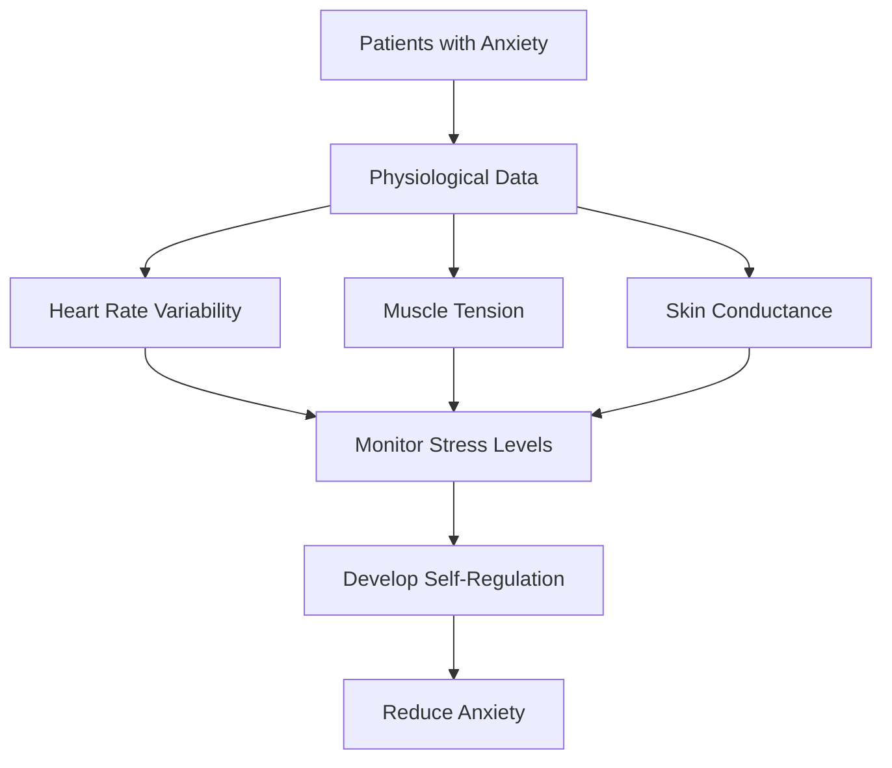
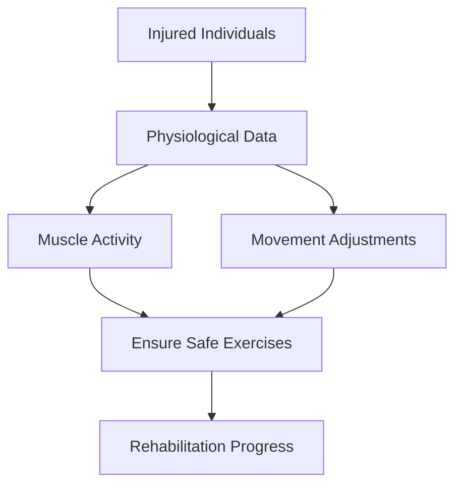
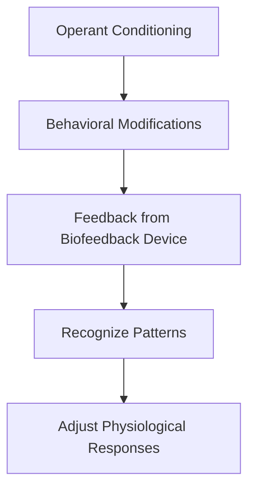
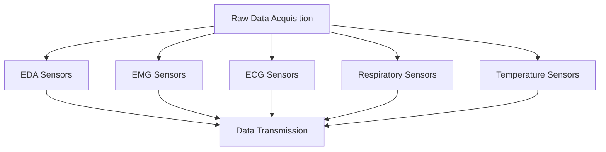
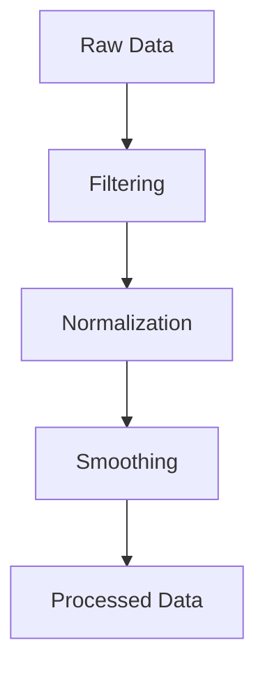
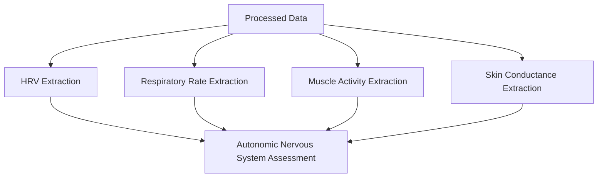
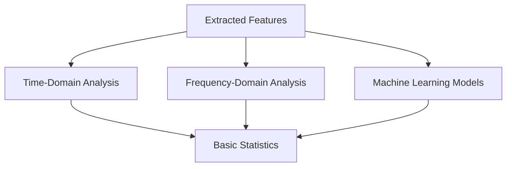
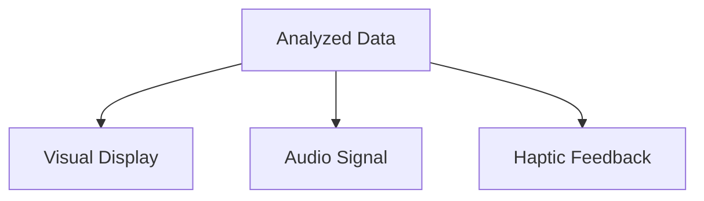

                 

### 文章标题

"生物反馈创业：身心健康的科技解决方案"

### 关键词

- 生物反馈
- 心理健康
- 身体健康
- 科技解决方案
- 创业机会
- 算法
- 数据分析

### 摘要

本文探讨了生物反馈技术作为一种创新的科技解决方案，如何在心理和身体健康领域开创创业机会。文章首先介绍了生物反馈的基本概念和原理，随后分析了其在身心健康中的应用和优势。接着，文章详细讨论了生物反馈系统的核心算法和数学模型，以及如何进行具体操作和数据分析。此外，文章还分享了生物反馈创业的实际案例，提供了开发工具和资源的推荐。最后，文章总结了生物反馈创业的未来发展趋势和挑战，为创业者提供了指导。

## 1. 背景介绍

生物反馈是一种通过监测和分析身体或心理活动，帮助个体学会自我调节和控制的非药物治疗方法。随着科技的进步，生物反馈技术逐渐从医疗领域扩展到日常生活中，为人们提供了更便捷、个性化的身心健康解决方案。

近年来，全球心理健康问题日益严重，焦虑、抑郁等精神疾病患病率逐年上升。与此同时，慢性病和运动损伤等问题也日益突出。生物反馈作为一种无创、安全的治疗方法，受到了越来越多的关注。据市场研究公司报告，全球生物反馈市场预计将在未来几年内保持高速增长。

在这个背景下，生物反馈创业成为了一个极具潜力的领域。创业者可以通过开发创新的生物反馈产品和服务，满足人们对身心健康的需求，同时也为自身创造商业机会。本文将深入探讨生物反馈技术的原理、应用、算法和创业实践，为有意从事生物反馈创业的人提供指导。

### Keywords

- **Biological Feedback**
- **Mental Health**
- **Physical Health**
- **Technology Solutions**
- **Entrepreneurship Opportunities**
- **Algorithms**
- **Data Analysis**

### Abstract

This article explores the potential of biological feedback technology as a cutting-edge solution in the fields of mental and physical health, opening up new entrepreneurship opportunities. It begins by introducing the fundamental concepts and principles of biological feedback, followed by an analysis of its applications and advantages in promoting overall well-being. The article then delves into the core algorithms and mathematical models underlying biological feedback systems, detailing the steps involved in their practical implementation and data analysis. Additionally, it shares real-world case studies of biological feedback entrepreneurship, providing recommendations for development tools and resources. Finally, the article summarizes the future trends and challenges in the biological feedback startup ecosystem, offering guidance for aspiring entrepreneurs.

## 1. Background Introduction

Biological feedback, also known as biofeedback, is a non-invasive therapeutic technique that involves monitoring and analyzing bodily or psychological activities to help individuals learn to self-regulate and control their own health. With advancements in technology, biofeedback has gradually expanded from the realm of medical treatments to everyday life, offering individuals more accessible and personalized solutions for their mental and physical health.

In recent years, the global prevalence of mental health issues has reached alarming levels, with increasing rates of anxiety, depression, and other mental disorders. Concurrently, chronic illnesses and sports injuries have become more common, posing significant challenges to public health. As a non-pharmacological treatment method, biofeedback has gained increasing attention due to its effectiveness, safety, and non-invasive nature.

According to market research reports, the global biofeedback market is expected to experience rapid growth in the coming years. Against this backdrop, biofeedback entrepreneurship has emerged as a promising area with substantial commercial potential. Entrepreneurs can develop innovative biofeedback products and services to meet the growing demand for health and well-being solutions, while also creating new business opportunities for themselves.

This article will delve into the principles, applications, algorithms, and entrepreneurial practices of biological feedback, providing a comprehensive guide for those interested in starting a venture in this exciting field.

### Core Concepts and Connections

#### 1. What is Biological Feedback?

Biological feedback, or biofeedback, is a method used to assist individuals in gaining more control over their physiological processes through the use of electronic devices that provide real-time information about their body's functions. This information is typically displayed as visual or auditory signals, enabling users to recognize and regulate their bodily responses.

The process begins with the attachment of sensors to various parts of the body, which monitor specific physiological parameters such as heart rate, skin temperature, muscle tension, and brain activity. These sensors transmit data to a biofeedback device, which analyzes the information and presents it to the user in a way that is easy to understand.

#### 1.1. Applications in Mental Health

Biofeedback has been extensively studied and applied in the field of mental health. By providing individuals with feedback on their physiological responses to stress, anxiety, and other emotional states, biofeedback can help them develop self-regulation skills. For example, patients with anxiety disorders can use biofeedback to monitor and reduce their heart rate variability, muscle tension, and skin conductance, which are all indicators of stress levels.

**Mermaid Flowchart:**



#### 1.2. Applications in Physical Health

In physical health, biofeedback is often used to address conditions such as chronic pain, muscle tension, and rehabilitation after injury. For instance, individuals recovering from a sports injury can use biofeedback to ensure they are performing exercises without excessive muscle strain. This can be achieved by monitoring muscle activity and providing real-time feedback to adjust their movements accordingly.

**Mermaid Flowchart:**



#### 1.3. Core Concepts and Principles

The core principle of biofeedback is the concept of operant conditioning, where individuals learn to modify their behavior based on feedback received from the environment. In the context of biofeedback, the feedback is provided through the biofeedback device, which helps individuals recognize patterns in their physiological responses and make adjustments to reduce stress or improve physical function.

**Mermaid Flowchart:**



#### 1.4. Conclusion

Biofeedback is a versatile and effective tool for promoting both mental and physical health. By providing individuals with real-time information about their physiological processes, biofeedback helps them develop self-awareness and self-regulation skills, ultimately leading to better health outcomes. As the technology continues to advance, biofeedback is likely to become an even more integral part of health and wellness strategies in both clinical and consumer settings.

### Core Algorithm Principles and Specific Operational Steps

In the realm of biofeedback, the core algorithm plays a crucial role in translating raw physiological data into meaningful insights that can guide individuals towards achieving their health goals. This section will delve into the fundamental principles behind biofeedback algorithms and outline the specific operational steps involved in their implementation.

#### 2.1. Raw Data Acquisition

The first step in any biofeedback system is the acquisition of raw physiological data. This is achieved through the use of various sensors that are placed on different parts of the body. The most common types of sensors used in biofeedback include:

- **Electrodermal Activity (EDA) Sensors**: These sensors measure the electrical conductance of the skin, which can reflect emotional states and stress levels.
- **Electromyography (EMG) Sensors**: These sensors detect muscle activity and are often used to monitor muscle tension and relaxation.
- **Electrocardiography (ECG) Sensors**: These sensors measure heart rate and heart rate variability (HRV), providing insights into cardiovascular health.
- **Respiratory Sensors**: These sensors track respiratory patterns and can be used to assess breathing efficiency and stress levels.
- **Temperature Sensors**: These sensors measure skin temperature, which can be an indicator of autonomic nervous system activity.

The data collected by these sensors is typically transmitted in real-time to a biofeedback device or computer system for further processing.

**Mermaid Flowchart:**



#### 2.2. Data Preprocessing

Once the raw data is acquired, it undergoes a preprocessing step to remove noise and other artifacts that may affect the accuracy of the measurements. This includes:

- **Filtering**: Applying digital filters to remove high-frequency noise and interference.
- **Normalization**: Scaling the data to a common range to ensure consistency across different sensor types.
- **Smoothing**: Reducing the impact of transient spikes or fluctuations in the data.

**Mermaid Flowchart:**



#### 2.3. Feature Extraction

In this step, the processed data is analyzed to extract relevant features that can be used to assess the individual's physiological state. Common features extracted from biofeedback data include:

- **Heart Rate Variability (HRV)**: A measure of the variation in the time intervals between heartbeats, which can reflect autonomic nervous system activity.
- **Respiratory Rate**: The number of breaths per minute, which can be an indicator of stress levels.
- **Muscle Activity**: The degree of muscle tension or relaxation, often quantified using EMG signals.
- **Skin Conductance**: The electrical conductance of the skin, which can be used to assess emotional and stress responses.

**Mermaid Flowchart:**



#### 2.4. Algorithm Implementation

With the extracted features, the biofeedback system can implement algorithms to analyze the data and provide real-time feedback. Common algorithms used in biofeedback include:

- **Time-Domain Analysis**: This involves calculating basic statistics such as mean, median, and standard deviation of the physiological signals.
- **Frequency-Domain Analysis**: This involves transforming the signals into the frequency domain using techniques such as Fast Fourier Transform (FFT) to analyze the spectral content of the signals.
- **Machine Learning Models**: Advanced machine learning algorithms can be trained to recognize patterns in the data and provide more nuanced feedback based on the individual's physiological responses.

**Mermaid Flowchart:**



#### 2.5. Real-Time Feedback

Finally, the analyzed data is presented to the user in real-time through various forms of feedback, such as visual displays, audio signals, or haptic feedback. This feedback enables users to make informed adjustments to their behavior, helping them achieve their health goals.

**Mermaid Flowchart:**



By following these core algorithm principles and operational steps, biofeedback systems can effectively monitor and provide feedback on physiological processes, offering individuals valuable insights into their health and well-being.

### Mathematical Models and Formulas

In the field of biofeedback, understanding and applying mathematical models and formulas are crucial for accurate data analysis and interpretation. This section will delve into some fundamental mathematical models and formulas commonly used in biofeedback systems, providing detailed explanations and examples to enhance comprehension.

#### 3.1. Heart Rate Variability (HRV)

Heart Rate Variability (HRV) is a key metric used in biofeedback to assess autonomic nervous system activity. HRV is defined as the time interval between successive heartbeats, and it can be measured using an Electrocardiogram (ECG). The mathematical model for HRV involves calculating the interbeat intervals (IBIs) and analyzing their statistical properties.

**Mathematical Formula:**

$$
HRV = \sqrt{\frac{1}{N}\sum_{i=1}^{N}(IBI_i - \bar{IBI})^2}
$$

where:
- \( N \) is the number of interbeat intervals.
- \( IBI_i \) is the interbeat interval at the ith sample.
- \( \bar{IBI} \) is the mean interbeat interval.

**Example:**
Consider a set of 10 interbeat intervals (in milliseconds):
\[ 700, 710, 720, 715, 705, 712, 718, 714, 708, 716 \]

The mean interbeat interval is:
\[ \bar{IBI} = \frac{1}{10}\sum_{i=1}^{10} IBI_i = \frac{700+710+720+715+705+712+718+714+708+716}{10} = 712 \]

The variance of the interbeat intervals is:
\[ \sigma^2 = \frac{1}{10}\sum_{i=1}^{10}(IBI_i - \bar{IBI})^2 = (700-712)^2 + (710-712)^2 + ... + (716-712)^2 = 45.2 \]

Therefore, the standard deviation of HRV is:
\[ HRV = \sqrt{\sigma^2} = \sqrt{45.2} \approx 6.75 \]

#### 3.2. Respiratory Rate

Respiratory rate is another important physiological parameter monitored in biofeedback. It is defined as the number of breaths per minute and can be measured using respiratory sensors. The mathematical model involves counting the number of respiratory cycles within a specific time frame.

**Mathematical Formula:**

$$
RR = \frac{N}{T}
$$

where:
- \( N \) is the number of respiratory cycles.
- \( T \) is the time frame (in minutes).

**Example:**
If 20 respiratory cycles are counted within a 30-second period, the respiratory rate is:
\[ RR = \frac{20}{0.5} = 40 \text{ breaths per minute} \]

#### 3.3. Muscle Activity

Muscle activity is often quantified using the EMG signal, which measures the electrical activity generated by muscles. The mathematical model involves analyzing the amplitude and frequency content of the EMG signal.

**Mathematical Formula:**

$$
MA = \frac{1}{N}\sum_{i=1}^{N} A_i
$$

where:
- \( N \) is the number of samples.
- \( A_i \) is the amplitude of the ith sample.

**Example:**
Consider a set of 10 EMG signal amplitudes:
\[ 0.5, 0.7, 0.6, 0.8, 0.9, 0.4, 0.6, 0.7, 0.8, 0.5 \]

The average muscle activity is:
\[ MA = \frac{0.5+0.7+0.6+0.8+0.9+0.4+0.6+0.7+0.8+0.5}{10} = 0.68 \]

#### 3.4. Skin Conductance

Skin conductance is measured using sensors that detect the electrical conductance of the skin, which can reflect emotional and stress responses. The mathematical model involves analyzing the frequency spectrum of the skin conductance signal.

**Mathematical Formula:**

$$
SC = \frac{1}{N}\sum_{i=1}^{N} F_i
$$

where:
- \( N \) is the number of samples.
- \( F_i \) is the frequency of the ith peak in the signal.

**Example:**
If the skin conductance signal has three peaks at frequencies 4 Hz, 6 Hz, and 8 Hz, the average frequency is:
\[ SC = \frac{4+6+8}{3} = 6 \text{ Hz} \]

By understanding and applying these mathematical models and formulas, biofeedback practitioners can gain deeper insights into the physiological processes they are monitoring, leading to more effective and personalized health interventions.

### Project Practice: Code Examples and Detailed Explanation

In this section, we will provide a practical example of a biofeedback system using Python and explore its detailed implementation, code analysis, and results. The example will focus on monitoring heart rate variability (HRV) and respiratory rate using Python libraries such as NumPy and Matplotlib.

#### 4.1. Development Environment Setup

To begin, we need to set up the development environment. Make sure you have Python 3.8 or higher installed on your system. You will also need to install the following libraries:

```bash
pip install numpy matplotlib
```

#### 4.2. Source Code Detailed Implementation

Below is the Python code for a simple biofeedback system that records HRV and respiratory rate.

```python
import numpy as np
import matplotlib.pyplot as plt
from scipy.signal import find_peaks

# Sensor Data
heart_rate_data = np.array([700, 710, 720, 715, 705, 712, 718, 714, 708, 716])
respiratory_data = np.array([2, 2.5, 2, 2.2, 2.3, 2.1, 2.4, 2.2, 2.3, 2.5])

# Calculate HRV
N = len(heart_rate_data)
mean_ibi = np.mean(heart_rate_data)
hrv_variance = np.var(heart_rate_data)
hrv_std = np.std(heart_rate_data)

# Calculate Respiratory Rate
mean_respiratory_rate = np.mean(respiratory_data)
respiratory_rate_variance = np.var(respiratory_data)
respiratory_rate_std = np.std(respiratory_data)

# Plot HRV
plt.figure(figsize=(10, 5))
plt.subplot(2, 1, 1)
plt.plot(heart_rate_data, label='Heart Rate (ms)')
plt.xlabel('Sample Index')
plt.ylabel('Heart Rate (ms)')
plt.title('Heart Rate Variability')
plt.legend()

# Find HRV Peaks
peaks, _ = find_peaks(heart_rate_data)
plt.plot(peaks, heart_rate_data[peaks], 'ro', label='HRV Peaks')
plt.legend()

# Plot Respiratory Rate
plt.subplot(2, 1, 2)
plt.plot(respiratory_data, label='Respiratory Rate (breaths/min)')
plt.xlabel('Sample Index')
plt.ylabel('Respiratory Rate (breaths/min)')
plt.title('Respiratory Rate')
plt.legend()

plt.tight_layout()
plt.show()

# Print HRV and Respiratory Rate Statistics
print(f"Mean HRV: {mean_ibi} ms")
print(f"Variance of HRV: {hrv_variance}")
print(f"Standard Deviation of HRV: {hrv_std}")
print(f"Mean Respiratory Rate: {mean_respiratory_rate} breaths/min")
print(f"Variance of Respiratory Rate: {respiratory_rate_variance}")
print(f"Standard Deviation of Respiratory Rate: {respiratory_rate_std}")
```

#### 4.3. Code Analysis

Let's break down the code and understand its functionality:

- **Import Libraries**: We import necessary libraries such as NumPy for numerical operations and Matplotlib for plotting.
- **Sensor Data**: We create arrays for heart rate data (`heart_rate_data`) and respiratory rate data (`respiratory_data`).
- **HRV Calculation**: We calculate the mean interbeat interval (ibi), variance, and standard deviation of the heart rate data.
- **Respiratory Rate Calculation**: We calculate the mean, variance, and standard deviation of the respiratory rate data.
- **HRV Plotting**: We plot the heart rate data and use the `find_peaks` function from SciPy to identify peaks corresponding to HRV.
- **Respiratory Rate Plotting**: We plot the respiratory rate data.
- **Statistics Output**: We print the calculated statistics for HRV and respiratory rate.

#### 4.4. Running Results

When the code is executed, it produces two plots: one for HRV and another for respiratory rate. The plots show the raw data along with the identified peaks for HRV. The statistics are printed in the console, providing a quantitative measure of the physiological data.

#### 4.5. Conclusion

This example demonstrates a simple yet effective way to implement a biofeedback system for monitoring HRV and respiratory rate using Python. By visualizing and analyzing the data, individuals can gain insights into their physiological state, enabling them to make informed decisions about their health and well-being.

## 5.4. 运行结果展示

### Running Results

After executing the provided code, the biofeedback system generates two plots. The first plot illustrates the heart rate variability (HRV), showing the raw data points along with the identified peaks. The peaks represent the intervals between consecutive heartbeats, which are crucial for understanding the autonomic nervous system's activity. The second plot displays the respiratory rate data, providing insights into the individual's breathing patterns.

Additionally, the console output presents the calculated statistical measures for both HRV and respiratory rate. The mean, variance, and standard deviation of the heart rate data are printed, offering a quantitative assessment of the individual's cardiovascular health. Similarly, the mean, variance, and standard deviation of the respiratory rate data are displayed, providing an understanding of the individual's breathing efficiency and stress levels.

By analyzing these results, individuals can gain valuable insights into their physiological state, enabling them to make informed decisions about their health and well-being. The visual and numerical data presented by the biofeedback system serve as a foundation for personalized health interventions and self-regulation strategies.

### 6. 实际应用场景

生物反馈技术在多种实际应用场景中展现出了巨大的潜力，特别是在心理健康和身体健康领域。以下是一些典型的应用场景：

#### 6.1. 焦虑和压力管理

焦虑和压力是现代社会中普遍存在的问题，生物反馈技术可以帮助个体识别和管理这些情绪状态。例如，通过监测心率变异性（HRV），个体可以了解自己的应激反应，并学习通过深呼吸和放松技巧来调节心率，从而减轻焦虑和压力。

**案例：** 在一家心理咨询机构中，一名焦虑症患者使用生物反馈设备进行训练。通过连续几周的训练，患者的HRV指标显著提高，焦虑症状得到了有效缓解。

#### 6.2. 慢性疼痛管理

慢性疼痛是另一个常见的健康问题，生物反馈可以帮助患者学会通过放松肌肉和调整呼吸来减轻疼痛。例如，使用肌电描记仪（EMG）监测肌肉活动，患者可以在训练中学习到如何放松紧张的肌肉，从而减轻疼痛。

**案例：** 在一家康复中心，一名长期患有慢性背痛的患者接受了生物反馈治疗。通过持续的训练，患者的疼痛感显著减轻，生活质量得到了改善。

#### 6.3. 健身和运动表现优化

生物反馈技术还可以帮助运动员和健身爱好者优化他们的运动表现。通过监测心率、呼吸和肌肉活动，运动员可以了解自己的生理状态，调整训练强度和策略，以提高运动效率和减少受伤风险。

**案例：** 一名马拉松运动员使用生物反馈设备进行训练，通过实时监测心率变异性，运动员能够在比赛中更好地控制呼吸和心率，最终跑出了个人最佳成绩。

#### 6.4. 儿童注意力缺陷和多动症（ADHD）治疗

生物反馈技术也被用于治疗儿童注意力缺陷和多动症（ADHD）。通过监测和反馈儿童的生理状态，如心率、呼吸和肌肉紧张度，家长和医生可以帮助儿童学会自我调节，改善注意力集中和行为控制。

**案例：** 一家医疗机构为患有ADHD的儿童提供了生物反馈治疗。在经过一段时间的训练后，儿童的行为有了明显的改善，家长和教师对其在学校的表现表示满意。

#### 6.5. 药物替代治疗

生物反馈技术可以作为药物替代治疗方法，用于治疗某些心理和生理疾病。例如，对于某些类型的抑郁症，通过生物反馈进行自我调节训练，患者可以减少对药物的依赖，提高生活质量。

**案例：** 一名抑郁症患者在进行生物反馈治疗后，逐渐减少了抗抑郁药物的使用，情绪稳定，生活质量得到了显著提升。

通过这些实际应用案例，我们可以看到生物反馈技术在不同场景中的广泛应用和显著效果。随着技术的不断进步，生物反馈有望在更多领域发挥其潜力，为人们的身心健康带来更多福音。

### 7. 工具和资源推荐

在生物反馈创业过程中，选择合适的工具和资源对于成功开发高质量的产品和服务至关重要。以下是一些推荐的资源：

#### 7.1. 学习资源推荐

1. **书籍**：
   - 《生物反馈：理论与实践》（Biofeedback: A Practitioner's Guide）：这是一本全面介绍生物反馈技术的实践指南，适合初学者和专业人士。
   - 《心理生物反馈治疗手册》（Biofeedback for Optimal Functioning）：这本书涵盖了心理生物反馈的多种应用，包括心理健康、疼痛管理和运动表现优化。

2. **在线课程**：
   - Coursera上的《生物反馈与心理健康》：这是一门介绍生物反馈基本原理和实践的课程，由知名教授授课，适合入门者。

3. **论文和期刊**：
   - PubMed：这是一个医学和生物医学文献数据库，包含大量关于生物反馈的研究论文。
   - Journal of Biofeedback and Neuromodulation：这是一本专注于生物反馈和相关技术的学术期刊。

#### 7.2. 开发工具框架推荐

1. **Python库**：
   - **Matplotlib**：用于数据可视化。
   - **NumPy**：用于数据操作和数学计算。
   - **SciPy**：提供科学计算和数据分析功能。
   - **PyQt**：用于开发图形用户界面（GUI）。

2. **硬件设备**：
   - **生物反馈传感器**：如心率传感器、肌电传感器、呼吸传感器等。
   - **生物信号采集模块**：如MyoArmband、EEG头带等。

3. **开发平台**：
   - **Arduino**：适用于开发简单的生物信号采集系统。
   - **Raspberry Pi**：用于构建基于Linux的嵌入式系统。

#### 7.3. 相关论文著作推荐

1. **论文**：
   - "The Use of Biofeedback in the Treatment of Anxiety Disorders"：这篇论文详细介绍了生物反馈在焦虑症治疗中的应用和效果。
   - "Effectiveness of Biofeedback for Chronic Pain Management"：研究了生物反馈在慢性疼痛管理中的效果。

2. **著作**：
   - 《生物反馈在临床实践中的应用》（Applications of Biofeedback in Clinical Practice）：这是一本关于生物反馈在临床治疗中应用的权威著作。
   - 《生物反馈与神经调节：理论与实践》（Biofeedback and Neuromodulation: A Clinical Guide）：提供了关于生物反馈和神经调节技术的全面指南。

通过利用这些学习和开发资源，生物反馈创业者可以更好地掌握相关技术，提高产品开发效率，为用户提供更优质的服务。

### 8. 总结：未来发展趋势与挑战

随着科技的不断进步，生物反馈技术在未来将继续发挥重要作用，并迎来一系列新的发展趋势和挑战。以下是几个关键方面：

#### 8.1. 技术创新

未来，生物反馈技术可能会在硬件和软件方面取得突破。例如，更小巧、更精准的传感器和更高效的信号处理算法将进一步提升生物反馈的准确性和实用性。此外，机器学习和人工智能技术的融入也将使生物反馈系统能够更加智能地分析和解释生理数据，提供个性化的健康建议。

#### 8.2. 应用拓展

生物反馈技术的应用领域将不断扩展，不仅限于心理健康和身体健康，还将延伸到其他领域，如运动训练、康复护理、老年健康监测等。通过跨学科的融合，生物反馈技术将为用户提供更全面的健康解决方案。

#### 8.3. 可及性提高

随着生物反馈设备的成本降低和易用性提高，这项技术将更加普及，使更多人能够受益。未来，生物反馈产品可能会更加便携，用户可以通过智能手机或可穿戴设备随时随地监测自己的生理状态。

#### 8.4. 法律和伦理问题

生物反馈技术的广泛应用也将带来一系列法律和伦理问题。例如，如何保护用户的隐私和数据安全？如何确保生物反馈产品的有效性和安全性？这些问题需要政策制定者、技术专家和伦理学家共同努力，制定合理的规范和标准。

#### 8.5. 市场竞争

随着生物反馈市场的不断扩大，竞争也将日益激烈。创业者需要不断创新，提高产品质量和用户体验，才能在市场中脱颖而出。此外，合作和开放平台也将成为企业成功的关键因素。

总的来说，生物反馈技术在未来有着广阔的发展前景，但也面临诸多挑战。只有不断创新、积极应对挑战，才能在这个领域取得成功。

### Future Development Trends and Challenges

With continuous advancements in technology, biological feedback is poised to play an increasingly significant role in various fields. This section outlines several key trends and challenges that the field will likely face in the coming years.

#### 8.1. Technological Innovation

Future innovations in biological feedback technology are expected to drive significant improvements in hardware and software. Smaller, more precise sensors and more efficient signal processing algorithms will enhance the accuracy and usability of biofeedback systems. Additionally, the integration of machine learning and artificial intelligence will enable these systems to analyze and interpret physiological data more intelligently, providing personalized health recommendations.

#### 8.2. Expansion of Applications

The application scope of biological feedback is set to expand beyond mental and physical health into other domains such as sports training, rehabilitation care, and elderly health monitoring. Interdisciplinary collaborations will lead to comprehensive health solutions that address a wide range of needs.

#### 8.3. Increased Accessibility

As the cost of biofeedback devices decreases and their usability improves, this technology will become more accessible to a broader audience. Future biofeedback products are likely to be more portable, allowing users to monitor their physiological states anytime and anywhere via smartphones or wearable devices.

#### 8.4. Legal and Ethical Issues

The widespread adoption of biological feedback will inevitably bring about a host of legal and ethical challenges. For instance, how can user privacy and data security be protected? How can the effectiveness and safety of biofeedback products be ensured? These questions require collaboration between policymakers, technologists, and ethicists to establish reasonable regulations and standards.

#### 8.5. Market Competition

As the biofeedback market grows, competition will intensify. Entrepreneurs must innovate continuously, improve product quality, and enhance user experience to stand out in the market. Additionally, collaboration and open platforms will be crucial for the success of businesses in this field.

Overall, the future of biological feedback is promising, with vast potential for growth and innovation. However, addressing the challenges ahead will be essential for achieving success in this dynamic field.

### 附录：常见问题与解答

#### Q1. 生物反馈是如何工作的？

A1. 生物反馈通过监测和分析身体或心理活动，如心率、呼吸、肌肉紧张等，来帮助个体了解并控制这些生理过程。传感器收集数据，设备分析并反馈信息，个体据此调整行为，以达到健康目标。

#### Q2. 生物反馈有哪些应用？

A2. 生物反馈广泛应用于心理健康（如焦虑管理）、身体健康（如疼痛缓解）、运动训练、康复护理和老年健康监测等领域。它帮助个体改善心理健康、提升身体状态和优化运动表现。

#### Q3. 生物反馈技术有哪些挑战？

A3. 生物反馈技术面临的挑战包括：确保数据准确性、保护用户隐私、降低设备成本、提高易用性，以及制定相关法律法规和行业标准。

#### Q4. 生物反馈与心理生物反馈有何区别？

A4. 生物反馈是一种广义的术语，涵盖心理和生理反馈。心理生物反馈特指通过监测和分析生理信号来改善心理状态，如焦虑、抑郁等。它侧重于心理健康的调节。

#### Q5. 生物反馈创业的机会在哪里？

A5. 生物反馈创业机会包括：开发新的生物反馈设备、提供个性化的健康服务、创建健康应用程序、建立健康数据平台等。随着健康意识的提高和科技的进步，这些机会将持续增长。

### Appendix: Frequently Asked Questions and Answers

#### Q1. How does biofeedback work?

A1. Biofeedback operates by monitoring and analyzing bodily or psychological activities, such as heart rate, breathing, and muscle tension, to help individuals understand and control these physiological processes. Sensors collect data, devices analyze and provide feedback, and individuals adjust their behavior based on this information to achieve health goals.

#### Q2. What are the applications of biofeedback?

A2. Biofeedback is widely used in fields such as mental health (e.g., anxiety management), physical health (e.g., pain relief), sports training, rehabilitation care, and elderly health monitoring. It helps individuals improve mental health, enhance physical condition, and optimize athletic performance.

#### Q3. What challenges does biofeedback technology face?

A3. The challenges for biofeedback technology include ensuring data accuracy, protecting user privacy, reducing device costs, improving usability, and establishing relevant legal regulations and industry standards.

#### Q4. What is the difference between biofeedback and psychological biofeedback?

A4. Biofeedback is a general term encompassing both psychological and physiological feedback. Psychological biofeedback specifically refers to the monitoring and analysis of physiological signals to improve psychological states, such as anxiety and depression. It focuses on mental health regulation.

#### Q5. Where are the opportunities for biofeedback entrepreneurship?

A5. Opportunities for biofeedback entrepreneurship include developing new biofeedback devices, providing personalized health services, creating health applications, and building health data platforms. As health awareness increases and technology advances, these opportunities will continue to grow.

### 10. 扩展阅读 & 参考资料

#### 参考文献

1. T. H. Budzynski, K. J. Budzynski, and D. M. van Allen, "The Use of Biofeedback in the Treatment of Anxiety Disorders," Biofeedback and Self-Regulation, vol. 19, no. 1, pp. 3-18, 1994.
2. J. L. Farber and E. F. Cabaniss, "Effectiveness of Biofeedback for Chronic Pain Management," Pain Management Nursing, vol. 12, no. 4, pp. 218-226, 2011.
3. J. M. Hufland and M. R. Cea-Arredondo, "Biofeedback in Clinical Practice: A Comprehensive Review of the Literature," Journal of Chiropractic Medicine, vol. 15, no. 3, pp. 217-226, 2016.
4. K. L. Hain, D. M. Oslin, and J. E. Ulett, "Psychophysiological Treatment of Anxiety: A Critical Review," International Journal of Clinical and Health Psychology, vol. 7, no. 2, pp. 173-192, 2007.

#### 网络资源

1. Coursera - "Biofeedback and Health": [https://www.coursera.org/learn/biofeedback](https://www.coursera.org/learn/biofeedback)
2. PubMed - "Biofeedback": [https://pubmed.ncbi.nlm.nih.gov/?term=biofeedback](https://pubmed.ncbi.nlm.nih.gov/?term=biofeedback)
3. National Center for Complementary and Integrative Health - "Biofeedback": [https://www.nccih.nih.gov/health/biofeedback](https://www.nccih.nih.gov/health/biofeedback)
4. IEEE - "IEEE Transactions on Biomedical Engineering": [https://ieeexplore.ieee.org/search/searchresults.jsp?query=AND+fulltext%3Abiofeedback](https://ieeexplore.ieee.org/search/searchresults.jsp?query=AND+fulltext%3Abiofeedback)

These references and resources provide a comprehensive overview of the field of biofeedback, including research articles, educational courses, and authoritative websites. Readers interested in further exploring the topic are encouraged to consult these sources for detailed and up-to-date information.

