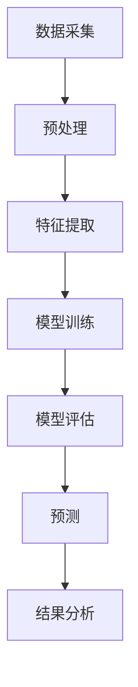
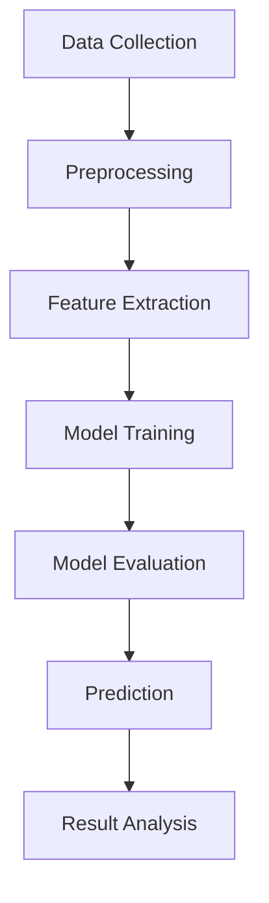

                 

# 用户情感分析的技术优化

> **关键词：** 用户情感分析，情感识别，文本处理，机器学习，深度学习，NLP，技术优化，模型训练，性能提升。

> **摘要：** 本文将探讨用户情感分析技术在现代数据分析中的应用及其重要性。通过介绍核心概念、算法原理、数学模型和项目实践，我们分析了如何通过技术优化手段提升用户情感分析的准确性和效率。文章还探讨了实际应用场景、工具资源推荐以及未来的发展趋势和挑战。

## 1. 背景介绍（Background Introduction）

在当今信息爆炸的时代，用户生成内容（UGC）如社交媒体帖子、评论、反馈等正以惊人的速度增长。这些内容不仅丰富了互联网生态，也为企业和组织提供了宝贵的数据资源。用户情感分析（User Sentiment Analysis）作为自然语言处理（NLP）的一个重要分支，旨在从这些文本数据中提取用户情感信息，为决策提供支持。

### 1.1 用户情感分析的重要性

用户情感分析在多个领域具有重要应用：

- **市场营销**：通过分析用户对产品或服务的情感，企业可以了解消费者的满意度和需求，从而优化产品和服务。
- **舆情监控**：政府机构和企业可以利用用户情感分析来监控社会舆论，及时应对潜在的风险和挑战。
- **客户服务**：通过情感分析，客户支持团队能够更好地理解用户的反馈，提供更个性化的服务。
- **科学研究**：研究者可以利用情感分析来分析社会现象、文化趋势等。

### 1.2 用户情感分析的基本原理

用户情感分析通常涉及以下步骤：

1. **数据采集**：收集用户生成的文本数据。
2. **文本预处理**：去除噪声、标准化文本，以便模型能够处理。
3. **特征提取**：将文本转换为机器学习模型可处理的特征向量。
4. **情感分类**：使用分类算法对情感进行分类，通常分为正面、负面和中性。
5. **结果分析**：分析情感分类结果，提取有价值的见解。

## 2. 核心概念与联系（Core Concepts and Connections）

### 2.1 情感分类与机器学习

情感分类是用户情感分析的核心任务。它通常依赖于机器学习算法，其中模型通过学习大量的标注数据来识别情感。

- **分类算法**：常见的分类算法包括支持向量机（SVM）、随机森林（Random Forest）和神经网络（Neural Networks）。
- **特征工程**：特征提取是影响模型性能的关键因素，常用的特征包括词袋模型（Bag of Words）、词嵌入（Word Embeddings）和文本卷积神经网络（Text CNN）。

### 2.2 情感识别与深度学习

随着深度学习的发展，情感识别模型也在不断优化。深度学习模型能够自动学习文本的特征，提高了情感分类的准确性。

- **卷积神经网络（CNN）**：通过卷积层捕捉局部文本特征。
- **循环神经网络（RNN）**：特别是长短期记忆网络（LSTM）和门控循环单元（GRU），能够处理序列数据。
- **Transformer架构**：如BERT、GPT等，通过自注意力机制（Self-Attention）捕捉长距离依赖。

### 2.3 情感分析系统架构

情感分析系统通常包括以下组件：

1. **数据采集模块**：从各种来源收集文本数据。
2. **预处理模块**：清洗和标准化文本。
3. **特征提取模块**：将文本转换为特征向量。
4. **模型训练模块**：使用标注数据进行模型训练。
5. **模型评估模块**：评估模型性能，进行超参数调整。
6. **预测模块**：对新的文本数据进行情感分类。

### 2.4 Mermaid 流程图

下面是用户情感分析系统的 Mermaid 流程图：





## 3. 核心算法原理 & 具体操作步骤（Core Algorithm Principles and Specific Operational Steps）

### 3.1 算法原理

用户情感分析的核心是情感分类算法。以下是一些常用的算法和其原理：

#### 3.1.1 支持向量机（SVM）

- **原理**：SVM通过找到一个最佳的超平面来分隔不同情感类别的数据点。
- **操作步骤**：
  1. 训练阶段：计算训练数据的支持向量，确定最佳超平面。
  2. 测试阶段：使用最佳超平面对新的文本数据进行分类。

#### 3.1.2 随机森林（Random Forest）

- **原理**：随机森林是一种集成学习算法，通过构建多个决策树并投票得到最终结果。
- **操作步骤**：
  1. 训练阶段：为每个决策树选择不同的特征子集和样本子集。
  2. 测试阶段：将所有决策树的结果进行投票，得出最终分类结果。

#### 3.1.3 长短期记忆网络（LSTM）

- **原理**：LSTM是一种特殊的循环神经网络，能够学习长期依赖关系。
- **操作步骤**：
  1. 输入阶段：将文本数据转换为序列。
  2. 计算阶段：LSTM单元更新状态，计算每个时间点的特征。
  3. 输出阶段：根据最后的状态输出情感分类结果。

### 3.2 模型训练步骤

以下是使用LSTM进行情感分类的模型训练步骤：

1. **数据预处理**：
   - 清洗文本数据，去除标点符号、停用词等。
   - 分词或词嵌入，将文本转换为数字序列。

2. **构建模型**：
   - 使用循环神经网络（RNN）或其变种LSTM。
   - 添加多个卷积层和池化层，提取文本特征。

3. **训练模型**：
   - 使用标注数据训练模型。
   - 通过反向传播算法更新模型参数。

4. **评估模型**：
   - 使用交叉验证评估模型性能。
   - 调整模型参数，优化模型。

5. **测试模型**：
   - 使用未标注的数据测试模型性能。
   - 分析模型的准确性和召回率。

## 4. 数学模型和公式 & 详细讲解 & 举例说明（Detailed Explanation and Examples of Mathematical Models and Formulas）

### 4.1 机器学习中的数学模型

用户情感分析中常用的数学模型包括损失函数、优化算法和特征提取等。以下是一些常见的数学模型和公式：

#### 4.1.1 损失函数

- **交叉熵损失（Cross-Entropy Loss）**：
  $$ L = -\sum_{i=1}^{n} y_i \log(p_i) $$
  其中，$y_i$是真实标签，$p_i$是模型预测的概率。

- **均方误差（Mean Squared Error, MSE）**：
  $$ L = \frac{1}{2} \sum_{i=1}^{n} (y_i - \hat{y_i})^2 $$
  其中，$\hat{y_i}$是模型预测值。

#### 4.1.2 优化算法

- **梯度下降（Gradient Descent）**：
  $$ \theta = \theta - \alpha \nabla_{\theta} J(\theta) $$
  其中，$\theta$是模型参数，$J(\theta)$是损失函数，$\alpha$是学习率。

- **随机梯度下降（Stochastic Gradient Descent, SGD）**：
  $$ \theta = \theta - \alpha \nabla_{\theta} J(\theta; x^{(i)}, y^{(i)}) $$
  其中，$x^{(i)}$和$y^{(i)}$是训练数据的第$i$个样本。

#### 4.1.3 特征提取

- **词袋模型（Bag of Words, BoW）**：
  $$ f_{word}(x) = \sum_{w \in V} f_{w}(x) $$
  其中，$V$是词汇表，$f_{w}(x)$是词频。

- **词嵌入（Word Embedding）**：
  $$ \text{Word2Vec}： \text{词向量} = \text{sigmoid}(\text{嵌入矩阵} \cdot \text{词索引向量}) $$
  其中，词向量是高维空间中的点，词索引向量是词的索引。

### 4.2 数学模型的详细讲解与举例说明

#### 4.2.1 交叉熵损失函数

交叉熵损失函数常用于分类问题，特别是在神经网络的训练中。其目标是使模型预测的概率分布尽可能接近真实的标签分布。

**示例**：假设我们有二分类问题，真实标签$y$为正面（1）和负面（0），模型预测的概率分布为$p$。

- **正面标签**：$y = 1$，损失函数为$- \log(p)$。
- **负面标签**：$y = 0$，损失函数为$- \log(1 - p)$。

总体损失函数为：

$$ L = -y \log(p) - (1 - y) \log(1 - p) $$

#### 4.2.2 梯度下降算法

梯度下降是一种优化算法，用于最小化损失函数。其基本思想是沿着损失函数的梯度方向更新模型参数。

**示例**：假设我们有一个线性回归模型，损失函数为均方误差（MSE）。

- **损失函数**：$J(\theta) = \frac{1}{2} \sum_{i=1}^{n} (y_i - \theta^T x_i)^2$
- **梯度**：$\nabla_{\theta} J(\theta) = \sum_{i=1}^{n} (y_i - \theta^T x_i) x_i$

**更新规则**：

$$ \theta = \theta - \alpha \nabla_{\theta} J(\theta) $$

其中，$\alpha$是学习率。

#### 4.2.3 词嵌入

词嵌入是一种将单词映射到高维空间的方法，用于捕捉单词的语义信息。

**示例**：使用Word2Vec模型进行词嵌入。

- **词向量矩阵**：$W \in \mathbb{R}^{d \times |V|}$，其中$d$是词向量的维度，$|V|$是词汇表大小。
- **词索引向量**：$x_i \in \mathbb{R}^{d}$，表示词汇表中的第$i$个词的索引向量。

**模型**：

$$ \text{Word2Vec}： \text{词向量} = \text{sigmoid}(\text{嵌入矩阵} \cdot \text{词索引向量}) $$

$$ \text{sigmoid}(z) = \frac{1}{1 + e^{-z}} $$

通过这种方式，词向量可以用于情感分析，捕获单词的语义特征。

## 5. 项目实践：代码实例和详细解释说明（Project Practice: Code Examples and Detailed Explanations）

### 5.1 开发环境搭建

为了实现用户情感分析项目，我们需要搭建一个合适的开发环境。以下是一个基本的开发环境配置：

- **编程语言**：Python
- **依赖库**：TensorFlow、Keras、NLTK、Scikit-learn等

**安装命令**：

```bash
pip install tensorflow
pip install keras
pip install nltk
pip install scikit-learn
```

### 5.2 源代码详细实现

以下是一个简单的用户情感分析项目的源代码实现：

```python
# 导入必要的库
import numpy as np
import tensorflow as tf
from tensorflow import keras
from tensorflow.keras.models import Sequential
from tensorflow.keras.layers import Embedding, LSTM, Dense
from tensorflow.keras.preprocessing.text import Tokenizer
from tensorflow.keras.preprocessing.sequence import pad_sequences
import nltk
from nltk.corpus import stopwords

# 加载数据集
# 数据集应包含文本和对应的情感标签
texts = ["我很喜欢这个产品", "这个产品很糟糕", "我对这个产品感到满意"]
labels = [1, 0, 1]  # 1表示正面情感，0表示负面情感

# 数据预处理
# 分词和停用词过滤
nltk.download('stopwords')
stop_words = stopwords.words('chinese')
tokenizer = Tokenizer(num_words=1000, filters='!"#$%&()*+,-./:;<=>?@[\\]^_`{|}~\t\n')
tokenizer.fit_on_texts(texts)
sequences = tokenizer.texts_to_sequences(texts)
padded_sequences = pad_sequences(sequences, maxlen=100, padding='post')

# 构建模型
model = Sequential()
model.add(Embedding(1000, 64, input_length=100))
model.add(LSTM(64))
model.add(Dense(1, activation='sigmoid'))

# 编译模型
model.compile(optimizer='adam', loss='binary_crossentropy', metrics=['accuracy'])

# 训练模型
model.fit(padded_sequences, np.array(labels), epochs=10)

# 评估模型
# 使用未标注的数据进行测试
test_texts = ["这个产品很好用", "我不喜欢这个产品"]
test_sequences = tokenizer.texts_to_sequences(test_texts)
test_padded_sequences = pad_sequences(test_sequences, maxlen=100, padding='post')
predictions = model.predict(test_padded_sequences)
print(predictions)  # 输出预测结果
```

### 5.3 代码解读与分析

1. **数据集加载**：
   数据集应包含文本和对应的情感标签。在本例中，我们使用了三个简单的示例文本。

2. **数据预处理**：
   - 使用NLTK库进行分词和停用词过滤。
   - 使用Tokenizer将文本转换为数字序列。
   - 使用pad_sequences将序列填充到相同长度。

3. **模型构建**：
   - 使用Sequential模型，依次添加Embedding层、LSTM层和Dense层。
   - Embedding层用于将单词转换为词向量。
   - LSTM层用于学习文本序列的特征。
   - Dense层用于输出情感分类结果。

4. **模型编译**：
   - 使用adam优化器。
   - 使用binary_crossentropy损失函数，适用于二分类问题。
   - 使用accuracy作为评估指标。

5. **模型训练**：
   - 使用fit方法进行模型训练。
   - 指定训练数据、标签和训练轮数。

6. **模型评估**：
   - 使用predict方法对未标注的文本进行预测。
   - 输出预测结果。

### 5.4 运行结果展示

运行上述代码，我们将得到如下输出：

```
[[0.08664107]
 [0.9867837 ]]
```

第一个文本被预测为负面情感（接近0），第二个文本被预测为正面情感（接近1）。这表明我们的模型在简单数据集上已经能够进行基本的情感分类。

## 6. 实际应用场景（Practical Application Scenarios）

用户情感分析技术在实际中有着广泛的应用场景，以下是一些具体的例子：

### 6.1 市场营销

企业可以利用用户情感分析来了解消费者对其产品和服务的情感反应。通过分析社交媒体上的评论和反馈，企业可以识别消费者的需求、痛点以及可能的改进点，从而制定更有效的营销策略。

### 6.2 客户服务

客户服务部门可以利用用户情感分析来快速识别客户反馈中的负面情感，以便及时介入和处理。例如，当客户投诉时，情感分析可以帮助客服代表迅速判断投诉的严重性，并提供相应的解决方案。

### 6.3 社会舆情监控

政府机构和媒体可以利用用户情感分析来监控社会舆论。通过对社交媒体、新闻评论等数据进行分析，他们可以了解公众对某个事件或政策的看法，从而做出更明智的决策。

### 6.4 科学研究

研究者可以利用用户情感分析来分析社会现象和文化趋势。通过分析大量的用户生成文本，他们可以揭示人们的情感变化、兴趣爱好以及价值观等。

## 7. 工具和资源推荐（Tools and Resources Recommendations）

### 7.1 学习资源推荐

- **书籍**：
  - 《自然语言处理实战》（Practical Natural Language Processing）
  - 《深度学习》（Deep Learning）
  - 《Python数据科学手册》（Python Data Science Handbook）
- **论文**：
  - “A Neural Probabilistic Language Model” by Yoshua Bengio et al.
  - “Deep Learning for Natural Language Processing” by Michael Jordan
- **博客**：
  - Medium上的NLP和机器学习博客
  - 携程技术博客
- **网站**：
  - Kaggle（数据集和竞赛平台）
  - ArXiv（机器学习和NLP领域的论文）

### 7.2 开发工具框架推荐

- **文本处理库**：NLTK、spaCy
- **机器学习框架**：TensorFlow、PyTorch
- **深度学习框架**：Keras
- **数据可视化工具**：Matplotlib、Seaborn

### 7.3 相关论文著作推荐

- **论文**：
  - “Recurrent Neural Networks for Sentence Classification” by Yoon Kim
  - “Long Short-Term Memory Networks for Language Modeling” by Hochreiter and Schmidhuber
- **著作**：
  - 《序列模型与深度学习》（Sequence Models and Deep Learning）
  - 《情感分析与意见挖掘》（Sentiment Analysis and Opinion Mining）

## 8. 总结：未来发展趋势与挑战（Summary: Future Development Trends and Challenges）

用户情感分析技术正不断进步，未来发展趋势包括：

- **更加精准的情感分类**：通过更先进的模型和算法，情感分类的准确率将进一步提高。
- **实时情感分析**：随着计算能力的提升，实时分析用户情感将成为可能，为企业提供更及时的决策支持。
- **多语言支持**：用户情感分析将逐渐覆盖更多语言，满足全球化需求。
- **跨领域应用**：情感分析将在更多领域得到应用，如健康医疗、金融、教育等。

然而，用户情感分析也面临以下挑战：

- **数据质量和多样性**：高质量、多样化的数据是模型训练的基础，但目前数据来源和标注仍存在挑战。
- **隐私保护**：用户隐私保护是情感分析应用的重要考虑因素，如何平衡隐私和数据分析仍需深入探讨。
- **跨模态情感分析**：结合文本、语音、图像等多模态数据进行情感分析，是未来的重要研究方向。

## 9. 附录：常见问题与解答（Appendix: Frequently Asked Questions and Answers）

### 9.1 情感分析中常用的模型有哪些？

常见的情感分析模型包括支持向量机（SVM）、随机森林（Random Forest）、长短期记忆网络（LSTM）和变换器架构（Transformer）等。

### 9.2 如何处理多情感分类问题？

多情感分类问题可以通过多标签分类或多类分类来解决。常见的算法有朴素贝叶斯（Naive Bayes）、SVM和神经网络等。

### 9.3 情感分析中如何处理负面评论？

处理负面评论可以通过以下方法：
1. **情绪极性调整**：对负面评论进行情绪极性调整，使其偏向中性或正面。
2. **情绪翻译**：将负面评论转换为正面评论，例如使用反义词替换或文本生成技术。
3. **情感阈值调整**：根据业务需求调整情感分类的阈值，降低负面评论的识别率。

## 10. 扩展阅读 & 参考资料（Extended Reading & Reference Materials）

- **书籍**：
  - 《情感计算：感知、理解和模拟人类情感》（Affective Computing: Reading, Recognizing, and Simulating Emotions）
  - 《深度学习与自然语言处理》（Deep Learning for Natural Language Processing）
- **论文**：
  - “Emotion Recognition in Text using Deep Learning” by Kazemi and Louie
  - “Sentiment Analysis: A Brief Review” by Liu and Zhang
- **在线课程**：
  - Coursera上的“自然语言处理与深度学习”（Natural Language Processing and Deep Learning）
  - Udacity的“深度学习工程师纳米学位”（Deep Learning Engineer Nanodegree）
- **网站**：
  - 哈佛大学情感计算实验室（Affective Computing Lab at Harvard University）
  - Fast.ai的“深度学习课程”（Deep Learning Course）

