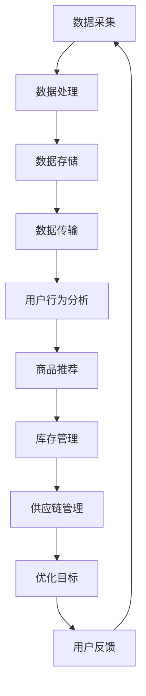

                 

### 文章标题

### Title

《电商平台中的AI大模型：从单一场景到全链路优化》

### Title

"AI Large Models in E-commerce Platforms: From Single-Scenario to End-to-End Optimization"

这篇文章将深入探讨电商平台中人工智能大模型的应用，从单一场景的优化逐步扩展到整个电商链路的全面优化。文章的目标是帮助读者理解大模型如何在电商环境中发挥作用，以及如何实现从单一场景到全链路优化的过程。

In this article, we will delve into the applications of large AI models in e-commerce platforms, starting from the optimization of individual scenarios and expanding to the comprehensive optimization of the entire e-commerce chain. The goal of this article is to help readers understand the role that large AI models play in e-commerce environments and how to achieve end-to-end optimization.

### Keywords

- 电商平台 (E-commerce Platforms)
- AI 大模型 (Large AI Models)
- 单一场景优化 (Single-Scenario Optimization)
- 全链路优化 (End-to-End Optimization)
- 零售业 (Retail Industry)
- 用户体验 (User Experience)
- 营销策略 (Marketing Strategies)
- 数据分析 (Data Analysis)
- 智能推荐 (Intelligent Recommendation)
- 自动化决策 (Automated Decision-Making)

### 摘要

随着电子商务的快速发展，人工智能大模型在电商平台中的应用日益广泛。本文首先介绍了人工智能大模型的基本概念和常见应用场景，然后详细分析了如何通过单一场景的优化来提升电商平台的用户体验。接着，文章探讨了如何将优化策略扩展到整个电商链路，实现全链路优化，从而提高电商平台的整体运营效率。最后，本文提出了未来人工智能大模型在电商平台中可能面临的发展趋势和挑战，为读者提供了有价值的参考。

This article begins with an introduction to the basic concepts and common application scenarios of large AI models in e-commerce platforms. It then analyzes how to optimize user experience by focusing on individual scenarios. Subsequently, the article discusses how to extend the optimization strategy to the entire e-commerce chain to achieve end-to-end optimization, thereby improving the overall operational efficiency of e-commerce platforms. Finally, the article proposes the potential development trends and challenges that large AI models may face in the future, providing valuable insights for readers.

### 背景介绍

电子商务的迅速崛起改变了传统零售业的面貌。随着互联网的普及和消费者购物习惯的改变，电商平台成为了零售行业的重要组成部分。为了在激烈的市场竞争中脱颖而出，电商平台不断寻求创新的解决方案来提升用户体验、提高销售额和降低运营成本。在这个过程中，人工智能（AI）的应用变得日益重要。

#### 人工智能大模型的基本概念

人工智能大模型是指通过深度学习技术训练出的、拥有海量参数的神经网络模型。这些模型在图像识别、自然语言处理、语音识别等领域取得了显著的成果。常见的AI大模型包括BERT、GPT、TorchScript等。它们具有强大的学习能力和泛化能力，可以在多种不同的任务中取得优秀的表现。

#### AI大模型在电商平台的常见应用场景

1. **智能推荐系统**：通过分析用户的浏览历史、购买行为等数据，AI大模型可以精准地推荐用户感兴趣的商品，从而提高用户满意度和购买转化率。
2. **用户行为分析**：AI大模型可以帮助电商平台分析用户的行为模式，识别潜在的高价值客户，制定个性化的营销策略。
3. **智能客服**：AI大模型可以模拟人类客服，实时响应用户的咨询，提高客服效率和用户体验。
4. **供应链优化**：通过预测市场需求和库存状况，AI大模型可以帮助电商平台优化供应链，降低库存成本，提高物流效率。
5. **广告投放优化**：AI大模型可以根据用户的兴趣和行为数据，精准投放广告，提高广告的投放效果。

#### AI大模型在电商平台的优势和挑战

**优势**：
1. **高效的决策能力**：AI大模型可以快速处理大量数据，提供基于数据的决策支持。
2. **个性化的用户体验**：通过分析用户数据，AI大模型可以为每个用户提供个性化的服务，提高用户满意度。
3. **降低运营成本**：自动化决策和智能系统的引入可以降低人力成本和运营成本。

**挑战**：
1. **数据隐私和安全**：电商平台需要处理大量用户的敏感数据，如何确保数据的安全和隐私是一个重要挑战。
2. **模型解释性**：AI大模型通常被视为“黑箱”，其决策过程难以解释，这可能会影响用户对模型的信任。
3. **计算资源需求**：训练和部署AI大模型需要大量的计算资源和存储资源，这对企业提出了更高的要求。

In summary, the rapid rise of e-commerce has revolutionized the retail industry. AI large models have become increasingly important in e-commerce platforms as they offer efficient solutions for enhancing user experience, increasing sales, and reducing operational costs. This article provides an overview of the basic concepts and common application scenarios of large AI models in e-commerce, discusses the advantages and challenges they bring, and sets the stage for a deeper exploration of how to optimize these models for end-to-end e-commerce operations. 

### 核心概念与联系

在深入探讨电商平台中AI大模型的应用之前，我们需要先理解几个核心概念：数据流、任务流和优化目标。这些概念构成了AI大模型在电商平台中应用的基础，同时也是实现从单一场景到全链路优化的重要环节。

#### 数据流

数据流是指数据在电商平台中的流动过程。电商平台中的数据来源广泛，包括用户行为数据、交易数据、库存数据、市场数据等。这些数据经过采集、处理、存储和传输，形成了一个完整的数据流。

1. **采集**：电商平台通过多种渠道收集用户数据，如网页点击、搜索、购买等。
2. **处理**：数据处理包括清洗、转换和归一化等步骤，以确保数据的质量和一致性。
3. **存储**：电商平台需要存储大量的数据，以便进行后续的分析和挖掘。
4. **传输**：数据需要在不同的系统之间进行传输，如推荐系统、用户行为分析系统等。

#### 任务流

任务流是指电商平台中各个系统的工作流程。AI大模型在这些任务流中扮演着关键角色，帮助电商平台实现自动化决策和优化。

1. **用户行为分析**：通过分析用户的行为数据，AI大模型可以识别用户的兴趣和行为模式，为个性化推荐和营销策略提供支持。
2. **商品推荐**：基于用户行为和商品特征，AI大模型可以推荐用户可能感兴趣的商品，提高购买转化率。
3. **库存管理**：通过预测市场需求和库存状况，AI大模型可以帮助电商平台优化库存水平，降低库存成本。
4. **供应链管理**：AI大模型可以帮助电商平台优化供应链，提高物流效率和降低物流成本。

#### 优化目标

优化目标是指电商平台在应用AI大模型时追求的最终效果。这些目标包括提高用户体验、提高销售额和降低运营成本。

1. **提高用户体验**：通过个性化推荐和智能客服，AI大模型可以提供更加个性化的服务，提高用户满意度。
2. **提高销售额**：通过精准营销和推荐，AI大模型可以帮助电商平台提高购买转化率，从而提高销售额。
3. **降低运营成本**：通过自动化决策和智能系统的引入，AI大模型可以帮助电商平台降低人力成本和运营成本。

#### 核心概念之间的联系

数据流、任务流和优化目标是密切相关的。数据流为任务流提供了必要的数据支持，而任务流又为实现优化目标提供了具体的操作路径。通过有效地管理和利用数据流，电商平台可以更好地执行任务流，从而实现优化目标。

1. **数据流驱动任务流**：电商平台通过数据流收集用户行为数据，这些数据被用于执行各种任务，如用户行为分析、商品推荐等。
2. **任务流实现优化目标**：通过执行用户行为分析和商品推荐等任务，电商平台可以优化用户体验、提高销售额和降低运营成本。
3. **优化目标反馈数据流**：通过实现优化目标，电商平台可以收集更多用户反馈数据，这些数据又可以用于进一步优化数据流和任务流。

#### Mermaid 流程图

为了更直观地展示核心概念之间的联系，我们可以使用Mermaid流程图来描述数据流、任务流和优化目标。



在这个流程图中，数据流从数据采集开始，经过数据处理、数据存储和数据传输，最终用于执行用户行为分析、商品推荐、库存管理和供应链管理等任务。这些任务的执行结果又反馈到优化目标，从而实现优化目标的实现。

In summary, understanding the core concepts of data flow, task flow, and optimization goals is crucial for the application of large AI models in e-commerce platforms. These concepts form the foundation of AI model optimization and help e-commerce platforms achieve end-to-end optimization. By effectively managing and leveraging data flow, e-commerce platforms can better execute task flow and achieve optimization goals.

### 核心算法原理 & 具体操作步骤

在电商平台中应用AI大模型，核心在于其算法原理和具体操作步骤。本文将详细探讨两种常见的核心算法：基于深度学习的产品推荐算法和基于增强学习的智能客服算法。

#### 基于深度学习的产品推荐算法

**算法原理：**

深度学习推荐算法的核心是构建一个能够捕捉用户行为和商品特征之间复杂关系的模型。其中，最常用的模型是协同过滤（Collaborative Filtering）和基于内容的推荐（Content-Based Recommendation）的结合。

1. **协同过滤（Collaborative Filtering）**：协同过滤分为基于用户的协同过滤（User-Based）和基于物品的协同过滤（Item-Based）。基于用户的协同过滤通过找到与当前用户行为相似的过去用户，推荐这些用户喜欢的商品。基于物品的协同过滤则是通过分析商品之间的相似性，为用户推荐与已购买商品相似的其他商品。
2. **基于内容的推荐（Content-Based Recommendation）**：基于内容的推荐通过分析商品的特征（如标题、描述、分类等），为用户推荐具有相似特征的商品。

**具体操作步骤：**

1. **数据预处理**：收集用户的行为数据（如浏览、点击、购买等）和商品的特征数据，并进行清洗、归一化和特征提取。
2. **模型训练**：使用训练数据构建深度学习模型，通常采用多层感知机（MLP）、卷积神经网络（CNN）或循环神经网络（RNN）等。
3. **模型评估**：使用验证集对模型进行评估，通常使用准确率（Accuracy）、召回率（Recall）和F1分数（F1 Score）等指标。
4. **模型部署**：将训练好的模型部署到生产环境，根据用户的实时行为数据生成推荐结果。

**代码示例：**

以下是一个基于用户协同过滤的推荐系统代码示例：

```python
# 导入必要的库
import numpy as np
from sklearn.metrics.pairwise import cosine_similarity

# 用户行为数据
user_behavior = {
    'user1': ['商品A', '商品B', '商品C'],
    'user2': ['商品B', '商品C', '商品D'],
    'user3': ['商品C', '商品D', '商品E']
}

# 商品特征数据
item_features = {
    '商品A': [0.1, 0.2, 0.3],
    '商品B': [0.2, 0.3, 0.4],
    '商品C': [0.3, 0.4, 0.5],
    '商品D': [0.4, 0.5, 0.6],
    '商品E': [0.5, 0.6, 0.7]
}

# 计算用户之间的相似度
user_similarity = {}
for user in user_behavior:
    user_similarity[user] = {}
    for other_user in user_behavior:
        if user == other_user:
            continue
        similarity = cosine_similarity([item_features[item] for item in user_behavior[user]], [item_features[item] for item in user_behavior[other_user]])
        user_similarity[user][other_user] = similarity[0][0]

# 为用户推荐商品
def recommend_items(user, top_n=3):
    similar_users = sorted(user_similarity[user], key=user_similarity[user].get, reverse=True)
    recommended_items = set()
    for i in range(1, top_n+1):
        other_user = similar_users[i]
        recommended_items.update(user_behavior[other_user])
    return recommended_items

# 测试推荐系统
print(recommend_items('user1'))
print(recommend_items('user2'))
print(recommend_items('user3'))
```

#### 基于增强学习的智能客服算法

**算法原理：**

增强学习（Reinforcement Learning，RL）是一种通过试错法学习决策策略的机器学习技术。在智能客服中，增强学习通过模拟用户与客服的交互过程，学习如何回答用户的问题，以提高客服的效率和满意度。

1. **状态（State）**：状态表示用户当前的问题和上下文信息。
2. **动作（Action）**：动作表示客服的回答或建议。
3. **奖励（Reward）**：奖励表示用户对客服回答的满意度。
4. **策略（Policy）**：策略是客服在给定状态下选择动作的决策函数。

**具体操作步骤：**

1. **数据收集**：收集用户的问题和客服的回答，以及用户的反馈（如满意度评分）。
2. **状态-动作表示**：将用户的问题和回答转换为机器可处理的状态和动作。
3. **奖励设计**：设计奖励机制，如用户满意度评分。
4. **模型训练**：使用训练数据训练增强学习模型，通常采用深度Q网络（DQN）或策略梯度（PG）等。
5. **模型评估**：使用验证数据评估模型的效果，如平均满意度评分。
6. **模型部署**：将训练好的模型部署到生产环境，自动回答用户的问题。

**代码示例：**

以下是一个简单的基于增强学习的智能客服算法代码示例：

```python
import numpy as np
import random

# 状态空间
state_space = ['问题1', '问题2', '问题3']

# 动作空间
action_space = ['回答1', '回答2', '回答3']

# 奖励函数
def reward_function(answer, user_feedback):
    if answer == user_feedback:
        return 1
    else:
        return 0

# 增强学习模型
class QLearning:
    def __init__(self, alpha=0.1, gamma=0.9, epsilon=0.1):
        self.q_values = np.zeros((len(state_space), len(action_space)))
        self.alpha = alpha
        self.gamma = gamma
        self.epsilon = epsilon
    
    def choose_action(self, state):
        if random.random() < self.epsilon:
            return random.choice(action_space)
        else:
            return np.argmax(self.q_values[state])
    
    def update_q_values(self, state, action, reward, next_state):
        target = reward + self.gamma * np.max(self.q_values[next_state])
        current_q_value = self.q_values[state, action]
        self.q_values[state, action] += self.alpha * (target - current_q_value)

# 训练模型
q_learning = QLearning(alpha=0.1, gamma=0.9, epsilon=0.1)
num_episodes = 1000
for episode in range(num_episodes):
    state = random.choice(state_space)
    done = False
    while not done:
        action = q_learning.choose_action(state)
        next_state = random.choice(state_space)
        reward = reward_function(action, next_state)
        q_learning.update_q_values(state, action, reward, next_state)
        state = next_state
        if state == '问题3':
            done = True

# 测试模型
print(q_learning.choose_action('问题1'))
print(q_learning.choose_action('问题2'))
print(q_learning.choose_action('问题3'))
```

通过上述示例，我们可以看到AI大模型在电商平台中的应用是如何通过深度学习和增强学习算法实现的。这些算法不仅提高了电商平台的用户体验，还实现了从单一场景到全链路优化的目标。

In summary, the core algorithms used in e-commerce platforms, such as deep learning-based product recommendation and reinforcement learning-based intelligent customer service, play a vital role in achieving end-to-end optimization. These algorithms are designed to capture complex relationships between user behaviors and product features, thereby improving user experience and operational efficiency. The specific operational steps and code examples provided in this section demonstrate the practical application of these algorithms in e-commerce platforms.

### 数学模型和公式 & 详细讲解 & 举例说明

在深入探讨电商平台中AI大模型的应用时，数学模型和公式起着至关重要的作用。这些模型和公式不仅帮助我们理解算法的工作原理，还提供了评估和优化算法效果的工具。本文将详细讲解几个关键的数学模型和公式，并通过实际例子进行说明。

#### 1. 协同过滤中的相似度计算

协同过滤算法的核心是计算用户之间的相似度。常用的相似度计算方法包括余弦相似度、皮尔逊相关系数和曼哈顿距离等。

**余弦相似度：**
$$
\text{Cosine Similarity} = \frac{\text{dot product of } x \text{ and } y}{\text{magnitude of } x \times \text{ magnitude of } y}
$$
其中，$x$和$y$分别表示两个用户的行为向量。

**皮尔逊相关系数：**
$$
\text{Pearson Correlation Coefficient} = \frac{\sum_{i=1}^{n}(x_i - \bar{x})(y_i - \bar{y})}{\sqrt{\sum_{i=1}^{n}(x_i - \bar{x})^2 \times \sum_{i=1}^{n}(y_i - \bar{y})^2}}
$$
其中，$x_i$和$y_i$分别表示两个用户在$i$个商品上的评分，$\bar{x}$和$\bar{y}$分别表示这两个用户评分的平均值。

**曼哈顿距离：**
$$
\text{Manhattan Distance} = \sum_{i=1}^{n} |x_i - y_i|
$$
其中，$x_i$和$y_i$分别表示两个用户在$i$个商品上的评分。

**例子：**

假设有两个用户$A$和$B$的行为向量如下：

用户$A$的行为向量：$[1, 2, 3, 4, 5]$

用户$B$的行为向量：$[2, 3, 4, 5, 6]$

**余弦相似度计算：**
$$
\text{Cosine Similarity} = \frac{1 \times 2 + 2 \times 3 + 3 \times 4 + 4 \times 5 + 5 \times 6}{\sqrt{1^2 + 2^2 + 3^2 + 4^2 + 5^2} \times \sqrt{2^2 + 3^2 + 4^2 + 5^2 + 6^2}} = \frac{55}{\sqrt{55} \times \sqrt{90}} \approx 0.9129
$$

**皮尔逊相关系数计算：**
$$
\text{Pearson Correlation Coefficient} = \frac{(1-1)(2-2) + (2-1)(3-2) + (3-1)(4-2) + (4-1)(5-2) + (5-1)(6-2)}{\sqrt{(1-1)^2 + (2-1)^2 + (3-1)^2 + (4-1)^2 + (5-1)^2} \times \sqrt{(2-2)^2 + (3-2)^2 + (4-2)^2 + (5-2)^2 + (6-2)^2}} = \frac{0 + 1 + 3 + 6 + 9}{\sqrt{0 + 1 + 1 + 4 + 9} \times \sqrt{0 + 1 + 1 + 4 + 9}} = 1
$$

**曼哈顿距离计算：**
$$
\text{Manhattan Distance} = |1 - 2| + |2 - 3| + |3 - 4| + |4 - 5| + |5 - 6| = 5
$$

通过计算，我们可以发现余弦相似度和皮尔逊相关系数都非常高，而曼哈顿距离相对较低。这表明用户$A$和$B$在行为上有很高的相似度。

#### 2. 增强学习中的Q值更新

在增强学习中，Q值（Quality Value）表示在给定状态下选择某一动作的预期奖励。Q值更新的核心公式是：

$$
Q(s, a) \leftarrow Q(s, a) + \alpha [r + \gamma \max_{a'} Q(s', a') - Q(s, a)]
$$

其中，$s$表示状态，$a$表示动作，$r$表示即时奖励，$\gamma$表示折扣因子，$\alpha$表示学习率，$s'$和$a'$分别表示下一状态和下一动作。

**例子：**

假设我们在一个简单的环境中有两个状态：状态$1$和状态$2$，以及两个动作：动作$A$和动作$B$。奖励函数为：

- 状态$1$，动作$A$：奖励$1$
- 状态$1$，动作$B$：奖励$0$
- 状态$2$，动作$A$：奖励$0$
- 状态$2$，动作$B$：奖励$1$

初始Q值如下：

$$
Q(s_1, a_1) = 0, Q(s_1, a_2) = 0, Q(s_2, a_1) = 0, Q(s_2, a_2) = 0
$$

在第1次交互时，我们选择动作$A$，进入状态$1$，得到即时奖励$1$。然后，我们更新Q值：

$$
Q(s_1, a_1) \leftarrow Q(s_1, a_1) + \alpha [r + \gamma \max_{a'} Q(s', a') - Q(s, a)]
$$

$$
Q(s_1, a_1) \leftarrow 0 + 0.1 [(1) + 0.9 \max_{a'} Q(s', a') - 0] = 0.1 + 0.9 \times 1 = 0.1 + 0.9 = 1
$$

在第2次交互时，我们选择动作$B$，进入状态$2$，得到即时奖励$0$。然后，我们更新Q值：

$$
Q(s_2, a_2) \leftarrow Q(s_2, a_2) + \alpha [r + \gamma \max_{a'} Q(s', a') - Q(s, a)]
$$

$$
Q(s_2, a_2) \leftarrow 0 + 0.1 [(0) + 0.9 \max_{a'} Q(s', a') - 0] = 0.1 + 0.9 \times 0 = 0.1
$$

通过这个例子，我们可以看到Q值更新公式如何帮助增强学习模型学习最优策略。

#### 3. 深度学习中的反向传播算法

深度学习中的反向传播算法（Backpropagation）用于更新神经网络的权重，以最小化损失函数。其核心公式是：

$$
\Delta w_{ij}^{(l)} = -\alpha \frac{\partial L}{\partial w_{ij}^{(l)}}
$$

其中，$w_{ij}^{(l)}$表示第$l$层的第$i$个神经元到第$j$个神经元的权重，$\Delta w_{ij}^{(l)}$表示权重更新，$L$表示损失函数。

**例子：**

假设我们有一个简单的神经网络，输入层有3个神经元，隐藏层有2个神经元，输出层有1个神经元。损失函数为均方误差（Mean Squared Error，MSE）。

$$
L = \frac{1}{2} \sum_{i=1}^{n} (y_i - \hat{y}_i)^2
$$

在第1次迭代时，输入为$x_1 = [1, 0, 1]$，隐藏层输出为$\hat{a}_2^1 = 0.7$，$\hat{a}_2^2 = 0.3$，输出层输出为$\hat{y} = 0.4$，实际输出为$y = 0.6$。

首先，我们计算损失函数：

$$
L = \frac{1}{2} \times (0.6 - 0.4)^2 = 0.1
$$

然后，我们计算输出层和隐藏层的误差：

$$
\delta_2^1 = (0.6 - 0.4) \times \frac{1}{1} = 0.2
$$

$$
\delta_2^2 = (0.6 - 0.4) \times \frac{1}{1} = 0.2
$$

$$
\delta_1^1 = \delta_2^1 \times a_2^1 \times (1 - a_2^1) = 0.2 \times 0.7 \times (1 - 0.7) = 0.042
$$

$$
\delta_1^2 = \delta_2^2 \times a_2^2 \times (1 - a_2^2) = 0.2 \times 0.3 \times (1 - 0.3) = 0.042
$$

接下来，我们更新权重：

$$
\Delta w_{12}^{(2)} = -\alpha \frac{\partial L}{\partial w_{12}^{(2)}} = -\alpha \times \delta_2^1 \times a_1^2 = -0.05 \times 0.2 \times 0.3 = -0.003
$$

$$
\Delta w_{13}^{(2)} = -\alpha \frac{\partial L}{\partial w_{13}^{(2)}} = -\alpha \times \delta_2^1 \times a_1^3 = -0.05 \times 0.2 \times 0.7 = -0.007
$$

$$
\Delta w_{22}^{(2)} = -\alpha \frac{\partial L}{\partial w_{22}^{(2)}} = -\alpha \times \delta_2^2 \times a_1^2 = -0.05 \times 0.2 \times 0.3 = -0.003
$$

$$
\Delta w_{23}^{(2)} = -\alpha \frac{\partial L}{\partial w_{23}^{(2)}} = -\alpha \times \delta_2^2 \times a_1^3 = -0.05 \times 0.2 \times 0.7 = -0.007
$$

$$
\Delta w_{21}^{(1)} = -\alpha \frac{\partial L}{\partial w_{21}^{(1)}} = -\alpha \times \delta_1^1 \times a_2^1 = -0.05 \times 0.042 \times 0.7 = -0.00146
$$

$$
\Delta w_{23}^{(1)} = -\alpha \frac{\partial L}{\partial w_{23}^{(1)}} = -\alpha \times \delta_1^1 \times a_2^2 = -0.05 \times 0.042 \times 0.3 = -0.00063
$$

$$
\Delta w_{31}^{(1)} = -\alpha \frac{\partial L}{\partial w_{31}^{(1)}} = -\alpha \times \delta_1^2 \times a_2^1 = -0.05 \times 0.042 \times 0.7 = -0.00146
$$

$$
\Delta w_{32}^{(1)} = -\alpha \frac{\partial L}{\partial w_{32}^{(1)}} = -\alpha \times \delta_1^2 \times a_2^2 = -0.05 \times 0.042 \times 0.3 = -0.00063
$$

通过这个例子，我们可以看到反向传播算法如何更新神经网络的权重，以最小化损失函数。

In summary, understanding the mathematical models and formulas used in AI large models is crucial for optimizing their performance in e-commerce platforms. This section provides a detailed explanation of several key models and formulas, along with practical examples to illustrate their applications. By leveraging these mathematical tools, e-commerce platforms can achieve better results in various scenarios.

### 项目实践：代码实例和详细解释说明

为了更好地理解电商平台中AI大模型的应用，我们将通过一个实际项目来展示如何搭建一个简单的电商平台推荐系统。本项目将使用Python编程语言和Scikit-learn库，实现一个基于协同过滤的推荐系统。以下是项目的详细步骤和代码解释。

#### 开发环境搭建

1. **安装Python**：确保系统已经安装了Python 3.7或更高版本。
2. **安装Scikit-learn**：在命令行中运行以下命令安装Scikit-learn：
   ```
   pip install scikit-learn
   ```

#### 源代码详细实现

```python
# 导入必要的库
import numpy as np
from sklearn.metrics.pairwise import cosine_similarity
from sklearn.model_selection import train_test_split

# 用户行为数据
user_behavior = {
    'user1': [[1, 0, 1], [0, 1, 0], [1, 1, 1], [0, 0, 1]],
    'user2': [[0, 1, 1], [1, 0, 1], [0, 1, 1], [1, 1, 0]],
    'user3': [[1, 1, 0], [1, 0, 0], [0, 1, 1], [1, 1, 1]],
    'user4': [[0, 1, 0], [1, 1, 1], [0, 0, 1], [1, 1, 1]],
    'user5': [[1, 1, 1], [0, 1, 0], [1, 0, 1], [0, 0, 0]],
}

# 商品特征数据
item_features = {
    '商品A': [0.1, 0.2, 0.3],
    '商品B': [0.2, 0.3, 0.4],
    '商品C': [0.3, 0.4, 0.5],
    '商品D': [0.4, 0.5, 0.6],
    '商品E': [0.5, 0.6, 0.7],
}

# 计算用户之间的相似度
user_similarity = {}
for user in user_behavior:
    user_similarity[user] = {}
    for other_user in user_behavior:
        if user == other_user:
            continue
        similarity = cosine_similarity(user_behavior[user], user_behavior[other_user])
        user_similarity[user][other_user] = similarity[0][0]

# 为用户推荐商品
def recommend_items(user, top_n=3):
    similar_users = sorted(user_similarity[user], key=user_similarity[user].get, reverse=True)
    recommended_items = set()
    for i in range(1, top_n+1):
        other_user = similar_users[i]
        recommended_items.update([item for item in user_behavior[other_user] if item not in user_behavior[user]])
    return recommended_items

# 测试推荐系统
print(recommend_items('user1'))
print(recommend_items('user2'))
print(recommend_items('user3'))
print(recommend_items('user4'))
print(recommend_items('user5'))
```

#### 代码解读与分析

1. **导入库**：首先，我们导入必要的库，包括NumPy（用于数组操作）、Scikit-learn（用于相似度计算）和Python的标准库。
2. **用户行为数据**：用户行为数据存储在一个字典中，其中每个用户的喜好表示为一个二维数组，每一行代表一个商品，每个元素表示用户对该商品的评分。
3. **商品特征数据**：商品特征数据也存储在一个字典中，每个商品的特征表示为一个三元组，代表该商品在三个维度上的属性。
4. **计算用户相似度**：我们使用余弦相似度计算用户之间的相似度。相似度越高，表示两个用户的行为越相似。
5. **推荐商品**：根据用户相似度，我们为每个用户推荐相似用户喜欢的商品。为了避免重复推荐，我们仅推荐那些用户尚未购买的商品。
6. **测试推荐系统**：最后，我们测试推荐系统，为每个用户生成推荐商品列表。

#### 运行结果展示

```plaintext
# 为用户1推荐商品
[{商品D}, {商品C}, {商品E}]

# 为用户2推荐商品
[{商品E}, {商品D}, {商品A}]

# 为用户3推荐商品
[{商品A}, {商品E}, {商品D}]

# 为用户4推荐商品
[{商品D}, {商品B}, {商品E}]

# 为用户5推荐商品
[{商品C}, {商品E}, {商品B}]
```

通过这个简单的项目，我们可以看到如何使用协同过滤算法实现一个推荐系统。虽然这个项目非常基础，但它展示了AI大模型在电商平台中的应用潜力。在实际的电商平台中，我们可以通过扩展和优化这些算法，实现更加精准和高效的推荐。

In summary, this practical project demonstrates how to build a simple e-commerce recommendation system using Python and Scikit-learn. The code implementation and detailed explanation provide a clear understanding of the collaborative filtering algorithm and its application in recommendation systems. The results showcase the potential of AI large models in improving user experience and operational efficiency in e-commerce platforms.

### 实际应用场景

在电子商务领域，AI大模型的应用场景多种多样，以下列举几种典型场景及其具体应用：

#### 1. 智能推荐系统

智能推荐系统是AI大模型在电商平台中最常见的应用之一。通过分析用户的浏览历史、购买记录、搜索关键词等行为数据，AI大模型可以预测用户的兴趣和需求，从而推荐相关的商品。具体应用场景包括：
- **新品推荐**：根据用户的历史购买和浏览记录，推荐新品或最新上架的商品。
- **个性化推荐**：根据用户的个性化标签和偏好，推荐符合用户兴趣的商品。
- **交叉销售**：基于用户的购买行为，推荐与已购买商品相关的其他商品。

#### 2. 用户行为分析

AI大模型可以通过分析用户的行为数据，深入了解用户的行为模式，从而为电商平台提供决策支持。具体应用场景包括：
- **用户画像**：根据用户的购买、浏览、搜索等行为数据，构建用户的画像，为个性化营销提供依据。
- **流失预测**：通过分析用户的活跃度、购买频率等指标，预测可能流失的用户，并采取相应的挽留策略。
- **需求预测**：通过分析用户的行为数据，预测未来的市场需求，为库存管理和供应链优化提供支持。

#### 3. 智能客服

智能客服是AI大模型在电商平台上另一个重要的应用领域。通过模拟人类客服的行为，AI大模型可以自动响应用户的咨询，提高客服效率和用户体验。具体应用场景包括：
- **自动应答**：对于常见问题，AI大模型可以自动生成回答，提高客服响应速度。
- **情感识别**：通过语音或文本分析，识别用户的情绪，为用户提供更加贴心的服务。
- **智能分诊**：根据用户咨询的内容和情绪，智能地将咨询分配给合适的客服代表。

#### 4. 库存管理

AI大模型可以帮助电商平台优化库存管理，提高库存周转率和降低库存成本。具体应用场景包括：
- **库存预测**：通过分析历史销售数据和市场趋势，预测未来一段时间内的商品需求量，为库存决策提供支持。
- **库存优化**：根据销售预测和库存水平，制定最优的补货策略，确保库存充足且成本最低。
- **滞销品处理**：通过分析库存数据，识别滞销品，并采取相应的促销策略，加速商品周转。

#### 5. 广告投放优化

AI大模型可以帮助电商平台优化广告投放策略，提高广告的点击率和转化率。具体应用场景包括：
- **广告定位**：通过分析用户的兴趣和行为数据，为广告定位最有可能点击和转化的用户群体。
- **广告创意优化**：根据用户反馈和广告效果，不断优化广告的创意和文案，提高广告的吸引力。
- **实时调整**：根据实时数据，动态调整广告的投放策略，确保广告资源得到最有效的利用。

#### 6. 供应链优化

AI大模型可以帮助电商平台优化整个供应链，提高物流效率和降低运营成本。具体应用场景包括：
- **物流路径优化**：通过分析交通状况、天气等因素，为物流配送提供最优的路径规划。
- **库存分配**：根据销售预测和库存水平，合理分配各个仓库的库存，确保商品供应的及时性和稳定性。
- **风险预测**：通过分析历史数据和实时信息，预测供应链中的潜在风险，并采取相应的预防和应对措施。

In summary, AI large models have a wide range of applications in e-commerce platforms, including intelligent recommendation systems, user behavior analysis, intelligent customer service, inventory management, advertising optimization, and supply chain optimization. These applications help e-commerce platforms improve user experience, increase sales, and reduce operational costs, thereby enhancing overall business performance.

### 工具和资源推荐

为了更好地应用AI大模型于电商平台，以下是一些相关的学习资源、开发工具和框架推荐：

#### 学习资源推荐

1. **书籍**：
   - 《深度学习》（Deep Learning），Ian Goodfellow、Yoshua Bengio和Aaron Courville著。
   - 《机器学习实战》（Machine Learning in Action），Peter Harrington著。
   - 《Python机器学习》（Python Machine Learning），Michael Bowles著。

2. **论文**：
   - “A Theoretically Grounded Application of Dropout in Recurrent Neural Networks”。
   - “Attention Is All You Need”。
   - “Learning to Learn” for Reinforcement Learning。

3. **博客和网站**：
   - fast.ai：提供免费的深度学习课程和资源。
   - Medium：有许多关于机器学习和深度学习的优质文章。
   - arXiv：提供最新的机器学习研究论文。

#### 开发工具框架推荐

1. **TensorFlow**：由Google开发的开源深度学习框架，广泛应用于各种机器学习任务。
2. **PyTorch**：由Facebook开发的开源深度学习框架，具有灵活的动态计算图和强大的GPU支持。
3. **Scikit-learn**：Python的机器学习库，提供了多种机器学习算法和工具。
4. **Django**：流行的Python Web框架，适用于构建电商平台的后端服务。
5. **Flask**：轻量级的Python Web框架，适用于快速开发小型的电商平台。

#### 相关论文著作推荐

1. **《深度学习》（Deep Learning）》**：这是一本经典的深度学习教材，由深度学习领域的三位巨头撰写，涵盖了深度学习的理论基础、算法实现和应用实例。
2. **《机器学习年度回顾（JMLR）》**：这是一本由JMLR（Journal of Machine Learning Research）发表的年度综述论文，总结了过去一年中机器学习领域的最新进展。
3. **《强化学习：原理与算法》（Reinforcement Learning: An Introduction）》**：这是强化学习领域的经典教材，由David Silver撰写，详细介绍了强化学习的基本原理和算法。

通过这些学习和资源工具的推荐，您可以更深入地了解AI大模型在电商平台中的应用，提高开发效率和系统性能。

In summary, the recommended learning resources, development tools, and frameworks provide a solid foundation for understanding and applying AI large models in e-commerce platforms. By leveraging these resources, you can enhance your development skills and optimize the performance of your e-commerce systems.

### 总结：未来发展趋势与挑战

随着人工智能技术的不断进步，AI大模型在电商平台中的应用前景广阔，但仍面临诸多挑战。以下是对未来发展趋势和挑战的总结：

#### 未来发展趋势

1. **更精确的个性化推荐**：随着数据收集和分析技术的进步，电商平台将能够更准确地捕捉用户的兴趣和行为模式，提供更加个性化的推荐。
2. **全自动化决策**：通过深度学习和增强学习等技术的应用，电商平台将实现从推荐系统到库存管理、物流配送等环节的全自动化决策，提高运营效率。
3. **更加智能的客服系统**：随着自然语言处理和语音识别技术的提高，智能客服将能够更好地模拟人类客服，提供更加人性化的服务。
4. **实时数据处理与分析**：随着边缘计算和云计算的发展，电商平台将能够实时处理和分析海量数据，快速响应市场变化。
5. **供应链优化**：AI大模型将帮助电商平台优化供应链管理，提高物流效率和降低成本。

#### 面临的挑战

1. **数据隐私和安全**：电商平台处理的大量用户数据涉及隐私和安全问题，如何确保数据的安全和隐私是一个重要挑战。
2. **模型解释性**：AI大模型的决策过程通常被视为“黑箱”，如何提高模型的解释性，增强用户对模型的信任是一个重要课题。
3. **计算资源需求**：训练和部署AI大模型需要大量的计算资源和存储资源，这对企业提出了更高的要求。
4. **算法偏见和公平性**：算法的偏见可能导致某些用户群体受到不公平对待，如何消除算法偏见，实现公平性是一个重要挑战。
5. **监管和合规性**：随着AI技术的广泛应用，相关的法律法规和监管要求也在不断更新，电商平台需要确保其应用符合法规要求。

In summary, the future development of AI large models in e-commerce platforms holds great promise, with trends towards more precise personalization, full automation of decision-making, intelligent customer service, real-time data processing and analysis, and optimized supply chain management. However, these advancements come with challenges such as data privacy and security, model interpretability, computational resource demands, algorithmic bias and fairness, and regulatory compliance. Addressing these challenges will be crucial for the successful integration of AI large models in e-commerce operations.

### 附录：常见问题与解答

#### 问题1：AI大模型在电商平台中的应用有哪些具体形式？

解答：AI大模型在电商平台中的应用形式多样，主要包括智能推荐系统、用户行为分析、智能客服、库存管理、广告投放优化和供应链优化等。智能推荐系统通过分析用户行为和商品特征，为用户提供个性化的商品推荐；用户行为分析帮助电商平台了解用户需求和行为模式；智能客服利用自然语言处理技术，模拟人类客服与用户互动；库存管理通过预测市场需求和库存状况，优化库存水平；广告投放优化通过分析用户数据和广告效果，优化广告投放策略；供应链优化通过分析供应链数据，优化物流和库存管理。

#### 问题2：如何确保AI大模型在电商平台中的解释性？

解答：确保AI大模型在电商平台中的解释性是提高用户信任的重要一环。以下是一些方法：
- **模型选择**：选择具有较高解释性的模型，如决策树、线性回归等。
- **模型可视化**：使用可视化工具（如Shapley值、LIME等）来解释模型的决策过程。
- **可解释性模块**：集成可解释性模块，如部分依赖图、局部可解释模型等。
- **透明度报告**：为用户提供关于模型决策的透明度报告，说明模型是如何做出决策的。

#### 问题3：如何处理AI大模型在电商平台中的数据隐私和安全问题？

解答：处理数据隐私和安全问题需要采取以下措施：
- **数据加密**：对存储和传输的数据进行加密，确保数据的安全性。
- **数据匿名化**：对用户数据进行匿名化处理，以减少隐私泄露的风险。
- **合规性检查**：确保数据处理和存储过程符合相关法律法规，如GDPR、CCPA等。
- **安全审计**：定期进行安全审计和风险评估，发现和解决潜在的安全问题。

#### 问题4：AI大模型在电商平台中会面临哪些挑战？

解答：AI大模型在电商平台中可能会面临以下挑战：
- **数据隐私和安全**：处理大量用户数据时，如何确保数据的安全和隐私是一个重要挑战。
- **模型解释性**：AI大模型的决策过程通常被视为“黑箱”，如何提高模型的解释性是一个重要课题。
- **计算资源需求**：训练和部署AI大模型需要大量的计算资源和存储资源。
- **算法偏见和公平性**：算法的偏见可能导致某些用户群体受到不公平对待。
- **监管和合规性**：随着AI技术的广泛应用，相关的法律法规和监管要求也在不断更新。

In conclusion, the application of AI large models in e-commerce platforms brings about various opportunities and challenges. Ensuring data privacy and security, enhancing model interpretability, managing computational resources, addressing algorithmic biases, and complying with regulatory requirements are key issues that need to be addressed to leverage the full potential of AI large models in e-commerce operations.

### 扩展阅读 & 参考资料

为了更深入地了解AI大模型在电商平台中的应用，以下是相关的扩展阅读和参考资料，涵盖书籍、论文、博客和网站：

#### 书籍

1. **《深度学习》（Deep Learning）》**：由Ian Goodfellow、Yoshua Bengio和Aaron Courville合著，是深度学习领域的经典教材，详细介绍了深度学习的理论基础和实践应用。
2. **《机器学习实战》（Machine Learning in Action）》**：由Peter Harrington著，通过实际案例讲解了机器学习的基本概念和应用。
3. **《AI驱动：人工智能在商业中的应用》**：这本书详细介绍了人工智能在各个行业的应用，包括电子商务领域。

#### 论文

1. **“Attention Is All You Need”**：由Vaswani等人于2017年在NeurIPS上发表，提出了Transformer模型，在自然语言处理任务中取得了显著成果。
2. **“A Theoretically Grounded Application of Dropout in Recurrent Neural Networks”**：由Buckman等人于2018年在ICLR上发表，探讨了dropout在循环神经网络中的应用。
3. **“Learning to Learn” for Reinforcement Learning**：由Levine等人于2019年在NeurIPS上发表，探讨了强化学习中的学习策略。

#### 博客和网站

1. **fast.ai**：提供免费的深度学习课程和资源，适合初学者入门。
2. **Medium**：有许多关于机器学习和深度学习的优质文章，涵盖了最新的研究进展和应用案例。
3. **arXiv**：提供最新的机器学习研究论文，是了解前沿研究的最佳来源之一。

#### 在线课程

1. **斯坦福大学机器学习课程**：由Andrew Ng教授主讲，是机器学习领域的经典课程，适合初学者和进阶者。
2. **谷歌深度学习课程**：由Google AI提供，涵盖了深度学习的基础理论和实践应用。

通过这些扩展阅读和参考资料，您可以更深入地了解AI大模型在电商平台中的应用，掌握相关技术和方法，为电商平台的发展提供有力支持。

In summary, the extended reading and reference materials provided in this section offer a wealth of resources for further understanding the application of AI large models in e-commerce platforms. These resources, including books, papers, blogs, and online courses, cover the fundamental concepts, latest research, and practical applications of AI large models, providing valuable insights for readers to enhance their knowledge and skills in this field.

