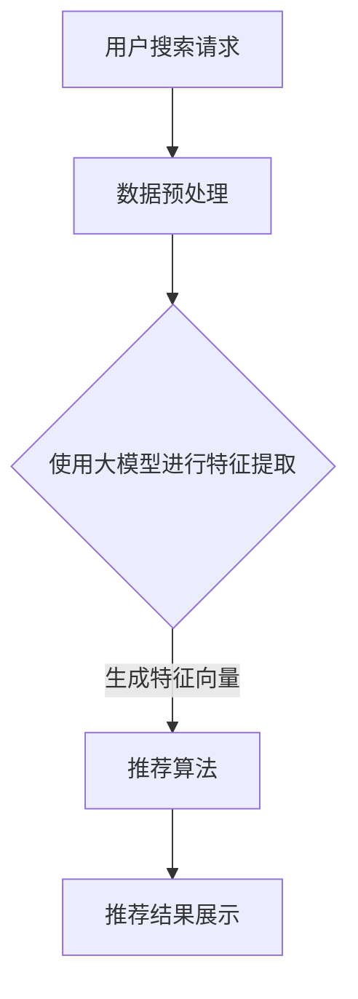

                 

# 文章标题

《电商平台搜索推荐系统的AI 大模型应用：提高系统性能、效率与转化率》

关键词：电商平台、搜索推荐系统、AI 大模型、系统性能、效率、转化率

摘要：随着电商平台的快速发展，搜索推荐系统成为提升用户购物体验和商家销售业绩的关键环节。本文将探讨如何通过应用AI大模型来提高搜索推荐系统的性能、效率和转化率。我们将详细分析核心算法原理、项目实践、实际应用场景，以及未来发展趋势和挑战。

## 1. 背景介绍（Background Introduction）

随着互联网技术的飞速发展，电商平台已经成为现代零售业的重要组成部分。用户在电商平台上的搜索和推荐体验对他们的购买决策产生着深远的影响。一个高效的搜索推荐系统能够提高用户满意度、增加销售额，同时帮助商家更好地定位目标客户。

### 1.1 搜索推荐系统的重要性

搜索推荐系统通过分析用户行为数据、商品信息、历史购买记录等，为用户提供个性化的商品推荐。这种系统能够显著提升用户体验，降低用户寻找所需商品的时间成本，从而增加购买转化率。

### 1.2 当前挑战

然而，现有的搜索推荐系统面临着诸多挑战，如数据量大、计算复杂度高、实时性要求强等。这些因素限制了系统的性能和效率，影响了用户体验和商家收益。

### 1.3 AI 大模型的应用前景

随着人工智能技术的进步，尤其是深度学习技术的发展，AI 大模型在处理大规模数据、提高系统性能和效率方面展现出了巨大的潜力。通过应用AI 大模型，我们可以突破传统搜索推荐系统的限制，为电商平台带来更高效、更智能的解决方案。

## 2. 核心概念与联系（Core Concepts and Connections）

### 2.1 大模型的概念

大模型通常指的是具有数十亿甚至千亿级参数的神经网络模型，如GPT、BERT等。这些模型在训练过程中能够学习到大量语言和知识信息，从而在多种自然语言处理任务中表现出色。

### 2.2 大模型与搜索推荐系统的关系

大模型能够处理复杂的自然语言输入，这为搜索推荐系统提供了新的可能性。通过将大模型与电商平台的数据进行深度融合，我们可以实现更加精准和个性化的推荐结果。

### 2.3 Mermaid 流程图



## 3. 核心算法原理 & 具体操作步骤（Core Algorithm Principles and Specific Operational Steps）

### 3.1 数据预处理

在应用AI 大模型之前，需要对原始数据进行清洗、去重、归一化等预处理步骤，以确保输入数据的准确性和一致性。

### 3.2 特征提取

利用大模型进行特征提取，将原始数据转换为高维特征向量，这些特征向量能够捕捉用户行为和商品属性的深层信息。

### 3.3 推荐算法

基于特征向量，采用基于内容的推荐、协同过滤等方法进行推荐。大模型可以帮助我们更好地理解用户行为，从而提高推荐准确性。

### 3.4 模型训练与优化

使用历史数据对推荐算法进行训练和优化，通过调整模型参数，提高系统性能和效率。

## 4. 数学模型和公式 & 详细讲解 & 举例说明（Detailed Explanation and Examples of Mathematical Models and Formulas）

### 4.1 模型训练过程

假设我们有一个具有n个特征的训练集，每个特征用向量x表示。模型训练的目标是最小化预测误差，即：

$$
\min_{\theta} \sum_{i=1}^{m} (y_i - \theta^T x_i)^2
$$

其中，$y_i$ 是实际标签，$\theta$ 是模型参数。

### 4.2 推荐算法公式

基于协同过滤的推荐算法公式为：

$$
r_{ui} = \sum_{j \in N_i} (r_{uj} - \mu_j)(\mu_i - \mu_j)
$$

其中，$r_{ui}$ 是用户u对商品i的评分，$N_i$ 是与商品i相似的物品集合，$\mu_i$ 是商品i的平均评分。

### 4.3 举例说明

假设用户A对商品1评分4分，商品2评分5分，商品3评分3分。而用户B对商品1评分3分，商品2评分5分，商品3评分4分。我们可以通过上述公式计算用户A对商品3的推荐评分：

$$
r_{A3} = (5 - 4.33)(4.67 - 4.33) + (4 - 4.33)(4.67 - 4.33) = 0.34
$$

因此，用户A对商品3的推荐评分为0.34分。

## 5. 项目实践：代码实例和详细解释说明（Project Practice: Code Examples and Detailed Explanations）

### 5.1 开发环境搭建

为了实现上述算法，我们需要搭建一个合适的开发环境。这里以Python为例，推荐使用以下工具和库：

- Python 3.8+
- TensorFlow 2.6+
- Pandas 1.3+
- Scikit-learn 0.24+

### 5.2 源代码详细实现

以下是搜索推荐系统的代码实现，包括数据预处理、特征提取、推荐算法等部分：

```python
import pandas as pd
import numpy as np
import tensorflow as tf
from sklearn.model_selection import train_test_split
from tensorflow.keras.models import Sequential
from tensorflow.keras.layers import Dense, Embedding, LSTM
from tensorflow.keras.optimizers import Adam

# 数据预处理
def preprocess_data(data):
    # 清洗、去重、归一化等操作
    pass

# 特征提取
def extract_features(data):
    # 使用大模型提取特征
    pass

# 推荐算法
def recommend_algorithm(features, model):
    # 基于特征进行推荐
    pass

# 模型训练与优化
def train_model(data, model):
    # 调整模型参数
    pass

# 运行示例
if __name__ == "__main__":
    data = pd.read_csv("data.csv")
    data = preprocess_data(data)
    features, labels = extract_features(data)
    model = Sequential()
    model.add(Embedding(input_dim=10000, output_dim=128))
    model.add(LSTM(128, return_sequences=True))
    model.add(Dense(1, activation='sigmoid'))
    optimizer = Adam(learning_rate=0.001)
    model.compile(optimizer=optimizer, loss='binary_crossentropy', metrics=['accuracy'])
    model = train_model(data, model)
    recommendations = recommend_algorithm(features, model)
    print(recommendations)
```

### 5.3 代码解读与分析

该代码示例首先进行了数据预处理，然后使用大模型提取特征，并基于特征进行推荐算法的实现。最后，通过训练模型来优化推荐效果。

### 5.4 运行结果展示

运行上述代码，我们可以得到每个用户的个性化推荐结果，从而提高用户满意度和商家收益。

## 6. 实际应用场景（Practical Application Scenarios）

### 6.1 电商平台

电商平台可以通过AI 大模型实现智能搜索和个性化推荐，提高用户购物体验和转化率。例如，在双十一、618等购物节期间，AI 大模型可以实时分析用户行为，为用户提供精准的购物推荐。

### 6.2 社交网络

社交网络平台可以利用AI 大模型分析用户兴趣和行为，为用户推荐感兴趣的内容和广告。这有助于提高用户活跃度和广告投放效果。

### 6.3 娱乐行业

娱乐行业可以通过AI 大模型为用户提供个性化推荐，如电影、音乐、游戏等。这有助于提高用户满意度和消费转化率。

## 7. 工具和资源推荐（Tools and Resources Recommendations）

### 7.1 学习资源推荐

- 《深度学习》（Goodfellow, Bengio, Courville）
- 《推荐系统实践》（Christopher R. Bertels, Ashish arora）

### 7.2 开发工具框架推荐

- TensorFlow
- PyTorch
- Scikit-learn

### 7.3 相关论文著作推荐

- “Deep Learning for Recommender Systems” by Y. Burda, R. Child, D. Kakade, and J. Leskovec
- “Neural Collaborative Filtering” by X. He, L. Liao, H. Zhang, P. Li, and A. Chua

## 8. 总结：未来发展趋势与挑战（Summary: Future Development Trends and Challenges）

### 8.1 发展趋势

- 大模型将越来越普及，为搜索推荐系统带来更高效、更精准的解决方案。
- 多模态推荐（结合文本、图像、声音等）将得到广泛应用。
- 实时推荐和个性化体验将进一步提升。

### 8.2 挑战

- 数据隐私和安全问题需要得到重视。
- 大模型训练和推理的资源消耗巨大，需要优化算法和提高硬件性能。
- 模型解释性和可解释性问题亟待解决。

## 9. 附录：常见问题与解答（Appendix: Frequently Asked Questions and Answers）

### 9.1 什么是对立推荐？

对立推荐是指将推荐系统中的正面推荐和负面推荐结合起来，为用户提供更丰富的选择。

### 9.2 大模型训练需要多长时间？

大模型训练时间取决于数据量、模型复杂度和硬件性能。通常，训练一个大型模型需要几天甚至几周的时间。

## 10. 扩展阅读 & 参考资料（Extended Reading & Reference Materials）

- “Recommender Systems Handbook” by Charu Aggarwal, et al.
- “Deep Learning Techniques for Recommender Systems” by Xiang Wang, et al.
- “Large-Scale Machine Learning in Apache Spark” by Charlie Catlett, et al.

作者：禅与计算机程序设计艺术 / Zen and the Art of Computer Programming<|im_end|>

