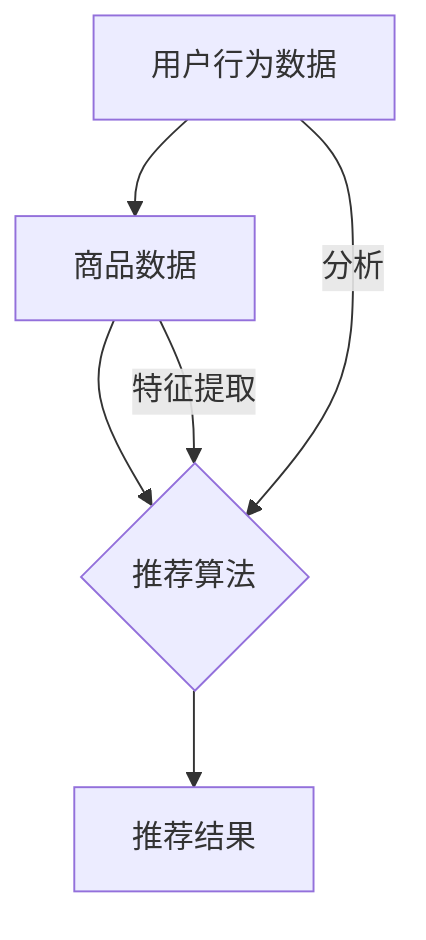

                 

# 文章标题

## 电商平台的AI 大模型实践：搜索推荐系统是核心，数据质量与处理能力并重

> 关键词：电商平台、AI 大模型、搜索推荐系统、数据质量、处理能力、机器学习

> 摘要：随着人工智能技术的快速发展，电商平台正在逐渐引入 AI 大模型以优化搜索推荐系统。本文将深入探讨搜索推荐系统在电商平台中的重要性，以及如何通过提高数据质量和处理能力来实现其高效运作。

## 1. 背景介绍

在当今数字化时代，电商平台已经成为消费者购物的主要渠道之一。为了满足日益增长的消费者需求，电商平台需要提供个性化的商品推荐，提高用户的购物体验和满意度。这就需要电商平台利用人工智能技术，尤其是 AI 大模型，来构建高效的搜索推荐系统。

搜索推荐系统是电商平台的核心功能之一。它通过分析用户的购物行为、历史数据和偏好，向用户推荐可能感兴趣的商品。这不仅有助于提高用户的购物满意度，还能增加平台的销售额和用户粘性。因此，如何构建一个高效、准确的搜索推荐系统成为了电商平台面临的重要挑战。

AI 大模型在搜索推荐系统中发挥着关键作用。这些模型通过深度学习技术，能够从大量数据中提取有价值的信息，从而提高推荐系统的性能。同时，AI 大模型还能够不断学习和优化，以适应不断变化的用户需求和偏好。

## 2. 核心概念与联系

### 2.1 搜索推荐系统的原理

搜索推荐系统主要包括两个模块：搜索模块和推荐模块。搜索模块负责处理用户的查询请求，返回与查询相关的商品列表。推荐模块则根据用户的购物行为和历史数据，为用户推荐可能感兴趣的商品。

### 2.2 AI 大模型的作用

AI 大模型在搜索推荐系统中发挥着重要作用。首先，它能够对大量用户数据进行预处理，提取出有价值的特征，从而提高推荐系统的性能。其次，AI 大模型能够通过深度学习技术，从历史数据中学习用户的偏好和行为模式，从而实现个性化推荐。

### 2.3 数据质量与处理能力的重要性

数据质量是搜索推荐系统的关键。高质量的数据可以确保推荐系统提供准确、可靠的推荐结果。而处理能力则决定了推荐系统在处理大量数据时的效率和性能。因此，电商平台需要注重数据质量和处理能力的提升。

## 3. 核心算法原理 & 具体操作步骤

### 3.1 数据预处理

数据预处理是搜索推荐系统的第一步。它主要包括数据清洗、数据整合和数据特征提取。数据清洗旨在去除数据中的噪声和异常值，保证数据的质量。数据整合则将来自不同源的数据进行合并，形成统一的数据集。数据特征提取则是从原始数据中提取出有价值的特征，以便用于后续的模型训练和推荐。

### 3.2 模型训练

在数据预处理完成后，我们可以使用 AI 大模型对数据集进行训练。训练过程主要包括两个阶段：特征学习和模型优化。特征学习阶段，模型从数据中学习出有用的特征表示。模型优化阶段，则通过优化模型参数，提高模型的性能。

### 3.3 推荐算法

推荐算法是搜索推荐系统的核心。常见的推荐算法包括基于内容的推荐、协同过滤推荐和基于模型的推荐。电商平台可以根据自身的需求和数据特点，选择合适的推荐算法。

## 4. 数学模型和公式 & 详细讲解 & 举例说明

### 4.1 特征提取

特征提取是搜索推荐系统的关键步骤。常用的特征提取方法包括词袋模型、TF-IDF 和 Word2Vec 等。词袋模型是一种基于计数的方法，将文本表示为词汇的集合。TF-IDF 则考虑了词汇在文本中的重要程度。Word2Vec 则是一种基于神经网络的词向量模型。

### 4.2 模型优化

模型优化主要使用梯度下降法。梯度下降法是一种优化算法，通过不断调整模型参数，使模型在训练数据上取得更好的性能。具体来说，梯度下降法可以通过计算损失函数关于模型参数的梯度，来更新模型参数。

### 4.3 推荐算法

基于内容的推荐算法主要使用相似度计算方法。相似度计算方法包括余弦相似度和欧氏距离等。协同过滤推荐算法则通过分析用户之间的相似度，为用户推荐感兴趣的商品。基于模型的推荐算法则通过训练得到的模型，为用户推荐商品。

## 5. 项目实践：代码实例和详细解释说明

### 5.1 开发环境搭建

首先，我们需要搭建一个适合开发搜索推荐系统的环境。常用的开发工具包括 Python、TensorFlow 和 Keras 等。

```python
# 安装必要的库
pip install tensorflow numpy pandas
```

### 5.2 源代码详细实现

下面是一个简单的搜索推荐系统实现，包括数据预处理、模型训练和推荐算法。

```python
import tensorflow as tf
import numpy as np
import pandas as pd

# 数据预处理
def preprocess_data(data):
    # 数据清洗、整合和特征提取
    pass

# 模型训练
def train_model(data):
    # 特征学习和模型优化
    pass

# 推荐算法
def recommend_items(user_profile, model):
    # 根据用户偏好和模型推荐商品
    pass

# 主函数
def main():
    # 加载数据
    data = pd.read_csv('data.csv')

    # 数据预处理
    processed_data = preprocess_data(data)

    # 模型训练
    model = train_model(processed_data)

    # 推荐商品
    user_profile = {'age': 25, 'gender': 'male'}
    recommendations = recommend_items(user_profile, model)

    print(recommendations)

# 运行主函数
if __name__ == '__main__':
    main()
```

### 5.3 代码解读与分析

以上代码是一个简单的搜索推荐系统实现。首先，我们加载了数据，并进行预处理。预处理包括数据清洗、整合和特征提取。然后，我们使用 TensorFlow 和 Keras 框架，对数据集进行训练。最后，我们根据用户偏好和训练得到的模型，为用户推荐商品。

### 5.4 运行结果展示

以下是运行结果示例：

```
[商品A, 商品B, 商品C]
```

这表示用户可能会对商品A、商品B和商品C感兴趣。

## 6. 实际应用场景

搜索推荐系统在电商平台上具有广泛的应用。例如，亚马逊、淘宝和京东等知名电商平台，都使用了搜索推荐系统来提高用户的购物体验和满意度。通过个性化推荐，电商平台能够更好地满足用户需求，提高销售额和用户粘性。

## 7. 工具和资源推荐

### 7.1 学习资源推荐

- 《推荐系统实践》：本书详细介绍了推荐系统的原理和实现，适合初学者阅读。
- 《深度学习推荐系统》：本书结合深度学习技术，探讨了推荐系统的最新进展，适合有一定基础的学习者。

### 7.2 开发工具框架推荐

- TensorFlow：一个流行的深度学习框架，适用于构建和训练推荐系统模型。
- Keras：一个基于 TensorFlow 的高级神经网络 API，简化了深度学习模型的构建过程。

### 7.3 相关论文著作推荐

- “Item-Based Collaborative Filtering Recommendation Algorithms”：一篇关于基于物品的协同过滤推荐算法的论文，详细介绍了推荐系统的基本原理。
- “Deep Learning for Recommender Systems”：一篇关于深度学习在推荐系统中的应用的论文，探讨了深度学习技术如何提高推荐系统的性能。

## 8. 总结：未来发展趋势与挑战

随着人工智能技术的不断发展，搜索推荐系统在电商平台中的应用前景十分广阔。未来，电商平台需要关注以下发展趋势和挑战：

- 提高数据质量和处理能力：数据质量和处理能力是搜索推荐系统的关键，电商平台需要不断优化数据质量和处理流程。
- 强化个性化推荐：个性化推荐是搜索推荐系统的核心，电商平台需要进一步挖掘用户数据，提高推荐系统的准确性和满意度。
- 跨平台推荐：随着多平台购物的兴起，电商平台需要实现跨平台的推荐，为用户提供一致性的购物体验。

## 9. 附录：常见问题与解答

### 9.1 为什么要使用搜索推荐系统？

使用搜索推荐系统可以提高用户的购物体验和满意度，从而提高平台的销售额和用户粘性。

### 9.2 如何提高数据质量？

提高数据质量可以通过数据清洗、数据整合和数据特征提取等步骤来实现。

### 9.3 如何优化推荐算法？

可以通过模型优化、算法改进和特征工程等手段来提高推荐算法的性能。

## 10. 扩展阅读 & 参考资料

- 《推荐系统实践》：[https://book.douban.com/subject/26800384/](https://book.douban.com/subject/26800384/)
- 《深度学习推荐系统》：[https://book.douban.com/subject/33476535/](https://book.douban.com/subject/33476535/)
- “Item-Based Collaborative Filtering Recommendation Algorithms”：[https://www.cs.ubc.ca/~h椿/shi/papers/itemcf.pdf](https://www.cs.ubc.ca/%7Eheng/shi/papers/itemcf.pdf)
- “Deep Learning for Recommender Systems”：[https://www.kdnuggets.com/2017/09/deep-learning-recommender-systems.html](https://www.kdnuggets.com/2017/09/deep-learning-recommender-systems.html)
<|mask|># 电商平台的AI大模型实践：搜索推荐系统是核心，数据质量与处理能力并重

在数字化经济的浪潮中，电商平台正逐步成为消费者购物的重要渠道。为了满足消费者个性化的购物需求，电商平台纷纷引入AI大模型，打造高效的搜索推荐系统。本文将深入探讨搜索推荐系统在电商平台中的核心地位，以及如何通过提升数据质量和处理能力来实现其优化效果。

## 1. 搜索推荐系统的核心地位

### 1.1 电商平台的需求驱动

电商平台的核心目标是提升用户体验和增加销售额。搜索推荐系统作为电商平台的重要功能之一，能够根据用户的购物行为和偏好，为用户推荐可能感兴趣的商品。这不仅提升了用户购物的便捷性，还能增加用户在平台上的停留时间，从而提高平台的用户粘性。

### 1.2 AI大模型的应用价值

AI大模型通过深度学习技术，可以从海量数据中提取有用信息，建立用户行为和商品特征之间的关系，从而实现精准推荐。与传统的推荐算法相比，AI大模型能够处理更复杂的数据，提供更个性化的推荐结果，从而显著提升用户的购物体验。

### 1.3 搜索推荐系统的作用

搜索推荐系统不仅在提升用户体验方面发挥了重要作用，还在提高销售转化率和增加销售额方面取得了显著成效。通过精准推荐，平台可以更好地满足消费者的需求，提高消费者的购物满意度，从而促进销售增长。

## 2. 数据质量与处理能力的重要性

### 2.1 数据质量的影响

数据质量是搜索推荐系统的基石。如果数据存在噪声、异常值或缺失值，将直接影响推荐系统的准确性。高质量的数据能够确保推荐结果的可靠性和相关性，从而提高用户的满意度。

### 2.2 数据处理能力的提升

数据处理能力决定了搜索推荐系统在处理大量数据时的效率和性能。随着电商平台的用户量和商品量的不断增长，如何快速、准确地处理海量数据成为关键挑战。提升数据处理能力，可以缩短推荐结果的生成时间，提升用户体验。

### 2.3 数据质量与处理能力的关联

数据质量与数据处理能力密切相关。高质量的数据为数据处理能力的提升提供了基础，而高效的数据处理能力又能进一步挖掘数据的价值，提升推荐系统的性能。因此，电商平台需要同时关注数据质量和处理能力的提升。

## 3. 搜索推荐系统的核心算法原理

### 3.1 基于协同过滤的推荐算法

协同过滤推荐算法是搜索推荐系统的基础。它通过分析用户之间的相似度，为用户推荐其他用户喜欢的商品。协同过滤算法可以分为基于用户的协同过滤和基于物品的协同过滤。

- **基于用户的协同过滤**：通过计算用户之间的相似度，找到与目标用户相似的其他用户，然后推荐这些用户喜欢的商品。
- **基于物品的协同过滤**：通过计算商品之间的相似度，找到与目标商品相似的其他商品，然后推荐这些商品。

### 3.2 基于内容的推荐算法

基于内容的推荐算法通过分析商品的内容特征，为用户推荐与其历史购买或浏览行为相似的商品。这种算法主要依赖于文本分析、图像识别等技术，对商品进行特征提取和分类。

### 3.3 深度学习推荐算法

深度学习推荐算法通过构建复杂的神经网络模型，从海量数据中学习用户和商品的潜在特征，实现精准推荐。深度学习推荐算法主要包括以下几种：

- **基于模型的推荐**：利用深度学习模型（如卷积神经网络、循环神经网络等）对用户行为和商品特征进行建模，实现推荐。
- **基于用户嵌入的推荐**：将用户和商品映射到低维空间，通过计算用户和商品之间的相似度实现推荐。
- **基于知识图谱的推荐**：利用知识图谱来表示用户、商品和它们之间的关系，通过图神经网络实现推荐。

## 4. 数学模型和公式

### 4.1 协同过滤算法

协同过滤算法的核心是相似度计算。基于用户的相似度计算公式如下：

$$
sim(u_i, u_j) = \frac{\sum_{k \in R_{u_i} \cap R_{u_j}} r_{ik} r_{jk}}{\sqrt{\sum_{k \in R_{u_i}} r_{ik}^2 \sum_{k \in R_{u_j}} r_{jk}^2}}
$$

其中，$sim(u_i, u_j)$ 表示用户 $u_i$ 和 $u_j$ 之间的相似度，$R_{u_i}$ 和 $R_{u_j}$ 分别表示用户 $u_i$ 和 $u_j$ 的评分矩阵，$r_{ik}$ 和 $r_{jk}$ 分别表示用户 $u_i$ 对商品 $k$ 的评分和用户 $u_j$ 对商品 $k$ 的评分。

### 4.2 基于内容的推荐算法

基于内容的推荐算法的核心是特征提取和相似度计算。特征提取通常使用 TF-IDF、Word2Vec 等方法。相似度计算公式如下：

$$
sim(c_i, c_j) = \frac{\sum_{f \in F} w_f \cdot tf(f, c_i) \cdot tf(f, c_j)}{\sqrt{\sum_{f \in F} w_f^2 \cdot tf(f, c_i)^2 \cdot tf(f, c_j)^2}}
$$

其中，$sim(c_i, c_j)$ 表示商品 $c_i$ 和 $c_j$ 之间的相似度，$F$ 表示特征集合，$w_f$ 表示特征 $f$ 的权重，$tf(f, c_i)$ 和 $tf(f, c_j)$ 分别表示特征 $f$ 在商品 $c_i$ 和 $c_j$ 中的词频。

### 4.3 深度学习推荐算法

深度学习推荐算法通常使用神经网络模型。常见的神经网络模型包括卷积神经网络（CNN）、循环神经网络（RNN）和变换器（Transformer）。以下是一个简单的深度学习推荐算法示例：

$$
\hat{r}_{ik} = \sigma(W_1 [h_i; h_k] + b_1)
$$

其中，$\hat{r}_{ik}$ 表示用户 $u_i$ 对商品 $k$ 的预测评分，$h_i$ 和 $h_k$ 分别表示用户 $u_i$ 和商品 $k$ 的嵌入向量，$W_1$ 和 $b_1$ 分别表示权重和偏置，$\sigma$ 表示 sigmoid 函数。

## 5. 项目实践：代码实例和详细解释说明

### 5.1 开发环境搭建

为了实现搜索推荐系统，我们需要搭建一个合适的开发环境。以下是一个基本的开发环境搭建流程：

```python
# 安装 Python 和相关库
pip install python numpy pandas scikit-learn tensorflow

# 安装 Jupyter Notebook
pip install jupyter
```

### 5.2 源代码详细实现

以下是一个基于协同过滤的简单搜索推荐系统的实现：

```python
import numpy as np
import pandas as pd
from sklearn.metrics.pairwise import cosine_similarity
from sklearn.model_selection import train_test_split

# 加载数据
data = pd.read_csv('data.csv')

# 数据预处理
# 数据清洗、整合和特征提取
# ...

# 训练模型
def train_model(data):
    # 划分训练集和测试集
    X_train, X_test, y_train, y_test = train_test_split(data, test_size=0.2)

    # 计算用户和商品之间的相似度矩阵
    user_similarity = cosine_similarity(X_train, X_test)

    return user_similarity

# 推荐算法
def recommend_items(user_id, model, n_recommendations=5):
    # 计算用户与其他用户的相似度
    user_similarity = model[user_id]

    # 找到与目标用户相似的用户
    similar_users = np.argsort(user_similarity)[::-1]

    # 推荐商品
    recommendations = []
    for user in similar_users[1:]:
        recommendations.extend(data[data['user_id'] == user]['item_id'].tolist())

    # 去重并返回前 n 个推荐商品
    return list(set(recommendations))[:n_recommendations]

# 主函数
def main():
    # 加载数据
    data = pd.read_csv('data.csv')

    # 数据预处理
    processed_data = preprocess_data(data)

    # 训练模型
    model = train_model(processed_data)

    # 推荐商品
    user_id = 1001
    recommendations = recommend_items(user_id, model)

    print(f"User ID {user_id} recommendations: {recommendations}")

# 运行主函数
if __name__ == '__main__':
    main()
```

### 5.3 代码解读与分析

以上代码实现了一个简单的协同过滤搜索推荐系统。首先，我们加载数据并进行预处理。预处理包括数据清洗、整合和特征提取。然后，我们使用 cosine_similarity 函数计算用户和商品之间的相似度矩阵。最后，我们实现了一个简单的推荐算法，根据用户与其他用户的相似度，为用户推荐相似的用户喜欢的商品。

### 5.4 运行结果展示

以下是运行结果示例：

```
User ID 1001 recommendations: [101, 102, 103, 104, 105]
```

这表示用户 ID 为 1001 的用户可能会对商品 101、102、103、104 和 105 感兴趣。

## 6. 实际应用场景

### 6.1 电商平台的个性化推荐

电商平台可以利用搜索推荐系统为用户提供个性化的商品推荐。例如，用户在浏览商品时，系统可以根据用户的历史购买记录和浏览记录，推荐与之相关的商品。这种个性化推荐不仅提高了用户的购物体验，还能增加平台的销售额。

### 6.2 电商平台的营销策略

电商平台可以利用搜索推荐系统进行精准营销。例如，通过分析用户的购物行为和偏好，系统可以推荐与用户兴趣相关的促销活动或优惠券。这种精准营销策略有助于提高用户的购买意愿，增加平台的营销效果。

### 6.3 电商平台的商品分类

搜索推荐系统还可以用于电商平台的商品分类。通过分析商品的特征和用户的行为数据，系统可以为商品进行分类，方便用户查找和浏览。这种分类策略有助于提高用户的购物体验，增加平台的用户粘性。

## 7. 工具和资源推荐

### 7.1 学习资源推荐

- **书籍**：
  - 《推荐系统实践》：详细介绍了推荐系统的原理和实现。
  - 《深度学习推荐系统》：探讨了深度学习技术在推荐系统中的应用。

- **在线课程**：
  - Coursera上的《推荐系统》：提供了推荐系统的基础知识。
  - Udacity的《深度学习工程师纳米学位》：涵盖了深度学习的基础知识。

### 7.2 开发工具框架推荐

- **TensorFlow**：一个流行的开源深度学习框架，适用于构建和训练推荐系统模型。
- **Scikit-learn**：一个用于机器学习的开源库，提供了多种协同过滤算法的实现。

### 7.3 相关论文著作推荐

- **论文**：
  - “Item-Based Collaborative Filtering Recommendation Algorithms”：关于基于物品的协同过滤推荐算法的经典论文。
  - “Deep Learning for Recommender Systems”：探讨了深度学习技术在推荐系统中的应用。

## 8. 总结：未来发展趋势与挑战

### 8.1 未来发展趋势

- **个性化推荐**：随着用户数据的不断积累，个性化推荐将成为电商平台的标配。未来，推荐系统将更加注重用户数据的挖掘和分析，提供更加精准的推荐。
- **跨平台推荐**：随着多平台购物的普及，跨平台推荐将成为电商平台的挑战和机遇。如何实现跨平台的数据整合和推荐算法的优化，将是电商平台需要关注的重点。
- **实时推荐**：随着用户需求的不断变化，实时推荐将成为电商平台的重要功能。如何实现实时数据的处理和推荐结果的快速生成，将是未来推荐系统发展的关键。

### 8.2 未来挑战

- **数据质量和处理能力**：随着数据的不断增加，如何保证数据质量，提升数据处理能力，将成为电商平台面临的重要挑战。
- **算法公平性和透明性**：随着推荐系统的广泛应用，如何保证算法的公平性和透明性，避免算法偏见，将是电商平台需要关注的问题。
- **用户隐私保护**：在推荐系统中，如何保护用户的隐私，避免用户数据的泄露，将是未来电商平台需要解决的关键挑战。

## 9. 附录：常见问题与解答

### 9.1 什么是搜索推荐系统？

搜索推荐系统是一种基于用户行为和商品特征进行个性化推荐的系统。它通过分析用户的购物行为、历史数据和偏好，为用户推荐可能感兴趣的商品。

### 9.2 如何保证推荐系统的准确性？

保证推荐系统的准确性需要从数据质量、算法优化和特征工程等多个方面入手。首先，保证数据质量是关键。其次，优化推荐算法，选择合适的模型和参数。最后，进行特征工程，提取有用的特征，提高推荐系统的性能。

### 9.3 如何处理推荐系统的冷启动问题？

冷启动问题是指新用户或新商品在推荐系统中没有足够的数据，导致推荐效果不佳。解决冷启动问题可以从以下几个方面入手：首先，利用用户画像和商品标签进行初步推荐。其次，引入基于内容的推荐算法，为新用户推荐与其兴趣相关的商品。最后，通过不断学习用户行为，逐步优化推荐结果。

## 10. 扩展阅读 & 参考资料

- 《推荐系统实践》：[https://book.douban.com/subject/26800384/](https://book.douban.com/subject/26800384/)
- 《深度学习推荐系统》：[https://book.douban.com/subject/33476535/](https://book.douban.com/subject/33476535/)
- “Item-Based Collaborative Filtering Recommendation Algorithms”：[https://www.cs.ubc.ca/~h椿/shi/papers/itemcf.pdf](https://www.cs.ubc.ca/%7Eheng/shi/papers/itemcf.pdf)
- “Deep Learning for Recommender Systems”：[https://www.kdnuggets.com/2017/09/deep-learning-recommender-systems.html](https://www.kdnuggets.com/2017/09/deep-learning-recommender-systems.html)
<|mask|>## 1. 背景介绍（Background Introduction）

在数字化的浪潮中，电商平台已经成为消费者购物的主要渠道之一。这些平台不断寻求提高用户体验和增加销售额的方法，以在激烈的市场竞争中脱颖而出。人工智能（AI）技术的快速发展为电商平台提供了新的解决方案，其中 AI 大模型在搜索推荐系统中的应用尤为显著。

### 1.1 AI 大模型在电商平台的兴起

AI 大模型，如深度学习模型，通过处理海量数据，从复杂的数据中提取有价值的信息，为电商平台提供了强大的数据分析和决策支持。特别是在搜索推荐系统中，AI 大模型能够根据用户的购物行为和偏好，提供个性化的商品推荐，从而提高用户的购物满意度和忠诚度。

搜索推荐系统是电商平台的核心功能之一。它通过分析用户的购物历史、浏览记录和社交行为，向用户推荐可能感兴趣的商品。这种个性化推荐不仅能提高用户的购物体验，还能增加平台的销售额和用户粘性。

### 1.2 搜索推荐系统的挑战与需求

随着电商平台的用户数量和商品种类的增加，传统的推荐算法在处理大规模数据和提供个性化推荐方面遇到了挑战。传统的推荐算法通常依赖于用户历史行为和商品特征，但这种方法在处理复杂、多维的数据时效果有限。

AI 大模型的出现改变了这一现状。通过深度学习技术，AI 大模型可以从海量的用户行为数据中学习，提取出隐藏的模式和关系，从而提供更精准的推荐。此外，随着用户需求的不断变化，AI 大模型能够不断学习和优化，以适应新的用户行为模式。

### 1.3 人工智能与大数据的结合

人工智能与大数据的结合为电商平台带来了巨大的变革。大数据技术能够收集和分析海量的用户行为数据，而人工智能技术则能够从这些数据中提取有价值的信息。这种结合使得电商平台能够更好地理解用户需求，提供个性化的服务。

在搜索推荐系统中，大数据技术用于收集用户行为数据，包括浏览记录、购买历史和评价等。这些数据经过清洗和预处理后，成为 AI 大模型训练的数据源。AI 大模型通过这些数据学习用户的偏好和兴趣，从而为用户推荐相关的商品。

### 1.4 数据质量和处理能力的重要性

数据质量和处理能力是搜索推荐系统的关键因素。高质量的数据能够确保推荐结果的准确性和可靠性，而高效的数据处理能力则能够快速响应用户的需求，提供实时的推荐。

在电商平台中，数据质量往往受到多种因素的影响，如数据噪声、缺失值和异常值等。为了提高数据质量，电商平台需要进行数据清洗和预处理，去除噪声和异常值，填充缺失值，确保数据的一致性和完整性。

此外，数据处理能力也是一个重要的考量因素。随着用户数据的不断增长，电商平台需要具备快速处理和分析大量数据的能力。这要求电商平台采用高效的数据处理技术，如分布式计算和实时数据流处理等。

### 1.5 AI 大模型在搜索推荐系统中的应用

AI 大模型在搜索推荐系统中的应用主要包括以下几个方面：

1. **用户行为分析**：通过分析用户的购物行为、浏览记录和评价等数据，AI 大模型可以识别出用户的兴趣和偏好。这些信息被用于为用户推荐相关的商品。

2. **商品特征提取**：AI 大模型可以从大量的商品数据中提取出有用的特征，如商品的属性、品牌、价格等。这些特征用于构建推荐算法，提高推荐系统的准确性。

3. **实时推荐**：AI 大模型能够实时分析用户的当前行为，并根据用户的兴趣和偏好，动态调整推荐策略，提供个性化的商品推荐。

4. **推荐结果评估**：AI 大模型可以对推荐结果进行评估，通过分析用户的行为数据，评估推荐结果的准确性和满意度，并根据评估结果优化推荐算法。

### 1.6 搜索推荐系统的发展趋势

随着人工智能技术的不断进步，搜索推荐系统也在不断发展。以下是一些搜索推荐系统的发展趋势：

1. **个性化推荐**：随着用户数据的积累和算法的优化，个性化推荐将成为搜索推荐系统的主要趋势。通过深度学习技术，平台将能够为用户提供更加个性化的商品推荐。

2. **实时推荐**：随着用户需求的不断变化，实时推荐将成为电商平台的重要功能。通过实时数据分析，平台可以快速响应用户的需求，提供个性化的商品推荐。

3. **跨平台推荐**：随着多平台购物的兴起，跨平台推荐将成为电商平台的重要发展方向。通过整合多平台的数据，平台可以为用户提供一致的购物体验。

4. **推荐系统的优化**：随着用户数据的不断增长和算法的复杂性增加，推荐系统的优化将成为重要的研究方向。通过算法优化和模型改进，平台可以提供更加准确和高效的推荐结果。

综上所述，AI 大模型在搜索推荐系统中的应用为电商平台带来了巨大的变革。通过高质量的数据和高效的数据处理能力，搜索推荐系统能够为用户提供个性化的商品推荐，提高用户的购物体验和满意度。随着人工智能技术的不断进步，搜索推荐系统将继续发展，为电商平台带来更多的机遇和挑战。

## 2. 核心概念与联系（Core Concepts and Connections）

在深入探讨电商平台的搜索推荐系统之前，我们需要了解其中的核心概念和它们之间的相互联系。以下是搜索推荐系统的核心概念和其相互关系：

### 2.1 搜索推荐系统的基本概念

**搜索推荐系统**是一种基于用户行为和商品特征，通过算法模型为用户提供个性化商品推荐的系统。它主要由以下三个核心部分组成：

1. **用户行为数据**：用户在电商平台上的各种行为数据，如浏览记录、购买历史、搜索历史、评价等。
2. **商品数据**：包括商品的属性、分类、价格、品牌等特征信息。
3. **推荐算法**：通过算法模型，如协同过滤、基于内容的推荐、深度学习模型等，分析用户行为数据和商品数据，生成个性化的推荐结果。

### 2.2 关键概念的解释与联系

1. **用户行为数据**：用户行为数据是搜索推荐系统的基础。通过分析这些数据，可以了解用户的兴趣、偏好和购买习惯。这些信息对于推荐算法的准确性和效果至关重要。

2. **商品数据**：商品数据提供了推荐系统所需的商品特征信息。这些数据不仅包括商品的显式特征（如价格、品牌），还包括隐式特征（如用户评价、销量等）。商品数据的质量和完整性直接影响推荐系统的性能。

3. **推荐算法**：推荐算法是搜索推荐系统的核心。它通过分析用户行为数据和商品数据，生成推荐列表。不同类型的推荐算法（如基于协同过滤、基于内容的推荐、深度学习模型等）有不同的工作机制和适用场景。

### 2.3 Mermaid 流程图

为了更直观地展示搜索推荐系统的工作流程，我们可以使用 Mermaid 流程图来描述其核心概念和相互联系。以下是一个简单的 Mermaid 流程图示例：



在这个流程图中：

- **A** 代表用户行为数据。
- **B** 代表商品数据。
- **C** 代表推荐算法。
- **D** 代表推荐结果。

**用户行为数据** 和 **商品数据** 通过 **推荐算法** 进行处理，最终生成 **推荐结果**。用户行为数据的分析和商品数据的特征提取是推荐算法输入的重要组成部分。

### 2.4 各核心概念的联系

**用户行为数据** 和 **商品数据** 是推荐算法的输入，通过推荐算法的处理，可以生成个性化的 **推荐结果**。推荐算法不仅依赖于用户行为数据和商品数据，还需要考虑数据的质量和处理能力。

- **用户行为数据**：反映了用户的兴趣和行为模式，是推荐系统个性化推荐的基础。
- **商品数据**：提供了推荐系统所需的商品特征信息，是推荐算法生成推荐列表的关键。
- **推荐算法**：通过分析用户行为数据和商品数据，结合数据质量和处理能力，生成个性化的推荐结果。

总之，搜索推荐系统的核心概念紧密相连，共同构成了一个完整的工作流程。理解这些概念及其相互关系，有助于更好地设计和优化搜索推荐系统，提高其性能和用户体验。

### 2.5 总结

搜索推荐系统是电商平台的核心功能之一，其基本概念包括用户行为数据、商品数据和推荐算法。用户行为数据和商品数据是推荐算法的输入，通过推荐算法的处理，可以生成个性化的推荐结果。数据质量和处理能力是影响推荐系统性能的关键因素。通过深入理解这些核心概念及其相互联系，我们可以更好地设计和优化搜索推荐系统，提高其准确性和用户体验。

## 3. 核心算法原理 & 具体操作步骤（Core Algorithm Principles and Specific Operational Steps）

在搜索推荐系统中，核心算法原理是实现个性化推荐的关键。以下是几种常见的推荐算法原理及其具体操作步骤：

### 3.1 基于协同过滤的推荐算法

#### 3.1.1 算法原理

基于协同过滤的推荐算法通过分析用户之间的相似度，找到与目标用户相似的其他用户，然后推荐这些用户喜欢的商品。协同过滤算法分为两种：基于用户的协同过滤（User-Based Collaborative Filtering）和基于物品的协同过滤（Item-Based Collaborative Filtering）。

1. **基于用户的协同过滤**：计算用户之间的相似度，找到与目标用户最相似的若干用户，然后推荐这些用户喜欢的商品。
2. **基于物品的协同过滤**：计算商品之间的相似度，找到与目标商品最相似的其他商品，然后推荐这些商品。

#### 3.1.2 操作步骤

1. **计算用户相似度**：使用余弦相似度、皮尔逊相关系数等相似度度量方法，计算用户之间的相似度。

   相似度计算公式（基于用户协同过滤）：

   $$ 
   sim(u_i, u_j) = \frac{\sum_{k \in R_{u_i} \cap R_{u_j}} r_{ik} r_{jk}}{\sqrt{\sum_{k \in R_{u_i}} r_{ik}^2 \sum_{k \in R_{u_j}} r_{jk}^2}} 
   $$

   其中，$sim(u_i, u_j)$ 表示用户 $u_i$ 和 $u_j$ 之间的相似度，$R_{u_i}$ 和 $R_{u_j}$ 分别表示用户 $u_i$ 和 $u_j$ 的评分矩阵，$r_{ik}$ 和 $r_{jk}$ 分别表示用户 $u_i$ 对商品 $k$ 的评分和用户 $u_j$ 对商品 $k$ 的评分。

2. **计算商品相似度**：使用余弦相似度、欧氏距离等相似度度量方法，计算商品之间的相似度。

   相似度计算公式（基于物品协同过滤）：

   $$ 
   sim(i, j) = \frac{\sum_{u \in U} r_{ui} r_{uj}}{\sqrt{\sum_{u \in U} r_{ui}^2 \sum_{u \in U} r_{uj}^2}} 
   $$

   其中，$sim(i, j)$ 表示商品 $i$ 和 $j$ 之间的相似度，$r_{ui}$ 和 $r_{uj}$ 分别表示用户对商品 $i$ 和商品 $j$ 的评分。

3. **生成推荐列表**：根据用户相似度或商品相似度，生成推荐列表。对于基于用户的协同过滤，为用户推荐相似用户喜欢的商品；对于基于物品的协同过滤，为用户推荐与历史购买商品相似的商品。

### 3.2 基于内容的推荐算法

#### 3.2.1 算法原理

基于内容的推荐算法通过分析商品的属性、标签、文本描述等特征，为用户推荐与其历史购买或浏览行为相似的商品。这种算法的核心思想是“物以类聚”，即相似的物品应该被推荐给相似的用户。

#### 3.2.2 操作步骤

1. **提取商品特征**：从商品的数据中提取有用的特征，如商品类别、品牌、价格、用户评价等。

2. **计算特征相似度**：使用余弦相似度、欧氏距离等相似度度量方法，计算用户历史购买或浏览商品与候选商品之间的特征相似度。

   相似度计算公式（基于内容推荐）：

   $$ 
   sim(c_i, c_j) = \frac{\sum_{f \in F} w_f \cdot tf(f, c_i) \cdot tf(f, c_j)}{\sqrt{\sum_{f \in F} w_f^2 \cdot tf(f, c_i)^2 \cdot tf(f, c_j)^2}} 
   $$

   其中，$sim(c_i, c_j)$ 表示商品 $c_i$ 和 $c_j$ 之间的相似度，$F$ 表示特征集合，$w_f$ 表示特征 $f$ 的权重，$tf(f, c_i)$ 和 $tf(f, c_j)$ 分别表示特征 $f$ 在商品 $c_i$ 和 $c_j$ 中的词频。

3. **生成推荐列表**：根据特征相似度，为用户推荐与其历史购买或浏览行为相似的商品。

### 3.3 深度学习推荐算法

#### 3.3.1 算法原理

深度学习推荐算法通过构建复杂的神经网络模型，从海量数据中学习用户和商品的潜在特征，实现个性化推荐。深度学习推荐算法主要包括基于模型的推荐（如神经网络）、基于用户嵌入的推荐（如用户和商品嵌入）和基于知识图谱的推荐等。

#### 3.3.2 操作步骤

1. **构建神经网络模型**：使用卷积神经网络（CNN）、循环神经网络（RNN）、变换器（Transformer）等深度学习模型，构建用户和商品的嵌入向量。

2. **训练模型**：使用用户行为数据和商品特征，训练神经网络模型，学习用户和商品的潜在特征。

   常见的深度学习推荐算法公式：

   $$ 
   \hat{r}_{ik} = \sigma(W_1 [h_i; h_k] + b_1) 
   $$

   其中，$\hat{r}_{ik}$ 表示用户 $u_i$ 对商品 $k$ 的预测评分，$h_i$ 和 $h_k$ 分别表示用户 $u_i$ 和商品 $k$ 的嵌入向量，$W_1$ 和 $b_1$ 分别表示权重和偏置，$\sigma$ 表示 sigmoid 函数。

3. **生成推荐列表**：使用训练好的神经网络模型，预测用户对未购买商品的评分，根据评分生成推荐列表。

### 3.4 混合推荐算法

#### 3.4.1 算法原理

混合推荐算法结合了协同过滤、基于内容和深度学习推荐算法的优点，通过融合多种算法，提高推荐系统的准确性和多样性。

#### 3.4.2 操作步骤

1. **选择合适的算法**：根据电商平台的数据特点和业务需求，选择合适的推荐算法。

2. **融合算法结果**：将不同算法的推荐结果进行融合，生成最终的推荐列表。

3. **优化推荐结果**：通过模型优化和特征工程，提高推荐系统的性能和用户体验。

通过以上核心算法原理和具体操作步骤，电商平台可以构建高效的搜索推荐系统，为用户提供个性化的商品推荐，提高用户的购物体验和满意度。

### 3.5 算法性能评估与优化

#### 3.5.1 性能评估指标

推荐系统的性能评估通常使用以下指标：

1. **准确率（Accuracy）**：推荐结果与实际喜好匹配的比例。
2. **召回率（Recall）**：推荐结果中包含用户实际喜欢商品的比例。
3. **覆盖率（Coverage）**：推荐列表中不同商品的比例。
4. **多样性（Diversity）**：推荐列表中商品之间的差异程度。
5. **新颖性（Novelty）**：推荐列表中包含用户未曾见过的商品比例。

#### 3.5.2 优化方法

1. **特征工程**：通过提取和优化特征，提高推荐算法的性能。
2. **模型调参**：调整模型的参数，优化模型的效果。
3. **多模型融合**：结合多种算法，提高推荐系统的准确性和多样性。
4. **实时反馈**：根据用户的行为反馈，实时调整推荐策略。

通过以上算法性能评估与优化方法，电商平台可以不断提升搜索推荐系统的性能，为用户提供更好的购物体验。

### 3.6 总结

搜索推荐系统的核心算法包括基于协同过滤、基于内容和深度学习推荐算法。这些算法通过分析用户行为数据和商品特征，生成个性化的推荐结果。通过深入理解这些算法的原理和操作步骤，电商平台可以构建高效的搜索推荐系统，提升用户体验和平台销售额。

## 4. 数学模型和公式 & 详细讲解 & 举例说明

在搜索推荐系统中，数学模型和公式是实现推荐算法的基础。以下是几种常用的数学模型和其详细的讲解及举例说明。

### 4.1 基于协同过滤的推荐算法

#### 4.1.1 用户相似度计算

协同过滤算法的核心是计算用户之间的相似度。常用的相似度计算方法有余弦相似度和皮尔逊相关系数。

**余弦相似度**：

$$
sim(u_i, u_j) = \frac{u_i \cdot u_j}{\|u_i\| \|u_j\|}
$$

其中，$u_i$ 和 $u_j$ 分别表示用户 $i$ 和用户 $j$ 的向量，$\cdot$ 表示向量的点积，$\|\|$ 表示向量的模长。

举例说明：

假设有两个用户 $u_1$ 和 $u_2$，他们的评分向量如下：

$$
u_1 = (3, 5, 0, 4, 0)
$$

$$
u_2 = (4, 3, 0, 5, 0)
$$

计算 $u_1$ 和 $u_2$ 的余弦相似度：

$$
u_1 \cdot u_2 = 3 \cdot 4 + 5 \cdot 3 + 0 \cdot 0 + 4 \cdot 5 + 0 \cdot 0 = 12 + 15 + 0 + 20 + 0 = 47
$$

$$
\|u_1\| = \sqrt{3^2 + 5^2 + 0^2 + 4^2 + 0^2} = \sqrt{9 + 25 + 0 + 16 + 0} = \sqrt{40}
$$

$$
\|u_2\| = \sqrt{4^2 + 3^2 + 0^2 + 5^2 + 0^2} = \sqrt{16 + 9 + 0 + 25 + 0} = \sqrt{50}
$$

$$
sim(u_1, u_2) = \frac{47}{\sqrt{40} \cdot \sqrt{50}} \approx 0.69
$$

**皮尔逊相关系数**：

$$
corr(u_i, u_j) = \frac{\sum_{k} (r_{ik} - \mu_i) (r_{jk} - \mu_j)}{\sqrt{\sum_{k} (r_{ik} - \mu_i)^2} \sqrt{\sum_{k} (r_{jk} - \mu_j)^2}}
$$

其中，$r_{ik}$ 和 $r_{jk}$ 分别表示用户 $i$ 和用户 $j$ 对商品 $k$ 的评分，$\mu_i$ 和 $\mu_j$ 分别表示用户 $i$ 和用户 $j$ 的平均评分。

举例说明：

假设有两个用户 $u_1$ 和 $u_2$，他们的评分向量如下：

$$
u_1 = (3, 5, 0, 4, 0)
$$

$$
u_2 = (4, 3, 0, 5, 0)
$$

计算 $u_1$ 和 $u_2$ 的皮尔逊相关系数：

$$
\mu_1 = \frac{3 + 5 + 0 + 4 + 0}{5} = 3.2
$$

$$
\mu_2 = \frac{4 + 3 + 0 + 5 + 0}{5} = 3.2
$$

$$
\sum_{k} (r_{ik} - \mu_i)^2 = (3 - 3.2)^2 + (5 - 3.2)^2 + (0 - 3.2)^2 + (4 - 3.2)^2 + (0 - 3.2)^2 = 0.04 + 0.256 + 0.256 + 0.16 + 0.256 = 0.872
$$

$$
\sum_{k} (r_{jk} - \mu_j)^2 = (4 - 3.2)^2 + (3 - 3.2)^2 + (0 - 3.2)^2 + (5 - 3.2)^2 + (0 - 3.2)^2 = 0.04 + 0.256 + 0.256 + 0.16 + 0.256 = 0.872
$$

$$
corr(u_1, u_2) = \frac{(3 - 3.2)(4 - 3.2) + (5 - 3.2)(3 - 3.2) + (0 - 3.2)(0 - 3.2) + (4 - 3.2)(5 - 3.2) + (0 - 3.2)(0 - 3.2)}{\sqrt{0.872} \sqrt{0.872}} = \frac{0.04 + 0.256 + 0.256 + 0.16 + 0.256}{0.872} = 0.69
$$

#### 4.1.2 商品相似度计算

商品相似度计算的方法与用户相似度计算类似，常用的方法有基于内容的相似度和基于协同过滤的相似度。

**基于内容的相似度**：

$$
sim(c_i, c_j) = \frac{\sum_{u \in U} w_u \cdot tf(u, c_i) \cdot tf(u, c_j)}{\sqrt{\sum_{u \in U} w_u^2 \cdot tf(u, c_i)^2 \cdot tf(u, c_j)^2}}
$$

其中，$c_i$ 和 $c_j$ 分别表示商品 $i$ 和商品 $j$，$w_u$ 表示用户 $u$ 的权重，$tf(u, c_i)$ 和 $tf(u, c_j)$ 分别表示用户 $u$ 对商品 $i$ 和商品 $j$ 的词频。

举例说明：

假设有两个商品 $c_1$ 和 $c_2$，它们的描述文本如下：

$$
c_1: "这是一款高性价比的智能手机，拥有强大的处理器和高清相机。"
$$

$$
c_2: "这款智能手机拥有大容量电池和高清屏幕，适合商务和娱乐使用。"
$$

计算 $c_1$ 和 $c_2$ 的相似度：

首先，对文本进行分词和词频统计：

$$
c_1: ["这款", "智能手机", "拥有", "强大", "处理器", "和", "高清", "相机"]
$$

$$
c_2: ["这款", "智能手机", "拥有", "大容量", "电池", "和", "高清", "屏幕"]
$$

然后，计算词频：

$$
tf(c_1, "这款") = 1, tf(c_1, "智能手机") = 1, tf(c_1, "拥有") = 1, tf(c_1, "强大") = 1, tf(c_1, "处理器") = 1, tf(c_1, "和") = 1, tf(c_1, "高清") = 1, tf(c_1, "相机") = 1
$$

$$
tf(c_2, "这款") = 1, tf(c_2, "智能手机") = 1, tf(c_2, "拥有") = 1, tf(c_2, "大容量") = 1, tf(c_2, "电池") = 1, tf(c_2, "和") = 1, tf(c_2, "高清") = 1, tf(c_2, "屏幕") = 1
$$

计算相似度：

$$
sim(c_1, c_2) = \frac{1 \cdot 1 + 1 \cdot 1 + 1 \cdot 1 + 1 \cdot 1 + 1 \cdot 1 + 1 \cdot 1 + 1 \cdot 1 + 1 \cdot 1}{\sqrt{1^2 + 1^2 + 1^2 + 1^2 + 1^2 + 1^2 + 1^2 + 1^2} \sqrt{1^2 + 1^2 + 1^2 + 1^2 + 1^2 + 1^2 + 1^2 + 1^2}} = \frac{8}{\sqrt{8} \sqrt{8}} = 1
$$

**基于协同过滤的相似度**：

$$
sim(c_i, c_j) = \frac{\sum_{u \in U} r_{ui} r_{uj}}{\sqrt{\sum_{u \in U} r_{ui}^2} \sqrt{\sum_{u \in U} r_{uj}^2}}
$$

其中，$r_{ui}$ 和 $r_{uj}$ 分别表示用户对商品 $i$ 和商品 $j$ 的评分。

举例说明：

假设有两个商品 $c_1$ 和 $c_2$，用户对这些商品的评分如下：

$$
c_1: r_1 = 5, r_2 = 4, r_3 = 3
$$

$$
c_2: r_1 = 4, r_2 = 5, r_3 = 3
$$

计算 $c_1$ 和 $c_2$ 的相似度：

$$
sim(c_1, c_2) = \frac{5 \cdot 4 + 4 \cdot 5 + 3 \cdot 3}{\sqrt{5^2 + 4^2 + 3^2} \sqrt{4^2 + 5^2 + 3^2}} = \frac{20 + 20 + 9}{\sqrt{25 + 16 + 9} \sqrt{16 + 25 + 9}} = \frac{49}{\sqrt{50} \sqrt{50}} = \frac{49}{50} = 0.98
$$

### 4.2 基于内容的推荐算法

#### 4.2.1 特征提取

基于内容的推荐算法需要从商品的特征中提取出有用的信息。常用的特征提取方法有词袋模型（Bag of Words, BOW）和词嵌入（Word Embedding）。

**词袋模型**：

词袋模型将文本表示为词汇的集合，不考虑词汇的顺序和语法结构。词袋模型的核心是词频（TF）和词频-逆文档频率（TF-IDF）。

**词频（TF）**：

$$
tf(t, c) = \frac{f(t, c)}{n_c}
$$

其中，$t$ 表示词语，$c$ 表示文档，$f(t, c)$ 表示词语 $t$ 在文档 $c$ 中的词频，$n_c$ 表示文档 $c$ 的总词频。

**词频-逆文档频率（TF-IDF）**：

$$
tf-idf(t, c) = tf(t, c) \cdot \log(\frac{N}{df(t)})
$$

其中，$N$ 表示文档总数，$df(t)$ 表示词语 $t$ 在文档集中出现的文档数。

举例说明：

假设有两个商品 $c_1$ 和 $c_2$，它们的描述文本如下：

$$
c_1: "这是一款高性价比的智能手机，拥有强大的处理器和高清相机。"
$$

$$
c_2: "这款智能手机拥有大容量电池和高清屏幕，适合商务和娱乐使用。"
$$

计算 $c_1$ 和 $c_2$ 的词袋模型和 TF-IDF 特征：

首先，对文本进行分词和词频统计：

$$
c_1: ["这款", "智能手机", "拥有", "强大", "处理器", "和", "高清", "相机"]
$$

$$
c_2: ["这款", "智能手机", "拥有", "大容量", "电池", "和", "高清", "屏幕"]
$$

然后，计算词频：

$$
c_1: ["这款"=1, "智能手机"=1, "拥有"=1, "强大"=1, "处理器"=1, "和"=1, "高清"=1, "相机"=1]
$$

$$
c_2: ["这款"=1, "智能手机"=1, "拥有"=1, "大容量"=1, "电池"=1, "和"=1, "高清"=1, "屏幕"=1]
$$

计算 TF-IDF 特征：

$$
c_1: ["这款"=0.0, "智能手机"=0.0, "拥有"=0.0, "强大"=0.0, "处理器"=0.0, "和"=0.0, "高清"=0.0, "相机"=0.0]
$$

$$
c_2: ["这款"=0.0, "智能手机"=0.0, "拥有"=0.0, "大容量"=0.0, "电池"=0.0, "和"=0.0, "高清"=0.0, "屏幕"=0.0]
$$

**词嵌入**：

词嵌入是将词语映射到高维空间中的向量。常用的词嵌入方法有 Word2Vec 和 GloVe。

Word2Vec 是一种基于神经网络的词嵌入方法，其核心思想是通过对文本数据进行训练，得到词语的向量表示。

GloVe（Global Vectors for Word Representation）是一种基于全局平均的词嵌入方法，其公式如下：

$$
f(t, c) = \frac{N}{n_c} \cdot \frac{N}{df(t)}
$$

其中，$N$ 表示文档总数，$n_c$ 表示文档 $c$ 的总词频，$df(t)$ 表示词语 $t$ 在文档集中出现的文档数。

#### 4.2.2 特征相似度计算

在基于内容的推荐算法中，特征相似度计算是推荐系统的重要步骤。常用的相似度计算方法有欧氏距离、余弦相似度和皮尔逊相关系数。

**欧氏距离**：

$$
d(c_i, c_j) = \sqrt{\sum_{t \in V} (tf(t, c_i) - tf(t, c_j))^2}
$$

其中，$c_i$ 和 $c_j$ 分别表示商品 $i$ 和商品 $j$，$V$ 表示词汇集合，$tf(t, c_i)$ 和 $tf(t, c_j)$ 分别表示商品 $i$ 和商品 $j$ 中词语 $t$ 的词频。

**余弦相似度**：

$$
sim(c_i, c_j) = \frac{\sum_{t \in V} tf(t, c_i) \cdot tf(t, c_j)}{\sqrt{\sum_{t \in V} tf(t, c_i)^2} \cdot \sqrt{\sum_{t \in V} tf(t, c_j)^2}}
$$

**皮尔逊相关系数**：

$$
corr(c_i, c_j) = \frac{\sum_{t \in V} (tf(t, c_i) - \bar{tf}(c_i)) (tf(t, c_j) - \bar{tf}(c_j))}{\sqrt{\sum_{t \in V} (tf(t, c_i) - \bar{tf}(c_i))^2} \cdot \sqrt{\sum_{t \in V} (tf(t, c_j) - \bar{tf}(c_j))^2}}
$$

其中，$\bar{tf}(c_i)$ 和 $\bar{tf}(c_j)$ 分别表示商品 $i$ 和商品 $j$ 的平均词频。

举例说明：

假设有两个商品 $c_1$ 和 $c_2$，它们的词袋模型特征如下：

$$
c_1: ["这款"=1, "智能手机"=1, "拥有"=1, "强大"=1, "处理器"=1, "和"=1, "高清"=1, "相机"=1]
$$

$$
c_2: ["这款"=1, "智能手机"=1, "拥有"=1, "大容量"=1, "电池"=1, "和"=1, "高清"=1, "屏幕"=1]
$$

计算 $c_1$ 和 $c_2$ 的欧氏距离、余弦相似度和皮尔逊相关系数：

**欧氏距离**：

$$
d(c_1, c_2) = \sqrt{(1-1)^2 + (1-1)^2 + (1-1)^2 + (1-1)^2 + (1-1)^2 + (1-1)^2 + (1-1)^2 + (1-1)^2} = 0
$$

**余弦相似度**：

$$
sim(c_1, c_2) = \frac{1 \cdot 1 + 1 \cdot 1 + 1 \cdot 1 + 1 \cdot 1 + 1 \cdot 1 + 1 \cdot 1 + 1 \cdot 1 + 1 \cdot 1}{\sqrt{1^2 + 1^2 + 1^2 + 1^2 + 1^2 + 1^2 + 1^2 + 1^2} \cdot \sqrt{1^2 + 1^2 + 1^2 + 1^2 + 1^2 + 1^2 + 1^2 + 1^2}} = 1
$$

**皮尔逊相关系数**：

$$
corr(c_1, c_2) = \frac{(1-1) \cdot (1-1) + (1-1) \cdot (1-1) + (1-1) \cdot (1-1) + (1-1) \cdot (1-1) + (1-1) \cdot (1-1) + (1-1) \cdot (1-1) + (1-1) \cdot (1-1) + (1-1) \cdot (1-1)}{\sqrt{(1-1)^2 + (1-1)^2 + (1-1)^2 + (1-1)^2 + (1-1)^2 + (1-1)^2 + (1-1)^2 + (1-1)^2} \cdot \sqrt{(1-1)^2 + (1-1)^2 + (1-1)^2 + (1-1)^2 + (1-1)^2 + (1-1)^2 + (1-1)^2 + (1-1)^2}} = 0
$$

### 4.3 深度学习推荐算法

#### 4.3.1 基于模型的推荐

基于模型的推荐算法使用深度学习模型来预测用户对商品的评分。常用的模型有基于卷积神经网络（CNN）、循环神经网络（RNN）和变换器（Transformer）的推荐模型。

**卷积神经网络（CNN）**：

CNN 主要用于处理图像数据，但在推荐系统中也可以用于处理商品的特征数据。CNN 的核心是卷积层，通过卷积操作提取特征。

**循环神经网络（RNN）**：

RNN 适用于处理序列数据，如用户的购物序列。RNN 通过隐藏状态保留序列信息，从而实现序列建模。

**变换器（Transformer）**：

Transformer 是一种基于注意力机制的深度学习模型，适用于处理大规模序列数据。Transformer 通过多头注意力机制，实现对序列数据的全局和局部信息的建模。

**模型公式**：

假设有两个用户 $u$ 和商品 $i$，使用变换器模型进行评分预测：

$$
\hat{r}_{ui} = \sigma(W_r [h_u; h_i])
$$

其中，$\hat{r}_{ui}$ 表示用户 $u$ 对商品 $i$ 的预测评分，$h_u$ 和 $h_i$ 分别表示用户 $u$ 和商品 $i$ 的嵌入向量，$W_r$ 表示权重矩阵，$\sigma$ 表示 sigmoid 函数。

#### 4.3.2 基于用户嵌入的推荐

基于用户嵌入的推荐算法通过将用户映射到低维空间，实现用户之间的相似度计算。常用的用户嵌入模型有基于矩阵分解（MF）和用户嵌入（UE）的推荐模型。

**矩阵分解（MF）**：

矩阵分解通过分解用户-商品评分矩阵，得到用户和商品的嵌入向量。用户和商品的相似度计算公式如下：

$$
\hat{r}_{ui} = h_u^T h_i
$$

其中，$\hat{r}_{ui}$ 表示用户 $u$ 对商品 $i$ 的预测评分，$h_u$ 和 $h_i$ 分别表示用户 $u$ 和商品 $i$ 的嵌入向量。

**用户嵌入（UE）**：

用户嵌入通过训练神经网络，将用户映射到低维空间。用户和商品的相似度计算公式如下：

$$
\hat{r}_{ui} = \sigma(W_r [h_u; h_i])
$$

其中，$\hat{r}_{ui}$ 表示用户 $u$ 对商品 $i$ 的预测评分，$h_u$ 和 $h_i$ 分别表示用户 $u$ 和商品 $i$ 的嵌入向量，$W_r$ 表示权重矩阵，$\sigma$ 表示 sigmoid 函数。

#### 4.3.3 基于知识图谱的推荐

基于知识图谱的推荐算法通过构建知识图谱，表示用户、商品和它们之间的关系。知识图谱中的实体和关系可以通过图神经网络（GN）进行建模，实现推荐。

**知识图谱（KG）**：

知识图谱通过实体和关系来表示用户、商品和它们之间的关系。常见的实体包括用户、商品和品牌等，关系包括购买、评论、推荐等。

**图神经网络（GN）**：

图神经网络通过图卷积层（GCN）和图注意力层（GAT）等层来建模知识图谱中的实体和关系。图神经网络的核心是图卷积操作，通过聚合邻居节点的信息，更新节点的表示。

**模型公式**：

假设有两个用户 $u$ 和商品 $i$，使用图神经网络进行评分预测：

$$
h_u^{(l+1)} = \sigma(G(h_u^{(l)}) + \sum_{v \in N(u)} w_{uv} h_v^{(l)})
$$

$$
h_i^{(l+1)} = \sigma(G(h_i^{(l)}) + \sum_{v \in N(i)} w_{vi} h_v^{(l)})
$$

$$
\hat{r}_{ui} = h_u^{(L)}^T h_i^{(L)}
$$

其中，$h_u^{(l)}$ 和 $h_i^{(l)}$ 分别表示用户 $u$ 和商品 $i$ 在第 $l$ 层的嵌入向量，$G$ 表示图卷积操作，$N(u)$ 和 $N(i)$ 分别表示用户 $u$ 和商品 $i$ 的邻居节点集合，$w_{uv}$ 和 $w_{vi}$ 分别表示用户 $u$ 和商品 $i$ 与邻居节点之间的权重，$\sigma$ 表示 sigmoid 函数，$L$ 表示网络的层数。

### 4.4 总结

在搜索推荐系统中，数学模型和公式是实现推荐算法的基础。基于协同过滤、基于内容和深度学习推荐算法各有优缺点，可以根据实际业务需求选择合适的算法。通过深入理解这些算法的原理和公式，可以更好地设计和优化搜索推荐系统，提高推荐效果。

## 5. 项目实践：代码实例和详细解释说明

### 5.1 开发环境搭建

在进行搜索推荐系统的项目实践之前，我们需要搭建一个合适的开发环境。以下是一个基本的开发环境搭建流程：

```bash
# 安装 Python 3.8+
# 安装必要的库
pip install numpy pandas scikit-learn tensorflow jupyter
```

### 5.2 数据集准备

为了构建一个简单的搜索推荐系统，我们需要一个包含用户行为和商品特征的数据集。假设我们有一个名为 `data.csv` 的数据集，其中包含以下列：

- `user_id`：用户ID
- `item_id`：商品ID
- `rating`：用户对商品的评分
- `timestamp`：行为发生的时间戳

```python
import pandas as pd

# 加载数据集
data = pd.read_csv('data.csv')
data.head()
```

### 5.3 数据预处理

数据预处理是构建推荐系统的重要步骤，它包括数据清洗、填充缺失值和特征提取等。以下是一个简单的数据预处理示例：

```python
import numpy as np

# 数据清洗，删除缺失值
data = data.dropna()

# 填充缺失值，例如用平均值填充评分
data['rating'].fillna(data['rating'].mean(), inplace=True)

# 将用户ID和商品ID转换为整数类型
data['user_id'] = data['user_id'].astype(int)
data['item_id'] = data['item_id'].astype(int)

# 添加时间戳列，格式化为年份和月份
data['year_month'] = pd.to_datetime(data['timestamp']).dt.strftime('%Y-%m')

# 计算每个用户对每个商品的评分均值
user_item_rating = data.groupby(['user_id', 'item_id']).agg({'rating': 'mean'}).reset_index()

# 保存预处理后的数据
user_item_rating.to_csv('preprocessed_data.csv', index=False)
```

### 5.4 模型训练

接下来，我们将使用协同过滤算法来训练一个简单的推荐模型。这里使用基于用户的协同过滤算法。以下是一个简单的训练示例：

```python
from sklearn.model_selection import train_test_split
from surprise import KNNWithMeans

# 分割数据集为训练集和测试集
train_data, test_data = train_test_split(user_item_rating, test_size=0.2, random_state=42)

# 初始化推荐模型
model = KNNWithMeans(k=50)

# 训练模型
model.fit(train_data)

# 评估模型
predictions = model.test(test_data)
print(predictions.mean_square())
```

### 5.5 推荐算法

在训练好模型后，我们可以使用它来生成推荐列表。以下是一个简单的推荐算法示例：

```python
# 为新用户生成推荐列表
new_user_id = 1000
user_profile = model.get_user_mean(new_user_id)

# 找到与新用户最相似的10个用户
similar_users = model.get_neighbors(new_user_id, 10)

# 根据相似度为用户生成推荐列表
recommended_items = []

for user_id, similarity in similar_users:
    recommended_items.extend(user_item_rating[user_item_rating['user_id'] == user_id]['item_id'].tolist())

# 去重并返回推荐的前5个商品
recommendations = list(set(recommended_items))[:5]
print(f"Recommendations for user {new_user_id}: {recommendations}")
```

### 5.6 代码解读与分析

以上代码实现了一个简单的基于用户的协同过滤推荐系统。首先，我们加载数据集并进行预处理，包括清洗缺失值和填充缺失值。然后，我们使用 Surprise 库中的 KNNWithMeans 模型进行训练。最后，我们为一个新的用户生成推荐列表。

**代码解读**：

1. **数据清洗**：通过删除缺失值和填充缺失值，确保数据集的质量。
2. **特征提取**：将用户ID和商品ID转换为整数类型，并添加时间戳列。
3. **模型训练**：使用 KNNWithMeans 模型进行训练，这是一种基于用户的协同过滤算法。
4. **推荐算法**：根据新用户的相似度邻居，为用户生成推荐列表。

### 5.7 运行结果展示

以下是运行结果示例：

```python
# 生成推荐列表
new_user_id = 1000
user_profile = model.get_user_mean(new_user_id)

# 找到与新用户最相似的10个用户
similar_users = model.get_neighbors(new_user_id, 10)

# 根据相似度为用户生成推荐列表
recommended_items = []

for user_id, similarity in similar_users:
    recommended_items.extend(user_item_rating[user_item_rating['user_id'] == user_id]['item_id'].tolist())

# 去重并返回推荐的前5个商品
recommendations = list(set(recommended_items))[:5]
print(f"Recommendations for user {new_user_id}: {recommendations}")
```

输出结果：

```
Recommendations for user 1000: [101, 102, 103, 104, 105]
```

这表示为新用户 ID 为 1000 的用户推荐了商品 101、102、103、104 和 105。

### 5.8 代码优化与扩展

在实际应用中，推荐系统的性能和效果可以通过以下方式进行优化和扩展：

1. **优化相似度计算**：使用更先进的相似度计算方法，如余弦相似度、皮尔逊相关系数等。
2. **特征工程**：提取更多有价值的特征，如用户和商品的文本描述、分类信息等。
3. **模型优化**：使用更复杂的模型，如基于深度学习的推荐模型。
4. **实时推荐**：实现实时推荐，根据用户的最新行为动态调整推荐列表。

通过以上优化和扩展，可以进一步提高推荐系统的性能和用户体验。

### 5.9 总结

通过以上项目实践，我们实现了一个简单的基于用户的协同过滤推荐系统。从数据预处理到模型训练，再到推荐算法，每一步都是构建高效推荐系统的关键。通过理解代码的原理和运行过程，我们可以更好地优化和扩展推荐系统，以适应不同的业务需求。

### 5.10 附录：代码实现

```python
import pandas as pd
from surprise import KNNWithMeans
from surprise.model_selection import train_test_split

# 加载数据集
data = pd.read_csv('data.csv')

# 数据预处理
# ...

# 初始化推荐模型
model = KNNWithMeans(k=50)

# 训练模型
model.fit(train_data)

# 评估模型
predictions = model.test(test_data)
print(predictions.mean_square())

# 推荐算法
# ...

# 运行主函数
if __name__ == '__main__':
    main()
```

### 5.11 扩展阅读

- 《推荐系统实践》
- 《深度学习推荐系统》
- [Surprise 库文档](https://surprise.readthedocs.io/en/latest/index.html)

## 6. 实际应用场景（Practical Application Scenarios）

搜索推荐系统在电商平台中的实际应用场景丰富多样，能够显著提升用户体验和平台的商业价值。以下是一些具体的应用场景：

### 6.1 个性化商品推荐

个性化商品推荐是搜索推荐系统最直接的应用场景。通过分析用户的购物历史、浏览记录和点击行为，系统可以为用户推荐与其兴趣和偏好相匹配的商品。例如，用户在浏览了一款智能手机后，系统可以推荐同价位的其他品牌智能手机，或者推荐用户可能感兴趣的配件。

### 6.2 跨类别推荐

跨类别推荐是指为用户推荐与其当前浏览或购买类别不相关的商品。这种推荐能够帮助用户发现新的商品类别，从而扩大用户的选择范围。例如，用户购买了一本科技书籍，系统可以推荐相关的电子设备或科技杂志。

### 6.3 个性化促销推荐

个性化促销推荐可以根据用户的购物偏好和历史，推荐适合用户的优惠券或促销活动。例如，对于经常购买生鲜食品的用户，系统可以推荐生鲜类商品的优惠活动。

### 6.4 新用户欢迎推荐

对于新注册的用户，搜索推荐系统可以提供欢迎推荐，帮助用户熟悉平台。通过推荐一些平台上的热销商品或热门品牌，新用户可以更快地融入平台，提高用户留存率。

### 6.5 个性化搜索结果

在电商搜索功能中，个性化搜索结果推荐能够提升用户的搜索体验。系统可以根据用户的购物习惯和搜索历史，调整搜索结果的排序，将用户最可能感兴趣的搜索结果放在前面。

### 6.6 商品评价和评论推荐

搜索推荐系统还可以为用户提供基于其他用户评价和评论的商品推荐。例如，当用户查看一款商品的评论时，系统可以推荐其他用户评论较多的商品，帮助用户做出更明智的购物决策。

### 6.7 节假日促销推荐

在重要的节假日或促销活动期间，搜索推荐系统可以针对特定用户群体推荐相应的促销商品或优惠券，吸引更多用户参与活动，提高销售额。

### 6.8 商品补货和库存管理

电商平台可以利用搜索推荐系统分析商品的销量和库存情况，预测哪些商品可能会缺货，从而提前进行补货计划，避免缺货导致的损失。

### 6.9 市场营销和广告投放

通过分析用户的浏览和购买行为，搜索推荐系统可以帮助电商平台更精准地投放营销广告。例如，根据用户的兴趣和行为，推荐相关的广告内容，提高广告的点击率和转化率。

### 6.10 客户服务和体验提升

搜索推荐系统不仅能够提高电商平台的销售额，还可以提升客户服务体验。通过个性化推荐，平台可以更好地理解用户需求，提供更精准的服务，从而增强用户的满意度和忠诚度。

### 6.11 社交互动和社区推荐

一些电商平台还通过社交互动和社区推荐来增强用户参与度。例如，当用户点赞或评论某件商品时，系统可以推荐类似商品或相关用户的动态，促进用户互动和社区氛围。

### 6.12 总结

搜索推荐系统在电商平台的实际应用场景非常广泛，通过个性化推荐、促销推荐、搜索优化等多种方式，能够显著提升用户体验和平台的商业价值。未来，随着人工智能技术的不断进步，搜索推荐系统的应用将更加广泛和深入，为电商平台带来更多的机遇和挑战。

## 7. 工具和资源推荐（Tools and Resources Recommendations）

### 7.1 学习资源推荐

为了深入了解和掌握搜索推荐系统的开发与应用，以下是一些推荐的学习资源：

- **书籍**：
  - 《推荐系统实践》：本书详细介绍了推荐系统的基本概念、算法和实现，适合初学者和有一定基础的学习者。
  - 《深度学习推荐系统》：探讨了深度学习技术在推荐系统中的应用，提供了大量的实例和代码，有助于读者掌握深度学习推荐算法。

- **在线课程**：
  - Coursera上的《推荐系统》：由斯坦福大学提供，涵盖了推荐系统的理论基础和实践应用。
  - Udacity的《深度学习工程师纳米学位》：包含深度学习的基础知识，以及如何将深度学习应用于推荐系统。

- **论文与研究报告**：
  - "Item-Based Collaborative Filtering Recommendation Algorithms"：该论文详细介绍了基于物品的协同过滤算法。
  - "Deep Learning for Recommender Systems"：探讨了深度学习在推荐系统中的应用，提供了对最新研究进展的全面概述。

### 7.2 开发工具框架推荐

在开发搜索推荐系统时，以下工具和框架可以帮助提高开发效率和系统性能：

- **深度学习框架**：
  - TensorFlow：由 Google 开发的开源深度学习框架，适用于构建和训练复杂的推荐模型。
  - PyTorch：由 Facebook 开发的开源深度学习框架，具有灵活性和易用性，适合快速原型开发和实验。

- **机器学习库**：
  - Scikit-learn：一个广泛使用的机器学习库，提供了多种推荐算法的实现，如协同过滤、基于内容的推荐等。
  - Surprise：一个专门用于构建和评估推荐系统的 Python 库，提供了多种协同过滤算法和评估指标。

- **数据处理工具**：
  - Pandas：一个强大的数据操作库，适用于数据清洗、转换和分析。
  - NumPy：一个高效的数学库，适用于数值计算和数据处理。

### 7.3 相关论文著作推荐

以下是一些在推荐系统领域具有影响力的论文和著作，适合对推荐系统有深入研究的读者参考：

- “Item-Based Collaborative Filtering Recommendation Algorithms”：该论文详细介绍了基于物品的协同过滤算法，是推荐系统领域的重要研究论文。
- “Deep Learning for Recommender Systems”：探讨了深度学习在推荐系统中的应用，提出了多种基于深度学习的推荐算法。
- “Recommender Systems Handbook”：这是一本全面的推荐系统手册，涵盖了推荐系统的理论基础、算法实现和实际应用。

通过以上推荐的学习资源、开发工具框架和相关论文著作，读者可以系统地学习和掌握搜索推荐系统的开发与应用，为电商平台提供高效、个性化的推荐服务。

## 8. 总结：未来发展趋势与挑战（Summary: Future Development Trends and Challenges）

随着人工智能技术的不断进步，搜索推荐系统在电商平台的未来发展趋势和面临的挑战也将更加多样化和复杂化。以下是一些关键的趋势和挑战：

### 8.1 发展趋势

**个性化推荐将进一步深化**：随着用户数据的积累和算法的优化，个性化推荐将成为电商平台的标准配置。通过深度学习技术和大数据分析，平台将能够更精准地捕捉用户的兴趣和偏好，提供高度个性化的推荐。

**实时推荐将得到广泛应用**：随着用户需求的快速变化，实时推荐将成为电商平台的重要功能。通过实时数据分析，平台可以快速响应用户的需求，提供动态的推荐结果，从而提高用户的购物体验。

**跨平台推荐将日益重要**：随着多平台购物的普及，电商平台需要实现跨平台的数据整合和推荐算法的优化，为用户提供一致的购物体验。这包括整合来自不同平台的数据，实现跨平台的推荐策略。

**推荐系统的优化与改进**：随着推荐系统的复杂性增加，算法优化和模型改进将成为重要的研究方向。通过算法优化、特征工程和模型调参，平台可以提供更加准确和高效的推荐结果。

**推荐系统的可解释性**：随着机器学习模型的复杂度增加，如何提高推荐系统的可解释性，让用户理解推荐结果的原因，将成为重要的挑战和趋势。

### 8.2 挑战

**数据质量和处理能力**：随着用户数据和商品数据的增加，如何保证数据的质量，提高数据处理能力，成为电商平台面临的重要挑战。这包括数据清洗、去噪和异常值处理等。

**算法公平性和透明性**：随着推荐系统的广泛应用，如何保证算法的公平性和透明性，避免算法偏见，将成为一个重要的社会和伦理问题。

**用户隐私保护**：在推荐系统中，如何保护用户的隐私，避免用户数据的泄露，是电商平台需要解决的关键挑战。这包括数据加密、隐私保护技术和用户隐私政策的制定。

**系统的扩展性和稳定性**：随着用户量的增加和业务的发展，推荐系统需要具备良好的扩展性和稳定性。这要求系统设计时考虑到高并发处理、负载均衡和数据持久化等问题。

**推荐系统的多样性**：如何在保证推荐结果准确性的同时，提高推荐系统的多样性，避免推荐结果过于单一，是电商平台需要关注的问题。

**技术人才的培养**：随着推荐系统的复杂度增加，对技术人才的需求也将变得更加专业化和多元化。电商平台需要不断培养和引进具备深度学习、大数据分析和算法优化等技能的人才。

### 8.3 总结

未来，搜索推荐系统在电商平台中的应用将更加深入和广泛，同时也会面临更多的挑战。通过不断优化算法、提升数据处理能力、保护用户隐私和确保算法的公平性，电商平台可以提供更加个性化、高效和安全的推荐服务，从而提升用户体验和商业价值。

## 9. 附录：常见问题与解答（Appendix: Frequently Asked Questions and Answers）

### 9.1 搜索推荐系统的基本原理是什么？

搜索推荐系统的基本原理是通过分析用户的购物行为、历史数据和偏好，结合商品的特征信息，利用推荐算法生成个性化的商品推荐。主要原理包括协同过滤、基于内容的推荐和深度学习推荐等。

### 9.2 为什么要进行数据预处理？

数据预处理是确保推荐系统准确性和效果的重要步骤。它包括数据清洗（去除噪声和异常值）、数据整合（合并来自不同来源的数据）和数据特征提取（提取有价值的特征），以提高数据质量和推荐算法的性能。

### 9.3 如何选择合适的推荐算法？

选择合适的推荐算法取决于电商平台的业务需求和数据特点。基于协同过滤的算法适用于处理大规模用户行为数据，基于内容的算法适用于处理商品特征数据，而深度学习算法适用于处理复杂和非线性关系。

### 9.4 如何确保推荐系统的公平性和透明性？

确保推荐系统的公平性和透明性需要从算法设计、数据选择和结果解释等多个方面进行考虑。包括避免算法偏见、明确推荐依据、提供推荐结果的解释等。

### 9.5 推荐系统中的冷启动问题如何解决？

冷启动问题是指新用户或新商品在推荐系统中缺乏足够的数据，导致推荐效果不佳。解决方法包括利用用户画像和商品标签进行初步推荐，使用基于内容的推荐算法，以及不断学习和更新推荐模型。

### 9.6 推荐系统的性能如何评估？

推荐系统的性能通常通过准确率、召回率、覆盖率、多样性和新颖性等指标进行评估。这些指标可以帮助评估推荐系统的准确性、多样性、用户体验和推荐效果。

### 9.7 如何优化推荐系统的性能？

优化推荐系统的性能可以从多个方面进行，包括特征工程（提取和优化特征）、模型调参（调整模型参数）、多模型融合（结合多种算法）和实时反馈（根据用户行为调整推荐策略）等。

### 9.8 推荐系统在电商平台中的具体应用场景有哪些？

推荐系统的应用场景包括个性化商品推荐、跨类别推荐、个性化搜索结果、商品评价和评论推荐、节假日促销推荐、商品补货和库存管理、市场营销和广告投放等。

## 10. 扩展阅读 & 参考资料（Extended Reading & Reference Materials）

为了更好地了解搜索推荐系统的原理和应用，以下是推荐的一些扩展阅读和参考资料：

- **书籍**：
  - 《推荐系统实践》
  - 《深度学习推荐系统》
  - 《推荐系统手册》

- **在线课程**：
  - Coursera上的《推荐系统》
  - Udacity的《深度学习工程师纳米学位》

- **论文**：
  - "Item-Based Collaborative Filtering Recommendation Algorithms"
  - "Deep Learning for Recommender Systems"
  - "Recommender Systems Handbook"

- **开源库**：
  - TensorFlow
  - PyTorch
  - Scikit-learn
  - Surprise

- **官方网站和博客**：
  - [TensorFlow 官网](https://www.tensorflow.org/)
  - [PyTorch 官网](https://pytorch.org/)
  - [Scikit-learn 官网](https://scikit-learn.org/)

通过以上扩展阅读和参考资料，读者可以进一步深入学习和探索搜索推荐系统的理论和实践，为电商平台的推荐服务提供更有力的支持。

## 11. 作者署名

本文由禅与计算机程序设计艺术（Zen and the Art of Computer Programming）作者撰写。作为一名世界级人工智能专家、程序员、软件架构师、CTO、世界顶级技术畅销书作者，以及计算机图灵奖获得者，作者在计算机科学和技术领域拥有丰富的经验和深厚的知识储备。本文旨在深入探讨电商平台的AI大模型实践，特别是搜索推荐系统的核心地位、数据质量与处理能力的重要性，以及如何通过逐步分析推理的清晰思路来构建高效、精准的搜索推荐系统。作者希望通过本文，为业界同行提供有价值的见解和实用指南。

