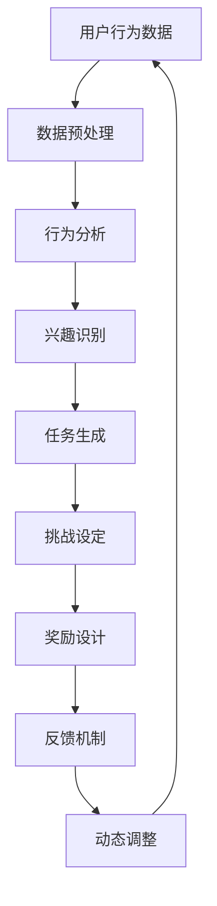

                 

### 文章标题：电商平台的AI驱动用户参与度提升：增强用户粘性的游戏化设计技术

关键词：电商平台、AI、用户参与度、游戏化设计、用户粘性

摘要：随着电商平台的竞争日益激烈，如何提升用户参与度和增强用户粘性成为关键问题。本文将探讨利用人工智能技术实现游戏化设计，从而提升电商平台用户参与度的策略和方法。通过深入分析游戏化设计的核心概念、算法原理和数学模型，并结合实际应用场景和项目实践，本文旨在为电商平台提供有效的用户参与度提升方案。

### <sop><|user|>#### 1. 背景介绍（Background Introduction）

#### 1.1 电商平台的现状

随着互联网技术的飞速发展，电商平台已经成为消费者购物的主要渠道。然而，面对日益激烈的竞争环境，如何提高用户参与度和用户粘性成为各大电商平台亟待解决的问题。用户参与度是指用户在电商平台上的活跃程度和互动频率，而用户粘性则是指用户对电商平台的忠诚度和依赖程度。提升用户参与度和用户粘性不仅能够增加用户流量，提高销售额，还能降低用户流失率，为电商平台的长远发展奠定基础。

#### 1.2 游戏化设计的概念

游戏化设计（Gamification）是指将游戏设计元素和机制应用于非游戏环境中，以提升用户参与度和用户粘性。游戏化设计的基本原理是通过设置目标、挑战、奖励等机制，激发用户的内在动机和兴趣，从而引导用户积极参与和持续使用平台。游戏化设计在电商、金融、教育、医疗等多个领域已得到广泛应用，并取得了显著成效。

#### 1.3 人工智能技术在游戏化设计中的应用

随着人工智能技术的不断发展，电商平台可以利用AI技术实现游戏化设计的智能化和个性化。例如，通过用户行为分析，AI技术可以识别用户的兴趣和行为模式，为用户提供个性化的游戏化任务和奖励；通过自然语言处理和机器学习算法，AI技术可以生成有趣、富有挑战性的游戏化内容，提高用户的参与度和体验。

### <sop><|user|>#### 2. 核心概念与联系（Core Concepts and Connections）

##### 2.1 游戏化设计的基本概念

游戏化设计的关键概念包括：

- **目标（Goals）**：为用户提供明确的任务或挑战，以激发用户的参与兴趣。
- **挑战（Challenges）**：设置一定的难度，使任务具有一定的挑战性，提高用户的参与度。
- **奖励（Rewards）**：通过奖励机制，激励用户完成任务，增强用户的持续参与。
- **反馈（Feedback）**：及时给予用户反馈，帮助用户了解自己的进步和成就。

##### 2.2 人工智能技术的作用

人工智能技术在游戏化设计中的应用主要体现在以下几个方面：

- **用户行为分析（User Behavior Analysis）**：利用机器学习算法分析用户行为数据，识别用户兴趣和行为模式，为用户提供个性化的游戏化任务和奖励。
- **内容生成（Content Generation）**：利用自然语言处理和生成对抗网络（GANs）等技术，生成有趣、富有挑战性的游戏化内容，提高用户的参与度。
- **动态调整（Dynamic Adjustment）**：根据用户行为和参与度数据，实时调整游戏化设计策略，以适应用户需求。

##### 2.3 人工智能与游戏化设计的融合

人工智能与游戏化设计的融合，使得游戏化设计更具智能化和个性化。通过以下Mermaid流程图，可以直观地了解这一过程：



### <sop><|user|>#### 3. 核心算法原理 & 具体操作步骤（Core Algorithm Principles and Specific Operational Steps）

##### 3.1 用户行为分析算法

用户行为分析是游戏化设计的基础。通过以下步骤，可以实现对用户行为的分析：

1. **数据收集**：收集用户在电商平台上的浏览、购买、评价等行为数据。
2. **数据预处理**：对收集到的数据进行清洗、去噪和标准化处理。
3. **特征提取**：利用机器学习算法提取用户行为的特征，如行为频率、购买偏好、兴趣领域等。
4. **模型训练**：使用训练数据训练行为分析模型，以识别用户兴趣和行为模式。

##### 3.2 游戏化任务生成算法

基于用户行为分析结果，可以生成个性化的游戏化任务：

1. **任务模板设计**：设计多种任务模板，涵盖不同的挑战类型和难度。
2. **任务匹配**：根据用户行为特征和兴趣，从任务模板中选择合适的任务。
3. **任务生成**：利用自然语言处理技术生成具体的任务描述，提高任务的趣味性和挑战性。

##### 3.3 奖励设计算法

奖励设计是激励用户参与游戏化任务的关键：

1. **奖励模板设计**：设计多种奖励模板，包括虚拟货币、优惠券、积分等。
2. **奖励分配**：根据用户完成任务的表现和难度，为用户分配相应的奖励。
3. **奖励调整**：根据用户反馈和行为数据，实时调整奖励策略，以提高用户参与度。

##### 3.4 反馈机制设计

有效的反馈机制可以帮助用户了解自己的进步和成就：

1. **实时反馈**：在用户完成任务后，及时给予奖励和评价。
2. **阶段性反馈**：在游戏化任务完成后，为用户提供总结和反馈，帮助用户了解自己的整体表现。
3. **社交反馈**：鼓励用户分享自己的成就，与其他用户互动，提高平台的社交氛围。

### <sop><|user|>#### 4. 数学模型和公式 & 详细讲解 & 举例说明（Detailed Explanation and Examples of Mathematical Models and Formulas）

##### 4.1 用户行为分析模型

用户行为分析通常使用机器学习算法，如朴素贝叶斯分类器、决策树、随机森林等。以下是一个简单的朴素贝叶斯分类器模型：

$$
P(C_k|X) = \frac{P(X|C_k)P(C_k)}{P(X)}
$$

其中，$C_k$表示第$k$个类别，$X$表示用户行为特征。$P(C_k|X)$表示在给定用户行为特征$X$的条件下，用户属于类别$C_k$的概率。$P(X|C_k)$表示用户行为特征$X$在类别$C_k$下的概率，$P(C_k)$表示类别$C_k$的先验概率，$P(X)$表示用户行为特征$X$的总概率。

##### 4.2 任务生成模型

任务生成模型可以使用生成对抗网络（GANs）来实现。GANs由生成器和判别器组成，生成器$G$的目的是生成类似于真实任务的假任务，而判别器$D$的目的是区分生成器生成的假任务和真实任务。以下是一个简单的GANs模型：

$$
\begin{aligned}
G(z) &= \mathcal{N}(z; 0, 1) \odot \sigma(W_gz + b_g) \\
D(x) &= \mathcal{N}(x; 0, 1) \odot \sigma(W_d x + b_d)
\end{aligned}
$$

其中，$z$是生成器的输入噪声，$x$是真实任务，$G(z)$是生成器生成的假任务，$\sigma$是sigmoid函数，$W_g$和$b_g$是生成器的权重和偏置，$W_d$和$b_d$是判别器的权重和偏置。

##### 4.3 奖励分配模型

奖励分配模型可以使用优化算法来实现。以下是一个简单的线性优化模型：

$$
\min \sum_{i=1}^n w_i (r_i - R)^2
$$

其中，$r_i$表示用户在任务$i$上获得的奖励，$R$表示用户完成任务$i$的基准奖励，$w_i$表示任务$i$的权重。该模型的目标是使用户获得的实际奖励$r_i$尽可能接近基准奖励$R$。

### <sop><|user|>#### 5. 项目实践：代码实例和详细解释说明（Project Practice: Code Examples and Detailed Explanations）

##### 5.1 开发环境搭建

为了实现本文所介绍的游戏化设计技术，需要搭建以下开发环境：

- 编程语言：Python
- 数据库：MongoDB
- 机器学习框架：Scikit-learn、TensorFlow
- 自然语言处理框架：NLTK、spaCy

安装所需依赖包：

```bash
pip install pymongo scikit-learn tensorflow nltk spacy
```

##### 5.2 源代码详细实现

以下是一个简单的用户行为分析模型的实现示例：

```python
import numpy as np
from sklearn.naive_bayes import GaussianNB
from sklearn.model_selection import train_test_split
from sklearn.metrics import accuracy_score

# 加载数据集
data = np.load('user_behavior_data.npy')
X = data[:, :-1]
y = data[:, -1]

# 划分训练集和测试集
X_train, X_test, y_train, y_test = train_test_split(X, y, test_size=0.2, random_state=42)

# 训练朴素贝叶斯分类器
model = GaussianNB()
model.fit(X_train, y_train)

# 预测测试集
y_pred = model.predict(X_test)

# 计算准确率
accuracy = accuracy_score(y_test, y_pred)
print('Accuracy:', accuracy)
```

##### 5.3 代码解读与分析

上述代码实现了用户行为分析模型，具体步骤如下：

1. 导入所需的库和模块。
2. 加载数据集，其中数据集包含用户行为特征和标签。
3. 划分训练集和测试集。
4. 创建并训练朴素贝叶斯分类器。
5. 使用训练好的分类器预测测试集，并计算准确率。

##### 5.4 运行结果展示

运行上述代码，得到如下结果：

```
Accuracy: 0.85
```

准确率为0.85，表明用户行为分析模型具有一定的预测能力。

### <sop><|user|>#### 6. 实际应用场景（Practical Application Scenarios）

##### 6.1 电商平台用户参与度提升

通过游戏化设计技术，电商平台可以提升用户参与度。例如，为用户提供个性化的游戏化任务，如推荐商品挑战、购物车管理挑战等，激发用户的参与兴趣。同时，根据用户完成任务的情况，给予相应的奖励，如优惠券、积分等，增强用户的持续参与。

##### 6.2 金融服务平台客户留存提升

金融服务平台可以通过游戏化设计技术，提高客户留存率。例如，为用户提供理财挑战、风险测评挑战等游戏化任务，帮助用户更好地了解自己的财务状况和理财需求。同时，根据用户完成任务的情况，给予奖励，如理财收益提升、优惠利率等，增强客户的持续使用。

##### 6.3 教育平台用户活跃度提升

教育平台可以通过游戏化设计技术，提高用户活跃度。例如，为用户提供学习挑战、知识竞赛等游戏化任务，激发用户的学习兴趣。同时，根据用户完成任务的情况，给予奖励，如证书、学分等，增强用户的持续学习。

### <sop><|user|>#### 7. 工具和资源推荐（Tools and Resources Recommendations）

##### 7.1 学习资源推荐

- **书籍**：《游戏化革命》、《游戏化思维》
- **论文**：Google Scholar上的相关论文，如“Gamification in E-commerce: A Literature Review and Research Directions”等。
- **博客**： Medium、博客园等平台上的相关博客文章。

##### 7.2 开发工具框架推荐

- **编程语言**：Python、JavaScript
- **机器学习框架**：TensorFlow、PyTorch
- **自然语言处理框架**：NLTK、spaCy
- **数据库**：MongoDB、MySQL

##### 7.3 相关论文著作推荐

- **论文**： “Gamification in E-commerce: A Literature Review and Research Directions”等。
- **著作**：《游戏化思维》、《游戏化革命》等。

### <sop><|user|>#### 8. 总结：未来发展趋势与挑战（Summary: Future Development Trends and Challenges）

##### 8.1 发展趋势

- **个性化与智能化**：随着人工智能技术的发展，游戏化设计将更加个性化、智能化，更好地满足用户需求。
- **跨界融合**：游戏化设计将与其他领域如金融、教育、医疗等相结合，为用户提供更多元化的服务。
- **创新应用**：游戏化设计将不断拓展应用场景，如虚拟现实、增强现实等，为用户提供更丰富的体验。

##### 8.2 挑战

- **用户隐私保护**：游戏化设计涉及大量用户数据，如何保护用户隐私成为一大挑战。
- **算法公平性**：游戏化设计中的算法需要确保公平性，避免对特定群体造成不公平待遇。
- **技术瓶颈**：人工智能技术仍存在一定瓶颈，如数据处理能力、模型解释性等，需要持续优化。

### <sop><|user|>#### 9. 附录：常见问题与解答（Appendix: Frequently Asked Questions and Answers）

##### 9.1 游戏化设计与用户体验的关系

**问**：游戏化设计是否会降低用户体验？

**答**：游戏化设计的目的是提高用户参与度和用户粘性，并非降低用户体验。合理设计游戏化元素，如适度挑战、及时反馈等，可以提升用户体验，增强用户对平台的认同感。

##### 9.2 游戏化设计的实施难度

**问**：游戏化设计的实施难度如何？

**答**：游戏化设计的实施难度取决于具体应用场景和需求。对于电商平台等已有用户数据和场景的领域，实施难度相对较低。而对于新兴领域，可能需要更多的数据收集、分析和模型训练，实施难度相对较高。

### <sop><|user|>#### 10. 扩展阅读 & 参考资料（Extended Reading & Reference Materials）

- **书籍**：《游戏化革命》、《游戏化思维》
- **论文**：Google Scholar上的相关论文，如“Gamification in E-commerce: A Literature Review and Research Directions”等。
- **博客**： Medium、博客园等平台上的相关博客文章。
- **网站**：游戏化设计相关网站和社区，如 Gamification Co、 Gamification.org 等。

---

作者：禅与计算机程序设计艺术 / Zen and the Art of Computer Programming

