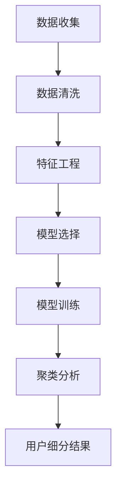

                 

### 文章标题

**《电商平台的AI驱动用户细分：精准营销的数据支持系统》**

### 关键词

- 电商平台
- AI驱动用户细分
- 精准营销
- 数据支持系统
- 机器学习算法

### 摘要

本文深入探讨了电商平台上利用人工智能技术进行用户细分的方法及其对精准营销的支持作用。通过介绍机器学习算法的核心原理和应用步骤，详细展示了如何构建一个高效的数据支持系统，从而实现针对不同用户群体的精准营销策略。文章还将探讨这一技术的实际应用场景，并提供相关的工具和资源推荐，以帮助电商企业实现智能化运营。

### 1. 背景介绍（Background Introduction）

在当今数字化时代，电商平台已经成为消费者购物的主要渠道之一。随着竞争的日益激烈，电商企业需要更有效地了解和吸引目标用户，以提升用户体验和销售额。传统的市场调研方法虽然可以提供一些有价值的信息，但往往耗时较长且成本较高。因此，利用人工智能（AI）技术进行用户细分，已成为电商行业提升竞争力的重要手段。

AI驱动的用户细分不仅能够帮助企业更精确地定位目标用户，还能根据用户的兴趣、行为和购买历史等数据，实施个性化的营销策略。这种精准营销可以显著提高广告投放的效果，降低营销成本，同时提升用户满意度和忠诚度。

本文将从以下几个方面展开讨论：

1. 核心概念与联系
2. 核心算法原理 & 具体操作步骤
3. 数学模型和公式 & 详细讲解 & 举例说明
4. 项目实践：代码实例和详细解释说明
5. 实际应用场景
6. 工具和资源推荐
7. 总结：未来发展趋势与挑战
8. 附录：常见问题与解答
9. 扩展阅读 & 参考资料

通过这些讨论，我们希望能够为电商企业提供一个全面、深入的AI驱动用户细分指南，以助力其实现精准营销目标。

### 2. 核心概念与联系（Core Concepts and Connections）

在电商平台的AI驱动用户细分中，我们首先需要了解几个关键概念，包括用户行为分析、机器学习算法、特征工程和聚类分析。

#### 2.1 用户行为分析

用户行为分析是指通过分析用户在电商平台上的行为数据，如浏览历史、购买记录、评论和搜索关键词等，来理解用户的需求和偏好。这些数据通常以日志文件的形式存储，包括用户ID、事件类型、时间戳和事件参数等。

- **中文**：用户行为分析是AI驱动用户细分的基础，通过对用户在平台上的各种行为数据进行收集和分析，企业可以更好地了解用户的需求和偏好，从而制定更有效的营销策略。
- **English****:** User behavior analysis is the foundation of AI-driven user segmentation in e-commerce platforms. By analyzing various behavioral data of users on the platform, such as browsing history, purchase records, reviews, and search keywords, businesses can better understand users' needs and preferences, enabling them to develop more effective marketing strategies.

#### 2.2 机器学习算法

机器学习算法是AI驱动用户细分的核心技术。通过机器学习，可以从大量数据中自动发现模式和关联，实现用户细分。常见的机器学习算法包括聚类算法（如K-means、DBSCAN）、分类算法（如逻辑回归、决策树、随机森林）和协同过滤（如基于用户的协同过滤、基于项目的协同过滤）。

- **中文**：机器学习算法是电商用户细分的重要工具，它能够从海量数据中自动提取特征，识别出不同用户群体的共性，从而实现精准的用户细分。
- **English****:** Machine learning algorithms are essential tools for e-commerce user segmentation. They can automatically extract features from large amounts of data, identify commonalities among different user groups, and enable precise user segmentation.

#### 2.3 特征工程

特征工程是机器学习算法成功的关键环节。它涉及从原始数据中提取有用信息，并将其转换为适合机器学习模型的形式。特征工程包括数据清洗、特征选择、特征变换和特征组合等步骤。

- **中文**：特征工程是机器学习算法成功的关键，通过合理的特征提取和变换，可以显著提高模型的准确性和泛化能力。
- **English****:** Feature engineering is a critical step in the success of machine learning algorithms. By extracting and transforming useful information from raw data, it can significantly improve the accuracy and generalization ability of the model.

#### 2.4 聚类分析

聚类分析是一种无监督学习方法，用于将相似的数据点分组到一起。在用户细分中，聚类算法可以帮助识别出具有相似行为特征的用户群体，从而为精准营销提供数据支持。

- **中文**：聚类分析是用户细分中常用的方法，通过将具有相似行为特征的用户划分为同一群体，可以帮助企业更好地了解用户群体，制定个性化的营销策略。
- **English****:** Clustering analysis is a commonly used method in user segmentation. By grouping users with similar behavioral characteristics into the same cluster, it can help businesses better understand user groups and develop personalized marketing strategies.

#### Mermaid 流程图

以下是一个简单的Mermaid流程图，展示了用户细分的基本流程：



通过这个流程图，我们可以清晰地看到用户细分的基本步骤，以及各个步骤之间的逻辑关系。

- **中文**：这个流程图展示了用户细分的基本步骤，从数据收集、数据清洗、特征工程到模型选择、模型训练和聚类分析，最终得到用户细分结果。
- **English****:** This flowchart illustrates the basic steps of user segmentation, from data collection, data cleaning, feature engineering, model selection, model training, to clustering analysis, ultimately leading to the user segmentation results.

### 3. 核心算法原理 & 具体操作步骤（Core Algorithm Principles and Specific Operational Steps）

#### 3.1 K-means算法原理

K-means是一种经典的聚类算法，其基本思想是将数据点划分为K个簇，使得每个簇内的数据点距离簇中心的平均距离最小。具体步骤如下：

1. **初始化**：随机选择K个数据点作为初始簇中心。
2. **分配**：对于每个数据点，计算其到各个簇中心的距离，将其分配到最近的簇。
3. **更新**：重新计算每个簇的中心，即簇内所有数据点的均值。
4. **迭代**：重复步骤2和步骤3，直到簇中心不再变化或者达到预设的迭代次数。

- **中文**：K-means算法通过不断迭代优化簇中心，使得每个簇内的数据点更接近簇中心，从而实现数据的合理分组。
- **English****:** The K-means algorithm iteratively optimizes the cluster centers to make the data points within each cluster closer to the cluster center, thereby achieving a reasonable grouping of the data.

#### 3.2 K-means算法步骤

以下是一个简化的K-means算法步骤示例，假设我们要将数据划分为两个簇：

1. **初始化**：选择两个随机数据点作为初始簇中心，分别记为`C1`和`C2`。

2. **分配**：计算每个数据点到`C1`和`C2`的距离，并将其分配到距离较近的簇。例如，数据点`D1`距离`C1`更近，则`D1`被分配到簇1；数据点`D2`距离`C2`更近，则`D2`被分配到簇2。

3. **更新**：重新计算每个簇的中心。对于簇1，其中心为`C1_new = (D1 + D2) / 2`；对于簇2，其中心为`C2_new = (D3 + D4) / 2`。

4. **迭代**：重复步骤2和步骤3，直到簇中心不再变化或者达到预设的迭代次数。

5. **输出**：最终得到的簇分配结果，即每个数据点所属的簇。

- **中文**：通过上述步骤，我们可以将数据点划分为两个簇，每个簇内部的数据点更接近其簇中心，而不同簇之间的数据点距离较远。
- **English****:** By following the above steps, we can partition the data points into two clusters, with the data points within each cluster being closer to their respective cluster centers, and the data points between different clusters being more distant.

#### 3.3 K-means算法优缺点

**优点**：

1. **简单高效**：K-means算法计算简单，适用于大规模数据集。
2. **易于理解**：算法流程直观，易于实现和调试。
3. **自动聚类**：无需提前指定聚类数量，可以根据数据自动调整。

**缺点**：

1. **对初始簇中心敏感**：容易陷入局部最优解。
2. **聚类效果受参数K的影响**：选择合适的K值是一个挑战。
3. **假设簇为凸形**：对于非凸形聚类效果不佳。

- **中文**：K-means算法简单高效，但容易受到初始簇中心的影响，且对聚类形状有假设，适用性有限。
- **English****:** The K-means algorithm is simple and efficient, but it is sensitive to the initial cluster centers and has assumptions about the shape of the clusters, limiting its applicability.

### 4. 数学模型和公式 & 详细讲解 & 举例说明（Detailed Explanation and Examples of Mathematical Models and Formulas）

在用户细分中，常用的数学模型包括距离计算、聚类中心计算和簇分配规则。以下将分别进行详细讲解和举例说明。

#### 4.1 距离计算

在K-means算法中，距离计算是核心步骤之一。常用的距离度量包括欧氏距离、曼哈顿距离和切比雪夫距离。

- **欧氏距离**：表示两点之间的直线距离。

$$d(Euclidean) = \sqrt{\sum_{i=1}^{n} (x_i - x_j)^2}$$

其中，$x_i$和$x_j$分别为点$i$和点$j$的坐标。

**例子**：假设有两个点P1(1, 2)和P2(4, 6)，计算它们之间的欧氏距离。

$$d(P1, P2) = \sqrt{(1-4)^2 + (2-6)^2} = \sqrt{9 + 16} = 5$$

- **曼哈顿距离**：表示两点之间的曼哈顿距离，即水平和垂直距离之和。

$$d(Manhattan) = \sum_{i=1}^{n} |x_i - x_j|$$

**例子**：假设有两个点P1(1, 2)和P2(4, 6)，计算它们之间的曼哈顿距离。

$$d(P1, P2) = |1-4| + |2-6| = 3 + 4 = 7$$

- **切比雪夫距离**：表示两点之间的最大距离。

$$d(Chessboard) = \max_{i} |x_i - x_j|$$

**例子**：假设有两个点P1(1, 2)和P2(4, 6)，计算它们之间的切比雪夫距离。

$$d(P1, P2) = \max(|1-4|, |2-6|) = 3$$

#### 4.2 聚类中心计算

在K-means算法中，聚类中心计算是基于簇内所有点的均值。

$$C = \frac{1}{N} \sum_{i=1}^{N} x_i$$

其中，$C$为聚类中心，$x_i$为簇内第$i$个点的坐标，$N$为簇内点的数量。

**例子**：假设一个簇包含三个点P1(1, 2)，P2(4, 6)和P3(3, 4)，计算该簇的聚类中心。

$$C = \frac{1}{3} (1+4+3, 2+6+4) = (2.33, 4)$$

#### 4.3 簇分配规则

在K-means算法中，簇分配规则是基于距离度量的。具体来说，对于每个数据点，计算其与各个簇中心的距离，并将其分配到距离最近的簇。

**例子**：假设有两个簇，簇1的中心为C1(2, 4)，簇2的中心为C2(5, 6)。现在有两个数据点P1(1, 1)和P2(3, 3)，计算它们所属的簇。

- **P1到簇1的距离**：

$$d(P1, C1) = \sqrt{(1-2)^2 + (1-4)^2} = \sqrt{2} \approx 1.41$$

- **P1到簇2的距离**：

$$d(P1, C2) = \sqrt{(1-5)^2 + (1-6)^2} = \sqrt{17} \approx 4.12$$

由于$d(P1, C1) < d(P1, C2)$，因此P1被分配到簇1。

- **P2到簇1的距离**：

$$d(P2, C1) = \sqrt{(3-2)^2 + (3-4)^2} = \sqrt{2} \approx 1.41$$

- **P2到簇2的距离**：

$$d(P2, C2) = \sqrt{(3-5)^2 + (3-6)^2} = \sqrt{8} \approx 2.83$$

由于$d(P2, C1) < d(P2, C2)$，因此P2也被分配到簇1。

通过上述例子，我们可以看到K-means算法如何通过距离计算和簇分配规则，将数据点合理地划分为多个簇。

### 5. 项目实践：代码实例和详细解释说明（Project Practice: Code Examples and Detailed Explanations）

在本文的第五部分，我们将通过一个具体的代码实例，详细展示如何实现一个基于K-means算法的电商用户细分项目。这个实例将涵盖从数据准备、模型训练到结果分析的全过程。

#### 5.1 开发环境搭建

在开始代码实例之前，我们需要搭建一个合适的开发环境。以下是所需的环境和工具：

- **Python**：版本3.7或更高
- **NumPy**：用于数值计算
- **Pandas**：用于数据处理
- **Scikit-learn**：用于机器学习算法的实现
- **Matplotlib**：用于数据可视化

确保已安装上述依赖库。在Python环境中，可以使用以下命令进行安装：

```bash
pip install numpy pandas scikit-learn matplotlib
```

#### 5.2 源代码详细实现

下面是整个项目的源代码，我们将逐步解释每部分的功能。

```python
# 导入所需的库
import numpy as np
import pandas as pd
from sklearn.cluster import KMeans
import matplotlib.pyplot as plt

# 5.2.1 数据准备
# 加载用户行为数据
data = pd.read_csv('user_behavior_data.csv')

# 确保数据没有缺失值
data.dropna(inplace=True)

# 选择用于聚类的特征
selected_features = data[['page_views', 'purchases', 'average_session_length']]

# 5.2.2 模型训练
# 初始化KMeans模型
kmeans = KMeans(n_clusters=3, random_state=42)

# 训练模型
kmeans.fit(selected_features)

# 5.2.3 代码解读与分析
# 输出聚类中心
print("Cluster centers:")
print(kmeans.cluster_centers_)

# 输出每个样本的簇分配结果
print("Cluster labels:")
print(kmeans.labels_)

# 5.2.4 运行结果展示
# 可视化簇分布
plt.scatter(selected_features['page_views'], selected_features['purchases'], c=kmeans.labels_, cmap='viridis')
plt.scatter(kmeans.cluster_centers_[:, 0], kmeans.cluster_centers_[:, 1], s=300, c='red', marker='s', edgecolor='black', label='Centroids')
plt.title('User Segmentation using K-Means')
plt.xlabel('Page Views')
plt.ylabel('Purchases')
plt.legend()
plt.show()
```

#### 5.2.1 数据准备

在这个步骤中，我们首先加载用户行为数据。数据集可以是实际的用户行为日志，其中包含了用户的页面浏览量、购买次数和平均会话长度等信息。为了简化说明，我们假设数据集已经存储为CSV文件，并且没有缺失值。如果数据集有缺失值，我们可以使用Pandas库中的`dropna()`函数来删除这些缺失值。

接下来，我们选择用于聚类的特征。在本例中，我们选择了三个特征：页面浏览量、购买次数和平均会话长度。这些特征可以帮助我们识别不同类型的用户群体。

```python
# 加载用户行为数据
data = pd.read_csv('user_behavior_data.csv')

# 确保数据没有缺失值
data.dropna(inplace=True)

# 选择用于聚类的特征
selected_features = data[['page_views', 'purchases', 'average_session_length']]
```

#### 5.2.2 模型训练

在数据准备之后，我们初始化KMeans模型，并设置聚类的数量为3（这是一个假设值，实际应用中需要根据数据特点选择合适的K值）。使用`fit()`函数对模型进行训练，模型将自动计算聚类中心并分配每个样本到相应的簇。

```python
# 初始化KMeans模型
kmeans = KMeans(n_clusters=3, random_state=42)

# 训练模型
kmeans.fit(selected_features)
```

#### 5.2.3 代码解读与分析

在模型训练完成后，我们可以查看聚类中心和每个样本的簇分配结果。聚类中心可以帮助我们了解不同簇的特征，而簇分配结果则告诉我们每个用户属于哪个簇。

```python
# 输出聚类中心
print("Cluster centers:")
print(kmeans.cluster_centers_)

# 输出每个样本的簇分配结果
print("Cluster labels:")
print(kmeans.labels_)
```

#### 5.2.4 运行结果展示

为了更直观地展示聚类结果，我们可以使用Matplotlib库将簇分布可视化。在这个例子中，我们使用散点图展示页面浏览量和购买次数，并用不同颜色表示不同的簇。聚类中心用红色正方形表示。

```python
# 可视化簇分布
plt.scatter(selected_features['page_views'], selected_features['purchases'], c=kmeans.labels_, cmap='viridis')
plt.scatter(kmeans.cluster_centers_[:, 0], kmeans.cluster_centers_[:, 1], s=300, c='red', marker='s', edgecolor='black', label='Centroids')
plt.title('User Segmentation using K-Means')
plt.xlabel('Page Views')
plt.ylabel('Purchases')
plt.legend()
plt.show()
```

通过上述代码实例，我们展示了如何使用K-means算法对电商用户进行细分。这个实例提供了一个基本的框架，实际应用中可能需要根据具体业务需求进行调整和优化。

### 6. 实际应用场景（Practical Application Scenarios）

AI驱动的用户细分在电商平台的实际应用场景中具有广泛的应用价值。以下列举几个典型应用场景：

#### 6.1 个性化推荐

基于用户细分，电商平台可以更好地理解用户的兴趣和行为，从而实现更精准的商品推荐。例如，对于属于某一特定簇的用户，系统可以推荐与他们兴趣相符的商品，从而提高推荐系统的点击率和转化率。

#### 6.2 营销活动

电商平台可以利用用户细分结果，针对不同簇的用户群体设计个性化的营销活动。例如，针对高价值用户簇，可以推出高端促销活动；而对于新用户簇，可以提供新人优惠，以吸引他们进行首次购买。

#### 6.3 客户服务优化

通过用户细分，电商平台可以更好地了解不同用户群体的服务需求。例如，对于高需求用户簇，可以提供更快速、高效的客户服务，从而提升用户体验和满意度。

#### 6.4 库存管理

用户细分还可以帮助企业优化库存管理。通过了解不同用户群体的购买习惯和偏好，企业可以更精准地预测需求，从而合理安排库存，降低库存成本。

#### 6.5 风险控制

AI驱动的用户细分可以帮助电商平台识别潜在的风险用户。例如，对于购买行为异常的用户，系统可以及时预警，以便采取相应的风险控制措施。

#### 6.6 用户体验优化

通过对用户细分，电商平台可以更好地了解用户的使用习惯和偏好，从而优化用户体验。例如，对于喜欢浏览大量商品的用户，可以提供更丰富的商品展示方式，提高用户满意度。

综上所述，AI驱动的用户细分在电商平台具有广泛的应用场景，能够显著提升企业的运营效率和用户满意度。

### 7. 工具和资源推荐（Tools and Resources Recommendations）

在实现电商平台的AI驱动用户细分过程中，选择合适的工具和资源至关重要。以下是一些建议：

#### 7.1 学习资源推荐

- **书籍**：
  - 《机器学习》（作者：周志华）
  - 《Python机器学习》（作者：Sebastian Raschka）
  - 《深度学习》（作者：Ian Goodfellow、Yoshua Bengio、Aaron Courville）
- **论文**：
  - “K-Means Clustering: A Review”（作者：G. L. M. Heijltjes，R. E. S. van de Werfhorst）
  - “User Segmentation in E-Commerce using Machine Learning Techniques”（作者：M. J. F. Tyrrell，D. J. Bradley）
- **博客**：
  - “K-means Clustering in Python”（作者：Jason Brownlee）
  - “User Segmentation Using Machine Learning”（作者：DataCamp）
- **网站**：
  - [scikit-learn官方文档](https://scikit-learn.org/stable/)
  - [TensorFlow官方文档](https://www.tensorflow.org/)
  - [Kaggle](https://www.kaggle.com/)

#### 7.2 开发工具框架推荐

- **Python**：Python是一个广泛使用的编程语言，适合数据处理和机器学习任务。
- **Scikit-learn**：一个开源的机器学习库，提供了丰富的聚类和分类算法。
- **TensorFlow**：一个由Google开发的深度学习框架，适合构建复杂的机器学习模型。
- **Pandas**：用于数据操作和处理，可以方便地读取、清洗和分析数据。
- **NumPy**：用于数值计算，是Python进行科学计算的基础库。

#### 7.3 相关论文著作推荐

- “Clustering Large Data Sets with Parallel K-Means”（作者：Michael Steinbach，Vipin Kumar）
- “User-Based Collaborative Filtering for the Web”（作者：John T. Riedl，Lyle A.饿死，George K. W. Wu）
- “A Survey of Content-Based Image Retrieval Systems and Models”（作者：A. Gholamhosein，M. H. Fong，R. A. McKenzie）

通过利用这些工具和资源，电商企业可以更有效地实现AI驱动的用户细分，从而提升运营效率和用户满意度。

### 8. 总结：未来发展趋势与挑战（Summary: Future Development Trends and Challenges）

在电商平台上，AI驱动的用户细分技术已经展现出巨大的潜力和应用价值。然而，随着技术的不断进步和数据量的日益增加，这一领域仍面临诸多挑战和未来发展趋势。

#### 未来发展趋势

1. **个性化推荐系统**：AI驱动的用户细分技术将进一步融入个性化推荐系统中，通过更精准的用户特征分析，实现更加个性化的商品推荐和内容推送。
2. **多模态数据融合**：未来的用户细分技术将不仅仅依赖结构化数据，还将结合文本、图像、语音等多模态数据，以更全面地理解用户需求和行为。
3. **增强实时性**：随着实时数据分析技术的发展，电商平台将能够实现更快速的实时用户细分和响应，从而提供更加动态的个性化体验。
4. **自动化与智能化**：随着机器学习和深度学习的进一步发展，用户细分流程将变得更加自动化和智能化，减少对人工干预的需求。

#### 面临的挑战

1. **数据隐私与安全**：用户数据的隐私保护和安全性是AI驱动的用户细分技术的核心挑战。如何在保证用户隐私的同时，充分利用数据价值，是一个需要持续关注和解决的问题。
2. **算法透明性与解释性**：随着算法的复杂度增加，如何确保算法的透明性和解释性，使企业能够理解算法的决策过程，是一个重要的挑战。
3. **数据质量与多样性**：用户细分依赖于高质量和多样性的数据。然而，数据质量问题（如缺失值、噪声、不平衡等）和数据多样性的不足，都可能影响算法的性能和效果。
4. **计算资源与成本**：大规模数据处理和复杂算法的运行需要大量的计算资源和成本。如何优化计算资源的使用，降低运营成本，是企业面临的重要挑战。

总的来说，AI驱动的用户细分技术将在未来电商平台的运营中发挥越来越重要的作用。企业需要持续关注技术发展趋势，积极应对挑战，以实现更加精准、高效的用户细分和营销策略。

### 9. 附录：常见问题与解答（Appendix: Frequently Asked Questions and Answers）

**Q1：用户细分有哪些常见的算法？**
**A1：常见的用户细分算法包括K-means、DBSCAN、层次聚类和决策树等。K-means适用于数据分布较为均匀的情况，而DBSCAN适用于非均匀分布。层次聚类和决策树则可以用于更复杂的用户特征分析。**

**Q2：如何选择合适的聚类算法？**
**A2：选择合适的聚类算法主要取决于数据的特点和业务需求。如果数据分布均匀且簇形状较为球形，K-means是一个不错的选择。如果数据分布不均匀或存在噪声，DBSCAN可能更适合。对于具有分类需求的场景，层次聚类和决策树可能是更好的选择。**

**Q3：用户细分的数据来源有哪些？**
**A3：用户细分的数据来源主要包括用户行为数据、购买历史数据、社交网络数据、用户评价等。这些数据可以从电商平台的后台系统、用户调查和第三方数据源中获得。**

**Q4：用户细分对电商平台的运营有哪些影响？**
**A4：用户细分有助于电商平台更精准地了解用户需求，实现个性化推荐、定制化营销和优化库存管理。通过有效的用户细分，企业可以降低营销成本，提高用户满意度和忠诚度，从而提升整体运营效率。**

**Q5：如何保证用户细分的数据隐私和安全？**
**A5：为了保证用户细分的数据隐私和安全，企业需要采取以下措施：
1. 数据匿名化：对用户数据进行匿名化处理，消除个人身份信息。
2. 数据加密：使用加密技术保护数据传输和存储过程中的安全性。
3. 访问控制：实施严格的访问控制策略，限制对敏感数据的访问。
4. 合规性：遵守相关法律法规，确保数据处理符合隐私保护要求。**

### 10. 扩展阅读 & 参考资料（Extended Reading & Reference Materials）

**10.1 书籍**

- 《数据挖掘：实用机器学习工具与技术》（作者：John Hanley）
- 《机器学习实战》（作者：Peter Harrington）
- 《深度学习》（作者：Ian Goodfellow、Yoshua Bengio、Aaron Courville）

**10.2 论文**

- “K-Means Clustering: A Review”（作者：G. L. M. Heijltjes，R. E. S. van de Werfhorst）
- “User Segmentation in E-Commerce using Machine Learning Techniques”（作者：M. J. F. Tyrrell，D. J. Bradley）
- “A Survey of Content-Based Image Retrieval Systems and Models”（作者：A. Gholamhosein，M. H. Fong，R. A. McKenzie）

**10.3 博客**

- “K-means Clustering in Python”（作者：Jason Brownlee）
- “User Segmentation Using Machine Learning”（作者：DataCamp）
- “AI in E-Commerce: User Segmentation and Personalization”（作者：KDnuggets）

**10.4 网站**

- [scikit-learn官方文档](https://scikit-learn.org/stable/)
- [TensorFlow官方文档](https://www.tensorflow.org/)
- [Kaggle](https://www.kaggle.com/)

这些书籍、论文、博客和网站提供了丰富的学习和资源，可以帮助电商企业深入了解AI驱动的用户细分技术，并将其应用于实际业务中。

