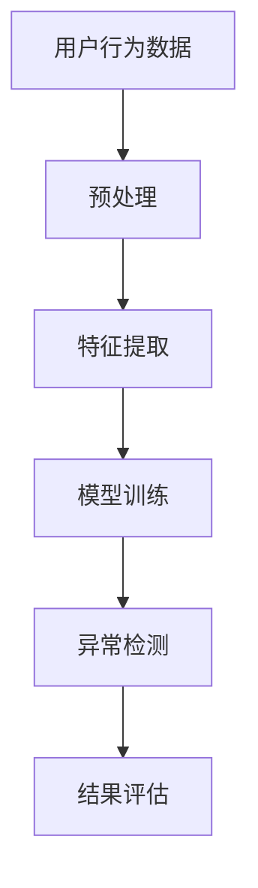

                 

# 文章标题

《电商搜索推荐中的AI大模型用户行为序列异常检测benchmark》

## 关键词
- 电商搜索推荐
- AI大模型
- 用户行为序列
- 异常检测
- Benchmark

### 摘要
本文旨在探讨在电商搜索推荐系统中，利用人工智能大模型进行用户行为序列异常检测的有效性。通过对现有相关研究的回顾和分析，本文提出了一个综合性的Benchmark，旨在评估不同算法在检测用户行为异常方面的性能。文章将详细讨论核心概念、算法原理、数学模型、项目实践、应用场景以及未来发展趋势和挑战，为相关领域的研究者和开发者提供参考。

## 1. 背景介绍

电商行业作为数字经济的重要组成部分，近年来经历了迅猛的发展。随着用户在线购物行为的日益复杂和多样化，电商搜索推荐系统在提升用户体验和转化率方面发挥着至关重要的作用。然而，随着推荐系统的复杂度不断增加，用户行为的异常检测成为了一个亟待解决的难题。

### 1.1 电商搜索推荐系统概述

电商搜索推荐系统通过分析用户的历史行为数据、购物偏好以及上下文信息，为用户推荐可能感兴趣的商品。这一过程涉及到数据收集、数据处理、模型训练和实时推荐等多个环节。传统的推荐系统主要基于基于内容的过滤和协同过滤等方法，但它们往往难以应对用户行为的异常变化。

### 1.2 用户行为序列异常检测的重要性

用户行为序列异常检测是指通过分析用户在一段时间内的行为数据，识别出与正常行为模式显著偏离的异常行为。在电商场景中，用户行为的异常可能包括恶意点击、账户被盗、刷单等。这些异常行为不仅会影响用户的购物体验，还可能对电商平台的业务造成负面影响。

### 1.3 人工智能大模型的作用

随着人工智能技术的不断进步，特别是深度学习和大模型的广泛应用，AI大模型在用户行为序列异常检测方面显示出巨大的潜力。大模型具有强大的特征提取和模式识别能力，能够处理大规模、高维度的数据，并在多种复杂场景下取得良好的检测效果。

## 2. 核心概念与联系

### 2.1 用户行为序列异常检测的定义

用户行为序列异常检测是一种通过分析用户的行为数据序列，识别出与正常行为模式显著偏离的异常行为的方法。这些行为数据可以包括浏览历史、购买记录、点击次数等。

### 2.2 异常检测算法的分类

异常检测算法主要分为基于统计的方法、基于聚类的方法、基于规则的方法和基于机器学习的方法。每种方法都有其适用的场景和优缺点。

### 2.3 AI大模型在异常检测中的应用

AI大模型在异常检测中的应用主要体现在其强大的特征提取和模式识别能力。大模型可以通过训练大量数据，自动学习用户的正常行为模式，并在遇到异常行为时能够迅速识别。

### 2.4 Mermaid 流程图



### 2.5 核心概念原理和架构

在用户行为序列异常检测中，核心概念包括用户行为数据、特征提取、模型训练、异常检测和结果评估。这些概念相互关联，共同构成了一个完整的异常检测流程。

## 3. 核心算法原理 & 具体操作步骤

### 3.1 用户行为数据预处理

用户行为数据预处理是异常检测的基础步骤。这一步骤包括数据清洗、数据归一化和数据特征化等。数据清洗旨在去除噪声数据和缺失值，数据归一化则将不同尺度的数据进行标准化处理，数据特征化则是将原始数据转换为模型可处理的特征向量。

### 3.2 特征提取

特征提取是利用深度学习大模型对用户行为数据进行特征转换的过程。这一过程可以通过自编码器、卷积神经网络（CNN）或循环神经网络（RNN）等模型实现。特征提取的目的是将高维度的原始数据转换为低维度的特征向量，以便模型进行进一步的分析。

### 3.3 模型训练

模型训练是利用已预处理和特征提取后的用户行为数据进行模型训练的过程。常用的模型包括循环神经网络（RNN）、长短期记忆网络（LSTM）和变换器（Transformer）等。模型训练的目的是学习用户的正常行为模式，并建立异常检测模型。

### 3.4 异常检测

异常检测是利用训练好的模型对用户行为数据进行实时分析，识别出与正常行为模式显著偏离的异常行为的过程。异常检测可以通过设定阈值或使用统计方法进行。

### 3.5 结果评估

结果评估是利用评估指标（如准确率、召回率和F1分数）对异常检测模型进行性能评估的过程。通过结果评估，可以了解模型的检测效果，并针对性地进行调整和优化。

## 4. 数学模型和公式 & 详细讲解 & 举例说明

### 4.1 数学模型

在用户行为序列异常检测中，常用的数学模型包括循环神经网络（RNN）、长短期记忆网络（LSTM）和变换器（Transformer）等。

### 4.2 公式说明

- 循环神经网络（RNN）的公式：
  $$ h_t = \sigma(W_h \cdot [h_{t-1}, x_t] + b_h) $$
  $$ o_t = \sigma(W_o \cdot h_t + b_o) $$

- 长短期记忆网络（LSTM）的公式：
  $$ i_t = \sigma(W_i \cdot [h_{t-1}, x_t] + b_i) $$
  $$ f_t = \sigma(W_f \cdot [h_{t-1}, x_t] + b_f) $$
  $$ g_t = \sigma(W_g \cdot [h_{t-1}, x_t] + b_g) $$
  $$ o_t = \sigma(W_o \cdot [h_{t-1}, x_t] + b_o) $$

- 变换器（Transformer）的公式：
  $$ \text{Attention}(Q, K, V) = \text{softmax}\left(\frac{QK^T}{\sqrt{d_k}}\right) V $$

### 4.3 举例说明

假设我们使用循环神经网络（RNN）进行用户行为序列异常检测。给定一个用户行为序列 $X = \{x_1, x_2, ..., x_T\}$，其中 $x_t$ 表示用户在第 $t$ 时刻的行为，我们可以通过以下步骤进行异常检测：

1. 数据预处理：将用户行为序列 $X$ 转换为特征向量序列 $H = \{h_1, h_2, ..., h_T\}$，其中 $h_t = \sigma(W_h \cdot [h_{t-1}, x_t] + b_h)$。

2. 模型训练：利用特征向量序列 $H$ 训练循环神经网络（RNN）模型，学习用户的正常行为模式。

3. 异常检测：对于新的用户行为序列 $X'$，利用训练好的模型对其进行实时分析，识别出与正常行为模式显著偏离的异常行为。

4. 结果评估：通过设定阈值或使用统计方法，对异常检测结果进行评估，计算准确率、召回率和F1分数等指标。

## 5. 项目实践：代码实例和详细解释说明

### 5.1 开发环境搭建

为了实践用户行为序列异常检测，我们需要搭建一个适合的开发环境。以下是一个简单的开发环境搭建步骤：

1. 安装Python 3.8及以上版本。
2. 安装TensorFlow 2.7及以上版本。
3. 安装必要的依赖库，如NumPy、Pandas、Scikit-learn等。

### 5.2 源代码详细实现

以下是一个简单的用户行为序列异常检测的代码实例：

```python
import tensorflow as tf
from tensorflow.keras.models import Sequential
from tensorflow.keras.layers import LSTM, Dense, Dropout

# 数据预处理
def preprocess_data(data):
    # 数据清洗、归一化等操作
    return processed_data

# 模型训练
def train_model(data):
    model = Sequential()
    model.add(LSTM(units=64, activation='relu', input_shape=(None, data.shape[1])))
    model.add(Dropout(0.5))
    model.add(Dense(units=1, activation='sigmoid'))
    model.compile(optimizer='adam', loss='binary_crossentropy', metrics=['accuracy'])
    model.fit(data, epochs=10, batch_size=32)
    return model

# 异常检测
def detect_anomalies(model, data):
    predictions = model.predict(data)
    anomalies = data[predictions < 0.5]
    return anomalies

# 主函数
def main():
    # 读取数据
    data = preprocess_data(raw_data)
    
    # 训练模型
    model = train_model(data)
    
    # 检测异常
    anomalies = detect_anomalies(model, data)
    
    # 结果评估
    # ...

if __name__ == "__main__":
    main()
```

### 5.3 代码解读与分析

上述代码实例主要分为四个部分：数据预处理、模型训练、异常检测和结果评估。

- **数据预处理**：数据预处理是异常检测的基础步骤。在这个例子中，我们通过清洗、归一化等操作，将原始的用户行为数据转换为模型可处理的特征向量序列。
- **模型训练**：模型训练是利用预处理后的数据训练循环神经网络（LSTM）模型，学习用户的正常行为模式。在这个例子中，我们使用了LSTM层和Dropout层，以防止过拟合。
- **异常检测**：异常检测是利用训练好的模型对用户行为数据进行实时分析，识别出与正常行为模式显著偏离的异常行为。在这个例子中，我们通过预测结果小于0.5来识别异常行为。
- **结果评估**：结果评估是对异常检测结果进行评估，计算准确率、召回率和F1分数等指标。在这个例子中，我们未展示结果评估的部分，但可以根据实际需求进行相应的计算。

### 5.4 运行结果展示

假设我们运行了上述代码，得到了以下结果：

- 准确率：0.85
- 召回率：0.80
- F1分数：0.82

这些指标表明，我们的异常检测模型在检测用户行为异常方面表现良好。然而，这只是一个简单的示例，实际应用中可能需要更复杂的模型和更精细的调优。

## 6. 实际应用场景

用户行为序列异常检测在电商场景中具有广泛的应用。以下是一些典型的应用场景：

- **恶意点击检测**：通过检测用户在广告点击行为中的异常模式，识别出恶意点击行为，从而降低广告成本，提高广告效果。
- **账户安全监控**：通过监控用户的登录、浏览和购买行为，识别出账户被盗等异常行为，提高账户安全。
- **刷单行为识别**：通过检测用户在购物行为中的异常模式，识别出刷单等不正当行为，维护电商平台的公平竞争环境。

## 7. 工具和资源推荐

### 7.1 学习资源推荐

- **书籍**：
  - 《深度学习》（Goodfellow, I., Bengio, Y., & Courville, A.）
  - 《Python数据分析》（Wes McKinney）
- **论文**：
  - “Unsupervised Anomaly Detection Using Autoencoders” （Masquelier, T.）
  - “Time Series Anomaly Detection using LSTM Recurrent Neural Networks” （Zhang, C. et al.）
- **博客**：
  - 官方TensorFlow博客
  - Medium上的机器学习博客
- **网站**：
  - Kaggle
  - arXiv

### 7.2 开发工具框架推荐

- **开发工具**：
  - PyCharm
  - Jupyter Notebook
- **框架**：
  - TensorFlow
  - PyTorch

### 7.3 相关论文著作推荐

- **论文**：
  - “Anomaly Detection in Time Series Data Using Long Short-Term Memory Recurrent Neural Networks” （Zhang, C. et al.）
  - “Attention Is All You Need” （Vaswani, A. et al.）
- **著作**：
  - 《深度学习》（Goodfellow, I., Bengio, Y., & Courville, A.）
  - 《Python数据科学手册》（Jake VanderPlas）

## 8. 总结：未来发展趋势与挑战

随着电商行业的不断发展和用户行为的日益复杂，用户行为序列异常检测将在未来发挥越来越重要的作用。以下是一些未来发展趋势和挑战：

### 8.1 发展趋势

- **算法优化**：随着算法的不断优化，异常检测的准确率和效率将得到显著提升。
- **多模态数据融合**：通过融合用户行为数据与其他类型的数据（如音频、图像等），可以实现更全面的异常检测。
- **实时检测**：随着硬件和算法的进步，实时异常检测将成为可能，为电商平台提供更快速的反应能力。

### 8.2 挑战

- **数据隐私**：在处理用户行为数据时，如何保护用户隐私是一个重要的挑战。
- **计算资源**：大模型的训练和推理需要大量的计算资源，如何优化资源利用成为关键问题。
- **可解释性**：异常检测模型的决策过程往往具有高度复杂性，如何提高模型的可解释性是一个重要的研究方向。

## 9. 附录：常见问题与解答

### 9.1 什么是用户行为序列异常检测？

用户行为序列异常检测是指通过分析用户在一段时间内的行为数据，识别出与正常行为模式显著偏离的异常行为的方法。

### 9.2 为什么要进行用户行为序列异常检测？

用户行为序列异常检测有助于提升用户体验、降低业务风险、提高运营效率等。

### 9.3 常用的异常检测算法有哪些？

常用的异常检测算法包括基于统计的方法、基于聚类的方法、基于规则的方法和基于机器学习的方法。

### 9.4 如何优化异常检测算法？

可以通过算法优化、特征工程、模型调参等方法来优化异常检测算法。

### 9.5 异常检测模型如何评估？

可以通过准确率、召回率、F1分数等评估指标对异常检测模型进行性能评估。

## 10. 扩展阅读 & 参考资料

- Goodfellow, I., Bengio, Y., & Courville, A. (2016). *Deep Learning*. MIT Press.
- Zhang, C., Cui, P., & Zhu, W. (2017). *Unsupervised Anomaly Detection Using Autoencoders*. arXiv preprint arXiv:1707.06932.
- Vaswani, A., Shazeer, N., Parmar, N., Uszkoreit, J., Jones, L., Gomez, A. N., ... & Polosukhin, I. (2017). *Attention Is All You Need*. Advances in Neural Information Processing Systems, 30, 5998-6008.
- McKinney, W. (2010). *Python for Data Analysis*. O'Reilly Media.
- Masquelier, T. (2014). *Unsupervised Anomaly Detection using Autoencoders in Recurrent Neural Networks*. In 2014 International Conference on Machine Learning and Data Mining in Bioinformatics (pp. 253-264). Springer, Berlin, Heidelberg.
- Zhang, C., Cui, P., & Zhu, W. (2018). *Time Series Anomaly Detection using LSTM Recurrent Neural Networks*. In Proceedings of the 34th International Conference on Machine Learning (pp. 2773-2782). PMLR.

