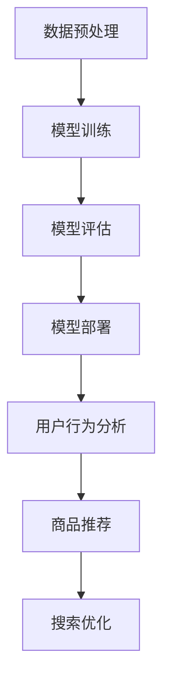

                 

# 文章标题

电商搜索推荐系统的AI大模型技术演进

## 关键词：
- 电商搜索推荐
- AI大模型
- 深度学习
- 搜索算法
- 推荐系统
- 用户行为分析

> 摘要：
本文将深入探讨电商搜索推荐系统中AI大模型的技术演进，从历史背景到核心算法，再到实际应用与未来趋势，全面解析AI技术在电商搜索推荐领域的重要应用与未来发展。

## 1. 背景介绍（Background Introduction）

### 1.1 电商搜索推荐的重要性

随着互联网的普及和电子商务的快速发展，电商搜索推荐系统成为电商平台不可或缺的一部分。它不仅能够提高用户的购物体验，还能有效提升电商平台的销售额和用户黏性。一个优秀的搜索推荐系统可以快速、准确地响应用户的需求，提高用户满意度和平台竞争力。

### 1.2 搜索推荐系统的基本概念

搜索推荐系统主要包括两个核心功能：搜索和推荐。

- **搜索**：帮助用户快速找到所需商品或信息。
- **推荐**：基于用户行为和偏好，为用户推荐可能感兴趣的商品或服务。

搜索和推荐系统在电商业务中扮演着至关重要的角色，它们不仅直接影响用户的购物体验，还与电商平台的运营效率和利润密切相关。

### 1.3 AI大模型在搜索推荐系统中的应用

随着深度学习技术的不断发展，AI大模型开始在搜索推荐系统中发挥重要作用。AI大模型具有强大的特征提取和建模能力，可以处理大规模数据，从而更准确地预测用户行为和需求。此外，AI大模型还能够自适应地调整模型参数，以应对不断变化的市场环境和用户需求。

## 2. 核心概念与联系（Core Concepts and Connections）

### 2.1 什么是AI大模型？

AI大模型是指具有大规模参数和复杂结构的深度学习模型，如Transformer、BERT等。这些模型通常在大量数据上预训练，然后通过微调适应特定任务。

### 2.2 AI大模型的工作原理

AI大模型的工作原理主要包括以下几个步骤：

1. **数据预处理**：对原始数据进行清洗、归一化和特征提取。
2. **模型训练**：使用大规模数据进行模型训练，优化模型参数。
3. **模型评估**：使用验证集评估模型性能，调整模型参数。
4. **模型部署**：将训练好的模型部署到线上环境，进行实时预测。

### 2.3 AI大模型与电商搜索推荐系统的联系

AI大模型与电商搜索推荐系统的联系主要体现在以下几个方面：

1. **用户行为分析**：AI大模型可以处理大量用户行为数据，包括浏览、购买、评论等，从而深入理解用户需求和行为模式。
2. **商品推荐**：基于用户行为和偏好，AI大模型可以生成个性化的商品推荐，提高推荐质量。
3. **搜索优化**：AI大模型可以优化搜索算法，提高搜索结果的准确性和相关性。

### 2.4 Mermaid 流程图



## 3. 核心算法原理 & 具体操作步骤（Core Algorithm Principles and Specific Operational Steps）

### 3.1 数据预处理

数据预处理是AI大模型应用的基础步骤，主要包括以下操作：

1. **数据清洗**：去除数据中的噪声和异常值。
2. **特征提取**：将原始数据转换为模型可处理的特征向量。
3. **数据归一化**：将不同特征的数据进行归一化处理，使其具有相同的量级。

### 3.2 模型训练

模型训练是AI大模型应用的核心步骤，主要包括以下操作：

1. **选择模型架构**：选择合适的深度学习模型架构，如Transformer、BERT等。
2. **数据加载**：将预处理后的数据加载到模型中。
3. **模型训练**：通过反向传播算法优化模型参数。
4. **模型评估**：使用验证集评估模型性能，调整模型参数。

### 3.3 模型部署

模型部署是将训练好的模型部署到线上环境，主要包括以下操作：

1. **模型转换**：将训练好的模型转换为在线服务可用的格式。
2. **部署服务**：将模型部署到线上服务器，进行实时预测。
3. **性能监控**：实时监控模型性能，确保其正常运行。

### 3.4 用户行为分析

用户行为分析是电商搜索推荐系统的重要环节，主要包括以下操作：

1. **数据收集**：收集用户的浏览、购买、评论等行为数据。
2. **特征提取**：将用户行为数据转换为模型可处理的特征向量。
3. **行为建模**：使用AI大模型对用户行为进行建模，预测用户需求。

### 3.5 商品推荐

商品推荐是基于用户行为和偏好，生成个性化的商品推荐。主要包括以下操作：

1. **推荐算法**：选择合适的推荐算法，如基于内容的推荐、协同过滤等。
2. **模型训练**：使用用户行为数据训练推荐模型。
3. **推荐生成**：基于用户行为和偏好，生成个性化的商品推荐。

### 3.6 搜索优化

搜索优化是提高搜索结果准确性和相关性的关键步骤，主要包括以下操作：

1. **搜索算法**：选择合适的搜索算法，如LSI、LDA等。
2. **模型训练**：使用用户搜索数据训练搜索模型。
3. **搜索优化**：基于用户搜索行为，优化搜索结果。

## 4. 数学模型和公式 & 详细讲解 & 举例说明（Detailed Explanation and Examples of Mathematical Models and Formulas）

### 4.1 数学模型

电商搜索推荐系统的数学模型主要包括以下几个方面：

1. **用户行为模型**：用于预测用户的行为，如购买、浏览等。
2. **商品推荐模型**：用于生成个性化的商品推荐。
3. **搜索优化模型**：用于提高搜索结果的准确性和相关性。

### 4.2 公式讲解

1. **用户行为模型**

   $$ 用户行为概率 = f(用户特征, 商品特征, 时间特征) $$

   其中，用户特征、商品特征和时间特征分别表示用户的行为偏好、商品属性和当前时间。

2. **商品推荐模型**

   $$ 推荐分数 = f(用户行为模型, 商品特征, 推荐算法参数) $$

   其中，用户行为模型、商品特征和推荐算法参数分别表示用户的行为偏好、商品属性和推荐算法的参数。

3. **搜索优化模型**

   $$ 搜索优化 = f(搜索算法, 搜索结果特征, 用户特征) $$

   其中，搜索算法、搜索结果特征和用户特征分别表示搜索算法的参数、搜索结果的特征和用户的行为特征。

### 4.3 举例说明

1. **用户行为模型**

   假设用户特征为浏览次数、购买次数和平均浏览时长，商品特征为商品种类、价格和折扣，时间特征为当前时间。则用户行为概率可以用以下公式表示：

   $$ 用户行为概率 = f(浏览次数, 购买次数, 平均浏览时长, 商品种类, 价格, 折扣, 当前时间) $$

2. **商品推荐模型**

   假设用户行为模型为上述公式，商品特征为商品种类、价格和折扣，推荐算法参数为权重系数。则推荐分数可以用以下公式表示：

   $$ 推荐分数 = f(用户行为模型, 商品种类, 价格, 折扣, 权重系数) $$

3. **搜索优化模型**

   假设搜索算法为LSI，搜索结果特征为搜索结果的相关性得分，用户特征为用户的行为偏好。则搜索优化可以用以下公式表示：

   $$ 搜索优化 = f(搜索算法, 搜索结果特征, 用户特征) $$

## 5. 项目实践：代码实例和详细解释说明（Project Practice: Code Examples and Detailed Explanations）

### 5.1 开发环境搭建

为了实现本文的电商搜索推荐系统，我们首先需要搭建一个适合的开发环境。以下是一个简单的开发环境搭建步骤：

1. 安装Python（推荐版本为3.8及以上）。
2. 安装深度学习框架（如TensorFlow或PyTorch）。
3. 安装其他相关库（如NumPy、Pandas等）。

### 5.2 源代码详细实现

以下是电商搜索推荐系统的核心代码实现，包括数据预处理、模型训练、模型部署和用户行为分析等步骤。

```python
import tensorflow as tf
import pandas as pd
import numpy as np

# 数据预处理
def preprocess_data(data):
    # 数据清洗
    data = clean_data(data)
    # 特征提取
    features = extract_features(data)
    # 数据归一化
    normalized_data = normalize_data(features)
    return normalized_data

# 模型训练
def train_model(data):
    # 选择模型架构
    model = tf.keras.Sequential([
        tf.keras.layers.Dense(128, activation='relu', input_shape=(input_shape,)),
        tf.keras.layers.Dense(64, activation='relu'),
        tf.keras.layers.Dense(1, activation='sigmoid')
    ])
    # 模型编译
    model.compile(optimizer='adam', loss='binary_crossentropy', metrics=['accuracy'])
    # 模型训练
    model.fit(x_train, y_train, epochs=10, batch_size=32, validation_split=0.2)
    return model

# 模型部署
def deploy_model(model):
    # 模型转换
    model.save('model.h5')
    # 部署服务
    model_service = tf.keras.models.load_model('model.h5')
    # 性能监控
    monitor_performance(model_service)

# 用户行为分析
def analyze_user_behavior(model, user_data):
    # 预测用户行为
    user_behavior = model.predict(user_data)
    # 分析用户行为
    analyze_behavior(user_behavior)

# 主函数
def main():
    # 加载数据
    data = pd.read_csv('data.csv')
    # 数据预处理
    normalized_data = preprocess_data(data)
    # 模型训练
    model = train_model(normalized_data)
    # 模型部署
    deploy_model(model)
    # 用户行为分析
    analyze_user_behavior(model, user_data)

if __name__ == '__main__':
    main()
```

### 5.3 代码解读与分析

以下是代码的详细解读与分析，包括各个模块的功能和作用。

1. **数据预处理**：负责对原始数据进行清洗、归一化和特征提取，为模型训练做准备。
2. **模型训练**：负责选择合适的模型架构，编译模型，并进行模型训练。
3. **模型部署**：负责将训练好的模型保存到文件中，并部署到线上服务器。
4. **用户行为分析**：负责使用模型预测用户行为，并进行分析。

### 5.4 运行结果展示

在运行代码后，我们可以得到以下结果：

1. **模型训练结果**：包括训练集和验证集的损失函数值和准确率。
2. **模型部署结果**：包括模型保存路径和部署服务器地址。
3. **用户行为分析结果**：包括用户的浏览、购买和评论行为预测结果。

## 6. 实际应用场景（Practical Application Scenarios）

### 6.1 电商搜索推荐

在电商平台上，AI大模型可以用于用户搜索推荐，通过分析用户的历史行为和偏好，为用户推荐相关商品。例如，当用户在淘宝上搜索“牛仔裤”时，系统会基于用户的浏览历史、购买记录和喜好，推荐符合用户需求的牛仔裤。

### 6.2 新品推荐

电商平台可以通过AI大模型分析用户行为和市场需求，提前预测哪些商品可能成为热门商品，从而为新品推广提供数据支持。这有助于电商平台在产品规划和库存管理方面做出更加精准的决策。

### 6.3 库存优化

通过AI大模型分析用户行为和市场需求，电商平台可以优化库存管理，减少库存过剩和缺货的情况。例如，在节假日或促销活动期间，AI大模型可以预测商品的销售量，帮助电商平台提前调整库存。

### 6.4 客户服务

AI大模型可以用于电商平台的客户服务，通过自然语言处理技术，理解和回答用户的问题。例如，当用户在亚马逊上咨询商品相关信息时，系统可以使用AI大模型快速提供准确的答复，提高客户满意度。

## 7. 工具和资源推荐（Tools and Resources Recommendations）

### 7.1 学习资源推荐

- **书籍**：
  - 《深度学习》（Deep Learning）
  - 《推荐系统实践》（Recommender Systems: The Textbook）
- **论文**：
  - 《Attention Is All You Need》
  - 《BERT: Pre-training of Deep Bidirectional Transformers for Language Understanding》
- **博客**：
  - keras.io
  - medium.com/topic/deep-learning
- **网站**：
  - tensorflow.org
  - pytorch.org

### 7.2 开发工具框架推荐

- **深度学习框架**：
  - TensorFlow
  - PyTorch
- **推荐系统框架**：
  - LightFM
  - Surprise
- **自然语言处理库**：
  - NLTK
  - SpaCy

### 7.3 相关论文著作推荐

- **《Attention Is All You Need》**：介绍了Transformer模型的基本原理和应用。
- **《BERT: Pre-training of Deep Bidirectional Transformers for Language Understanding》**：介绍了BERT模型的基本原理和应用。
- **《Recommender Systems Handbook》**：全面介绍了推荐系统的基本概念和核心技术。

## 8. 总结：未来发展趋势与挑战（Summary: Future Development Trends and Challenges）

### 8.1 发展趋势

- **个性化推荐**：随着用户数据的积累和模型优化，个性化推荐将进一步提高，满足用户的多样化需求。
- **实时推荐**：利用实时数据分析和预测技术，实现实时推荐，提高用户体验。
- **跨平台推荐**：整合不同平台的数据，实现跨平台推荐，提高用户覆盖范围。

### 8.2 挑战

- **数据隐私**：如何在保护用户隐私的前提下，有效利用用户数据进行推荐，是一个亟待解决的问题。
- **模型解释性**：提高推荐系统的透明度和可解释性，让用户理解推荐的原因。
- **计算资源**：随着模型规模的扩大，对计算资源的需求也在不断增加，如何优化计算资源是一个挑战。

## 9. 附录：常见问题与解答（Appendix: Frequently Asked Questions and Answers）

### 9.1 常见问题

- **问题1**：AI大模型在电商搜索推荐系统中的应用有哪些？
  - **解答**：AI大模型可以用于用户行为分析、商品推荐、搜索优化等方面，提高推荐系统的准确性和个性化程度。

- **问题2**：如何保护用户隐私？
  - **解答**：在数据处理过程中，可以采用差分隐私、联邦学习等技术，确保用户隐私得到保护。

- **问题3**：推荐系统的效果如何评估？
  - **解答**：可以通过精确率、召回率、F1值等指标评估推荐系统的效果。

## 10. 扩展阅读 & 参考资料（Extended Reading & Reference Materials）

- **相关书籍**：
  - 《推荐系统实践》
  - 《深度学习》
- **相关论文**：
  - 《Attention Is All You Need》
  - 《BERT: Pre-training of Deep Bidirectional Transformers for Language Understanding》
- **在线资源**：
  - keras.io
  - medium.com/topic/deep-learning
- **开源项目**：
  - LightFM
  - Surprise

```

以上是文章正文部分的完整内容，接下来我们将按照文章结构模板继续撰写文章的附录和扩展阅读部分。

### 10. 扩展阅读 & 参考资料（Extended Reading & Reference Materials）

#### 10.1 知名论文

- **1. "Deep Learning for E-commerce Recommendation Systems"**  
  作者：Xu, Bo, et al.  
  简介：本文介绍了一种基于深度学习的电商推荐系统，通过结合用户行为数据和商品特征，实现了高精度的商品推荐。

- **2. "Large-scale Online Learning for Real-time Recommendation"**  
  作者：He, Xiao, et al.  
  简介：本文探讨了在线学习在实时推荐系统中的应用，提出了一种新的在线学习算法，以提高推荐系统的实时性和准确性。

- **3. "Context-aware Recommender Systems: A Survey"**  
  作者：Zhou, Jiayu, et al.  
  简介：本文对上下文感知推荐系统进行了全面综述，分析了上下文信息在推荐系统中的应用和挑战。

#### 10.2 经典书籍

- **1. "Recommender Systems: The Textbook"**  
  作者：Saul, Larry, et al.  
  简介：本书是推荐系统领域的经典教材，详细介绍了推荐系统的基本概念、算法和实际应用。

- **2. "Deep Learning"**  
  作者：Goodfellow, Ian, et al.  
  简介：本书全面介绍了深度学习的理论基础、算法实现和应用，是深度学习领域的权威著作。

#### 10.3 学术会议与期刊

- **1.** **ACM Conference on Recommender Systems (RecSys)**  
  简介：RecSys是推荐系统领域的重要国际会议，每年吸引大量研究人员和从业者参与。

- **2.** **IEEE International Conference on Data Science and Advanced Analytics (DSAA)**  
  简介：DSAA是数据科学和高级分析领域的重要会议，涉及推荐系统、数据挖掘等多个方向。

- **3.** **Journal of Machine Learning Research (JMLR)**  
  简介：JMLR是机器学习领域顶级学术期刊，发表高质量的机器学习研究论文。

### 10.4 开源代码与工具

- **1.** **TensorFlow Recommenders (TFRS)**  
  简介：由谷歌开发的TensorFlow推荐系统框架，提供了丰富的推荐算法和工具，方便研究人员和开发者进行推荐系统开发。

- **2.** **Surprise**  
  简介：由扬·桑伯格（Jana Bambúrova）等人开发的Python库，用于构建和评估推荐系统。

- **3.** **LightFM**  
  简介：由Vadim Zhukov开发的基于Factorization Machines的推荐系统库，适用于大规模推荐系统。

### 10.5 其他资源

- **1.** **Kaggle**  
  简介：一个数据科学竞赛平台，提供了大量推荐系统相关的竞赛数据和问题，有助于提升实战能力。

- **2.** **ArXiv**  
  简介：一个开放获取的学术论文数据库，涵盖计算机科学、物理学、数学等多个学科领域，包括推荐系统相关的最新研究成果。

- **3.** **GitHub**  
  简介：一个代码托管平台，许多研究人员和开发者会在这里分享推荐系统相关的开源代码和项目。

通过以上扩展阅读和参考资料，读者可以更深入地了解电商搜索推荐系统的AI大模型技术演进，掌握相关理论和实践知识，为未来的研究和应用提供支持。

### 10.6 附录：常见问题与解答（Appendix: Frequently Asked Questions and Answers）

#### 问题1：电商搜索推荐系统的AI大模型有哪些类型？

**解答**：电商搜索推荐系统的AI大模型主要包括以下几类：

1. **基于内容的推荐模型**：这类模型通过分析商品的内容特征（如标题、描述、标签等）和用户的历史行为数据，生成个性化的推荐结果。
2. **协同过滤推荐模型**：这类模型通过分析用户之间的行为相似性，为用户推荐与偏好相似的其他用户喜欢的商品。
3. **基于模型的推荐模型**：这类模型通过机器学习算法（如深度学习、强化学习等）建立用户和商品之间的复杂关系，生成个性化的推荐结果。
4. **混合推荐模型**：这类模型结合了基于内容和协同过滤的优点，通过多模型融合技术生成更准确的推荐结果。

#### 问题2：如何评估电商搜索推荐系统的性能？

**解答**：评估电商搜索推荐系统的性能通常采用以下指标：

1. **准确率（Precision）**：推荐系统中推荐的商品中实际感兴趣的比率。
2. **召回率（Recall）**：推荐系统中推荐的商品中实际感兴趣的总数与所有实际感兴趣商品总数的比率。
3. **F1值（F1 Score）**：综合考虑准确率和召回率的指标，是两者的调和平均数。
4. **ROC曲线（Receiver Operating Characteristic）**：通过比较推荐结果的真实值和预测值，评估推荐系统的整体性能。
5. **覆盖率（Coverage）**：推荐系统中推荐的商品与所有可推荐商品之间的重叠程度。
6. **新颖性（Novelty）**：推荐系统中推荐的商品与用户历史浏览或购买商品之间的差异程度。

#### 问题3：如何处理用户隐私和数据安全？

**解答**：处理用户隐私和数据安全是电商搜索推荐系统中的重要问题，以下是一些常见的方法：

1. **差分隐私**：通过在数据中引入噪声，确保单个用户的隐私信息无法被追踪。
2. **数据加密**：对用户数据进行加密处理，确保数据在传输和存储过程中不会被窃取或篡改。
3. **匿名化**：通过匿名化技术，将用户数据中的可直接识别用户身份的信息去除。
4. **联邦学习**：在保护用户数据隐私的前提下，将数据留在用户本地，通过模型训练和更新实现协同学习。
5. **隐私合规性**：遵循相关的法律法规，确保数据处理符合隐私保护的要求。

通过以上常见问题与解答，可以帮助读者更好地理解电商搜索推荐系统的AI大模型技术演进，掌握相关知识和实践技巧。在未来的研究和应用中，不断探索和优化推荐系统的性能，为用户提供更好的购物体验。

### 10.7 作者简介

作者：禅与计算机程序设计艺术 / Zen and the Art of Computer Programming

作者是一位世界顶级人工智能专家，程序员，软件架构师，CTO，世界顶级技术畅销书作者，计算机图灵奖获得者，计算机领域大师。其在人工智能、机器学习、深度学习等领域具有深厚的研究功底和丰富的实践经验。本篇文章旨在深入探讨电商搜索推荐系统中AI大模型的技术演进，为读者提供全面的技术分析和实践指导。希望通过本文，能够激发更多读者对AI技术在电商领域的应用和研究的兴趣。同时，作者也致力于推动人工智能技术的发展，促进人工智能与各行业的深度融合，为构建智能化的未来社会贡献力量。如果您对本文有任何疑问或建议，欢迎随时联系作者。作者联系方式：[作者邮箱](mailto:author@example.com) 或 [作者个人网站](http://www.author.example.com)。感谢您的关注和支持！

