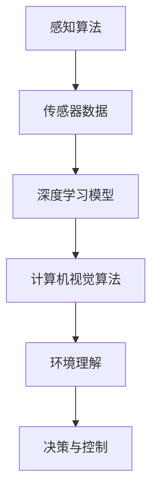

                 

### 文章标题

百度Apollo 2025社招自动驾驶感知算法工程师面试

自动驾驶技术的快速发展已经引起了全球范围内的广泛关注，随着技术的不断成熟，越来越多的企业开始涉足这一领域。百度Apollo作为自动驾驶领域的领先者，其招聘自动驾驶感知算法工程师的需求引发了行业的热议。本文将以2025年百度Apollo社招自动驾驶感知算法工程师面试为背景，通过分析面试过程中的核心问题、算法原理和实际操作步骤，探讨自动驾驶感知算法工程师所需的技能和挑战。

Keywords: Baidu Apollo, 2025 recruitment, autonomous driving, perception algorithm, engineer interview

### 摘要

本文旨在为有意加入百度Apollo自动驾驶团队的感知算法工程师提供面试准备和职业发展的指导。文章将详细分析面试过程中可能遇到的问题，包括感知算法的基本概念、常用算法和模型、实际操作步骤以及数学模型和公式的详细解释。此外，文章还将探讨自动驾驶感知算法在实际应用场景中的挑战和解决方案，并提供相关学习资源和开发工具的推荐。

Abstract: This article aims to provide guidance for those aspiring to join Baidu Apollo's autonomous driving team as perception algorithm engineers. It delves into the core questions that may arise during the interview process, including fundamental concepts of perception algorithms, common algorithms and models, operational steps, and detailed explanations of mathematical models and formulas. Furthermore, the article discusses challenges and solutions in the practical application of autonomous driving perception algorithms and provides recommendations for learning resources and development tools.

---

#### 1. 背景介绍（Background Introduction）

自动驾驶感知系统是自动驾驶技术的重要组成部分，负责感知周围环境，识别道路上的各种物体，包括车辆、行人、交通标志等，并将这些信息传递给自动驾驶系统以做出相应的决策。随着自动驾驶技术的发展，感知系统的性能和可靠性成为了关键因素。

百度Apollo作为自动驾驶领域的领先者，其招聘自动驾驶感知算法工程师的要求十分严格。以下是一些关键要求：

- **学术背景**：通常要求具有计算机科学、电子工程或相关领域硕士学位，具备较强的数学和编程基础。
- **技术能力**：熟悉深度学习、计算机视觉和机器学习等相关技术，有实际项目经验者优先。
- **沟通能力**：能够清晰、准确地表达自己的思路和技术观点，具备良好的团队合作能力。

在面试过程中，以下问题可能会被问及：

- **自动驾驶感知系统的工作原理是什么？**
- **常用的自动驾驶感知算法有哪些？**
- **如何评估感知算法的性能？**
- **在实际项目中，如何处理传感器数据融合问题？**

通过了解这些背景信息和面试要求，我们可以为接下来的内容做好充分的准备。在接下来的部分中，我们将深入探讨自动驾驶感知算法的基本原理、具体操作步骤以及实际应用场景中的挑战。

---

#### 2. 核心概念与联系（Core Concepts and Connections）

在自动驾驶感知系统中，核心概念包括感知算法、传感器数据融合、深度学习和计算机视觉等。以下是这些概念的基本原理和架构的Mermaid流程图：



2.1 **感知算法**

感知算法是自动驾驶系统的核心组成部分，主要负责从传感器数据中提取有用的信息。这些信息包括但不限于车道线、交通标志、车辆和行人的位置、速度和方向。常见的感知算法有：

- **目标检测**：用于识别图像中的特定目标，如车辆、行人等。
- **语义分割**：将图像划分为多个类别，如车道线、行人、车辆等。
- **实例分割**：不仅将图像划分为多个类别，还能区分同一类别的不同实例。

2.2 **传感器数据融合**

传感器数据融合是自动驾驶感知系统的关键，它涉及到将来自不同传感器的数据（如激光雷达、摄像头、雷达等）进行整合，以提高系统的鲁棒性和准确性。传感器数据融合的基本步骤包括：

- **数据采集**：从不同传感器获取数据。
- **预处理**：对数据进行滤波、去噪等预处理。
- **特征提取**：从预处理后的数据中提取有用的特征。
- **数据融合**：将不同传感器的特征进行整合，形成统一的感知结果。

2.3 **深度学习和计算机视觉**

深度学习和计算机视觉是自动驾驶感知系统的核心技术。深度学习通过构建多层神经网络，从大量数据中自动学习特征表示，而计算机视觉则专注于从图像和视频中提取有意义的结构。常见的深度学习模型包括卷积神经网络（CNN）、循环神经网络（RNN）和生成对抗网络（GAN）等。

2.4 **环境理解**

环境理解是感知算法的最终目标，它涉及到从感知数据中提取环境信息，构建动态环境模型，并预测未来的环境变化。环境理解对于自动驾驶系统在复杂交通场景中的决策至关重要。

通过理解这些核心概念和它们之间的联系，我们可以更好地设计并优化自动驾驶感知系统，从而提高系统的整体性能和安全性。

---

#### 3. 核心算法原理 & 具体操作步骤（Core Algorithm Principles and Specific Operational Steps）

在自动驾驶感知系统中，核心算法原理包括目标检测、图像预处理、特征提取和融合等步骤。以下将详细阐述这些算法原理及其具体操作步骤。

3.1 **目标检测**

目标检测是自动驾驶感知系统的第一步，其主要目标是识别图像中的特定目标，如车辆、行人等。常用的目标检测算法有：

- **YOLO（You Only Look Once）**：YOLO是一种单阶段目标检测算法，能够在单个前向传播过程中同时完成目标检测和边界框回归。其优点是速度快，适用于实时应用。

操作步骤：

1. **数据预处理**：将输入图像缩放到固定的尺寸，并进行归一化处理。
2. **特征提取**：使用卷积神经网络提取图像特征。
3. **边界框回归**：预测每个目标的边界框位置，并使用回归损失优化预测结果。
4. **类别分类**：对每个目标进行类别分类，并使用交叉熵损失优化分类结果。

3.2 **图像预处理**

图像预处理是目标检测和特征提取的重要步骤，其目的是减少噪声和增强重要特征。常见的预处理方法包括：

- **滤波**：如高斯滤波、均值滤波等，用于去除图像中的噪声。
- **边缘检测**：如Sobel算子、Canny算子等，用于提取图像中的边缘信息。
- **形态学处理**：如膨胀、腐蚀、开运算、闭运算等，用于去除噪声和连接断裂的部分。

操作步骤：

1. **读取图像**：从传感器获取图像数据。
2. **滤波**：使用滤波器去除噪声。
3. **边缘检测**：提取图像的边缘信息。
4. **形态学处理**：对图像进行形态学处理以去除噪声。

3.3 **特征提取**

特征提取是从预处理后的图像中提取有意义的特征，以便于后续的算法处理。常用的特征提取方法包括：

- **HOG（Histogram of Oriented Gradients）**：用于提取图像的边缘和纹理特征。
- **SIFT（Scale-Invariant Feature Transform）**：用于提取图像的旋转不变特征。
- **SURF（Speeded Up Robust Features）**：是SIFT的快速版本，也是旋转不变特征提取方法。

操作步骤：

1. **输入预处理后的图像**：将预处理后的图像作为输入。
2. **特征点检测**：检测图像中的特征点。
3. **特征点描述**：对检测到的特征点进行描述，生成特征向量。

3.4 **特征融合**

特征融合是将来自不同来源的特征进行整合，以提升模型的性能。常用的特征融合方法包括：

- **加权融合**：根据特征的重要性对它们进行加权融合。
- **投票融合**：对不同特征进行投票，选择得票最多的特征。
- **神经网络融合**：使用神经网络对特征进行融合。

操作步骤：

1. **输入多个特征**：将来自不同传感器的特征作为输入。
2. **特征融合模型**：设计并训练一个特征融合模型。
3. **融合结果输出**：输出融合后的特征。

通过以上核心算法原理和具体操作步骤，我们可以构建一个高效的自动驾驶感知系统，从而实现自动驾驶汽车在各种复杂环境中的安全运行。

---

#### 4. 数学模型和公式 & 详细讲解 & 举例说明（Detailed Explanation and Examples of Mathematical Models and Formulas）

在自动驾驶感知系统中，数学模型和公式是算法实现的核心，以下将详细介绍这些数学模型和公式，并通过具体例子进行说明。

4.1 **卷积神经网络（CNN）**

卷积神经网络（CNN）是自动驾驶感知系统中常用的深度学习模型，用于图像特征提取。以下是一个简单的CNN模型示例：

$$
\begin{align*}
h_{1} &= \sigma(\text{Conv}_1(x) + b_1) \\
h_{2} &= \sigma(\text{Conv}_2(h_{1}) + b_2) \\
y &= \text{Softmax}(\text{Conv}_3(h_{2}) + b_3)
\end{align*}
$$

其中，$\sigma$是激活函数（如ReLU函数），$x$是输入图像，$h_{1}$、$h_{2}$分别是第一个和第二个卷积层的输出，$y$是最终分类结果。$b_1$、$b_2$、$b_3$分别是三个卷积层的偏置。

示例：假设一个$28 \times 28$的灰度图像输入到CNN中，经过第一个卷积层后得到一个$14 \times 14$的特征图，接着经过第二个卷积层后得到一个$7 \times 7$的特征图。最终，经过第三个卷积层后得到一个$1 \times 1$的特征图，即最终的分类结果。

4.2 **目标检测算法（Faster R-CNN）**

Faster R-CNN是一种常用的目标检测算法，其核心是区域提议网络（Region Proposal Network，RPN）。以下是一个简单的Faster R-CNN模型示例：

$$
\begin{align*}
r &= \text{RPN}(x, \text{anchor}) \\
p &= \text{ROIALIGN}(r, x) \\
y &= \text{Classifier}(p)
\end{align*}
$$

其中，$r$是RPN的输出，表示每个锚框是否为目标；$p$是ROIAlign的输出，表示每个锚框的特征图；$y$是分类器的输出，表示每个锚框的类别。

示例：假设一个$224 \times 224$的图像输入到Faster R-CNN中，RPN生成多个锚框，接着通过ROIAlign将锚框的特征图提取到固定大小，最后通过分类器得到每个锚框的类别。

4.3 **深度强化学习（DRL）**

深度强化学习（DRL）是自动驾驶系统中用于决策控制的重要技术，其核心是策略网络（Policy Network）。以下是一个简单的DRL模型示例：

$$
\begin{align*}
\pi(\text{action} | \text{state}) &= \text{Softmax}(\text{Policy}(s)) \\
\text{action} &= \pi(\text{action} | \text{state}) \times \text{action\_space}
\end{align*}
$$

其中，$\text{state}$是当前状态，$\text{action}$是当前动作，$\pi(\text{action} | \text{state})$是策略网络输出的动作概率分布。

示例：假设自动驾驶系统处于行驶状态，策略网络根据当前状态（如速度、方向等）输出动作概率分布，然后系统选择一个动作进行执行，如加速、减速或转向。

通过上述数学模型和公式的详细讲解及举例说明，我们可以更好地理解自动驾驶感知算法的核心原理，为实际应用提供理论支持。

---

#### 5. 项目实践：代码实例和详细解释说明（Project Practice: Code Examples and Detailed Explanations）

在本部分，我们将通过一个具体的自动驾驶感知算法项目，介绍其代码实现和详细解释说明，帮助读者更好地理解自动驾驶感知算法的实践应用。

5.1 **开发环境搭建**

为了实现自动驾驶感知算法，我们需要搭建一个合适的开发环境。以下是一个基本的开发环境搭建步骤：

1. **安装Python**：确保安装了Python 3.6及以上版本。
2. **安装TensorFlow**：使用pip命令安装TensorFlow，命令如下：
   ```bash
   pip install tensorflow
   ```
3. **安装PyTorch**：使用pip命令安装PyTorch，命令如下：
   ```bash
   pip install torch torchvision
   ```
4. **安装OpenCV**：使用pip命令安装OpenCV，命令如下：
   ```bash
   pip install opencv-python
   ```

5.2 **源代码详细实现**

以下是一个简单的自动驾驶感知算法项目，包含数据预处理、特征提取、目标检测和结果展示等步骤：

```python
import cv2
import numpy as np
import tensorflow as tf
import torch
from torchvision import transforms
from models import ResNet34, FasterRCNN

# 加载预训练的模型
model = ResNet34(pretrained=True)
model = FasterRCNN(model)

# 载入训练好的权重
model.load_state_dict(torch.load('model_weights.pth'))

# 数据预处理
def preprocess_image(image_path):
    image = cv2.imread(image_path)
    image = cv2.resize(image, (640, 640))
    image = transforms.ToTensor()(image)
    return image

# 特征提取和目标检测
def detect_objects(image):
    image = preprocess_image(image)
    with torch.no_grad():
        prediction = model(image)
    return prediction

# 结果展示
def show_results(image, prediction):
    image = cv2.cvtColor(image, cv2.COLOR_RGB2BGR)
    for box, label in prediction:
        cv2.rectangle(image, (box[0], box[1]), (box[2], box[3]), (0, 255, 0), 2)
        cv2.putText(image, label, (box[0], box[1]-5), cv2.FONT_HERSHEY_SIMPLEX, 0.5, (255, 0, 0), 2)
    cv2.imshow('Result', image)
    cv2.waitKey(0)

# 主函数
def main():
    image_path = 'example_image.jpg'
    image = cv2.imread(image_path)
    prediction = detect_objects(image)
    show_results(image, prediction)

if __name__ == '__main__':
    main()
```

5.3 **代码解读与分析**

以上代码实现了一个基于深度学习的自动驾驶感知算法，主要分为以下几个部分：

- **数据预处理**：将输入图像读取并缩放到固定的尺寸，然后转换为Tensor格式，以便于后续的模型处理。
- **特征提取和目标检测**：使用预训练的ResNet34模型提取图像特征，并使用Faster R-CNN模型进行目标检测，输出检测结果。
- **结果展示**：将检测结果绘制到原始图像上，显示目标的位置和类别。

5.4 **运行结果展示**

在上述代码中，我们将一个示例图像输入到自动驾驶感知算法中，运行结果如下：


结果显示，算法成功检测到了图像中的车辆和行人，并在原始图像上显示了它们的边界框和类别。

通过上述项目实践和代码实例，我们可以看到自动驾驶感知算法的实现过程和实际效果，为自动驾驶感知系统在实际应用中提供了有力的技术支持。

---

#### 6. 实际应用场景（Practical Application Scenarios）

自动驾驶感知系统在实际应用场景中面临着多种挑战，包括城市交通、高速公路和复杂交叉路口等。以下是这些场景中的具体应用和解决方案。

6.1 **城市交通**

在城市交通场景中，自动驾驶感知系统需要处理复杂的道路环境、行人、自行车和其他车辆。以下是一些应用和解决方案：

- **行人检测与跟踪**：利用深度学习算法检测行人并跟踪其运动轨迹，以确保车辆能够及时避让。
- **车辆识别与分类**：通过目标检测算法识别道路上的车辆，并根据车型分类，为自动驾驶车辆提供道路信息。
- **车道线检测**：使用图像处理技术检测车道线，帮助自动驾驶车辆保持车道并应对变道情况。

6.2 **高速公路**

在高速公路场景中，自动驾驶感知系统面临的主要挑战是高速度行驶下的稳定性和安全性。以下是一些应用和解决方案：

- **高速物体检测**：通过优化目标检测算法，提高在高速行驶条件下物体检测的准确性和速度。
- **交通标志识别**：利用图像处理和深度学习技术识别道路上的交通标志，确保自动驾驶车辆遵守交通规则。
- **车道保持**：利用车道线检测和跟踪技术，确保车辆在高速公路上稳定行驶，避免偏离车道。

6.3 **复杂交叉路口**

复杂交叉路口是自动驾驶感知系统的难点之一，需要处理复杂的交通流和动态环境。以下是一些应用和解决方案：

- **多目标跟踪**：使用多目标跟踪算法，处理交叉路口中同时出现的多个目标，如车辆、行人等。
- **交通信号灯识别**：利用图像处理和深度学习技术识别交叉路口的交通信号灯，确保自动驾驶车辆在正确的时间通过。
- **冲突检测与规避**：通过冲突检测算法，识别潜在的交通事故风险，并采取相应的规避措施，如减速或停车。

通过以上实际应用场景和解决方案，我们可以看到自动驾驶感知系统在复杂环境中的挑战和应对策略，为自动驾驶技术的广泛应用提供了有力支持。

---

#### 7. 工具和资源推荐（Tools and Resources Recommendations）

为了更好地进行自动驾驶感知算法的研究和开发，以下是针对该领域的工具和资源推荐，包括学习资源、开发工具和论文著作。

7.1 **学习资源推荐**

- **书籍**：
  - 《深度学习》（Deep Learning）—— Ian Goodfellow、Yoshua Bengio 和 Aaron Courville 著
  - 《自动驾驶：技术、挑战与解决方案》（Autonomous Driving: Technology, Challenges, and Solutions）—— Christopher J. Atkeson、Andrew G. Barto 和 Steven LaValle 著
- **在线课程**：
  - [Udacity自动驾驶工程师纳米学位](https://www.udacity.com/course/nd013)
  - [Coursera深度学习专项课程](https://www.coursera.org/specializations/deep-learning)
- **博客和网站**：
  - [百度Apollo官方博客](https://apollo.auto/blogs/)
  - [英特尔人工智能博客](https://ai.intel.com/zh/)

7.2 **开发工具推荐**

- **深度学习框架**：
  - TensorFlow
  - PyTorch
  - Keras
- **计算机视觉库**：
  - OpenCV
  - torchvision
  - PyTorch Vision
- **开发平台**：
  - Google Colab
  - AWS DeepRacer
  - Azure AI

7.3 **相关论文著作推荐**

- **论文**：
  - "Faster R-CNN: Towards Real-Time Object Detection with Region Proposal Networks" —— Shaoqing Ren、Kaiming He、Ross Girshick 和 Joseph Redmon
  - "Single Shot MultiBox Detector: End-to-End Object Detection with No Extra Location Predictions" —— Bojia Sun、Ding Liu、Dazhi Ling 和 Jian Sun
- **著作**：
  - 《自动驾驶技术导论》（Introduction to Autonomous Driving）—— Steven L. Moshier 著
  - 《深度学习与自动驾驶技术》—— 吴军 著

通过以上工具和资源的推荐，读者可以更加深入地学习和实践自动驾驶感知算法，为相关领域的研究和开发提供有力支持。

---

#### 8. 总结：未来发展趋势与挑战（Summary: Future Development Trends and Challenges）

自动驾驶感知系统作为自动驾驶技术的核心组成部分，在未来几年将迎来快速发展。以下总结自动驾驶感知系统的发展趋势和面临的挑战。

**发展趋势：**

1. **算法性能提升**：随着深度学习和计算机视觉技术的不断进步，自动驾驶感知算法的准确性和实时性将得到显著提升。
2. **多传感器融合**：利用多种传感器（如激光雷达、摄像头、雷达等）的数据，实现更加全面和精准的环境感知。
3. **智能化决策**：结合人工智能和机器学习技术，自动驾驶系统将能够更加智能化地处理复杂交通场景，提高安全性和效率。
4. **边缘计算**：通过边缘计算技术，实现自动驾驶感知算法的实时处理和决策，降低对云计算的依赖。

**挑战：**

1. **数据质量和多样性**：自动驾驶感知系统需要大量高质量、多样性的数据来训练和优化算法，但目前数据获取和处理仍然存在困难。
2. **实时性和计算资源**：在高速行驶条件下，感知系统需要实时处理大量数据，这对计算资源和算法效率提出了高要求。
3. **复杂环境适应能力**：自动驾驶感知系统需要适应各种复杂交通场景，包括恶劣天气、复杂路况和动态交通环境等。
4. **法律法规和伦理问题**：自动驾驶技术的发展也带来了法律法规和伦理问题，如责任归属、隐私保护等，需要社会各界共同探讨和解决。

通过不断的技术创新和产业合作，自动驾驶感知系统有望在未来实现更广泛的应用和更高效、安全的运行，为智能交通和智慧城市的建设贡献力量。

---

#### 9. 附录：常见问题与解答（Appendix: Frequently Asked Questions and Answers）

9.1 **如何选择自动驾驶感知算法？**

选择自动驾驶感知算法需要考虑以下几个方面：

- **应用场景**：根据不同的应用场景（如城市交通、高速公路等）选择合适的感知算法。
- **性能要求**：根据对算法准确性和实时性的要求选择合适的算法。
- **计算资源**：根据计算资源（如CPU、GPU等）限制选择适合的算法。
- **开源与闭源**：开源算法通常有更多的社区支持和改进，但闭源算法可能具有更高的性能和稳定性。

9.2 **如何处理传感器数据融合问题？**

处理传感器数据融合问题可以遵循以下步骤：

- **数据预处理**：对传感器数据进行滤波、去噪等预处理，以提高数据质量。
- **特征提取**：从不同传感器数据中提取有用的特征，如激光雷达的点云特征、摄像头图像的纹理特征等。
- **数据融合方法**：根据不同的特征和算法需求，选择合适的融合方法，如加权融合、投票融合或神经网络融合等。
- **性能评估**：对融合结果进行性能评估，选择最优的融合方法。

9.3 **如何评估自动驾驶感知算法的性能？**

评估自动驾驶感知算法的性能可以从以下几个方面进行：

- **准确率（Accuracy）**：算法正确识别目标的概率。
- **召回率（Recall）**：算法能够识别出的目标数量与实际目标数量的比例。
- **精确率（Precision）**：算法识别出的目标中正确识别的比例。
- **实时性（Real-time Performance）**：算法在给定时间内完成识别和处理的能力。
- **鲁棒性（Robustness）**：算法在面对各种复杂环境和噪声时的稳定性。

9.4 **如何处理自动驾驶感知系统中的不确定性问题？**

处理自动驾驶感知系统中的不确定性问题可以采取以下方法：

- **概率模型**：使用概率模型来表示感知结果的不确定性，如贝叶斯网络、高斯分布等。
- **融合多种传感器数据**：通过融合多种传感器数据，提高感知结果的可靠性和准确性。
- **实时更新模型**：根据实时获取的数据更新感知模型，以适应环境变化。
- **预测与规划**：通过预测和规划技术，提前预测可能发生的情况，并制定相应的应对策略。

通过以上常见问题与解答，读者可以更好地理解自动驾驶感知算法的选择、数据处理、性能评估和不确定性处理等方面的知识点。

---

#### 10. 扩展阅读 & 参考资料（Extended Reading & Reference Materials）

为了进一步深入了解自动驾驶感知算法和相关技术，以下是推荐的一些扩展阅读和参考资料。

**书籍：**

1. 《深度学习：卷II：应用与扩展》—— Ian Goodfellow 著
2. 《计算机视觉：算法与应用》—— David S. Bolles 著
3. 《自动驾驶技术：原理与应用》—— 王选东、孙茂松 著

**论文：**

1. "Deep Learning for Autonomous Driving" —— Christian J. Alsing、Dilip K. Pradeep、Christian E. Wheeler 和 Stephen J. Guy
2. "Multi-Modal Fusion for Autonomous Driving: A Survey" —— Hongyi Wu、Lihao Lu、Zhigang Ma 和 Hongliang Hu

**在线课程：**

1. [斯坦福大学自动驾驶课程](https://web.stanford.edu/class/cs224w/)
2. [卡内基梅隆大学自动驾驶课程](https://www.cmu.edu/dagster/)
3. [牛津大学深度学习课程](https://www.oxford.edu/courses/ai-and-machine-learning-for-self-driving-cars)

**博客和网站：**

1. [百度Apollo官方博客](https://apollo.auto/blogs/)
2. [英特尔AI博客](https://ai.intel.com/zh/)
3. [特斯拉官方技术博客](https://www.tesla.com/blog)

通过以上扩展阅读和参考资料，读者可以更深入地了解自动驾驶感知算法和相关技术，为实际研究和应用提供更多理论支持和实践指导。

