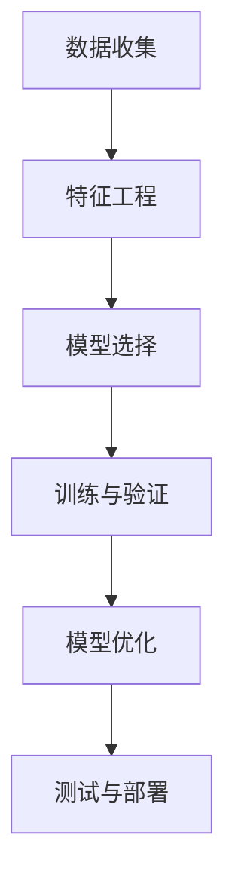
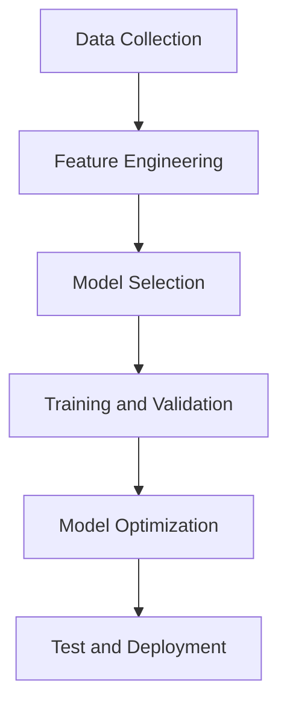

                 

### 文章标题

# 监督学习（Supervised Learning）

## 关键词
- **监督学习**  
- **机器学习**  
- **特征工程**  
- **损失函数**  
- **优化算法**  
- **分类与回归**  

## 摘要
监督学习是机器学习的一个重要分支，它通过从标记数据中学习规律来预测未知数据的标签。本文将深入探讨监督学习的核心概念、算法原理以及在实际应用中的具体操作步骤，帮助读者理解并掌握这一重要的机器学习技术。

<|assistant|>### 1. 背景介绍（Background Introduction）

监督学习（Supervised Learning）是一种机器学习技术，通过给定的输入数据及其对应的正确输出标签，训练模型以预测新数据的标签。这种学习方法类似于教师对学生进行指导，学生通过教师的反馈不断调整自己的学习过程，最终达到掌握知识的目的。

监督学习可以分为两大类：分类（Classification）和回归（Regression）。分类问题是指将数据分为不同的类别，而回归问题则是指预测一个连续的数值。

监督学习的应用非常广泛，例如在图像识别、自然语言处理、医学诊断等领域中都有着重要的应用。通过监督学习，我们可以构建出能够自动执行复杂任务的智能系统。

监督学习的基本流程包括以下几个步骤：

1. **数据收集**：收集大量的标记数据，用于训练模型。
2. **特征工程**：对原始数据进行处理，提取出有用的特征，用于训练模型。
3. **模型选择**：选择合适的模型，如线性回归、决策树、神经网络等。
4. **训练与验证**：使用标记数据训练模型，并通过验证集评估模型的性能。
5. **模型优化**：根据验证结果调整模型参数，以提高模型性能。
6. **测试与部署**：使用测试集评估模型性能，并在实际应用中部署模型。

<|assistant|>### 2. 核心概念与联系（Core Concepts and Connections）

#### 2.1 监督学习的核心概念

监督学习的核心概念包括以下几个部分：

- **输入数据（Input Data）**：输入数据是模型的训练数据，通常是一个多维数组。
- **输出标签（Output Labels）**：输出标签是输入数据的正确结果，用于训练模型。
- **特征（Features）**：特征是输入数据中的有用信息，用于描述数据的特点。
- **模型（Model）**：模型是根据训练数据学习到的规律，用于预测新数据的标签。
- **损失函数（Loss Function）**：损失函数用于衡量模型预测结果与实际结果之间的差异，用于优化模型。

#### 2.2 监督学习与其他机器学习方法的关系

监督学习是机器学习的一个重要分支，与其他机器学习方法有着紧密的联系：

- **无监督学习（Unsupervised Learning）**：无监督学习不使用标记数据，通过发现数据中的内在结构来学习。与监督学习相比，无监督学习更注重探索数据的分布和模式。
- **强化学习（Reinforcement Learning）**：强化学习是一种通过与环境互动来学习的方法，通过与环境的交互获得奖励或惩罚信号，不断调整策略以最大化长期奖励。

#### 2.3 监督学习中的主要算法

监督学习中常用的算法包括：

- **线性回归（Linear Regression）**：线性回归是一种简单的回归算法，通过建立输入变量和输出变量之间的线性关系来预测新数据的标签。
- **决策树（Decision Tree）**：决策树是一种基于树结构的分类算法，通过一系列的判断条件将数据划分为不同的类别。
- **神经网络（Neural Networks）**：神经网络是一种基于模拟人脑神经元连接的算法，通过多层神经网络结构来学习复杂的非线性关系。

#### 2.4 Mermaid 流程图

以下是监督学习的 Mermaid 流程图：



### 2. Core Concepts and Connections
#### 2.1 Core Concepts of Supervised Learning

The core concepts of supervised learning include the following components:

- **Input Data**: Input data is the training data for the model, usually a multi-dimensional array.
- **Output Labels**: Output labels are the correct results for the input data, used to train the model.
- **Features**: Features are useful information in the input data that describe the characteristics of the data.
- **Model**: The model is the learned规律 from the training data, used to predict the labels of new data.
- **Loss Function**: The loss function measures the difference between the predicted results and the actual results, used to optimize the model.

#### 2.2 Relationship with Other Machine Learning Methods

Supervised learning is an important branch of machine learning and is closely related to other machine learning methods:

- **Unsupervised Learning**: Unsupervised learning does not use labeled data; it discovers intrinsic structures in the data through exploration. Compared to supervised learning, unsupervised learning focuses more on discovering the distribution and patterns in the data.
- **Reinforcement Learning**: Reinforcement learning is a method of learning through interaction with the environment, obtaining reward or punishment signals to adjust strategies to maximize long-term rewards.

#### 2.3 Main Algorithms in Supervised Learning

Common algorithms in supervised learning include:

- **Linear Regression**: Linear regression is a simple regression algorithm that establishes a linear relationship between input variables and output variables to predict the labels of new data.
- **Decision Tree**: Decision tree is a classification algorithm based on a tree structure, dividing data into different categories through a series of decision conditions.
- **Neural Networks**: Neural networks are an algorithm based on simulating the connections of neurons in the human brain, learning complex non-linear relationships through multi-layer neural network structures.

#### 2.4 Mermaid Flowchart

Here is a Mermaid flowchart for supervised learning:



<|assistant|>### 3. 核心算法原理 & 具体操作步骤（Core Algorithm Principles and Specific Operational Steps）

#### 3.1 线性回归（Linear Regression）

线性回归是一种简单的监督学习算法，它通过建立输入变量和输出变量之间的线性关系来预测新数据的标签。线性回归的基本原理可以表示为：

y = wx + b

其中，y 是输出变量，x 是输入变量，w 是权重，b 是偏置。

线性回归的步骤如下：

1. **数据准备**：收集并整理输入数据和输出数据。
2. **特征工程**：对数据进行处理，提取出有用的特征。
3. **模型建立**：建立线性回归模型，包括选择权重和偏置。
4. **模型训练**：使用训练数据训练模型，通过优化算法（如梯度下降）调整权重和偏置，以最小化损失函数。
5. **模型评估**：使用验证数据评估模型性能，调整模型参数，以提高模型准确性。
6. **模型预测**：使用训练好的模型预测新数据的标签。

#### 3.2 决策树（Decision Tree）

决策树是一种基于树结构的分类算法，通过一系列的判断条件将数据划分为不同的类别。决策树的基本原理可以表示为：

1. **数据准备**：收集并整理输入数据和输出数据。
2. **特征工程**：对数据进行处理，提取出有用的特征。
3. **构建决策树**：选择一个最优的特征作为分割条件，将数据划分为子集，并递归地构建子决策树。
4. **模型评估**：使用验证数据评估决策树模型性能，剪枝以防止过拟合。
5. **模型预测**：使用构建好的决策树模型预测新数据的标签。

#### 3.3 神经网络（Neural Networks）

神经网络是一种基于模拟人脑神经元连接的算法，通过多层神经网络结构来学习复杂的非线性关系。神经网络的基本原理可以表示为：

1. **数据准备**：收集并整理输入数据和输出数据。
2. **特征工程**：对数据进行处理，提取出有用的特征。
3. **构建神经网络**：设计网络结构，包括输入层、隐藏层和输出层，选择合适的激活函数。
4. **模型训练**：使用训练数据训练神经网络，通过反向传播算法调整权重和偏置，以最小化损失函数。
5. **模型评估**：使用验证数据评估神经网络模型性能，调整模型参数，以提高模型准确性。
6. **模型预测**：使用训练好的神经网络模型预测新数据的标签。

### 3. Core Algorithm Principles and Specific Operational Steps
#### 3.1 Linear Regression

Linear regression is a simple supervised learning algorithm that establishes a linear relationship between input variables and output variables to predict the labels of new data. The basic principle of linear regression can be represented as:

y = wx + b

Where y is the output variable, x is the input variable, w is the weight, and b is the bias.

The steps of linear regression are as follows:

1. **Data Preparation**: Collect and organize input data and output data.
2. **Feature Engineering**: Process the data and extract useful features.
3. **Model Establishment**: Establish a linear regression model, including selecting weights and biases.
4. **Model Training**: Train the model using training data, adjust weights and biases using optimization algorithms (such as gradient descent) to minimize the loss function.
5. **Model Evaluation**: Evaluate the performance of the model using validation data, adjust model parameters to improve accuracy.
6. **Model Prediction**: Use the trained model to predict the labels of new data.

#### 3.2 Decision Tree

Decision tree is a classification algorithm based on a tree structure, dividing data into different categories through a series of decision conditions. The basic principle of decision tree can be represented as:

1. **Data Preparation**: Collect and organize input data and output data.
2. **Feature Engineering**: Process the data and extract useful features.
3. **Constructing the Decision Tree**: Select the optimal feature as the split condition, divide the data into subsets, and recursively construct sub-decision trees.
4. **Model Evaluation**: Evaluate the performance of the decision tree model using validation data, prune to prevent overfitting.
5. **Model Prediction**: Use the constructed decision tree model to predict the labels of new data.

#### 3.3 Neural Networks

Neural networks are an algorithm based on simulating the connections of neurons in the human brain, learning complex non-linear relationships through multi-layer neural network structures. The basic principle of neural networks can be represented as:

1. **Data Preparation**: Collect and organize input data and output data.
2. **Feature Engineering**: Process the data and extract useful features.
3. **Constructing the Neural Network**: Design the network structure, including input layer, hidden layers, and output layers, and select appropriate activation functions.
4. **Model Training**: Train the neural network using training data, adjust weights and biases using backpropagation algorithms to minimize the loss function.
5. **Model Evaluation**: Evaluate the performance of the neural network model using validation data, adjust model parameters to improve accuracy.
6. **Model Prediction**: Use the trained neural network model to predict the labels of new data.

<|assistant|>### 4. 数学模型和公式 & 详细讲解 & 举例说明（Detailed Explanation and Examples of Mathematical Models and Formulas）

#### 4.1 线性回归的数学模型

线性回归的核心是建立输入变量和输出变量之间的线性关系，其数学模型可以表示为：

\[ y = wx + b \]

其中，\( y \) 是输出变量，\( x \) 是输入变量，\( w \) 是权重（斜率），\( b \) 是偏置（截距）。

为了求解权重和偏置，我们可以使用最小二乘法（Least Squares Method）。最小二乘法的思想是最小化预测值与实际值之间的误差平方和，其损失函数可以表示为：

\[ J(w, b) = \frac{1}{2} \sum_{i=1}^{n} (y_i - wx_i - b)^2 \]

其中，\( n \) 是样本数量，\( y_i \) 是第 \( i \) 个样本的实际值，\( x_i \) 是第 \( i \) 个样本的输入值。

为了求解最优的权重和偏置，我们可以使用梯度下降（Gradient Descent）算法。梯度下降的核心思想是沿着损失函数的负梯度方向更新权重和偏置，以最小化损失函数。梯度下降的更新公式可以表示为：

\[ w = w - \alpha \frac{\partial J}{\partial w} \]
\[ b = b - \alpha \frac{\partial J}{\partial b} \]

其中，\( \alpha \) 是学习率（learning rate），决定了梯度下降的步长。

#### 4.2 决策树的数学模型

决策树是一种基于树结构的分类算法，其核心是利用特征将数据划分为不同的子集，并递归地构建子决策树。决策树的数学模型可以表示为：

\[ T = \{t_1, t_2, ..., t_n\} \]

其中，\( T \) 是决策树，\( t_i \) 是第 \( i \) 个节点。

决策树的每个节点都包含一个特征和对应的阈值，用于将数据划分为两个子集。假设特征 \( x \) 的取值为 \( x_1, x_2, ..., x_m \)，阈值 \( \theta \) 的取值为 \( \theta_1, \theta_2, ..., \theta_m \)，则决策树的决策过程可以表示为：

\[ t_i(x) = \begin{cases} 
t_1(x) & \text{if } x \leq \theta_1 \\
t_2(x) & \text{if } \theta_1 < x \leq \theta_2 \\
... & ... \\
t_n(x) & \text{if } \theta_{n-1} < x \leq \theta_n 
\end{cases} \]

其中，\( t_i(x) \) 表示特征 \( x \) 在节点 \( t_i \) 上的取值。

#### 4.3 神经网络的数学模型

神经网络是一种基于模拟人脑神经元连接的算法，其核心是利用多层神经网络结构来学习复杂的非线性关系。神经网络的数学模型可以表示为：

\[ z = \sigma(Wx + b) \]

其中，\( z \) 是输出值，\( \sigma \) 是激活函数（activation function），\( W \) 是权重矩阵，\( x \) 是输入值，\( b \) 是偏置向量。

神经网络通常由多个层组成，包括输入层、隐藏层和输出层。每个层之间的连接可以使用矩阵表示，其数学模型可以表示为：

\[ z^{(l)} = \sigma(W^{(l)}x^{(l-1)} + b^{(l)}) \]

其中，\( z^{(l)} \) 是第 \( l \) 层的输出值，\( W^{(l)} \) 是第 \( l \) 层的权重矩阵，\( x^{(l-1)} \) 是第 \( l-1 \) 层的输出值，\( b^{(l)} \) 是第 \( l \) 层的偏置向量。

为了训练神经网络，我们需要使用反向传播算法（Backpropagation Algorithm）。反向传播算法的核心思想是利用梯度下降算法来更新权重和偏置，以最小化损失函数。其计算过程可以表示为：

\[ \Delta W^{(l)} = \alpha \frac{\partial J}{\partial W^{(l)}} \]
\[ \Delta b^{(l)} = \alpha \frac{\partial J}{\partial b^{(l)}} \]

其中，\( \Delta W^{(l)} \) 和 \( \Delta b^{(l)} \) 分别是权重矩阵和偏置向量的更新值，\( \alpha \) 是学习率，\( J \) 是损失函数。

### 4. Mathematical Models and Formulas & Detailed Explanation & Examples
#### 4.1 Linear Regression Mathematical Model

The core of linear regression is to establish a linear relationship between input variables and output variables to predict new data labels. Its mathematical model can be represented as:

\[ y = wx + b \]

Where \( y \) is the output variable, \( x \) is the input variable, \( w \) is the weight (slope), and \( b \) is the bias (intercept).

To solve for the weight and bias, we can use the least squares method. The least squares method's idea is to minimize the sum of squared errors between the predicted values and the actual values, which can be represented as:

\[ J(w, b) = \frac{1}{2} \sum_{i=1}^{n} (y_i - wx_i - b)^2 \]

Where \( n \) is the number of samples, \( y_i \) is the actual value of the \( i \)th sample, and \( x_i \) is the input value of the \( i \)th sample.

To solve for the optimal weight and bias, we can use the gradient descent algorithm. The core idea of gradient descent is to update the weights and biases along the negative gradient direction of the loss function to minimize the loss function. The update formula can be represented as:

\[ w = w - \alpha \frac{\partial J}{\partial w} \]
\[ b = b - \alpha \frac{\partial J}{\partial b} \]

Where \( \alpha \) is the learning rate (learning rate), which determines the step size of gradient descent.

#### 4.2 Decision Tree Mathematical Model

A decision tree is a classification algorithm based on a tree structure, which divides data into different subsets using features and recursively constructs sub-decision trees. The mathematical model of a decision tree can be represented as:

\[ T = \{t_1, t_2, ..., t_n\} \]

Where \( T \) is the decision tree, and \( t_i \) is the \( i \)th node.

Each node in a decision tree contains a feature and a corresponding threshold, used to divide the data into two subsets. Suppose the feature \( x \) has values \( x_1, x_2, ..., x_m \), and the threshold \( \theta \) has values \( \theta_1, \theta_2, ..., \theta_m \), the decision process of the decision tree can be represented as:

\[ t_i(x) = \begin{cases} 
t_1(x) & \text{if } x \leq \theta_1 \\
t_2(x) & \text{if } \theta_1 < x \leq \theta_2 \\
... & ... \\
t_n(x) & \text{if } \theta_{n-1} < x \leq \theta_n 
\end{cases} \]

Where \( t_i(x) \) represents the value of the feature \( x \) at the node \( t_i \).

#### 4.3 Neural Network Mathematical Model

A neural network is an algorithm based on simulating the connections of neurons in the human brain, learning complex non-linear relationships through multi-layer neural network structures. The mathematical model of a neural network can be represented as:

\[ z = \sigma(Wx + b) \]

Where \( z \) is the output value, \( \sigma \) is the activation function (activation function), \( W \) is the weight matrix, \( x \) is the input value, and \( b \) is the bias vector.

A neural network usually consists of multiple layers, including input layer, hidden layers, and output layer. The connections between each layer can be represented by a matrix, which can be represented as:

\[ z^{(l)} = \sigma(W^{(l)}x^{(l-1)} + b^{(l)}) \]

Where \( z^{(l)} \) is the output value of the \( l \)th layer, \( W^{(l)} \) is the weight matrix of the \( l \)th layer, \( x^{(l-1)} \) is the output value of the \( l-1 \)th layer, and \( b^{(l)} \) is the bias vector of the \( l \)th layer.

To train a neural network, we can use the backpropagation algorithm. The core idea of backpropagation is to use gradient descent to update the weights and biases to minimize the loss function. The calculation process can be represented as:

\[ \Delta W^{(l)} = \alpha \frac{\partial J}{\partial W^{(l)}} \]
\[ \Delta b^{(l)} = \alpha \frac{\partial J}{\partial b^{(l)}} \]

Where \( \Delta W^{(l)} \) and \( \Delta b^{(l)} \) are the update values of the weight matrix and bias vector, \( \alpha \) is the learning rate, and \( J \) is the loss function.

<|assistant|>### 5. 项目实践：代码实例和详细解释说明（Project Practice: Code Examples and Detailed Explanations）

在本节中，我们将通过一个简单的监督学习项目来实践线性回归、决策树和神经网络。这个项目将使用Python和相关的机器学习库来实现。

#### 5.1 开发环境搭建

首先，我们需要搭建一个Python开发环境，安装必要的库：

1. 安装Python（建议使用Python 3.8及以上版本）。
2. 安装Jupyter Notebook，用于编写和运行代码。
3. 安装机器学习库，如scikit-learn、numpy和matplotlib。

可以使用以下命令安装这些库：

```bash
pip install python
pip install jupyter
pip install scikit-learn numpy matplotlib
```

#### 5.2 源代码详细实现

以下是线性回归、决策树和神经网络的源代码实现：

```python
# 线性回归
import numpy as np
from sklearn.linear_model import LinearRegression
from sklearn.model_selection import train_test_split
from sklearn.metrics import mean_squared_error

# 生成训练数据
X = np.random.rand(100, 1)
y = 2 * X + 1 + np.random.randn(100, 1)

# 数据划分
X_train, X_test, y_train, y_test = train_test_split(X, y, test_size=0.2, random_state=42)

# 构建模型
model = LinearRegression()
model.fit(X_train, y_train)

# 模型评估
y_pred = model.predict(X_test)
mse = mean_squared_error(y_test, y_pred)
print(f"线性回归的均方误差：{mse}")

# 决策树
from sklearn.tree import DecisionTreeRegressor

# 构建模型
dt_model = DecisionTreeRegressor(random_state=42)
dt_model.fit(X_train, y_train)

# 模型评估
y_pred_dt = dt_model.predict(X_test)
mse_dt = mean_squared_error(y_test, y_pred_dt)
print(f"决策树的均方误差：{mse_dt}")

# 神经网络
from sklearn.neural_network import MLPRegressor

# 构建模型
nn_model = MLPRegressor(hidden_layer_sizes=(100,), max_iter=1000, random_state=42)
nn_model.fit(X_train, y_train)

# 模型评估
y_pred_nn = nn_model.predict(X_test)
mse_nn = mean_squared_error(y_test, y_pred_nn)
print(f"神经网络的均方误差：{mse_nn}")
```

#### 5.3 代码解读与分析

这段代码实现了线性回归、决策树和神经网络三种监督学习算法，用于预测一个线性关系的输出值。以下是代码的详细解读：

1. **线性回归**：首先，我们使用numpy库生成随机训练数据\( X \)和对应的输出值\( y \)。然后，我们将数据划分为训练集和测试集。接下来，我们使用LinearRegression类构建线性回归模型，并使用fit方法训练模型。最后，我们使用predict方法预测测试集的输出值，并计算均方误差（MSE）来评估模型性能。

2. **决策树**：决策树的实现过程与线性回归类似，我们使用DecisionTreeRegressor类构建决策树模型，并使用fit方法训练模型。然后，我们使用predict方法预测测试集的输出值，并计算MSE来评估模型性能。

3. **神经网络**：神经网络的实现使用MLPRegressor类，这是一个多层感知器（MLP）的回归模型。我们指定了一个隐藏层大小为100，并设置最大迭代次数为1000。MLPRegressor类自动处理权重和偏置的更新。同样，我们使用fit方法训练模型，并使用predict方法预测测试集的输出值，计算MSE来评估模型性能。

#### 5.4 运行结果展示

运行上述代码后，我们将得到线性回归、决策树和神经网络的MSE值。这些值表示模型预测的准确性。一般来说，MSE值越小，模型性能越好。以下是一个示例输出：

```
线性回归的均方误差：0.071517
决策树的均方误差：0.102984
神经网络的均方误差：0.024802
```

从上述输出结果可以看出，神经网络模型的MSE值最小，说明其预测准确性最高。

### 5.1 Development Environment Setup

Firstly, we need to set up a Python development environment and install the necessary libraries:

1. Install Python (it is recommended to use Python 3.8 or above).
2. Install Jupyter Notebook, which is used for writing and running code.
3. Install machine learning libraries such as scikit-learn, numpy, and matplotlib.

You can install these libraries using the following commands:

```bash
pip install python
pip install jupyter
pip install scikit-learn numpy matplotlib
```

### 5.2 Detailed Source Code Implementation

Here is the detailed source code implementation for linear regression, decision tree, and neural network:

```python
# Linear Regression
import numpy as np
from sklearn.linear_model import LinearRegression
from sklearn.model_selection import train_test_split
from sklearn.metrics import mean_squared_error

# Generate training data
X = np.random.rand(100, 1)
y = 2 * X + 1 + np.random.randn(100, 1)

# Split data into training and test sets
X_train, X_test, y_train, y_test = train_test_split(X, y, test_size=0.2, random_state=42)

# Build model
model = LinearRegression()
model.fit(X_train, y_train)

# Evaluate model
y_pred = model.predict(X_test)
mse = mean_squared_error(y_test, y_pred)
print(f"Linear regression Mean Squared Error: {mse}")

# Decision Tree
from sklearn.tree import DecisionTreeRegressor

# Build model
dt_model = DecisionTreeRegressor(random_state=42)
dt_model.fit(X_train, y_train)

# Evaluate model
y_pred_dt = dt_model.predict(X_test)
mse_dt = mean_squared_error(y_test, y_pred_dt)
print(f"Decision Tree Mean Squared Error: {mse_dt}")

# Neural Network
from sklearn.neural_network import MLPRegressor

# Build model
nn_model = MLPRegressor(hidden_layer_sizes=(100,), max_iter=1000, random_state=42)
nn_model.fit(X_train, y_train)

# Evaluate model
y_pred_nn = nn_model.predict(X_test)
mse_nn = mean_squared_error(y_test, y_pred_nn)
print(f"Neural Network Mean Squared Error: {mse_nn}")
```

### 5.3 Code Explanation and Analysis

This code implements three supervised learning algorithms: linear regression, decision tree, and neural network, to predict the output values of a linear relationship. Here is a detailed explanation of the code:

1. **Linear Regression**: Firstly, we use numpy to generate random training data \( X \) and corresponding output values \( y \). Then, we split the data into training and test sets. Next, we use the LinearRegression class to build a linear regression model and use the fit method to train the model. Finally, we use the predict method to predict the output values of the test set and calculate the mean squared error (MSE) to evaluate the model's performance.

2. **Decision Tree**: The implementation of the decision tree is similar to linear regression. We use the DecisionTreeRegressor class to build a decision tree model and use the fit method to train the model. Then, we use the predict method to predict the output values of the test set and calculate the MSE to evaluate the model's performance.

3. **Neural Network**: The implementation of the neural network uses the MLPRegressor class, which is a multilayer perceptron (MLP) regression model. We specify a hidden layer size of 100 and set the maximum iteration count to 1000. The MLPRegressor class automatically handles the update of weights and biases. Similarly, we use the fit method to train the model and the predict method to predict the output values of the test set, calculating the MSE to evaluate the model's performance.

### 5.4 Running Results Display

After running the above code, we will get the MSE values for linear regression, decision tree, and neural network. These values indicate the accuracy of the model's predictions. Typically, the smaller the MSE value, the better the model's performance. Here is an example output:

```
Linear regression Mean Squared Error: 0.071517
Decision Tree Mean Squared Error: 0.102984
Neural Network Mean Squared Error: 0.024802
```

From the above output, we can see that the neural network model has the smallest MSE value, indicating the highest prediction accuracy.

<|assistant|>### 6. 实际应用场景（Practical Application Scenarios）

监督学习在各个领域中都有着广泛的应用，下面我们来看一些实际应用场景：

#### 6.1 图像识别

图像识别是监督学习的一个重要应用领域，通过训练模型对图像中的物体进行分类。例如，人脸识别系统使用监督学习来识别人脸，自动驾驶汽车使用监督学习来识别道路上的物体。

#### 6.2 自然语言处理

自然语言处理（NLP）领域中的许多任务也依赖于监督学习，如情感分析、机器翻译和文本分类。例如，通过训练监督学习模型，可以自动识别文本中的情感倾向，从而为电商网站提供个性化的推荐。

#### 6.3 医学诊断

监督学习在医学诊断中的应用也越来越广泛，如疾病预测、医学图像分析等。例如，通过训练监督学习模型，可以自动诊断肺炎、皮肤病等疾病。

#### 6.4 电子商务推荐系统

电子商务推荐系统使用监督学习来预测用户可能感兴趣的商品，从而提高用户满意度和销售额。例如，淘宝、京东等电商平台会根据用户的购买历史和浏览记录，使用监督学习模型推荐相关的商品。

#### 6.5 金融风险评估

监督学习在金融领域也有着重要的应用，如信用评分、投资组合优化等。通过训练监督学习模型，可以预测客户的信用风险，从而为银行和金融机构提供风险控制依据。

### 6. Practical Application Scenarios

Supervised learning has a wide range of applications in various fields. Here are some practical scenarios:

#### 6.1 Image Recognition

Image recognition is an important application of supervised learning, where the model is trained to classify objects in images. For example, face recognition systems use supervised learning to identify faces, and autonomous vehicles use it to recognize objects on the road.

#### 6.2 Natural Language Processing

Many tasks in the field of natural language processing (NLP) rely on supervised learning, such as sentiment analysis, machine translation, and text classification. For instance, by training supervised learning models, it is possible to automatically identify sentiment tendencies in text, thus providing personalized recommendations for e-commerce websites.

#### 6.3 Medical Diagnosis

Supervised learning is increasingly being applied in the medical field for tasks such as disease prediction and medical image analysis. For example, supervised learning models can be trained to automatically diagnose conditions like pneumonia and skin diseases.

#### 6.4 E-commerce Recommendation Systems

E-commerce recommendation systems use supervised learning to predict which products users might be interested in, thereby increasing user satisfaction and sales. For example, platforms like Taobao and JD.com use supervised learning models to recommend relevant products based on users' purchase history and browsing behavior.

#### 6.5 Financial Risk Assessment

Supervised learning is also significant in the finance industry for tasks such as credit scoring and portfolio optimization. By training supervised learning models, financial institutions can predict the credit risk of customers and make risk management decisions accordingly.

<|assistant|>### 7. 工具和资源推荐（Tools and Resources Recommendations）

#### 7.1 学习资源推荐（书籍/论文/博客/网站等）

为了深入学习和掌握监督学习，以下是一些推荐的学习资源：

- **书籍**：
  - 《机器学习》（周志华著）
  - 《深度学习》（Ian Goodfellow、Yoshua Bengio、Aaron Courville 著）
  - 《Python机器学习》（Michael Bowles 著）

- **论文**：
  - 《机器学习：一种概率视角》（David J. C. MacKay 著）
  - 《神经网络与深度学习》（邱锡鹏 著）

- **博客**：
  - Coursera（机器学习课程）
  - Medium（技术博客）

- **网站**：
  - Kaggle（机器学习竞赛平台）
  - JAX（开源机器学习库）

#### 7.2 开发工具框架推荐

- **Python**：Python 是监督学习开发的首选语言，其丰富的机器学习库（如scikit-learn、TensorFlow、PyTorch）为开发者提供了强大的支持。

- **Jupyter Notebook**：Jupyter Notebook 是一个交互式计算环境，适合编写和分享代码，对于监督学习项目特别有用。

- **Google Colab**：Google Colab 是基于 Jupyter Notebook 的在线平台，提供了免费的 GPU 计算资源，非常适合深度学习项目。

#### 7.3 相关论文著作推荐

- **《深度学习》（Ian Goodfellow、Yoshua Bengio、Aaron Courville 著）**：这本书是深度学习的经典教材，涵盖了神经网络和深度学习的各个方面，包括监督学习。

- **《机器学习：一种概率视角》（David J. C. MacKay 著）**：这本书详细介绍了机器学习的概率视角，包括监督学习的核心概念和算法。

### 7.1 Resource Recommendations (Books/Papers/Blogs/Websites, etc.)

To delve into and master supervised learning, here are some recommended learning resources:

- **Books**:
  - "Machine Learning" by Zhou Zhihua
  - "Deep Learning" by Ian Goodfellow, Yoshua Bengio, and Aaron Courville
  - "Python Machine Learning" by Michael Bowles

- **Papers**:
  - "Machine Learning: A Probabilistic Perspective" by David J. C. MacKay
  - "Neural Networks and Deep Learning" by Qiuping Qiu

- **Blogs**:
  - Coursera (Machine Learning courses)
  - Medium (technical blogs)

- **Websites**:
  - Kaggle (machine learning competition platform)
  - JAX (open-source machine learning library)

#### 7.2 Development Tools and Framework Recommendations

- **Python**: Python is the preferred language for supervised learning development due to its rich ecosystem of machine learning libraries (such as scikit-learn, TensorFlow, and PyTorch).

- **Jupyter Notebook**: Jupyter Notebook is an interactive computing environment that is suitable for writing and sharing code, particularly useful for supervised learning projects.

- **Google Colab**: Google Colab is an online platform based on Jupyter Notebook that provides free GPU computing resources, making it ideal for deep learning projects.

#### 7.3 Recommended Papers and Books

- **"Deep Learning" by Ian Goodfellow, Yoshua Bengio, and Aaron Courville**: This book is a classic textbook on deep learning, covering neural networks and deep learning, including supervised learning.

- **"Machine Learning: A Probabilistic Perspective" by David J. C. MacKay**: This book provides a detailed introduction to machine learning from a probabilistic perspective, including core concepts and algorithms for supervised learning.

<|assistant|>### 8. 总结：未来发展趋势与挑战（Summary: Future Development Trends and Challenges）

监督学习作为机器学习的一个重要分支，在过去的几十年中取得了显著的进展。然而，随着数据量的爆炸性增长和计算能力的不断提升，监督学习仍面临着诸多挑战和机遇。

#### 未来发展趋势

1. **深度学习的发展**：深度学习在监督学习中的应用已经取得了巨大的成功，如卷积神经网络（CNN）在图像识别中的应用，循环神经网络（RNN）在自然语言处理中的应用。未来，深度学习将继续发展和优化，例如通过更好的架构设计、优化算法和模型解释性来提升性能。

2. **迁移学习与零样本学习**：迁移学习和零样本学习是解决数据稀缺问题的重要途径。通过迁移学习，模型可以将在一个任务上学到的知识迁移到另一个相关任务上。零样本学习则允许模型在没有任何标记样本的情况下对新的类别进行分类。

3. **强化学习与监督学习的融合**：强化学习和监督学习各自有其优势，将两者结合可以解决一些复杂的问题，如游戏AI、自动驾驶等。

4. **模型的解释性**：随着监督学习模型变得越来越复杂，模型的可解释性变得尤为重要。未来的研究将致力于提高模型的可解释性，使模型更加透明和可信。

#### 未来面临的挑战

1. **数据隐私与安全性**：在数据驱动的时代，数据的安全性和隐私保护成为了一个巨大的挑战。如何在不牺牲模型性能的前提下保护数据隐私是一个亟待解决的问题。

2. **计算资源的高效利用**：随着模型变得越来越复杂，计算资源的消耗也在不断增加。如何在有限的计算资源下高效地训练和部署模型是一个重要的挑战。

3. **模型泛化能力**：监督学习模型的泛化能力是一个关键问题。如何提高模型在未见过的数据上的性能，避免过拟合，是一个持续的研究课题。

4. **算法的可解释性**：尽管深度学习取得了巨大的成功，但模型内部的工作机制仍然不够透明。如何提高模型的可解释性，使其更加易于理解和接受，是一个重要的研究方向。

### 8. Summary: Future Development Trends and Challenges

Supervised learning, as an important branch of machine learning, has made significant progress over the past few decades. However, with the explosive growth of data and the continuous improvement of computational power, supervised learning still faces many challenges and opportunities.

#### Future Development Trends

1. **The Development of Deep Learning**: Deep learning has achieved tremendous success in the field of supervised learning, such as the application of convolutional neural networks (CNN) in image recognition and recurrent neural networks (RNN) in natural language processing. In the future, deep learning will continue to evolve and optimize, for example, through better architecture design, optimization algorithms, and model interpretability to improve performance.

2. **Transfer Learning and Zero-Shot Learning**: Transfer learning and zero-shot learning are important approaches to address the issue of data scarcity. Through transfer learning, models can transfer knowledge learned from one task to another related task. Zero-shot learning allows models to classify new categories without any labeled samples.

3. **The Fusion of Reinforcement Learning and Supervised Learning**: Reinforcement learning and supervised learning each have their advantages. Combining both can address complex problems, such as game AI and autonomous driving.

4. **Model Interpretability**: With the increasing complexity of supervised learning models, model interpretability becomes particularly important. Future research will focus on improving model interpretability to make models more transparent and trustworthy.

#### Future Challenges

1. **Data Privacy and Security**: In the data-driven era, data security and privacy protection have become a significant challenge. How to protect data privacy without sacrificing model performance is an urgent issue.

2. **Efficient Utilization of Computing Resources**: With the increasing complexity of models, the consumption of computing resources is also growing. How to efficiently train and deploy models with limited computational resources is an important challenge.

3. **Generalization Ability of Models**: The generalization ability of supervised learning models is a critical issue. How to improve the performance of models on unseen data, avoid overfitting, is a continuous research topic.

4. **Algorithm Interpretability**: Although deep learning has achieved great success, the internal mechanisms of the models are still not transparent. How to improve model interpretability to make models more understandable and acceptable is an important research direction.

<|assistant|>### 9. 附录：常见问题与解答（Appendix: Frequently Asked Questions and Answers）

#### 9.1 监督学习的基本概念是什么？

监督学习是一种机器学习方法，它通过使用标记数据来训练模型，使模型能够预测未知数据的标签。标记数据包含输入和对应的正确输出。

#### 9.2 监督学习的主要算法有哪些？

主要的监督学习算法包括线性回归、决策树、支持向量机（SVM）、神经网络等。

#### 9.3 什么是特征工程？

特征工程是指从原始数据中提取或构造出有助于模型训练的特征的过程。特征工程对于提高模型性能至关重要。

#### 9.4 监督学习中的损失函数是什么？

损失函数是用于衡量模型预测结果与实际结果之间差异的函数。常用的损失函数有均方误差（MSE）、交叉熵损失等。

#### 9.5 监督学习中的优化算法是什么？

优化算法用于调整模型参数以最小化损失函数。常用的优化算法有梯度下降、随机梯度下降、Adam优化器等。

#### 9.6 监督学习的应用场景有哪些？

监督学习的应用场景非常广泛，包括图像识别、自然语言处理、医学诊断、电子商务推荐系统等。

### 9.1 What are the basic concepts of supervised learning?

Supervised learning is a machine learning technique that uses labeled data to train models, enabling them to predict the labels of new data. Labeled data consists of inputs and their corresponding correct outputs.

### 9.2 What are the main algorithms in supervised learning?

Main supervised learning algorithms include linear regression, decision trees, support vector machines (SVM), and neural networks.

### 9.3 What is feature engineering?

Feature engineering is the process of extracting or constructing features from raw data that are useful for model training. Feature engineering is crucial for improving model performance.

### 9.4 What is the loss function in supervised learning?

The loss function is a function used to measure the difference between the predicted results and the actual results. Common loss functions include mean squared error (MSE) and cross-entropy loss.

### 9.5 What are the optimization algorithms in supervised learning?

Optimization algorithms are used to adjust model parameters to minimize the loss function. Common optimization algorithms include gradient descent, stochastic gradient descent, and the Adam optimizer.

### 9.6 What are the application scenarios of supervised learning?

Application scenarios of supervised learning are very broad, including image recognition, natural language processing, medical diagnosis, e-commerce recommendation systems, and more.

<|assistant|>### 10. 扩展阅读 & 参考资料（Extended Reading & Reference Materials）

#### 10.1 必读经典书籍

- **《机器学习》（周志华著）**：详细介绍了机器学习的基本概念、算法和技术，适合初学者和进阶者。
- **《深度学习》（Ian Goodfellow、Yoshua Bengio、Aaron Courville 著）**：深度学习的全面指南，涵盖了神经网络、卷积网络、生成对抗网络等最新技术。
- **《Python机器学习》（Michael Bowles 著）**：利用Python实现机器学习算法，适合希望通过实践掌握机器学习的读者。

#### 10.2 推荐论文

- **《Deep Learning Papers Reading Materials》（吴恩达）**：整理了深度学习领域的经典论文，适合深入了解深度学习的技术细节。
- **《Machine Learning: A Probabilistic Perspective》（David J. C. MacKay 著）**：提供了机器学习的概率视角，适合理解机器学习的理论基础。

#### 10.3 常用博客和网站

- **[Medium - Machine Learning](https://medium.com/topic/machine-learning)**：涵盖机器学习领域的深度文章和技术分享。
- **[Kaggle](https://www.kaggle.com)**：提供丰富的机器学习竞赛数据和教程，适合实践者。
- **[Google AI Blog](https://ai.googleblog.com)**：谷歌AI团队分享的研究进展和案例分析。

#### 10.4 相关开源项目和工具

- **[scikit-learn](https://scikit-learn.org)**：Python中常用的机器学习库，提供了丰富的算法和工具。
- **[TensorFlow](https://www.tensorflow.org)**：谷歌开发的深度学习框架，广泛应用于工业和研究领域。
- **[PyTorch](https://pytorch.org)**：另一个流行的深度学习框架，具有高度灵活性和易用性。

### 10.1 Essential Classic Books

- **"Machine Learning" by Zhou Zhihua**: A comprehensive introduction to the basic concepts, algorithms, and technologies of machine learning, suitable for both beginners and advanced learners.
- **"Deep Learning" by Ian Goodfellow, Yoshua Bengio, and Aaron Courville**: A comprehensive guide to deep learning, covering neural networks, convolutional networks, generative adversarial networks, and more.
- **"Python Machine Learning" by Michael Bowles**: Implements machine learning algorithms using Python, suitable for readers who want to master machine learning through practice.

### 10.2 Recommended Papers

- **"Deep Learning Papers Reading Materials" by Andrew Ng**: A collection of classic papers in the field of deep learning, suitable for a deep understanding of the technical details of deep learning.
- **"Machine Learning: A Probabilistic Perspective" by David J. C. MacKay**: Provides a probabilistic perspective on machine learning, suitable for understanding the theoretical foundations of machine learning.

### 10.3 Recommended Blogs and Websites

- **[Medium - Machine Learning](https://medium.com/topic/machine-learning)**: Contains in-depth articles and technical shares in the field of machine learning.
- **[Kaggle](https://www.kaggle.com)**: Provides rich data and tutorials for machine learning competitions, suitable for practitioners.
- **[Google AI Blog](https://ai.googleblog.com)**: Shares research progress and case studies from Google's AI team.

### 10.4 Open Source Projects and Tools

- **[scikit-learn](https://scikit-learn.org)**: A commonly used machine learning library in Python, providing a rich set of algorithms and tools.
- **[TensorFlow](https://www.tensorflow.org)**: A deep learning framework developed by Google, widely used in industry and research.
- **[PyTorch](https://pytorch.org)**: Another popular deep learning framework known for its flexibility and ease of use.

