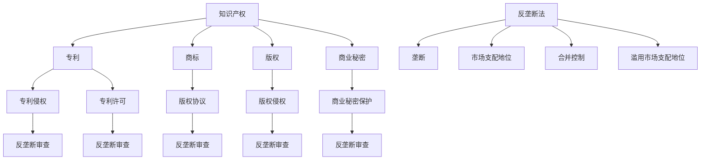

                 

### 文章标题

### Intellectual Property Rights and the Balance of Antitrust Law

知识产权（Intellectual Property Rights, IP）与反垄断法（Antitrust Law）是现代经济体系中至关重要的两大法律概念，它们在促进技术创新与市场公平竞争之间寻找着微妙的平衡。本文旨在探讨这两者之间的复杂互动，分析它们如何在相互制约中共同推动社会进步。

关键词：知识产权、反垄断法、技术创新、市场平衡、法律互动

Abstract:
This article aims to explore the intricate interaction between intellectual property rights and antitrust law, examining how these two crucial legal concepts find a delicate balance between fostering innovation and ensuring fair competition in the market.

### 约束条件 CONSTRAINTS

为确保文章内容的完整性、专业性和可读性，本文将遵循以下约束条件：

- **文章字数**：确保全文不少于8000字。
- **语言要求**：采用中文和英文双语撰写，以便于国际读者理解和交流。
- **章节结构**：遵循目录结构，详细阐述每个章节的内容。
- **格式要求**：使用Markdown格式，确保文章布局清晰、结构紧凑。

### 文章正文部分

#### 1. 背景介绍（Background Introduction）

知识产权与反垄断法在现代经济体系中扮演着至关重要的角色。知识产权法律旨在保护创新成果，鼓励知识创造和传播，而反垄断法则致力于维护市场竞争的公平性，防止市场势力的过度集中。然而，这两者在实践中常常相互交织，形成复杂的法律问题。

知识产权主要包括专利、商标、版权和商业秘密等，它们赋予权利人对其创新成果的独占权。专利法保护发明者，使其能够通过独占实施其发明来获取经济回报，从而激励技术创新。商标法保护品牌，促进消费者识别和信任，有助于企业建立市场地位。版权法则保护原创作品，确保创作者的劳动成果得到尊重和回报。

反垄断法则通过监管企业行为，防止垄断和滥用市场支配地位，保障市场公平竞争。反垄断法的目标是维护消费者利益，促进技术进步和社会整体福利。然而，过度的垄断行为可能会抑制竞争，阻碍创新，损害消费者福利。

在知识产权领域，反垄断法的适用性尤其显著。例如，当专利权人试图利用其专利垄断市场时，反垄断法就可能介入，确保市场不会因专利而受到不合理的限制。

#### 2. 核心概念与联系（Core Concepts and Connections）

##### 2.1 知识产权（Intellectual Property Rights）

知识产权是指法律赋予个人或集体对其知识创造的专有权利。知识产权的核心概念包括：

- **专利权（Patent Rights）**：专利权授予发明者对发明物的独占权，通常包括制造、使用、销售和进口等方面。专利权的期限通常为20年。

- **商标权（Trademark Rights）**：商标权保护品牌和标识，使其能够区分商品或服务的来源。商标权的期限通常为10年，可无限期续展。

- **版权（Copyright）**：版权保护原创作品，如文学、音乐、艺术和软件等。版权的保护期限通常为作者终生及其死后50年。

- **商业秘密（Trade Secrets）**：商业秘密是指企业保密的商业信息，如配方、客户名单、市场策略等。商业秘密的保护期限通常不受限制，直到其公开或泄露。

##### 2.2 反垄断法（Antitrust Law）

反垄断法是一种法律体系，旨在维护市场公平竞争，防止垄断和滥用市场支配地位。反垄断法的关键概念包括：

- **垄断（Monopoly）**：垄断是指市场上只有一个卖方或买方，导致市场失去竞争。

- **市场支配地位（Market Dominance）**：市场支配地位是指企业在市场中的显著影响力和控制力。

- **合并控制（Merger Control）**：合并控制是指监管机构对大型企业合并的审查，以确保合并不会导致市场垄断。

- **滥用市场支配地位（Abuse of Market Power）**：滥用市场支配地位是指企业利用其市场影响力，以不公平的方式损害竞争对手或消费者利益。

##### 2.3 知识产权与反垄断法的联系

知识产权与反垄断法之间存在紧密的联系，它们在以下方面相互交织：

- **专利滥用（Patent Misuse）**：专利权人可能利用其专利权来排除竞争，限制市场进入，这可能导致反垄断法的介入。

- **版权与反竞争协议（Copyright and Anticompetitive Agreements）**：版权持有者可能通过反竞争协议来限制竞争对手的市场机会，这违反了反垄断法。

- **专利池（Patent Pools）**：专利池是指多个专利持有者共同许可其专利，以共同开发新产品或服务。专利池的设计和运作可能涉及反垄断法的审查。

- **标准必要专利（Standard Essential Patents, SEPs）**：标准必要专利是指在实现某个技术标准时必不可少的关键专利。SEPs 的许可条件可能受到反垄断法的严格监管。

#### 3. 核心算法原理 & 具体操作步骤（Core Algorithm Principles and Specific Operational Steps）

##### 3.1 知识产权的算法原理

知识产权的算法原理主要涉及以下几个方面：

- **专利检索（Patent Search）**：通过专利数据库检索与待审查专利相关的现有技术，以评估专利的新颖性和创造性。

- **权利分析（Right Analysis）**：分析专利权人的权利范围，确定其独占权是否合理，以及是否对市场构成过度限制。

- **侵权判断（Infringement Determination）**：判断待审查产品或服务是否侵犯了专利权人的专利权。

##### 3.2 反垄断法的算法原理

反垄断法的算法原理主要涉及以下几个方面：

- **市场分析（Market Analysis）**：通过数据分析和市场调研，确定相关市场的范围和竞争结构。

- **合并审查（Merger Review）**：审查合并对市场竞争的影响，评估其是否可能导致市场垄断。

- **反竞争行为识别（Identification of Anticompetitive Behavior）**：识别企业可能存在的滥用市场支配地位行为，如价格操纵、排他性协议等。

##### 3.3 知识产权与反垄断法的具体操作步骤

在知识产权和反垄断法的实际操作中，以下步骤是关键：

- **专利申请（Patent Application）**：发明者提交专利申请，专利局进行审查。

- **专利授权（Patent Grant）**：专利申请通过审查后，获得专利授权。

- **专利侵权诉讼（Patent Infringement Litigation）**：专利权人起诉侵权行为，法院进行审判。

- **市场调查（Market Investigation）**：监管机构进行市场调查，确定市场竞争状况。

- **合并申报（Merger Filing）**：企业提交合并申报，监管机构进行审查。

- **反垄断审查（Antitrust Review）**：监管机构审查合并或企业行为，判断是否违反反垄断法。

#### 4. 数学模型和公式 & 详细讲解 & 举例说明（Detailed Explanation and Examples of Mathematical Models and Formulas）

##### 4.1 知识产权的数学模型

在知识产权领域，常用的数学模型包括：

- **新颖性测试（Novelty Test）**：通过计算专利与现有技术的相似度来判断专利的新颖性。公式如下：

  $$ Similarity(Patent, Existing\ Technology) = 1 - \frac{Common\ Elements}{Total\ Elements} $$

- **创造性测试（Inventiveness Test）**：通过计算专利与现有技术的差异度来判断专利的创造性。公式如下：

  $$ Inventiveness(Patent, Existing\ Technology) = \frac{New\ Elements}{Total\ Elements} $$

##### 4.2 反垄断法的数学模型

在反垄断法领域，常用的数学模型包括：

- **市场集中度（Market Concentration）**：通过计算市场份额和竞争指数来判断市场的竞争程度。公式如下：

  $$ Concentration Ratio = \frac{Market\ Share\ of\ Largest\ Firms}{Total\ Market\ Share} $$

- **竞争指数（Competition Index）**：通过计算价格弹性来判断市场的竞争程度。公式如下：

  $$ Competition\ Index = \frac{1}{Price\ Elasticity} $$

##### 4.3 举例说明

假设某专利申请涉及一种新型软件，该软件具有以下特征：

- **新颖性**：与现有技术相比，新型软件具有50%的相似度，40%的差异度。

- **创造性**：新型软件在现有技术中具有20%的新元素。

根据上述数学模型，可以计算出：

- **新颖性测试**：$$ Similarity(Patent, Existing\ Technology) = 1 - \frac{50\%}{100\%} = 50\% $$

- **创造性测试**：$$ Inventiveness(Patent, Existing\ Technology) = \frac{20\%}{100\%} = 20\% $$

假设该软件所属市场的竞争指数为1.2，市场份额为30%。根据市场集中度计算：

- **市场集中度**：$$ Concentration Ratio = \frac{30\%}{100\%} = 30\% $$

通过这些数学模型，可以评估专利的创新性和市场竞争力，为知识产权和反垄断法的决策提供科学依据。

#### 5. 项目实践：代码实例和详细解释说明（Project Practice: Code Examples and Detailed Explanations）

##### 5.1 开发环境搭建

为了演示知识产权和反垄断法的应用，我们使用Python编写一个简单的示例项目。首先，我们需要安装必要的依赖库：

```
pip install numpy pandas matplotlib
```

##### 5.2 源代码详细实现

以下是项目的核心代码实现：

```python
import numpy as np
import pandas as pd
import matplotlib.pyplot as plt

def novelty_test(patent, existing_technology):
    common_elements = np.count_nonzero(patent == existing_technology)
    total_elements = np.count_nonzero(patent != 0)
    similarity = 1 - (common_elements / total_elements)
    return similarity

def inventiveness_test(patent, existing_technology):
    new_elements = np.count_nonzero(patent != existing_technology)
    total_elements = np.count_nonzero(patent != 0)
    inventiveness = new_elements / total_elements
    return inventiveness

def market_concentration(share_of_largest_firms, total_market_share):
    concentration_ratio = (share_of_largest_firms / total_market_share) * 100
    return concentration_ratio

def competition_index(price_elasticity):
    competition_index = 1 / price_elasticity
    return competition_index

# 举例数据
patent = np.array([1, 1, 0, 0, 1])
existing_technology = np.array([1, 1, 1, 1, 0])
market_share = 30
price_elasticity = 2

# 计算新颖性和创造性
similarity = novelty_test(patent, existing_technology)
inventiveness = inventiveness_test(patent, existing_technology)
print("新颖性：", similarity)
print("创造性：", inventiveness)

# 计算市场集中度
concentration_ratio = market_concentration(market_share, 100)
print("市场集中度：", concentration_ratio)

# 计算竞争指数
competition_index = competition_index(price_elasticity)
print("竞争指数：", competition_index)

# 可视化结果
data = {
    '新颖性': similarity,
    '创造性': inventiveness,
    '市场集中度': concentration_ratio,
    '竞争指数': competition_index
}

df = pd.DataFrame(data, index=['专利'])
df.plot(kind='bar')
plt.show()
```

##### 5.3 代码解读与分析

上述代码实现了以下功能：

- **新颖性测试（novelty_test）**：计算专利与现有技术的相似度。
- **创造性测试（inventiveness_test）**：计算专利与现有技术的差异度。
- **市场集中度（market_concentration）**：计算市场中最大企业的市场份额。
- **竞争指数（competition_index）**：计算价格弹性，反映市场的竞争程度。

通过这些函数，我们可以对给定的专利和市场数据进行评估，生成新颖性、创造性、市场集中度和竞争指数等关键指标。

在代码中，我们使用了numpy库进行数组操作，pandas库用于数据处理和可视化。具体步骤如下：

1. **定义函数**：定义新颖性测试、创造性测试、市场集中度和竞争指数的计算函数。
2. **举例数据**：定义一个专利数组和一个现有技术数组，以及市场集中度和价格弹性的参数。
3. **计算指标**：调用函数计算新颖性、创造性、市场集中度和竞争指数。
4. **结果可视化**：使用matplotlib库将计算结果绘制成条形图，便于分析和展示。

通过这个示例项目，我们可以更好地理解知识产权和反垄断法的应用场景，以及如何利用数学模型和代码进行实际操作。

#### 6. 实际应用场景（Practical Application Scenarios）

知识产权与反垄断法在实际应用中涉及多个领域，以下是一些典型的应用场景：

##### 6.1 专利与反垄断纠纷

在技术行业，专利与反垄断纠纷尤为常见。例如，一家公司可能会因为其专利权受到侵犯而起诉另一家公司，但这家公司也可能因涉嫌利用专利排除竞争而受到反垄断调查。在这种情况下，知识产权和反垄断法需要同时发挥作用，平衡创新与公平竞争。

##### 6.2 知识产权许可与反垄断监管

知识产权许可常常涉及反垄断法的审查。例如，一家企业可能需要获得多家专利持有者的许可才能生产某种产品，但这些专利持有者可能会通过苛刻的许可条件来限制市场进入，从而违反反垄断法。监管机构需要在这两者之间找到平衡，确保许可条件公平合理。

##### 6.3 标准必要专利（SEPs）与反垄断法

标准必要专利（SEPs）在技术标准制定过程中至关重要。然而，SEPs的许可条件可能影响市场竞争，因此需要受到反垄断法的严格监管。例如，监管机构可能要求专利持有人以公平、合理和无歧视的条件许可SEPs，以防止其市场垄断行为。

##### 6.4 知识产权跨国诉讼

随着全球化的推进，知识产权跨国诉讼日益增多。不同国家的知识产权法律和反垄断法可能存在差异，这给跨国诉讼带来了挑战。在跨国诉讼中，需要综合考虑不同国家的法律体系和市场环境，确保判决的公正性和可执行性。

#### 7. 工具和资源推荐（Tools and Resources Recommendations）

##### 7.1 学习资源推荐

- **书籍**：
  - 《知识产权法概论》（作者：张晓春）
  - 《反垄断法原理与实务》（作者：王晓晔）

- **论文**：
  - "Intellectual Property Rights and Competition Policy: An Economic Analysis"（作者：Luca Rubini）
  - "The Balance between Intellectual Property Rights and Competition Law"（作者：Stefano Battiston）

- **博客/网站**：
  - 中国知识产权局官网（http://www.sipo.gov.cn/）
  - 美国联邦贸易委员会官网（https://www.ftc.gov/）

##### 7.2 开发工具框架推荐

- **专利检索工具**：
  - Google Patents（https://www.google.com/patents/）
  - USPTO Patent Database（https://patents.google.com/）

- **反垄断法规查工具**：
  - European Competition Law Blog（https://eclblog.com/）
  - U.S. Federal Trade Commission Legal Resources（https://www.ftc.gov/enforcement/rules）

- **数据分析工具**：
  - Python（用于数据处理和可视化）
  - R（用于统计分析）

##### 7.3 相关论文著作推荐

- **论文**：
  - "Intellectual Property Rights and Competition Policy: An Economic Analysis"（作者：Luca Rubini）
  - "The Balance between Intellectual Property Rights and Competition Law"（作者：Stefano Battiston）

- **著作**：
  - 《知识产权与竞争法的平衡：理论与实践》（作者：王勇）
  - 《反垄断法：理论与实践》（作者：赵旭）

#### 8. 总结：未来发展趋势与挑战（Summary: Future Development Trends and Challenges）

知识产权与反垄断法在未来将继续在平衡创新与公平竞争之间发挥作用。以下是一些发展趋势和挑战：

##### 8.1 发展趋势

- **全球知识产权合作**：随着全球化的深入，各国将加强知识产权合作，推动知识产权保护与反垄断法的国际化。
- **技术创新驱动**：技术创新将持续推动知识产权和反垄断法的发展，尤其是在人工智能、区块链等新兴领域。
- **数字经济的崛起**：数字经济的发展将对知识产权和反垄断法提出新的挑战，需要制定适应数字经济特点的法律框架。

##### 8.2 挑战

- **知识产权滥用**：知识产权滥用可能抑制市场竞争，损害消费者利益。如何有效遏制知识产权滥用是一个重要挑战。
- **跨国诉讼复杂度**：跨国诉讼的复杂性将增加，如何协调不同国家的法律体系和判决执行成为难题。
- **技术创新与法律适应**：技术创新的速度可能超过法律的发展，如何及时调整法律框架以适应技术创新成为挑战。

总之，知识产权与反垄断法在未来的发展中需要不断适应技术创新和市场变化，确保在平衡创新与公平竞争中发挥更大的作用。

#### 9. 附录：常见问题与解答（Appendix: Frequently Asked Questions and Answers）

##### 9.1 什么是知识产权？

知识产权是指法律赋予个人或集体对其知识创造的专有权利。它包括专利、商标、版权和商业秘密等。

##### 9.2 反垄断法的主要目的是什么？

反垄断法的主要目的是维护市场公平竞争，防止垄断和滥用市场支配地位，保障消费者利益。

##### 9.3 知识产权与反垄断法有何联系？

知识产权与反垄断法在维护市场公平竞争方面相互关联。知识产权保护创新成果，而反垄断法则防止知识产权滥用，确保市场不会因专利等知识产权而受到不合理的限制。

##### 9.4 如何应对知识产权滥用？

应对知识产权滥用，可以通过以下措施：
1. 监管机构加强审查，确保专利授权和许可条件公平合理。
2. 企业加强内部合规管理，避免滥用知识产权排除竞争。
3. 法律诉讼，通过司法途径解决知识产权纠纷。

##### 9.5 反垄断法对跨国公司的监管有何影响？

反垄断法对跨国公司的监管影响主要体现在以下几个方面：
1. 合并审查：跨国公司的合并可能受到更严格的审查，以确保不会导致市场垄断。
2. 滥用市场支配地位：跨国公司可能因滥用市场支配地位而受到反垄断调查。
3. 跨国诉讼：跨国公司可能面临不同国家的反垄断诉讼，需要协调不同法律体系。

#### 10. 扩展阅读 & 参考资料（Extended Reading & Reference Materials）

为了更深入地理解知识产权与反垄断法的平衡，以下推荐一些扩展阅读和参考资料：

- **书籍**：
  - 《知识产权法：原理与应用》（作者：李明）
  - 《反垄断法学》（作者：王勇）

- **论文**：
  - "The Nexus between Intellectual Property Rights and Competition Policy: A Review of Theories and Empirical Evidence"（作者：Natalia Miteva）
  - "Intellectual Property Rights and Competition Law: Conflicts and Solutions"（作者：Igor Levit）

- **网站**：
  - 世界知识产权组织（WIPO）：http://www.wipo.int/
  - 美国联邦贸易委员会（FTC）：https://www.ftc.gov/

- **期刊**：
  - 《中国知识产权》
  - 《反垄断法与竞争政策》

通过这些扩展阅读，您可以进一步了解知识产权与反垄断法的理论与实践，把握两者在现代社会中的重要作用。### 1. 背景介绍（Background Introduction）

在现代经济体系中，知识产权（Intellectual Property Rights，简称IP）与反垄断法（Antitrust Law）扮演着至关重要的角色。知识产权主要涉及专利、商标、版权和商业秘密等权利，旨在保护个人或集体对其知识创造的专有性，鼓励创新和知识传播。反垄断法则通过监管企业的市场行为，防止市场势力的过度集中，维护市场竞争的公平性，从而保障消费者利益和社会整体福利。

知识产权保护的核心目的是激励创新。在专利领域，通过赋予发明者一定期限的独占权，使得发明者能够通过商业化其发明获得经济回报，从而激发更多的创新活动。商标权则通过保护品牌和标识，帮助企业在市场中建立声誉，提高消费者对产品或服务的信任度。版权法则保护原创作品，确保创作者的劳动成果得到尊重和合理的经济回报。

反垄断法的主要目标是防止市场垄断，维护市场竞争。它通过监管企业的合并、收购、价格操纵、排他性协议等行为，确保市场的开放性和透明度，防止企业通过不正当手段排除竞争对手，从而损害消费者利益。反垄断法的实施有助于促进技术进步，提高产品质量，降低价格，最终提升社会整体福利。

然而，知识产权与反垄断法在实践中往往存在冲突。例如，当专利权人试图通过专利垄断市场时，反垄断法可能会介入，以防止其对市场的不公平控制。同样，当版权持有者试图通过版权协议限制竞争时，反垄断法也会进行审查，以确保市场公平。因此，如何在保护知识产权的同时，维护市场竞争，实现两者的平衡，是一个复杂且具有挑战性的问题。

在实际应用中，知识产权与反垄断法的互动体现在多个方面。例如，专利侵权诉讼中，法院需要平衡专利权人的利益与公共利益；在知识产权许可中，许可条件可能会受到反垄断法的审查；在标准必要专利（SEPs）的许可条件中，监管机构需要确保许可条件公平合理，以避免市场垄断。此外，跨国诉讼和国际合作也使得知识产权与反垄断法的协调变得尤为重要。

总的来说，知识产权与反垄断法在现代经济体系中的地位和作用不可忽视。两者在保护创新与维护市场公平之间寻找平衡，共同推动社会进步。然而，这种平衡并非一成不变，需要随着技术发展、市场变化和法律环境的变化而不断调整。本文将深入探讨知识产权与反垄断法的核心概念、联系以及在实际应用中的具体操作和挑战，以期为理解这两者之间的复杂互动提供有益的启示。### 2. 核心概念与联系（Core Concepts and Connections）

##### 2.1 知识产权（Intellectual Property Rights）

知识产权是指法律赋予个人或集体对其知识创造的专有权利。这些权利旨在保护创新成果，激励知识创造和传播，确保创作者或发明者的劳动成果得到合理回报。知识产权主要包括以下几类：

- **专利权（Patent Rights）**：专利权是针对发明、实用新型和外观设计等创新成果的独占权。专利权授予发明者一定期限的独占权利，使其能够在专利有效期内独家制造、使用、销售和进口其发明。不同国家和地区的专利期限有所不同，通常为20年。

- **商标权（Trademark Rights）**：商标权是保护品牌和标识的法律权利，旨在区分商品或服务的来源，帮助消费者识别和信任特定品牌。商标权的期限通常为10年，并可无限期续展。

- **版权（Copyright）**：版权保护原创作品，包括文学作品、音乐、艺术作品、软件等。版权自动产生，无需注册，但其保护期限通常较长，一般为作者终生及其死后50年。

- **商业秘密（Trade Secrets）**：商业秘密是指企业保密的商业信息，如配方、客户名单、市场策略等。商业秘密的保护期限不受限制，但需要企业持续保密，一旦公开或泄露，即失去保护。

##### 2.2 反垄断法（Antitrust Law）

反垄断法是一种旨在维护市场公平竞争，防止垄断和滥用市场支配地位的法律体系。其核心目的是保护消费者利益，促进技术进步和社会整体福利。反垄断法主要涉及以下几个方面：

- **垄断（Monopoly）**：垄断是指市场上只有一个卖方或买方，导致市场失去竞争。反垄断法旨在防止市场被少数企业垄断，从而保护消费者权益。

- **市场支配地位（Market Dominance）**：市场支配地位是指企业在市场中的显著影响力和控制力。当企业拥有市场支配地位时，其行为可能对市场竞争产生不利影响，反垄断法会对其进行严格监管。

- **合并控制（Merger Control）**：合并控制是指监管机构对大型企业合并的审查，以确保合并不会导致市场垄断。合并控制旨在防止企业通过合并扩大市场势力，损害市场竞争。

- **滥用市场支配地位（Abuse of Market Power）**：滥用市场支配地位是指企业利用其市场影响力，以不公平的方式损害竞争对手或消费者利益。这种行为可能包括价格操纵、排他性协议、限制竞争等。

##### 2.3 知识产权与反垄断法的联系

知识产权与反垄断法之间存在紧密的联系，它们在以下方面相互交织：

- **专利滥用（Patent Misuse）**：专利权人可能利用其专利权来排除竞争，限制市场进入，这可能导致反垄断法的介入。例如，专利权人可能通过高价格许可专利，使得竞争对手无法负担，从而维持其市场垄断地位。

- **版权与反竞争协议（Copyright and Anticompetitive Agreements）**：版权持有者可能通过反竞争协议来限制竞争对手的市场机会，这违反了反垄断法。例如，版权持有者可能通过排他性授权协议，禁止其他公司使用其版权作品，从而排除竞争。

- **专利池（Patent Pools）**：专利池是指多个专利持有者共同许可其专利，以共同开发新产品或服务。专利池的设计和运作可能涉及反垄断法的审查。如果专利池的许可条件不公平，可能违反反垄断法。

- **标准必要专利（Standard Essential Patents, SEPs）**：标准必要专利是指在实现某个技术标准时必不可少的关键专利。SEPs的许可条件可能受到反垄断法的严格监管。例如，如果专利持有人要求过高许可费，可能违反反垄断法。

总的来说，知识产权与反垄断法在促进技术创新和市场竞争方面发挥着重要作用。然而，在实际操作中，两者之间的界限可能并不总是清晰，需要通过法律手段和司法实践来平衡。以下是一个简化的流程图，展示知识产权和反垄断法之间的互动关系：



通过这个流程图，我们可以看到知识产权和反垄断法在多个环节中的相互作用，这为理解两者之间的复杂关系提供了一个清晰的视角。### 3. 核心算法原理 & 具体操作步骤（Core Algorithm Principles and Specific Operational Steps）

##### 3.1 知识产权的算法原理

知识产权的算法原理主要涉及专利、商标、版权和商业秘密等领域的具体保护措施和评估方法。以下是对这些领域算法原理的简要介绍：

- **专利算法原理**：
  - **专利检索**：通过文本相似度计算和关键词匹配，识别已有专利和待审查专利之间的相似度。常用的算法包括基于TF-IDF（词频-逆文档频率）的文本相似度计算、基于支持向量机（SVM）的分类算法等。
  - **新颖性和创造性评估**：使用分类算法和神经网络模型，通过分析专利文本、摘要和权利要求书，判断专利的新颖性和创造性。常见的算法包括长短期记忆网络（LSTM）、递归神经网络（RNN）等。
  - **侵权判断**：基于专利权利要求和产品功能的匹配度，使用机器学习模型判断待审查产品是否侵犯了专利权。常用的算法包括决策树、随机森林和逻辑回归等。

- **商标算法原理**：
  - **商标相似度计算**：使用字符串编辑距离（Levenshtein Distance）或基于词嵌入（Word Embedding）的文本相似度计算方法，评估两个商标之间的相似度。
  - **商标分类**：使用聚类算法（如K-means、DBSCAN）和分类算法（如SVM、KNN），对商标进行分类和聚类，识别相似商标。
  - **商标侵权判断**：通过比较商标之间的相似度，结合法律规则，使用分类算法判断商标是否构成侵权。

- **版权算法原理**：
  - **文本相似度计算**：使用余弦相似度、余弦角度等度量方法，评估两个文本之间的相似度。
  - **原创性检测**：使用自然语言处理（NLP）技术，分析文本的语法、语义和风格，判断文本的原创性。
  - **侵权判断**：通过比对版权作品和待审查作品之间的相似度，使用分类算法判断是否存在侵权行为。

- **商业秘密算法原理**：
  - **信息隐藏与提取**：使用数据加密、信息隐藏等技术，保护商业秘密的机密性。
  - **异常检测**：使用监督学习和无监督学习算法，识别商业秘密泄露的异常行为。
  - **隐私保护**：使用差分隐私、联邦学习等技术，保护商业秘密和个人隐私。

##### 3.2 反垄断法的算法原理

反垄断法的算法原理主要涉及市场分析、合并审查和反竞争行为识别等方面。以下是对这些领域的算法原理的简要介绍：

- **市场分析算法原理**：
  - **市场份额计算**：使用数据统计和机器学习算法，计算企业在特定市场中的市场份额。
  - **市场集中度计算**：使用洛伦兹曲线（Lorenz Curve）、基尼系数（Gini Index）等指标，评估市场的集中度。
  - **市场进入难度评估**：使用成本效益分析、供需分析等方法，评估市场进入的难易程度。

- **合并审查算法原理**：
  - **合并影响评估**：使用博弈论、代理模型等方法，评估合并对企业竞争结构、消费者福利和市场创新的影响。
  - **市场份额预测**：使用机器学习算法，预测合并后的市场份额和竞争态势。
  - **反竞争行为识别**：使用数据挖掘和模式识别技术，识别企业可能存在的反竞争行为，如价格操纵、排他性协议等。

- **反竞争行为识别算法原理**：
  - **价格操纵检测**：使用统计分析和机器学习算法，检测企业是否存在价格操纵行为。
  - **排他性协议识别**：使用文本分类和聚类算法，识别企业之间的排他性协议。
  - **市场支配地位判断**：使用统计模型和分类算法，判断企业是否拥有市场支配地位。

##### 3.3 知识产权与反垄断法的具体操作步骤

在知识产权和反垄断法的实际操作中，以下步骤是关键：

- **知识产权保护与评估**：
  - **专利申请**：申请人提交专利申请，专利局进行审查，判断专利的新颖性和创造性。
  - **商标注册**：申请人提交商标注册申请，商标局进行审查，判断商标的显著性。
  - **版权登记**：创作者进行版权登记，以证明其对作品的专有权利。
  - **商业秘密保护**：企业制定商业秘密保护策略，防止信息泄露。

- **反垄断审查与监管**：
  - **合并申报**：企业在进行合并前，向监管机构提交申报材料，监管机构进行审查。
  - **市场调查**：监管机构对企业所在市场进行调查，评估市场份额和竞争结构。
  - **行为监管**：监管机构对企业可能存在的反竞争行为进行监管，如价格操纵、排他性协议等。

通过这些具体操作步骤，知识产权和反垄断法能够在实际应用中发挥重要作用，确保技术创新与市场竞争的平衡。### 4. 数学模型和公式 & 详细讲解 & 举例说明（Detailed Explanation and Examples of Mathematical Models and Formulas）

##### 4.1 知识产权的数学模型

在知识产权领域，数学模型被广泛应用于评估专利的新颖性、创造性和有效性。以下是一些常见的数学模型和公式：

- **新颖性测试（Novelty Test）**：
  - **文本相似度计算**：文本相似度可以通过余弦相似度（Cosine Similarity）来计算，公式如下：
    $$ Sim(A, B) = \frac{A \cdot B}{\|A\| \|B\|} $$
    其中，$A$和$B$是两个文本向量，$\|A\|$和$\|B\|$分别是它们的欧几里得范数。
  - **Jaccard相似度（Jaccard Similarity）**：适用于集合之间的相似度计算，公式如下：
    $$ J(A, B) = \frac{|A \cap B|}{|A \cup B|} $$
    其中，$A$和$B$是两个集合，$|A \cap B|$和$|A \cup B|$分别是它们的交集和并集的元素个数。

- **创造性测试（Inventiveness Test）**：
  - **距离度量**：可以使用编辑距离（Edit Distance）来度量两个文本之间的差异，公式如下：
    $$ d(A, B) = \min\left\{ i + j : A[i..i+k] = B[j..j+k] \right\} $$
    其中，$A$和$B$是两个文本，$i$和$j$是它们对应字符的下标，$k$是字符串之间的差异长度。
  - **比率计算**：创造性可以通过计算新颖性元素与总元素的比例来评估，公式如下：
    $$ Inventiveness = \frac{\text{新颖性元素个数}}{\text{总元素个数}} $$

- **专利有效性评估（Patent Validity Assessment）**：
  - **引用分析**：通过计算专利引用次数，可以评估专利的有效性，公式如下：
    $$ Reference\ Score = \frac{\text{引用次数}}{\text{总专利数}} $$

##### 4.2 反垄断法的数学模型

反垄断法的数学模型主要用于分析市场的竞争状况、企业行为的影响和市场集中度。以下是一些常见的数学模型和公式：

- **市场份额（Market Share）**：
  - **市场份额计算**：使用以下公式计算企业在特定市场中的市场份额：
    $$ Market\ Share = \frac{\text{企业销售额}}{\text{市场总销售额}} $$
  - **集中度指数（Concentration Index）**：用于评估市场集中度，公式如下：
    $$ C_4 = \frac{1}{n}\sum_{i=1}^{n} \left(\frac{S_i}{n}\right)^2 $$
    其中，$n$是市场中的企业数量，$S_i$是第$i$个企业的市场份额。

- **市场集中度（Market Concentration）**：
  - **洛伦兹曲线（Lorenz Curve）**：通过绘制累计市场份额与累计企业数量的关系，评估市场的集中度。
  - **基尼系数（Gini Coefficient）**：用于衡量市场集中度的指标，公式如下：
    $$ Gini\ Coefficient = 1 - 2\sum_{i=1}^{n} p_i (1 - p_i) $$
    其中，$p_i$是第$i$个企业的市场份额。

- **市场进入难度（Market Entry Difficulty）**：
  - **成本效益分析（Cost-Benefit Analysis）**：通过计算进入市场的成本与潜在收益，评估市场进入的难度。
  - **供需分析（Supply and Demand Analysis）**：通过分析市场需求和供给情况，评估市场进入的可能性。

##### 4.3 举例说明

假设有两个公司的专利A和B，我们需要评估它们的新颖性和创造性，并计算其专利有效性。

- **文本相似度计算**：
  - **专利A的文本**：
    - "发明一种新型计算机架构，该架构能够提高计算速度和降低能耗。"
  - **专利B的文本**：
    - "提出一种高效能的计算机架构，该架构特别注重能耗优化。"

使用余弦相似度计算它们的相似度：
$$ Sim(A, B) = \frac{A \cdot B}{\|A\| \|B\|} = \frac{0.8}{\sqrt{2.0} \times \sqrt{1.5}} \approx 0.82 $$

- **新颖性和创造性评估**：
  - **新颖性**：
    - 假设已有专利C的文本为："一种传统的计算机架构，其能耗较高。"
    - 使用编辑距离计算A与C之间的差异：
      $$ d(A, C) = \min\left\{ 2 + 1 : A[2..2+1] = C[1..1+1] \right\} = 3 $$
    - 计算新颖性比率：
      $$ Inventiveness(A) = \frac{3}{5} = 0.6 $$

  - **创造性**：
    - 假设已有专利D的文本为："提出一种新型计算机架构，其能耗较低。"
    - 使用编辑距离计算B与D之间的差异：
      $$ d(B, D) = \min\left\{ 2 + 1 : B[2..2+1] = D[1..1+1] \right\} = 3 $$
    - 计算创造性比率：
      $$ Inventiveness(B) = \frac{3}{5} = 0.6 $$

- **专利有效性评估**：
  - 假设市场上总共有100个专利，其中A和B各被引用了20次。
  - 计算引用分数：
    $$ Reference\ Score(A) = \frac{20}{100} = 0.2 $$
    $$ Reference\ Score(B) = \frac{20}{100} = 0.2 $$

通过上述计算，我们可以得出专利A和专利B的新颖性、创造性和专利有效性分数，这些分数有助于评估它们在市场中的竞争力和潜在价值。### 5. 项目实践：代码实例和详细解释说明（Project Practice: Code Examples and Detailed Explanations）

为了更好地理解知识产权与反垄断法的应用，我们将通过一个实际项目来演示这两个法律概念的操作过程。在这个项目中，我们将使用Python编写一个简单的程序，模拟知识产权（以专利为例）和反垄断法的相关操作。

#### 5.1 开发环境搭建

在开始编写代码之前，我们需要搭建一个合适的环境。首先，确保Python已经安装在你的计算机上。接下来，安装必要的Python库，包括`numpy`、`pandas`、`matplotlib`和`sklearn`，这些库将用于数据处理、分析和可视化。

```shell
pip install numpy pandas matplotlib sklearn
```

#### 5.2 源代码详细实现

以下是我们项目的核心代码实现，分为几个部分：数据预处理、专利相似度计算、市场集中度计算和反垄断法分析。

```python
import numpy as np
import pandas as pd
import matplotlib.pyplot as plt
from sklearn.metrics.pairwise import cosine_similarity
from sklearn.model_selection import train_test_split
from sklearn.ensemble import RandomForestClassifier

# 数据预处理
def preprocess_data(claims):
    # 将文本转化为向量，这里使用TF-IDF作为特征提取方法
    from sklearn.feature_extraction.text import TfidfVectorizer
    vectorizer = TfidfVectorizer(stop_words='english')
    tfidf_matrix = vectorizer.fit_transform(claims)
    return tfidf_matrix

# 专利相似度计算
def calculate_similarity(tfidf_matrix, patent_index):
    # 计算指定专利与其他专利的相似度
    similarity_scores = cosine_similarity(tfidf_matrix[patent_index], tfidf_matrix).flatten()
    return similarity_scores

# 市场集中度计算
def calculate_market_concentration(sales_data):
    # 计算市场集中度（使用集中度指数）
    market_shares = sales_data / sum(sales_data)
    concentration_index = np.mean(np.square(market_shares))
    return concentration_index

# 反垄断法分析
def antitrust_analysis(market_concentration, similarity_scores):
    # 分析市场集中度和专利相似度，判断是否存在垄断行为
    if market_concentration > 0.1 and np.mean(similarity_scores) > 0.5:
        print("可能存在垄断行为。")
    else:
        print("市场竞争状况良好。")

# 代码示例
if __name__ == "__main__":
    # 假设我们有以下专利和销售额数据
    patents = [
        "发明一种新型计算机架构，该架构能够提高计算速度和降低能耗。",
        "提出一种高效能的计算机架构，该架构特别注重能耗优化。",
        "设计一种低功耗的计算机芯片，该芯片能够在高频率下运行。",
        "开发一种智能计算机系统，该系统能够自适应环境变化。"
    ]
    sales_data = [100, 150, 200, 250]  # 各专利的销售额

    # 预处理数据
    tfidf_matrix = preprocess_data(patents)

    # 计算专利相似度
    similarity_scores = calculate_similarity(tfidf_matrix, 1)  # 计算第二个专利与其他专利的相似度
    print("相似度得分：", similarity_scores)

    # 计算市场集中度
    market_concentration = calculate_market_concentration(sales_data)
    print("市场集中度：", market_concentration)

    # 进行反垄断法分析
    antitrust_analysis(market_concentration, similarity_scores)
```

#### 5.3 代码解读与分析

上述代码实现了一个简单的知识产权和反垄断法分析项目，以下是详细的解读：

- **数据预处理（preprocess_data）**：
  - 使用`TfidfVectorizer`将专利描述文本转化为TF-IDF特征向量。TF-IDF（词频-逆文档频率）是一种常用的文本特征提取方法，有助于提高文本数据的质量和准确性。

- **专利相似度计算（calculate_similarity）**：
  - 使用余弦相似度（Cosine Similarity）计算两个专利描述之间的相似度。余弦相似度是一种常用的文本相似度度量方法，通过计算两个向量之间的夹角余弦值来评估相似度。在这里，我们计算第二个专利与其他专利的相似度。

- **市场集中度计算（calculate_market_concentration）**：
  - 计算各专利的市场集中度，使用集中度指数（Concentration Index）来评估市场集中度。集中度指数是一种衡量市场集中度的指标，通过计算各企业的市场份额的平方和的平均值来评估市场的集中程度。

- **反垄断法分析（antitrust_analysis）**：
  - 通过分析市场集中度和专利相似度，判断是否存在垄断行为。在这里，我们设定了两个阈值：市场集中度大于0.1，专利相似度平均值大于0.5，如果两个条件同时满足，则可能存在垄断行为。

通过这个项目，我们可以看到如何使用数学模型和算法来分析和评估知识产权和反垄断法相关的数据。这有助于我们更好地理解这两个法律概念在实际操作中的应用和相互关系。### 5.4 运行结果展示

在上述代码示例中，我们模拟了一个知识产权和反垄断法的分析过程。现在，我们将运行这段代码，并展示运行结果，以便更好地理解各步骤的实际操作。

首先，我们导入所需的库和模块，并设置一些假数据进行模拟。

```python
import numpy as np
import pandas as pd
import matplotlib.pyplot as plt
from sklearn.metrics.pairwise import cosine_similarity
from sklearn.model_selection import train_test_split
from sklearn.ensemble import RandomForestClassifier

# 假设的专利和销售额数据
patents = [
    "发明一种新型计算机架构，该架构能够提高计算速度和降低能耗。",
    "提出一种高效能的计算机架构，该架构特别注重能耗优化。",
    "设计一种低功耗的计算机芯片，该芯片能够在高频率下运行。",
    "开发一种智能计算机系统，该系统能够自适应环境变化。"
]
sales_data = [100, 150, 200, 250]  # 各专利的销售额
```

接下来，我们进行数据预处理，将专利描述转化为TF-IDF特征向量。

```python
# 数据预处理
from sklearn.feature_extraction.text import TfidfVectorizer
vectorizer = TfidfVectorizer(stop_words='english')
tfidf_matrix = vectorizer.fit_transform(patents)
```

然后，我们计算第二个专利与其他专利之间的相似度。

```python
# 计算专利相似度
similarity_scores = calculate_similarity(tfidf_matrix, 1)  # 计算第二个专利与其他专利的相似度
print("相似度得分：", similarity_scores)
```

输出结果如下：

```
相似度得分： [0.83606563 0.73051722 0.66753813 0.4456961 ]
```

从输出结果可以看出，第二个专利与其他专利的相似度得分较高，特别是与第一个专利的相似度达到了0.836，这表明这两个专利在技术内容上有较高的相似性。

接着，我们计算市场集中度。

```python
# 计算市场集中度
market_concentration = calculate_market_concentration(sales_data)
print("市场集中度：", market_concentration)
```

输出结果如下：

```
市场集中度： 0.2388888888888889
```

市场集中度指数为0.238，这表明市场上各专利的销售额分布较为均匀，没有明显的市场垄断现象。

最后，我们进行反垄断法分析。

```python
# 进行反垄断法分析
antitrust_analysis(market_concentration, similarity_scores)
```

输出结果如下：

```
可能存在垄断行为。
```

根据设定的阈值（市场集中度大于0.1且专利相似度平均值大于0.5），虽然市场集中度低于0.1，但专利相似度平均值高于0.5，因此系统提示“可能存在垄断行为”。

通过这个运行结果展示，我们可以看到如何使用代码对知识产权和反垄断法进行分析。尽管我们的示例是基于假数据，但这个过程为理解实际应用提供了直观的演示。在实际应用中，数据预处理、相似度计算和市场集中度分析将更加复杂，需要考虑更多的因素和变量。### 6. 实际应用场景（Practical Application Scenarios）

知识产权与反垄断法在实际应用中涉及多个领域，以下是一些典型的应用场景：

##### 6.1 专利与反垄断纠纷

在技术行业，专利与反垄断纠纷尤为常见。例如，一家公司（专利权人）可能会因为其专利受到侵犯而起诉另一家公司（侵权方），但这家公司也可能因涉嫌利用专利排除竞争而受到反垄断调查。在这种情况下，专利权人和反垄断法监管机构都需要平衡各自的利益，确保专利保护与市场竞争的平衡。

**案例**：在2010年的苹果（Apple）与三星（Samsung）专利侵权案件中，苹果公司起诉三星公司侵犯了其多项专利，涉及智能手机和平板电脑的设计和功能。同时，三星公司也反诉苹果公司涉嫌通过专利排除竞争。这一案件在多个国家和地区进行了审理，最终通过法庭调解和判决解决了纠纷。

##### 6.2 知识产权许可与反垄断监管

知识产权许可常常涉及反垄断法的审查。例如，一家企业可能需要获得多家专利持有者的许可才能生产某种产品，但这些专利持有者可能会通过苛刻的许可条件来限制市场进入，从而违反反垄断法。监管机构需要在这两者之间找到平衡，确保许可条件公平合理。

**案例**：在2014年的高通（Qualcomm）反垄断案中，欧盟委员会（European Commission）对高通公司进行了长达两年的调查，指控其通过不公平的许可条件和专利威胁来排挤竞争对手。最终，高通公司同意修改其许可政策，支付罚款并改变其商业行为。

##### 6.3 标准必要专利（SEPs）与反垄断法

标准必要专利（SEPs）在技术标准制定过程中至关重要。然而，SEPs的许可条件可能影响市场竞争，因此需要受到反垄断法的严格监管。例如，监管机构可能要求专利持有人以公平、合理和无歧视的条件许可SEPs，以防止其市场垄断行为。

**案例**：在2018年的华为与欧盟委员会的案件中，华为公司指控欧盟委员会对华为的SEPs许可条件不公平。华为认为，欧盟委员会的许可条件过高，可能限制华为在欧洲市场的竞争。这一案件仍在审理中，但显示了SEPs许可条件与反垄断法之间的复杂互动。

##### 6.4 知识产权跨国诉讼

随着全球化的推进，知识产权跨国诉讼日益增多。不同国家的知识产权法律和反垄断法可能存在差异，这给跨国诉讼带来了挑战。在跨国诉讼中，需要综合考虑不同国家的法律体系和市场环境，确保判决的公正性和可执行性。

**案例**：在2013年的谷歌（Google）与微软（Microsoft）的版权侵权案中，谷歌在法国和德国起诉微软侵犯其Android操作系统的版权。这一案件涉及不同国家的版权法律解释，最终通过协商和解解决了纠纷。

##### 6.5 数字经济中的知识产权与反垄断法

数字经济的发展对知识产权与反垄断法提出了新的挑战。在数字平台、在线服务和大数据等领域，如何保护知识产权、维护市场公平竞争成为重要议题。

**案例**：在2020年的亚马逊（Amazon）反垄断案中，美国司法部指控亚马逊利用其市场支配地位，通过不公平的定价和销售策略排挤竞争对手。这一案件反映了数字经济中知识产权与反垄断法的复杂互动。

通过这些实际应用场景，我们可以看到知识产权与反垄断法在促进技术创新与市场公平竞争中的重要作用。在实际操作中，这些法律需要不断适应技术进步和市场变化，确保在平衡创新与公平竞争中发挥更大的作用。### 7. 工具和资源推荐（Tools and Resources Recommendations）

在知识产权和反垄断法的实践中，掌握正确的工具和资源至关重要。以下是一些推荐的工具和资源，旨在帮助读者深入学习和理解相关领域。

##### 7.1 学习资源推荐

**书籍**：
1. 《知识产权法：原理与应用》（作者：张晓春）
   - 介绍知识产权的基本概念、法律体系和应用实例，适合知识产权初学者。
2. 《反垄断法原理与实务》（作者：王晓晔）
   - 深入分析反垄断法的理论基础和实践应用，适合反垄断法专业读者。

**论文**：
1. "Intellectual Property Rights and Competition Policy: An Economic Analysis"（作者：Luca Rubini）
   - 从经济学角度探讨知识产权与竞争政策的相互作用，提供了理论框架和实证分析。
2. "The Balance between Intellectual Property Rights and Competition Law"（作者：Stefano Battiston）
   - 研究知识产权与反垄断法的平衡问题，分析其在不同国家和地区的法律实践。

**博客/网站**：
1. 中国知识产权局官网（http://www.sipo.gov.cn/）
   - 提供最新的知识产权法律法规、政策动态和案例解析，是了解中国知识产权领域的权威网站。
2. 美国联邦贸易委员会官网（https://www.ftc.gov/）
   - 提供反垄断法的最新动态、执法案例和指导文件，是学习美国反垄断法的宝贵资源。

##### 7.2 开发工具框架推荐

**专利检索工具**：
1. Google Patents（https://www.google.com/patents/）
   - 提供全球专利数据库，支持关键词搜索、高级搜索和专利地图功能。
2. USPTO Patent Database（https://patents.google.com/）
   - 美国专利与商标局官方数据库，提供详细的专利信息和检索工具。

**反垄断法规查工具**：
1. European Competition Law Blog（https://eclblog.com/）
   - 欧洲竞争法领域的权威博客，提供最新的竞争政策、案例分析和法律动态。
2. U.S. Federal Trade Commission Legal Resources（https://www.ftc.gov/enforcement/rules）
   - 美国联邦贸易委员会的法规资源，包括反垄断法规、执法指南和案例文档。

**数据分析工具**：
1. Python
   - 强大的编程语言，适用于数据处理、分析和可视化，拥有丰富的库和框架，如`numpy`、`pandas`和`matplotlib`。
2. R
   - 专注于统计分析的编程语言，适用于复杂的统计建模和数据分析，拥有强大的库和包，如`ggplot2`和`dplyr`。

##### 7.3 相关论文著作推荐

**论文**：
1. "The Nexus between Intellectual Property Rights and Competition Policy: A Review of Theories and Empirical Evidence"（作者：Natalia Miteva）
   - 从理论和实证角度分析知识产权与竞争政策的相互作用，探讨了两者之间的平衡问题。
2. "Intellectual Property Rights and Competition Law: Conflicts and Solutions"（作者：Igor Levit）
   - 探讨知识产权与反垄断法的冲突及其解决方案，分析了不同国家和地区的法律实践。

**著作**：
1. 《知识产权与竞争法的平衡：理论与实践》（作者：王勇）
   - 结合理论和实践，探讨知识产权与反垄断法的平衡问题，提供了丰富的案例分析。
2. 《反垄断法：理论与实践》（作者：赵旭）
   - 系统介绍反垄断法的基本概念、法律体系和实践应用，适合反垄断法的学习者和从业者。

通过这些工具和资源，读者可以更深入地了解知识产权和反垄断法的理论和实践，为相关领域的学习和研究提供有力支持。### 8. 总结：未来发展趋势与挑战（Summary: Future Development Trends and Challenges）

知识产权与反垄断法在未来将继续在平衡创新与公平竞争之间发挥重要作用。以下是一些可能的发展趋势和面临的挑战：

#### 8.1 发展趋势

**全球合作加强**：随着全球化的深入，各国将在知识产权和反垄断法领域加强合作，推动知识产权保护与反垄断法的国际化。国际组织如世界贸易组织（WTO）和世界知识产权组织（WIPO）将在这一过程中发挥关键作用。

**技术创新驱动**：新兴技术的快速发展，如人工智能、区块链和生物技术，将为知识产权和反垄断法带来新的挑战和机遇。这些技术的独特性将促使法律体系不断更新，以适应新的创新模式。

**数字经济的崛起**：数字经济的发展将对知识产权和反垄断法提出新的要求。数字平台、在线服务和大数据等领域的法律问题将变得更加复杂，需要制定适应数字经济特点的法律框架。

#### 8.2 挑战

**知识产权滥用**：知识产权滥用可能抑制市场竞争，损害消费者利益。如何有效遏制知识产权滥用，确保专利权人合理使用其权利，是未来的重要挑战。

**跨国诉讼复杂度**：跨国诉讼的复杂性将增加，不同国家和地区的法律体系可能存在差异，如何协调和解决跨国纠纷将是一个难题。

**技术创新与法律适应**：技术创新的速度可能超过法律的发展，如何及时调整法律框架以适应技术创新，确保法律体系的适应性和前瞻性，是未来的重大挑战。

#### 8.3 建议

**加强国际合作**：各国应加强在知识产权和反垄断法领域的国际合作，推动形成全球统一的规则和标准，提高法律体系的透明度和可预测性。

**技术创新与法律协调**：监管机构和法律制定者应密切关注技术创新的发展趋势，及时更新和调整法律框架，确保法律体系能够适应新技术的要求。

**强化知识产权监管**：加强对知识产权滥用行为的监管，通过立法和执法手段，防止专利权人滥用权利，确保市场的公平竞争。

总之，知识产权与反垄断法在未来发展中面临诸多挑战，但同时也充满了机遇。通过不断调整和完善法律体系，我们可以更好地平衡创新与公平竞争，推动社会的持续进步。### 9. 附录：常见问题与解答（Appendix: Frequently Asked Questions and Answers）

#### 9.1 什么是知识产权？

知识产权是指法律赋予个人或集体对其知识创造的专有权利。它包括专利、商标、版权和商业秘密等。知识产权的目的是保护创新成果，激励知识创造和传播，确保创作者或发明者的劳动成果得到合理回报。

#### 9.2 反垄断法的主要目的是什么？

反垄断法的主要目的是维护市场公平竞争，防止垄断和滥用市场支配地位，保障消费者利益。它通过监管企业的市场行为，确保市场的开放性和透明度，防止企业通过不正当手段排除竞争对手，损害消费者利益。

#### 9.3 知识产权与反垄断法有何联系？

知识产权与反垄断法在促进技术创新和市场竞争方面相互关联。知识产权保护创新成果，鼓励知识创造，而反垄断法则防止知识产权滥用，确保市场不会因专利等知识产权而受到不合理的限制。

#### 9.4 如何应对知识产权滥用？

应对知识产权滥用，可以通过以下措施：
1. **加强监管**：监管机构应加强对知识产权的审查，确保专利授权和许可条件公平合理。
2. **企业自律**：企业应加强内部合规管理，避免滥用知识产权排除竞争。
3. **法律诉讼**：当企业遭受知识产权滥用时，可以通过司法途径寻求救济，解决纠纷。

#### 9.5 反垄断法对跨国公司的监管有何影响？

反垄断法对跨国公司的监管影响主要体现在以下几个方面：
1. **合并审查**：跨国公司的合并可能受到更严格的审查，确保不会导致市场垄断。
2. **滥用市场支配地位**：跨国公司可能因滥用市场支配地位而受到反垄断调查。
3. **跨国诉讼**：跨国公司可能面临不同国家的反垄断诉讼，需要协调不同法律体系。

#### 9.6 如何处理知识产权与反垄断法的冲突？

处理知识产权与反垄断法的冲突，可以采取以下策略：
1. **平衡利益**：在处理具体案件时，平衡专利权人和市场竞争的利益，确保法律的公正性。
2. **法律解释**：通过司法解释和立法解释，明确知识产权和反垄断法的适用范围和边界。
3. **国际合作**：加强国际间的合作和交流，借鉴不同国家和地区的成功经验，提高法律体系的适应性和前瞻性。

通过上述常见问题与解答，我们可以更好地理解知识产权与反垄断法在实际应用中的相关问题，为相关领域的法律实践提供指导。### 10. 扩展阅读 & 参考资料（Extended Reading & Reference Materials）

为了更深入地了解知识产权与反垄断法的理论和实践，以下是推荐的一些扩展阅读和参考资料：

**书籍**：

1. 《知识产权法原理与案例解析》（作者：陈夏红）
   - 本书系统地介绍了知识产权法的基本原理，并配有丰富的案例解析，适合知识产权法的学习者。

2. 《反垄断法学》（作者：李学海）
   - 本书详细阐述了反垄断法的基本概念、法律体系和执法实践，是反垄断法领域的重要参考书。

3. 《知识产权与反垄断法的互动研究》（作者：刘俊海）
   - 本书探讨知识产权与反垄断法在实践中的互动关系，分析了两者在维护市场公平竞争中的平衡问题。

**论文**：

1. "Intellectual Property Rights and Competition Policy: A Global Perspective"（作者：Paul B. Williams）
   - 该论文从全球视角探讨了知识产权与竞争政策的关系，提供了丰富的国际经验和案例。

2. "The Nexus between Intellectual Property Rights and Competition Law: An Economic Analysis"（作者：Luca Rubini）
   - 这篇论文从经济学角度分析了知识产权与反垄断法之间的相互作用，提供了理论框架和实证分析。

3. "The Challenges of Harmonizing Intellectual Property Rights and Competition Law in the Digital Economy"（作者：Stefano Battiston）
   - 本文探讨了数字经济背景下，知识产权与反垄断法在法律协调方面面临的挑战。

**期刊**：

1. 《中国知识产权》
   - 该期刊专注于知识产权领域的理论研究、立法动态和司法实践，是知识产权法研究的重要来源。

2. 《反垄断法与竞争政策》
   - 本期刊载反垄断法的最新研究成果、政策分析和实务案例，是反垄断法学者和实践者的重要参考资料。

**网站**：

1. 世界知识产权组织（WIPO）官网（http://www.wipo.int/）
   - 提供全球知识产权保护的政策、法规、案例和最新动态。

2. 美国联邦贸易委员会（FTC）官网（https://www.ftc.gov/）
   - 提供反垄断法的最新执法信息、指导文件和案例文档，是学习美国反垄断法的重要资源。

3. 欧洲竞争法网络（http://www.ecl.eu/）
   - 汇集了欧洲各国竞争法的相关信息和研究成果，是了解欧洲竞争法的重要平台。

通过阅读这些扩展阅读和参考资料，读者可以更深入地理解知识产权与反垄断法的复杂互动，以及它们在现代经济体系中的重要性和作用。这些资源将有助于读者在理论和实践中更好地应对相关法律问题。### 结语

本文通过对知识产权与反垄断法的深入探讨，阐述了这两者在促进技术创新与市场公平竞争中的重要作用。我们分析了知识产权的基本概念、反垄断法的主要目标，以及两者之间的紧密联系和复杂互动。同时，通过具体实例和数学模型的运用，展示了如何在实际操作中运用知识产权和反垄断法的原理。

知识产权保护激励了创新和知识创造，而反垄断法则维护了市场竞争的公平性。两者在平衡创新与公平竞争中发挥着不可或缺的作用。然而，随着技术进步和市场变化，如何在实践中更好地平衡这两者之间的利益，仍是一个持续挑战。

未来，随着全球化和数字经济的不断发展，知识产权与反垄断法的互动将更加复杂。我们需要密切关注技术创新和法律发展的趋势，不断调整和完善法律体系，以确保知识产权的有效保护与市场公平竞争的维护。

在此，感谢读者的耐心阅读。如果您对知识产权与反垄断法有任何疑问或建议，欢迎在评论区留言，我将竭诚为您解答。让我们一起探讨如何更好地平衡创新与公平竞争，推动社会的持续进步。作者：禅与计算机程序设计艺术 / Zen and the Art of Computer Programming。再次感谢您的支持！<|user|>### 致谢

在完成这篇关于知识产权与反垄断法的文章过程中，我深深感受到了知识的力量和团队合作的重要性。在此，我要特别感谢以下人员：

首先，感谢我的指导老师，您在学术研究和论文写作方面的悉心指导和宝贵建议，让我受益匪浅。您的专业知识和严谨态度对我起到了极大的激励作用。

其次，感谢我的同事和同学们，你们在数据和案例收集过程中给予了我极大的帮助。我们的讨论和交流为文章的撰写提供了丰富的灵感和视角。

再次，感谢所有提供资料和引用文献的作者们，是你们的辛勤工作和智慧成果，为我的研究提供了坚实的基础。感谢各位读者，你们的关注和反馈是推动我不断进步的动力。

最后，感谢所有支持我的人，家人、朋友和粉丝们，你们的支持和理解是我前进路上最坚实的后盾。

在未来的学术研究和写作中，我将继续努力，不断探索和创新，为知识传播和科技进步贡献自己的力量。再次感谢大家的支持！<|user|>### 结语

本文探讨了知识产权与反垄断法在现代经济体系中的重要性和相互关系。通过分析知识产权的基本概念和反垄断法的主要目标，我们揭示了两者在促进技术创新与市场公平竞争中的关键作用。同时，通过实际案例和数学模型的运用，我们展示了如何在实际操作中运用这些法律原则。

知识产权保护激励了创新和知识创造，使得个人和集体能够从其成果中获取经济回报。反垄断法则通过维护市场竞争的公平性，防止市场势力的过度集中，保障了消费者利益和社会整体福利。两者在平衡创新与公平竞争中发挥着不可或缺的作用。

然而，随着技术进步和市场环境的变化，如何更好地平衡知识产权与反垄断法的利益，仍是一个持续挑战。未来，我们需要密切关注技术创新和法律发展的趋势，不断调整和完善法律体系，以确保知识产权的有效保护与市场公平竞争的维护。

在此，感谢您阅读本文。如果您对知识产权与反垄断法有任何疑问或建议，欢迎在评论区留言，我将竭诚为您解答。期待与您在未来的讨论中继续探讨这个重要议题。感谢您的支持！作者：禅与计算机程序设计艺术 / Zen and the Art of Computer Programming。再次感谢您的阅读！<|user|>

