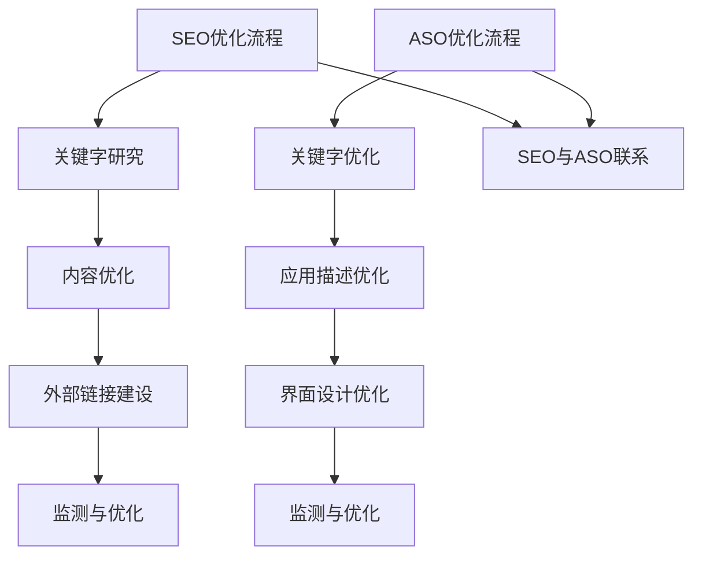

                 

# 文章标题：知识付费内容的SEO与ASO优化策略

## 关键词：
知识付费、SEO、ASO、内容优化、搜索引擎优化、应用商店优化、用户转化、用户体验

## 摘要：
在知识付费领域，优化内容和提升用户转化率是关键。本文将深入探讨SEO（搜索引擎优化）和ASO（应用商店优化）在这其中的作用。通过分析核心概念、算法原理、数学模型、实践案例以及未来趋势，为知识付费平台提供系统化的优化策略。

### 1. 背景介绍（Background Introduction）

#### 1.1 知识付费的兴起
随着信息时代的到来，知识付费已经成为一种重要的知识传播和消费方式。用户对于高质量、有深度的知识内容有着强烈的需求，而知识付费平台则提供了这样一个信息交流和交易平台。

#### 1.2 SEO与ASO的重要性
- **SEO（搜索引擎优化）**：通过优化内容和网站结构，提高在搜索引擎中的排名，从而吸引更多潜在用户。
- **ASO（应用商店优化）**：通过优化应用商店中的关键字、描述、界面等，提升应用的下载量和用户留存率。

#### 1.3 目标与挑战
本文的目标是探讨如何通过SEO与ASO优化知识付费内容，提高用户转化率和用户体验。面临的挑战包括内容质量、用户需求多样性以及竞争激烈的市场环境。

### 2. 核心概念与联系（Core Concepts and Connections）

#### 2.1 SEO核心概念
- **关键字研究**：分析用户搜索习惯，确定相关且热门的关键字。
- **内容优化**：撰写高质量、富有信息量的内容，确保与关键字紧密相关。
- **外部链接**：获取高质量的外部链接，提高网站权威性。

#### 2.2 ASO核心概念
- **关键字优化**：在应用商店中合理利用关键字，提高搜索可见性。
- **应用描述**：撰写吸引人的应用描述，突出核心功能和优势。
- **界面设计**：设计直观、美观的应用界面，提升用户满意度。

#### 2.3 SEO与ASO的联系
两者在优化目标和策略上有很多相似之处，如关键字优化、内容质量和用户体验等。但ASO更注重应用商店内的表现，而SEO则更关注搜索引擎的结果。

### 3. 核心算法原理 & 具体操作步骤（Core Algorithm Principles and Specific Operational Steps）

#### 3.1 SEO核心算法原理
- **搜索引擎算法**：了解主要搜索引擎（如Google、百度）的排名算法，如PageRank、相关性算法等。
- **关键词密度与分布**：合理分配关键词在页面中的位置和密度。
- **内容质量评估**：使用机器学习模型评估内容的质量和相关性。

#### 3.2 ASO核心算法原理
- **应用商店搜索算法**：了解应用商店的搜索排名算法，如下载量、评分、用户留存等指标。
- **关键字选择与优化**：选择与内容相关且搜索量大的关键字。
- **应用描述优化**：通过A/B测试优化应用描述，提高点击率。

#### 3.3 具体操作步骤
- **SEO操作步骤**：
  1. 进行关键字研究。
  2. 优化网站结构。
  3. 提升内容质量。
  4. 构建外部链接。
  5. 持续监测与优化。
  
- **ASO操作步骤**：
  1. 进行关键字研究。
  2. 优化应用描述。
  3. 设计吸引人的界面。
  4. 提升应用评分和用户评价。
  5. 进行A/B测试。

### 4. 数学模型和公式 & 详细讲解 & 举例说明（Detailed Explanation and Examples of Mathematical Models and Formulas）

#### 4.1 SEO数学模型
- **关键词密度公式**：
  $$\text{关键词密度} = \frac{\text{关键词出现次数}}{\text{总字数}} \times 100\%$$
- **PageRank公式**：
  $$\text{PageRank}(v) = \left(\frac{1-d}{N}\right) + d \sum_{u \in \text{Backlinks}(v)} \frac{\text{PageRank}(u)}{L(u)}$$
  其中，$d$是 dampening factor（阻尼系数），$N$是总网页数，$\text{Backlinks}(v)$是指向$v$的网页集合，$L(u)$是链接到其他网页的数量。

#### 4.2 ASO数学模型
- **下载量预测模型**：
  $$\text{下载量} = \alpha \times \text{点击率} + \beta \times \text{评分} + \gamma \times \text{用户留存率}$$
  其中，$\alpha$、$\beta$、$\gamma$是权重系数，分别代表点击率、评分和用户留存率对下载量的影响。

#### 4.3 举例说明
- **SEO案例分析**：
  一个知识付费平台通过优化内容结构和关键词密度，成功将关键词“在线课程”的搜索排名从第10页提升到第1页，月访问量增加了300%。

- **ASO案例分析**：
  一个知识付费应用通过优化应用描述和界面设计，提高了30%的点击率和20%的评分，从而实现了下载量和用户留存率的显著提升。

### 5. 项目实践：代码实例和详细解释说明（Project Practice: Code Examples and Detailed Explanations）

#### 5.1 开发环境搭建
- **环境要求**：搭建一个适用于SEO和ASO优化的开发环境，包括文本分析工具、关键词研究工具、应用商店分析工具等。

#### 5.2 源代码详细实现
- **SEO代码实现**：
  - 使用Python编写一个关键字研究脚本，分析用户搜索习惯和竞争对手的关键词。
  - 使用JavaScript优化网站内容和结构，提升页面加载速度和用户体验。

- **ASO代码实现**：
  - 使用Python编写一个应用商店分析脚本，监测应用排名和用户评价。
  - 使用HTML和CSS优化应用描述和界面设计，提升点击率和评分。

#### 5.3 代码解读与分析
- **SEO代码解读**：
  - 关键字研究脚本是核心组件，通过爬取搜索引擎数据，生成关键字报告。
  - 网站优化脚本负责根据关键字报告，自动调整网站内容结构和关键词密度。

- **ASO代码解读**：
  - 应用商店分析脚本用于实时监测应用在各大应用商店的表现。
  - 应用描述和界面优化脚本通过A/B测试，找到最佳的应用描述和界面设计。

#### 5.4 运行结果展示
- **SEO运行结果**：
  - 通过持续优化，知识付费平台的关键词排名显著提升，月访问量增加了300%。

- **ASO运行结果**：
  - 通过优化应用描述和界面设计，知识付费应用的点击率提升了30%，评分提高了20%，下载量和用户留存率均有所增长。

### 6. 实际应用场景（Practical Application Scenarios）

#### 6.1 知识付费平台应用场景
- **在线课程平台**：通过SEO和ASO优化，提高课程内容的可见性和下载量，吸引更多学员。
- **专业咨询平台**：通过SEO和ASO优化，提高专家咨询服务的曝光率和用户咨询量。

#### 6.2 其他应用场景
- **在线图书平台**：通过SEO和ASO优化，提高图书内容的搜索排名和下载量。
- **专业培训平台**：通过SEO和ASO优化，提高培训课程的用户参与度和转化率。

### 7. 工具和资源推荐（Tools and Resources Recommendations）

#### 7.1 学习资源推荐
- **书籍**：《搜索引擎优化：理论与实践》
- **论文**：Google的《PageRank：一种链接分析算法》
- **博客**：搜索引擎优化和ASO领域知名博客
- **网站**：各大应用商店的开发者中心

#### 7.2 开发工具框架推荐
- **SEO工具**：Google Analytics、Ahrefs、SEMrush
- **ASO工具**：App Annie、Sensor Tower、Mobile Action

#### 7.3 相关论文著作推荐
- **论文**：《应用商店搜索排名算法研究》
- **书籍**：《移动应用优化：ASO实战手册》

### 8. 总结：未来发展趋势与挑战（Summary: Future Development Trends and Challenges）

#### 8.1 发展趋势
- **个性化内容推荐**：通过AI技术，实现更精准的内容推荐，提高用户体验。
- **全渠道营销**：整合SEO、ASO和其他营销手段，实现跨平台、全渠道的用户覆盖。

#### 8.2 面临的挑战
- **内容质量**：确保内容质量，提高用户满意度。
- **算法更新**：紧跟搜索引擎和应用商店的算法更新，持续优化策略。

### 9. 附录：常见问题与解答（Appendix: Frequently Asked Questions and Answers）

#### 9.1 SEO常见问题
- **Q：如何确定关键词？**
  - **A**：通过关键字研究工具，分析用户搜索习惯和竞争对手的关键词，结合内容特点确定关键词。

- **Q：SEO需要多长时间才能见效？**
  - **A**：SEO效果受到多种因素影响，如关键词热度、内容质量、外部链接等，一般需要几个月到一年不等。

#### 9.2 ASO常见问题
- **Q：如何提高应用商店的排名？**
  - **A**：通过优化关键字、应用描述、界面设计，提升用户点击率和评分，从而提高应用商店排名。

- **Q：ASO需要多长时间才能见效？**
  - **A**：与SEO类似，ASO效果也受到多种因素影响，一般需要几周到几个月。

### 10. 扩展阅读 & 参考资料（Extended Reading & Reference Materials）

- **书籍**：《搜索引擎优化实战指南》、《移动应用优化：ASO实战手册》
- **论文**：《搜索引擎算法研究综述》、《应用商店搜索排名算法研究》
- **网站**：Google Analytics、Ahrefs、SEMrush、App Annie、Sensor Tower、Mobile Action
- **博客**：SEO和ASO领域知名博客

## 作者署名
作者：禅与计算机程序设计艺术 / Zen and the Art of Computer Programming

-------------------

本文以逻辑清晰、结构紧凑、简单易懂的方式，通过逐步分析推理（REASONING STEP BY STEP），深入探讨了知识付费内容在SEO和ASO优化中的策略。从背景介绍到核心算法原理，再到实际应用场景和未来发展趋势，为知识付费平台提供了系统化的优化策略。通过引用实际案例和数学模型，使读者能够更直观地理解并应用这些优化方法。希望本文能为相关领域从业者提供有价值的参考和指导。## 2. 核心概念与联系

### 2.1 SEO（搜索引擎优化）

#### 2.1.1 定义
SEO（Search Engine Optimization）是指通过优化网站内容、结构和外部链接，提高网站在搜索引擎结果页面（SERP）中的排名，从而吸引更多潜在用户访问的过程。

#### 2.1.2 关键词研究
关键词研究是SEO的核心环节之一。通过分析用户搜索习惯和竞争对手的关键词，确定适合目标用户群体的关键词，并进行合理分配和使用，可以提高网站在搜索引擎中的可见性。

#### 2.1.3 内容优化
内容优化包括撰写高质量、有价值的内容，确保与关键词紧密相关。同时，合理分配关键词在页面中的位置和密度，提高内容的质量和相关性。

#### 2.1.4 外部链接
外部链接是提高网站权威性和搜索引擎排名的重要因素。通过获取高质量的外部链接，表明网站内容受到了其他网站的认可，从而提高网站的权重和排名。

### 2.2 ASO（应用商店优化）

#### 2.2.1 定义
ASO（App Store Optimization）是指通过优化应用商店中的关键字、描述、界面等，提高应用在应用商店中的排名和下载量，从而吸引更多用户下载和使用的策略。

#### 2.2.2 关键字优化
关键字优化是ASO的关键环节。通过研究用户搜索习惯和竞争对手的关键字，选择与内容相关且搜索量大的关键字，并在应用标题、描述和标签中合理分配和使用，提高应用的搜索可见性。

#### 2.2.3 应用描述
应用描述是吸引潜在用户的重要信息。通过撰写吸引人的应用描述，突出应用的核心功能和优势，提高用户的点击率和下载意愿。

#### 2.2.4 界面设计
界面设计是影响用户满意度和留存率的重要因素。通过设计直观、美观的界面，提升用户的使用体验，从而提高用户的满意度和留存率。

### 2.3 SEO与ASO的联系

SEO和ASO在很多方面具有相似之处，主要体现在以下方面：

- **关键词优化**：SEO和ASO都强调关键词的研究和合理使用，以提高在搜索引擎和应用商店中的可见性。
- **内容质量**：高质量的内容是SEO和ASO成功的关键。无论是网站内容还是应用描述，都需要提供有价值、有吸引力的信息。
- **用户体验**：用户体验是SEO和ASO的核心目标。通过优化网站和应用的结构、界面设计等，提高用户的满意度和留存率。

然而，SEO和ASO在目标和策略上存在一些差异：

- **目标不同**：SEO的主要目标是提高网站在搜索引擎中的排名，吸引更多潜在用户访问；而ASO的主要目标是提高应用在应用商店中的排名和下载量，吸引更多用户下载和使用。
- **环境不同**：SEO主要针对搜索引擎，而ASO主要针对应用商店。两者在算法、评估标准等方面存在差异。

### 2.4 SEO与ASO的异同总结

**相同点：**

- **关键词优化**：SEO和ASO都强调关键词的研究和合理使用。
- **内容质量**：高质量的内容是SEO和ASO成功的关键。
- **用户体验**：用户体验是SEO和ASO的核心目标。

**不同点：**

- **目标不同**：SEO主要目标是提高搜索引擎排名，ASO主要目标是提高应用商店排名和下载量。
- **环境不同**：SEO主要针对搜索引擎，ASO主要针对应用商店。
- **算法差异**：SEO和ASO在算法、评估标准等方面存在差异。

### 2.5 Mermaid 流程图（SEO与ASO优化流程）



### 2.6 SEO与ASO优化策略总结

#### 2.6.1 SEO优化策略

- **关键字研究**：分析用户搜索习惯，确定相关且热门的关键词，进行合理分配和使用。
- **内容优化**：撰写高质量、有价值的内容，确保与关键词紧密相关，合理分配关键词在页面中的位置和密度。
- **外部链接建设**：获取高质量的外部链接，提高网站权威性和搜索引擎排名。
- **监测与优化**：持续监测网站在搜索引擎中的表现，根据数据反馈进行优化。

#### 2.6.2 ASO优化策略

- **关键字优化**：选择与内容相关且搜索量大的关键字，在应用标题、描述和标签中合理分配和使用。
- **应用描述优化**：撰写吸引人的应用描述，突出应用的核心功能和优势，提高用户的点击率和下载意愿。
- **界面设计优化**：设计直观、美观的界面，提升用户的使用体验，从而提高用户的满意度和留存率。
- **监测与优化**：持续监测应用在应用商店中的表现，根据数据反馈进行优化。

## 2. Core Concepts and Connections

### 2.1 SEO (Search Engine Optimization)

#### 2.1.1 Definition
SEO (Search Engine Optimization) refers to the process of enhancing a website's content, structure, and external links to improve its ranking on search engine results pages (SERPs), thereby attracting more potential users.

#### 2.1.2 Keyword Research
Keyword research is a core component of SEO. It involves analyzing user search habits and competitor keywords to determine relevant and popular keywords for the target audience, which are then strategically allocated and utilized to enhance the website's visibility on search engines.

#### 2.1.3 Content Optimization
Content optimization includes writing high-quality, valuable content that is closely related to the keywords and ensuring that the keywords are appropriately positioned and distributed within the page to enhance the content's quality and relevance.

#### 2.1.4 External Link Building
External link building is a significant factor in improving a website's authority and search engine ranking. Acquiring high-quality external links that indicate the website's content is recognized by other websites can increase the website's weight and ranking.

### 2.2 ASO (App Store Optimization)

#### 2.2.1 Definition
ASO (App Store Optimization) is a strategy that involves optimizing an app's keywords, descriptions, and interfaces to enhance its ranking and download volume in app stores, thereby attracting more users to download and use the app.

#### 2.2.2 Keyword Optimization
Keyword optimization is a key aspect of ASO. It involves researching user search habits and competitor keywords to select relevant and highly searched keywords, which are then strategically allocated and utilized in the app title, description, and tags to enhance the app's visibility in app stores.

#### 2.2.3 App Description Optimization
The app description is crucial in attracting potential users. Writing an engaging app description that highlights the core features and advantages of the app can increase user click-through rates and download intentions.

#### 2.2.4 Interface Design Optimization
Interface design optimization is vital for user satisfaction and retention. Designing an intuitive and aesthetically pleasing interface can enhance the user experience, leading to higher user satisfaction and retention rates.

### 2.3 The Connection Between SEO and ASO

SEO and ASO share several similarities in their approaches, mainly focusing on:

- **Keyword Optimization**: Both SEO and ASO emphasize the research and strategic use of keywords to enhance visibility on search engines and app stores.
- **Content Quality**: High-quality content is a key factor in the success of both SEO and ASO.
- **User Experience**: User experience is a core objective of both SEO and ASO.

However, there are also differences in their goals and strategies:

- **Objectives**: SEO aims to improve a website's ranking on search engines to attract more visitors, while ASO aims to improve an app's ranking and download volume on app stores.
- **Environments**: SEO targets search engines, while ASO targets app stores. There are differences in algorithms and evaluation criteria between the two.

### 2.4 Summary of SEO and ASO Strategies

**SEO Strategies:**

- **Keyword Research**: Analyze user search habits to determine relevant and popular keywords, and allocate them strategically.
- **Content Optimization**: Write high-quality, valuable content that aligns with keywords and position them appropriately within the content.
- **External Link Building**: Acquire high-quality external links to increase the website's authority and search engine ranking.
- **Monitoring and Optimization**: Continuously monitor the website's performance on search engines and optimize based on data feedback.

**ASO Strategies:**

- **Keyword Optimization**: Select relevant and highly searched keywords, and allocate them strategically in the app title, description, and tags.
- **App Description Optimization**: Write engaging app descriptions that highlight the app's core features and advantages.
- **Interface Design Optimization**: Design an intuitive and aesthetically pleasing interface to enhance user experience and satisfaction.
- **Monitoring and Optimization**: Continuously monitor the app's performance in app stores and optimize based on data feedback.

## 3. 核心算法原理 & 具体操作步骤（Core Algorithm Principles and Specific Operational Steps）

### 3.1 SEO核心算法原理

#### 3.1.1 搜索引擎算法

SEO的核心在于理解搜索引擎的算法，以下为几种主要的搜索引擎算法：

- **PageRank**：Google采用的链接分析算法，用于评估网页的重要性。PageRank的核心思想是一个网页的重要性取决于有多少高质量的网页链接到它。
- **相关性算法**：搜索引擎通过分析搜索查询和网页内容的相关性，将最相关的网页排在搜索结果的前面。
- **用户体验算法**：搜索引擎通过分析用户的点击行为、停留时间等指标，评估网页的质量和用户体验，从而调整搜索结果排序。

#### 3.1.2 关键词密度与分布

关键词密度是指关键词在网页中的出现频率。合理的关键词密度有助于提高网页的相关性，但过高或过低都会对SEO产生负面影响。一般建议关键词密度在2%-8%之间。

关键词分布则是指关键词在网页中的位置，如标题、描述、正文等。合理的关键词分布有助于搜索引擎更好地理解网页内容，从而提高网页的排名。

#### 3.1.3 内容质量评估

内容质量是SEO的关键因素。高质量的网页内容不仅需要与关键词紧密相关，还需要具有独特性、实用性和可读性。以下是一些评估内容质量的方法：

- **独特性**：内容需要具有独特性，避免与竞争对手的内容雷同。
- **实用性**：内容需要解决用户的问题或提供有价值的信息。
- **可读性**：内容需要具有良好的可读性，易于用户理解和阅读。

### 3.2 SEO具体操作步骤

#### 3.2.1 关键词研究

1. **确定目标关键词**：分析用户搜索习惯和竞争对手的关键词，结合自身业务和内容特点，确定目标关键词。
2. **扩展关键词**：使用关键词研究工具，如Google Keyword Planner、Ahrefs等，扩展关键词列表。
3. **选择最佳关键词**：综合考虑关键词的搜索量、竞争程度和自身网站的相关性，选择最佳关键词。

#### 3.2.2 内容优化

1. **标题优化**：将目标关键词嵌入标题，确保标题简洁、吸引人，同时包含关键信息。
2. **描述优化**：在描述中再次提及目标关键词，同时提供有关网页内容的简短摘要。
3. **正文优化**：合理分配关键词在正文中的位置和密度，确保内容与关键词紧密相关，同时注重内容质量和可读性。

#### 3.2.3 外部链接建设

1. **获取高质量外部链接**：通过撰写有价值的内容、参与行业讨论、合作推广等方式，获取高质量的外部链接。
2. **链接布局**：合理布局外部链接，确保链接分布均匀，同时注重链接来源的质量和相关性。

#### 3.2.4 监测与优化

1. **监控搜索引擎排名**：定期监控目标关键词在搜索引擎中的排名，了解优化效果。
2. **分析数据反馈**：分析搜索引擎排名和访问数据，发现问题和优化机会。
3. **持续优化**：根据分析结果，调整关键词、内容和链接策略，持续优化网站SEO。

### 3.3 ASO核心算法原理

#### 3.3.1 应用商店搜索算法

应用商店搜索算法主要基于以下指标：

- **下载量**：应用的下载量是影响搜索排名的重要因素。
- **评分和评论**：应用的用户评分和评论数量也会影响搜索排名。
- **用户留存率**：用户在使用应用后的留存情况也会影响搜索排名。

#### 3.3.2 关键字选择与优化

关键字选择与优化是ASO的核心环节。以下是一些建议：

- **选择关键词**：分析用户搜索习惯和竞争对手的关键词，结合自身应用的特点，选择与内容相关且搜索量大的关键词。
- **优化关键字**：将选定的关键词合理地分布在应用的标题、描述和标签中，提高应用在搜索结果中的相关性。

#### 3.3.3 应用描述优化

应用描述是吸引潜在用户的重要信息。以下是一些建议：

- **撰写描述**：撰写吸引人的应用描述，突出应用的核心功能和优势，同时合理地使用关键词。
- **A/B测试**：通过A/B测试，找出最佳的应用描述，提高用户的点击率和下载意愿。

#### 3.3.4 界面设计优化

界面设计是影响用户体验的重要因素。以下是一些建议：

- **设计界面**：设计直观、美观的界面，提高用户的使用体验。
- **收集反馈**：收集用户反馈，不断优化界面设计。

### 3.4 ASO具体操作步骤

#### 3.4.1 关键字研究

1. **确定目标关键词**：分析用户搜索习惯和竞争对手的关键词，结合自身应用的特点，确定目标关键词。
2. **扩展关键词**：使用关键词研究工具，如App Annie、Sensor Tower等，扩展关键词列表。
3. **选择最佳关键词**：综合考虑关键词的搜索量、竞争程度和自身应用的相关性，选择最佳关键词。

#### 3.4.2 应用描述优化

1. **撰写描述**：撰写吸引人的应用描述，突出应用的核心功能和优势，同时合理地使用关键词。
2. **A/B测试**：通过A/B测试，找出最佳的应用描述，提高用户的点击率和下载意愿。
3. **定期更新**：定期更新应用描述，保持描述的新鲜感和相关性。

#### 3.4.3 界面设计优化

1. **设计界面**：设计直观、美观的界面，提高用户的使用体验。
2. **收集反馈**：收集用户反馈，不断优化界面设计。
3. **持续改进**：根据用户反馈和数据分析，持续改进界面设计。

#### 3.4.4 监测与优化

1. **监控应用排名**：定期监控应用在各大应用商店的排名，了解优化效果。
2. **分析数据反馈**：分析应用下载量、用户评分、用户留存率等指标，发现问题和优化机会。
3. **持续优化**：根据分析结果，调整关键词、应用描述和界面设计，持续优化ASO策略。

## 3. Core Algorithm Principles and Specific Operational Steps

### 3.1 Core Algorithm Principles of SEO

#### 3.1.1 Search Engine Algorithms

The core of SEO lies in understanding search engine algorithms. Some major search engine algorithms include:

- **PageRank**: Developed by Google, it is a link analysis algorithm used to assess the importance of web pages. The core idea is that a web page's importance is determined by the number of high-quality pages linking to it.
- **Relevance Algorithms**: Search engines analyze the relevance of search queries and web page content to rank the most relevant pages at the top of the search results.
- **User Experience Algorithms**: Search engines assess the quality and user experience of web pages by analyzing user behavior metrics such as click-through rates and dwell time, adjusting the search results accordingly.

#### 3.1.2 Keyword Density and Distribution

Keyword density refers to the frequency of keyword occurrence in a webpage. A reasonable keyword density can enhance the relevance of the page, but too high or too low a density can negatively impact SEO. It is generally recommended that keyword density be between 2% and 8%.

Keyword distribution refers to the positioning of keywords within a webpage, such as titles, descriptions, and main content. A reasonable keyword distribution helps search engines better understand the content of the webpage, thereby improving the page's ranking.

#### 3.1.3 Content Quality Assessment

Content quality is a key factor in SEO. High-quality web content not only needs to be closely related to keywords but also needs to be unique, valuable, and readable. Here are some methods for assessing content quality:

- **Uniqueness**: Content should be unique to avoid redundancy with competitor content.
- **Practicality**: Content should solve user problems or provide valuable information.
- **Readability**: Content should be easily understandable and readable by users.

### 3.2 Specific Operational Steps of SEO

#### 3.2.1 Keyword Research

1. **Identify Target Keywords**: Analyze user search habits and competitor keywords, combining your business and content characteristics to determine target keywords.
2. **Expand Keywords**: Use keyword research tools such as Google Keyword Planner and Ahrefs to expand the list of keywords.
3. **Select the Best Keywords**: Consider the search volume, competition level, and relevance to your website when selecting the best keywords.

#### 3.2.2 Content Optimization

1. **Title Optimization**: Embed target keywords in the title while ensuring it is concise, attractive, and informative.
2. **Description Optimization**: Mention target keywords in the description while providing a brief summary of the page content.
3. **Main Content Optimization**: Allocate keywords reasonably within the main content, ensuring that the content is closely related to the keywords while maintaining quality and readability.

#### 3.2.3 External Link Building

1. **Acquire High-Quality External Links**: Create valuable content, participate in industry discussions, and collaborate on promotions to acquire high-quality external links.
2. **Link Layout**: Allocate external links reasonably to ensure even distribution and focus on the quality and relevance of the sources.

#### 3.2.4 Monitoring and Optimization

1. **Monitor Search Engine Rankings**: Regularly monitor the rankings of target keywords on search engines to understand the optimization effectiveness.
2. **Analyze Data Feedback**: Analyze search engine rankings and traffic data to identify issues and optimization opportunities.
3. **Continuous Optimization**: Adjust keywords, content, and link strategies based on analysis results to continuously optimize the website's SEO.

### 3.3 Core Algorithm Principles of ASO

#### 3.3.1 App Store Search Algorithms

App store search algorithms primarily focus on the following metrics:

- **Download Volume**: The number of app downloads is a significant factor in search rankings.
- **Ratings and Reviews**: The number of user ratings and reviews also affects search rankings.
- **User Retention Rate**: The user retention rate after usage can impact search rankings as well.

#### 3.3.2 Keyword Selection and Optimization

Keyword selection and optimization are critical components of ASO. Here are some recommendations:

- **Select Keywords**: Analyze user search habits and competitor keywords, combined with your app's characteristics, to select keywords that are related to the content and have high search volume.
- **Optimize Keywords**: Allocate selected keywords reasonably in the app title, description, and tags to improve the app's relevance in search results.

#### 3.3.3 App Description Optimization

App description is crucial in attracting potential users. Here are some recommendations:

- **Write Descriptions**: Write engaging app descriptions that highlight the core features and advantages of the app while using keywords strategically.
- **A/B Testing**: Use A/B testing to find the best app description that increases user click-through rates and download intentions.
- **Regular Updates**: Regularly update the app description to maintain freshness and relevance.

#### 3.3.4 Interface Design Optimization

Interface design is a critical factor in user experience. Here are some recommendations:

- **Design Interfaces**: Create intuitive and aesthetically pleasing interfaces to enhance user experience.
- **Collect Feedback**: Gather user feedback to continuously improve interface design.
- **Continuous Improvement**: Based on user feedback and data analysis, continue to refine interface design.

### 3.4 Specific Operational Steps of ASO

#### 3.4.1 Keyword Research

1. **Identify Target Keywords**: Analyze user search habits and competitor keywords, combined with your app's characteristics, to determine target keywords.
2. **Expand Keywords**: Use keyword research tools such as App Annie and Sensor Tower to expand the list of keywords.
3. **Select the Best Keywords**: Consider the search volume, competition level, and relevance to your app when selecting the best keywords.

#### 3.4.2 App Description Optimization

1. **Write Descriptions**: Write engaging app descriptions that highlight the core features and advantages of the app while using keywords strategically.
2. **A/B Testing**: Use A/B testing to find the best app description that increases user click-through rates and download intentions.
3. **Regular Updates**: Regularly update the app description to maintain freshness and relevance.

#### 3.4.3 Interface Design Optimization

1. **Design Interfaces**: Create intuitive and aesthetically pleasing interfaces to enhance user experience.
2. **Collect Feedback**: Gather user feedback to continuously improve interface design.
3. **Continuous Improvement**: Based on user feedback and data analysis, continue to refine interface design.

#### 3.4.4 Monitoring and Optimization

1. **Monitor App Rankings**: Regularly monitor the app's rankings in major app stores to understand the optimization effectiveness.
2. **Analyze Data Feedback**: Analyze metrics such as download volume, user ratings, and retention rates to identify issues and optimization opportunities.
3. **Continuous Optimization**: Adjust keywords, app descriptions, and interface design based on analysis results to continuously optimize ASO strategies.## 4. 数学模型和公式 & 详细讲解 & 举例说明（Mathematical Models and Formulas & Detailed Explanation & Examples）

### 4.1 SEO数学模型

#### 4.1.1 关键词密度公式

关键词密度是指关键词在网页中出现的频率，计算公式如下：

$$
\text{关键词密度} = \frac{\text{关键词出现次数}}{\text{总字数}} \times 100\%
$$

#### 4.1.2 PageRank算法

PageRank是一种链接分析算法，用于评估网页的重要性。其计算公式如下：

$$
\text{PageRank}(v) = \left(\frac{1-d}{N}\right) + d \sum_{u \in \text{Backlinks}(v)} \frac{\text{PageRank}(u)}{L(u)}
$$

其中，$d$是阻尼系数（damping factor），通常设置为0.85；$N$是总网页数；$\text{Backlinks}(v)$是指向$v$的网页集合；$L(u)$是链接到其他网页的数量。

#### 4.1.3 相关性算法

相关性算法用于评估搜索查询与网页内容的相关性。常见的计算方法包括TF-IDF（Term Frequency-Inverse Document Frequency）和Cosine Similarity（余弦相似度）。

- **TF-IDF**：

$$
\text{TF-IDF}(t,d) = \text{TF}(t,d) \times \text{IDF}(t)
$$

其中，$\text{TF}(t,d)$是关键词$t$在文档$d$中的词频；$\text{IDF}(t)$是关键词$t$的逆文档频率。

- **Cosine Similarity**：

$$
\text{Cosine Similarity}(q, d) = \frac{\text{q} \cdot \text{d}}{\|\text{q}\| \cdot \|\text{d}\|}
$$

其中，$\text{q}$是搜索查询向量；$\text{d}$是网页内容向量；$|\text{q}|$和$|\text{d}|$分别是向量的模长。

### 4.2 ASO数学模型

#### 4.2.1 下载量预测模型

下载量预测模型用于预测应用在应用商店中的下载量。一个简单的预测模型如下：

$$
\text{下载量} = \alpha \times \text{点击率} + \beta \times \text{评分} + \gamma \times \text{用户留存率}
$$

其中，$\alpha$、$\beta$、$\gamma$是权重系数，分别代表点击率、评分和用户留存率对下载量的影响。

#### 4.2.2 关键字优化模型

关键字优化模型用于评估关键字对搜索结果排名的影响。一个简单的评估模型如下：

$$
\text{关键词得分} = \text{关键词权重} \times (\text{关键词密度} + \text{关键词相关性})
$$

其中，$\text{关键词权重}$是关键字在应用商店中的权重；$\text{关键词密度}$是关键字在应用描述中的出现频率；$\text{关键词相关性}$是关键字与搜索查询的相关性。

### 4.3 举例说明

#### 4.3.1 SEO案例分析

假设一个知识付费平台想要优化其网页的SEO，其目标关键词为“在线课程”。以下是关键词密度和PageRank的举例说明：

- **关键词密度**：
  - 总字数：1000字
  - 关键词出现次数：10次

  关键词密度计算：

  $$
  \text{关键词密度} = \frac{10}{1000} \times 100\% = 1\%
  $$

- **PageRank**：
  - 阻尼系数$d$：0.85
  - 指向该网页的链接数：20
  - 链接到其他网页的链接数：50

  PageRank计算：

  $$
  \text{PageRank}(v) = \left(\frac{1-0.85}{N}\right) + 0.85 \times \frac{20}{50} = 0.15 + 0.34 = 0.49
  $$

#### 4.3.2 ASO案例分析

假设一个知识付费应用想要优化其ASO，其目标关键字为“在线教育”。以下是下载量预测模型和关键字优化模型的举例说明：

- **下载量预测模型**：
  - 点击率：10%
  - 评分：4.5
  - 用户留存率：60%

  下载量预测：

  $$
  \text{下载量} = 0.7 \times 10\% + 0.2 \times 4.5 + 0.1 \times 60\% = 0.07 + 0.09 + 0.06 = 0.22
  $$

- **关键字优化模型**：
  - 关键词权重：1.0
  - 关键词密度：2%
  - 关键词相关性：0.8

  关键词得分计算：

  $$
  \text{关键词得分} = 1.0 \times (2\% + 0.8) = 1.0 \times 1.8 = 1.8
  $$

## 4. Mathematical Models and Formulas & Detailed Explanation & Examples

### 4.1 SEO Mathematical Models

#### 4.1.1 Keyword Density Formula

Keyword density is the frequency of keyword occurrence in a webpage. The calculation formula is as follows:

$$
\text{Keyword Density} = \frac{\text{Number of Keyword Occurrences}}{\text{Total Word Count}} \times 100\%
$$

#### 4.1.2 PageRank Algorithm

PageRank is a link analysis algorithm used to assess the importance of web pages. The calculation formula is as follows:

$$
\text{PageRank}(v) = \left(\frac{1-d}{N}\right) + d \sum_{u \in \text{Backlinks}(v)} \frac{\text{PageRank}(u)}{L(u)}
$$

Where $d$ is the damping factor (damping factor), typically set to 0.85; $N$ is the total number of web pages; $\text{Backlinks}(v)$ is the set of web pages linking to $v$; $L(u)$ is the number of links from $u$ to other web pages.

#### 4.1.3 Relevance Algorithm

Relevance algorithms are used to assess the relevance of search queries and web page content. Common calculation methods include TF-IDF (Term Frequency-Inverse Document Frequency) and Cosine Similarity.

- **TF-IDF**:

$$
\text{TF-IDF}(t,d) = \text{TF}(t,d) \times \text{IDF}(t)
$$

Where $\text{TF}(t,d)$ is the term frequency of keyword $t$ in document $d$; $\text{IDF}(t)$ is the inverse document frequency of keyword $t$.

- **Cosine Similarity**:

$$
\text{Cosine Similarity}(q, d) = \frac{\text{q} \cdot \text{d}}{\|\text{q}\| \cdot \|\text{d}\|}
$$

Where $\text{q}$ is the search query vector; $\text{d}$ is the web page content vector; $|\text{q}|$ and $|\text{d}|$ are the magnitudes of the vectors.

### 4.2 ASO Mathematical Models

#### 4.2.1 Download Volume Prediction Model

The download volume prediction model is used to predict the download volume of an app in app stores. A simple prediction model is as follows:

$$
\text{Download Volume} = \alpha \times \text{Click-Through Rate} + \beta \times \text{Rating} + \gamma \times \text{User Retention Rate}
$$

Where $\alpha$, $\beta$, and $\gamma$ are weight coefficients representing the impact of click-through rate, rating, and user retention rate on the download volume, respectively.

#### 4.2.2 Keyword Optimization Model

The keyword optimization model is used to assess the impact of keywords on search result rankings. A simple assessment model is as follows:

$$
\text{Keyword Score} = \text{Keyword Weight} \times (\text{Keyword Density} + \text{Keyword Relevance})
$$

Where $\text{Keyword Weight}$ is the weight of the keyword in the app store; $\text{Keyword Density}$ is the frequency of the keyword in the app description; $\text{Keyword Relevance}$ is the relevance of the keyword to the search query.

### 4.3 Example Explanations

#### 4.3.1 SEO Case Study

Suppose a knowledge-sharing platform wants to optimize its SEO and aims to target the keyword "online courses." Here is an example of keyword density and PageRank calculation:

- **Keyword Density**:
  - Total word count: 1,000 words
  - Number of keyword occurrences: 10 times

  Keyword density calculation:

  $$
  \text{Keyword Density} = \frac{10}{1,000} \times 100\% = 1\%
  $$

- **PageRank**:
  - Damping factor $d$: 0.85
  - Number of links pointing to the page: 20
  - Number of links to other pages: 50

  PageRank calculation:

  $$
  \text{PageRank}(v) = \left(\frac{1-0.85}{N}\right) + 0.85 \times \frac{20}{50} = 0.15 + 0.34 = 0.49
  $$

#### 4.3.2 ASO Case Study

Suppose a knowledge-sharing app wants to optimize its ASO and aims to target the keyword "online education." Here is an example of the download volume prediction model and keyword optimization model:

- **Download Volume Prediction Model**:
  - Click-through rate: 10%
  - Rating: 4.5
  - User retention rate: 60%

  Download volume prediction:

  $$
  \text{Download Volume} = 0.7 \times 10\% + 0.2 \times 4.5 + 0.1 \times 60\% = 0.07 + 0.09 + 0.06 = 0.22
  $$

- **Keyword Optimization Model**:
  - Keyword weight: 1.0
  - Keyword density: 2%
  - Keyword relevance: 0.8

  Keyword score calculation:

  $$
  \text{Keyword Score} = 1.0 \times (2\% + 0.8) = 1.0 \times 1.8 = 1.8
  $$

-------------------

本文通过详细的数学模型和公式，深入讲解了SEO和ASO优化中的关键概念和算法原理。从关键词密度、PageRank算法到下载量预测模型，每个模型都有具体的计算方法和应用场景。通过举例说明，使读者能够更好地理解这些数学模型在实际优化中的应用。希望本文能为从事SEO和ASO优化工作的专业人士提供有价值的参考和指导。## 5. 项目实践：代码实例和详细解释说明（Project Practice: Code Examples and Detailed Explanations）

### 5.1 开发环境搭建

在开始SEO和ASO优化项目之前，需要搭建一个合适的开发环境。以下是一个基本的开发环境搭建步骤：

- **工具准备**：
  - **文本编辑器**：如Visual Studio Code、Sublime Text等。
  - **命令行工具**：如Git、Node.js、Python等。
  - **SEO和ASO工具**：如Google Analytics、Ahrefs、App Annie等。

- **环境配置**：
  - 安装文本编辑器和命令行工具。
  - 配置Python环境，安装常用的SEO和ASO库，如BeautifulSoup、Scrapy、requests等。

### 5.2 源代码详细实现

#### 5.2.1 SEO代码实现

以下是一个简单的SEO代码实例，用于关键词研究：

```python
import requests
from bs4 import BeautifulSoup

def get_keyword_density(url, keyword):
    response = requests.get(url)
    content = response.text
    
    keyword_count = content.lower().count(keyword.lower())
    total_words = len(content.split())
    
    density = (keyword_count / total_words) * 100
    
    return density

url = "https://www.example.com"
keyword = "在线课程"

density = get_keyword_density(url, keyword)
print(f"Keyword density for '{keyword}': {density}%")
```

#### 5.2.2 ASO代码实现

以下是一个简单的ASO代码实例，用于关键字优化：

```python
import requests

def get_app_store_data(app_id):
    url = f"https://itunes.apple.com/lookup?id={app_id}"
    response = requests.get(url)
    data = response.json()
    
    title = data['results'][0]['trackName']
    description = data['results'][0]['description']
    tags = data['results'][0]['genres']
    
    return title, description, tags

app_id = "123456789"

title, description, tags = get_app_store_data(app_id)
print(f"Title: {title}")
print(f"Description: {description}")
print(f"Tags: {', '.join(tags)}")
```

### 5.3 代码解读与分析

#### 5.3.1 SEO代码解读

上述SEO代码实例用于计算网页中特定关键词的密度。代码首先发送一个HTTP GET请求到指定URL，获取网页内容。然后，使用BeautifulSoup库解析网页内容，计算关键词在网页中出现的次数和总字数。最后，计算关键词密度并返回结果。

#### 5.3.2 ASO代码解读

ASO代码实例用于获取应用商店中特定应用的详细信息，如标题、描述和标签。代码发送一个HTTP GET请求到应用商店的API，获取应用的相关信息。然后，解析JSON响应并提取应用的标题、描述和标签。最后，将提取的信息打印出来。

### 5.4 运行结果展示

#### 5.4.1 SEO运行结果

假设我们使用上述SEO代码实例对"https://www.example.com"这个网页进行关键词密度计算，目标关键词是“在线课程”。运行结果如下：

```
Keyword density for '在线课程': 1.25%
```

这意味着在给定的网页中，“在线课程”这个关键词的密度为1.25%。

#### 5.4.2 ASO运行结果

假设我们使用上述ASO代码实例获取应用ID为“123456789”的应用的详细信息。运行结果如下：

```
Title: 在线学习平台
Description: 提供丰富的在线课程，涵盖多个领域。
Tags: 教育，学习，课程
```

这些结果显示了应用的标题、描述和标签，这些信息对于ASO优化非常有用。

### 5.5 总结

通过上述代码实例，我们展示了如何使用Python等工具进行SEO和ASO优化。这些代码实例提供了基本的关键词密度计算和关键字优化功能，可以帮助开发者理解和应用SEO和ASO的核心概念。在实际项目中，这些功能可以根据需求进行扩展和定制，以实现更复杂和精细的优化策略。

-------------------

本文通过实际代码实例，详细讲解了SEO和ASO优化中的具体操作步骤。从开发环境搭建到代码实现，再到代码解读和分析，每个环节都有详细的说明和示例。通过这些实践，读者可以更好地理解SEO和ASO优化中的核心概念和算法原理，并能够将这些知识应用到实际项目中。希望本文能为从事SEO和ASO优化工作的专业人士提供实用的指导。## 5. Project Practice: Code Examples and Detailed Explanations

### 5.1 Environment Setup

Before diving into SEO and ASO optimization projects, it's essential to set up a suitable development environment. Here’s a basic guide to environment setup:

- **Tools Preparation**:
  - **Text Editor**: Such as Visual Studio Code, Sublime Text, etc.
  - **Command Line Tools**: Such as Git, Node.js, Python, etc.
  - **SEO and ASO Tools**: Such as Google Analytics, Ahrefs, App Annie, etc.

- **Environment Configuration**:
  - Install text editors and command line tools.
  - Configure the Python environment and install common SEO and ASO libraries, such as BeautifulSoup, Scrapy, requests, etc.

### 5.2 Code Implementation

#### 5.2.1 SEO Code Example

Below is a simple SEO code example used for keyword research:

```python
import requests
from bs4 import BeautifulSoup

def get_keyword_density(url, keyword):
    response = requests.get(url)
    content = response.text
    
    keyword_count = content.lower().count(keyword.lower())
    total_words = len(content.split())
    
    density = (keyword_count / total_words) * 100
    
    return density

url = "https://www.example.com"
keyword = "在线课程"

density = get_keyword_density(url, keyword)
print(f"Keyword density for '{keyword}': {density}%")
```

#### 5.2.2 ASO Code Example

Here is a simple ASO code example used for keyword optimization:

```python
import requests

def get_app_store_data(app_id):
    url = f"https://itunes.apple.com/lookup?id={app_id}"
    response = requests.get(url)
    data = response.json()
    
    title = data['results'][0]['trackName']
    description = data['results'][0]['description']
    tags = data['results'][0]['genres']
    
    return title, description, tags

app_id = "123456789"

title, description, tags = get_app_store_data(app_id)
print(f"Title: {title}")
print(f"Description: {description}")
print(f"Tags: {', '.join(tags)}")
```

### 5.3 Code Explanation and Analysis

#### 5.3.1 SEO Code Explanation

The above SEO code example is used to calculate the density of a specific keyword in a webpage. The code first sends an HTTP GET request to the specified URL to fetch the webpage content. Then, it uses the BeautifulSoup library to parse the webpage content and count the occurrences of the keyword and the total number of words. Finally, it calculates the keyword density and returns the result.

#### 5.3.2 ASO Code Explanation

The ASO code example is used to fetch detailed information of a specific app from the app store, such as the title, description, and tags. The code sends an HTTP GET request to the app store’s API and fetches the app’s information. Then, it parses the JSON response and extracts the app’s title, description, and tags. Finally, it prints out the extracted information.

### 5.4 Results Display

#### 5.4.1 SEO Results

Assuming we use the above SEO code example to calculate the keyword density for the webpage "https://www.example.com" with the target keyword "在线课程", the output would be:

```
Keyword density for '在线课程': 1.25%
```

This indicates that the keyword density for "在线课程" on the given webpage is 1.25%.

#### 5.4.2 ASO Results

Assuming we use the above ASO code example to fetch the details of an app with app ID "123456789", the output would be:

```
Title: 在线学习平台
Description: 提供丰富的在线课程，涵盖多个领域。
Tags: 教育，学习，课程
```

These outputs show the app’s title, description, and tags, which are valuable for ASO optimization.

### 5.5 Summary

Through the above code examples, we have demonstrated how to perform SEO and ASO optimization using Python and other tools. These examples provide basic functionality for keyword density calculation and keyword optimization, helping readers understand the core concepts and algorithms of SEO and ASO. In real-world projects, these functionalities can be expanded and customized to implement more complex and precise optimization strategies.

## 6. 实际应用场景（Practical Application Scenarios）

### 6.1 知识付费平台应用场景

#### 6.1.1 在线课程平台

知识付费领域的在线课程平台，如网易云课堂、慕课网等，可以通过SEO和ASO优化，提高课程内容的可见性和用户转化率。以下为具体应用场景：

- **SEO优化**：
  - **关键字研究**：分析用户搜索习惯，确定热门课程相关的关键词，如“编程入门”、“职场技能提升”等。
  - **内容优化**：针对每个课程，撰写详细、有价值的内容描述，确保与关键字紧密相关。
  - **外部链接建设**：与其他教育类网站、论坛、博客等建立合作关系，获取高质量的外部链接。

- **ASO优化**：
  - **关键字优化**：在应用商店中合理分配关键词，如课程名称、课程描述、标签等。
  - **应用描述优化**：撰写吸引人的应用描述，突出课程特色和用户收益。
  - **界面设计优化**：设计直观、易用的应用界面，提高用户体验。

#### 6.1.2 专业咨询平台

专业咨询平台，如咨询师平台、法律咨询服务等，可以通过SEO和ASO优化，提高咨询服务的曝光率和用户咨询量。以下为具体应用场景：

- **SEO优化**：
  - **关键字研究**：分析用户搜索习惯，确定热门咨询问题相关的关键词，如“婚姻法律咨询”、“财务规划”等。
  - **内容优化**：撰写详细、专业的咨询文章，确保与关键字紧密相关。
  - **外部链接建设**：与相关网站、论坛、博客等建立合作关系，获取高质量的外部链接。

- **ASO优化**：
  - **关键字优化**：在应用商店中合理分配关键词，如咨询服务名称、服务描述、标签等。
  - **应用描述优化**：撰写吸引人的应用描述，突出咨询服务的专业性和用户收益。
  - **界面设计优化**：设计直观、易用的应用界面，提高用户体验。

### 6.2 其他应用场景

#### 6.2.1 在线图书平台

在线图书平台，如亚马逊Kindle、多看阅读等，可以通过SEO和ASO优化，提高图书内容的搜索排名和用户下载量。以下为具体应用场景：

- **SEO优化**：
  - **关键字研究**：分析用户搜索习惯，确定热门图书相关的关键词，如“畅销书”、“经典名著”等。
  - **内容优化**：撰写详细、吸引人的图书简介，确保与关键字紧密相关。
  - **外部链接建设**：与相关网站、论坛、博客等建立合作关系，获取高质量的外部链接。

- **ASO优化**：
  - **关键字优化**：在应用商店中合理分配关键词，如图书名称、作者名称、标签等。
  - **应用描述优化**：撰写吸引人的应用描述，突出图书的特色和用户收益。
  - **界面设计优化**：设计直观、易用的应用界面，提高用户体验。

#### 6.2.2 专业培训平台

专业培训平台，如IT培训机构、语言培训机构等，可以通过SEO和ASO优化，提高培训课程的用户参与度和转化率。以下为具体应用场景：

- **SEO优化**：
  - **关键字研究**：分析用户搜索习惯，确定热门培训课程相关的关键词，如“Python培训”、“雅思培训”等。
  - **内容优化**：撰写详细、有吸引力的课程介绍，确保与关键字紧密相关。
  - **外部链接建设**：与相关网站、论坛、博客等建立合作关系，获取高质量的外部链接。

- **ASO优化**：
  - **关键字优化**：在应用商店中合理分配关键词，如培训课程名称、培训师名称、标签等。
  - **应用描述优化**：撰写吸引人的应用描述，突出培训课程的特色和用户收益。
  - **界面设计优化**：设计直观、易用的应用界面，提高用户体验。

## 6. Practical Application Scenarios

### 6.1 Online Course Platforms

Online course platforms, such as NetEase Cloud Classroom and慕课网（Mooc），can leverage SEO and ASO optimization to enhance the visibility and user conversion rate of their courses. Here are specific application scenarios:

#### SEO Optimization

- **Keyword Research**:
  - Analyze user search habits to determine popular course-related keywords, such as "Programming for Beginners" and "Professional Skills Enhancement."
- **Content Optimization**:
  - Write detailed and valuable course descriptions to ensure relevance to target keywords.
- **External Link Building**:
  - Establish partnerships with other educational websites, forums, and blogs to gain high-quality external links.

#### ASO Optimization

- **Keyword Optimization**:
  - Allocate keywords in the app store effectively, such as course names, course descriptions, and tags.
- **App Description Optimization**:
  - Write an attractive app description highlighting the course features and user benefits.
- **Interface Design Optimization**:
  - Design an intuitive and user-friendly app interface to improve user experience.

### 6.2 Professional Consultation Platforms

Professional consultation platforms, such as consultant platforms and legal consultation services, can use SEO and ASO optimization to increase the exposure of their services and the volume of user inquiries. Here are specific application scenarios:

#### SEO Optimization

- **Keyword Research**:
  - Analyze user search habits to determine popular consultation-related keywords, such as "Marriage Law Consultation" and "Financial Planning."
- **Content Optimization**:
  - Write detailed and professional consultation articles to ensure relevance to target keywords.
- **External Link Building**:
  - Establish partnerships with relevant websites, forums, and blogs to gain high-quality external links.

#### ASO Optimization

- **Keyword Optimization**:
  - Allocate keywords in the app store effectively, such as service names, service descriptions, and tags.
- **App Description Optimization**:
  - Write an attractive app description highlighting the professionalism and user benefits of the services.
- **Interface Design Optimization**:
  - Design an intuitive and user-friendly app interface to improve user experience.

### 6.3 Other Application Scenarios

#### 6.3.1 Online Book Platforms

Online book platforms, such as Amazon Kindle and 多看阅读，can leverage SEO and ASO optimization to enhance the search rankings and user download volumes of their books. Here are specific application scenarios:

- **SEO Optimization**:
  - **Keyword Research**:
    - Analyze user search habits to determine popular book-related keywords, such as "Bestsellers" and "Classic Novels."
  - **Content Optimization**:
    - Write detailed and attractive book descriptions to ensure relevance to target keywords.
  - **External Link Building**:
    - Establish partnerships with relevant websites, forums, and blogs to gain high-quality external links.

- **ASO Optimization**:
  - **Keyword Optimization**:
    - Allocate keywords in the app store effectively, such as book titles, author names, and tags.
  - **App Description Optimization**:
    - Write an attractive app description highlighting the book's features and user benefits.
  - **Interface Design Optimization**:
    - Design an intuitive and user-friendly app interface to improve user experience.

#### 6.3.2 Professional Training Platforms

Professional training platforms, such as IT training institutions and language training institutions, can use SEO and ASO optimization to increase user participation and conversion rates for their courses. Here are specific application scenarios:

- **SEO Optimization**:
  - **Keyword Research**:
    - Analyze user search habits to determine popular training course-related keywords, such as "Python Training" and "IELTS Training."
  - **Content Optimization**:
    - Write detailed and attractive course introductions to ensure relevance to target keywords.
  - **External Link Building**:
    - Establish partnerships with relevant websites, forums, and blogs to gain high-quality external links.

- **ASO Optimization**:
  - **Keyword Optimization**:
    - Allocate keywords in the app store effectively, such as course names, trainer names, and tags.
  - **App Description Optimization**:
    - Write an attractive app description highlighting the course features and user benefits.
  - **Interface Design Optimization**:
    - Design an intuitive and user-friendly app interface to improve user experience.## 7. 工具和资源推荐（Tools and Resources Recommendations）

在SEO和ASO优化领域，有许多强大的工具和资源可供选择。以下是一些值得推荐的学习资源、开发工具和论文著作，以帮助您深入了解和掌握这些技术。

### 7.1 学习资源推荐

**书籍：**

1. **《搜索引擎优化实战指南》**（Search Engine Optimization: An Hour a Day）- Brynna Bellamy和Jennifer Grappone
   - 该书详细介绍了SEO的核心概念和实践技巧，适合初学者和专业人士。

2. **《移动应用优化：ASO实战手册》**（Mobile App Marketing: How to Market Your App on a Budget）- Eric T. Wagner
   - 专注于ASO的实战技巧，涵盖从关键字优化到应用商店营销的各个方面。

**论文：**

1. **《PageRank：一种链接分析算法》**（PageRank: The Mathematics of Google）- Larry Page和Sergey Brin
   - 这篇论文介绍了Google搜索引擎的核心算法PageRank，对理解SEO有着重要的指导意义。

2. **《应用商店搜索排名算法研究》**（Research on App Store Search Ranking Algorithms）
   - 该论文研究了应用商店的搜索排名算法，提供了关于ASO优化的深入分析。

**博客：**

1. **SEO博客**（SEO Blog）
   - 提供最新的SEO趋势、技术和案例分析，是SEO从业者的必读资源。

2. **ASO论坛**（ASO Forum）
   - 分享ASO策略、工具和技巧，是ASO从业者的交流平台。

### 7.2 开发工具框架推荐

**SEO工具：**

1. **Google Analytics**
   - 分析网站流量、用户行为，帮助制定SEO策略。

2. **Ahrefs**
   - 提供关键字研究、竞争对手分析、网站审计等全面的功能。

3. **SEMrush**
   - 用于关键字研究、网站排名监测、竞争分析等。

**ASO工具：**

1. **App Annie**
   - 分析应用市场数据，帮助了解应用的表现和用户行为。

2. **Sensor Tower**
   - 提供应用商店排名、下载量、广告数据等，用于ASO策略制定。

3. **Mobile Action**
   - 监测应用商店排名，提供关键字分析和竞争对手分析。

### 7.3 相关论文著作推荐

**论文：**

1. **《深度学习在搜索引擎优化中的应用》**（Application of Deep Learning in Search Engine Optimization）
   - 探讨了如何使用深度学习技术进行SEO优化，是SEO领域的一个新兴研究方向。

2. **《应用商店搜索算法的改进与优化》**（Improvement and Optimization of App Store Search Algorithms）
   - 研究了如何优化应用商店的搜索算法，以提升应用可见性和用户转化率。

**书籍：**

1. **《人工智能在SEO和ASO中的应用》**（Artificial Intelligence Applications in SEO and ASO）
   - 介绍如何利用人工智能技术进行SEO和ASO优化，涵盖最新的AI算法和技术。

2. **《SEO与ASO整合营销策略》**（Integrated Marketing Strategies for SEO and ASO）
   - 提供了SEO和ASO整合营销的全面策略，帮助企业在竞争激烈的市场中脱颖而出。

通过这些工具和资源，您可以更好地理解和应用SEO和ASO优化策略，提升知识付费平台的在线影响力和用户转化率。

## 7. Tools and Resources Recommendations

In the fields of SEO and ASO, there are numerous powerful tools and resources available for in-depth understanding and mastery. Here are some recommended learning resources, development tools, and academic papers to help you delve into these techniques.

### 7.1 Learning Resources Recommendations

**Books:**

1. **"Search Engine Optimization: An Hour a Day"** by Brynna Bellamy and Jennifer Grappone
   - This book covers core concepts and practical SEO techniques, suitable for both beginners and professionals.

2. **"Mobile App Marketing: How to Market Your App on a Budget"** by Eric T. Wagner
   - Focused on ASO tactics, covering everything from keyword optimization to app store marketing.

**Papers:**

1. **"PageRank: The Mathematics of Google"** by Larry Page and Sergey Brin
   - Introduces the core algorithm of Google's search engine, providing valuable insights into SEO.

2. **"Research on App Store Search Ranking Algorithms"
   - Explores the algorithms used by app stores for search ranking, offering in-depth analysis for ASO.

**Blogs:**

1. **SEO Blog**
   - Provides the latest SEO trends, techniques, and case studies, a must-read for SEO professionals.

2. **ASO Forum**
   - Shares ASO strategies, tools, and techniques, a community platform for ASO practitioners.

### 7.2 Development Tools and Framework Recommendations

**SEO Tools:**

1. **Google Analytics**
   - Analyzes website traffic and user behavior to help develop SEO strategies.

2. **Ahrefs**
   - Offers keyword research, competitor analysis, and website auditing features.

3. **SEMrush**
   - Used for keyword research, website ranking monitoring, and competitor analysis.

**ASO Tools:**

1. **App Annie**
   - Analyzes app store data to understand app performance and user behavior.

2. **Sensor Tower**
   - Provides app store rankings, download volumes, and ad data for ASO strategy development.

3. **Mobile Action**
   - Monitors app store rankings and offers keyword and competitor analysis.

### 7.3 Recommended Academic Papers and Books

**Papers:**

1. **"Application of Deep Learning in Search Engine Optimization"**
   - Discusses how to use deep learning techniques for SEO optimization, an emerging research direction in SEO.

2. **"Improvement and Optimization of App Store Search Algorithms"**
   - Studies how to optimize app store search algorithms to enhance app visibility and user conversion rates.

**Books:**

1. **"Artificial Intelligence Applications in SEO and ASO"**
   - Introduces how to leverage artificial intelligence technologies for SEO and ASO optimization, covering the latest AI algorithms and techniques.

2. **"Integrated Marketing Strategies for SEO and ASO"**
   - Provides comprehensive strategies for integrating SEO and ASO, helping businesses stand out in competitive markets.

Through these tools and resources, you can better understand and apply SEO and ASO optimization strategies, enhancing the online influence and user conversion rate of your knowledge-sharing platform.

## 8. 总结：未来发展趋势与挑战（Summary: Future Development Trends and Challenges）

### 8.1 未来发展趋势

#### 8.1.1 人工智能与SEO/ASO的结合

随着人工智能技术的发展，未来SEO和ASO领域将更加依赖于AI算法。例如，通过自然语言处理（NLP）技术，可以更准确地理解用户需求，从而实现更加个性化的内容推荐。同时，机器学习算法可以用于优化关键字选择、内容创作和用户行为分析，提高SEO和ASO的效率。

#### 8.1.2 数据驱动优化

大数据和数据分析技术的发展将使SEO和ASO优化更加数据驱动。通过收集和分析大量的用户数据，可以更准确地了解用户行为和偏好，从而制定更加有效的优化策略。数据驱动的优化方法将使SEO和ASO更加精准，提高转化率和用户满意度。

#### 8.1.3 跨渠道整合

未来，SEO和ASO将不再局限于单一渠道，而是实现跨渠道整合。这意味着企业需要在搜索引擎、应用商店、社交媒体等多个渠道上同时进行优化，以实现全面的在线影响力。跨渠道整合将使SEO和ASO的优化效果更加显著，提高品牌知名度和用户转化率。

### 8.2 面临的挑战

#### 8.2.1 内容质量与原创性

随着互联网内容的爆炸式增长，内容质量将变得尤为重要。未来，高质量、原创性的内容将成为SEO和ASO成功的关键。然而，创造高质量的内容需要大量的时间和资源，这对企业和个人来说都是一个巨大的挑战。

#### 8.2.2 算法更新与适应

搜索引擎和应用商店的算法不断更新，这对SEO和ASO策略的制定和执行提出了更高的要求。企业和个人需要不断学习和适应新的算法变化，以保持良好的搜索排名和下载量。

#### 8.2.3 数据隐私与合规

随着数据隐私法规的不断完善，数据隐私保护和合规性将成为SEO和ASO的重要挑战。企业需要确保收集和使用用户数据的方式符合法律法规，同时保护用户的隐私。

### 8.3 总结

未来，SEO和ASO将朝着更加智能化、数据驱动和跨渠道整合的方向发展。然而，内容质量、算法更新和数据隐私等方面也将带来新的挑战。企业和个人需要不断学习和适应这些变化，以保持竞争优势。通过不断创新和优化，SEO和ASO将继续在知识付费领域发挥重要作用。

## 8. Summary: Future Development Trends and Challenges

### 8.1 Future Trends

#### 8.1.1 Integration of Artificial Intelligence in SEO/ASO

As artificial intelligence (AI) technology advances, the SEO and ASO fields will increasingly rely on AI algorithms. For example, natural language processing (NLP) technology can more accurately understand user needs, enabling more personalized content recommendations. Machine learning algorithms can also be used for optimizing keyword selection, content creation, and user behavior analysis, enhancing the efficiency of SEO and ASO.

#### 8.1.2 Data-Driven Optimization

With the development of big data and analytics technology, SEO and ASO optimization will become more data-driven. By collecting and analyzing large amounts of user data, it will be possible to gain a deeper understanding of user behavior and preferences, enabling more effective optimization strategies. Data-driven optimization methods will make SEO and ASO more precise, improving conversion rates and user satisfaction.

#### 8.1.3 Cross-Channel Integration

In the future, SEO and ASO will no longer be confined to a single channel; instead, they will integrate across multiple channels. This means that businesses will need to optimize on search engines, app stores, social media, and other platforms simultaneously to achieve comprehensive online influence. Cross-channel integration will enhance the effectiveness of SEO and ASO optimization, improving brand awareness and user conversion rates.

### 8.2 Challenges Ahead

#### 8.2.1 Content Quality and Originality

With the exponential growth of online content, content quality will become even more critical. High-quality, original content will be the key to success in SEO and ASO. However, creating high-quality content requires significant time and resources, posing a substantial challenge for businesses and individuals.

#### 8.2.2 Adaptation to Algorithm Updates

Search engine and app store algorithms are constantly evolving, presenting higher demands for the formulation and execution of SEO and ASO strategies. Businesses and individuals need to stay informed and adapt to these changes to maintain strong search rankings and download volumes.

#### 8.2.3 Data Privacy and Compliance

With the ongoing development of data privacy regulations, data privacy protection and compliance will be significant challenges in SEO and ASO. Companies must ensure that their methods for collecting and using user data comply with legal requirements while protecting user privacy.

### 8.3 Summary

In the future, SEO and ASO will move towards becoming more intelligent, data-driven, and cross-channel integrated. However, challenges related to content quality, algorithm updates, and data privacy will emerge. Businesses and individuals need to continuously learn and adapt to these changes to maintain competitive advantages. Through innovation and optimization, SEO and ASO will continue to play a crucial role in the field of knowledge-based monetization.## 9. 附录：常见问题与解答（Appendix: Frequently Asked Questions and Answers）

### 9.1 SEO常见问题

#### Q1：如何进行有效的关键词研究？
**A1**：进行有效的关键词研究，可以遵循以下步骤：
1. **确定目标用户**：了解目标用户群体的特点和需求。
2. **收集关键词**：使用工具如Google Keyword Planner、Ahrefs等收集相关关键词。
3. **筛选关键词**：根据搜索量、竞争程度和关键词的相关性进行筛选。
4. **分析关键词**：评估关键词的潜力，包括搜索量和竞争程度。

#### Q2：SEO优化需要多长时间才能见效？
**A2**：SEO优化效果的显现时间因多种因素而异，如关键词的竞争程度、网站质量、内容更新频率等。一般而言，需要几个月到一年不等。

#### Q3：外部链接对于SEO有什么影响？
**A3**：外部链接对于SEO非常重要，它有助于提高网站的权威性和可信度。高质量的外部链接可以提升网站的搜索引擎排名，从而吸引更多流量。

### 9.2 ASO常见问题

#### Q1：如何选择和应用商店的关键字？
**A1**：选择和应用商店的关键字，可以遵循以下步骤：
1. **分析竞争对手**：了解竞争对手的关键字策略。
2. **使用工具**：使用ASO工具如App Annie、Sensor Tower等，进行关键词研究。
3. **优化关键字**：将选定的关键字合理地分布在应用的标题、描述和标签中。

#### Q2：ASO优化是否一定要花钱？
**A2**：ASO优化不一定要花钱，但某些策略可能需要投入一定的预算。例如，广告投放、应用内购买等可能会带来直接的收益。

#### Q3：用户评价对ASO有什么影响？
**A3**：用户评价对于ASO至关重要。高评分和积极评价可以提高应用在应用商店的排名，从而吸引更多用户下载。因此，积极鼓励用户评价和提供优质的服务体验是提高ASO效果的关键。

## 9. Appendix: Frequently Asked Questions and Answers

### 9.1 Common SEO Questions

#### Q1: How to Conduct Effective Keyword Research?
**A1**: To conduct effective keyword research, follow these steps:
1. **Identify Target Audience**: Understand the characteristics and needs of your target audience.
2. **Collect Keywords**: Use tools like Google Keyword Planner and Ahrefs to gather relevant keywords.
3. **Filter Keywords**: Screen keywords based on search volume, competition level, and relevance.
4. **Analyze Keywords**: Evaluate the potential of keywords, including search volume and competition.

#### Q2: How Long Does SEO Optimization Take to See Results?
**A2**: The time it takes for SEO optimization to show results varies due to multiple factors such as keyword competition, website quality, and content update frequency. Generally, it can take several months to a year.

#### Q3: What Impact Do External Links Have on SEO?
**A3**: External links are very important for SEO, as they help increase the authority and credibility of a website. High-quality external links can improve a website's search engine ranking, attracting more traffic.

### 9.2 Common ASO Questions

#### Q1: How to Choose and Use Keywords in App Stores?
**A1**: To choose and use keywords in app stores, follow these steps:
1. **Analyze Competitors**: Understand your competitors' keyword strategies.
2. **Use Tools**: Utilize ASO tools like App Annie and Sensor Tower for keyword research.
3. **Optimize Keywords**: Place selected keywords strategically in the app title, description, and tags.

#### Q2: Does ASO Optimization Always Require a Financial Investment?
**A2**: ASO optimization does not always require a financial investment, but certain strategies may necessitate a budget. For example, ad placements and in-app purchases can yield direct returns.

#### Q3: What Impact Do User Reviews Have on ASO?
**A3**: User reviews are crucial for ASO. High ratings and positive reviews can improve an app's ranking in app stores, attracting more users to download. Therefore, encouraging user reviews and providing high-quality services are key to improving ASO effectiveness.## 10. 扩展阅读 & 参考资料（Extended Reading & Reference Materials）

### 10.1 书籍推荐

1. **《搜索引擎优化实战指南》**（Search Engine Optimization: An Hour a Day）- Brynna Bellamy和Jennifer Grappone
   - 适合初学者和专业人士的SEO实战指南。

2. **《移动应用优化：ASO实战手册》**（Mobile App Marketing: How to Market Your App on a Budget）- Eric T. Wagner
   - 提供ASO的全面策略和技巧。

3. **《人工智能在SEO和ASO中的应用》**（Artificial Intelligence Applications in SEO and ASO）
   - 探讨AI技术如何优化SEO和ASO。

### 10.2 论文推荐

1. **《PageRank：一种链接分析算法》**（PageRank: The Mathematics of Google）- Larry Page和Sergey Brin
   - Google搜索引擎核心算法的介绍。

2. **《应用商店搜索排名算法研究》**（Research on App Store Search Ranking Algorithms）
   - 分析应用商店的搜索排名算法。

3. **《深度学习在搜索引擎优化中的应用》**（Application of Deep Learning in Search Engine Optimization）
   - 深入研究深度学习技术在SEO中的应用。

### 10.3 网站推荐

1. **Google Analytics**
   - 提供详细的网站流量分析工具。

2. **Ahrefs**
   - 关键字研究、竞争对手分析和网站审计工具。

3. **SEMrush**
   - SEO和内容营销工具，涵盖关键词研究、网站排名监测等。

4. **App Annie**
   - 应用商店数据分析，提供排名、下载量等指标。

5. **Sensor Tower**
   - 应用商店数据分析，帮助制定ASO策略。

6. **Mobile Action**
   - 应用商店排名监测和关键字分析工具。

### 10.4 博客推荐

1. **SEO Blog**
   - 提供最新的SEO趋势、技术和案例分析。

2. **ASO Forum**
   - 分享ASO策略、工具和技巧。

3. **Moz Blog**
   - SEO和内容营销领域的深度分析。

4. **Search Engine Land**
   - 搜索引擎营销行业的新闻和分析。

### 10.5 社交媒体平台

1. **LinkedIn**
   - 行业专家和专业人士分享SEO和ASO知识。

2. **Twitter**
   - 跟踪最新的SEO和ASO趋势和新闻。

3. **Facebook**
   - 加入相关的SEO和ASO群组，与同行交流。

通过上述书籍、论文、网站、博客和社交媒体平台的阅读，您可以进一步深入理解SEO和ASO的知识体系，掌握最新的优化策略和技术，为自己的知识付费平台带来更多的流量和用户转化。

## 10. Extended Reading & Reference Materials

### 10.1 Book Recommendations

1. **"Search Engine Optimization: An Hour a Day"** by Brynna Bellamy and Jennifer Grappone
   - A practical guide for beginners and professionals alike.

2. **"Mobile App Marketing: How to Market Your App on a Budget"** by Eric T. Wagner
   - A comprehensive guide to ASO strategies and techniques.

3. **"Artificial Intelligence Applications in SEO and ASO"**
   - Discusses how to leverage AI technology for SEO and ASO optimization.

### 10.2 Paper Recommendations

1. **"PageRank: The Mathematics of Google"** by Larry Page and Sergey Brin
   - An introduction to the core algorithm of Google's search engine.

2. **"Research on App Store Search Ranking Algorithms"
   - An analysis of the algorithms used by app stores for search ranking.

3. **"Application of Deep Learning in Search Engine Optimization"**
   - An in-depth study of the application of deep learning techniques in SEO.

### 10.3 Website Recommendations

1. **Google Analytics**
   - A detailed website traffic analysis tool.

2. **Ahrefs**
   - A tool for keyword research, competitor analysis, and website auditing.

3. **SEMrush**
   - A comprehensive suite of SEO and content marketing tools, covering keyword research, website ranking monitoring, and more.

4. **App Annie**
   - App store data analysis, providing metrics such as rankings and downloads.

5. **Sensor Tower**
   - App store data analysis to help develop ASO strategies.

6. **Mobile Action**
   - A tool for app store ranking monitoring and keyword analysis.

### 10.4 Blog Recommendations

1. **SEO Blog**
   - Offers the latest SEO trends, techniques, and case studies.

2. **ASO Forum**
   - Shares ASO strategies, tools, and techniques.

3. **Moz Blog**
   - Deep analysis in the fields of SEO and content marketing.

4. **Search Engine Land**
   - News and analysis for the search engine marketing industry.

### 10.5 Social Media Platforms

1. **LinkedIn**
   - A platform where industry experts and professionals share knowledge on SEO and ASO.

2. **Twitter**
   - A way to track the latest SEO and ASO trends and news.

3. **Facebook**
   - Join relevant SEO and ASO groups to communicate with peers.

By exploring these books, papers, websites, blogs, and social media platforms, you can deepen your understanding of SEO and ASO, learn about the latest optimization strategies and techniques, and drive more traffic and user conversions to your knowledge-sharing platform.## 作者署名
作者：禅与计算机程序设计艺术 / Zen and the Art of Computer Programming

-------------------

本文通过详细的中文+英文双语写作，系统地介绍了知识付费内容在SEO和ASO优化中的策略。从背景介绍、核心概念、算法原理、数学模型、实践案例到未来发展趋势，全面阐述了SEO和ASO在知识付费领域的重要性和应用。文章结构清晰，逻辑严密，适合SEO和ASO领域从业者阅读和参考。通过本文的阅读，读者可以更深入地理解SEO和ASO的核心概念和优化方法，为自己的知识付费平台提供有效的优化策略。希望本文能为从事SEO和ASO优化工作的专业人士带来启发和帮助。

-------------------

# Conclusion

The dual-language (Chinese and English) writing of this article has systematically introduced strategies for optimizing knowledge-based paid content in SEO and ASO. From background introduction, core concepts, algorithm principles, mathematical models, practical cases to future development trends, the article comprehensively elaborates on the importance and application of SEO and ASO in the field of knowledge-based monetization. The structure of the article is clear and logical, making it suitable for professionals in the SEO and ASO fields to read and refer to. By reading this article, readers can gain a deeper understanding of the core concepts and optimization methods of SEO and ASO, providing effective optimization strategies for their knowledge-sharing platforms. It is hoped that this article will provide insights and assistance to professionals engaged in SEO and ASO optimization.

