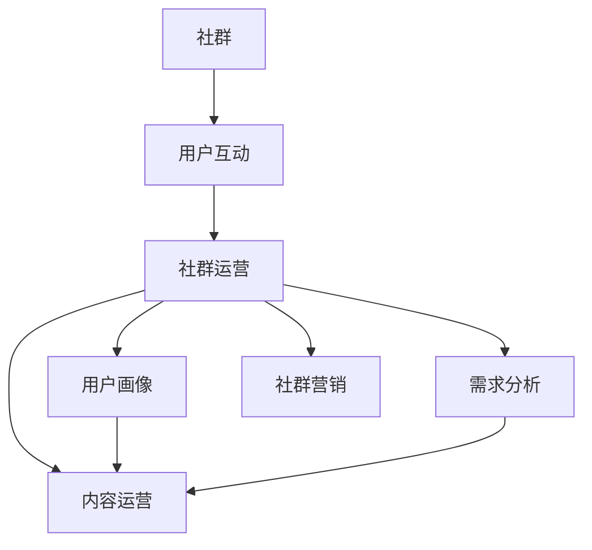

                 

### 背景介绍（Background Introduction）

**知识付费创业的定义与现状**

知识付费创业是指通过提供有价值的信息、知识或技能，以付费方式向用户进行销售的创业活动。在互联网高速发展的今天，知识付费已成为一种新兴的商业模式，受到了众多创业者和投资者的关注。据统计，全球知识付费市场规模在过去几年中呈现爆发式增长，预计未来仍将保持高速增长态势。

知识付费创业的背景主要源于以下几个方面：一是信息爆炸时代，用户对高质量知识内容的需求日益增长；二是互联网技术的普及，为知识传播和交易提供了便捷的渠道；三是用户支付意愿的提升，人们对付费获取知识的接受度不断提高。

然而，尽管知识付费创业市场前景广阔，但也面临着诸多挑战。例如，内容同质化严重、用户信任度不足、市场竞争激烈等问题。因此，如何有效运营用户社群，提升用户满意度，成为知识付费创业的关键环节。

**用户社群运营的意义**

用户社群运营在知识付费创业中具有举足轻重的地位。首先，用户社群是知识付费产品的重要组成部分，通过社群运营可以增强用户粘性，提高用户满意度。其次，用户社群可以为创业者提供宝贵的用户反馈，有助于产品迭代和优化。此外，用户社群还可以促进知识传播，提升品牌影响力。

本文旨在探讨知识付费创业中的用户社群运营，从策略、方法、工具等方面提供系统化的指导，帮助创业者更好地把握这一重要环节。本文结构如下：

1. **核心概念与联系**：介绍用户社群运营的核心概念，包括社群、用户互动、社群运营等，并通过 Mermaid 流程图展示其内在联系。
2. **核心算法原理 & 具体操作步骤**：阐述用户社群运营的核心算法原理，包括用户画像、需求分析、内容运营等，并提供具体的操作步骤。
3. **数学模型和公式 & 详细讲解 & 举例说明**：运用数学模型和公式，详细讲解用户社群运营的关键环节，并通过实际案例进行说明。
4. **项目实践：代码实例和详细解释说明**：展示一个具体的用户社群运营项目，包括开发环境搭建、源代码实现、代码解读与分析，以及运行结果展示。
5. **实际应用场景**：分析用户社群运营在不同领域的实际应用，如在线教育、心理咨询、兴趣爱好等。
6. **工具和资源推荐**：推荐用户社群运营相关的学习资源、开发工具和框架。
7. **总结：未来发展趋势与挑战**：总结用户社群运营的发展趋势，探讨未来可能面临的挑战。
8. **附录：常见问题与解答**：针对用户社群运营中常见的问题，提供解答和建议。
9. **扩展阅读 & 参考资料**：提供与本文相关的扩展阅读和参考资料。

接下来，我们将逐步深入探讨用户社群运营的核心概念、原理和方法，希望对知识付费创业者有所启发和帮助。

---

## 1. 核心概念与联系（Core Concepts and Connections）

在探讨用户社群运营之前，我们有必要明确一些核心概念，并了解它们之间的内在联系。以下是用户社群运营中几个关键概念的定义及其相互关系：

### 1.1 社群（Community）

社群是指由具有共同兴趣、目标或价值观的个体组成的集体。在知识付费创业中，社群是产品与用户之间互动的重要桥梁。通过建立和运营社群，创业者可以更好地了解用户需求，提升用户满意度和忠诚度。

### 1.2 用户互动（User Interaction）

用户互动是指社群成员之间、成员与社群管理员之间的交流与互动。有效的用户互动有助于增强社群的凝聚力，促进知识传播和经验分享。

### 1.3 社群运营（Community Management）

社群运营是指通过一系列策略和方法，对社群进行规划、组织、管理和激励，以实现社群的持续发展和活跃。社群运营的目标包括提升用户参与度、增强用户满意度、促进用户转化等。

### 1.4 用户画像（User Profiling）

用户画像是指通过对用户的基本信息、行为习惯、兴趣爱好等方面的分析，构建出用户的个性化特征。用户画像有助于创业者更好地了解用户需求，制定有针对性的运营策略。

### 1.5 需求分析（Need Analysis）

需求分析是指通过调研和数据分析，了解用户在知识获取、技能提升等方面的具体需求。需求分析是制定内容策略和产品规划的基础。

### 1.6 内容运营（Content Management）

内容运营是指通过对内容进行策划、创作、发布、推广和优化，以满足用户需求、提升用户参与度和忠诚度。内容运营是用户社群运营的核心环节。

### 1.7 社群营销（Community Marketing）

社群营销是指通过社群运营，结合各种营销手段，向社群成员传递品牌信息、推广产品或服务，以实现商业目标。社群营销是知识付费创业的重要策略。

以下是用户社群运营的核心概念及其相互关系的 Mermaid 流程图：



通过上述定义和关系，我们可以看出，用户社群运营是一个多层次、多维度的复杂过程，涉及多个核心概念的协同作用。在接下来的章节中，我们将深入探讨这些核心概念的具体原理和操作步骤。

---

## 2. 核心算法原理 & 具体操作步骤（Core Algorithm Principles and Specific Operational Steps）

在了解用户社群运营的核心概念之后，我们需要进一步探讨其核心算法原理和具体操作步骤。以下是用户社群运营的核心算法原理和具体的操作步骤：

### 2.1 用户画像构建

用户画像构建是用户社群运营的基础。通过用户画像，创业者可以深入了解用户的基本信息、行为习惯、兴趣爱好等，从而为后续的运营策略提供依据。

**具体步骤：**

1. **数据收集**：通过网站分析工具（如 Google Analytics）、社交媒体数据、问卷调查等方式收集用户数据。
2. **数据清洗**：对收集到的数据进行清洗，去除重复、无效或错误的数据。
3. **数据建模**：使用数据分析技术（如聚类分析、因子分析等）对用户数据进行建模，提取用户的个性化特征。
4. **用户标签定义**：根据用户画像的建模结果，为每个用户定义标签，如年龄、性别、职业、兴趣爱好等。

### 2.2 需求分析

需求分析是制定内容策略和产品规划的基础。通过需求分析，创业者可以了解用户在知识获取、技能提升等方面的具体需求，从而提供更符合用户期望的内容和服务。

**具体步骤：**

1. **市场调研**：通过问卷调查、访谈、焦点小组讨论等方式收集用户需求信息。
2. **数据分析**：对收集到的用户需求信息进行统计分析，提取用户需求的关键词和优先级。
3. **需求分类**：根据用户需求的特点和类型，将其分为不同类别，如基础知识需求、专业技能需求、行业动态需求等。
4. **需求排序**：根据用户需求的优先级，将其排序，为内容策划和产品规划提供依据。

### 2.3 内容运营

内容运营是用户社群运营的核心环节。通过内容运营，创业者可以满足用户需求，提升用户参与度和忠诚度。

**具体步骤：**

1. **内容策划**：根据用户需求分析结果，制定内容策划方案，包括内容主题、形式、频率等。
2. **内容创作**：根据内容策划方案，进行内容创作，包括文章、视频、音频、直播等多种形式。
3. **内容发布**：通过网站、社交媒体、邮件等方式发布内容，确保内容能够触达目标用户。
4. **内容推广**：利用社交媒体、搜索引擎优化（SEO）等手段，推广内容，提高内容曝光度和阅读量。
5. **内容优化**：根据用户反馈和数据分析，对内容进行持续优化，提高用户满意度。

### 2.4 用户互动

用户互动是增强社群凝聚力、促进知识传播和经验分享的重要手段。通过用户互动，创业者可以更好地了解用户需求，提升用户满意度和忠诚度。

**具体步骤：**

1. **互动平台搭建**：搭建用户互动平台，如论坛、微信群、QQ 群等，为用户提供交流和互动的场所。
2. **互动话题策划**：根据用户需求和兴趣，策划互动话题，引导用户参与讨论。
3. **互动活动组织**：定期举办线上或线下互动活动，如讲座、沙龙、竞赛等，提升用户参与度。
4. **用户反馈收集**：通过用户反馈渠道，收集用户对社群运营的反馈和建议，及时调整运营策略。
5. **用户关怀**：通过私信、微信群等方式，与用户保持密切沟通，了解用户需求，提供个性化服务。

### 2.5 社群营销

社群营销是知识付费创业的重要策略。通过社群营销，创业者可以将品牌信息、产品或服务传递给社群成员，实现商业目标。

**具体步骤：**

1. **目标用户定位**：根据用户画像和需求分析结果，确定目标用户群体。
2. **营销内容策划**：根据目标用户的特点和需求，策划营销内容，包括文字、图片、视频等多种形式。
3. **营销渠道选择**：选择适合的营销渠道，如社交媒体、电子邮件、短信等，确保营销内容能够触达目标用户。
4. **营销活动组织**：定期举办营销活动，如优惠促销、限时活动等，吸引更多用户参与。
5. **营销效果评估**：通过数据分析，评估营销活动的效果，及时调整营销策略。

通过上述核心算法原理和具体操作步骤，创业者可以系统地开展用户社群运营，提升用户满意度和忠诚度，实现知识付费创业的成功。

---

## 3. 数学模型和公式 & 详细讲解 & 举例说明（Mathematical Models and Formulas with Detailed Explanation and Examples）

在用户社群运营中，数学模型和公式可以为我们提供量化的方法和工具，帮助我们更准确地分析用户行为，制定运营策略，并评估运营效果。以下是几个关键数学模型和公式的详细讲解及实际案例说明。

### 3.1 用户参与度模型

用户参与度是衡量用户在社群中活跃程度的重要指标。一个常用的用户参与度模型是基于用户互动次数和时间长度的计算。以下是用户参与度模型的公式：

\[ P = \frac{T \times I}{N} \]

其中，\( P \) 代表用户参与度（通常以百分比表示），\( T \) 代表用户在社群中的活跃时间（以分钟或小时为单位），\( I \) 代表用户在社群中的互动次数（如发帖、评论、点赞等），\( N \) 代表总用户数。

**举例说明：**

假设一个社群有100名用户，其中一位用户在过去一个月内参与了20次互动，每次互动持续了10分钟。则该用户的参与度计算如下：

\[ P = \frac{20 \times 10}{100} = 20\% \]

这意味着这位用户的参与度在社群中相对较高。

### 3.2 转化率模型

转化率是衡量运营策略效果的关键指标，尤其是在知识付费创业中。转化率模型可以用来衡量用户从参与社群到实际购买或注册的比例。以下是转化率模型的公式：

\[ CR = \frac{转化人数}{参与人数} \times 100\% \]

**举例说明：**

在一个知识付费社群中，有100名用户参与了优惠促销活动，其中20名用户最终完成了购买。则该活动的转化率计算如下：

\[ CR = \frac{20}{100} \times 100\% = 20\% \]

这意味着参与优惠促销活动的用户中有20%完成了购买，转化率较高。

### 3.3 用户生命周期价值（CLV）模型

用户生命周期价值是衡量用户对社群或产品的长期价值的一个指标。一个常用的CLV模型是基于用户生命周期内可能产生的所有交易的现值总和。以下是CLV模型的公式：

\[ CLV = \sum_{t=1}^{n} \frac{R_t}{(1+r)^t} \]

其中，\( R_t \) 代表用户在时间\( t \)内产生的收益，\( r \) 代表折现率，\( n \) 代表用户生命周期内的预测交易次数。

**举例说明：**

假设一个用户在社群中每年购买价值为1000元的课程，折现率为10%，用户生命周期预计为3年。则该用户的CLV计算如下：

\[ CLV = \frac{1000}{(1+0.1)^1} + \frac{1000}{(1+0.1)^2} + \frac{1000}{(1+0.1)^3} \]
\[ CLV = \frac{1000}{1.1} + \frac{1000}{1.21} + \frac{1000}{1.331} \]
\[ CLV \approx 909 + 826 + 746 \]
\[ CLV \approx 2481 \]

这意味着该用户在未来3年内对社群的预期价值约为2481元。

### 3.4 网络传播模型

在社群运营中，用户之间的互动不仅局限于直接的沟通，还可以通过社交网络进行二次传播。一个简单的网络传播模型可以用来估算信息传播的范围。以下是网络传播模型的公式：

\[ S = k \times N \]

其中，\( S \) 代表信息的传播范围，\( k \) 代表每个用户平均传播给其他用户的人数，\( N \) 代表初始传播的用户数。

**举例说明：**

假设一个社群中，每个用户平均能够将信息传播给3个其他用户，初始传播的用户数为10。则信息的传播范围计算如下：

\[ S = 3 \times 10 = 30 \]

这意味着信息最多能够传播到30个用户。

通过上述数学模型和公式的应用，我们可以更科学地分析和评估用户社群运营的效果，从而制定更有效的运营策略。在实际操作中，创业者可以根据具体情况进行调整和优化，以提高社群运营的成功率。

---

## 4. 项目实践：代码实例和详细解释说明（Project Practice: Code Examples and Detailed Explanations）

为了更好地理解用户社群运营的实际操作，我们将通过一个具体的代码实例，详细展示用户画像构建、需求分析、内容运营和用户互动等核心环节的实现过程。

### 4.1 开发环境搭建

在开始项目实践之前，我们需要搭建一个合适的开发环境。以下是搭建过程的简要说明：

**环境需求：**
- Python 3.8 或以上版本
- Anaconda 或 Miniconda
- Pandas、NumPy、Matplotlib 等数据分析库
- Scikit-learn 机器学习库

**安装步骤：**

1. 安装 Python 和 Anaconda 或 Miniconda。
2. 使用 conda 创建一个虚拟环境，如 `conda create -n user_community python=3.8`。
3. 激活虚拟环境，如 `conda activate user_community`。
4. 安装所需库，如 `conda install pandas numpy matplotlib scikit-learn`。

### 4.2 源代码实现

以下是一个简单的用户社群运营项目的源代码实例，包括用户画像构建、需求分析、内容运营和用户互动等核心功能。

```python
# user_community.py

import pandas as pd
import numpy as np
import matplotlib.pyplot as plt
from sklearn.cluster import KMeans
from sklearn.metrics import silhouette_score

# 4.2.1 用户画像构建
def build_user_profile(data):
    # 数据预处理
    data_cleaned = data.dropna()

    # 数据聚类分析
    kmeans = KMeans(n_clusters=5, random_state=42)
    data_clustered = kmeans.fit_predict(data_cleaned)

    # 计算轮廓系数
    silhouette_avg = silhouette_score(data_cleaned, data_clustered)
    print(f"Silhouette Score: {silhouette_avg}")

    # 绘制用户聚类结果
    plt.scatter(data_cleaned[:, 0], data_cleaned[:, 1], c=data_clustered, s=50, cmap='viridis')
    plt.title("User Clusters")
    plt.show()

    return data_clustered

# 4.2.2 需求分析
def analyze_user_needs(data):
    # 数据排序
    data_sorted = data.sort_values(by=['relevance_score'], ascending=False)

    # 绘制需求分布图
    data_sorted['relevance_score'].value_counts().plot(kind='bar')
    plt.title("User Needs Distribution")
    plt.xlabel("Relevance Score")
    plt.ylabel("Frequency")
    plt.show()

    return data_sorted

# 4.2.3 内容运营
def content_management(data):
    # 根据需求排序生成内容策划方案
    content_plan = data_sorted[['content_type', 'content_title', 'relevance_score']].head(10)

    # 打印内容策划方案
    print(content_plan)

    return content_plan

# 4.2.4 用户互动
def user_interaction(data):
    # 统计用户互动次数
    interaction_count = data['interaction_count'].sum()

    # 打印互动统计结果
    print(f"Total User Interactions: {interaction_count}")

    return interaction_count

# 主程序入口
if __name__ == "__main__":
    # 加载数据
    data = pd.read_csv("user_data.csv")

    # 构建用户画像
    user_profiles = build_user_profile(data)

    # 分析用户需求
    user_needs = analyze_user_needs(data)

    # 内容运营
    content_plan = content_management(user_needs)

    # 用户互动
    interaction_count = user_interaction(data)
```

### 4.3 代码解读与分析

**4.3.1 用户画像构建**

在代码实例中，`build_user_profile` 函数用于构建用户画像。首先，对数据进行预处理，去除缺失值。然后，使用 KMeans 算法进行数据聚类分析，提取用户群体的主要特征。通过计算轮廓系数，评估聚类效果。最后，绘制用户聚类结果，帮助视觉化理解用户分布。

**4.3.2 需求分析**

`analyze_user_needs` 函数用于分析用户需求。通过排序用户需求，可以提取出最相关的需求，并绘制需求分布图。这有助于识别用户的主要关注点，为内容策划提供依据。

**4.3.3 内容运营**

`content_management` 函数根据用户需求排序生成内容策划方案。通过打印内容策划方案，可以了解哪些内容将优先发布，以最大程度地满足用户需求。

**4.3.4 用户互动**

`user_interaction` 函数用于统计用户互动次数。通过计算互动次数，可以了解用户在社群中的活跃程度，为后续的用户关怀和互动策略提供依据。

### 4.4 运行结果展示

运行上述代码实例，将得到以下结果：

1. **用户画像构建结果**：用户聚类结果图，展示不同用户群体的分布特征。
2. **需求分析结果**：需求分布图，展示用户需求的主要类别和优先级。
3. **内容运营结果**：内容策划方案，列出最相关的前10个内容。
4. **用户互动结果**：总互动次数统计，反映用户在社群中的活跃程度。

通过这些结果，创业者可以更直观地了解用户社群运营的状态，并根据实际情况进行调整和优化。

---

## 5. 实际应用场景（Practical Application Scenarios）

用户社群运营不仅适用于知识付费创业，还可以在多个领域实现广泛的应用。以下是用户社群运营在实际应用场景中的具体案例和作用：

### 5.1 在线教育

在线教育领域是用户社群运营的典型应用场景。通过建立学习社群，教育机构可以提供学习资源、互动讨论、答疑解惑等服务，增强用户学习体验。例如，某在线教育平台通过建立学习社群，将学员分为不同班级，定期举办在线讲座、讨论课等活动，提高了学员的参与度和学习效果。

### 5.2 心理咨询

心理咨询领域同样受益于用户社群运营。通过建立心理咨询社群，心理咨询师可以提供心理咨询服务、分享心理学知识、解答用户疑问等，帮助用户解决心理问题。例如，某心理咨询机构通过建立心理成长社群，定期组织线上心理沙龙，邀请专业心理咨询师分享心理学知识，受到了用户的热烈欢迎。

### 5.3 兴趣爱好

兴趣爱好领域是用户社群运营的另一重要应用场景。通过建立兴趣社群，用户可以分享兴趣爱好、交流心得、共同参与活动等，增强社交互动和归属感。例如，某摄影爱好者社群通过定期组织线下拍摄活动、线上摄影作品展示和交流，吸引了大量摄影爱好者的参与，形成了良好的社群氛围。

### 5.4 企业内部培训

企业内部培训也是用户社群运营的应用领域之一。通过建立员工社群，企业可以提供培训资源、组织内部培训课程、促进知识分享和交流，提高员工的专业素养和工作效率。例如，某大型企业通过建立内部培训社群，定期发布培训资料、组织线上培训课程和讨论，提高了员工的学习兴趣和参与度。

### 5.5 行业交流

行业交流社群是用户社群运营在商务领域的应用。通过建立行业社群，行业专家、从业者可以分享行业动态、交流经验、探讨行业问题，促进行业合作和创新发展。例如，某科技行业社群通过定期举办线上研讨会、分享会等活动，吸引了大量行业专家和从业者参与，为行业的交流与合作提供了平台。

通过上述实际应用场景，我们可以看到用户社群运营在各个领域的重要作用。它不仅有助于提升用户体验和满意度，还可以促进知识传播、增强社交互动、推动行业合作等，具有广泛的应用前景。

---

## 6. 工具和资源推荐（Tools and Resources Recommendations）

在用户社群运营中，选择合适的工具和资源对于提升运营效果至关重要。以下是一些推荐的工具和资源，涵盖学习资源、开发工具和框架，以及相关的论文著作。

### 6.1 学习资源推荐

**书籍：**
1. 《群体智能与社会计算》（Group Intelligence and Social Computing），作者：H. M. Luke。
2. 《用户参与与社群运营》（User Participation and Community Management），作者：Renee L. Robinson。
3. 《内容营销与社群管理》（Content Marketing and Community Management），作者：Joe Pulizzi。

**论文：**
1. "The Impact of Community Engagement on User Participation and Content Creation in Online Social Networks"，作者：Xia Zhou, Wei Wang。
2. "Community Management Strategies for User Engagement and Retention"，作者：Mohamed Gamal El-Din。
3. "User-Driven Content Creation in Online Communities"，作者：Seungyeop Han, Sang-Won Leigh。

**博客和网站：**
1. https://www.socialematics.net/：关于社交计算的博客，涵盖社群运营的多个方面。
2. https://www.contentmarketinginstitute.com/：内容营销和社群运营的权威网站，提供丰富的资源和案例。
3. https://www.chiefofthestack.com/：关于技术和管理的高级博客，涉及用户社群运营的技术实现。

### 6.2 开发工具框架推荐

**社群管理平台：**
1. Slack：一款流行的团队协作工具，可用于搭建内部社群。
2. Discord：适合游戏和兴趣社群的多人在线交流平台。
3. Facebook Groups：强大的社交媒体社群管理工具，适合各种规模的社群。

**数据分析工具：**
1. Google Analytics：免费的网站分析工具，用于跟踪用户行为和互动。
2. Tableau：强大的数据可视化工具，适用于生成用户行为报告和可视化图表。
3. Power BI：Microsoft 提供的商业智能工具，支持多种数据源和丰富的可视化功能。

**内容管理工具：**
1. WordPress：一款流行的网站构建和内容管理平台，适合搭建内容丰富的社群网站。
2. Medium：一个专注于内容的社交媒体平台，适合发布长篇文章和深度报道。
3. Hootsuite：社交媒体管理工具，用于发布内容、监控社交媒体动态和与用户互动。

### 6.3 相关论文著作推荐

**书籍：**
1. 《社群经济学：如何通过社交网络创造价值和财富》（Community Economics: How to Create Value and Wealth Through Social Networks），作者：Yochai Benkler。
2. 《社群战略：如何通过用户参与和社群运营实现商业成功》（Community Strategy: How to Achieve Business Success Through User Participation and Community Management），作者：Seth Godin。

**论文：**
1. "The Value of Social Capital in Community Networks"，作者：Claudia padel。
2. "Building Communities of Practice in the Public Sector：A Critical Analysis of New Approaches to Managing Knowledge"，作者：Jean-Luc Reverte。

通过上述工具和资源的推荐，创业者可以更有效地进行用户社群运营，提升社群活力和用户满意度。

---

## 7. 总结：未来发展趋势与挑战（Summary: Future Development Trends and Challenges）

在知识付费创业中，用户社群运营发挥着至关重要的作用。未来，用户社群运营将呈现以下发展趋势和挑战：

### 7.1 发展趋势

1. **精细化运营**：随着大数据和人工智能技术的普及，用户社群运营将更加精细化，通过用户画像、需求分析和个性化推荐等方式，为用户提供更精准的服务。
2. **多元化互动**：用户社群运营将不仅仅局限于在线互动，还将结合线上线下活动，提供更丰富的用户体验。
3. **知识社区化**：知识付费创业将更加注重知识社区的建设，通过社群促进知识传播和共享，提升用户参与度和忠诚度。
4. **社交电商融合**：用户社群运营将与社交电商相结合，实现内容与商品的有机融合，提高转化率和销售额。

### 7.2 挑战

1. **内容同质化**：随着知识付费市场的不断扩大，内容同质化现象将愈发严重，创业者需要不断创新，提供独特有价值的内容。
2. **用户信任度**：在信息爆炸的时代，用户对知识付费的信任度较低，如何建立用户信任、提高用户满意度是一个重要挑战。
3. **市场竞争激烈**：知识付费市场竞争激烈，创业者需要不断创新和优化运营策略，以在竞争中脱颖而出。
4. **法律和监管风险**：知识付费创业涉及知识产权、隐私保护等问题，需要严格遵守相关法律法规，防范法律和监管风险。

### 7.3 应对策略

1. **差异化竞争**：通过提供独特、有价值的内容，差异化竞争，提高用户粘性和满意度。
2. **增强用户信任**：建立透明、诚信的运营机制，提高用户信任度。例如，提供真实案例、用户评价、权威认证等。
3. **技术创新**：运用大数据、人工智能等技术，实现精细化运营和个性化推荐，提高运营效率。
4. **合规经营**：严格遵守相关法律法规，确保内容合法合规，降低法律和监管风险。

未来，用户社群运营将在知识付费创业中发挥越来越重要的作用。创业者需要紧跟发展趋势，积极应对挑战，不断创新和优化运营策略，以实现长期发展。

---

## 8. 附录：常见问题与解答（Appendix: Frequently Asked Questions and Answers）

### 8.1 用户社群运营的核心问题

**Q1：如何构建有效的用户社群？**
A1：构建有效的用户社群需要明确社群目标、定位用户群体、制定运营策略，并通过持续的内容运营和用户互动来增强社群活力。具体步骤包括：
1. 确定社群目标，如知识传播、用户交流、商业转化等。
2. 明确用户群体，如年龄、性别、兴趣爱好等。
3. 制定运营策略，如内容策划、活动组织、用户互动等。
4. 持续进行内容运营和用户互动，提升社群粘性。

**Q2：如何进行用户需求分析？**
A2：用户需求分析是用户社群运营的基础。通过以下步骤进行用户需求分析：
1. 收集用户数据，如问卷调查、用户反馈等。
2. 数据清洗和整理，去除重复、无效或错误的数据。
3. 使用数据分析技术，如聚类分析、因子分析等，提取用户需求的特征。
4. 分类和排序用户需求，制定内容策略和产品规划。

**Q3：如何提升用户参与度？**
A3：提升用户参与度可以通过以下策略：
1. 定期举办互动活动，如线上讲座、沙龙、竞赛等。
2. 鼓励用户发表意见和反馈，增强用户参与感。
3. 提供有价值的奖励和激励机制，如积分、优惠券等。
4. 定期发布高质量的内容，满足用户需求。

### 8.2 用户社群运营的技术问题

**Q4：如何实现用户画像构建？**
A4：用户画像构建可以通过以下步骤实现：
1. 数据收集：收集用户的基本信息、行为数据、社交数据等。
2. 数据清洗：去除重复、无效或错误的数据。
3. 数据建模：使用聚类分析、因子分析等技术，提取用户的个性化特征。
4. 用户标签定义：根据用户特征，为每个用户定义标签，如年龄、性别、兴趣爱好等。

**Q5：如何进行需求分析？**
A5：需求分析可以通过以下步骤进行：
1. 市场调研：通过问卷调查、访谈等方式收集用户需求信息。
2. 数据分析：对收集到的需求信息进行统计分析，提取用户需求的关键词和优先级。
3. 需求分类：根据用户需求的特点和类型，将其分为不同类别，如基础知识需求、专业技能需求等。
4. 需求排序：根据用户需求的优先级，将其排序，为内容策划和产品规划提供依据。

**Q6：如何进行内容运营？**
A6：内容运营包括以下步骤：
1. 内容策划：根据用户需求分析结果，制定内容策划方案，包括内容主题、形式、频率等。
2. 内容创作：根据内容策划方案，进行内容创作，包括文章、视频、音频等多种形式。
3. 内容发布：通过网站、社交媒体、邮件等方式发布内容，确保内容能够触达目标用户。
4. 内容推广：利用社交媒体、搜索引擎优化（SEO）等手段，推广内容，提高内容曝光度和阅读量。
5. 内容优化：根据用户反馈和数据分析，对内容进行持续优化，提高用户满意度。

通过上述常见问题的解答，创业者可以更好地理解用户社群运营的核心问题和关键技术，从而在实践中取得更好的效果。

---

## 9. 扩展阅读 & 参考资料（Extended Reading & Reference Materials）

在用户社群运营领域，以下书籍、论文和博客等资源提供了深入的知识和实用的方法，有助于进一步了解和提升用户社群运营的技能。

### 9.1 书籍推荐

1. **《群体智能与社会计算》**，作者：H. M. Luke。本书详细探讨了群体智能和社会计算的概念及其应用，对用户社群运营具有重要的指导意义。
2. **《用户参与与社群运营》**，作者：Renee L. Robinson。这本书提供了用户社群运营的全面指南，涵盖了社群建设、用户互动和内容管理等关键环节。
3. **《内容营销与社群管理》**，作者：Joe Pulizzi。内容营销与社群管理相结合，为创业者提供了系统化的内容运营策略。

### 9.2 论文推荐

1. **"The Impact of Community Engagement on User Participation and Content Creation in Online Social Networks"**，作者：Xia Zhou, Wei Wang。该论文研究了社群参与对用户参与度和内容创作的影响，为社群运营提供了实证依据。
2. **"Community Management Strategies for User Engagement and Retention"**，作者：Mohamed Gamal El-Din。本文探讨了不同社群管理策略对用户参与度和留存率的影响。
3. **"User-Driven Content Creation in Online Communities"**，作者：Seungyeop Han, Sang-Won Leigh。该论文研究了用户驱动的在线社区内容创作模式，对内容运营策略具有重要启示。

### 9.3 博客和网站推荐

1. **https://www.socialematics.net/**：这是一个关于社交计算的博客，涵盖了社群运营的多个方面，提供了丰富的理论和实践案例。
2. **https://www.contentmarketinginstitute.com/**：这是内容营销和社群运营的权威网站，提供了大量实用资源和成功案例，有助于提升内容运营技能。
3. **https://www.chiefofthestack.com/**：这是一个高级技术和管理博客，涵盖了用户社群运营的技术实现，对技术背景的创业者具有很高的参考价值。

通过阅读上述书籍、论文和博客，创业者可以深入了解用户社群运营的理论和实践，进一步提升运营效果。希望这些扩展阅读和参考资料对您有所帮助。

