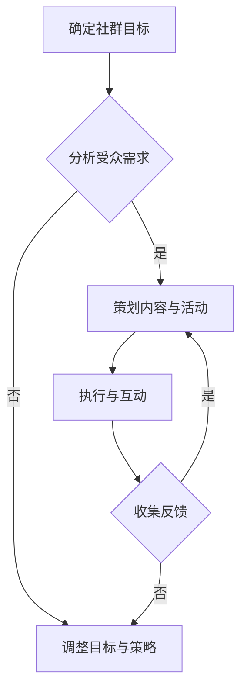

                 

# 知识付费：程序员的社群运营技巧

## 摘要

在知识经济时代，知识付费已成为一种重要的商业模式，而程序员的社群运营则是实现知识付费的重要途径。本文将探讨程序员如何通过社群运营来创造价值，提高个人和团队的专业能力。首先，我们将介绍社群运营的基本概念和重要性。接着，分析程序员的社群运营目标和受众。然后，深入探讨如何策划和执行有效的社群活动，包括内容创作、互动策略和反馈机制。最后，将总结社群运营中的常见挑战及其应对策略，并提出未来发展的建议。本文旨在为程序员提供一套系统的社群运营指南，帮助他们在知识付费领域中脱颖而出。

### 背景介绍

随着互联网的普及和技术的发展，知识付费逐渐成为主流商业模式之一。知识付费指的是用户为获取专业知识和技能而付费的行为，它包括在线课程、专业书籍、在线咨询、社群服务等多种形式。对于程序员而言，知识付费不仅是一种学习途径，更是一种职业发展和变现的方式。

社群运营是指通过建立和维护特定的社交网络，以促进成员间的互动和合作，从而实现共同目标和价值。在程序员社群中，运营的目的包括提高成员的专业能力、促进技术交流、增强品牌影响力等。社群运营的兴起，源于程序员对专业成长的需求和互联网社交平台的普及。

程序员社群运营的重要性主要体现在以下几个方面：

1. **知识共享与传播**：社群为程序员提供了一个分享经验和知识的平台，有助于知识的快速传播和积累。
2. **专业技能提升**：通过社群活动，程序员可以接触到不同的技术方向和解决方案，有助于技能的提升和职业发展。
3. **品牌建设**：有效的社群运营可以提高程序员个人的品牌知名度，有助于在职业市场中脱颖而出。
4. **变现能力**：知识付费为程序员提供了变现的途径，通过提供专业的咨询服务或开发工具，可以实现收入的增长。

本文将围绕程序员社群运营的各个方面展开讨论，包括社群的目标与受众分析、内容策划与执行、互动策略与反馈机制等。通过这些探讨，希望能为程序员提供一套实用的社群运营指南，助力他们在知识付费领域取得成功。

### 核心概念与联系

#### 1. 社群运营的基本概念

社群运营，顾名思义，是指围绕特定主题或目标，建立并维护一个稳定的社交网络，以实现成员间的互动与合作。在这个定义中，我们可以提取出几个核心概念：

- **社群**：指的是一群具有共同兴趣、目标或特征的人组成的群体。
- **运营**：是指通过一系列策略和活动，管理和引导社群成员的互动，使其朝着既定的目标发展。

社群运营不仅仅是一个简单的组织过程，它涉及到对社群成员需求的洞察、内容的策划与分发、互动的激励与引导等多个方面。

#### 2. 社群运营的目标与受众分析

在进行社群运营之前，明确社群的目标和受众是至关重要的。社群的目标可以分为以下几个方面：

1. **知识传播与技能提升**：通过分享专业知识、技术经验，帮助成员提升技能。
2. **资源共享与合作**：提供资源链接、工具推荐，促进成员之间的合作与互助。
3. **品牌建设与推广**：提高社群内成员的品牌知名度，扩大影响力。
4. **变现与商业机会**：为成员提供变现渠道，如知识付费、咨询等服务。

受众分析则是指对社群成员的背景、需求和兴趣进行详细调研，以确定哪些内容和服务更能满足他们的需求。具体步骤如下：

1. **调研与数据收集**：通过问卷调查、用户访谈等方式收集受众信息。
2. **数据分析**：利用数据分析工具，对收集到的数据进行分析，识别受众特征。
3. **目标群体细分**：根据数据分析结果，将受众分为不同的群体，并制定相应的运营策略。

#### 3. 社群运营与传统营销的关系

社群运营与传统营销有着紧密的联系，但也存在一些显著的区别。传统营销通常是通过广告、推广活动等手段，向广泛的受众群体传递品牌信息。而社群运营则更注重与受众的深度互动，通过内容、活动和服务，建立起长期的关系。

传统营销与社群运营的关系可以概括为：

1. **内容提供**：社群运营需要丰富的内容来吸引和留住成员，这些内容可以是技术文章、教程、案例分析等。
2. **互动与反馈**：社群运营强调成员之间的互动，通过问答、讨论、投票等方式，收集成员的反馈，以不断优化运营策略。
3. **品牌传播**：社群运营通过成员的口碑传播，实现品牌的广泛传播，而不仅仅是依赖广告投放。

### Mermaid 流程图

以下是社群运营的流程图，用Mermaid语言描述：

通过这个流程图，我们可以清晰地看到社群运营的各个环节及其相互关系。

### 社群运营的目标与受众分析

在进行社群运营时，明确社群的目标和了解受众的需求是至关重要的。这不仅有助于提升社群的吸引力和活跃度，还能有效推动知识的传播和技能的提升。

#### 1. 社群运营的目标

社群运营的目标可以分为以下几个方面：

1. **知识传播与技能提升**：通过分享专业知识、技术经验，帮助成员提升技能，这是社群运营的首要目标。具体措施包括定期举办技术分享会、发布高质量的技术文章、提供在线学习资源等。
2. **资源共享与合作**：提供一个资源共享的平台，成员可以在这里分享工具、资源链接，促进彼此之间的合作与互助。例如，可以建立技术问答区、资源共享区等。
3. **品牌建设与推广**：提高社群内成员的品牌知名度，扩大影响力。这可以通过举办行业论坛、邀请知名专家演讲、发布有影响力的报告等方式实现。
4. **变现与商业机会**：为成员提供变现渠道，如知识付费、咨询等服务。社群运营者可以通过开设付费课程、提供专业咨询等方式，实现社群的商业化运作。

#### 2. 受众分析

了解受众的需求和特征，是进行有效社群运营的基础。以下是如何进行受众分析：

1. **调研与数据收集**：通过问卷调查、用户访谈等方式收集受众信息。这些信息包括受众的年龄、性别、职业、技术背景、兴趣爱好等。
2. **数据分析**：利用数据分析工具，对收集到的数据进行分析，识别受众特征。例如，可以通过聚类分析将受众分为不同的群体，如初级程序员、中级程序员、高级程序员等。
3. **目标群体细分**：根据数据分析结果，将受众分为不同的群体，并制定相应的运营策略。例如，针对初级程序员，可以提供基础教程和实战项目；针对高级程序员，可以提供高级技术讨论和解决方案分享。

#### 3. 明确目标和受众的重要性

明确社群运营的目标和了解受众的需求，对于社群的成功至关重要：

1. **提升社群吸引力**：清晰的目标能够吸引具有共同兴趣和需求的成员加入社群，提升社群的整体吸引力和活跃度。
2. **增强运营有效性**：了解受众需求，能够帮助运营者制定出更符合成员需求的活动和内容，提高社群运营的有效性。
3. **促进知识传播**：明确的目标和受众需求分析，能够确保知识传播更加精准，提升社群的知识水平和专业能力。
4. **实现商业变现**：通过细分受众，运营者可以更好地了解哪些成员有付费意愿，从而提供更具针对性的付费服务，实现社群的商业化运作。

### 社群运营的策略

在进行社群运营时，制定和执行有效的策略是关键。以下是一些核心策略，包括内容策划、互动策略和反馈机制：

#### 1. 内容策划

内容是社群运营的核心，高质量的内容能够吸引成员并提高他们的参与度。以下是一些建议：

- **多样化内容形式**：包括技术文章、教程、视频、直播、案例分析等多种形式，以满足不同成员的需求。
- **定期更新**：保持内容更新频率，确保社群的活跃度。例如，可以设定每周发布一篇技术文章或每月举办一次技术分享会。
- **主题策划**：围绕当前热点技术或成员关注的问题，策划系列内容，提升内容的专业性和吸引力。
- **用户生成内容**：鼓励成员分享自己的经验和见解，提高社群的互动性和成员的参与度。

#### 2. 互动策略

互动是社群运营的生命力所在，以下是一些提高互动的策略：

- **问答互动**：建立问答区，鼓励成员提问和回答，提高成员之间的互动。
- **活动策划**：定期举办线上或线下的活动，如技术沙龙、编程比赛、分享会等，增加成员的参与感。
- **社群管理**：设立专门的社群管理员或志愿者，负责维护社群秩序、处理成员问题，确保社群的良性发展。
- **激励机制**：通过积分、勋章、排名等方式激励成员积极参与社群活动，提高互动质量。

#### 3. 反馈机制

反馈机制是社群运营的重要组成部分，以下是一些建议：

- **定期反馈调查**：通过问卷调查、在线反馈等方式，定期收集成员的反馈，了解他们的需求和意见。
- **实时反馈**：建立实时反馈渠道，如社群管理员微信、邮箱等，及时解决成员的问题和需求。
- **公开反馈**：在社群内部公开反馈结果，让成员了解社群的改进方向，增加透明度和信任度。
- **反馈分析**：对收集到的反馈进行分析，识别共性问题，制定改进措施。

通过以上策略，社群运营者可以更好地管理和运营社群，提高成员的参与度和满意度，实现社群的长期发展。

### 社群活动的策划与执行

社群活动的策划与执行是社群运营的核心环节，直接关系到成员的参与度和社群的活跃度。以下将详细探讨如何策划和执行一次成功的社群活动。

#### 1. 活动目标设定

在策划社群活动之前，首先需要明确活动的目标。活动目标可以分为以下几个方面：

- **知识传播**：通过活动分享专业知识，帮助成员提升技能。
- **互动交流**：促进成员之间的交流，增强社群凝聚力。
- **品牌推广**：提升社群和品牌的知名度。
- **商业机会**：为成员提供商业合作机会，如招聘、项目合作等。

明确活动目标有助于确保活动的方向和内容与社群运营的整体目标一致。

#### 2. 活动内容策划

活动内容是吸引成员参与的关键。以下是一些活动内容策划的建议：

- **主题明确**：选择与社群目标相关的主题，确保内容的针对性和专业性。
- **多样化形式**：结合不同的内容形式，如技术讲座、实战分享、案例分析等，提高活动的趣味性和参与度。
- **嘉宾邀请**：邀请行业专家或知名人士作为嘉宾，分享他们的经验和见解，提升活动的吸引力。
- **互动环节**：设置问答、讨论、投票等互动环节，增加成员的参与感。

#### 3. 活动宣传推广

有效的宣传推广是确保活动成功的关键。以下是一些宣传推广的建议：

- **提前通知**：提前在社群内部发布活动通知，包括活动主题、时间、地点、嘉宾等信息。
- **渠道多样化**：通过社群内部通知、邮件、公众号、社交媒体等多种渠道宣传，扩大活动的影响力。
- **预热活动**：在活动前进行预热，通过发布相关内容、开展小活动等方式，提高成员的关注度。
- **合作伙伴**：寻找相关合作伙伴，如技术公司、培训机构等，共同推广活动，扩大受众范围。

#### 4. 活动现场管理

活动现场的管理直接关系到活动的顺利进行和成员的体验。以下是一些管理建议：

- **场地布置**：提前安排好场地，确保音响、投影等设备的正常运行。
- **签到流程**：设立签到台，方便成员签到，并收集联系方式以便后续沟通。
- **现场互动**：鼓励成员积极参与互动，可以通过提问、讨论等方式，提升活动的氛围。
- **应急处理**：准备应急预案，如设备故障、人员突发状况等，确保活动顺利进行。

#### 5. 活动反馈与总结

活动结束后，及时收集成员的反馈和总结活动效果，是持续改进的重要步骤。以下是一些反馈和总结的建议：

- **问卷调查**：通过问卷星、微信小程序等方式，收集成员对活动的反馈，包括满意度、改进建议等。
- **现场访谈**：邀请部分成员进行现场访谈，了解他们的真实感受和意见。
- **活动总结**：整理活动过程中的亮点和不足，形成书面总结，为下一次活动提供参考。

通过以上步骤，社群运营者可以有效地策划和执行社群活动，提高成员的参与度和满意度，实现社群的长期发展。

#### 4. 内容创作：撰写高质量技术文章

在程序员社群运营中，内容创作是一个至关重要的环节。高质量的技术文章不仅能够吸引新成员，还能增强现有成员的参与度和忠诚度。以下是一些撰写高质量技术文章的技巧：

##### 1. 确定主题

选择合适的主题是撰写技术文章的第一步。以下是一些建议：

- **关注热点**：选择当前热门的技术话题或趋势，例如人工智能、区块链、云计算等。
- **解决痛点**：针对程序员日常开发中遇到的常见问题或痛点，提供解决方案或最佳实践。
- **实战分享**：分享个人或团队的实际开发经验，包括遇到的问题、解决方案和经验教训。

##### 2. 结构布局

一个清晰的结构布局有助于读者更好地理解和吸收文章内容。以下是一些建议：

- **引言**：简明扼要地介绍文章的主题和目的，吸引读者的注意力。
- **正文**：将内容分为若干个段落，每个段落讨论一个独立的话题，便于读者阅读和理解。
- **图表和代码**：合理使用图表和代码示例，帮助读者直观地理解复杂的概念和技术细节。
- **结论**：总结文章的主要观点和收获，强调文章的实际应用价值。

##### 3. 语言风格

语言风格直接影响文章的可读性和专业性。以下是一些建议：

- **简明扼要**：避免使用过多的专业术语和冗长的句子，确保文章简洁明了。
- **准确规范**：确保用词准确，避免模糊或误导性的表述。
- **逻辑清晰**：遵循逻辑顺序，逐步引导读者理解文章内容。

##### 4. 案例分析

通过案例分析，可以更具体地展示技术应用的场景和效果。以下是一些建议：

- **真实案例**：选择真实的项目或实际场景，确保案例的可靠性。
- **详细描述**：详细描述问题的背景、解决方案的实现过程和效果，便于读者借鉴和参考。
- **数据支持**：使用数据和实验结果支持你的观点，增强文章的说服力。

##### 5. 精益求精

撰写完初稿后，不要急于发布。以下是一些修订和优化的建议：

- **反复修改**：多次修改文章，确保内容的准确性和完整性。
- **同行评审**：邀请同行或专家对文章进行评审，收集反馈并进行相应的修改。
- **查重检测**：使用查重工具检测文章的原创性，确保内容不抄袭、不侵权。

通过以上技巧，程序员可以撰写出高质量的技术文章，为社群运营提供优质的内容，吸引更多成员的参与和关注。

### 社群互动策略

在程序员社群运营中，有效的互动策略是提升成员参与度和社群活跃度的关键。以下是一些关键策略，包括如何建立良好的互动环境、激励成员参与、以及利用数据分析优化互动效果。

#### 1. 建立良好的互动环境

良好的互动环境是促进成员积极参与的基础。以下是一些建议：

- **明确互动规则**：制定并公布社群的互动规则，确保成员在交流时遵循相应的行为准则，例如尊重他人、不发布垃圾信息等。
- **营造友好氛围**：鼓励成员之间的友好交流，通过正面的语言和鼓励性的反馈，营造积极向上的社群氛围。
- **设立专属互动区**：在社群中设立专门的互动区域，如技术问答区、讨论区、心得分享区等，方便成员就特定话题进行深入讨论。

#### 2. 激励成员参与

激励成员参与是提高社群活跃度的有效手段。以下是一些激励策略：

- **积分系统**：建立积分系统，成员在参与互动、提问、回答问题时可以获得积分。积分可以用于兑换奖品、参与评选等，增加成员的积极性。
- **表彰与奖励**：定期对积极参与互动的成员进行表彰和奖励，例如颁发勋章、证书、礼品等，以示鼓励。
- **竞赛和活动**：举办技术竞赛、编程挑战等活动，鼓励成员通过实际操作提升技能，同时增加互动的机会和乐趣。

#### 3. 数据分析优化互动效果

数据分析可以帮助运营者了解成员的互动行为，从而优化互动策略。以下是一些数据分析的方法：

- **互动数据收集**：收集成员的互动数据，包括发帖数、回复数、点赞数、积分等，分析成员的活跃度。
- **行为分析**：通过分析成员的互动行为，了解他们的兴趣点和需求，从而制定更有针对性的互动内容。
- **反馈收集**：定期收集成员对互动活动的反馈，了解他们的意见和建议，及时调整互动策略。
- **趋势分析**：分析互动数据的变化趋势，识别社群的活跃高峰和低谷，优化活动安排和内容更新。

通过以上策略，社群运营者可以有效地促进成员之间的互动，提升社群的活跃度和成员的满意度。

### 反馈机制

在社群运营中，反馈机制是了解成员需求和改进运营策略的重要工具。有效的反馈机制可以增强成员的参与感和满意度，提高社群的运营效果。以下是一些关键的反馈渠道、处理流程和改进措施。

#### 1. 反馈渠道

为了确保成员能够顺畅地提供反馈，需要提供多种反馈渠道：

- **在线问卷**：定期发布在线问卷，收集成员对社群活动、内容、服务的意见和建议。
- **社群内部反馈栏**：在社群内部设立专门的反馈栏，成员可以在这里留言提出问题和建议。
- **邮件反馈**：提供专门的反馈邮箱，成员可以通过邮件发送反馈。
- **实时聊天工具**：利用实时聊天工具（如微信群、Slack等），成员可以直接与管理员或同事交流反馈。

#### 2. 反馈处理流程

建立高效的反馈处理流程是确保反馈得到及时回应和有效解决的关键。以下是一个典型的反馈处理流程：

1. **接收反馈**：社群管理员或志愿者负责接收和整理反馈，确保所有反馈都被记录下来。
2. **分类处理**：根据反馈内容，将反馈分为技术问题、内容问题、活动安排等类别，以便于分类处理。
3. **初步回应**：在收到反馈后，及时向成员发送初步回应，告知他们反馈已被接收，并会在后续处理。
4. **问题解决**：针对具体问题，安排相关人员或团队进行研究和解决。例如，技术问题可以由技术专家处理，内容问题可以由内容团队优化。
5. **反馈结果**：在问题解决后，向成员提供反馈结果，告知他们问题已经解决或采取的改进措施。
6. **总结和改进**：定期对反馈处理流程进行总结和评估，识别流程中的瓶颈和不足，并制定改进措施。

#### 3. 改进措施

为了持续提升社群运营效果，需要根据反馈进行不断改进。以下是一些具体的改进措施：

- **优化内容**：根据成员对内容的反馈，调整内容策略，包括选题、形式、更新频率等，确保内容更贴近成员需求。
- **改进活动**：根据成员对活动的反馈，优化活动安排和流程，提高活动的吸引力和参与度。
- **提高服务质量**：针对技术问题和咨询服务，提高服务质量和响应速度，增强成员的满意度。
- **增强互动**：根据成员的互动反馈，优化互动策略，提高社群的互动质量和活跃度。
- **加强沟通**：定期通过邮件、社群通知等方式，与成员沟通反馈结果和改进措施，增强透明度和信任。

通过建立完善的反馈机制，社群运营者可以更好地了解成员的需求和意见，持续改进运营策略，提升社群的整体质量和成员的满意度。

### 实际应用场景

在程序员社群运营中，应用场景的选择至关重要。以下将探讨几种常见的应用场景，以及如何在不同的场景中实现社群运营的成功。

#### 1. 技术交流

技术交流是程序员社群的核心应用场景之一。通过技术交流，成员可以分享最新的技术动态、开发经验和最佳实践，提升整体技能水平。

**成功要素**：

- **主题明确**：选择与社群目标相关且具有实际应用价值的技术主题，例如前沿技术、热门框架等。
- **内容多样化**：结合不同的内容形式，如技术文章、视频、直播等，提升交流的趣味性和吸引力。
- **嘉宾邀请**：邀请行业专家、技术大牛作为嘉宾，分享他们的实战经验和见解。

**案例**：某程序员社群定期举办“技术沙龙”，邀请业内知名专家分享最新的技术趋势和解决方案。通过现场互动和线上直播，吸引了大量程序员参与，提升了社群的技术氛围。

#### 2. 资源共享

资源共享是程序员社群的另一个重要应用场景。通过共享开发工具、文档、教程等资源，成员可以快速获取所需的信息，提高工作效率。

**成功要素**：

- **资源分类**：根据资源的类型和用途，进行合理的分类和整理，方便成员查找。
- **激励机制**：鼓励成员积极贡献资源，可以通过积分、奖励等方式激励贡献者。
- **定期更新**：保持资源的实时更新，确保信息的准确性和时效性。

**案例**：某程序员社群建立了“资源共享区”，成员可以在这里上传和下载各种开发工具、文档和教程。社群管理员定期整理和更新资源，确保资源的丰富性和实用性。

#### 3. 在线教育

在线教育是程序员社群中的一种重要应用，通过提供在线课程、培训讲座等，帮助成员提升技能和知识水平。

**成功要素**：

- **课程体系**：构建完整的课程体系，包括基础课程、进阶课程、实战课程等，满足不同层次成员的需求。
- **讲师团队**：邀请有经验的讲师，确保课程内容的专业性和实用性。
- **互动环节**：在课程中设置互动环节，如答疑、讨论等，增强学员的参与感和学习效果。

**案例**：某程序员社群推出了“在线编程课程”，涵盖了前端、后端、数据库等多个技术方向。通过直播授课、视频回放和线上讨论，吸引了大量学员参与，提升了社群的口碑和影响力。

#### 4. 项目合作

项目合作是程序员社群的一种高级应用，通过成员之间的合作，共同完成软件开发项目，实现知识共享和技能提升。

**成功要素**：

- **需求匹配**：建立项目需求匹配机制，帮助成员找到合适的项目和队友。
- **协作工具**：提供高效的协作工具，如Git、Jenkins等，确保项目的顺利进行。
- **进度管理**：建立项目进度管理机制，确保项目按计划推进，并及时解决遇到的问题。

**案例**：某程序员社群建立了“项目合作区”，成员可以在这里发布和寻找项目需求。通过合理的项目匹配和协作工具的支持，社群成员共同完成了多个成功项目，提升了整体技术实力。

通过以上实际应用场景，程序员社群可以更好地满足成员的需求，实现知识传播和技能提升，提升社群的整体价值和影响力。

### 工具和资源推荐

在程序员社群运营中，选择合适的工具和资源对于提高效率和效果至关重要。以下是一些推荐的工具、书籍、论文和网站，它们将有助于提升社群的管理、互动和学习体验。

#### 1. 学习资源推荐

**书籍**：

- 《代码大全》（"Code Complete" by Steve McConnell）
- 《设计模式：可复用面向对象软件的基础》（"Design Patterns: Elements of Reusable Object-Oriented Software" by Erich Gamma et al.）
- 《Effective Java》（"Effective Java" by Joshua Bloch）

**论文**：

- 《大型分布式系统的设计》（"Designing Data-Intensive Applications" by Martin Kleppmann）
- 《数据库系统概念》（"Database System Concepts" by Abraham Silberschatz et al.）
- 《云计算基础设施：架构与设计原则》（"Cloud Computing: Concepts, Technology & Architecture" by Thomas Erl）

**网站**：

- [MDN Web Docs](https://developer.mozilla.org/)
- [Stack Overflow](https://stackoverflow.com/)
- [GitHub](https://github.com/)

#### 2. 开发工具框架推荐

**版本控制**：

- Git：适用于项目协作和版本管理。
- GitHub：提供在线的Git仓库服务和丰富的协作功能。

**自动化构建和部署**：

- Jenkins：开源的持续集成工具，支持多种编程语言和操作系统。
- Docker：容器化技术，简化应用的部署和运维。

**代码质量检测**：

- SonarQube：用于代码静态分析的工具，可以检测代码中的bug、漏洞和风格问题。
- ESLint：用于JavaScript代码质量检测的工具，支持自定义规则。

#### 3. 相关论文著作推荐

- 《大规模分布式存储系统：原理解析与架构实战》（"Big Data: A Survey" by Charles E. Clarke）
- 《大规模数据处理：设计方法与优化技术》（"Data Science from Scratch" by Joel Grus）
- 《大数据技术导论》（"Hadoop: The Definitive Guide" by Tom White）

#### 4. 其他资源

**在线教育平台**：

- Coursera：提供丰富的在线课程，涵盖计算机科学、数据科学等多个领域。
- Udemy：提供各种技能培训课程，包括编程、数据分析等。

**技术社区**：

- CSDN：中国的技术社区，提供编程文章、论坛和问答。
- Reddit：国际性的技术论坛，涵盖多个技术领域。

通过这些工具和资源，程序员社群可以更高效地进行项目开发、技术交流和学习，提升社群的整体实力和影响力。

### 总结：未来发展趋势与挑战

在知识付费和社群运营日益普及的今天，程序员社群运营迎来了新的机遇与挑战。未来，这一领域的发展趋势和潜在挑战主要体现在以下几个方面：

#### 1. 个性化与智能化

随着人工智能技术的发展，社群运营将更加个性化与智能化。通过数据分析，社群运营者可以精准地了解成员的兴趣、需求和技能水平，提供个性化的内容和服务。同时，智能助手和自动化工具将减轻运营者的负担，提高运营效率。

#### 2. 社群生态多样化

未来，程序员社群将形成多元化的生态，不仅包括技术分享和资源交流，还将涵盖职业发展、创业机会等多个领域。这种生态的多样化将满足程序员在不同阶段和领域的需求，提升社群的综合价值。

#### 3. 知识变现能力提升

随着社群运营的成熟，程序员的变现能力将得到显著提升。通过提供付费课程、咨询服务、技术解决方案等多种形式，社群成员可以实现知识变现，获得更多的经济收益。

#### 4. 持续学习与技能提升

在快速变化的技术环境中，持续学习和技能提升成为程序员的核心需求。未来，社群运营将更加注重提供高质量的学习资源和培训服务，帮助程序员保持竞争力。

#### 5. 潜在挑战

- **信息过载**：随着内容的不断增加，如何筛选和推荐有价值的信息成为一大挑战。
- **内容质量**：保证内容的质量和准确性，防止低质量内容泛滥。
- **隐私保护**：在社群运营中，如何保护成员的隐私和数据安全是必须面对的挑战。
- **运营成本**：高效的社群运营需要投入大量的人力、物力和财力，对于小型社群而言，这是一个不小的挑战。

总之，未来程序员社群运营将在个性化、智能化和生态多样性的驱动下不断进步，同时面临信息过载、内容质量、隐私保护和运营成本等挑战。通过不断创新和优化运营策略，程序员社群将更好地满足成员的需求，实现知识的传播和技能的提升。

### 附录：常见问题与解答

在程序员社群运营过程中，成员可能会遇到各种问题。以下是一些常见问题及其解答，以帮助社群成员更好地理解并参与社群运营。

#### 1. 如何加入社群？

**解答**：加入社群通常有以下几种方式：

- **线上社群**：通过社群平台的邀请链接或二维码加入，如微信群、QQ群、Slack等。
- **线下社群**：参加线下活动，如技术沙龙、编程比赛等，通过现场扫码或填写报名表加入。
- **社群官网**：访问社群官方网站或博客，查看加入指南并按照指示操作。

#### 2. 社群内如何互动？

**解答**：在社群内，可以通过以下方式进行互动：

- **提问**：在特定的话题或讨论区提问，获得其他成员的帮助和解答。
- **回答**：积极回答他人提出的问题，分享自己的知识和经验。
- **分享**：分享技术文章、资源链接、心得体会等，为社群贡献内容。
- **参与活动**：参加社群举办的各类活动，如技术分享、编程比赛等。

#### 3. 如何获得积分和奖励？

**解答**：获得积分和奖励通常有以下几种途径：

- **活跃互动**：积极参与社群讨论，提问和回答问题，发表高质量的帖子。
- **活动参与**：参加社群举办的线上线下活动，如技术沙龙、编程比赛等。
- **贡献资源**：分享有价值的技术文章、工具、教程等资源。
- **成就达成**：完成社群设定的成就任务，如学习任务、项目贡献等。

积分和奖励的发放通常由社群管理员根据规则进行评估和分配。

#### 4. 社群的隐私政策是什么？

**解答**：社群的隐私政策通常包括以下内容：

- **信息收集和使用**：社群会收集成员的必要信息，如姓名、联系方式等，用于社群管理和服务提供。
- **信息保护**：社群会采取合理的措施保护成员的个人信息，防止泄露、滥用或不当使用。
- **权限管理**：社群管理员有权对成员信息进行必要的管理，但未经授权不得泄露给第三方。
- **隐私政策更新**：社群会定期更新隐私政策，成员有权了解和遵守最新的隐私政策。

成员在加入社群时应仔细阅读并遵守隐私政策。

通过以上常见问题的解答，成员可以更好地理解和参与社群运营，共同营造一个活跃、健康、有价值的程序员社群。

### 扩展阅读与参考资料

对于希望深入了解程序员社群运营和知识付费领域的读者，以下是一些扩展阅读和参考资料，涵盖了相关书籍、论文、博客和网站，帮助读者获取更多专业知识和实践经验。

#### 1. 书籍

- 《社群营销实战手册》（"Community Marketing Handbook" by Dave Kerpen）
- 《编程社群：如何打造技术社群》（"Programming Community: How to Create a Technical Community" by Jennifer Ouellette）
- 《知识付费时代的社群运营》（"Community Management in the Age of Knowledge Charging" by Wei Gao）
- 《知识变现：社群商业实战手册》（"Knowledge Monetization: A Practical Handbook for Community Business" by Kevin Lindsay）

#### 2. 论文

- 《知识共享与社群演化研究》（"Knowledge Sharing and Community Evolution: A Study" by Wei Wang, Xiaohui Wang, and Huihui Wang）
- 《基于社交媒体的知识共享行为研究》（"A Study on Knowledge Sharing Behavior Based on Social Media" by Zi-Wei Huang and Ying-Ying Lin）
- 《社群运营中的激励机制研究》（"Incentive Mechanisms in Community Operations" by Liang Zhang and Shanshan Liu）

#### 3. 博客

- [张小龙的社群运营笔记](https://www.zhihu.com/people/long-xiao-zhang/posts)
- [程序员的社群之路](https://programmer.to/zh-cn/community)
- [知识付费与社群运营分析](https://www.infoq.com/china/knowledge-payment-community-operation-analysis/)

#### 4. 网站

- [CSDN](https://www.csdn.net/)
- [掘金](https://juejin.cn/)
- [V2EX](https://www.v2ex.com/)
- [Stack Overflow](https://stackoverflow.com/)

这些书籍、论文、博客和网站提供了丰富的知识和实践经验，有助于读者深入理解程序员社群运营和知识付费的相关内容，为自身运营提供有益的参考。读者可以根据自己的需求和兴趣选择合适的资源进行学习。

