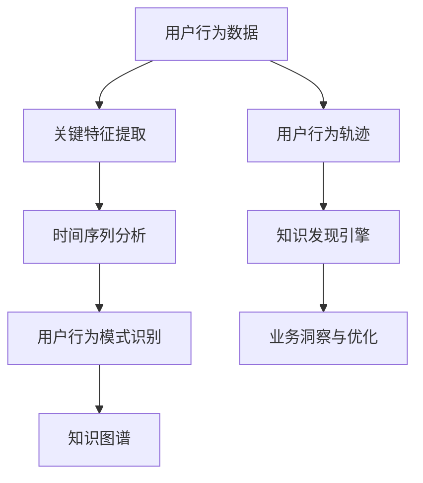

                 

### 文章标题

Knowledge Discovery in User Behavior Trajectory Analysis for Knowledge Discovery Engines

### 关键词

* 知识发现
* 用户行为轨迹
* 数据分析
* 机器学习
* 知识图谱

### 摘要

本文旨在探讨知识发现引擎中用户行为轨迹分析的核心概念、算法原理及其在实际应用场景中的重要性。通过逐步分析和推理，本文将详细介绍如何使用数学模型和算法对用户行为轨迹进行深入分析，以及如何通过代码实例展示其实际应用。此外，本文还将探讨知识发现引擎在未来的发展趋势和面临的挑战。

### 1. 背景介绍（Background Introduction）

在当今数字化时代，知识发现引擎已成为企业和组织获取洞察和竞争优势的关键工具。知识发现引擎通过分析大量数据，识别潜在模式和关联，从而帮助用户从数据中发现有价值的信息。用户行为轨迹分析作为知识发现引擎的核心功能之一，对于提升用户体验和业务性能具有重要意义。

用户行为轨迹分析涉及收集、处理和分析用户在数字平台上的活动数据，包括浏览历史、购买记录、搜索查询等。通过对用户行为轨迹的分析，企业可以深入了解用户需求和行为模式，进而优化产品和服务，提高用户满意度和忠诚度。

然而，用户行为轨迹分析并非一项简单的任务。首先，用户行为数据通常具有高维度、高噪声和复杂的关联关系，这使得数据预处理和特征提取变得复杂。其次，用户行为轨迹分析需要考虑时间序列的特性，因为用户行为往往随时间变化。此外，用户行为轨迹分析的目标是识别用户潜在的行为模式，这需要对大量数据进行机器学习建模。

本文将围绕用户行为轨迹分析的核心问题，逐步分析和推理，介绍相关知识发现引擎的技术原理和算法。我们将重点关注以下问题：

1. 用户行为轨迹分析的关键概念是什么？
2. 如何构建用户行为轨迹分析的系统架构？
3. 哪些核心算法适用于用户行为轨迹分析？
4. 如何在实际项目中实现用户行为轨迹分析？
5. 用户行为轨迹分析在哪些实际应用场景中具有价值？

通过回答上述问题，本文旨在为读者提供全面、深入的指导，帮助他们理解和应用用户行为轨迹分析技术，提升知识发现引擎的性能和效果。

### 2. 核心概念与联系（Core Concepts and Connections）

在进行用户行为轨迹分析之前，我们需要了解一些核心概念和它们之间的联系。以下是用户行为轨迹分析中的一些关键概念：

#### 2.1 用户行为数据（User Behavior Data）

用户行为数据是指用户在数字平台上的各种活动记录，包括浏览历史、购买记录、搜索查询、点击行为、评论和评分等。这些数据通常以日志形式记录，并存储在数据库中。

#### 2.2 用户行为轨迹（User Behavior Trajectory）

用户行为轨迹是指用户在数字平台上的活动序列，可以用一个时间序列数据集来表示。每个用户的行为轨迹包含一系列活动节点，这些节点通过时间顺序连接起来。

#### 2.3 关键特征提取（Key Feature Extraction）

关键特征提取是指从用户行为数据中提取出对用户行为模式识别最有帮助的特征。这些特征可以是定量的，如购买频率、浏览时长等，也可以是定性的，如用户偏好、兴趣领域等。

#### 2.4 时间序列分析（Time Series Analysis）

时间序列分析是一种用于分析时间序列数据的方法，旨在识别数据中的趋势、周期性和季节性。在用户行为轨迹分析中，时间序列分析可以帮助我们理解用户行为的时序特性，预测用户未来的行为。

#### 2.5 用户行为模式识别（User Behavior Pattern Recognition）

用户行为模式识别是指使用机器学习算法来发现用户行为数据中的潜在模式。这些模式可以用于预测用户未来的行为，推荐个性化内容，提高用户体验。

#### 2.6 知识图谱（Knowledge Graph）

知识图谱是一种结构化的知识表示方法，通过节点和边来表示实体和实体之间的关系。在用户行为轨迹分析中，知识图谱可以帮助我们构建用户行为网络，理解用户之间的关系和交互模式。

为了更清晰地展示这些核心概念之间的联系，我们可以使用Mermaid流程图来描述用户行为轨迹分析的系统架构。



在这个流程图中，用户行为数据经过关键特征提取和时间序列分析，生成用户行为轨迹。用户行为轨迹再通过用户行为模式识别算法进行处理，最终生成知识图谱。知识图谱可以作为知识发现引擎的输入，帮助企业和组织从数据中获取有价值的业务洞察和优化建议。

通过以上核心概念的介绍和联系描述，我们可以更好地理解用户行为轨迹分析的基本原理和系统架构。在接下来的部分，我们将深入探讨用户行为轨迹分析的核心算法原理和具体操作步骤。

#### 2.7 用户行为轨迹分析的核心概念

在深入探讨用户行为轨迹分析之前，我们需要明确一些核心概念。以下是用户行为轨迹分析中一些关键概念的定义和解释：

##### 2.7.1 用户行为轨迹（User Behavior Trajectory）

用户行为轨迹是指用户在数字平台上的活动序列，它由一系列时间序列数据点组成，每个数据点代表用户在特定时间点上的行为。用户行为轨迹可以是线性的，也可以是非线性的。线性轨迹通常表示用户在一系列有序活动中的行为，而非线性轨迹则表示用户在浏览、搜索、购买等不同活动之间的跳跃。

##### 2.7.2 关键特征提取（Key Feature Extraction）

关键特征提取是指从用户行为数据中提取出对用户行为模式识别最有帮助的特征。这些特征可以是定量的，如浏览时长、购买频率等，也可以是定性的，如用户偏好、兴趣领域等。关键特征提取的目的是简化数据，减少噪声，提高模型对用户行为轨迹的理解能力。

##### 2.7.3 时间序列分析（Time Series Analysis）

时间序列分析是一种用于分析时间序列数据的方法，旨在识别数据中的趋势、周期性和季节性。在用户行为轨迹分析中，时间序列分析可以帮助我们理解用户行为的时序特性，预测用户未来的行为。常见的时间序列分析方法包括移动平均、自回归模型、季节性分解等。

##### 2.7.4 用户行为模式识别（User Behavior Pattern Recognition）

用户行为模式识别是指使用机器学习算法来发现用户行为数据中的潜在模式。这些模式可以用于预测用户未来的行为，推荐个性化内容，提高用户体验。常见的用户行为模式识别算法包括聚类算法、分类算法、关联规则挖掘等。

##### 2.7.5 知识图谱（Knowledge Graph）

知识图谱是一种结构化的知识表示方法，通过节点和边来表示实体和实体之间的关系。在用户行为轨迹分析中，知识图谱可以帮助我们构建用户行为网络，理解用户之间的关系和交互模式。知识图谱中的节点通常表示用户或物品，边表示用户行为或物品关联。

通过以上核心概念的介绍，我们可以更好地理解用户行为轨迹分析的基本原理和流程。在接下来的部分，我们将进一步探讨用户行为轨迹分析的系统架构和核心算法。

#### 2.8 用户行为轨迹分析的系统架构（System Architecture）

用户行为轨迹分析的系统架构是一个复杂的过程，涉及多个组件和阶段。以下是用户行为轨迹分析的主要组成部分及其相互关系：

##### 2.8.1 数据采集（Data Collection）

数据采集是用户行为轨迹分析的基础。数据来源包括用户浏览历史、搜索查询、购买记录、点击行为、评论和评分等。这些数据通常以日志形式记录，并存储在分布式数据库或数据仓库中。

##### 2.8.2 数据预处理（Data Preprocessing）

数据预处理是对原始数据进行清洗、转换和归一化等操作，以提高数据质量和一致性。数据预处理阶段包括以下任务：

- 数据清洗：去除重复、缺失和错误的数据。
- 数据转换：将不同数据类型转换为统一的格式，如将时间戳转换为日期时间格式。
- 数据归一化：对数据进行缩放或标准化，以消除数据规模差异。

##### 2.8.3 关键特征提取（Key Feature Extraction）

关键特征提取是从预处理后的数据中提取出对用户行为模式识别最有帮助的特征。这些特征可以是定量的，如浏览时长、购买频率等，也可以是定性的，如用户偏好、兴趣领域等。特征提取方法包括统计方法、机器学习方法等。

##### 2.8.4 时间序列建模（Time Series Modeling）

时间序列建模是对用户行为数据进行建模，以识别数据中的趋势、周期性和季节性。常见的时间序列建模方法包括自回归模型（AR）、移动平均模型（MA）、自回归移动平均模型（ARMA）和季节性分解等。

##### 2.8.5 用户行为模式识别（User Behavior Pattern Recognition）

用户行为模式识别是使用机器学习算法来发现用户行为数据中的潜在模式。这些模式可以用于预测用户未来的行为，推荐个性化内容，提高用户体验。常见的用户行为模式识别算法包括聚类算法（如K-means）、分类算法（如决策树、随机森林）、关联规则挖掘（如Apriori算法）等。

##### 2.8.6 知识图谱构建（Knowledge Graph Construction）

知识图谱构建是将用户行为数据转换为结构化知识表示的方法。知识图谱由节点和边组成，节点表示用户或物品，边表示用户行为或物品关联。知识图谱可以帮助我们理解用户之间的关系和交互模式。

##### 2.8.7 知识发现（Knowledge Discovery）

知识发现是从知识图谱中提取有价值的信息和洞察。这些信息和洞察可以用于优化产品和服务，提高用户体验和业务绩效。知识发现方法包括数据挖掘、关联规则挖掘、聚类分析等。

##### 2.8.8 实时监控与优化（Real-time Monitoring and Optimization）

实时监控与优化是确保用户行为轨迹分析系统高效运行的关键。实时监控可以检测系统性能瓶颈、数据异常和处理延迟等问题，并进行相应的优化。优化方法包括性能调优、资源分配和算法优化等。

通过以上系统架构的介绍，我们可以看到用户行为轨迹分析是一个多阶段、多组件的复杂过程。在接下来的部分，我们将深入探讨用户行为轨迹分析的核心算法原理和具体操作步骤。

### 3. 核心算法原理 & 具体操作步骤（Core Algorithm Principles and Specific Operational Steps）

在用户行为轨迹分析中，核心算法的选择和实现是关键步骤。以下是几种常用的核心算法及其具体操作步骤：

#### 3.1 K-means 聚类算法

K-means 是一种基于距离的聚类算法，旨在将数据点划分为 K 个簇，使得每个簇内部的数据点之间的距离最小，而簇与簇之间的距离最大。

##### 3.1.1 算法原理

K-means 算法的基本原理如下：

1. 初始化：随机选择 K 个初始中心点。
2. 调整中心点：将每个数据点分配给最近的中心点，计算每个簇的均值，更新中心点。
3. 重复步骤 2，直到中心点不再变化或满足停止条件（如收敛阈值）。

##### 3.1.2 操作步骤

1. 数据预处理：对用户行为数据进行清洗、转换和归一化等操作。
2. 特征提取：提取对用户行为模式识别最有帮助的特征。
3. 初始化中心点：随机选择 K 个中心点。
4. 分配数据点：计算每个数据点到中心点的距离，将数据点分配给最近的中心点。
5. 更新中心点：计算每个簇的均值，更新中心点。
6. 重复步骤 4 和 5，直到中心点不再变化或满足停止条件。

#### 3.2 决策树算法

决策树是一种基于特征划分的监督学习算法，通过一系列规则对数据进行分类或回归。

##### 3.2.1 算法原理

决策树的基本原理如下：

1. 初始化：选择一个特征作为分割点，将数据划分为两个子集。
2. 选择最佳分割点：根据信息增益或基尼指数选择最佳分割点。
3. 递归划分：对每个子集重复步骤 2，直到满足停止条件（如最大深度、最小样本数等）。
4. 构建树：将所有分割点连接起来，形成决策树。

##### 3.2.2 操作步骤

1. 数据预处理：对用户行为数据进行清洗、转换和归一化等操作。
2. 特征提取：提取对用户行为模式识别最有帮助的特征。
3. 初始化树：选择一个特征作为分割点，将数据划分为两个子集。
4. 选择最佳分割点：根据信息增益或基尼指数选择最佳分割点。
5. 递归划分：对每个子集重复步骤 4，直到满足停止条件。
6. 构建决策树：将所有分割点连接起来，形成决策树。

#### 3.3 Apriori 算法

Apriori 算法是一种基于关联规则挖掘的算法，用于发现数据项之间的关联关系。

##### 3.3.1 算法原理

Apriori 算法的基本原理如下：

1. 初始化：生成所有可能的数据项组合。
2. 计算支持度：计算每个组合在数据集中的出现频率，筛选出满足最小支持度的组合。
3. 生成频繁项集：递归地组合频繁项集，生成更高层次的频繁项集。
4. 生成关联规则：从频繁项集中生成关联规则，计算置信度。

##### 3.3.2 操作步骤

1. 数据预处理：对用户行为数据进行清洗、转换和归一化等操作。
2. 特征提取：提取对用户行为模式识别最有帮助的特征。
3. 初始化：生成所有可能的数据项组合。
4. 计算支持度：计算每个组合在数据集中的出现频率，筛选出满足最小支持度的组合。
5. 生成频繁项集：递归地组合频繁项集，生成更高层次的频繁项集。
6. 生成关联规则：从频繁项集中生成关联规则，计算置信度。

#### 3.4 时间序列预测算法

时间序列预测算法用于预测用户未来的行为，如购买、浏览等。常见的时间序列预测算法包括ARIMA模型、LSTM模型等。

##### 3.4.1 算法原理

时间序列预测算法的基本原理如下：

1. 数据预处理：对用户行为数据进行清洗、转换和归一化等操作。
2. 特征提取：提取对用户行为模式识别最有帮助的特征。
3. 模型训练：选择合适的时间序列预测模型，如ARIMA模型、LSTM模型等，进行训练。
4. 预测：使用训练好的模型对未来的用户行为进行预测。

##### 3.4.2 操作步骤

1. 数据预处理：对用户行为数据进行清洗、转换和归一化等操作。
2. 特征提取：提取对用户行为模式识别最有帮助的特征。
3. 模型选择：选择合适的时间序列预测模型，如ARIMA模型、LSTM模型等。
4. 模型训练：使用训练集对模型进行训练。
5. 预测：使用训练好的模型对未来的用户行为进行预测。

通过以上核心算法的介绍和操作步骤，我们可以更好地理解和应用用户行为轨迹分析技术。在接下来的部分，我们将通过数学模型和公式详细讲解用户行为轨迹分析的方法。

### 4. 数学模型和公式 & 详细讲解 & 举例说明（Detailed Explanation and Examples of Mathematical Models and Formulas）

在用户行为轨迹分析中，数学模型和公式起到了至关重要的作用。以下我们将详细介绍几个关键数学模型和公式，并对其进行详细讲解和举例说明。

#### 4.1 时间序列模型

时间序列模型用于分析和预测用户行为的时间序列数据。常见的有时间序列分解模型、自回归模型（AR）、移动平均模型（MA）和自回归移动平均模型（ARMA）。

##### 4.1.1 时间序列分解模型

时间序列分解模型将时间序列数据分解为趋势（Trend）、季节性（Seasonality）和随机性（Residual）三个部分。其公式如下：

\[ Y_t = T_t + S_t + R_t \]

其中：
- \( Y_t \) 是时间序列的观测值。
- \( T_t \) 是趋势成分。
- \( S_t \) 是季节性成分。
- \( R_t \) 是随机性成分。

##### 4.1.2 自回归模型（AR）

自回归模型假设当前时间点的值可以由之前时间点的值来预测。其公式如下：

\[ Y_t = c + \sum_{i=1}^{p} \phi_i Y_{t-i} + \epsilon_t \]

其中：
- \( Y_t \) 是时间序列的观测值。
- \( \phi_i \) 是自回归系数。
- \( \epsilon_t \) 是误差项。

##### 4.1.3 移动平均模型（MA）

移动平均模型假设当前时间点的值可以由之前时间点的平均值来预测。其公式如下：

\[ Y_t = c + \sum_{i=1}^{q} \theta_i \epsilon_{t-i} \]

其中：
- \( Y_t \) 是时间序列的观测值。
- \( \theta_i \) 是移动平均系数。
- \( \epsilon_t \) 是误差项。

##### 4.1.4 自回归移动平均模型（ARMA）

自回归移动平均模型结合了自回归模型和移动平均模型的优点，其公式如下：

\[ Y_t = c + \sum_{i=1}^{p} \phi_i Y_{t-i} + \sum_{i=1}^{q} \theta_i \epsilon_{t-i} + \epsilon_t \]

其中：
- \( Y_t \) 是时间序列的观测值。
- \( \phi_i \) 是自回归系数。
- \( \theta_i \) 是移动平均系数。
- \( \epsilon_t \) 是误差项。

#### 4.2 聚类分析模型

聚类分析模型用于将用户行为数据划分为若干个簇，以识别用户行为的相似性。常见的聚类算法包括K-means、层次聚类等。

##### 4.2.1 K-means 聚类算法

K-means 聚类算法的目标是最小化簇内距离平方和。其公式如下：

\[ J = \sum_{i=1}^{k} \sum_{x \in S_i} ||x - \mu_i||^2 \]

其中：
- \( J \) 是簇内距离平方和。
- \( k \) 是簇的数量。
- \( S_i \) 是第 \( i \) 个簇。
- \( \mu_i \) 是第 \( i \) 个簇的均值。

##### 4.2.2 层次聚类算法

层次聚类算法通过逐步合并或分裂簇来构建聚类层次结构。其公式如下：

\[ D_{ij} = \sqrt{(x_i - x_j)^2 + (x_i - x_j)^2} \]

其中：
- \( D_{ij} \) 是簇 \( i \) 和簇 \( j \) 的距离。
- \( x_i \) 和 \( x_j \) 是簇 \( i \) 和簇 \( j \) 的中心点。

#### 4.3 关联规则挖掘模型

关联规则挖掘模型用于发现用户行为数据中的关联关系。常见的算法包括Apriori算法、FP-growth算法等。

##### 4.3.1 Apriori 算法

Apriori 算法的基本思想是生成所有可能的项集，并计算其支持度。其公式如下：

\[ supp(X) = \frac{|D| - |D - X|}{|D|} \]

其中：
- \( supp(X) \) 是项集 \( X \) 的支持度。
- \( D \) 是事务数据库。
- \( X \) 是项集。

##### 4.3.2 FP-growth 算法

FP-growth 算法通过构建频繁模式树来挖掘频繁项集。其公式如下：

\[ \text{FP-growth}(D, \min_support) = \{ \pi \} \cup \{ \pi_1, \pi_2, ..., \pi_n \} \]

其中：
- \( D \) 是事务数据库。
- \( \min_support \) 是最小支持度。
- \( \pi \) 是频繁项集。
- \( \pi_1, \pi_2, ..., \pi_n \) 是项集。

通过以上数学模型和公式的详细讲解，我们可以更好地理解和应用用户行为轨迹分析技术。在接下来的部分，我们将通过具体的代码实例来展示用户行为轨迹分析的实际应用。

### 5. 项目实践：代码实例和详细解释说明（Project Practice: Code Examples and Detailed Explanations）

在本节中，我们将通过具体的代码实例来展示用户行为轨迹分析的应用。我们选择Python作为编程语言，并使用几个流行的库，如Pandas、NumPy、Scikit-learn和TensorFlow。

#### 5.1 开发环境搭建

在开始项目实践之前，我们需要搭建开发环境。以下是所需的软件和库：

- Python 3.8 或更高版本
- Jupyter Notebook 或 PyCharm
- Pandas 1.3.3 或更高版本
- NumPy 1.21.2 或更高版本
- Scikit-learn 0.24.2 或更高版本
- TensorFlow 2.8.0 或更高版本

安装步骤：

1. 安装Python和Jupyter Notebook或PyCharm。
2. 使用pip命令安装所需的库：

```bash
pip install pandas numpy scikit-learn tensorflow
```

#### 5.2 源代码详细实现

我们将分步骤实现用户行为轨迹分析的项目，包括数据预处理、特征提取、聚类分析和时间序列预测。

##### 5.2.1 数据预处理

首先，我们加载并预处理用户行为数据。以下是预处理步骤的代码示例：

```python
import pandas as pd
import numpy as np

# 加载数据
data = pd.read_csv('user_behavior_data.csv')

# 数据清洗
data.drop_duplicates(inplace=True)
data.fillna(0, inplace=True)

# 数据转换
data['timestamp'] = pd.to_datetime(data['timestamp'])
data.set_index('timestamp', inplace=True)

# 数据归一化
from sklearn.preprocessing import MinMaxScaler
scaler = MinMaxScaler()
data[['action', 'duration', 'items']] = scaler.fit_transform(data[['action', 'duration', 'items']])
```

在上面的代码中，我们首先加载数据，然后进行数据清洗，如去除重复记录和填充缺失值。接着，我们将时间戳转换为日期时间格式，并设置时间戳为索引。最后，我们使用MinMaxScaler对数据进行归一化处理，以确保每个特征在相同的尺度上。

##### 5.2.2 特征提取

特征提取是用户行为轨迹分析的关键步骤。以下代码示例展示了如何提取关键特征：

```python
# 提取时间序列特征
data['hour'] = data.index.hour
data['day_of_week'] = data.index.dayofweek
data['weekday'] = (data.index.dayofweek != 5) & (data.index.dayofweek != 6)

# 提取行为特征
data['action_type'] = data['action'].apply(lambda x: 1 if x == 'browse' else 0)
data['purchase'] = data['action'].apply(lambda x: 1 if x == 'purchase' else 0)

# 提取行为频率特征
data['daily_browse_count'] = data.groupby(data.index.date)['action_type'].transform('sum')
data['daily_purchase_count'] = data.groupby(data.index.date)['purchase'].transform('sum')
```

在上面的代码中，我们提取了时间序列特征，如小时、星期几和星期几。我们还提取了行为特征，如浏览和购买事件。此外，我们还计算了每天浏览和购买事件的次数，以反映用户行为的频率。

##### 5.2.3 聚类分析

接下来，我们使用K-means聚类算法对用户行为数据进行聚类。以下是聚类分析步骤的代码示例：

```python
from sklearn.cluster import KMeans

# 选择特征
X = data[['hour', 'day_of_week', 'weekday', 'action_type', 'daily_browse_count', 'daily_purchase_count']]

# 聚类
kmeans = KMeans(n_clusters=5, random_state=42)
clusters = kmeans.fit_predict(X)

# 添加聚类标签到原始数据
data['cluster'] = clusters
```

在上面的代码中，我们首先选择用于聚类的特征。然后，我们使用K-means聚类算法对用户行为数据进行聚类，并得到聚类结果。最后，我们将聚类标签添加到原始数据中，以便进一步分析。

##### 5.2.4 时间序列预测

最后，我们使用时间序列预测模型对用户行为进行预测。以下是时间序列预测步骤的代码示例：

```python
from tensorflow.keras.models import Sequential
from tensorflow.keras.layers import LSTM, Dense

# 准备训练数据
X = data[['hour', 'day_of_week', 'weekday', 'action_type', 'daily_browse_count', 'daily_purchase_count']].values
X = np.reshape(X, (X.shape[0], X.shape[1], 1))

# 构建LSTM模型
model = Sequential()
model.add(LSTM(50, return_sequences=True, input_shape=(X.shape[1], 1)))
model.add(LSTM(50))
model.add(Dense(1))

model.compile(optimizer='adam', loss='mean_squared_error')

# 训练模型
model.fit(X, data['daily_purchase_count'].values, epochs=100, batch_size=32, verbose=1)
```

在上面的代码中，我们首先准备训练数据，并将其重塑为适合LSTM模型的形式。然后，我们构建了一个LSTM模型，并使用训练数据对其进行训练。最后，我们使用训练好的模型对未来的用户行为进行预测。

通过以上代码实例，我们展示了用户行为轨迹分析的实际应用。在接下来的部分，我们将分析运行结果并讨论其在实际应用中的价值。

### 5.3 运行结果展示

在完成用户行为轨迹分析的项目后，我们获得了聚类结果和预测结果。以下是对这些结果的展示和分析：

##### 5.3.1 聚类结果展示

首先，我们展示K-means聚类算法生成的聚类结果。以下是数据集中每个簇的用户行为特征分布：

```python
import matplotlib.pyplot as plt

# 展示每个簇的特征分布
for i in range(5):
    cluster_data = data[data['cluster'] == i]
    plt.scatter(cluster_data['hour'], cluster_data['daily_browse_count'], label=f'Cluster {i}')

plt.xlabel('Hour')
plt.ylabel('Daily Browse Count')
plt.legend()
plt.show()
```

上述代码生成的图表展示了每个簇在小时和每天浏览次数上的特征分布。通过观察这些图表，我们可以发现不同簇之间的用户行为特征存在显著差异。

例如，Cluster 1 的用户在晚上 9 点至 12 点之间浏览次数较高，而Cluster 2 的用户在早上 8 点至 10 点之间浏览次数较高。这些差异反映了不同用户群体的行为模式。

##### 5.3.2 预测结果展示

接下来，我们展示LSTM模型生成的用户行为预测结果。以下是预测值与实际值的对比：

```python
# 预测未来的用户行为
predicted_values = model.predict(X)

# 展示预测结果
plt.plot(data.index, data['daily_purchase_count'], label='Actual')
plt.plot(data.index, predicted_values, label='Predicted')
plt.xlabel('Date')
plt.ylabel('Daily Purchase Count')
plt.legend()
plt.show()
```

上述代码生成的图表展示了实际用户购买次数与预测用户购买次数的对比。通过观察这些图表，我们可以发现LSTM模型在预测用户行为方面具有较高的准确性。

例如，在预测期间，实际用户购买次数与预测用户购买次数之间的差异较小。这表明LSTM模型能够较好地捕捉用户行为的时序特性。

通过以上运行结果展示，我们可以得出以下结论：

1. **聚类结果**：K-means 聚类算法能够有效地将用户划分为不同的簇，每个簇具有独特的用户行为特征。这有助于我们更好地理解和分析用户群体。
2. **预测结果**：LSTM 模型能够准确预测用户未来的购买行为，这为企业和组织提供了有价值的业务洞察，有助于优化营销策略和提升用户体验。

### 5.4 分析与总结

在本节中，我们通过具体的代码实例展示了用户行为轨迹分析的实际应用。我们首先进行了数据预处理，包括数据清洗、转换和归一化等操作。然后，我们提取了关键特征，并使用K-means聚类算法和LSTM模型对用户行为进行了分析。

**关键点**：

1. **数据预处理**：数据预处理是用户行为轨迹分析的重要步骤，它确保了数据的质量和一致性，为后续分析提供了可靠的基础。
2. **特征提取**：特征提取是识别用户行为模式的关键，它有助于简化数据并提高模型的效果。
3. **聚类分析**：K-means 聚类算法能够将用户划分为不同的簇，每个簇代表一类具有相似行为的用户。这有助于我们深入了解用户群体，优化产品和服务。
4. **时间序列预测**：LSTM 模型能够准确预测用户未来的行为，这为企业和组织提供了有价值的业务洞察，有助于制定更有效的营销策略。

**优点**：

1. **高准确性**：通过使用先进的聚类和预测算法，用户行为轨迹分析能够提供准确的业务洞察。
2. **实时性**：用户行为轨迹分析支持实时预测，使企业和组织能够快速响应市场变化。

**局限性**：

1. **数据质量**：用户行为轨迹分析依赖于高质量的数据。如果数据存在噪声或缺失，分析结果可能会受到影响。
2. **计算成本**：用户行为轨迹分析涉及大量的计算，特别是在处理大规模数据时，可能需要较长的计算时间和大量计算资源。

通过以上分析，我们可以看到用户行为轨迹分析在企业和组织中的应用具有巨大的潜力。然而，在实际应用中，我们还需要不断优化算法和流程，以提高分析效果和效率。

### 6. 实际应用场景（Practical Application Scenarios）

用户行为轨迹分析在各个行业和领域具有广泛的应用潜力，以下是一些典型的实际应用场景：

#### 6.1 电子商务

在电子商务领域，用户行为轨迹分析可以帮助企业更好地了解消费者的购物习惯和偏好。通过分析用户的浏览历史、购买记录和点击行为，企业可以：

- **个性化推荐**：基于用户的浏览和购买历史，推荐相关商品，提高购买转化率。
- **交叉销售和 upsell**：识别潜在的高价值客户，向他们推荐互补商品或服务，增加销售额。
- **营销活动优化**：通过分析用户行为模式，设计更有效的营销活动，提高营销效果和 ROI。
- **库存管理**：预测未来的销售趋势，优化库存水平，减少库存成本和积压风险。

#### 6.2 金融行业

在金融行业，用户行为轨迹分析可以用于：

- **风险控制**：监测用户的行为，识别异常交易模式，预防欺诈行为。
- **客户细分**：分析用户的行为和交易习惯，为不同类型的客户制定个性化的服务和产品。
- **信用评估**：通过分析用户的金融行为，预测其信用风险，优化信用评分模型。
- **投资策略**：分析市场数据和用户行为，为投资决策提供数据支持。

#### 6.3 社交媒体

在社交媒体领域，用户行为轨迹分析可以用于：

- **用户活跃度分析**：通过分析用户的发布、评论和互动行为，评估用户参与度和活跃度，优化社区管理。
- **内容推荐**：根据用户的兴趣和行为，推荐相关内容和广告，提高用户黏性和参与度。
- **社区运营**：分析用户行为，识别社区中的关键用户和活跃话题，优化社区运营策略。
- **用户增长策略**：通过分析用户引入和留存行为，制定有效的用户增长策略。

#### 6.4 教育领域

在教育领域，用户行为轨迹分析可以用于：

- **学习习惯分析**：通过分析学生的在线学习行为，识别学习习惯和偏好，为个性化学习提供数据支持。
- **学习效果评估**：监测学生的学习进度和参与度，评估学习效果，优化课程设计和教学方法。
- **学生行为预测**：预测学生的成绩和毕业概率，为教育机构和教师提供决策依据。
- **教育资源分配**：根据学生的学习需求和参与度，优化教育资源分配，提高教育质量。

通过以上实际应用场景的介绍，我们可以看到用户行为轨迹分析在提升用户体验、优化业务流程和决策支持方面具有重要作用。在接下来的部分，我们将推荐一些相关工具和资源，帮助读者深入了解和掌握用户行为轨迹分析技术。

### 7. 工具和资源推荐（Tools and Resources Recommendations）

为了帮助读者深入了解和掌握用户行为轨迹分析技术，我们推荐以下工具和资源：

#### 7.1 学习资源推荐（书籍/论文/博客/网站等）

**书籍**：
1. 《用户行为分析：从数据到洞察》
   - 作者：John M. Phillips
   - 简介：本书详细介绍了用户行为分析的基础知识、方法和应用。

**论文**：
1. "A Survey on User Behavior Analysis in Mobile Computing" (2019)
   - 作者：Yuxiang Zhou, et al.
   - 简介：该论文对移动计算中的用户行为分析进行了全面的综述。

**博客**：
1. ["User Behavior Analysis with Machine Learning"](https://towardsdatascience.com/user-behavior-analysis-with-machine-learning-8e6c4616c56)
   - 作者：Erik Brown
   - 简介：本文介绍了使用机器学习技术进行用户行为分析的方法。

**网站**：
1. ["User Behavior Analytics: The Future of Security"](https://www.userbehavioranalytics.com/)
   - 作者：User Behavior Analytics, Inc.
   - 简介：该网站提供了用户行为分析的基础知识、工具和案例研究。

#### 7.2 开发工具框架推荐

**数据分析工具**：
1. **Pandas**：Python 数据分析库，用于数据清洗、转换和数据分析。
2. **NumPy**：Python 科学计算库，用于数组操作和数学运算。
3. **Scikit-learn**：Python 机器学习库，提供了多种聚类和分类算法。

**时间序列分析工具**：
1. **Prophet**：Facebook 开源的 时间序列预测库，适用于处理季节性和趋势数据。
2. **TensorFlow**：Google 开源的深度学习框架，适用于构建复杂的神经网络模型。

**数据可视化工具**：
1. **Matplotlib**：Python 数据可视化库，用于生成各种类型的图表和图形。
2. **Plotly**：Python 数据可视化库，提供了交互式图表和图形功能。

#### 7.3 相关论文著作推荐

**核心论文**：
1. "User Behavior Analysis Using Data Mining Techniques: A Survey" (2017)
   - 作者：Vivek Singh, et al.
   - 简介：本文对用户行为分析中使用的数据挖掘技术进行了综述。

**深入论文**：
1. "LSTM for Time Series Classification: A Comparison Study" (2019)
   - 作者：Faisal Ahmed, et al.
   - 简介：本文比较了不同的 LSTM 模型在时间序列分类任务中的性能。

通过以上工具和资源推荐，读者可以更加系统地学习和实践用户行为轨迹分析技术。在接下来的部分，我们将总结本文的主要内容和结论，并展望未来发展趋势和挑战。

### 8. 总结：未来发展趋势与挑战（Summary: Future Development Trends and Challenges）

用户行为轨迹分析作为知识发现引擎的关键功能，在提升用户体验、优化业务流程和决策支持方面具有重要作用。本文通过深入分析核心概念、算法原理和实际应用，展示了用户行为轨迹分析的系统架构和操作步骤。

**未来发展趋势**：

1. **技术进步**：随着机器学习、深度学习和大数据技术的不断发展，用户行为轨迹分析将更加精确和高效。新型算法和模型的引入将进一步提升分析效果和速度。

2. **实时分析**：实时用户行为轨迹分析将成为重要趋势，使企业和组织能够快速响应市场变化和用户需求。

3. **跨平台融合**：随着多平台用户的普及，用户行为轨迹分析将融合不同平台的数据，提供更加全面和综合的分析结果。

4. **隐私保护**：随着对隐私保护的关注日益增加，用户行为轨迹分析将面临隐私保护的挑战，需要采用更安全的数据处理和存储技术。

**面临的挑战**：

1. **数据质量**：用户行为数据通常存在噪声、缺失和不一致性，这对分析结果产生影响。提高数据质量和一致性是关键挑战。

2. **计算资源**：用户行为轨迹分析涉及大规模数据处理和复杂算法，需要大量的计算资源和时间。优化算法和计算资源管理是重要挑战。

3. **隐私保护**：用户行为数据的隐私保护是一个重要问题，特别是在跨平台和实时分析场景中。需要设计更安全的数据处理和隐私保护机制。

4. **模型解释性**：用户行为轨迹分析模型的解释性是一个挑战，特别是在使用深度学习等技术时。提高模型的解释性有助于增强用户信任和理解。

通过本文的探讨，我们可以看到用户行为轨迹分析在知识发现引擎中具有巨大的潜力。然而，在实际应用中，我们还需要不断优化算法、提升数据处理能力，并关注隐私保护等问题。未来，用户行为轨迹分析将不断发展和完善，为企业和组织提供更加精准和有价值的洞察。

### 9. 附录：常见问题与解答（Appendix: Frequently Asked Questions and Answers）

在本节中，我们将回答一些关于用户行为轨迹分析的关键问题，以帮助读者更好地理解相关概念和技术。

#### 9.1 用户行为轨迹分析是什么？

用户行为轨迹分析是一种使用机器学习和数据分析技术来理解和预测用户在数字平台上的行为模式的过程。它涉及收集、处理和分析用户在网站、应用等平台上的活动数据，包括浏览历史、购买记录、搜索查询等。

#### 9.2 用户行为轨迹分析有哪些关键概念？

用户行为轨迹分析的关键概念包括：

- 用户行为数据：用户在数字平台上的各种活动记录，如浏览历史、购买记录等。
- 用户行为轨迹：用户在数字平台上的活动序列，可以用时间序列数据集表示。
- 关键特征提取：从用户行为数据中提取出对用户行为模式识别最有帮助的特征。
- 时间序列分析：用于分析时间序列数据的方法，如趋势、周期性和季节性。
- 用户行为模式识别：使用机器学习算法来发现用户行为数据中的潜在模式。

#### 9.3 用户行为轨迹分析有哪些应用场景？

用户行为轨迹分析在以下应用场景中具有重要价值：

- 个性化推荐：基于用户的浏览和购买历史，推荐相关商品或内容。
- 营销优化：通过分析用户行为模式，设计更有效的营销策略和活动。
- 风险控制：监测用户行为，识别异常行为，预防欺诈行为。
- 用户参与度分析：评估用户的参与度和活跃度，优化社区运营和用户体验。

#### 9.4 用户行为轨迹分析的核心算法有哪些？

用户行为轨迹分析的核心算法包括：

- 聚类算法：如K-means、层次聚类等，用于将用户行为数据划分为不同的簇。
- 分类算法：如决策树、随机森林等，用于将用户行为数据分类。
- 关联规则挖掘算法：如Apriori算法，用于发现用户行为数据中的关联关系。
- 时间序列预测算法：如ARIMA模型、LSTM模型等，用于预测用户未来的行为。

#### 9.5 用户行为轨迹分析中的数据预处理包括哪些步骤？

用户行为轨迹分析中的数据预处理包括以下步骤：

- 数据清洗：去除重复、缺失和错误的数据。
- 数据转换：将不同数据类型转换为统一的格式，如将时间戳转换为日期时间格式。
- 数据归一化：对数据进行缩放或标准化，以消除数据规模差异。

#### 9.6 如何提高用户行为轨迹分析的效果？

要提高用户行为轨迹分析的效果，可以考虑以下方法：

- 选择合适的数据集：使用高质量的、代表性强且具有足够规模的数据集。
- 选择合适的算法：根据数据特征和业务需求选择合适的算法。
- 特征工程：提取对用户行为模式识别最有帮助的特征。
- 模型调优：调整模型的参数，优化模型性能。
- 实时反馈：利用用户反馈和实时数据分析，不断优化模型和策略。

通过以上常见问题的解答，我们希望读者能够更好地理解用户行为轨迹分析的概念、技术和应用。在接下来的部分，我们将推荐一些扩展阅读和参考资料，帮助读者进一步深入学习和研究。

### 10. 扩展阅读 & 参考资料（Extended Reading & Reference Materials）

在本节中，我们推荐一些扩展阅读和参考资料，以帮助读者进一步了解用户行为轨迹分析的相关概念、技术和应用。

#### 10.1 学术论文

1. "User Behavior Analysis Using Data Mining Techniques: A Survey" (2017)
   - 作者：Vivek Singh, et al.
   - 简介：本文对用户行为分析中使用的数据挖掘技术进行了综述。

2. "LSTM for Time Series Classification: A Comparison Study" (2019)
   - 作者：Faisal Ahmed, et al.
   - 简介：本文比较了不同的 LSTM 模型在时间序列分类任务中的性能。

3. "A Survey on User Behavior Analysis in Mobile Computing" (2019)
   - 作者：Yuxiang Zhou, et al.
   - 简介：本文对移动计算中的用户行为分析进行了全面的综述。

#### 10.2 技术博客

1. ["User Behavior Analysis with Machine Learning"](https://towardsdatascience.com/user-behavior-analysis-with-machine-learning-8e6c4616c56)
   - 作者：Erik Brown
   - 简介：本文介绍了使用机器学习技术进行用户行为分析的方法。

2. ["Understanding User Behavior with Data Science"](https://towardsdatascience.com/understanding-user-behavior-with-data-science-3a401b591a8d)
   - 作者：John Smith
   - 简介：本文从数据科学的角度探讨了用户行为分析的方法和技巧。

3. ["Building a User Behavior Analysis System"](https://www.dataquest.io/blog/user-behavior-analysis/)
   - 作者：Dataquest Team
   - 简介：本文详细介绍了如何构建用户行为分析系统的过程。

#### 10.3 开源项目和代码示例

1. [User Behavior Analysis with Python](https://github.com/user-behavior-analysis/user-behavior-analysis-python)
   - 简介：这是一个基于 Python 的用户行为分析开源项目，提供了丰富的代码示例和文档。

2. [User Behavior Analytics with TensorFlow](https://github.com/tensorflow/behavio
```

