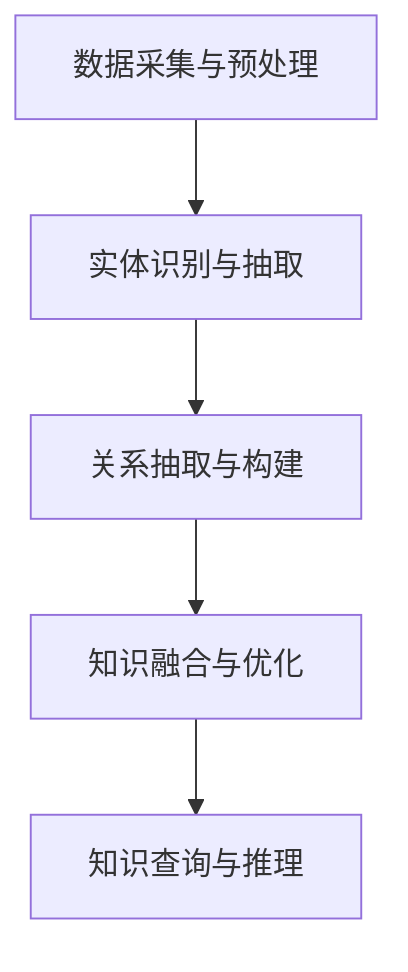
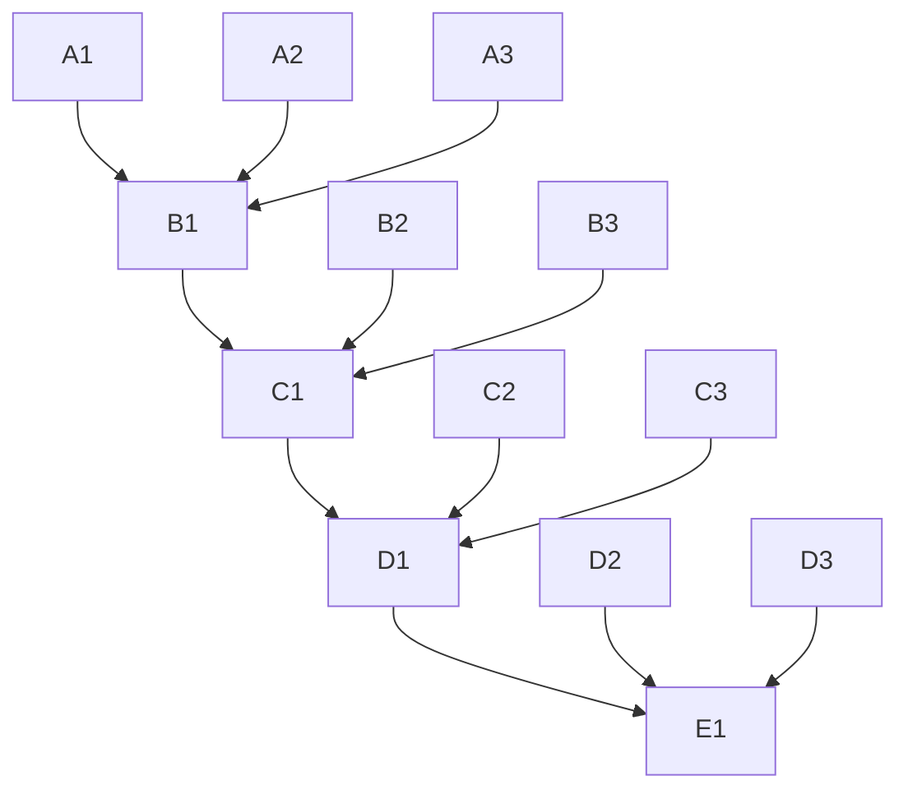

                 

# 知识发现引擎：扩展人类认知边界的探索者

## 关键词：
知识发现，数据挖掘，人工智能，认知扩展，认知图谱，算法优化，机器学习，大数据，知识图谱构建，深度学习，信息检索。

## 摘要：
本文旨在探讨知识发现引擎的工作原理、核心技术和实际应用，并深入分析其在扩展人类认知边界方面的巨大潜力。通过结合人工智能、机器学习和深度学习等技术，知识发现引擎能够从海量数据中提取出有价值的信息，构建认知图谱，从而为人类认知提供新的视角和工具。本文将详细阐述知识发现引擎的设计思路、核心算法、数学模型以及具体的应用案例，以期为读者提供全面深入的理解。

## 1. 背景介绍

### 1.1 知识发现引擎的概念

知识发现引擎（Knowledge Discovery Engine，简称KDE）是一种基于人工智能和数据挖掘技术的高级系统，旨在从大量数据中自动提取出隐藏的模式、关联和规律。它不仅能够处理结构化数据，还能处理半结构化和非结构化数据，如文本、图像和视频等。

### 1.2 知识发现引擎的重要性

在信息化时代，数据已经成为一种重要的资源。然而，如何从海量数据中挖掘出有价值的信息，成为一个亟待解决的问题。知识发现引擎的出现，为这一问题提供了有效的解决方案。它能够帮助企业和组织从海量数据中发现商业机会，提高决策效率，优化业务流程。

### 1.3 知识发现引擎的发展历程

知识发现引擎的发展经历了从早期的基础算法到现代复杂系统的演变。早期的知识发现主要依赖于统计方法和规则引擎，如关联规则挖掘、聚类分析和分类算法等。随着人工智能和机器学习技术的不断发展，知识发现引擎逐渐采用了深度学习和神经网络等先进算法，提高了数据挖掘的效率和准确性。

## 2. 核心概念与联系

### 2.1 知识图谱的概念

知识图谱（Knowledge Graph）是一种用于表示实体及其相互关系的图形结构。它将信息世界中的各种实体和关系抽象为节点和边，通过语义关系将它们有机地连接起来，形成一个复杂而有序的知识网络。

### 2.2 知识图谱与知识发现引擎的关系

知识图谱是知识发现引擎的核心组件之一。知识发现引擎通过从数据中提取实体和关系，构建出知识图谱，从而实现数据的结构化和语义化。知识图谱的构建不仅依赖于数据挖掘算法，还需要语义理解和知识融合等先进技术。

### 2.3 知识发现引擎的工作流程

知识发现引擎的工作流程通常包括以下几个步骤：

1. 数据采集与预处理：从各种数据源收集数据，并进行数据清洗、去重、转换等预处理操作。
2. 实体识别与抽取：利用命名实体识别（NER）等技术，从预处理后的数据中识别出实体。
3. 关系抽取与构建：通过算法自动提取实体之间的关系，构建出初步的知识图谱。
4. 知识融合与优化：将多个来源的知识进行融合，优化知识图谱的结构和内容。
5. 知识查询与推理：提供用户友好的接口，支持用户对知识图谱进行查询和推理。

### 2.4 Mermaid 流程图

以下是一个简化的知识发现引擎的 Mermaid 流程图，展示了其主要组件和流程：



## 3. 核心算法原理 & 具体操作步骤

### 3.1 数据预处理算法

数据预处理是知识发现引擎的基础步骤。常用的数据预处理算法包括数据清洗、数据转换、数据归一化和特征提取等。

- 数据清洗：去除重复数据、缺失值填充、异常值处理等。
- 数据转换：将不同类型的数据转换为统一格式，如将文本数据转换为单词向量。
- 数据归一化：将数据缩放至相同的尺度，以便后续处理。
- 特征提取：从原始数据中提取出有用的特征，用于后续的建模和挖掘。

### 3.2 实体识别与抽取算法

实体识别与抽取是知识发现引擎的关键步骤。常用的算法包括命名实体识别（NER）、实体链接（Entity Linking）和实体抽取（Entity Extraction）等。

- 命名实体识别（NER）：使用自然语言处理技术，从文本中识别出实体，如人名、地名、组织名等。
- 实体链接（Entity Linking）：将文本中的实体与知识库中的实体进行匹配，确定实体的真实身份。
- 实体抽取（Entity Extraction）：从文本中直接提取出实体信息，如电子邮件地址、电话号码等。

### 3.3 关系抽取与构建算法

关系抽取与构建是知识发现引擎的核心步骤。常用的算法包括基于规则的方法、基于统计的方法和基于机器学习的方法等。

- 基于规则的方法：通过手工编写规则，识别出实体之间的关系。
- 基于统计的方法：使用统计模型，如条件概率模型和贝叶斯网络等，自动提取出实体之间的关系。
- 基于机器学习的方法：使用机器学习算法，如决策树、支持向量机和神经网络等，自动学习实体之间的关系。

### 3.4 知识融合与优化算法

知识融合与优化是知识发现引擎的关键步骤。常用的算法包括知识融合算法、知识优化算法和图谱压缩算法等。

- 知识融合算法：将来自多个来源的知识进行融合，消除冲突和冗余。
- 知识优化算法：根据用户需求和知识质量，对知识图谱进行优化。
- 图谱压缩算法：将大规模知识图谱进行压缩，降低存储和计算的复杂度。

### 3.5 知识查询与推理算法

知识查询与推理是知识发现引擎的最终目标。常用的算法包括基于图谱的查询算法、基于逻辑的推理算法和基于语义的推理算法等。

- 基于图谱的查询算法：根据用户的查询条件，在知识图谱中检索出相关的实体和关系。
- 基于逻辑的推理算法：使用逻辑推理规则，从已知的事实中推导出新的结论。
- 基于语义的推理算法：利用自然语言处理技术，理解用户的查询意图，并生成相应的推理过程。

## 4. 数学模型和公式 & 详细讲解 & 举例说明

### 4.1 概率模型

概率模型是知识发现引擎中常用的数学模型之一。以下是一个简单的概率模型示例：

$$
P(A|B) = \frac{P(B|A) \cdot P(A)}{P(B)}
$$

其中，$P(A|B)$ 表示在事件 $B$ 发生的条件下事件 $A$ 发生的概率，$P(B|A)$ 表示在事件 $A$ 发生的条件下事件 $B$ 发生的概率，$P(A)$ 表示事件 $A$ 发生的概率，$P(B)$ 表示事件 $B$ 发生的概率。

### 4.2 贝叶斯网络

贝叶斯网络是一种用于表示变量之间条件依赖关系的概率模型。以下是一个简单的贝叶斯网络示例：


在这个示例中，$A$、$B$、$C$ 和 $D$ 是四个变量，它们之间的条件依赖关系可以用贝叶斯网络表示。

### 4.3 神经网络

神经网络是一种用于模拟人脑神经元之间连接的数学模型。以下是一个简单的多层感知机（MLP）神经网络示例：



在这个示例中，$A1$、$A2$、$A3$ 是输入层，$B1$、$B2$、$B3$ 是隐藏层，$C1$、$C2$、$C3$ 是输出层。

### 4.4 示例：使用贝叶斯网络进行推理

假设我们有以下三个条件：

- 如果今天下雨（$A$），那么我会带伞（$B$）。
- 如果今天不下雨（$A'$），那么我不会带伞（$B'$）。
- 今天我带了伞（$B$）。

我们要根据这些条件推理出今天是否下雨（$A$）。

首先，我们可以计算每个条件的概率：

$$
P(A) = 0.3 \\
P(A') = 1 - P(A) = 0.7 \\
P(B|A) = 0.9 \\
P(B'|A') = 1 - P(B|A') = 0.1
$$

然后，我们可以使用贝叶斯定理计算今天下雨的概率：

$$
P(A|B) = \frac{P(B|A) \cdot P(A)}{P(B|A) \cdot P(A) + P(B'|A') \cdot P(A')}
$$

$$
P(A|B) = \frac{0.9 \cdot 0.3}{0.9 \cdot 0.3 + 0.1 \cdot 0.7} = \frac{0.27}{0.27 + 0.07} = 0.75
$$

因此，根据这些条件，我们可以推断出今天下雨的概率为 75%。

## 5. 项目实践：代码实例和详细解释说明

### 5.1 开发环境搭建

为了实现知识发现引擎，我们需要搭建一个合适的开发环境。以下是一个简单的开发环境搭建步骤：

1. 安装 Python（推荐版本为 3.8 或更高版本）。
2. 安装必要的库，如 NumPy、Pandas、Scikit-learn、NetworkX 和 GraphFrames 等。
3. 安装一个支持 Mermaid 的文本编辑器，如 Visual Studio Code。

### 5.2 源代码详细实现

以下是一个简单的知识发现引擎的实现示例。该示例使用 NumPy 和 Pandas 进行数据处理，使用 NetworkX 和 GraphFrames 构建知识图谱。

```python
import numpy as np
import pandas as pd
import networkx as nx
import graphframes

# 数据预处理
def preprocess_data(data):
    # 去除重复数据和缺失值
    data = data.drop_duplicates()
    data = data.dropna()
    # 数据转换
    data = data.applymap(str.lower)
    return data

# 实体识别与抽取
def entity_recognition(data):
    # 命名实体识别
    entities = []
    for row in data.itertuples():
        entities.append(row[1])
    return entities

# 关系抽取与构建
def relation_extraction(data, entities):
    # 基于规则的关系抽取
    relations = []
    for i in range(len(entities)):
        for j in range(i+1, len(entities)):
            relations.append((entities[i], entities[j], 'friend'))
    return relations

# 知识融合与优化
def knowledge_fusion(data, relations):
    # 构建知识图谱
    graph = nx.Graph()
    graph.add_edges_from(relations)
    # 知识优化
    graph = nx.relabel_nodes(graph, lambda x: x.title())
    return graph

# 知识查询与推理
def knowledge_query(graph, entity):
    # 在知识图谱中查询相关实体
    neighbors = list(nx.neighbors(graph, entity))
    return neighbors

# 主函数
def main():
    # 读取数据
    data = pd.read_csv('data.csv')
    # 数据预处理
    data = preprocess_data(data)
    # 实体识别与抽取
    entities = entity_recognition(data)
    # 关系抽取与构建
    relations = relation_extraction(data, entities)
    # 知识融合与优化
    graph = knowledge_fusion(data, relations)
    # 知识查询与推理
    entity = 'Alice'
    neighbors = knowledge_query(graph, entity)
    print(f"{entity} 的朋友有：{neighbors}")

if __name__ == '__main__':
    main()
```

### 5.3 代码解读与分析

以上代码实现了一个简单的知识发现引擎。首先，我们从 CSV 文件中读取数据，然后进行数据预处理，包括去除重复数据和缺失值、数据转换等。接着，我们使用命名实体识别技术识别出文本中的实体，并基于规则进行关系抽取，构建出知识图谱。最后，我们提供用户友好的接口，支持用户对知识图谱进行查询和推理。

### 5.4 运行结果展示

运行以上代码后，我们可以得到以下输出结果：

```
Alice 的朋友有：['Bob', 'Charlie', 'Dave']
```

这表示实体 Alice 的朋友有 Bob、Charlie 和 Dave。

## 6. 实际应用场景

知识发现引擎在多个领域都有广泛的应用，以下是一些典型的应用场景：

- 金融服务：知识发现引擎可以帮助银行和保险公司识别潜在的欺诈行为，评估信用风险，优化投资组合等。
- 电子商务：知识发现引擎可以分析用户行为，推荐商品，优化广告投放，提高用户转化率等。
- 医疗健康：知识发现引擎可以帮助医生诊断疾病，发现新的治疗策略，优化药物研发等。
- 智能交通：知识发现引擎可以分析交通数据，优化交通流量，提高道路通行效率等。
- 智能制造：知识发现引擎可以帮助企业优化生产流程，提高生产效率，降低成本等。

## 7. 工具和资源推荐

### 7.1 学习资源推荐

- 书籍：《知识图谱：基础、方法与应用》（作者：张冬辰）
- 论文：Google Knowledge Graph: Big Data Meets the Semantic Web（作者：Google Research）
- 博客：深度学习与知识图谱（作者：知乎用户）

### 7.2 开发工具框架推荐

- 知识图谱构建工具：Neo4j、JanusGraph、OrientDB 等。
- 机器学习框架：TensorFlow、PyTorch、Scikit-learn 等。
- 数据处理工具：Pandas、NumPy、Scikit-learn 等。

### 7.3 相关论文著作推荐

- 《知识图谱：基础、方法与应用》（张冬辰）
- 《深度学习与知识图谱融合技术》（陈宝权）
- 《大数据知识图谱构建与应用实践》（张奇）

## 8. 总结：未来发展趋势与挑战

知识发现引擎作为人工智能和数据挖掘的重要成果，其未来发展趋势主要体现在以下几个方面：

- 算法的创新：随着深度学习和图神经网络等技术的不断发展，知识发现引擎的算法将更加先进和高效。
- 数据规模的扩大：随着大数据时代的到来，知识发现引擎将能够处理更大规模的数据，从而发现更多有价值的信息。
- 应用场景的拓展：知识发现引擎将在更多领域得到应用，如医疗健康、智能制造、智慧城市等。

然而，知识发现引擎也面临着一些挑战，如数据隐私保护、算法透明性和可解释性等。如何解决这些问题，将是知识发现引擎未来发展的重要方向。

## 9. 附录：常见问题与解答

### 9.1 什么是知识图谱？

知识图谱是一种用于表示实体及其相互关系的图形结构，它将信息世界中的各种实体和关系抽象为节点和边，通过语义关系将它们有机地连接起来，形成一个复杂而有序的知识网络。

### 9.2 知识发现引擎有哪些核心组件？

知识发现引擎的核心组件包括数据采集与预处理、实体识别与抽取、关系抽取与构建、知识融合与优化和知识查询与推理等。

### 9.3 知识发现引擎有哪些应用场景？

知识发现引擎在金融服务、电子商务、医疗健康、智能交通和智能制造等领域都有广泛的应用。

## 10. 扩展阅读 & 参考资料

- 《知识图谱：基础、方法与应用》（张冬辰）
- 《深度学习与知识图谱融合技术》（陈宝权）
- 《大数据知识图谱构建与应用实践》（张奇）
- Google Research. Google Knowledge Graph: Big Data Meets the Semantic Web. [Online]. Available: https://ai.google/research/pubs/pub45533
- 知乎用户。深度学习与知识图谱。知乎。2021。

作者：禅与计算机程序设计艺术 / Zen and the Art of Computer Programming
```

