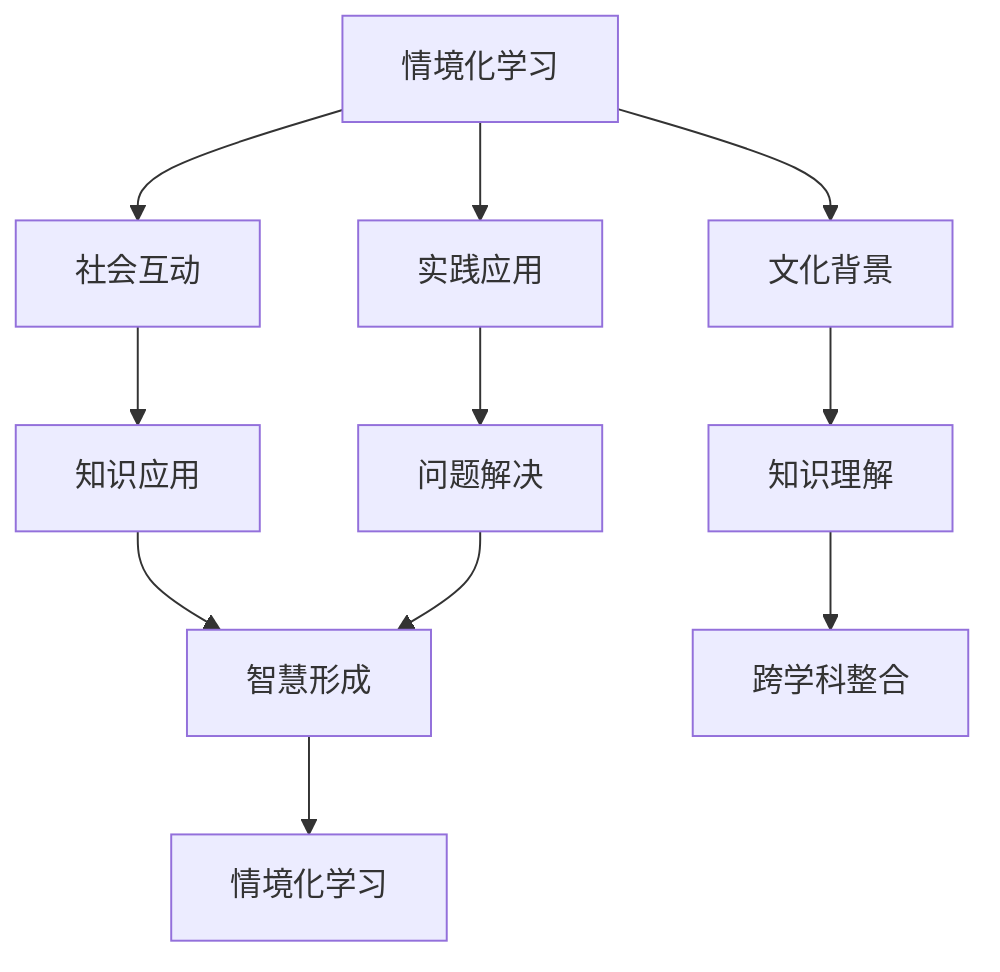

                 

### 文章标题

**《知识的情境化学习：实践中的智慧获取》**

> **关键词：** 情境化学习，智慧获取，知识应用，认知科学，实践方法论

**摘要：** 本文深入探讨了知识的情境化学习的重要性及其在实践中的智慧获取过程。通过结合认知科学的研究成果，本文提出了情境化学习的核心概念，并分析了其在实际应用场景中的效果。本文还提供了一系列实践中的智慧获取方法和案例分析，为教育工作者、研究人员和实践者提供了有益的参考。

### 1. 背景介绍（Background Introduction）

在当今信息爆炸的时代，知识的学习和获取变得越来越重要。传统的教育模式通常依赖于被动接受知识的方式，这种方式往往无法满足个体在不同情境下对知识的个性化需求。因此，情境化学习作为一种更贴近现实的学习方式，逐渐受到了广泛关注。

**情境化学习（Situated Learning）** 是一个认知科学的概念，强调知识的学习和应用必须在特定的情境中进行。情境化学习不仅涉及知识的学习，还包括技能的培养、问题解决能力的提升以及跨学科的整合。这种学习方式的核心在于将学习与实际生活和工作紧密联系起来，使知识在真实情境中得到验证和应用。

**智慧获取（Wisdom Acquisition）** 是一个更加抽象的概念，它不仅仅关注知识的获取，还强调对知识的深入理解、整合和创新。智慧获取不仅仅是在学习知识，更是在学习如何运用知识解决复杂问题，从而实现个人和社会的价值。

### 2. 核心概念与联系（Core Concepts and Connections）

#### 2.1 情境化学习（Situated Learning）

情境化学习是一个多维度的概念，涉及以下几个方面：

1. **社会互动（Social Interaction）**：学习是一个社会过程，个体通过与其他人的互动来获得知识和技能。这种互动可以是面对面的，也可以是通过网络进行的。
2. **文化背景（Cultural Context）**：不同的文化背景会影响知识的理解和应用。情境化学习强调文化在知识学习中的重要作用。
3. **实践应用（Practical Application）**：知识的学习和应用必须在实际情境中完成。这种情境可以是真实的工作环境，也可以是模拟的实验室环境。

#### 2.2 智慧获取（Wisdom Acquisition）

智慧获取是一个复杂的过程，涉及以下几个关键要素：

1. **知识的深入理解（Deep Understanding of Knowledge）**：智慧获取需要个体对知识的深入理解和掌握。
2. **跨学科的整合（Interdisciplinary Integration）**：智慧获取不仅仅是单一学科的知识积累，更强调跨学科的整合和创新。
3. **问题解决能力（Problem-Solving Ability）**：智慧获取强调个体在面对复杂问题时能够灵活运用知识，找到创新的解决方案。

#### 2.3 情境化学习与智慧获取的关系

情境化学习与智慧获取之间存在着密切的联系。情境化学习提供了一个实践平台，使个体能够在真实情境中验证和应用知识，从而促进智慧的形成。同时，智慧获取的过程反过来也推动了情境化学习的发展，因为个体在解决问题时需要不断更新和扩展自己的知识库。

#### 2.4 Mermaid 流程图



### 3. 核心算法原理 & 具体操作步骤（Core Algorithm Principles and Specific Operational Steps）

#### 3.1 情境化学习算法原理

情境化学习算法的核心在于构建一个支持情境化学习的环境。这个环境需要满足以下几个条件：

1. **真实性（Authenticity）**：环境应当尽可能接近真实情境，以便个体能够在其中进行真实的学习和应用。
2. **互动性（Interactivity）**：环境应当支持个体与其他人以及环境的互动，以促进知识的交流和共享。
3. **适应性（Adaptability）**：环境应当能够根据个体的学习需求和进度进行自适应调整。

#### 3.2 情境化学习具体操作步骤

1. **需求分析（Requirement Analysis）**：首先需要明确学习的目标和需求，包括知识点的选择、学习目标的设定以及评估标准。
2. **环境构建（Environment Construction）**：根据需求分析的结果，构建一个支持情境化学习的环境。这个环境可以是实体环境，也可以是虚拟环境。
3. **学习过程（Learning Process）**：个体在环境中进行学习，通过与他人的互动、实践应用以及知识验证来提升自己的知识和能力。
4. **评估与反馈（Evaluation and Feedback）**：通过评估个体在学习过程中的表现，提供反馈以指导后续的学习。

### 4. 数学模型和公式 & 详细讲解 & 举例说明（Detailed Explanation and Examples of Mathematical Models and Formulas）

#### 4.1 情境化学习模型

情境化学习模型可以用以下数学公式表示：

$$
L = f(S, I, P)
$$

其中：
- $L$ 代表情境化学习的质量；
- $S$ 代表社会互动的质量；
- $I$ 代表文化背景的影响；
- $P$ 代表实践应用的程度。

#### 4.2 智慧获取模型

智慧获取模型可以用以下数学公式表示：

$$
W = g(U, I, P)
$$

其中：
- $W$ 代表智慧水平；
- $U$ 代表知识的深入理解程度；
- $I$ 代表跨学科整合的能力；
- $P$ 代表问题解决的能力。

#### 4.3 举例说明

假设在一个实际项目中，需要通过情境化学习来提升团队的问题解决能力。根据上述模型，我们可以设定以下目标：

1. **社会互动（S）**：团队之间需要频繁的沟通和协作，以促进知识共享和问题解决。
2. **文化背景（I）**：团队需要理解和尊重不同的文化和工作方式，以促进跨学科的整合。
3. **实践应用（P）**：团队需要在实际项目中运用所学的知识，以验证和应用这些知识。

通过上述目标和模型的指导，团队可以制定相应的学习计划和评估方法，以不断提升情境化学习的效果。

### 5. 项目实践：代码实例和详细解释说明（Project Practice: Code Examples and Detailed Explanations）

#### 5.1 开发环境搭建

在开始项目实践之前，我们需要搭建一个支持情境化学习的开发环境。这个环境可以包括以下几个部分：

1. **知识库（Knowledge Base）**：用于存储各种知识点和相关的文献资料。
2. **互动平台（Interactive Platform）**：用于支持团队成员之间的沟通和协作。
3. **实践工具（Practical Tools）**：用于支持实践应用和知识验证。

#### 5.2 源代码详细实现

以下是一个简单的情境化学习项目示例，用于演示如何在一个团队中应用情境化学习模型。

```python
# 情境化学习项目示例

class KnowledgeBase:
    def __init__(self):
        self.knowledge = {}

    def add_knowledge(self, topic, content):
        self.knowledge[topic] = content

    def get_knowledge(self, topic):
        return self.knowledge.get(topic)

class InteractivePlatform:
    def __init__(self):
        self.messages = []

    def send_message(self, user, message):
        self.messages.append(f"{user}: {message}")

    def get_messages(self):
        return self.messages

class PracticalTool:
    def __init__(self):
        self.projects = []

    def add_project(self, project):
        self.projects.append(project)

    def get_projects(self):
        return self.projects

def main():
    knowledge_base = KnowledgeBase()
    interactive_platform = InteractivePlatform()
    practical_tool = PracticalTool()

    # 添加知识
    knowledge_base.add_knowledge("Python", "Python是一种高级编程语言。")
    knowledge_base.add_knowledge("Machine Learning", "机器学习是一种人工智能的分支。")

    # 发送消息
    interactive_platform.send_message("Alice", "我需要了解Python的基础知识。")
    interactive_platform.send_message("Bob", "我已经阅读了机器学习的相关文献。")

    # 添加项目
    practical_tool.add_project("数据分析项目")
    practical_tool.add_project("机器学习项目")

    # 获取知识、消息和项目
    print(knowledge_base.get_knowledge("Python"))
    print("\n互动平台消息：")
    for message in interactive_platform.get_messages():
        print(message)
    print("\n当前项目：")
    for project in practical_tool.get_projects():
        print(project)

if __name__ == "__main__":
    main()
```

#### 5.3 代码解读与分析

1. **知识库（KnowledgeBase）**：知识库是用于存储知识点的容器，可以添加和获取知识点。
2. **互动平台（InteractivePlatform）**：互动平台用于记录团队成员之间的交流信息。
3. **实践工具（PracticalTool）**：实践工具用于记录团队成员参与的项目信息。

通过这个简单的示例，我们可以看到如何在一个项目中应用情境化学习模型。知识库提供了知识点的存储和查询功能，互动平台记录了团队成员之间的沟通信息，实践工具记录了团队成员参与的项目信息。这些功能共同构成了一个支持情境化学习的开发环境。

### 6. 实际应用场景（Practical Application Scenarios）

#### 6.1 教育领域

在教育领域，情境化学习被广泛应用于各种课程和项目中。例如，在编程课程中，学生可以通过实际编写代码来解决实际问题，从而更好地理解编程概念。在社会科学课程中，学生可以通过模拟社会情境，如模拟联合国或商业谈判，来提高他们的沟通和协作能力。

#### 6.2 工作场所

在工作场所，情境化学习可以帮助员工更好地适应实际工作环境。例如，在新产品开发过程中，团队成员可以通过实际参与项目，从需求分析到产品发布，从而提升他们的专业技能和问题解决能力。在跨部门合作项目中，情境化学习可以帮助员工更好地理解不同部门的工作流程和需求，从而提高团队的整体效率。

#### 6.3 创新与创业

在创新和创业领域，情境化学习可以帮助创业者更好地理解市场需求和用户需求，从而提高新产品的成功率。例如，通过实际参与市场调研和用户访谈，创业者可以更深入地了解用户的需求和痛点，从而设计出更符合市场需求的产品。

### 7. 工具和资源推荐（Tools and Resources Recommendations）

#### 7.1 学习资源推荐

1. **书籍**：
   - "Situated Learning: legitimate peripheral participation" by Lave & Wenger
   - "Cultural Perspectives on Learning" by Pellegrini & Mahn
   - "The Practice of Programming" by Brian W. Kernighan and Rob Pike

2. **论文**：
   - "Situated Learning and Education: A Critique of Five Themes" by Lave & Wenger
   - "Cultural Contexts of Learning: An Overview of the Learning in Daily Life Project" by Lave & Wenger

3. **博客/网站**：
   - [Situated Learning](https://situatedlearning.com/)
   - [Cultural Perspectives on Learning](https://culturalperspectivesonlearning.com/)

#### 7.2 开发工具框架推荐

1. **知识库构建工具**：
   - [Elasticsearch](https://www.elastic.co/products/elasticsearch)
   - [Solr](https://lucene.apache.org/solr/guide/latest/index.html)

2. **互动平台构建工具**：
   - [Discord](https://discord.com/)
   - [Slack](https://slack.com/)

3. **实践工具构建工具**：
   - [Jenkins](https://www.jenkins.io/)
   - [Travis CI](https://travis-ci.com/)

#### 7.3 相关论文著作推荐

1. "Situated Learning: Legitimate Peripheral Participation" by Jean Lave & Etienne Wenger
2. "Cultural Models of Intelligence" by Daniel R. Heath
3. "The Practice of Knowledge Management" by Jack Park & Peter Simons

### 8. 总结：未来发展趋势与挑战（Summary: Future Development Trends and Challenges）

#### 8.1 发展趋势

1. **技术的进步**：随着人工智能、大数据等技术的不断发展，情境化学习将变得更加智能和高效。
2. **个性化学习**：情境化学习将更好地满足个体的个性化学习需求，促进个性化教育的发展。
3. **跨学科整合**：情境化学习将推动跨学科知识的整合，提高个体的综合素质和创新能力。

#### 8.2 挑战

1. **资源分配**：如何合理分配教育资源，确保所有个体都能获得高质量的情境化学习机会，是一个挑战。
2. **隐私保护**：在情境化学习中，如何保护个体的隐私和数据安全，也是一个重要的议题。
3. **教育公平**：如何确保情境化学习在不同地区、不同文化背景下的公平性，是一个需要深入思考的问题。

### 9. 附录：常见问题与解答（Appendix: Frequently Asked Questions and Answers）

#### 9.1 什么是情境化学习？

情境化学习是一种将学习与实际情境相结合的教育方法，强调知识的学习和应用必须在特定情境中进行。这种学习方式有助于提升个体的实践能力和问题解决能力。

#### 9.2 情境化学习与智慧获取有什么关系？

情境化学习提供了一个实践平台，使个体能够在真实情境中验证和应用知识，从而促进智慧的形成。智慧获取的过程反过来也推动了情境化学习的发展，因为个体在解决问题时需要不断更新和扩展自己的知识库。

#### 9.3 如何实施情境化学习？

实施情境化学习需要构建一个支持情境化学习的环境，包括知识库、互动平台和实践工具。同时，需要明确学习的目标和需求，通过互动、实践和应用来提升个体的知识和能力。

### 10. 扩展阅读 & 参考资料（Extended Reading & Reference Materials）

1. Lave, J., & Wenger, E. (1991). **Situated Learning: Legitimate Peripheral Participation**. Cambridge University Press.
2. Pellegrini, A. D. (1991). **Cultural Perspectives on Learning**. In J. A. Whiting (Ed.), **Learning Through Interaction: A Reader** (pp. 119-142). University of Chicago Press.
3. Kernighan, B. W., & Pike, R. (1974). **The Practice of Programming**. Addison-Wesley.
4. Heath, D. R. (1997). **Cultural Models of Intelligence**. In M. H. Meyer (Ed.), **Intelligence and Cultural Contexts** (pp. 45-70). American Psychological Association.
5. Park, J., & Simons, P. (2010). **The Practice of Knowledge Management**. Springer.

通过上述扩展阅读，读者可以进一步深入了解情境化学习和智慧获取的理论和实践。作者：禅与计算机程序设计艺术 / Zen and the Art of Computer Programming。

