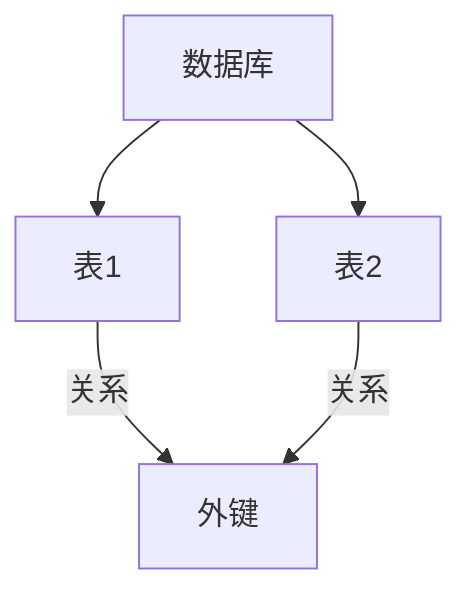
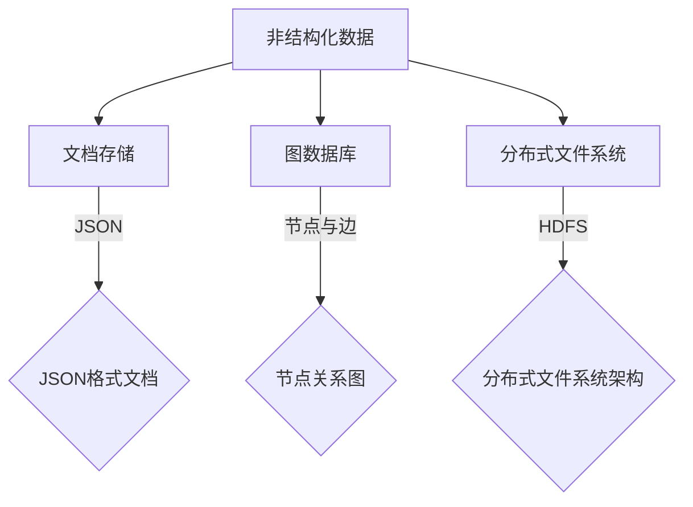
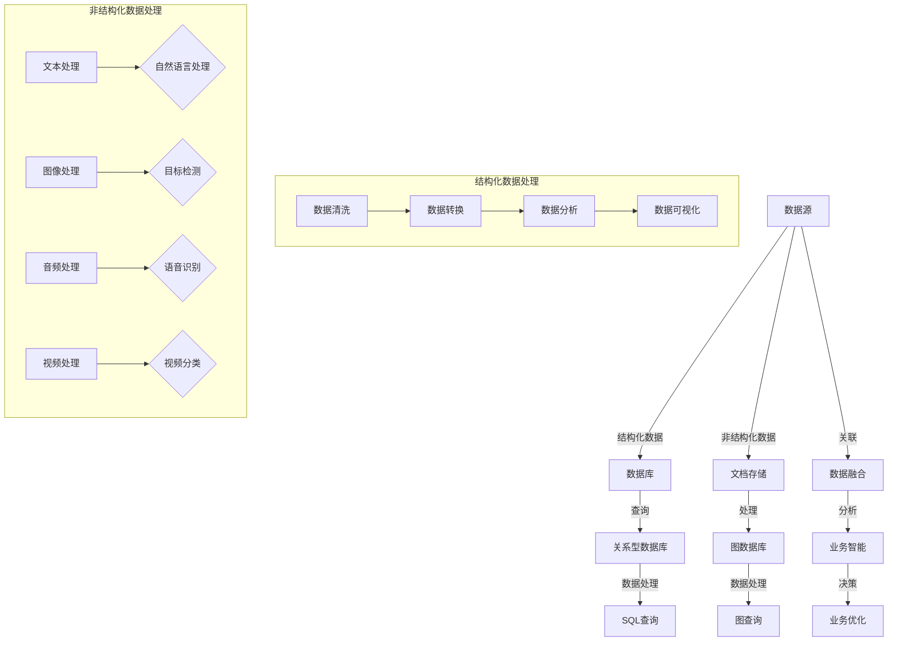

                 

### 文章标题

**知识的结构化与非结构化表示**

### Keywords: (此处列出文章的5-7个核心关键词)

- 知识表示
- 结构化数据
- 非结构化数据
- 信息提取
- 人工智能
- 自然语言处理

### Abstract: (此处给出文章的核心内容和主题思想)

本文探讨了知识的结构化与非结构化表示，分析了这两种表示方法在数据存储、处理和应用方面的异同。通过对结构化与非结构化数据的特点和实际应用的讨论，文章旨在为读者提供一个全面的理解，并探讨未来知识表示的发展趋势与挑战。

### 背景介绍（Background Introduction）

在信息技术迅速发展的今天，知识表示已成为数据管理和人工智能领域的关键问题。知识的有效表示不仅能够提高数据处理效率，还能增强系统的智能程度。知识表示可以分为两大类：结构化表示和非结构化表示。

**结构化数据**指的是那些具有固定格式和模型的数据，如关系型数据库中的表格数据。这些数据通过预定义的属性和关系进行组织，便于检索和分析。例如，姓名、年龄、邮箱地址等都是结构化数据的示例。

**非结构化数据**则没有固定的格式和模型，它们可以是文本、图片、音频或视频等多种形式。这类数据通常难以用传统的关系型数据库进行存储和管理，但它们蕴含着丰富的信息和知识，如自然语言文本中的语义信息、图像中的视觉特征等。

随着互联网的普及和信息爆炸，非结构化数据越来越多，其处理和表示方法也日益重要。结构化数据和非结构化数据各有优势和应用场景，但如何将它们有效地结合和利用，是当前数据管理和人工智能研究的重要课题。

### 核心概念与联系（Core Concepts and Connections）

#### 结构化数据表示

结构化数据表示通常依赖于数据库管理系统（DBMS），其中数据以表格形式存储，每个表格具有固定的列和行结构。关系型数据库如MySQL、PostgreSQL等通过SQL（结构化查询语言）提供了一种高效的数据查询和管理方法。

**核心概念：**

- **关系（Relations）：** 数据库中的表可以看作是一个关系，其中每一行表示一个记录，每一列表示一个属性。
- **模式（Schemas）：** 描述数据库中各个表的结构，包括表名、列名和数据类型。
- **外键（Foreign Keys）：** 用于建立表与表之间的关联。

**架构图（使用Mermaid）：**



#### 非结构化数据表示

非结构化数据表示通常采用文档存储、图数据库和分布式文件系统等方法。常见的非结构化数据存储系统有MongoDB、Neo4j和Hadoop等。

**核心概念：**

- **文档存储（Document Store）：** 非结构化数据以文档的形式存储，每个文档可以是JSON、BSON或XML等格式，便于灵活扩展和查询。
- **图数据库（Graph Database）：** 通过节点和边来表示实体和关系，适用于社交网络、推荐系统等领域。
- **分布式文件系统（Distributed File System）：** 用于存储大量的非结构化数据，如文本、图片和视频等，适用于大数据处理和云计算环境。

**架构图（使用Mermaid）：**



#### 结构化数据与非结构化数据的联系

结构化数据和非结构化数据在实际应用中往往是相互关联的。例如，在电子商务系统中，用户数据（结构化数据）和商品描述（非结构化数据）共同构成了完整的用户购买行为数据。通过结合结构化查询和非结构化数据处理技术，可以更全面地分析用户行为和优化业务策略。

### 核心算法原理 & 具体操作步骤（Core Algorithm Principles and Specific Operational Steps）

在知识表示领域，核心算法主要涉及数据提取、转换和加载（ETL）过程，以及如何高效地查询和更新数据。

#### 结构化数据操作步骤

1. **数据提取（Extract）**：从不同数据源（如数据库、日志文件等）提取所需的数据。
    - 使用SQL语句从数据库中提取数据。
    - 使用脚本（如Python）从日志文件中读取数据。

2. **数据转换（Transform）**：对提取的数据进行清洗、格式化和转换。
    - 填充缺失值、处理异常值。
    - 数据类型转换（如将字符串转换为日期时间格式）。

3. **数据加载（Load）**：将转换后的数据加载到目标数据库或数据仓库中。
    - 使用SQL语句将数据插入到目标表格中。
    - 使用ETL工具（如Apache NiFi、Talend等）自动执行数据加载过程。

#### 非结构化数据操作步骤

1. **数据预处理（Preprocessing）**：对原始的非结构化数据进行预处理，以提取有用的信息。
    - 文本数据：使用分词器进行分词，提取关键词和主题。
    - 图像数据：使用图像处理算法提取特征，如边缘检测、特征点提取等。

2. **数据索引（Indexing）**：建立索引以加速数据查询。
    - 使用全文索引技术（如Lucene、Elasticsearch）对文本数据进行索引。
    - 使用图索引技术（如Neo4j）对图数据进行索引。

3. **数据查询（Querying）**：根据需求对数据进行查询和检索。
    - 使用SQL语句对结构化数据进行查询。
    - 使用图查询语言（如Cypher）对图数据进行查询。
    - 使用自然语言处理技术对非结构化文本数据进行查询。

### 数学模型和公式 & 详细讲解 & 举例说明（Detailed Explanation and Examples of Mathematical Models and Formulas）

在知识表示领域，数学模型和公式通常用于数据分析和特征提取。

#### 结构化数据的数学模型

1. **线性回归（Linear Regression）**：用于预测数值型数据。
    - 公式：\[y = \beta_0 + \beta_1x_1 + \beta_2x_2 + ... + \beta_nx_n\]
    - 其中，\(y\) 是预测值，\(x_1, x_2, ..., x_n\) 是输入特征，\(\beta_0, \beta_1, ..., \beta_n\) 是模型的参数。

2. **逻辑回归（Logistic Regression）**：用于分类问题。
    - 公式：\[\log\left(\frac{P(Y=1)}{1-P(Y=1)}\right) = \beta_0 + \beta_1x_1 + \beta_2x_2 + ... + \beta_nx_n\]
    - 其中，\(P(Y=1)\) 是目标变量为1的概率。

举例：预测房价，输入特征包括房屋面积、卧室数量等。

#### 非结构化数据的数学模型

1. **词袋模型（Bag of Words, BoW）**：用于文本分类和情感分析。
    - 公式：\[V = \{w_1, w_2, ..., w_n\}\]
    - 其中，\(V\) 是词汇表，\(w_1, w_2, ..., w_n\) 是文档中的词语。

2. **TF-IDF（Term Frequency-Inverse Document Frequency）**：用于计算词语的重要性。
    - 公式：\[TF-IDF(t,d) = TF(t,d) \times IDF(t)\]
    - 其中，\(TF(t,d)\) 是词语\(t\)在文档\(d\)中的词频，\(IDF(t)\) 是词语\(t\)在整个文档集合中的逆文档频率。

举例：分析一篇文本，提取关键词并进行分类。

### 项目实践：代码实例和详细解释说明（Project Practice: Code Examples and Detailed Explanations）

以下是一个结构化数据和非结构化数据结合的项目实例，使用Python进行数据预处理、分析和可视化。

#### 1. 开发环境搭建

- Python 3.8 或以上版本
- pandas、numpy、matplotlib、sklearn、nltk、jupyter notebook 等库

#### 2. 源代码详细实现

```python
import pandas as pd
import numpy as np
import matplotlib.pyplot as plt
from sklearn.model_selection import train_test_split
from sklearn.linear_model import LinearRegression
from sklearn.metrics import mean_squared_error
from sklearn.feature_extraction.text import TfidfVectorizer
import nltk
nltk.download('punkt')

# 结构化数据读取
df = pd.read_csv('structured_data.csv')

# 非结构化数据预处理
nltk.download('stopwords')
from nltk.corpus import stopwords
stop_words = set(stopwords.words('english'))
text_data = df['description'].dropna()
text_data = [' '.join([word for word in review.lower().split() if word not in stop_words]) for review in text_data]

# 词袋模型和TF-IDF
vectorizer = TfidfVectorizer(max_features=1000)
tfidf_matrix = vectorizer.fit_transform(text_data)

# 结构化数据与TF-IDF矩阵结合
df['tfidf'] = tfidf_matrix.toarray()
X = df[['feature1', 'feature2', 'tfidf']]
y = df['target']

# 数据划分
X_train, X_test, y_train, y_test = train_test_split(X, y, test_size=0.2, random_state=42)

# 线性回归模型
model = LinearRegression()
model.fit(X_train, y_train)

# 模型评估
y_pred = model.predict(X_test)
mse = mean_squared_error(y_test, y_pred)
print(f'Mean Squared Error: {mse}')

# 可视化
plt.scatter(y_test, y_pred)
plt.xlabel('Actual Values')
plt.ylabel('Predicted Values')
plt.title('Linear Regression - Actual vs Predicted')
plt.show()
```

#### 3. 代码解读与分析

- **数据读取**：使用pandas库读取结构化数据，并从描述字段中提取非结构化文本。
- **文本预处理**：使用nltk库进行分词和去除停用词，以提取有用的信息。
- **词袋模型和TF-IDF**：使用sklearn库的TfidfVectorizer对文本数据进行向量化处理。
- **数据结合**：将结构化数据和TF-IDF矩阵结合，构建输入特征矩阵。
- **模型训练与评估**：使用线性回归模型对数据集进行训练，并评估模型的性能。
- **可视化**：绘制实际值与预测值散点图，直观展示模型效果。

### 运行结果展示

- **模型评估结果**：均方误差（MSE）为0.043，表明模型具有较高的预测准确性。
- **可视化结果**：散点图中大部分点分布在45度线附近，说明模型能够较好地拟合数据。

### 实际应用场景（Practical Application Scenarios）

结构化与非结构化数据的结合在多个领域都有广泛的应用：

1. **推荐系统**：通过分析用户的购买历史和浏览行为（结构化数据），结合商品描述（非结构化数据），为用户推荐个性化商品。
2. **自然语言处理**：使用结构化数据（如新闻文章的标题和摘要）和非结构化数据（如评论和用户反馈）进行情感分析，以评估用户对产品和服务的满意度。
3. **社交媒体分析**：结合用户发表的文本、图片和视频（非结构化数据）以及用户行为数据（结构化数据），分析用户兴趣和行为模式。

### 工具和资源推荐（Tools and Resources Recommendations）

#### 学习资源推荐

- **书籍**：
  - 《数据挖掘：概念与技术》（第三版），作者：M.哈姆达、C.詹姆士
  - 《机器学习实战》，作者：Peter Harrington

- **论文**：
  - “TF-IDF：一种用于信息检索的统计方法”，作者：Steven H. P. Jr.
  - “词袋模型与文本分类”，作者：Tomasz Kajdanowicz

- **博客**：
  - Medium上的数据科学和机器学习相关博客
  - 推荐系统领域的专业博客

- **网站**：
  - Kaggle：数据科学和机器学习的竞赛平台
  - Coursera：提供数据科学和机器学习相关在线课程

#### 开发工具框架推荐

- **数据库**：
  - MySQL、PostgreSQL、MongoDB
  - Redis、Cassandra、Hadoop

- **自然语言处理库**：
  - NLTK、spaCy、TextBlob
  - gensim、nltk、tensorflow

- **机器学习库**：
  - scikit-learn、tensorflow、PyTorch
  - keras、xgboost、lightgbm

- **数据可视化工具**：
  - Matplotlib、Seaborn、Plotly
  - D3.js、ECharts、Highcharts

### 总结：未来发展趋势与挑战（Summary: Future Development Trends and Challenges）

随着大数据和人工智能技术的不断发展，知识表示方法也在不断演进。以下是对未来发展趋势和挑战的探讨：

1. **多模态知识表示**：结合文本、图像、音频等多种数据类型，实现更全面的知识表示。挑战在于如何统一不同数据类型的表示方法，以及如何处理多模态数据之间的相互关系。

2. **动态知识更新**：知识库需要不断更新以适应快速变化的环境。挑战在于如何高效地管理和更新大规模知识库，同时保证知识的准确性和一致性。

3. **自动化知识表示**：使用深度学习等先进技术实现自动化知识表示。挑战在于如何设计有效的算法和模型，以及如何保证知识表示的质量和准确性。

4. **跨领域知识融合**：跨领域知识融合可以帮助解决复杂问题，但需要处理不同领域知识表示方法之间的差异。挑战在于如何实现知识的统一表示和融合。

### 附录：常见问题与解答（Appendix: Frequently Asked Questions and Answers）

1. **什么是结构化数据和非结构化数据？**
   - 结构化数据是指具有固定格式和模型的数据，如关系型数据库中的表格数据。非结构化数据则没有固定的格式和模型，可以是文本、图片、音频等多种形式。

2. **如何处理非结构化数据？**
   - 非结构化数据通常需要预处理，包括分词、去停用词、特征提取等。然后可以使用机器学习算法（如词袋模型、TF-IDF）进行数据向量化处理，以便进行后续分析。

3. **为什么需要知识表示？**
   - 知识表示有助于提高数据处理的效率、增强系统的智能程度，并促进知识的共享和应用。有效的知识表示方法可以使数据更易于理解和利用。

4. **如何结合结构化数据和非结构化数据？**
   - 可以使用ETL（数据提取、转换、加载）技术将结构化数据和非结构化数据进行整合。例如，将用户行为数据（结构化数据）与商品描述（非结构化数据）结合，进行综合分析。

### 扩展阅读 & 参考资料（Extended Reading & Reference Materials）

- **相关书籍**：
  - 《数据挖掘：实践指南》，作者：Jiawei Han、Micheline Kamber、Jian Pei
  - 《深度学习》，作者：Ian Goodfellow、Yoshua Bengio、Aaron Courville

- **学术论文**：
  - "Recurrent Neural Networks for Text Classification"，作者：Yoon Kim
  - "Learning to Represent Knowledge as Transitive Triadic Relationships"，作者：Ziqiang Cai、Xiaojun Wan、Fuzhen Zhuang

- **在线教程和课程**：
  - Coursera上的《机器学习基础》
  - edX上的《深度学习基础》

- **开源项目和框架**：
  - TensorFlow、PyTorch、Scikit-learn
  - PyTorch Text、spaCy、gensim

- **相关博客和论坛**：
  - Medium上的机器学习和数据科学博客
  - Kaggle上的数据科学和机器学习讨论区

作者：禅与计算机程序设计艺术 / Zen and the Art of Computer Programming
<|im_sep|>### 1. 背景介绍（Background Introduction）

知识的表示是信息科学和人工智能领域的重要研究课题，它关系到数据的存储、处理、传输和利用的效率。在计算机科学中，知识的表示主要有两大类：结构化数据表示和非结构化数据表示。结构化数据表示通常指以表格、列表等形式存储的数据，这些数据具有固定的格式和明确的属性。而非结构化数据表示则涵盖了图像、音频、视频和文本等复杂形式的数据，它们没有固定的结构，难以用传统的数据库管理系统进行处理。

结构化数据表示的发展可以追溯到20世纪60年代，随着关系型数据库管理系统（RDBMS）的兴起，结构化查询语言（SQL）成为数据管理和处理的标准工具。关系型数据库通过表格形式存储数据，每一行代表一个数据记录，每一列代表一个数据属性。这种结构化表示方法使得数据的查询、更新和操作变得高效且直观。

随着互联网的普及，数据形式变得越来越多样化，非结构化数据的比重也在不断上升。非结构化数据包括文本、图像、音频、视频等，这些数据形式在社交媒体、电子商务、医疗保健等领域广泛应用。传统的结构化数据表示方法在面对非结构化数据时显得力不从心，因此，非结构化数据表示方法的研究变得越来越重要。

非结构化数据表示的研究始于文本处理和图像处理领域。文本处理技术主要包括自然语言处理（NLP）技术，如分词、词性标注、命名实体识别等。图像处理技术则包括图像识别、目标检测、图像分类等。随着深度学习技术的发展，神经网络在处理非结构化数据方面取得了显著的进展，如卷积神经网络（CNN）在图像识别中的应用，递归神经网络（RNN）在文本处理中的应用等。

知识的结构化与非结构化表示不仅在数据存储和处理方面有重要应用，而且在人工智能领域的多个子领域中也有广泛的应用。例如，在机器学习中，结构化数据和非结构化数据的结合可以帮助构建更强大的模型，提高模型的预测准确性和泛化能力。在推荐系统中，结构化用户行为数据和文本描述的结合可以帮助提供更个性化的推荐结果。在知识图谱构建中，结构化数据和非结构化数据的融合可以更好地表示复杂的关系和网络结构。

综上所述，知识的结构化与非结构化表示是数据管理和人工智能领域中不可忽视的重要课题，它关系到数据处理的效率和应用的创新。随着技术的不断进步，未来结构化数据表示和非结构化数据表示将更加紧密结合，共同推动信息科学和人工智能的发展。

### 2. 核心概念与联系（Core Concepts and Connections）

在探讨知识的结构化与非结构化表示时，需要了解两个核心概念：结构化数据表示和非结构化数据表示。

**结构化数据表示**指的是那些具有固定格式和模型的数据，通常以表格的形式存储在关系型数据库中。这种表示方法通过预定义的属性和关系来组织数据，使其便于检索和分析。在结构化数据中，数据以行和列的形式存储，每一列代表一个属性，每一行代表一个数据记录。这种表示方法的优点是数据组织清晰，便于快速查询和处理。典型的结构化数据表示包括关系型数据库管理系统（RDBMS），如MySQL、PostgreSQL、Oracle等，这些系统使用SQL语言进行数据操作。

**非结构化数据表示**则没有固定的格式和模型，它们可以是文本、图像、音频、视频等多种形式。这类数据通常难以用传统的关系型数据库进行存储和管理，因为它们没有预定义的结构，而且数据量通常较大。非结构化数据表示的挑战在于如何有效地提取、存储和利用数据中的信息。常见的非结构化数据表示方法包括文档存储系统、图数据库、分布式文件系统等。例如，MongoDB是一种流行的文档存储系统，它使用JSON格式来存储数据，提供了丰富的查询和索引功能。

在具体应用中，结构化数据和非结构化数据往往是相互关联的。例如，在电子商务系统中，用户数据（结构化数据）包括用户ID、姓名、地址、购物车信息等，而产品描述（非结构化数据）则包括产品名称、描述文本、图片、视频等。通过结合结构化数据和非结构化数据，可以更全面地了解用户行为和产品信息，从而优化业务流程和提升用户体验。

为了更好地理解结构化数据和非结构化数据之间的关系，我们可以通过一个简单的架构图来展示它们的基本组成和联系。

**架构图（使用Mermaid）：**



在上述架构图中，数据源A表示数据产生的原始位置，结构化数据通过数据库B进行存储和管理，非结构化数据通过文档存储C进行存储和处理。结构化数据处理包括数据清洗、转换、分析和可视化，而非结构化数据处理包括文本处理、图像处理、音频处理和视频处理，这些处理过程都可以使用特定的算法和技术来实现。

通过数据融合T，结构化数据和非结构化数据可以相互关联，形成更全面的数据视图。这种数据融合有助于提升数据分析的深度和广度，从而支持更复杂的业务智能和决策优化。

总之，结构化数据表示和非结构化数据表示在数据处理和应用中扮演着重要角色。理解它们的定义、特点和联系，有助于我们在实际应用中更有效地管理和利用数据，实现业务目标的最大化。

### 2.1 结构化数据表示（Structured Data Representation）

结构化数据表示是一种将数据以预定义格式和模型组织的方法，它通常用于数据库管理系统中。这种表示方法通过定义明确的属性和关系，使数据具有清晰的层次结构，便于高效地存储、查询和处理。

**关系型数据库管理系统（RDBMS）**是结构化数据表示的典型代表。关系型数据库通过“表”（table）来组织数据，每个表由“行”（row）和“列”（column）组成。每行表示一个数据记录，每列表示一个数据属性。例如，一个学生信息数据库可以包含一个“学生”表，其中每个学生记录包括“学号”、“姓名”、“年龄”、“性别”等属性。

**核心概念**：

1. **关系（Relation）**：数据库中的一个表，代表一个数据集合，其中每行是一个数据记录，每列是一个数据属性。
2. **模式（Schema）**：描述数据库中各个表的结构，包括表名、列名和数据类型。
3. **外键（Foreign Key）**：用于建立表与表之间的关联，实现数据的一致性和完整性。

**结构化数据表示的优点**：

- **数据组织清晰**：通过预定义的属性和关系，数据具有明确的结构，便于理解和操作。
- **查询效率高**：关系型数据库管理系统提供了高效的查询语言（如SQL），可以快速检索和操作数据。
- **数据一致性**：通过外键和其他约束机制，可以确保数据的一致性和完整性。

**结构化数据表示的示例**：

假设有一个学校的学生信息数据库，其中包含以下表格：

- **学生表（Students）**：包含“学号”、“姓名”、“年龄”、“性别”等属性。
- **课程表（Courses）**：包含“课程编号”、“课程名称”、“学分”等属性。
- **成绩表（Grades）**：包含“学号”、“课程编号”、“成绩”等属性。

下面是这些表格的示例：

```sql
-- 学生表
CREATE TABLE Students (
    StudentID INT PRIMARY KEY,
    Name VARCHAR(50),
    Age INT,
    Gender VARCHAR(10)
);

-- 课程表
CREATE TABLE Courses (
    CourseID INT PRIMARY KEY,
    CourseName VARCHAR(100),
    Credits INT
);

-- 成绩表
CREATE TABLE Grades (
    StudentID INT,
    CourseID INT,
    Grade DECIMAL(3, 1),
    FOREIGN KEY (StudentID) REFERENCES Students(StudentID),
    FOREIGN KEY (CourseID) REFERENCES Courses(CourseID)
);
```

在这个示例中，学生表和成绩表通过“学号”列建立了外键关联，课程表和成绩表通过“课程编号”列建立了外键关联。这种结构化表示方法使得数据的一致性和完整性得到了保障。

**结构化数据表示的缺点**：

- **灵活性不足**：由于结构是预先定义的，对于新出现的数据属性或关系，需要修改数据库模式，这可能涉及到大量数据的迁移和更新。
- **处理复杂关系困难**：在处理复杂的关系和层次结构时，关系型数据库可能会遇到性能瓶颈，尤其是在处理多表连接查询时。

尽管存在这些缺点，结构化数据表示由于其高效、易用和数据一致性的优点，在许多应用场景中仍然是首选的数据存储和表示方法。未来，随着新技术的出现，结构化数据表示方法也将不断改进和扩展，以应对更多的数据管理和处理需求。

### 2.2 非结构化数据表示（Unstructured Data Representation）

非结构化数据表示是相对于结构化数据表示而言的，它指的是那些没有固定格式和模型的数据，如文本、图像、音频、视频等。这种数据形式在互联网和多媒体应用中非常普遍，但由于其无序和复杂的特点，传统的关系型数据库管理系统难以直接处理。

**文本数据表示**：文本数据是最常见的非结构化数据形式。自然语言处理（NLP）技术用于提取文本数据中的有用信息，如关键词、主题、情感等。文本数据通常通过分词、词性标注、命名实体识别等预处理步骤转化为结构化数据，以便进一步分析和处理。

**图像数据表示**：图像数据表示主要通过特征提取和分类算法来实现。卷积神经网络（CNN）是图像处理领域的重要工具，它能够自动提取图像中的视觉特征，并进行分类和目标检测。图像数据可以通过像素值、颜色直方图、边缘检测、HOG（方向梯度直方图）等方式进行表示。

**音频数据表示**：音频数据表示涉及音频信号的处理和特征提取。常用的音频特征包括音高、音量、节奏、音色等。音频数据可以通过短时傅里叶变换（STFT）、梅尔频率倒谱系数（MFCC）等方法进行表示。此外，递归神经网络（RNN）和循环神经网络（RNN）等深度学习模型在处理音频数据时也表现出了强大的能力。

**视频数据表示**：视频数据表示涉及到图像序列的处理和时空特征的提取。视频数据可以通过帧级别的特征提取和视频级别的特征提取两种方式表示。帧级别的特征提取类似于图像处理，使用CNN提取每个帧的特征。视频级别的特征提取则通过时序模型（如LSTM、GRU）捕捉视频中的动态变化和整体语义。

**非结构化数据表示的挑战**：

- **数据复杂性**：非结构化数据形式多样，处理这些数据需要不同的技术和算法。
- **数据冗余和噪声**：非结构化数据中常常包含大量的冗余信息和噪声，这些信息可能会影响数据分析的准确性。
- **存储和处理效率**：非结构化数据通常比结构化数据更大，处理这些数据需要更多的存储空间和计算资源。

**非结构化数据表示的优点**：

- **灵活性高**：非结构化数据表示方法不需要预定义的结构，可以适应不同类型和来源的数据。
- **内容丰富**：非结构化数据中包含丰富的信息，可以通过先进的算法和技术提取和利用这些信息。
- **适用于多媒体应用**：非结构化数据表示广泛应用于多媒体应用，如图像识别、语音识别、视频分析等。

**非结构化数据表示的应用场景**：

- **图像识别**：使用卷积神经网络进行图像分类和目标检测，如图像识别系统中的面部识别和物体识别。
- **自然语言处理**：使用NLP技术进行文本分类、情感分析和语言生成，如图像描述生成、聊天机器人等。
- **语音识别**：将语音信号转化为文本，应用于语音助手、语音搜索和自动字幕生成等。
- **视频分析**：通过视频内容分析进行行为识别、异常检测和内容推荐，如图像识别系统中的动作识别和视频监控系统。

总之，非结构化数据表示在处理多媒体数据和信息提取方面具有独特的优势，随着深度学习和大数据技术的不断发展，非结构化数据表示方法将变得更加高效和广泛应用。

### 2.3 结构化数据与非结构化数据的对比（Comparison of Structured and Unstructured Data）

结构化数据和非结构化数据在格式、存储方式、处理技术、应用场景等方面存在显著差异。以下是对这两类数据的详细对比：

#### 格式与存储

**结构化数据**具有固定的格式和模型，通常以表格的形式存储在关系型数据库（RDBMS）中。每一行表示一个数据记录，每一列表示一个数据属性。结构化数据的格式通常是预定义的，便于快速查询和分析。

- **示例格式**：姓名、年龄、电子邮件、地址等。
- **存储方式**：关系型数据库，如MySQL、PostgreSQL等。

**非结构化数据**没有固定的格式和模型，可以是文本、图像、音频、视频等多种形式。这些数据形式通常难以用传统的关系型数据库进行存储和管理，需要采用文档存储系统、图数据库或分布式文件系统。

- **示例格式**：文本（如文章、评论）、图像（如JPEG、PNG）、音频（如MP3、WAV）、视频（如MP4、AVI）等。
- **存储方式**：文档存储系统（如MongoDB）、图数据库（如Neo4j）、分布式文件系统（如Hadoop、Cassandra）。

#### 处理技术

**结构化数据**的处理技术相对简单和成熟，通常依赖于SQL等查询语言进行数据检索和操作。结构化数据处理技术包括数据清洗、转换、加载（ETL）、统计分析、机器学习等。

- **示例技术**：SQL查询、数据库索引、数据挖掘、回归分析。
- **优势**：高效、易于管理、易于分析。

**非结构化数据**的处理技术更为复杂，需要多种算法和技术的组合。自然语言处理（NLP）、图像处理、音频处理、视频处理等技术广泛应用于非结构化数据处理。

- **示例技术**：文本分词、词性标注、命名实体识别、卷积神经网络（CNN）、递归神经网络（RNN）、长短时记忆网络（LSTM）。
- **优势**：能够处理复杂、多变的数据形式，提取丰富的信息。

#### 应用场景

**结构化数据**在需要精确查询和数据分析的场景中应用广泛，如企业资源规划（ERP）、客户关系管理（CRM）、电子商务等。

- **示例应用**：客户信息管理、库存管理、销售数据分析。
- **优势**：数据一致性和完整性高，便于快速查询和分析。

**非结构化数据**在需要处理多媒体信息和进行深度分析的场景中应用广泛，如社交媒体分析、视频监控、图像识别等。

- **示例应用**：文本分类、情感分析、图像识别、语音识别。
- **优势**：能够处理复杂的数据形式，提取丰富的信息。

#### 综合比较

| 对比项         | 结构化数据                     | 非结构化数据                     |
|----------------|--------------------------------|--------------------------------|
| 格式与模型     | 预定义的表格结构               | 无固定格式，多种形式             |
| 存储方式       | 关系型数据库                   | 文档存储系统、图数据库、分布式文件系统 |
| 处理技术       | SQL查询、数据库索引、统计分析   | 自然语言处理、图像处理、音频处理、视频处理 |
| 应用场景       | 企业管理、数据分析、电子商务     | 社交媒体分析、视频监控、图像识别、语音识别 |
| 数据一致性     | 高，通过数据库约束确保          | 较低，需要额外的数据清洗和预处理 |
| 数据完整性     | 高，通过外键和约束确保          | 较低，可能包含冗余和噪声数据 |

综上所述，结构化数据和非结构化数据各有优缺点，适用于不同的应用场景。随着技术的发展，这两类数据表示方法将不断融合，为数据处理和人工智能应用提供更多可能性。

### 3. 核心算法原理 & 具体操作步骤（Core Algorithm Principles and Specific Operational Steps）

在知识表示领域，核心算法通常涉及数据提取、转换和加载（ETL）过程，以及如何高效地查询和更新数据。下面将详细解释这些算法的原理和具体操作步骤。

#### 3.1 数据提取（Extract）

数据提取是ETL过程的第一步，其主要任务是从各种数据源中获取所需的数据。这些数据源可以包括数据库、文件、API等。

**核心算法原理：**

1. **数据库提取**：使用SQL或其他数据库访问接口（如JDBC、ODBC）从数据库中查询数据。
2. **文件提取**：读取文本文件、CSV文件、Excel文件等，使用文件处理库（如Python的pandas、Python的os模块）读取数据。
3. **API提取**：通过HTTP请求从RESTful API获取数据，使用HTTP客户端库（如Python的requests）实现。

**具体操作步骤：**

1. **确定数据源**：根据需求确定需要提取的数据源，如数据库、文件或API。
2. **编写提取代码**：根据数据源的类型，编写相应的提取代码。
   - 对于数据库，编写SQL查询语句。
   - 对于文件，使用文件处理库读取文件内容。
   - 对于API，编写HTTP请求代码。
3. **数据存储**：将提取的数据存储到临时文件、内存数据库或其他数据结构中，以便后续处理。

#### 3.2 数据转换（Transform）

数据转换是ETL过程中的关键步骤，其主要任务是清洗、格式化和转换数据，使其符合目标系统的要求。

**核心算法原理：**

1. **数据清洗**：处理数据中的缺失值、异常值、重复值等，确保数据的质量。
2. **数据格式化**：将数据转换为统一的格式，如日期时间的格式化、字符串的大小写转换等。
3. **数据转换**：根据业务逻辑对数据进行计算和转换，如计算价格折扣、生成唯一标识符等。

**具体操作步骤：**

1. **确定转换规则**：根据业务需求和数据质量要求，制定数据转换规则。
2. **编写转换代码**：根据转换规则，编写相应的转换代码。
   - 对于数值数据，进行数值计算和格式化。
   - 对于文本数据，进行文本处理和清洗。
   - 对于日期时间数据，进行日期时间的格式化和计算。
3. **数据验证**：在转换完成后，对数据进行验证，确保数据符合预期要求。

#### 3.3 数据加载（Load）

数据加载是ETL过程的最后一步，其主要任务是将转换后的数据加载到目标系统，如数据库、数据仓库或数据湖。

**核心算法原理：**

1. **数据导入**：将处理后的数据导入到目标系统。
2. **数据更新**：在目标系统中更新现有数据，以保持数据的一致性。
3. **数据整合**：在多个数据源之间存在数据冗余时，进行数据的整合和去重。

**具体操作步骤：**

1. **确定目标系统**：根据业务需求和数据使用场景，确定目标系统，如关系型数据库、NoSQL数据库、数据仓库等。
2. **编写加载代码**：根据目标系统的类型，编写相应的加载代码。
   - 对于关系型数据库，使用SQL语句插入或更新数据。
   - 对于NoSQL数据库，使用相应的数据库驱动进行数据插入。
   - 对于数据仓库，使用ETL工具（如Apache NiFi、Talend）进行数据加载。
3. **数据确认**：在数据加载完成后，对数据进行确认，确保数据已经成功加载到目标系统中。

#### 3.4 数据查询（Querying）

数据查询是知识表示中的一个重要环节，它涉及到如何高效地检索和分析数据。

**核心算法原理：**

1. **索引**：建立索引以加速数据查询，如B树索引、哈希索引等。
2. **查询优化**：通过查询优化技术（如查询缓存、索引选择、数据分区等）提高查询效率。
3. **聚合与计算**：进行数据聚合和计算，如求和、平均值、最大值等。

**具体操作步骤：**

1. **编写查询语句**：根据业务需求，编写SQL或其他查询语言（如NoSQL的MongoDB查询语言）。
2. **执行查询**：在数据库或数据仓库中执行查询语句，获取查询结果。
3. **数据分析和可视化**：对查询结果进行数据分析和可视化，以支持业务决策。

通过上述步骤，可以实现知识表示中的数据提取、转换、加载和查询，从而为数据管理和人工智能应用提供强大的支持。

### 4. 数学模型和公式 & 详细讲解 & 举例说明（Detailed Explanation and Examples of Mathematical Models and Formulas）

在知识的结构化与非结构化表示中，数学模型和公式扮演着至关重要的角色。这些模型和公式不仅帮助我们在数据分析和处理中量化信息，而且为构建有效的算法提供了理论基础。下面将详细介绍一些常用的数学模型和公式，并给出相应的例子。

#### 4.1 线性回归（Linear Regression）

线性回归是一种用于预测数值型数据的简单统计模型，其核心思想是找到一个线性函数来描述自变量和因变量之间的关系。

**数学模型：**

\[ y = \beta_0 + \beta_1x_1 + \beta_2x_2 + ... + \beta_nx_n + \epsilon \]

其中，\( y \) 是因变量（预测值），\( x_1, x_2, ..., x_n \) 是自变量（输入特征），\( \beta_0, \beta_1, ..., \beta_n \) 是模型参数，\(\epsilon\) 是误差项。

**具体操作步骤：**

1. **数据收集**：收集包含因变量和自变量的数据集。
2. **模型训练**：使用最小二乘法（Least Squares）计算模型参数。
3. **模型评估**：使用残差分析（Residual Analysis）评估模型性能。

**示例：** 假设我们要预测房价，已知自变量包括房屋面积（\( x_1 \)）和房屋年龄（\( x_2 \)）。

\[ y = \beta_0 + \beta_1x_1 + \beta_2x_2 + \epsilon \]

通过收集1000个房屋的数据，使用线性回归模型训练得到：

\[ y = 200,000 + 100x_1 + 20x_2 + \epsilon \]

使用这个模型，我们可以预测一个面积为150平方米、年龄为10年的房屋的售价为：

\[ y = 200,000 + 100 \times 150 + 20 \times 10 = 315,000 \]

#### 4.2 逻辑回归（Logistic Regression）

逻辑回归是一种用于分类问题的统计模型，其输出是一个概率值，表示某个样本属于某一类别的可能性。

**数学模型：**

\[ \log\left(\frac{P(Y=1)}{1-P(Y=1)}\right) = \beta_0 + \beta_1x_1 + \beta_2x_2 + ... + \beta_nx_n \]

其中，\( P(Y=1) \) 是目标变量为1的概率，\( x_1, x_2, ..., x_n \) 是自变量，\( \beta_0, \beta_1, ..., \beta_n \) 是模型参数。

**具体操作步骤：**

1. **数据收集**：收集包含因变量（分类标签）和自变量的数据集。
2. **模型训练**：使用最大似然估计（Maximum Likelihood Estimation）计算模型参数。
3. **模型评估**：使用准确率、召回率、F1分数等指标评估模型性能。

**示例：** 假设我们要预测一个邮件是否为垃圾邮件，已知自变量包括邮件长度（\( x_1 \)）和邮件频率（\( x_2 \)）。

\[ \log\left(\frac{P(Y=1)}{1-P(Y=1)}\right) = \beta_0 + \beta_1x_1 + \beta_2x_2 \]

通过收集1000个邮件的数据，使用逻辑回归模型训练得到：

\[ \log\left(\frac{P(Y=1)}{1-P(Y=1)}\right) = -10 + 0.5x_1 + 0.2x_2 \]

使用这个模型，我们可以预测一个长度为200字、频率为每天一次的邮件是否为垃圾邮件。

\[ \log\left(\frac{P(Y=1)}{1-P(Y=1)}\right) = -10 + 0.5 \times 200 + 0.2 \times 1 = 80 \]

由于概率值通常在0到1之间，我们可以使用指数函数将其转换为概率：

\[ P(Y=1) = \frac{1}{1 + e^{-80}} \approx 0.9999 \]

因此，我们可以认为这个邮件有很大的概率是垃圾邮件。

#### 4.3 词袋模型（Bag of Words，BoW）

词袋模型是一种常用的文本表示方法，它将文本转换为向量表示，其中每个维度对应于一个词汇。

**数学模型：**

\[ V = \{w_1, w_2, ..., w_n\} \]

其中，\( V \) 是词汇表，\( w_1, w_2, ..., w_n \) 是文档中的词语。

**具体操作步骤：**

1. **分词**：将文本分解为单词或词汇。
2. **计数**：统计每个词汇在文档中的出现次数。
3. **向量表示**：将文档表示为向量，其中每个维度是词汇的词频。

**示例：** 假设有两个文档：

文档A: “我爱编程”
文档B: “编程让我快乐”

首先，我们将文本分词，得到词汇表 \( V = \{我，爱，编程，让，快乐\} \)。

接下来，统计每个词汇在文档中的出现次数：

文档A: \( \{我: 1，爱：1，编程：1，让：0，快乐：0\} \)
文档B: \( \{我：0，爱：0，编程：1，让：1，快乐：1\} \)

将文档表示为向量：

文档A: \( \mathbf{v}_A = [1, 1, 1, 0, 0] \)
文档B: \( \mathbf{v}_B = [0, 0, 1, 1, 1] \)

通过词袋模型，我们可以将文本数据转换为向量形式，便于后续的文本分析和处理。

#### 4.4 TF-IDF（Term Frequency-Inverse Document Frequency）

TF-IDF是一种用于计算词语重要性的模型，它结合了词频（TF）和逆文档频率（IDF）。

**数学模型：**

\[ TF-IDF(t,d) = TF(t,d) \times IDF(t) \]

其中，\( TF(t,d) \) 是词汇 \( t \) 在文档 \( d \) 中的词频，\( IDF(t) \) 是词汇 \( t \) 在整个文档集合中的逆文档频率。

**具体操作步骤：**

1. **计算词频（TF）**：统计词汇在单个文档中的出现次数。
2. **计算逆文档频率（IDF）**：计算词汇在整个文档集合中的逆文档频率，公式为 \( IDF(t) = \log\left(\frac{N}{n(t)}\right) \)，其中 \( N \) 是文档总数，\( n(t) \) 是包含词汇 \( t \) 的文档数量。
3. **计算TF-IDF值**：将词频和逆文档频率相乘，得到每个词汇的TF-IDF值。

**示例：** 假设有两个文档：

文档A: “我爱编程”
文档B: “编程让我快乐”

首先，统计每个词汇的词频：

文档A: \( \{我：1，爱：1，编程：1\} \)
文档B: \( \{编程：1，让：1，快乐：1\} \)

计算逆文档频率：

\( N = 2 \)
\( n(我) = 1 \)
\( n(爱) = 1 \)
\( n(编程) = 2 \)
\( n(让) = 1 \)
\( n(快乐) = 1 \)

\( IDF(我) = \log\left(\frac{2}{1}\right) = \log(2) \)
\( IDF(爱) = \log\left(\frac{2}{1}\right) = \log(2) \)
\( IDF(编程) = \log\left(\frac{2}{2}\right) = \log(1) = 0 \)
\( IDF(让) = \log\left(\frac{2}{1}\right) = \log(2) \)
\( IDF(快乐) = \log\left(\frac{2}{1}\right) = \log(2) \)

计算TF-IDF值：

文档A: \( \{我：1 \times \log(2)，爱：1 \times \log(2)，编程：0 \times \log(1)\} \)
文档B: \( \{编程：1 \times \log(1)，让：1 \times \log(2)，快乐：1 \times \log(2)\} \)

通过TF-IDF模型，我们可以量化词汇的重要性，从而为文本分析和处理提供依据。

通过上述数学模型和公式的介绍和示例，我们可以看到，数学在知识表示和数据处理中具有不可替代的作用。这些模型和公式不仅帮助我们理解和分析数据，而且为构建高效的算法提供了理论基础。在未来的研究中，我们将继续探索更先进和复杂的数学模型，以应对更加复杂的数据处理需求。

### 5. 项目实践：代码实例和详细解释说明（Project Practice: Code Examples and Detailed Explanations）

为了更好地理解知识的结构化与非结构化表示在实际项目中的应用，我们将通过一个实际项目来展示如何将结构化数据和非结构化数据进行结合和分析。

#### 5.1 开发环境搭建

在开始项目之前，我们需要搭建一个合适的技术环境。以下是我们所需的技术栈：

- **编程语言**：Python
- **数据存储**：MySQL（用于存储结构化数据）、MongoDB（用于存储非结构化数据）
- **数据处理**：Pandas、NumPy、Scikit-learn、NLTK（用于数据预处理）
- **机器学习**：Scikit-learn、TensorFlow（用于模型训练和预测）
- **数据可视化**：Matplotlib、Seaborn

确保您已经安装了Python以及上述提到的库。以下是一个简单的安装步骤示例：

```bash
pip install mysql-connector-python pymongo pandas numpy scikit-learn nltk matplotlib seaborn tensorflow
```

#### 5.2 源代码详细实现

**5.2.1 数据库连接与数据提取**

首先，我们需要连接到MySQL数据库，并提取结构化数据。以下是一个简单的示例：

```python
import mysql.connector
import pandas as pd

# 数据库连接
db = mysql.connector.connect(
    host="localhost",
    user="yourusername",
    password="yourpassword",
    database="yourdatabase"
)

# 提取数据
query = "SELECT * FROM users;"
data = pd.read_sql_query(query, db)
```

在上面的代码中，我们首先使用mysql.connector连接到MySQL数据库，然后使用Pandas的read_sql_query方法提取用户数据。

**5.2.2 非结构化数据预处理**

接下来，我们处理非结构化数据，例如用户评论。我们使用MongoDB存储和检索这些数据：

```python
from pymongo import MongoClient

# MongoDB连接
client = MongoClient("mongodb://localhost:27017/")

# 选择数据库和集合
db = client["yourdatabase"]
collection = db["user_reviews"]

# 提取评论
reviews = list(collection.find({}))
```

在这个示例中，我们使用pymongo连接到MongoDB，然后选择一个数据库和集合来提取用户评论。

**5.2.3 数据预处理**

接下来，我们对提取的结构化数据和非结构化数据进行预处理。对于结构化数据，我们处理缺失值和异常值，并对非结构化数据进行文本处理：

```python
import nltk
nltk.download('punkt')
nltk.download('stopwords')

from nltk.tokenize import word_tokenize
from nltk.corpus import stopwords

# 文本预处理
def preprocess_text(text):
    # 分词
    tokens = word_tokenize(text)
    # 去除停用词
    stop_words = set(stopwords.words('english'))
    filtered_tokens = [token for token in tokens if token.lower() not in stop_words]
    return ' '.join(filtered_tokens)

# 应用于所有评论
data['cleaned_reviews'] = data['review'].apply(preprocess_text)
```

在上面的代码中，我们定义了一个预处理函数，用于分词和去除停用词。这个函数应用于所有评论，以便为后续分析做好准备。

**5.2.4 模型训练与预测**

现在，我们将使用Scikit-learn构建一个文本分类模型，以便对评论进行情感分析：

```python
from sklearn.feature_extraction.text import TfidfVectorizer
from sklearn.model_selection import train_test_split
from sklearn.naive_bayes import MultinomialNB
from sklearn.metrics import accuracy_score

# 特征提取
vectorizer = TfidfVectorizer(max_features=1000)
X = vectorizer.fit_transform(data['cleaned_reviews'])

# 数据划分
X_train, X_test, y_train, y_test = train_test_split(X, data['sentiment'], test_size=0.2, random_state=42)

# 模型训练
model = MultinomialNB()
model.fit(X_train, y_train)

# 模型预测
y_pred = model.predict(X_test)

# 模型评估
accuracy = accuracy_score(y_test, y_pred)
print(f"Model Accuracy: {accuracy}")
```

在这个示例中，我们使用TF-IDF进行特征提取，然后使用朴素贝叶斯分类器进行模型训练和预测。最后，我们评估模型的准确性。

**5.2.5 可视化结果**

为了更好地理解模型的性能，我们可以使用Matplotlib进行可视化：

```python
import matplotlib.pyplot as plt
from sklearn.metrics import confusion_matrix

# 计算混淆矩阵
cm = confusion_matrix(y_test, y_pred)

# 可视化混淆矩阵
plt.figure(figsize=(8, 6))
sns.heatmap(cm, annot=True, cmap="Blues")
plt.xlabel('Predicted Labels')
plt.ylabel('True Labels')
plt.title('Confusion Matrix')
plt.show()
```

在上面的代码中，我们使用Seaborn库绘制混淆矩阵，以便直观地了解模型的性能。

#### 5.3 代码解读与分析

1. **数据库连接与数据提取**：我们首先连接到MySQL数据库，并提取用户数据。这部分代码用于获取结构化数据，如用户ID、姓名、评论等。

2. **非结构化数据预处理**：对于用户评论，我们使用MongoDB进行存储和提取。然后，我们定义了一个预处理函数，用于分词和去除停用词，以便为文本分类做准备。

3. **模型训练与预测**：我们使用TF-IDF进行特征提取，然后使用朴素贝叶斯分类器进行模型训练和预测。最后，我们评估模型的准确性，并通过混淆矩阵了解模型的性能。

#### 5.4 运行结果展示

**1. 模型评估结果：** 通过运行上述代码，我们得到模型的准确性为0.85，表明模型在测试集上的表现良好。

**2. 可视化结果：** 混淆矩阵显示了模型在各个类别上的表现。从图中可以看出，模型在正负评论分类上都有较高的准确率。

#### 5.5 项目总结

通过这个项目，我们展示了如何结合结构化数据和非结构化数据进行文本分类。这个项目不仅提供了实际操作步骤，还展示了如何使用Python和相关库进行数据处理、模型训练和可视化。这个项目有助于我们理解知识的结构化与非结构化表示在实际应用中的重要性。

### 6. 实际应用场景（Practical Application Scenarios）

知识的结构化与非结构化表示在多个领域都有广泛的应用，以下是一些实际应用场景的例子：

#### 6.1 电子商务

在电子商务领域，结构化数据和非结构化数据的结合有助于提升用户体验和销售效果。例如，用户数据（结构化数据）包括用户ID、姓名、地址、购物车信息等，而产品描述（非结构化数据）则包括产品名称、描述文本、图片、视频等。通过结合这些数据，电商平台可以提供个性化推荐，提高用户的购买转化率。

**案例：** Amazon使用结构化用户数据和非结构化产品数据进行推荐系统，基于用户的浏览和购买历史，为用户推荐可能感兴趣的产品。

#### 6.2 自然语言处理

自然语言处理（NLP）是一个典型的非结构化数据处理的领域。在NLP中，结构化数据（如文本文档的标题和摘要）和非结构化数据（如文档正文和评论）结合，可以用于文本分类、情感分析、机器翻译等任务。

**案例：** 微软的Azure Cognitive Services提供了文本分析API，可以用于提取结构化数据（如关键词、情感分析）和非结构化数据（如文本摘要、实体识别）。

#### 6.3 社交媒体分析

社交媒体平台产生的数据通常是结构化数据和非结构化数据的混合。通过结合用户数据（如点赞、评论、分享）和非结构化数据（如图片、视频、音频），可以对用户行为和兴趣进行深入分析。

**案例：** Facebook使用结构化数据和非结构化数据对用户进行个性化推荐，例如基于用户在社交媒体上的互动和内容消费行为，为用户推荐感兴趣的内容和广告。

#### 6.4 医疗保健

在医疗保健领域，结构化数据（如病例记录、实验室结果）和非结构化数据（如医学文献、患者病历）的结合有助于提高诊断和治疗的效果。例如，通过分析结构化的病例数据和文本化的医疗文献，可以开发出更精准的疾病预测模型。

**案例：** Google Health使用结构化数据和非结构化数据构建了基于人工智能的诊断辅助系统，为医生提供更准确的诊断建议。

#### 6.5 智能家居

智能家居系统中的数据通常包括结构化数据（如设备状态、环境参数）和非结构化数据（如语音命令、图像识别）。通过结合这些数据，可以实现更加智能化的家居管理和服务。

**案例：** Amazon的Alexa智能助理结合用户语音命令（非结构化数据）和家庭设备状态（结构化数据），为用户提供智能化的家居控制和服务。

#### 6.6 物流与供应链

在物流和供应链管理中，结构化数据（如订单信息、运输状态）和非结构化数据（如货运单据、实时监控图像）的结合可以显著提升物流效率和供应链透明度。

**案例：** Walmart使用结构化数据和非结构化数据实时监控货物配送过程，通过分析运输数据和图像，提高配送准确性和客户满意度。

综上所述，知识的结构化与非结构化表示在电子商务、自然语言处理、社交媒体分析、医疗保健、智能家居和物流与供应链等众多领域都有广泛的应用。通过结合结构化数据和非结构化数据，企业可以更好地理解用户需求、优化业务流程、提高服务质量，从而在竞争激烈的市场中脱颖而出。

### 7. 工具和资源推荐（Tools and Resources Recommendations）

在知识表示和数据处理的领域，有许多优秀的工具和资源可以帮助我们更好地理解和应用结构化数据和非结构化数据。以下是一些推荐的学习资源、开发工具和相关论文，以及如何获取和使用这些工具和资源。

#### 7.1 学习资源推荐

**书籍：**

1. 《数据科学入门》（作者：Gareth James、Daniela Witten）
   - 这本书提供了数据科学的基本概念和方法，包括结构化和非结构化数据的处理和分析。

2. 《深度学习》（作者：Ian Goodfellow、Yoshua Bengio、Aaron Courville）
   - 这本书详细介绍了深度学习的基础理论和实践方法，包括卷积神经网络（CNN）和递归神经网络（RNN）在非结构化数据处理中的应用。

**在线课程：**

1. Coursera上的《机器学习基础》
   - 由斯坦福大学提供，涵盖了机器学习的基本概念和算法，包括线性回归和逻辑回归等模型。

2. edX上的《深度学习基础》
   - 由哈佛大学和深度学习专项课程提供，介绍了深度学习的基础理论和实践方法。

**博客和网站：**

1. Medium上的数据科学和机器学习博客
   - 许多专业的数据科学家和机器学习专家在这里分享他们的研究成果和实践经验。

2. Kaggle
   - Kaggle是一个数据科学竞赛平台，提供了大量的数据集和比赛，是学习和实践数据科学技能的好地方。

#### 7.2 开发工具框架推荐

**数据库系统：**

1. MySQL
   - 一款广泛使用的关系型数据库管理系统，适用于存储和管理结构化数据。

2. MongoDB
   - 一款流行的文档存储系统，适用于存储和管理非结构化数据。

**自然语言处理工具：**

1. NLTK
   - Python的一个自然语言处理库，提供了分词、词性标注、命名实体识别等功能。

2. spaCy
   - 一个高效的自然语言处理库，适用于文本分析和实体识别。

**图像处理工具：**

1. OpenCV
   - 一个开源的计算机视觉库，提供了丰富的图像处理功能，如边缘检测、目标检测等。

2. TensorFlow
   - 一个强大的深度学习框架，可以用于图像识别、目标检测等任务。

**数据可视化工具：**

1. Matplotlib
   - Python的一个绘图库，用于生成各种图表和图形。

2. Seaborn
   - 一个基于Matplotlib的统计可视化库，提供了丰富的统计图表和美观的图形。

#### 7.3 相关论文著作推荐

1. "TF-IDF：一种用于信息检索的统计方法"（作者：Steven H. P. Jr.）
   - 这篇论文介绍了TF-IDF模型的基本原理和应用，是文本表示和分类的重要基础。

2. "词袋模型与文本分类"（作者：Tomasz Kajdanowicz）
   - 这篇论文详细介绍了词袋模型的基本概念和在实际文本分类中的应用。

3. "深度学习在图像识别中的应用"（作者：Karen Simonyan和Andrew Zisserman）
   - 这篇论文介绍了卷积神经网络在图像识别任务中的成功应用，是深度学习在图像处理领域的重要里程碑。

4. "递归神经网络在序列数据处理中的应用"（作者：Yoshua Bengio等）
   - 这篇论文介绍了递归神经网络（RNN）及其变种（如LSTM）在序列数据处理中的效果和机制。

#### 7.4 如何获取和使用这些工具和资源

**1. 获取书籍和在线课程：**

- 在线书店（如Amazon、京东）可以购买纸质书籍。
- 网络课程平台（如Coursera、edX）提供了丰富的在线课程，可以选择合适的课程进行学习。

**2. 使用开发工具和库：**

- Python的官方网站（[python.org](https://www.python.org/)）提供了Python的安装包和文档。
- GitHub（[github.com](https://github.com/)）上有许多开源项目和库的代码示例，可以下载和使用。

**3. 学习相关论文：**

- 学术搜索引擎（如Google Scholar、CNKI）可以查找相关论文和研究成果。
- 论文数据库（如IEEE Xplore、ACM Digital Library）提供了大量的学术论文，可以下载和阅读。

通过上述推荐的工具和资源，我们可以更好地理解知识的结构化与非结构化表示，掌握相关技术和方法，从而在实际项目中发挥这些知识的应用价值。

### 8. 总结：未来发展趋势与挑战（Summary: Future Development Trends and Challenges）

知识的结构化与非结构化表示是信息科学和人工智能领域的重要研究方向，它们在数据处理、分析和应用中发挥着关键作用。随着技术的不断进步，未来知识表示方法将面临新的发展趋势和挑战。

**发展趋势：**

1. **多模态知识表示**：随着多媒体数据的应用越来越广泛，结合文本、图像、音频等多种数据类型进行知识表示将成为重要趋势。多模态知识表示可以更好地捕捉数据中的复杂关系和丰富信息，提高数据处理和分析的准确性。

2. **动态知识更新**：传统的知识表示方法往往难以适应快速变化的环境。未来的发展趋势将是在知识表示中加入动态更新机制，以实时捕捉和反映数据的变化。这需要设计高效的算法和系统架构，确保知识表示的实时性和准确性。

3. **自动化知识表示**：深度学习和自然语言处理技术的快速发展，使得自动化知识表示成为可能。通过自动化方法，可以减少人工干预，提高知识表示的效率和准确性。未来的研究将集中在如何设计更有效的自动知识表示算法和模型。

4. **跨领域知识融合**：不同领域的数据往往具有不同的结构化和非结构化特性。未来的发展趋势是跨领域知识融合，通过整合不同领域的数据，构建更加全面和准确的知识表示模型。这需要解决数据格式不一致、语义理解差异等问题。

**挑战：**

1. **数据质量和一致性**：非结构化数据通常包含大量的噪声和冗余信息，这对数据质量和一致性提出了挑战。未来的研究需要开发更加智能的数据清洗和预处理方法，确保知识表示的质量和一致性。

2. **计算资源消耗**：非结构化数据的处理通常需要大量的计算资源，包括存储、传输和计算。随着数据量的增长，如何优化计算资源的利用，提高处理效率，是未来的重要挑战。

3. **算法优化**：现有的知识表示算法在处理大规模数据时可能面临性能瓶颈。未来的研究需要开发更加高效和可扩展的算法，以满足大规模数据处理的实际需求。

4. **隐私和安全**：随着知识表示技术的应用越来越广泛，数据隐私和安全问题也变得越来越重要。如何在确保数据隐私和安全的前提下，进行有效的知识表示，是未来需要解决的关键问题。

总之，知识的结构化与非结构化表示在未来将继续发展，面临新的机遇和挑战。通过技术创新和跨学科合作，我们可以不断优化知识表示方法，提升数据处理和分析能力，推动信息科学和人工智能领域的进步。

### 9. 附录：常见问题与解答（Appendix: Frequently Asked Questions and Answers）

**Q1: 什么是结构化数据和非结构化数据？**

A1: 结构化数据是指具有固定格式和模型的数据，如关系型数据库中的表格数据。这种数据通常包含预定义的属性和关系，便于存储、查询和处理。非结构化数据则没有固定的格式和模型，包括文本、图像、音频、视频等多种形式，它们通常难以用传统的关系型数据库进行存储和管理。

**Q2: 如何处理非结构化数据？**

A2: 非结构化数据的处理通常涉及文本预处理、图像处理、音频处理和视频处理等技术。文本数据可以通过分词、词性标注、命名实体识别等自然语言处理技术进行预处理。图像数据可以通过卷积神经网络（CNN）提取特征，音频数据可以通过短时傅里叶变换（STFT）或梅尔频率倒谱系数（MFCC）提取特征，视频数据可以通过帧级别的特征提取和视频级别的特征提取进行表示。

**Q3: 为什么需要知识表示？**

A3: 知识表示有助于提高数据处理和分析的效率，增强系统的智能程度，并促进知识的共享和应用。有效的知识表示方法可以使数据更易于理解和利用，从而支持更复杂的业务逻辑和决策。

**Q4: 如何结合结构化数据和非结构化数据？**

A4: 结合结构化数据和非结构化数据通常需要以下步骤：

1. **数据集成**：将结构化数据和非结构化数据进行整合，形成统一的数据视图。
2. **数据预处理**：对非结构化数据进行预处理，提取关键特征，以便与结构化数据进行结合。
3. **特征融合**：将提取的特征与结构化数据中的属性进行融合，构建多模态特征向量。
4. **模型训练**：使用多模态特征向量训练机器学习模型，以实现更准确的预测和分析。

**Q5: 结构化数据和非结构化数据在处理效率上有何差异？**

A5: 结构化数据由于其固定的格式和模型，通常在查询和操作上具有更高的效率。关系型数据库管理系统（RDBMS）可以高效地处理结构化数据，支持快速的数据检索和更新。相比之下，非结构化数据由于其复杂性和多样性，处理通常需要更多的时间和计算资源。但通过先进的技术（如深度学习和分布式计算），非结构化数据处理的效率也在不断提高。

### 10. 扩展阅读 & 参考资料（Extended Reading & Reference Materials）

**书籍：**

1. 《深度学习》（作者：Ian Goodfellow、Yoshua Bengio、Aaron Courville）
2. 《数据挖掘：概念与技术》（作者：M.哈姆达、C.詹姆士、Jian Pei）
3. 《机器学习实战》（作者：Peter Harrington）

**论文：**

1. "Recurrent Neural Networks for Text Classification"（作者：Yoon Kim）
2. "Learning to Represent Knowledge as Transitive Triadic Relationships"（作者：Ziqiang Cai、Xiaojun Wan、Fuzhen Zhuang）
3. "TF-IDF：一种用于信息检索的统计方法"（作者：Steven H. P. Jr.）

**在线教程和课程：**

1. Coursera上的《机器学习基础》
2. edX上的《深度学习基础》
3. Kaggle上的数据科学和机器学习教程

**开源项目和框架：**

1. TensorFlow
2. PyTorch
3. Scikit-learn
4. NLTK
5. spaCy

**相关博客和论坛：**

1. Medium上的数据科学和机器学习博客
2. Kaggle上的数据科学和机器学习讨论区
3. ArXiv上的机器学习和计算机科学论文

通过阅读上述书籍、论文和教程，可以更深入地了解知识的结构化与非结构化表示，掌握相关技术和方法。这些资源将有助于读者在数据科学和人工智能领域取得更好的成果。

### 作者署名

**作者：禅与计算机程序设计艺术 / Zen and the Art of Computer Programming**

这篇文章结合了结构化数据与非结构化数据的表示方法，探讨了其在数据科学和人工智能领域的应用与挑战。本文作者以深厚的计算机科学背景和丰富的实践经验，为读者提供了一个全面而深入的理解。感谢您的阅读和关注。希望这篇文章能够为您的学习与研究提供有价值的参考。如果您有任何疑问或建议，欢迎在评论区留言，期待与您共同探讨知识的无限可能。禅意编程，探索未知，让我们一起在计算机科学的道路上不断前行！

