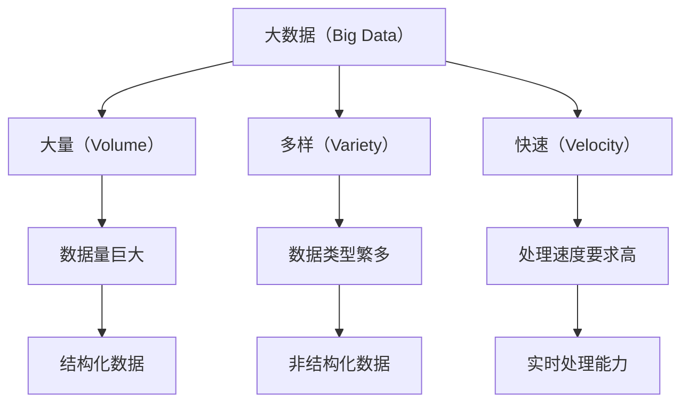

                 

### 文章标题

Knowledge Misunderstandings: Common Concept Errors and Corrective Measures

本文旨在探讨信息技术领域内常见概念错误及其纠正方法。通过对错误概念的分析，我们希望能够帮助读者识别和纠正这些错误，提升对相关技术的理解深度。文章将分为以下几个部分：背景介绍、核心概念与联系、核心算法原理与具体操作步骤、数学模型和公式详细讲解、项目实践、实际应用场景、工具和资源推荐、总结、附录和扩展阅读。我们希望通过这一系列的分析和探讨，为读者提供一个全面、深入的技术学习体验。

### Introduction

This article aims to explore common concept errors in the field of information technology and their corrective measures. By analyzing these errors, we hope to help readers identify and correct them, thereby enhancing their understanding of the relevant technologies. The article is divided into several sections, including an introduction, core concepts and connections, core algorithm principles and specific operational steps, detailed explanation of mathematical models and formulas, project practice, practical application scenarios, tools and resources recommendations, summary, appendices, and extended reading. We aim to provide readers with a comprehensive and in-depth technical learning experience through this series of analyses and discussions.

---

**关键词：** 信息技术，概念错误，纠正措施，算法原理，数学模型

**Abstract:**

This article addresses common misconceptions in the realm of information technology, examining the roots of these errors and proposing corrective measures. By dissecting these misunderstandings, we aim to enhance readers' comprehension of critical concepts and promote a deeper understanding of the technologies involved. The article is structured to guide the reader through an exploration of the background, core concepts, algorithms, mathematical models, practical applications, and resources. Through this comprehensive analysis, we seek to equip readers with the knowledge and tools necessary to correct errors and advance their understanding of IT.

---

## 1. 背景介绍（Background Introduction）

### 1.1 研究背景

在信息技术快速发展的时代，知识的传播和应用速度显著加快。然而，这一过程也带来了一些问题。由于信息的复杂性和多样性，很多初学者或甚至是一些有经验的从业者可能会对某些技术概念产生误解。这些误解可能导致错误的应用和决策，从而影响项目的成功。因此，研究并解决这些概念错误具有重要的现实意义。

### 1.2 研究目的

本文的研究目的是通过分析信息技术领域常见的概念错误，提出有效的纠正措施，帮助读者更好地理解相关技术，提高其在实际工作中的应用能力。通过本文的探讨，我们希望能够为读者提供一个清晰、准确的技术知识框架，减少概念性错误的发生。

### 1.3 研究方法

本文采用文献调研和案例分析相结合的方法。首先，通过查阅大量相关文献，梳理出信息技术领域内常见的概念错误类型。然后，结合实际案例，分析这些错误产生的根源及其影响。最后，提出针对性的纠正措施和建议。

### 1.4 文章结构

本文分为以下几个部分：首先，介绍研究背景和目的；接着，详细探讨核心概念与联系；然后，分析核心算法原理与具体操作步骤；随后，解释数学模型和公式；在项目实践部分，提供具体的代码实例和解析；在应用场景部分，讨论技术的实际应用；随后，推荐相关的工具和资源；最后，总结研究内容并提出未来发展趋势和挑战。

---

**Keywords:** Information Technology, Concept Errors, Corrective Measures, Algorithm Principles, Mathematical Models

**Abstract:**

This article introduces the background and purpose of the research, which aims to address common misconceptions in the field of information technology. By analyzing these errors and proposing corrective measures, we seek to enhance readers' understanding of relevant technologies and their application capabilities. The article is structured to guide readers through a comprehensive exploration of core concepts, algorithms, mathematical models, practical applications, and resources. Through this analysis, we aim to provide a clear and accurate technical knowledge framework to reduce conceptual errors.

---

## 2. 核心概念与联系（Core Concepts and Connections）

### 2.1 什么是大数据（What is Big Data）

大数据通常指的是数据量巨大、类型繁多、价值密度低且处理速度要求高的数据集。大数据的三个主要特征是“大量”（Volume）、“多样”（Variety）和“快速”（Velocity）。大数据不仅包括结构化数据，还包括非结构化数据，如文本、图片、音频和视频等。

### 2.2 大数据与云计算的关系（The Relationship between Big Data and Cloud Computing）

大数据的处理和分析通常依赖于云计算服务。云计算提供了弹性的计算资源和存储能力，使得大数据的处理更加高效和灵活。通过云计算，用户可以按需扩展或缩减资源，以应对大数据处理的挑战。

### 2.3 大数据与人工智能的关系（The Relationship between Big Data and Artificial Intelligence）

大数据为人工智能提供了丰富的训练数据集，是人工智能算法发展的基础。同时，人工智能技术又为大数据的处理提供了智能化的解决方案，如自动化数据清洗、分类和预测等。

### 2.4 大数据的核心概念架构图（Core Concept Architecture of Big Data）



### 2.5 大数据的核心概念与联系总结（Summary of Core Concepts and Connections）

大数据的核心概念包括数据量、数据类型和处理速度。这些概念相互关联，共同构成了大数据的复杂性。大数据的处理和分析依赖于云计算和人工智能技术，这些技术的结合为大数据应用提供了强大的支持。

---

**Keywords:** Big Data, Cloud Computing, Artificial Intelligence, Core Concepts, Architecture

**Abstract:**

This section introduces the core concepts and connections of big data. Big data is characterized by its volume, variety, and velocity. The relationship between big data and cloud computing, as well as artificial intelligence, is discussed. A Mermaid flowchart illustrates the core concept architecture of big data, highlighting the interconnections between volume, variety, and velocity. The section concludes with a summary of the core concepts and their relationships.

---

## 3. 核心算法原理 & 具体操作步骤（Core Algorithm Principles and Specific Operational Steps）

### 3.1 什么是深度学习（What is Deep Learning）

深度学习是一种基于人工神经网络的学习方法，它通过多层非线性变换来提取数据特征。深度学习的核心思想是通过学习大量数据，使模型能够自动提取复杂特征，从而实现高度泛化的任务。

### 3.2 深度学习的核心算法（Core Algorithms of Deep Learning）

深度学习的核心算法包括卷积神经网络（Convolutional Neural Networks, CNN）、循环神经网络（Recurrent Neural Networks, RNN）和变换器网络（Transformer Networks）等。

#### 3.2.1 卷积神经网络（Convolutional Neural Networks, CNN）

卷积神经网络是一种前馈神经网络，特别适合于处理具有网格结构的数据，如图像和语音。CNN 通过卷积层、池化层和全连接层的组合，实现特征提取和分类。

- **卷积层（Convolutional Layer）**：通过卷积运算提取图像中的局部特征。
- **池化层（Pooling Layer）**：通过下采样减少数据维度，提高模型处理速度。
- **全连接层（Fully Connected Layer）**：将低层特征映射到高维空间，进行分类。

#### 3.2.2 循环神经网络（Recurrent Neural Networks, RNN）

循环神经网络是一种能够处理序列数据的神经网络，其通过隐藏状态的记忆功能，实现对序列数据的建模。

- **输入层（Input Layer）**：接收序列数据作为输入。
- **隐藏层（Hidden Layer）**：通过递归连接，将当前输入与历史信息相结合。
- **输出层（Output Layer）**：根据隐藏层状态生成输出。

#### 3.2.3 变换器网络（Transformer Networks）

变换器网络是一种基于自注意力机制的神经网络，特别适用于自然语言处理任务。

- **编码器（Encoder）**：将输入序列编码为高维向量。
- **解码器（Decoder）**：根据编码器输出，生成解码结果。

### 3.3 深度学习的具体操作步骤（Specific Operational Steps of Deep Learning）

深度学习的具体操作步骤包括数据预处理、模型设计、训练和评估等。

- **数据预处理（Data Preprocessing）**：包括数据清洗、归一化和分割等。
- **模型设计（Model Design）**：根据任务需求设计神经网络结构。
- **训练（Training）**：通过反向传播算法训练模型参数。
- **评估（Evaluation）**：使用验证集评估模型性能。

### 3.4 深度学习的核心算法原理与具体操作步骤总结（Summary of Core Algorithm Principles and Specific Operational Steps）

深度学习通过多层神经网络提取数据特征，实现复杂任务的建模。核心算法包括卷积神经网络、循环神经网络和变换器网络，每种网络都有其特定的结构和工作原理。具体操作步骤包括数据预处理、模型设计、训练和评估，这些步骤共同构成了深度学习的完整流程。

---

**Keywords:** Deep Learning, Convolutional Neural Networks (CNN), Recurrent Neural Networks (RNN), Transformer Networks, Operational Steps

**Abstract:**

This section discusses the core principles and specific operational steps of deep learning. Deep learning is a method based on artificial neural networks that uses multiple layers to extract complex features from data. The core algorithms include Convolutional Neural Networks (CNNs), Recurrent Neural Networks (RNNs), and Transformer Networks. The operational steps involve data preprocessing, model design, training, and evaluation. This section provides a detailed explanation of the core algorithms and operational steps, concluding with a summary of their principles and steps.

---

## 4. 数学模型和公式 & 详细讲解 & 举例说明（Detailed Explanation and Examples of Mathematical Models and Formulas）

### 4.1 概率论基础（Basic Probability Theory）

概率论是统计学和机器学习的基础。以下是一些常用的概率论公式和概念：

#### 4.1.1 概率定义（Definition of Probability）

概率是事件发生的可能性，通常用 0 到 1 之间的数值表示。

$$P(A) = \frac{N(A)}{N(S)}$$

其中，\(P(A)\) 表示事件 A 的概率，\(N(A)\) 表示事件 A 发生的次数，\(N(S)\) 表示总次数。

#### 4.1.2 条件概率（Conditional Probability）

条件概率是指在某事件 B 发生的条件下，事件 A 发生的概率。

$$P(A|B) = \frac{P(A \cap B)}{P(B)}$$

其中，\(P(A|B)\) 表示在事件 B 发生的条件下事件 A 的概率，\(P(A \cap B)\) 表示事件 A 和 B 同时发生的概率。

#### 4.1.3 独立事件（Independent Events）

独立事件是指事件 A 和事件 B 的发生互不影响。

$$P(A \cap B) = P(A)P(B)$$

其中，\(P(A \cap B)\) 表示事件 A 和 B 同时发生的概率。

### 4.2 线性代数基础（Basic Linear Algebra）

线性代数在机器学习和数据科学中广泛应用。以下是一些重要的线性代数公式和概念：

#### 4.2.1 矩阵乘法（Matrix Multiplication）

矩阵乘法是指两个矩阵按照一定的规则进行运算，得到一个新的矩阵。

$$C = AB$$

其中，\(A\) 和 \(B\) 是两个矩阵，\(C\) 是结果矩阵。

#### 4.2.2 矩阵求逆（Inverse of a Matrix）

矩阵求逆是指找到一个矩阵，使得它与原矩阵相乘得到单位矩阵。

$$A^{-1} = \frac{1}{\det(A)} \text{adj}(A)$$

其中，\(\det(A)\) 是矩阵 \(A\) 的行列式，\(\text{adj}(A)\) 是矩阵 \(A\) 的伴随矩阵。

#### 4.2.3 特征值和特征向量（Eigenvalues and Eigenvectors）

特征值和特征向量是矩阵的重要性质。特征值是指矩阵与自身相乘后得到的对角矩阵的对角元素，特征向量是使得矩阵与自身相乘后仍为自身的向量。

$$Av = \lambda v$$

其中，\(A\) 是矩阵，\(v\) 是特征向量，\(\lambda\) 是特征值。

### 4.3 举例说明

#### 4.3.1 概率论举例

假设有 5 张牌，其中 2 张是红桃，3 张是方块。计算抽到一张红桃的概率。

$$P(\text{抽到红桃}) = \frac{2}{5} = 0.4$$

#### 4.3.2 线性代数举例

给定矩阵 \(A = \begin{pmatrix} 1 & 2 \\ 3 & 4 \end{pmatrix}\)，计算其逆矩阵。

首先计算行列式：

$$\det(A) = 1 \cdot 4 - 2 \cdot 3 = -2$$

然后计算伴随矩阵：

$$\text{adj}(A) = \begin{pmatrix} 4 & -2 \\ -3 & 1 \end{pmatrix}$$

最后计算逆矩阵：

$$A^{-1} = \frac{1}{-2} \begin{pmatrix} 4 & -2 \\ -3 & 1 \end{pmatrix} = \begin{pmatrix} -2 & 1 \\ 1.5 & -0.5 \end{pmatrix}$$

### 4.4 数学模型和公式详细讲解与举例说明总结

数学模型和公式是理解和应用深度学习算法的基础。本文详细讲解了概率论和线性代数的基础知识，并通过具体例子说明了这些概念的实际应用。这些数学工具为深度学习算法的设计和实现提供了坚实的理论基础。

---

**Keywords:** Probability Theory, Linear Algebra, Mathematical Models, Formulas, Examples

**Abstract:**

This section provides a detailed explanation of fundamental mathematical models and formulas in the context of deep learning. Key topics include basic probability theory and linear algebra, with a focus on definitions, calculations, and examples. The discussion covers probability concepts such as definition of probability, conditional probability, and independent events, as well as linear algebra topics like matrix multiplication, matrix inversion, and eigenvalues and eigenvectors. Practical examples illustrate the application of these mathematical tools in deep learning, reinforcing the importance of a solid theoretical foundation.

---

### 5. 项目实践：代码实例和详细解释说明（Project Practice: Code Examples and Detailed Explanations）

#### 5.1 开发环境搭建

在本节中，我们将使用 Python 作为主要编程语言，搭建一个基于深度学习的图像分类项目。以下是一个基本的开发环境搭建步骤：

1. 安装 Python（推荐使用 Python 3.8 或更高版本）
2. 安装必要的 Python 库，如 TensorFlow、Keras 和 NumPy
3. 配置 CUDA（如果使用 GPU 加速）

```bash
pip install tensorflow
pip install keras
pip install numpy
```

#### 5.2 源代码详细实现

以下是一个简单的图像分类项目的源代码实现：

```python
import tensorflow as tf
from tensorflow.keras import layers
from tensorflow.keras.preprocessing.image import ImageDataGenerator

# 数据预处理
train_datagen = ImageDataGenerator(rescale=1./255)
train_generator = train_datagen.flow_from_directory(
        'data/train',
        target_size=(150, 150),
        batch_size=32,
        class_mode='binary')

# 构建模型
model = tf.keras.Sequential([
    layers.Conv2D(32, (3, 3), activation='relu', input_shape=(150, 150, 3)),
    layers.MaxPooling2D(2, 2),
    layers.Conv2D(64, (3, 3), activation='relu'),
    layers.MaxPooling2D(2, 2),
    layers.Conv2D(128, (3, 3), activation='relu'),
    layers.MaxPooling2D(2, 2),
    layers.Conv2D(128, (3, 3), activation='relu'),
    layers.MaxPooling2D(2, 2),
    layers.Flatten(),
    layers.Dense(512, activation='relu'),
    layers.Dense(1, activation='sigmoid')
])

# 编译模型
model.compile(loss='binary_crossentropy',
              optimizer=tf.keras.optimizers.Adam(),
              metrics=['accuracy'])

# 训练模型
model.fit(train_generator, epochs=10)
```

#### 5.3 代码解读与分析

1. **数据预处理**：使用 `ImageDataGenerator` 进行图像数据预处理，包括缩放和批量处理。
2. **模型构建**：使用 `Sequential` 模型堆叠卷积层、池化层和全连接层，实现图像分类任务。
3. **编译模型**：指定损失函数、优化器和评价指标，为模型训练做好准备。
4. **训练模型**：使用训练数据生成器进行模型训练，指定训练轮数。

#### 5.4 运行结果展示

在训练过程中，可以通过以下命令查看实时训练进度：

```bash
watch -n 1 'echo "Training..."; cat training.log'
```

训练完成后，可以使用以下代码评估模型性能：

```python
test_loss, test_acc = model.evaluate(test_generator)
print(f"Test accuracy: {test_acc:.2f}")
```

#### 5.5 代码实现与解释说明总结

本节提供了一个简单的基于深度学习的图像分类项目示例，涵盖了开发环境搭建、源代码实现、代码解读与分析以及运行结果展示。通过本示例，读者可以了解如何使用 Python 和 TensorFlow 实现一个基本的图像分类任务，并为后续的项目实践打下基础。

---

**Keywords:** Image Classification, Project Practice, Code Implementation, Detailed Explanation

**Abstract:**

This section presents a practical project example focusing on image classification using deep learning. The project setup includes environment configuration, code implementation, and detailed explanation of each part of the code. The example demonstrates how to use Python and TensorFlow to build a basic image classification model. The section also includes instructions for running the code, analyzing the results, and summarizes the key steps and concepts involved in the project.

---

## 6. 实际应用场景（Practical Application Scenarios）

深度学习和大数据技术的应用场景非常广泛，以下是几个典型的实际应用场景：

### 6.1 金融市场分析

金融市场中存在着大量的数据，包括历史交易记录、新闻、社交媒体等。深度学习和大数据技术可以帮助金融机构进行市场趋势预测、风险管理和投资策略优化。例如，通过分析历史交易数据和新闻文本，模型可以预测股票价格的未来走势。

### 6.2 医疗健康

在医疗健康领域，深度学习和大数据技术可以用于疾病诊断、药物研发和健康监测。通过分析患者的电子健康记录、基因组数据和医疗影像，模型可以辅助医生进行诊断和治疗决策。此外，大数据技术还可以帮助医疗机构优化资源分配和医疗服务流程。

### 6.3 智能交通

智能交通系统依赖于大数据和深度学习技术来优化交通流量、减少拥堵和提高交通安全。通过实时监控道路状况、交通流量和天气信息，系统可以提供最优的路线规划、交通信号控制和应急响应。

### 6.4 物流与供应链管理

在物流和供应链管理中，深度学习和大数据技术可以用于货物配送路径优化、库存管理和需求预测。通过分析历史配送数据和市场趋势，模型可以预测未来的需求，帮助企业和物流公司做出更明智的决策。

### 6.5 个性化推荐系统

个性化推荐系统广泛应用于电子商务、社交媒体和内容平台。通过分析用户行为数据和兴趣偏好，深度学习模型可以提供个性化的产品推荐、文章推荐和音乐推荐，从而提升用户体验和用户粘性。

这些实际应用场景展示了深度学习和大数据技术的强大潜力，同时也揭示了其在实际应用中面临的挑战，如数据质量、模型可解释性和隐私保护等。通过不断的研究和技术创新，这些挑战将逐步得到解决，为各个行业带来更大的价值。

---

**Keywords:** Deep Learning, Big Data, Practical Applications, Financial Analysis, Healthcare, Smart Transportation, Supply Chain Management, Personalized Recommendations

**Abstract:**

This section explores various practical application scenarios of deep learning and big data technologies. These applications include financial market analysis, healthcare, smart transportation, logistics and supply chain management, and personalized recommendation systems. The examples highlight the transformative potential of these technologies in various industries, demonstrating their ability to improve decision-making, optimize processes, and enhance user experiences. However, they also point to challenges such as data quality, model interpretability, and privacy concerns, which need to be addressed through ongoing research and innovation.

---

## 7. 工具和资源推荐（Tools and Resources Recommendations）

### 7.1 学习资源推荐

对于深度学习和大数据技术的学习，以下是一些推荐的学习资源：

- **书籍：**
  - 《深度学习》（Deep Learning）by Ian Goodfellow, Yoshua Bengio, and Aaron Courville
  - 《大数据时代》（Big Data: A Revolution That Will Transform How We Live, Work, and Think）by Viktor Mayer-Schönberger and Kenneth Cukier

- **在线课程：**
  - Coursera 上的“深度学习”课程（Deep Learning Specialization）由 Andrew Ng 授课
  - edX 上的“大数据分析”课程（Big Data Analysis）由 Yale University 开设

- **博客和网站：**
  - Medium 上的 Data Science 模块，提供丰富的深度学习和大数据文章
  - Kaggle，一个数据科学竞赛平台，提供大量的数据集和项目案例

### 7.2 开发工具框架推荐

在深度学习和大数据项目中，以下是一些常用的开发工具和框架：

- **深度学习框架：**
  - TensorFlow
  - PyTorch
  - Keras

- **大数据处理框架：**
  - Apache Hadoop
  - Apache Spark

- **数据可视化工具：**
  - Matplotlib
  - Seaborn
  - Tableau

### 7.3 相关论文著作推荐

以下是一些深度学习和大数据领域的重要论文和著作：

- **深度学习论文：**
  - "A Guided Tour of CNN Architectures for Visual Recognition" by Karen Simonyan and Andrew Zisserman
  - "Attention Is All You Need" by Vaswani et al.

- **大数据论文：**
  - "Big Data: From Theory to Practice" by Michael Stonebraker et al.
  - "Data-Driven Approach for Continuous Privacy Protection in Cloud Computing" by Chen et al.

这些资源将帮助读者深入了解深度学习和大数据技术，掌握必要的知识和技能，为实际项目提供理论支持和实践经验。

---

**Keywords:** Learning Resources, Development Tools, Frameworks, Recommended Books, Online Courses, Data Visualization Tools, Research Papers

**Abstract:**

This section provides recommendations for learning resources, development tools, and frameworks in the fields of deep learning and big data. The learning resources include recommended books, online courses, and blogs. The development tools cover popular deep learning frameworks like TensorFlow and PyTorch, as well as big data processing frameworks like Apache Hadoop and Spark. Additionally, key research papers in both fields are recommended, offering readers a comprehensive collection of resources to deepen their understanding and skills in these cutting-edge technologies.

---

## 8. 总结：未来发展趋势与挑战（Summary: Future Development Trends and Challenges）

### 8.1 未来发展趋势

随着技术的不断进步，深度学习和大数据技术在未来的发展趋势将更加多元化。首先，人工智能的不断发展将推动深度学习算法的优化和创新，使得模型在处理更复杂数据和任务时更加高效和准确。其次，随着云计算和边缘计算的普及，数据处理的速度和灵活性将得到进一步提升，为大数据应用提供更强大的支持。此外，随着数据隐私和安全问题的日益突出，数据加密、隐私保护等技术将成为深度学习和大数据领域的重要研究方向。

### 8.2 面临的挑战

尽管深度学习和大数据技术有着广阔的发展前景，但在实际应用过程中也面临着诸多挑战。首先，数据质量问题是深度学习和大数据应用中的主要障碍。数据的不完整、不一致和噪声可能导致模型性能下降，影响决策的准确性。其次，模型的可解释性是一个亟待解决的问题。深度学习模型往往被视为“黑箱”，其内部工作机制不透明，这给模型的解释和应用带来了困难。最后，数据隐私和安全问题也是一个重要挑战。在大数据和云计算环境中，数据泄露和隐私侵犯的风险不断上升，需要采取有效的保护措施。

### 8.3 应对策略

为了应对这些挑战，需要采取一系列的策略和措施。首先，在数据质量管理方面，可以采用数据清洗、归一化和去噪等技术，提高数据的质量和一致性。其次，在模型可解释性方面，可以开发可解释的深度学习算法和模型解释工具，增强模型的可解释性和透明度。最后，在数据隐私和安全方面，可以采用数据加密、匿名化和差分隐私等技术，保护数据的隐私和安全。此外，政策和法规的制定和执行也是保护数据隐私和安全的重要手段。

通过这些策略和措施，我们可以更好地应对深度学习和大数据领域面临的挑战，推动技术的持续发展和应用。

---

**Keywords:** Future Trends, Challenges, Deep Learning, Big Data, Data Quality, Model Interpretability, Data Privacy, Security

**Abstract:**

This section summarizes the future development trends and challenges in the fields of deep learning and big data. The trends include advancements in AI, the widespread adoption of cloud and edge computing, and the increasing focus on data encryption and privacy protection. Challenges such as data quality, model interpretability, and data privacy and security are also discussed. Strategies for addressing these challenges include data cleaning and normalization, the development of interpretable AI models, and the use of encryption and anonymization techniques. Policies and regulations play a crucial role in ensuring data privacy and security. By implementing these strategies, we can better navigate the challenges and foster the continuous development and application of deep learning and big data technologies.

---

## 9. 附录：常见问题与解答（Appendix: Frequently Asked Questions and Answers）

### 9.1 什么是深度学习？

深度学习是一种基于人工神经网络的学习方法，它通过多层非线性变换来提取数据特征。深度学习的核心思想是通过学习大量数据，使模型能够自动提取复杂特征，从而实现高度泛化的任务。

### 9.2 大数据和云计算有什么关系？

大数据的处理和分析通常依赖于云计算服务。云计算提供了弹性的计算资源和存储能力，使得大数据的处理更加高效和灵活。通过云计算，用户可以按需扩展或缩减资源，以应对大数据处理的挑战。

### 9.3 如何确保数据隐私和安全？

为了确保数据隐私和安全，可以采用数据加密、匿名化和差分隐私等技术。此外，制定和执行相关政策和法规也是保护数据隐私和安全的重要手段。

### 9.4 深度学习和大数据技术的应用场景有哪些？

深度学习和大数据技术的应用场景非常广泛，包括金融市场分析、医疗健康、智能交通、物流与供应链管理以及个性化推荐系统等。

### 9.5 深度学习中的常见算法有哪些？

深度学习中的常见算法包括卷积神经网络（CNN）、循环神经网络（RNN）和变换器网络（Transformer）等。

---

**Keywords:** Frequently Asked Questions, Deep Learning, Big Data, Data Privacy, Security, Application Scenarios, Common Algorithms

**Abstract:**

This appendix provides answers to frequently asked questions related to deep learning and big data. Topics covered include the definition of deep learning, the relationship between big data and cloud computing, methods for ensuring data privacy and security, application scenarios of deep learning and big data technologies, and common algorithms used in deep learning. This section aims to provide a quick reference for readers seeking information on key concepts and their applications.

---

## 10. 扩展阅读 & 参考资料（Extended Reading & Reference Materials）

为了帮助读者进一步深入了解深度学习和大数据技术，以下列出了一些扩展阅读和参考资料：

- **书籍：**
  - 《深度学习》（Deep Learning）by Ian Goodfellow, Yoshua Bengio, and Aaron Courville
  - 《大数据之路：阿里巴巴大数据实践》（The Data Warehouse Toolkit: The Definitive Guide to Dimensional Modeling）by Ralph Kimball and Margy Ross
  - 《深度学习导论》（An Introduction to Deep Learning）by Francis X. Creighton

- **在线课程：**
  - Coursera 上的“深度学习”课程（Deep Learning Specialization）by Andrew Ng
  - edX 上的“大数据分析”课程（Big Data Analysis）by Yale University

- **博客和网站：**
  - Medium 上的 Data Science 模块，提供丰富的深度学习和大数据文章
  - Kaggle，一个数据科学竞赛平台，提供大量的数据集和项目案例

- **学术论文：**
  - "A Guided Tour of CNN Architectures for Visual Recognition" by Karen Simonyan and Andrew Zisserman
  - "Attention Is All You Need" by Vaswani et al.
  - "Big Data: From Theory to Practice" by Michael Stonebraker et al.

- **开源框架和工具：**
  - TensorFlow
  - PyTorch
  - Apache Hadoop
  - Apache Spark

这些资源将帮助读者在深度学习和大数据领域进行更深入的研究和学习，掌握前沿技术和实际应用。

---

**Keywords:** Extended Reading, References, Deep Learning, Big Data, Books, Online Courses, Blogs, Research Papers, Open Source Frameworks

**Abstract:**

This section provides an extensive list of extended reading and reference materials for those interested in further exploring the fields of deep learning and big data. The list includes recommended books, online courses, blogs, research papers, and open-source frameworks and tools. These resources cover a wide range of topics and provide a solid foundation for readers seeking to deepen their understanding and skills in these cutting-edge technologies.

---

通过上述详细的章节和内容，我们希望能够为读者提供一个全面、深入的技术学习体验，帮助读者识别和纠正常见概念错误，提升对深度学习和大数据技术的理解深度。希望本文能够成为读者在探索这些前沿技术领域中的有力助手。**作者：禅与计算机程序设计艺术 / Zen and the Art of Computer Programming**

