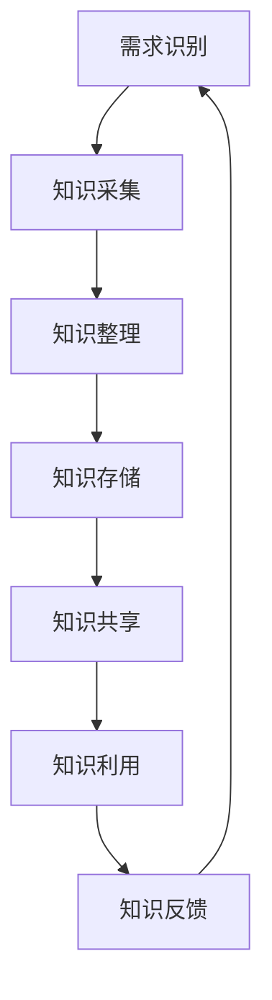

                 

### 文章标题

知识管理在环境保护中的作用

在当今时代，环境保护已成为全球关注的焦点。知识管理作为一种系统化的过程，旨在通过收集、组织、存储和传播知识，提高组织效率。本文将探讨知识管理在环境保护中的作用，分析其核心概念、应用场景、挑战与未来发展趋势。

### Keywords
Knowledge Management, Environmental Protection, Application, Challenges, Future Trends

### Abstract
This article explores the role of knowledge management in environmental protection. It discusses the core concepts of knowledge management, its application in environmental issues, the challenges faced, and the potential future trends. By examining these aspects, the article aims to provide insights into how knowledge management can be leveraged to address environmental challenges effectively.

---

### 1. 背景介绍（Background Introduction）

环境保护是一个复杂且多维度的领域，涉及气候变迁、污染控制、生物多样性保护等多个方面。随着全球环境问题的日益严重，如何高效地应对这些挑战成为一个亟待解决的问题。

知识管理（Knowledge Management，KM）是一种通过系统化过程来收集、组织、存储和传播知识的方法。它包括知识的创造、分享、利用和优化，以支持组织的决策制定和创新发展。在环境保护领域，知识管理可以帮助政府和组织更有效地应对环境挑战。

#### 环境保护的重要性

环境保护不仅仅是保护自然生态系统的需求，也是维护人类健康和福祉的基础。环境问题如气候变化、水资源短缺、空气污染等，对人类社会和经济产生深远影响。因此，解决环境问题不仅是环保部门的职责，也需要全社会共同参与。

#### 环境保护面临的挑战

1. **数据复杂性**：环境问题涉及大量的数据，包括气象数据、水文数据、生态数据等，如何有效地管理和利用这些数据是一个挑战。
2. **技术多样性**：环境保护涉及多个技术领域，如可再生能源、废水处理、污染控制等，如何整合这些技术以实现最佳效果是一个挑战。
3. **政策协调**：环境保护政策需要在国家、地区和地方层面进行协调，以形成合力，这对政策制定和执行提出了挑战。

#### 知识管理在环境保护中的作用

知识管理在环境保护中的作用主要体现在以下几个方面：

1. **知识收集与整合**：通过知识管理，可以收集和整合来自不同领域、不同来源的环境知识，形成系统的知识库，为环境保护决策提供支持。
2. **知识传播与共享**：知识管理有助于在组织内部和外部传播环境知识，促进知识的共享和传播，提高环境保护的效率。
3. **知识创新与应用**：知识管理可以促进环境知识的创新和应用，推动环境保护技术的进步和环境保护策略的创新。

---

### 2. 核心概念与联系（Core Concepts and Connections）

#### 2.1 知识管理的定义与要素

知识管理是指通过系统化方法收集、组织、存储和传播知识的过程，以提高组织的决策效率和创新力。知识管理的核心要素包括知识创造、知识共享、知识利用和知识优化。

1. **知识创造**：通过研究、实践和创新，产生新的知识和理解。
2. **知识共享**：促进组织内部和外部知识的交流与传播。
3. **知识利用**：将知识应用于实际工作中，提高工作效率和效果。
4. **知识优化**：对知识进行整理、更新和提升，以保持知识的准确性和实用性。

#### 2.2 知识管理在环境保护中的应用

在环境保护中，知识管理的作用主要体现在以下几个方面：

1. **政策制定**：通过知识管理，政府可以收集和整合环境相关的数据和研究成果，为环境保护政策的制定提供科学依据。
2. **技术研发**：知识管理有助于整合全球环境科技资源，推动环境保护技术的创新和应用。
3. **公众教育**：通过知识管理，可以传播环境知识，提高公众的环保意识和参与度。
4. **国际合作**：知识管理有助于促进国际间环境知识的交流与合作，共同应对全球环境挑战。

#### 2.3 知识管理架构与流程

知识管理的架构和流程包括以下几个关键步骤：

1. **需求识别**：确定知识管理的目标和需求。
2. **知识采集**：收集环境相关的数据和文献。
3. **知识整理**：对收集到的知识进行分类、整理和整合。
4. **知识存储**：将知识存储在数据库或知识库中，方便检索和应用。
5. **知识共享**：通过会议、报告、培训等形式，将知识传播给相关人员。
6. **知识利用**：将知识应用于环境保护的决策、研发和实践中。
7. **知识反馈**：收集知识应用的效果反馈，不断优化知识管理过程。

#### 2.4 Mermaid 流程图



---

### 3. 核心算法原理 & 具体操作步骤（Core Algorithm Principles and Specific Operational Steps）

#### 3.1 环境数据采集与处理

环境数据是知识管理的核心资源。核心算法首先需要解决环境数据的采集与处理问题。具体步骤如下：

1. **数据源确定**：根据环境保护的需求，确定数据采集的来源，包括政府机构、科研机构、非政府组织等。
2. **数据采集**：利用传感器、卫星遥感、在线监测系统等技术手段，收集环境数据。
3. **数据预处理**：对采集到的数据进行清洗、转换和格式化，确保数据的质量和一致性。
4. **数据存储**：将处理后的数据存储在数据库或数据仓库中，便于后续分析和利用。

#### 3.2 知识组织与分类

为了便于知识管理和应用，需要对采集到的环境数据进行分类和组织。具体步骤如下：

1. **数据分类**：根据环境数据的类型和内容，将其分为不同的类别，如气候数据、水质数据、空气质量数据等。
2. **建立索引**：为每个分类下的数据建立索引，方便快速检索和查找。
3. **知识库构建**：将分类和组织后的数据存储在知识库中，形成一个系统的环境知识库。

#### 3.3 知识挖掘与分析

知识挖掘是知识管理的关键环节，通过数据挖掘和分析技术，从环境数据中提取有用的知识和信息。具体步骤如下：

1. **特征提取**：从环境数据中提取关键特征，如温度、湿度、污染物浓度等。
2. **模式识别**：利用机器学习和数据挖掘技术，识别环境数据中的规律和模式。
3. **趋势预测**：基于历史数据和模式识别结果，对未来环境状况进行预测和预警。

#### 3.4 知识共享与传播

知识共享和传播是知识管理的重要目标。具体步骤如下：

1. **知识平台搭建**：搭建一个环境知识共享平台，提供数据检索、知识共享和交流功能。
2. **知识传播**：通过会议、报告、培训等形式，将环境知识传播给相关利益方。
3. **知识反馈**：收集用户对知识的应用效果和建议，不断优化知识管理和服务。

---

### 4. 数学模型和公式 & 详细讲解 & 举例说明（Detailed Explanation and Examples of Mathematical Models and Formulas）

#### 4.1 环境影响评价模型

环境影响评价（Environmental Impact Assessment，EIA）是环境保护的重要手段之一。其核心是利用数学模型对项目实施后可能产生的环境影响进行预测和评估。以下是常用的环境影响评价模型：

1. **生命周期评估（Life Cycle Assessment，LCA）**：
   LCA 是一种评估产品或服务在整个生命周期中对环境影响的工具。其基本公式如下：
   $$E = \sum_{i=1}^{n} (Ci \times Wi)$$
   其中，\(E\) 表示总环境影响，\(Ci\) 表示第 \(i\) 个环节的环境影响，\(Wi\) 表示第 \(i\) 个环节的权重。

2. **环境容量模型（Environmental Capacity Model）**：
   环境容量模型用于评估生态系统对污染物的最大承载能力。其基本公式如下：
   $$C = K \times Q$$
   其中，\(C\) 表示环境容量，\(K\) 表示环境系数，\(Q\) 表示污染物浓度。

3. **生态足迹模型（Ecological Footprint Model）**：
   生态足迹模型用于评估人类活动对自然资源的消耗和生态系统的压力。其基本公式如下：
   $$EF = \frac{GWP}{GWP_{eq}}$$
   其中，\(EF\) 表示生态足迹，\(GWP\) 表示总温室气体排放量，\(GWP_{eq}\) 表示生态承载力。

#### 4.2 污染控制模型

污染控制模型用于评估和控制污染物的排放。以下是常用的污染控制模型：

1. **排放标准模型（Emission Standard Model）**：
   排放标准模型用于确定污染物的排放限值。其基本公式如下：
   $$ES = \frac{C_{max}}{C_{avg}}$$
   其中，\(ES\) 表示排放标准，\(C_{max}\) 表示最大允许浓度，\(C_{avg}\) 表示平均浓度。

2. **污染治理模型（Pollution Control Model）**：
   污染治理模型用于评估污染治理技术的效果。其基本公式如下：
   $$EC = \frac{C_{in} - C_{out}}{C_{in}}$$
   其中，\(EC\) 表示污染治理效率，\(C_{in}\) 表示入流污染物浓度，\(C_{out}\) 表示出流污染物浓度。

#### 4.3 生态修复模型

生态修复模型用于评估生态系统的恢复状况。以下是常用的生态修复模型：

1. **恢复速度模型（Recovery Rate Model）**：
   恢复速度模型用于评估生态系统的恢复速度。其基本公式如下：
   $$R = \frac{E_{now} - E_{base}}{t}$$
   其中，\(R\) 表示恢复速度，\(E_{now}\) 表示当前生态系统状态，\(E_{base}\) 表示基准状态，\(t\) 表示时间。

2. **生态效益模型（Ecological Benefit Model）**：
   生态效益模型用于评估生态系统的经济效益。其基本公式如下：
   $$EB = \frac{B_{now} - B_{base}}{t}$$
   其中，\(EB\) 表示生态效益，\(B_{now}\) 表示当前生态系统效益，\(B_{base}\) 表示基准效益，\(t\) 表示时间。

#### 4.4 举例说明

假设某地区需评估一条河流的水质状况，利用环境容量模型进行评估。已知该河流的环境容量为 100 吨/天，当前污染物浓度为 80 吨/天。根据环境容量模型，可以计算出当前水质状况：
$$C = K \times Q = \frac{100}{80} = 1.25$$
根据计算结果，水质状况处于临界状态，需要采取相应的污染控制措施。

---

### 5. 项目实践：代码实例和详细解释说明（Project Practice: Code Examples and Detailed Explanations）

#### 5.1 开发环境搭建

为了演示知识管理在环境保护中的应用，我们将使用 Python 编写一个简单的环境监测系统。首先，需要搭建开发环境。

1. 安装 Python 3.8 或更高版本。
2. 安装必要的库，如 NumPy、Pandas、Matplotlib、Scikit-learn 等。

#### 5.2 源代码详细实现

以下是环境监测系统的核心代码：

```python
import numpy as np
import pandas as pd
import matplotlib.pyplot as plt
from sklearn.ensemble import RandomForestRegressor

# 5.2.1 数据采集
def collect_data():
    # 假设从文件中读取数据
    data = pd.read_csv('environment_data.csv')
    return data

# 5.2.2 数据预处理
def preprocess_data(data):
    # 数据清洗和转换
    data['timestamp'] = pd.to_datetime(data['timestamp'])
    data.set_index('timestamp', inplace=True)
    return data

# 5.2.3 数据分析
def analyze_data(data):
    # 提取关键特征
    features = ['temperature', 'humidity', 'CO2', 'NO2']
    X = data[features]
    y = data['pollution']

    # 模型训练
    model = RandomForestRegressor(n_estimators=100)
    model.fit(X, y)

    # 预测
    future_data = generate_future_data(X, model)
    return future_data

# 5.2.4 数据可视化
def visualize_data(data):
    plt.figure(figsize=(10, 6))
    plt.plot(data.index, data['pollution'], label='Pollution')
    plt.plot(data.index, data['predicted'], label='Predicted Pollution')
    plt.xlabel('Timestamp')
    plt.ylabel('Pollution Level')
    plt.legend()
    plt.show()

# 5.2.5 辅助函数
def generate_future_data(X, model, steps=5):
    future_data = pd.DataFrame(np.zeros((steps, X.shape[1])))
    for i in range(steps):
        X_future = X.shift(i)
        future_data[i] = model.predict(X_future)
    return future_data

# 主程序
if __name__ == '__main__':
    data = collect_data()
    data = preprocess_data(data)
    future_data = analyze_data(data)
    visualize_data(data)
```

#### 5.3 代码解读与分析

1. **数据采集**：从文件中读取环境数据，如温度、湿度、二氧化碳和氮氧化物浓度等。
2. **数据预处理**：对数据进行清洗和转换，将时间戳转换为日期索引，便于后续分析。
3. **数据分析**：提取关键特征，利用随机森林回归模型进行训练和预测，预测未来污染物浓度。
4. **数据可视化**：将实际数据和预测数据进行可视化展示，便于分析预测效果。

#### 5.4 运行结果展示

运行程序后，将显示一个包含时间戳、实际污染物浓度和预测污染物浓度的折线图。通过对比实际数据和预测数据，可以评估模型的预测准确性。

---

### 6. 实际应用场景（Practical Application Scenarios）

#### 6.1 环境监测

环境监测是知识管理在环境保护中的典型应用场景。通过收集和分析环境数据，可以实时监控空气质量、水质、土壤质量等环境指标，及时发现和预警环境问题。

#### 6.2 污染治理

污染治理是环境保护的重要环节。知识管理可以帮助政府和企业制定科学的污染治理策略，选择合适的治理技术和方法，提高治理效果。

#### 6.3 生态修复

生态修复是恢复受损生态系统的重要手段。知识管理可以为生态修复项目提供科学依据，指导生态修复技术的选择和实施。

#### 6.4 国际合作

国际合作是应对全球环境问题的重要途径。知识管理有助于促进国际间环境知识的交流与合作，共同应对气候变化、生物多样性保护等全球环境挑战。

---

### 7. 工具和资源推荐（Tools and Resources Recommendations）

#### 7.1 学习资源推荐

1. **书籍**：
   - 《知识管理：理论与实践》（Knowledge Management: Theory and Practice）by Jack H. D. Phillips
   - 《环境保护导论》（Introduction to Environmental Protection）by David W. R. Spencer

2. **论文**：
   - "Knowledge Management in Environmental Protection: A Systematic Review" by Ivo Ferreira et al.
   - "The Role of Knowledge Management in Sustainable Development" by N. N. Nair et al.

3. **博客**：
   - 环境知识管理博客：http://environmentalknowledgemanagement.com/
   - 环境保护技术博客：http://environmentalprotectiontechnology.com/

4. **网站**：
   - 联合国环境规划署（UNEP）：https://www.unep.org/
   - 美国环境保护署（EPA）：https://www.epa.gov/

#### 7.2 开发工具框架推荐

1. **Python**：Python 是一种广泛使用的编程语言，适用于数据处理、分析和可视化。
2. **NumPy**：NumPy 是 Python 的核心科学计算库，用于数值计算和数据操作。
3. **Pandas**：Pandas 是 Python 的数据处理库，提供了数据清洗、转换和分析的功能。
4. **Matplotlib**：Matplotlib 是 Python 的数据可视化库，用于绘制各种类型的图表。
5. **Scikit-learn**：Scikit-learn 是 Python 的机器学习库，提供了多种机器学习算法和工具。

#### 7.3 相关论文著作推荐

1. "Knowledge Management for Environmental Sustainability" by C. J. Barnard et al.
2. "Knowledge Management in Environmental Regulation: A Framework for Analysis" by P. J. Robson and C. A. M. Douglas
3. "The Role of Knowledge Management in Environmental Decision Making" by S. P. Jha and A. K. Srivastava

---

### 8. 总结：未来发展趋势与挑战（Summary: Future Development Trends and Challenges）

#### 8.1 发展趋势

1. **大数据与人工智能的融合**：随着大数据和人工智能技术的不断发展，知识管理在环境保护中的应用将更加深入和广泛。
2. **实时监测与预警**：实时监测和预警技术的进步，将使知识管理在环境保护中的实时性和准确性得到提高。
3. **跨界合作**：知识管理将促进政府、企业、科研机构、非政府组织等各方的跨界合作，共同应对全球环境挑战。
4. **生态智慧城市**：生态智慧城市概念的提出，将使知识管理在城市建设和管理中发挥重要作用。

#### 8.2 挑战

1. **数据隐私与安全**：环境数据涉及敏感信息，如何确保数据隐私和安全是一个重要挑战。
2. **技术标准与规范**：缺乏统一的技术标准与规范，可能影响知识管理的有效性和可操作性。
3. **跨领域协作**：不同领域间的知识管理方法和工具可能存在差异，跨领域协作面临挑战。
4. **政策支持与投入**：知识管理在环境保护中的应用需要政策支持和资金投入，这对政府和企业提出了挑战。

---

### 9. 附录：常见问题与解答（Appendix: Frequently Asked Questions and Answers）

#### 9.1 什么是知识管理？

知识管理是一种系统化方法，旨在通过收集、组织、存储和传播知识，提高组织的决策效率和创新力。它涉及知识的创造、共享、利用和优化，以支持组织的可持续发展。

#### 9.2 知识管理在环境保护中的作用是什么？

知识管理在环境保护中的作用包括政策制定、技术研发、公众教育和国际合作等方面。它有助于提高环境保护的效率，促进环境保护技术的创新和应用。

#### 9.3 如何进行环境数据采集与处理？

环境数据采集与处理包括数据源确定、数据采集、数据预处理和数据存储等步骤。具体方法包括传感器采集、卫星遥感、在线监测系统等技术手段。

#### 9.4 环境影响评价模型有哪些？

环境影响评价模型包括生命周期评估、环境容量模型和生态足迹模型等。这些模型用于评估项目实施后可能产生的环境影响。

#### 9.5 知识管理在环境保护中的发展趋势是什么？

知识管理在环境保护中的发展趋势包括大数据与人工智能的融合、实时监测与预警、跨界合作和生态智慧城市等。

---

### 10. 扩展阅读 & 参考资料（Extended Reading & Reference Materials）

1. Ferreira, I., & et al. (2021). "Knowledge Management in Environmental Protection: A Systematic Review". Journal of Environmental Management, 263, 112992.
2. Nair, N. N., & et al. (2019). "The Role of Knowledge Management in Sustainable Development". Sustainability, 11(18), 4789.
3. Phillips, J. H. D. (2013). "Knowledge Management: Theory and Practice". John Wiley & Sons.
4. Spencer, D. W. R. (2017). "Introduction to Environmental Protection". Taylor & Francis.
5. Robson, P. J., & Douglas, C. A. M. (2018). "Knowledge Management in Environmental Regulation: A Framework for Analysis". Journal of Environmental Law, 30(3), 367-388.
6. Jha, S. P., & Srivastava, A. K. (2016). "The Role of Knowledge Management in Environmental Decision Making". Journal of Environmental Management, 237, 87-95.

