                 

### 文章标题

**知识管理策略：让知识发挥最大效益**

知识是现代社会的核心资源，对于个人和组织而言，如何有效地管理知识、最大化其价值成为了一项至关重要的任务。本文将深入探讨知识管理的策略，通过逻辑清晰的论述和具体实例，帮助读者理解并应用这些策略，从而让知识在个人和组织的各个方面发挥出最大的效益。

> 关键词：知识管理，知识最大化，效益，策略，个人，组织

本文将分为以下几个部分进行阐述：

1. **背景介绍**：探讨知识管理的背景和重要性。
2. **核心概念与联系**：介绍知识管理中的关键概念，并绘制相关流程图。
3. **核心算法原理与具体操作步骤**：详细解释知识管理中的核心算法和操作步骤。
4. **数学模型和公式**：阐述知识管理中的数学模型和公式，并举例说明。
5. **项目实践**：提供具体代码实例和详细解释。
6. **实际应用场景**：讨论知识管理在各个领域的应用。
7. **工具和资源推荐**：推荐相关的学习资源和工具。
8. **总结**：总结未来发展趋势和挑战。
9. **常见问题与解答**：回答读者可能遇到的问题。
10. **扩展阅读与参考资料**：提供进一步阅读的资源和文献。

让我们一步步深入探讨知识管理的各个层面，掌握让知识发挥最大效益的策略。

> **Abstract**: This article delves into knowledge management strategies to maximize the benefits of knowledge. By providing a logical and clear exposition with specific examples, readers will gain a comprehensive understanding of these strategies and learn how to apply them effectively in various aspects of personal and organizational life.

### Background Introduction

In today's information age, knowledge has become a critical resource for both individuals and organizations. Efficiently managing knowledge and maximizing its value has become a crucial task. Knowledge management is the process of capturing, organizing, storing, and disseminating knowledge to ensure that it is accessible, useful, and actionable when needed.

**Why is knowledge management important?**

The importance of knowledge management can be summarized in three main aspects:

1. **Competitive Advantage**: Effective knowledge management enables organizations to leverage their collective intelligence, foster innovation, and make informed decisions. This gives them a competitive edge in the market.
2. **Enhanced Decision-Making**: By organizing and storing knowledge in a structured manner, organizations can facilitate better decision-making processes. Managers and employees can access relevant information quickly, reducing the risk of making poor decisions based on incomplete or outdated data.
3. **Knowledge Retention and Transfer**: Knowledge management ensures that valuable knowledge is retained within the organization and can be transferred to new employees or future generations. This minimizes the risk of losing critical knowledge when employees leave or retire.

In this article, we will explore various strategies for effective knowledge management, providing readers with practical insights and examples to help them maximize the value of their knowledge assets. Whether you are an individual looking to enhance your personal knowledge management or an organization aiming to optimize its knowledge management processes, this article will equip you with the necessary tools and techniques.

> **背景介绍**

在当今的信息时代，知识已经成为个人和组织的核心资源。有效地管理知识并最大化其价值已经成为一项至关重要的任务。知识管理是一个过程，包括捕获、组织、存储和传播知识，以确保在需要时它易于访问、有用和可操作。

**知识管理的重要性体现在哪些方面？**

知识管理的重要性可以总结为三个方面：

1. **竞争优势**：有效的知识管理使组织能够利用其集体智慧，促进创新，并做出明智的决策。这为他们提供了在市场上的竞争优势。
2. **增强决策制定**：通过以结构化的方式组织和存储知识，组织可以简化决策过程。管理人员和员工可以快速访问相关数据，从而降低基于不完整或过时数据的决策风险。
3. **知识保留和转移**：知识管理确保了宝贵的知识在组织内部保留，并可以传递给新员工或未来的一代人。这降低了当员工离职或退休时丢失关键知识的风险。

在这篇文章中，我们将探讨有效的知识管理的各种策略，为读者提供实用的见解和例子，帮助他们最大化其知识资产的价值。无论您是寻求提升个人知识管理的个人，还是希望优化其知识管理流程的组织，这篇文章都将为您配备必要的工具和技术。

### Core Concepts and Connections

To delve deeper into knowledge management, it's essential to understand the core concepts and how they are interconnected. In this section, we will discuss the main components of knowledge management and their relationships, using a Mermaid flowchart to illustrate the process.

#### 1. Knowledge Capture

Knowledge capture is the process of identifying, collecting, and recording information and experiences. This involves capturing both explicit knowledge, which is easily documented and codified, and tacit knowledge, which is difficult to articulate but resides within individuals.

**Mermaid Flowchart Node Example:**
```
knowledge_capture
    --> information_collection
    --> documentation
```

#### 2. Knowledge Organization

Once knowledge is captured, it needs to be organized in a structured manner. This involves categorizing, labeling, and tagging information to make it easily searchable and accessible. Metadata, or data about data, plays a crucial role in this process.

**Mermaid Flowchart Node Example:**
```
knowledge_capture
    --> knowledge_organization
        --> categorization
        --> labeling
        --> tagging
```

#### 3. Knowledge Storage

Knowledge storage involves choosing appropriate tools and systems to store and maintain knowledge. This can range from traditional databases and document management systems to more advanced knowledge bases and content management systems.

**Mermaid Flowchart Node Example:**
```
knowledge_organization
    --> knowledge_storage
        --> databases
        --> document_management
        --> knowledge_bases
```

#### 4. Knowledge Sharing

Effective knowledge sharing is crucial for leveraging the full potential of knowledge management. This involves disseminating knowledge within the organization through various channels such as meetings, training sessions, and collaborative platforms.

**Mermaid Flowchart Node Example:**
```
knowledge_storage
    --> knowledge_sharing
        --> meetings
        --> training_sessions
        --> collaborative_platforms
```

#### 5. Knowledge Utilization

The ultimate goal of knowledge management is to enable individuals and teams to utilize knowledge effectively in their work. This involves providing tools and processes that facilitate the integration of knowledge into everyday tasks and decision-making processes.

**Mermaid Flowchart Node Example:**
```
knowledge_sharing
    --> knowledge_utilization
        --> integration
        --> task_completion
        --> decision_making
```

**Mermaid Flowchart:**

```mermaid
graph TD
    knowledge_capture --> information_collection
    knowledge_capture --> documentation
    knowledge_organization --> categorization
    knowledge_organization --> labeling
    knowledge_organization --> tagging
    knowledge_storage --> databases
    knowledge_storage --> document_management
    knowledge_storage --> knowledge_bases
    knowledge_sharing --> meetings
    knowledge_sharing --> training_sessions
    knowledge_sharing --> collaborative_platforms
    knowledge_utilization --> integration
    knowledge_utilization --> task_completion
    knowledge_utilization --> decision_making
```


By understanding and implementing these core concepts, organizations can build a robust knowledge management system that maximizes the value of their knowledge assets.

> **核心概念与联系**

要深入了解知识管理，理解核心概念及其相互关系至关重要。在本节中，我们将讨论知识管理的主要组件及其关系，并使用Mermaid流程图来展示这个过程。

#### 1. 知识捕获

知识捕获是一个识别、收集和记录信息和经验的过程。这包括捕获显性知识，即易于文档化和编码的知识，以及隐性知识，即难以言表但存在于个人内部的知识。

**Mermaid流程图节点示例：**
```
knowledge_capture
    --> information_collection
    --> documentation
```

#### 2. 知识组织

一旦捕获了知识，就需要以结构化的方式进行组织。这包括对信息进行分类、标记和打标签，以便使其易于搜索和访问。元数据，即关于数据的数据，在这一过程中发挥着关键作用。

**Mermaid流程图节点示例：**
```
knowledge_capture
    --> knowledge_organization
        --> categorization
        --> labeling
        --> tagging
```

#### 3. 知识存储

知识存储涉及选择适当的工具和系统来存储和维护知识。这可以从传统的数据库和文档管理系统到更先进的知识库和内容管理系统。

**Mermaid流程图节点示例：**
```
knowledge_organization
    --> knowledge_storage
        --> databases
        --> document_management
        --> knowledge_bases
```

#### 4. 知识共享

有效的知识共享对于充分发挥知识管理的潜力至关重要。这涉及通过各种渠道在组织内部传播知识，如会议、培训课程和协作平台。

**Mermaid流程图节点示例：**
```
knowledge_storage
    --> knowledge_sharing
        --> meetings
        --> training_sessions
        --> collaborative_platforms
```

#### 5. 知识利用

知识管理的最终目标是使个人和团队能够有效地利用知识。这包括提供工具和流程，以促进知识在日常任务和决策过程中的集成。

**Mermaid流程图节点示例：**
```
knowledge_sharing
    --> knowledge_utilization
        --> integration
        --> task_completion
        --> decision_making
```

**Mermaid流程图：**


通过理解和实施这些核心概念，组织可以建立强大的知识管理系统，最大化其知识资产的价值。

### Core Algorithm Principles and Specific Operational Steps

In the realm of knowledge management, algorithms play a pivotal role in automating and optimizing processes. This section will delve into the core algorithms used in knowledge management and outline specific operational steps to implement them effectively.

#### 1. Data Mining

Data mining is a fundamental algorithm used to discover hidden patterns or insights from large datasets. It involves several key steps:

1. **Data Preprocessing**: This step involves cleaning and transforming raw data to ensure its quality and consistency.
2. **Data Integration**: Combining data from multiple sources to create a unified dataset.
3. **Data Reduction**: Reducing the size of the dataset through techniques like sampling or feature selection to improve performance.
4. **Pattern Discovery**: Applying algorithms like association rule learning, clustering, or classification to identify hidden patterns or relationships.
5. **Evaluation**: Assessing the quality and relevance of discovered patterns.

**Algorithm Principles:**
Data mining algorithms operate based on the principles of association, classification, clustering, and forecasting. For example, association rule learning algorithms, such as Apriori, identify items that frequently occur together in a dataset.

**Operational Steps:**
1. **Define the Problem**: Clearly articulate the knowledge management challenge you aim to solve.
2. **Collect Data**: Gather relevant data from various sources, ensuring its quality and completeness.
3. **Preprocess Data**: Clean, transform, and integrate the data to prepare it for analysis.
4. **Choose Algorithms**: Select appropriate data mining algorithms based on the problem domain.
5. **Apply Algorithms**: Implement the chosen algorithms on the preprocessed data.
6. **Evaluate Results**: Assess the quality and relevance of the discovered patterns.
7. **Iterate**: Refine the process by adjusting parameters or selecting different algorithms if necessary.

#### 2. Knowledge Representation

Knowledge representation is the process of encoding knowledge in a format that can be stored, processed, and utilized by a computer system. Common techniques include:

1. **Ontologies**: Structured representations of knowledge that define concepts, relationships, and rules. They provide a common language for knowledge sharing and interoperability.
2. **Ontology Engineering**: The process of designing and developing ontologies. It involves identifying key concepts, relationships, and properties, and defining their semantics.
3. **Rule-based Systems**: Systems that use a set of rules to represent knowledge. These rules are typically in the form of IF-THEN statements and can be used for decision-making and reasoning.
4. **Ontology-based Data Access**: Techniques that leverage ontologies to facilitate data integration and query processing.

**Algorithm Principles:**
The principles of knowledge representation focus on the representation of knowledge in a structured and computationally accessible manner. This allows for efficient storage, retrieval, and manipulation of knowledge.

**Operational Steps:**
1. **Identify Knowledge Domains**: Determine the specific domains or areas where knowledge representation is needed.
2. **Define Concepts and Relationships**: Identify key concepts and define their relationships and properties.
3. **Create Ontologies**: Develop ontologies that capture the identified knowledge in a structured format.
4. **Implement Rule-based Systems**: Design and implement rule-based systems that utilize the defined ontologies for decision-making and reasoning.
5. **Integrate with Data Sources**: Connect the knowledge representation systems with data sources to enable data access and integration.
6. **Test and Validate**: Verify the accuracy and effectiveness of the knowledge representation systems through testing and validation.

#### 3. Knowledge Discovery

Knowledge discovery is the process of identifying new insights or knowledge from large datasets. It involves the following steps:

1. **Data Exploration**: Exploring the data to gain a preliminary understanding of its characteristics and potential insights.
2. **Pattern Identification**: Identifying interesting patterns or anomalies within the data using techniques like clustering, classification, or association rule mining.
3. **Data Visualization**: Visualizing the discovered patterns to aid in their understanding and communication.
4. **Knowledge Integration**: Integrating the discovered knowledge into the existing knowledge base or system.

**Algorithm Principles:**
Knowledge discovery algorithms operate based on principles of pattern recognition, statistical analysis, and machine learning. They aim to uncover hidden patterns or relationships within the data that are meaningful and actionable.

**Operational Steps:**
1. **Define the Problem**: Clearly specify the knowledge discovery objectives and the types of insights sought.
2. **Collect and Prepare Data**: Gather relevant data and preprocess it to ensure its quality and consistency.
3. **Explore Data**: Use exploratory data analysis techniques to gain insights and identify potential patterns.
4. **Apply Discovery Algorithms**: Implement algorithms like clustering, classification, or association rule mining to identify patterns within the data.
5. **Visualize and Interpret Results**: Visualize the discovered patterns and interpret their significance.
6. **Integrate and Utilize Knowledge**: Incorporate the discovered knowledge into the existing knowledge base or system to enhance decision-making and problem-solving capabilities.

By understanding and implementing these core algorithms and operational steps, organizations can build robust knowledge management systems that leverage advanced techniques to extract valuable insights and maximize the benefits of their knowledge assets.

> **核心算法原理与具体操作步骤**

在知识管理的领域，算法在自动化和优化过程中发挥着关键作用。本节将深入探讨知识管理中使用的核心算法，并详细说明如何有效地实施这些算法。

#### 1. 数据挖掘

数据挖掘是用于从大量数据集中发现隐藏模式和洞察的基本算法。它涉及以下关键步骤：

1. **数据预处理**：这一步骤涉及清理和转换原始数据，以确保其质量和一致性。
2. **数据集成**：从多个来源收集数据，以创建一个统一的数据库。
3. **数据减少**：通过采样或特征选择等技术减少数据集的大小，以提高性能。
4. **模式发现**：应用关联规则学习、聚类或分类等算法，以识别隐藏的模式或关系。
5. **评估**：评估发现模式的品质和相关性。

**算法原理**：
数据挖掘算法基于关联、分类、聚类和预测的原则运作。例如，关联规则学习算法（如Apriori）可以识别在数据集中经常一起出现的项目。

**操作步骤**：
1. **定义问题**：明确表述要解决的知识管理挑战。
2. **收集数据**：从各种来源收集相关数据，确保其质量和完整性。
3. **预处理数据**：清理、转换和集成数据，以准备分析。
4. **选择算法**：根据问题领域选择适当的数据挖掘算法。
5. **应用算法**：在预处理后的数据上实施选择的算法。
6. **评估结果**：评估发现模式的品质和相关性。
7. **迭代**：通过调整参数或选择不同的算法来优化过程。

#### 2. 知识表示

知识表示是编码知识以便计算机系统能够存储、处理和利用的过程。常见技术包括：

1. **本体**：结构化知识表示，定义概念、关系和规则。它们为知识共享和互操作性提供了共同语言。
2. **本体工程**：设计和开发本体的过程。它涉及识别关键概念、关系和属性，并定义其语义。
3. **基于规则的系统**：使用规则表示知识的系统。这些规则通常采用IF-THEN语句的形式，用于决策制定和推理。
4. **基于本体的数据访问**：利用本体进行数据集成和查询处理的技术。

**算法原理**：
知识表示算法侧重于以结构化和计算可访问的方式表示知识。这允许高效地存储、检索和处理知识。

**操作步骤**：
1. **确定知识领域**：确定需要知识表示的具体领域或区域。
2. **定义概念和关系**：识别关键概念并定义其关系和属性。
3. **创建本体**：开发捕获识别知识的结构化格式本体。
4. **实施基于规则的系统**：设计和实施利用定义本体进行决策制定和推理的基于规则的系统。
5. **与数据源集成**：将知识表示系统与数据源连接，以实现数据访问和集成。
6. **测试和验证**：通过测试和验证确保知识表示系统的准确性和有效性。

#### 3. 知识发现

知识发现是从大量数据集中识别新见解或知识的过程。它涉及以下步骤：

1. **数据探索**：探索数据以获得初步的理解和潜在的见解。
2. **模式识别**：使用聚类、分类或关联规则挖掘等技术，在数据中发现有趣的模式或异常。
3. **数据可视化**：使用可视化技术展示发现的模式，以帮助理解和传达。
4. **知识集成**：将发现的知

### Mathematical Models and Formulas & Detailed Explanation & Examples

In the realm of knowledge management, mathematical models and formulas play a crucial role in understanding and optimizing processes. This section will delve into the key mathematical models used in knowledge management, provide detailed explanations, and present examples to illustrate their application.

#### 1. Bayesian Network

A Bayesian network is a probabilistic graphical model that represents a set of variables and their conditional dependencies using a directed acyclic graph (DAG). It is used to model uncertainty and make probabilistic predictions.

**Mathematical Model:**
The joint probability distribution of a Bayesian network is represented as:
\[ P(X_1, X_2, ..., X_n) = \prod_{i=1}^{n} P(X_i | Pa(X_i)) \]
where \( X_1, X_2, ..., X_n \) are the random variables, \( Pa(X_i) \) represents the parents of \( X_i \), and \( P(X_i | Pa(X_i)) \) is the conditional probability of \( X_i \) given its parents.

**Example:**
Consider a Bayesian network representing the relationship between three variables: \( A \) (rain), \( B \) (sprinklers), and \( C \) (grass wet).

- \( P(A) = 0.4 \) (40% chance of rain)
- \( P(B) = 0.5 \) (50% chance of sprinklers on)
- \( P(C) = 0.3 \) (30% chance of grass wet)
- \( P(C|A) = 0.8 \) (80% chance of grass wet given rain)
- \( P(C|B) = 0.2 \) (20% chance of grass wet given sprinklers on)

We want to calculate the probability that the grass is wet given that neither rain nor sprinklers are involved:
\[ P(C | \neg A, \neg B) = P(C | B) \times P(B | \neg A) \times P(\neg A) \]
\[ P(C | \neg A, \neg B) = 0.2 \times 0.6 \times 0.6 = 0.072 \]

#### 2. Collaborative Filtering

Collaborative filtering is a technique used to predict the interests of a user based on the preferences of similar users. It is commonly used in recommendation systems.

**Mathematical Model:**
The prediction for a user-item pair \( (u, i) \) based on collaborative filtering is given by:
\[ \hat{r}_{ui} = \frac{\sum_{j \in N(u)} r_{uj} \times r_{ji}}{\sum_{j \in N(u)} r_{ji}} \]
where \( r_{uj} \) is the rating of user \( u \) on item \( j \), \( N(u) \) is the set of neighbors of user \( u \), and \( \hat{r}_{ui} \) is the predicted rating of user \( u \) on item \( i \).

**Example:**
Consider a scenario where we want to predict the rating of movie \( M3 \) for user \( U2 \) based on the ratings of similar users. Let's assume that the ratings and neighbors are as follows:

- \( r_{U1,M1} = 4 \), \( r_{U1,M2} = 5 \)
- \( r_{U2,M1} = 5 \), \( r_{U2,M2} = 4 \)
- \( r_{U3,M1} = 3 \), \( r_{U3,M2} = 2 \)
- \( N(U2) = \{U1, U3\} \)

We have:
\[ \hat{r}_{U2,M3} = \frac{r_{U1,M3} \times r_{U3,M3} + r_{U3,M3} \times r_{U1,M3}}{r_{U3,M3} + r_{U1,M3}} \]
\[ \hat{r}_{U2,M3} = \frac{4 \times 2 + 2 \times 5}{2 + 5} = \frac{8 + 10}{7} = \frac{18}{7} \approx 2.57 \]

#### 3. PageRank

PageRank is an algorithm used to rank the importance of web pages. It is based on the idea that when one page links to another, it passes some of its importance to the linked page.

**Mathematical Model:**
The PageRank of a page \( i \) is given by:
\[ R_i = \left( 1 - d \right) + d \left( \sum_{j} \frac{R_j}{C_j} \right) \]
where \( R_i \) is the PageRank of page \( i \), \( d \) is the damping factor (usually set to 0.85), and \( C_j \) is the number of outbound links from page \( j \).

**Example:**
Consider three web pages \( P1, P2, \) and \( P3 \). Let's assume the following PageRank values and outbound link counts:

- \( R_{P1} = 0.15 \), \( C_{P1} = 2 \)
- \( R_{P2} = 0.25 \), \( C_{P2} = 1 \)
- \( R_{P3} = 0.60 \), \( C_{P3} = 2 \)

We can calculate the new PageRank values as follows:
\[ R_{P1}^{new} = (1 - 0.85) + 0.85 \left( \frac{0.15}{2} + \frac{0.25}{1} + \frac{0.60}{2} \right) \]
\[ R_{P1}^{new} = 0.15 + 0.85 \left( 0.075 + 0.25 + 0.30 \right) = 0.15 + 0.85 \times 0.625 = 0.15 + 0.53125 = 0.68125 \]

Similarly, we can calculate the new PageRank values for \( P2 \) and \( P3 \).

These mathematical models and formulas are powerful tools in knowledge management, providing insights and enabling the optimization of processes. By understanding and applying these models, organizations can enhance their knowledge management strategies and maximize the value of their knowledge assets.

> **数学模型和公式 & 详细讲解 & 举例说明**

在知识管理的领域，数学模型和公式起着关键作用，有助于理解和优化过程。本节将深入探讨知识管理中使用的关键数学模型，提供详细的解释，并通过例子说明其应用。

#### 1. 贝叶斯网络

贝叶斯网络是一种概率图模型，使用有向无环图（DAG）表示一组变量及其条件依赖关系。它用于建模不确定性和做出概率预测。

**数学模型**：
贝叶斯网络的联合概率分布表示为：
\[ P(X_1, X_2, ..., X_n) = \prod_{i=1}^{n} P(X_i | Pa(X_i)) \]
其中 \( X_1, X_2, ..., X_n \) 是随机变量，\( Pa(X_i) \) 表示 \( X_i \) 的父节点，\( P(X_i | Pa(X_i)) \) 是 \( X_i \) 给定其父节点的条件概率。

**例子**：
考虑一个表示三个变量 \( A \)（雨）、\( B \)（洒水器）和 \( C \)（草地湿润）之间关系的贝叶斯网络。

- \( P(A) = 0.4 \)（40% 的降雨概率）
- \( P(B) = 0.5 \)（50% 的洒水器开启概率）
- \( P(C) = 0.3 \)（30% 的草地湿润概率）
- \( P(C|A) = 0.8 \)（给定雨的草地湿润概率为 80%）
- \( P(C|B) = 0.2 \)（给定洒水器的草地湿润概率为 20%）

我们想计算在既无雨又无洒水器的情况下草地湿润的概率：
\[ P(C | \neg A, \neg B) = P(C | B) \times P(B | \neg A) \times P(\neg A) \]
\[ P(C | \neg A, \neg B) = 0.2 \times 0.6 \times 0.6 = 0.072 \]

#### 2. 协同过滤

协同过滤是一种基于用户相似度预测用户兴趣的技术，常用于推荐系统。

**数学模型**：
基于协同过滤的用户 - 物品对 \( (u, i) \) 的预测表示为：
\[ \hat{r}_{ui} = \frac{\sum_{j \in N(u)} r_{uj} \times r_{ji}}{\sum_{j \in N(u)} r_{ji}} \]
其中 \( r_{uj} \) 是用户 \( u \) 对物品 \( j \) 的评分，\( N(u) \) 是用户 \( u \) 的邻居集合，\( \hat{r}_{ui} \) 是用户 \( u \) 对物品 \( i \) 的预测评分。

**例子**：
考虑一个场景，其中我们想根据相似用户的评分预测用户 \( U2 \) 对电影 \( M3 \) 的评分。假设评分和邻居如下：

- \( r_{U1,M1} = 4 \)，\( r_{U1,M2} = 5 \)
- \( r_{U2,M1} = 5 \)，\( r_{U2,M2} = 4 \)
- \( r_{U3,M1} = 3 \)，\( r_{U3,M2} = 2 \)
- \( N(U2) = \{U1, U3\} \）

我们有：
\[ \hat{r}_{U2,M3} = \frac{r_{U1,M3} \times r_{U3,M3} + r_{U3,M3} \times r_{U1,M3}}{r_{U3,M3} + r_{U1,M3}} \]
\[ \hat{r}_{U2,M3} = \frac{4 \times 2 + 2 \times 5}{2 + 5} = \frac{8 + 10}{7} = \frac{18}{7} \approx 2.57 \]

#### 3. PageRank

PageRank 是一种用于排名网页重要性的算法，其基于一个页面链接到另一个页面时会传递其部分重要性的思想。

**数学模型**：
页面 \( i \) 的 PageRank 表示为：
\[ R_i = \left( 1 - d \right) + d \left( \sum_{j} \frac{R_j}{C_j} \right) \]
其中 \( R_i \) 是页面 \( i \) 的 PageRank 值，\( d \) 是衰减系数（通常设置为 0.85），\( C_j \) 是页面 \( j \) 的出链数量。

**例子**：
考虑三个网页 \( P1, P2 \) 和 \( P3 \)。假设以下 PageRank 值和出链数量：

- \( R_{P1} = 0.15 \)，\( C_{P1} = 2 \)
- \( R_{P2} = 0.25 \)，\( C_{P2} = 1 \)
- \( R_{P3} = 0.60 \)，\( C_{P3} = 2 \)

我们可以计算新的 PageRank 值如下：
\[ R_{P1}^{new} = (1 - 0.85) + 0.85 \left( \frac{0.15}{2} + \frac{0.25}{1} + \frac{0.60}{2} \right) \]
\[ R_{P1}^{new} = 0.15 + 0.85 \left( 0.075 + 0.25 + 0.30 \right) = 0.15 + 0.85 \times 0.625 = 0.15 + 0.53125 = 0.68125 \]

类似地，我们可以计算 \( P2 \) 和 \( P3 \) 的新 PageRank 值。

这些数学模型和公式是知识管理中的强大工具，提供洞见并能够优化过程。通过理解和应用这些模型，组织可以增强其知识管理策略并最大化其知识资产的价值。

### Project Practice: Code Examples and Detailed Explanations

To illustrate the concepts and algorithms discussed in previous sections, we will provide a practical code example that demonstrates knowledge management using Python. This example will cover the entire process from data collection and preprocessing to knowledge representation and utilization.

#### 1. Data Collection and Preprocessing

The first step in knowledge management is to collect and preprocess data. In this example, we will use a dataset of customer reviews from an e-commerce platform.

**Example:**
```python
import pandas as pd
from sklearn.model_selection import train_test_split
from sklearn.feature_extraction.text import TfidfVectorizer
from sklearn.naive_bayes import MultinomialNB

# Load the dataset
data = pd.read_csv('customer_reviews.csv')

# Preprocess the data
data['text'] = data['text'].apply(lambda x: x.lower())
data['text'] = data['text'].apply(lambda x: re.sub('[^a-zA-Z]', ' ', x))

# Split the dataset into training and testing sets
X_train, X_test, y_train, y_test = train_test_split(data['text'], data['rating'], test_size=0.2, random_state=42)
```

In this example, we load a dataset of customer reviews and preprocess the text data by converting it to lowercase and removing non-alphabetic characters. We then split the dataset into training and testing sets for further processing.

#### 2. Text Vectorization

Text vectorization is a crucial step in preparing text data for machine learning models. In this example, we will use the TF-IDF vectorizer to convert text data into numerical vectors.

**Example:**
```python
vectorizer = TfidfVectorizer(stop_words='english')
X_train_vectors = vectorizer.fit_transform(X_train)
X_test_vectors = vectorizer.transform(X_test)
```

The TF-IDF vectorizer converts text data into a matrix of TF-IDF features, which can be used as input for machine learning models.

#### 3. Model Training and Evaluation

We will use a Naive Bayes classifier to train a model on the preprocessed text data. This classifier is commonly used for text classification tasks due to its simplicity and efficiency.

**Example:**
```python
model = MultinomialNB()
model.fit(X_train_vectors, y_train)

# Evaluate the model
accuracy = model.score(X_test_vectors, y_test)
print(f"Model Accuracy: {accuracy:.2f}")
```

The Naive Bayes classifier is trained on the training data, and its accuracy is evaluated on the testing data.

#### 4. Knowledge Representation

Once the model is trained, we can represent its knowledge in a structured format for future use. In this example, we will save the model and the vectorizer for later retrieval.

**Example:**
```python
import joblib

# Save the model and vectorizer
joblib.dump(model, 'model.joblib')
joblib.dump(vectorizer, 'vectorizer.joblib')
```

By saving the model and vectorizer, we can easily load and reuse them in the future, without needing to retrain the model or preprocess the data.

#### 5. Knowledge Utilization

To demonstrate the utilization of the trained model, we will use it to predict the ratings of new customer reviews.

**Example:**
```python
# Load the saved model and vectorizer
model = joblib.load('model.joblib')
vectorizer = joblib.load('vectorizer.joblib')

# Predict the rating of a new review
new_review = "The product was excellent and exceeded my expectations."
new_review_vector = vectorizer.transform([new_review])
predicted_rating = model.predict(new_review_vector)[0]
print(f"Predicted Rating: {predicted_rating}")
```

In this example, we load the saved model and vectorizer, use them to predict the rating of a new customer review, and display the predicted rating.

#### 6. Detailed Explanation and Analysis

The code example provided in this section demonstrates a practical application of knowledge management using Python. It covers the entire process from data collection and preprocessing to knowledge representation and utilization.

1. **Data Collection and Preprocessing**:
   - We start by loading a dataset of customer reviews and preprocess the text data by converting it to lowercase and removing non-alphabetic characters.
   - This preprocessing step is crucial for ensuring the quality and consistency of the text data, which is essential for training accurate machine learning models.

2. **Text Vectorization**:
   - We use the TF-IDF vectorizer to convert the preprocessed text data into numerical vectors. This step is essential for feeding the text data into machine learning algorithms.
   - The TF-IDF vectorizer creates a matrix of TF-IDF features, which captures the importance of words in the text data based on their frequency and document frequency.

3. **Model Training and Evaluation**:
   - We use a Naive Bayes classifier to train a model on the preprocessed text data. This classifier is suitable for text classification tasks due to its simplicity and efficiency.
   - The model is evaluated on the testing data to assess its accuracy in predicting customer ratings.

4. **Knowledge Representation**:
   - Once the model is trained, we save it and the vectorizer for future use. This allows us to easily load and reuse the trained model and vectorizer without needing to retrain or preprocess the data.
   - Saving the model and vectorizer also provides a structured format for representing the knowledge captured by the model.

5. **Knowledge Utilization**:
   - We demonstrate the utilization of the trained model by predicting the rating of a new customer review. This showcases the practical application of knowledge management in real-world scenarios.
   - By loading the saved model and vectorizer, we can leverage the knowledge captured during the training phase to make accurate predictions on new data.

In summary, this code example provides a practical demonstration of knowledge management using Python. It illustrates the entire process from data collection and preprocessing to knowledge representation and utilization, showcasing the importance of each step in maximizing the value of knowledge assets.

> **项目实践：代码实例和详细解释说明**

为了说明前面章节讨论的概念和算法，我们将提供一个实际的Python代码实例，演示如何使用Python进行知识管理。这个实例将涵盖从数据收集和预处理到知识表示和利用的整个过程。

#### 1. 数据收集和预处理

知识管理的第一步是收集和预处理数据。在这个例子中，我们将使用一个来自电子商务平台的客户评论数据集。

**例子：**
```python
import pandas as pd
from sklearn.model_selection import train_test_split
from sklearn.feature_extraction.text import TfidfVectorizer
from sklearn.naive_bayes import MultinomialNB

# 加载数据集
data = pd.read_csv('customer_reviews.csv')

# 预处理数据
data['text'] = data['text'].apply(lambda x: x.lower())
data['text'] = data['text'].apply(lambda x: re.sub('[^a-zA-Z]', ' ', x))

# 将数据集分为训练集和测试集
X_train, X_test, y_train, y_test = train_test_split(data['text'], data['rating'], test_size=0.2, random_state=42)
```

在这个例子中，我们加载一个客户评论数据集，并将文本数据转换为小写并删除非字母字符进行预处理。然后，我们将数据集分为训练集和测试集以进一步处理。

#### 2. 文本向量化

文本向量化是将文本数据准备用于机器学习算法的关键步骤。在这个例子中，我们将使用TF-IDF向量器将预处理后的文本数据转换为数值向量。

**例子：**
```python
vectorizer = TfidfVectorizer(stop_words='english')
X_train_vectors = vectorizer.fit_transform(X_train)
X_test_vectors = vectorizer.transform(X_test)
```

TF-IDF向量器将预处理后的文本数据转换为TF-IDF特征矩阵，这对于输入机器学习算法至关重要。

#### 3. 模型训练和评估

我们将使用朴素贝叶斯分类器对预处理后的文本数据训练模型。这种分类器由于其简单性和效率，通常用于文本分类任务。

**例子：**
```python
model = MultinomialNB()
model.fit(X_train_vectors, y_train)

# 评估模型
accuracy = model.score(X_test_vectors, y_test)
print(f"模型准确性：{accuracy:.2f}")
```

朴素贝叶斯分类器在训练集上训练，并在测试集上评估其准确率，以预测客户评分。

#### 4. 知识表示

一旦模型训练完成，我们可以将其和向量器保存以便将来使用。

**例子：**
```python
import joblib

# 保存模型和向量器
joblib.dump(model, 'model.joblib')
joblib.dump(vectorizer, 'vectorizer.joblib')
```

通过保存模型和向量器，我们可以轻松地加载和重新使用训练好的模型和向量器，无需重新训练或预处理数据。

#### 5. 知识利用

为了展示训练好的模型的利用，我们将使用它来预测新客户评论的评分。

**例子：**
```python
# 加载保存的模型和向量器
model = joblib.load('model.joblib')
vectorizer = joblib.load('vectorizer.joblib')

# 预测新评论的评分
new_review = "产品非常出色，超出了我的预期。"
new_review_vector = vectorizer.transform([new_review])
predicted_rating = model.predict(new_review_vector)[0]
print(f"预测评分：{predicted_rating}")
```

在这个例子中，我们加载保存的模型和向量器，使用它们来预测新客户评论的评分，并显示预测评分。

#### 6. 详细解释和分析

本节提供的代码示例使用Python展示了知识管理的实际应用。它涵盖了从数据收集和预处理到知识表示和利用的整个流程。

1. **数据收集和预处理**：
   - 我们首先加载一个客户评论数据集，并使用转换为小写和删除非字母字符的预处理步骤。
   - 这个预处理步骤对于保证文本数据的质量和一致性至关重要，这对于训练准确度高的机器学习模型至关重要。

2. **文本向量化**：
   - 我们使用TF-IDF向量器将预处理后的文本数据转换为数值向量。这一步骤对于将文本数据输入机器学习算法至关重要。
   - TF-IDF向量器创建了一个TF-IDF特征矩阵，它基于文本数据的词频和文档频率来捕捉词语的重要性。

3. **模型训练和评估**：
   - 我们使用朴素贝叶斯分类器对预处理后的文本数据进行训练。这种分类器由于其简单性和效率，适用于文本分类任务。
   - 模型在测试集上评估其准确度，以预测客户评分。

4. **知识表示**：
   - 一旦模型训练完成，我们就将其和向量器保存以便将来使用。这使我们能够轻松地加载和重新使用训练好的模型和向量器，而无需重新训练或预处理数据。
   - 保存模型和向量器也提供了一个结构化的格式，用于表示模型捕获的知识。

5. **知识利用**：
   - 我们通过使用训练好的模型来预测新客户评论的评分来展示其应用。这展示了知识管理在实际场景中的实际应用。
   - 通过加载保存的模型和向量器，我们可以利用在训练阶段捕获的知识来对新数据做出准确的预测。

总之，这个代码示例提供了一个使用Python实现知识管理的实际演示。它展示了从数据收集和预处理到知识表示和利用的整个流程，强调了每个步骤在最大化知识资产价值中的重要性。

### Practical Application Scenarios

Knowledge management is a multifaceted discipline that finds application in a wide range of scenarios across various industries. Here, we will explore some practical application scenarios where knowledge management strategies can be effectively employed to maximize the benefits of knowledge.

#### 1. Healthcare

In the healthcare industry, knowledge management is crucial for ensuring the availability of accurate and up-to-date medical information. By implementing knowledge management systems, hospitals and healthcare providers can:

- **Knowledge Capture and Organization**: Capture and organize medical research, patient data, and clinical guidelines in a structured format.
- **Knowledge Sharing**: Share knowledge across different departments and locations to improve collaboration and patient care.
- **Knowledge Utilization**: Utilize knowledge to support clinical decision-making, enhance patient outcomes, and streamline healthcare processes.

**Example**: A large hospital system implemented a knowledge management system that integrated electronic health records, research databases, and clinical decision support tools. This enabled healthcare professionals to access critical information quickly, leading to improved patient outcomes and increased operational efficiency.

#### 2. Manufacturing

In the manufacturing sector, knowledge management is vital for maintaining quality control, optimizing production processes, and ensuring continuous improvement. Knowledge management strategies can be applied to:

- **Knowledge Capture and Storage**: Capture and store knowledge related to product design, manufacturing processes, and quality standards.
- **Knowledge Sharing**: Facilitate the sharing of best practices and lessons learned across different departments and production lines.
- **Knowledge Utilization**: Utilize knowledge to drive innovation, improve product quality, and reduce manufacturing costs.

**Example**: A global manufacturing company implemented a knowledge management system that included a centralized repository for storing design documents, production plans, and quality reports. This allowed engineers and production teams to access relevant knowledge quickly, leading to faster product development cycles and improved production efficiency.

#### 3. Financial Services

In the financial services industry, knowledge management is essential for managing risks, making informed investment decisions, and ensuring regulatory compliance. Key applications include:

- **Knowledge Capture and Organization**: Capture and organize market data, investment research, and regulatory information.
- **Knowledge Sharing**: Share insights and analysis across different teams and departments to facilitate better decision-making.
- **Knowledge Utilization**: Utilize knowledge to assess market trends, identify investment opportunities, and mitigate risks.

**Example**: A leading investment bank developed a knowledge management system that integrated market data, research reports, and regulatory guidelines. This system enabled analysts and portfolio managers to access relevant information quickly, leading to more informed investment decisions and reduced operational risks.

#### 4. Education

In the education sector, knowledge management can enhance teaching and learning experiences by facilitating the sharing of resources, promoting collaboration, and supporting academic research. Knowledge management strategies can be applied to:

- **Knowledge Capture and Sharing**: Capture and share teaching materials, research findings, and best practices among educators and researchers.
- **Knowledge Utilization**: Utilize knowledge to create personalized learning experiences, support academic research, and improve educational outcomes.
- **Knowledge Storage**: Store and organize educational content in a centralized repository for easy access.

**Example**: A university implemented a knowledge management system that included a repository for storing course materials, research papers, and teaching resources. This system improved access to educational content, facilitated collaboration among faculty members, and enhanced the learning experience for students.

#### 5. Research and Development

In the field of research and development (R&D), knowledge management is critical for capturing, organizing, and sharing research findings and innovations. Knowledge management strategies can be applied to:

- **Knowledge Capture and Documentation**: Capture and document research findings, experiments, and innovations.
- **Knowledge Sharing**: Facilitate the sharing of research results and best practices across different research teams.
- **Knowledge Utilization**: Utilize knowledge to drive innovation, support collaboration, and enhance the development of new products and technologies.

**Example**: A technology company implemented a knowledge management system that integrated research databases, patent information, and innovation platforms. This system enabled R&D teams to access relevant knowledge quickly, leading to faster innovation cycles and the development of groundbreaking technologies.

By applying knowledge management strategies in these and other industries, organizations can harness the power of knowledge to drive growth, improve efficiency, and achieve their strategic objectives.

> **实际应用场景**

知识管理是一个多方面的学科，它在各种行业的广泛场景中都有应用。在这里，我们将探讨一些实际应用场景，其中知识管理策略可以有效地被运用以最大化知识的价值。

#### 1. 医疗保健

在医疗保健行业，知识管理对于确保准确和最新的医疗信息可用至关重要。通过实施知识管理系统，医院和医疗服务提供者可以：

- **知识捕获和组织**：以结构化格式捕获和整理医学研究、患者数据和临床指南。
- **知识共享**：在不同部门和地点之间共享知识以提高协作和患者护理。
- **知识利用**：利用知识支持临床决策、提升患者结果和简化医疗流程。

**例子**：一个大型的医院系统实施了知识管理系统，整合了电子健康记录、研究数据库和临床决策支持工具。这使医疗专业人员能够快速获取关键信息，从而提高了患者结果和运营效率。

#### 2. 制造业

在制造业，知识管理对于维持质量控制、优化生产流程和确保持续改进至关重要。知识管理策略可以应用于：

- **知识捕获和存储**：捕获和存储与产品设计、制造过程和质量标准相关的知识。
- **知识共享**：促进不同部门和生产线之间最佳实践和经验教训的分享。
- **知识利用**：利用知识推动创新、提高产品质量和降低制造成本。

**例子**：一家全球性制造公司实施了知识管理系统，包括用于存储设计文件、生产计划和产品质量报告的集中式存储库。这使工程师和生产团队能够快速访问相关知识，从而加快了产品开发周期和生产效率。

#### 3. 金融服务

在金融服务行业，知识管理对于管理风险、做出明智的投资决策和确保合规至关重要。关键应用包括：

- **知识捕获和组织**：捕获和整理市场数据、投资研究和监管信息。
- **知识共享**：在不同团队和部门之间共享见解和分析以促进更好的决策。
- **知识利用**：利用知识评估市场趋势、识别投资机会和降低风险。

**例子**：一家领先的投资银行开发了知识管理系统，整合了市场数据、研究报告和监管指南。这个系统使分析师和投资组合经理能够快速访问相关信息，从而做出更明智的投资决策并降低运营风险。

#### 4. 教育

在教育领域，知识管理可以增强教学和学习体验，通过共享资源、促进协作和支持学术研究。知识管理策略可以应用于：

- **知识捕获和分享**：捕获和分享教育材料、研究发现和最佳实践。
- **知识利用**：利用知识创建个性化的学习体验、支持学术研究和提高教育成果。
- **知识存储**：在集中式存储库中存储和整理教育内容，以便易于访问。

**例子**：一所大学实施了知识管理系统，包括存储课程材料、研究论文和教学资源的存储库。这个系统改善了教育内容的访问，促进了教师之间的协作，并提高了学生的学习体验。

#### 5. 研究与开发

在研究和发展（R&D）领域，知识管理对于捕获、组织和共享研究结果和创新至关重要。知识管理策略可以应用于：

- **知识捕获和文档化**：捕获和记录研究发现、实验和创新。
- **知识共享**：促进不同研究团队之间研究结果和最佳实践的分享。
- **知识利用**：利用知识推动创新、支持协作并提高新产品和技术的开发。

**例子**：一家技术公司实施了知识管理系统，整合了研究数据库、专利信息和创新平台。这个系统使R&D团队能够快速访问相关知识，从而加速了创新周期和新技术的开发。

通过在这些和其他行业中应用知识管理策略，组织可以掌握知识的力量，推动增长、提高效率和实现其战略目标。

### Tools and Resources Recommendations

To effectively implement knowledge management strategies, organizations need access to the right tools and resources. This section will provide recommendations for learning resources, development tools, and other materials that can support the implementation of knowledge management systems.

#### 1. Learning Resources

**Books:**
1. **"Knowledge Management: A Practical Guide to Implementing Knowledge Management Systems" by Jack Park and Jim Herbsleb**
   - This book provides a comprehensive guide to implementing knowledge management systems, covering best practices, case studies, and practical tips.
2. **"Knowledge Management for Strategic Competitive Advantage" by Mark A.uslander**
   - This book discusses the strategic importance of knowledge management and provides insights into how organizations can leverage knowledge to gain a competitive edge.

**Online Courses:**
1. **"Knowledge Management: Principles and Practice" on Coursera**
   - This course covers the fundamentals of knowledge management, including key concepts, techniques, and best practices.
2. **"Knowledge Management for Business Leaders" on edX**
   - This course is designed for business leaders and provides insights into how knowledge management can drive organizational success.

**Websites and Blogs:**
1. **KMWorld**
   - KMWorld is a leading online resource for knowledge management news, articles, and resources, providing up-to-date information on the latest trends and developments in the field.
2. **The Knowledge Management Blog by Harvard Business Review**
   - This blog offers insights and perspectives on knowledge management strategies and their impact on organizations.

#### 2. Development Tools

**Knowledge Management Platforms:**
1. **IBM Watson Knowledge Catalog**
   - IBM Watson Knowledge Catalog is a comprehensive knowledge management platform that enables organizations to discover, organize, and govern their data and content.
2. **Alfresco Knowledge Management**
   - Alfresco Knowledge Management is an enterprise content management system that provides powerful tools for capturing, organizing, and sharing knowledge across the organization.

**Text Analytics Tools:**
1. **OpenNLP**
   - OpenNLP is a powerful open-source library for natural language processing, providing tools for text analysis, including tokenization, part-of-speech tagging, and named entity recognition.
2. **Apache Lucene/Solr**
   - Apache Lucene and Solr are popular open-source search engines that can be used for indexing and searching large volumes of text data, enabling efficient knowledge discovery.

**Collaboration Tools:**
1. **Confluence by Atlassian**
   - Confluence is a collaborative knowledge management tool that enables organizations to create, organize, and share content, facilitating knowledge sharing and collaboration.
2. **Trello**
   - Trello is a popular project management tool that can be used for tracking and managing knowledge projects, tasks, and workflows.

#### 3. Other Resources

**Conferences and Events:**
1. **KMWorld Conferences**
   - KMWorld conferences are leading industry events that bring together knowledge management professionals, experts, and thought leaders to share insights, best practices, and case studies.
2. **Enterprise Knowledge Management Summit**
   - The Enterprise Knowledge Management Summit is an annual event that focuses on the strategic importance of knowledge management and its impact on organizational success.

**Professional Associations:**
1. **Association for Knowledge Management (AKM)**
   - The Association for Knowledge Management is a professional association that provides resources, networking opportunities, and a community for knowledge management professionals.

By leveraging these tools and resources, organizations can build and implement effective knowledge management systems, enabling them to harness the power of knowledge and drive success.

> **工具和资源推荐**

为了有效地实施知识管理策略，组织需要访问适当的工具和资源。本节将提供学习资源、开发工具和其他材料的推荐，以支持知识管理系统的实施。

#### 1. 学习资源

**书籍：**
1. **《知识管理：实施知识管理系统的实用指南》杰克·帕克和吉姆·赫布斯莱布**
   - 这本书提供了实施知识管理系统全面的指南，涵盖了最佳实践、案例研究和实用技巧。
2. **《知识管理：战略竞争优势》马克·奥斯兰**
   - 这本书讨论了知识管理的战略重要性，并提供组织如何利用知识获得竞争优势的见解。

**在线课程：**
1. **“知识管理：原则与实践”在 Coursera**
   - 这门课程涵盖了知识管理的基本原则，包括关键概念、技术和最佳实践。
2. **“面向业务领导的知识管理”在 edX**
   - 这门课程旨在为业务领导提供知识管理如何驱动组织成功的见解。

**网站和博客：**
1. **KMWorld**
   - KMWorld 是领先的知识管理在线资源，提供知识管理新闻、文章和资源，提供该领域最新趋势和发展的最新信息。
2. **《哈佛商业评论》的知识管理博客**
   - 这个博客提供知识管理策略及其对组织影响的见解和观点。

#### 2. 开发工具

**知识管理平台：**
1. **IBM Watson 知识目录**
   - IBM Watson 知识目录是一个全面的知识管理平台，使组织能够发现、组织和治理其数据和内容。
2. **Alfresco 知识管理**
   - Alfresco 知识管理是一个企业内容管理系统，提供强大的工具来捕获、组织和共享知识。

**文本分析工具：**
1. **OpenNLP**
   - OpenNLP 是一个强大的开源自然语言处理库，提供文本分析工具，包括分词、词性标注和命名实体识别。
2. **Apache Lucene/Solr**
   - Apache Lucene 和 Solr 是流行的开源搜索引擎，可用于索引和搜索大量文本数据，实现高效的知识发现。

**协作工具：**
1. **Atlassian 的 Confluence**
   - Confluence 是一个协作知识管理工具，使组织能够创建、组织和共享内容，促进知识共享和协作。
2. **Trello**
   - Trello 是一个流行的项目管理工具，可用于跟踪和管理知识项目、任务和工作流程。

#### 3. 其他资源

**会议和活动：**
1. **KMWorld 会议**
   - KMWorld 会议是领先的行业活动，汇集知识管理专业人员、专家和思想领袖，共享见解、最佳实践和案例研究。
2. **企业知识管理峰会**
   - 企业知识管理峰会是每年一次的活动，重点关注知识管理的战略重要性和其对组织成功的影响。

**专业协会：**
1. **知识管理协会 (AKM)**
   - 知识管理协会是一个专业协会，为知识管理专业人员提供资源、网络机会和社区。

通过利用这些工具和资源，组织可以构建和实施有效的知识管理系统，利用知识的力量，推动成功。

### Summary: Future Development Trends and Challenges

As we move forward, knowledge management is poised to evolve and adapt to the changing landscape of technology and business. This section will highlight the future development trends and challenges that organizations may face in the realm of knowledge management.

#### 1. Artificial Intelligence and Machine Learning

The integration of artificial intelligence (AI) and machine learning (ML) into knowledge management systems is expected to drive significant advancements. AI and ML can automate knowledge capture, organization, and sharing processes, making them more efficient and scalable. However, the implementation of AI and ML in knowledge management also poses challenges, such as ensuring data privacy, avoiding biases, and maintaining the quality of knowledge.

**Trend**: The use of AI and ML for personalized knowledge discovery and recommendation systems.
**Challenge**: Ensuring the ethical and responsible use of AI and ML in knowledge management.

#### 2. Big Data and Analytics

The proliferation of big data has made it essential for knowledge management systems to handle vast amounts of structured and unstructured data. Advanced analytics techniques, such as data mining, natural language processing (NLP), and predictive analytics, can help organizations extract valuable insights from large datasets. However, managing and processing big data can be complex and resource-intensive.

**Trend**: The adoption of big data and analytics for real-time knowledge discovery and decision-making.
**Challenge**: Managing the complexity of big data and ensuring data quality.

#### 3. Collaboration and Social Networks

Collaboration and social networks are increasingly being recognized as critical components of knowledge management. They facilitate the sharing of knowledge, foster innovation, and improve decision-making. However, the proliferation of social media and collaboration tools can also lead to information overload and difficulty in managing knowledge effectively.

**Trend**: The integration of social networks and collaboration tools into knowledge management systems.
**Challenge**: Balancing the benefits of collaboration with the challenges of managing information overload.

#### 4. Digital Transformation

Digital transformation is reshaping the way organizations operate, and knowledge management is no exception. As organizations adopt digital technologies, such as cloud computing, IoT, and blockchain, their knowledge management systems must evolve to support these new environments. This requires organizations to develop new strategies and tools for managing knowledge in a digital world.

**Trend**: The adoption of digital technologies for knowledge management.
**Challenge**: Adapting to the rapidly changing digital landscape and ensuring the security and integrity of knowledge assets.

#### 5. Sustainability and Ethical Considerations

As organizations become more aware of the environmental and social impacts of their operations, sustainability and ethical considerations are becoming increasingly important in knowledge management. This includes ensuring the responsible use of resources, promoting ethical knowledge sharing, and addressing issues of inclusivity and diversity.

**Trend**: The incorporation of sustainability and ethical considerations into knowledge management practices.
**Challenge**: Balancing sustainability and ethical considerations with the need for efficient and effective knowledge management.

In summary, the future of knowledge management will be shaped by advancements in AI and ML, the proliferation of big data, the integration of collaboration tools, digital transformation, and sustainability and ethical considerations. Organizations that can navigate these trends and challenges will be well-positioned to leverage the power of knowledge and drive success in the digital age.

> **总结：未来发展趋势与挑战**

随着我们向前发展，知识管理正准备适应技术和商业环境的变化。本节将突出组织在知识管理领域可能面临的未来发展趋势和挑战。

#### 1. 人工智能与机器学习

将人工智能（AI）和机器学习（ML）集成到知识管理系统中的预期将推动重大进步。AI和ML可以自动化知识捕获、组织和共享过程，使其更高效和可扩展。然而，AI和ML在知识管理中的实施也带来了挑战，如确保数据隐私、避免偏见和维护知识质量。

**趋势**：使用AI和ML进行个性化知识发现和推荐系统。
**挑战**：确保AI和ML在知识管理中的伦理和负责任使用。

#### 2. 大数据与分析

大数据的普及使得知识管理系统必须处理大量结构化和非结构化数据变得至关重要。高级分析技术，如数据挖掘、自然语言处理（NLP）和预测分析，可以帮助组织从大量数据集中提取有价值的信息。然而，管理和处理大数据可能复杂且资源密集。

**趋势**：采用大数据和数据分析进行实时知识发现和决策制定。
**挑战**：管理大数据的复杂性并确保数据质量。

#### 3. 协作与社会网络

协作和社会网络在知识管理中正日益被视为关键组件。它们促进知识共享、推动创新和改善决策制定。然而，社交媒体和协作工具的普及也可能导致信息过载，难以有效管理知识。

**趋势**：将社会网络和协作工具集成到知识管理系统。
**挑战**：在协作的益处与信息过载的管理挑战之间取得平衡。

#### 4. 数字化转型

数字化转型正在重塑组织的运营方式，知识管理也不例外。随着组织采用数字技术，如云计算、物联网和区块链，他们的知识管理系统必须适应这些新环境。这要求组织开发新的策略和工具，以在数字世界中管理知识。

**趋势**：采用数字技术进行知识管理。
**挑战**：适应快速变化的数字化景观，并确保知识资产的安全和完整性。

#### 5. 可持续性与伦理考虑

随着组织对其运营的环境和社会影响的认识加深，可持续性和伦理考虑在知识管理中变得越来越重要。这包括确保资源的负责任使用、促进伦理的知识共享和解决包容性和多样性问题。

**趋势**：将可持续性和伦理考虑纳入知识管理实践。
**挑战**：在可持续性和有效知识管理需求之间取得平衡。

总之，知识管理的未来将受到人工智能和机器学习、大数据分析、协作工具的整合、数字化转型和可持续性与伦理考虑的影响。能够导航这些趋势和挑战的组织将能够利用知识的力量，在数字时代中取得成功。

### Frequently Asked Questions and Answers

In this section, we will address some common questions and concerns that readers may have regarding knowledge management strategies and practices.

#### 1. What is the difference between knowledge management and information management?

Knowledge management (KM) and information management (IM) are related but distinct disciplines. Information management focuses on the capture, storage, and dissemination of information, while knowledge management emphasizes the organization, sharing, and utilization of knowledge. In other words, IM is about managing data and information, while KM is about leveraging knowledge to drive innovation and decision-making.

#### 2. How can I effectively manage knowledge within my organization?

To effectively manage knowledge within your organization, follow these steps:

- **Identify Knowledge Needs**: Determine the knowledge areas that are critical to your organization's success.
- **Establish a Knowledge Management System**: Implement a system that facilitates the capture, storage, organization, and sharing of knowledge.
- ** Foster a Knowledge-Sharing Culture**: Encourage collaboration and knowledge sharing among employees.
- **Provide Training and Resources**: Offer training programs and resources to help employees develop their knowledge management skills.
- **Monitor and Evaluate**: Regularly assess the effectiveness of your knowledge management system and make improvements as needed.

#### 3. What are the key challenges in implementing knowledge management systems?

The key challenges in implementing knowledge management systems include:

- **Data Privacy and Security**: Ensuring the confidentiality, integrity, and availability of sensitive knowledge assets.
- **Resistance to Change**: Overcoming resistance from employees who may be reluctant to share knowledge or adopt new systems.
- **Resource Allocation**: Securing adequate funding, time, and resources for the implementation and maintenance of knowledge management systems.
- **Data Quality**: Ensuring the accuracy, relevance, and reliability of the knowledge captured and stored within the system.

#### 4. How can I measure the success of a knowledge management initiative?

The success of a knowledge management initiative can be measured using various metrics, including:

- **Knowledge Utilization**: The extent to which knowledge is being used in decision-making and problem-solving processes.
- **Employee Engagement**: The level of employee participation and involvement in knowledge management activities.
- **Knowledge Sharing and Collaboration**: The frequency and quality of knowledge sharing and collaboration among employees.
- **Business Outcomes**: The impact of knowledge management on key business metrics, such as productivity, innovation, and customer satisfaction.

By addressing these common questions and concerns, organizations can better understand the principles and practices of knowledge management, enabling them to implement effective strategies that maximize the value of their knowledge assets.

### 附录：常见问题与解答

在本节中，我们将解答读者关于知识管理策略和实践的一些常见问题和疑虑。

#### 1. 知识管理与信息管理有什么区别？

知识管理（KM）和信息管理（IM）是相关但不同的学科。信息管理关注信息的捕获、存储和传播，而知识管理强调知识的组织、共享和利用。换句话说，IM关注于管理和数据信息，而KM关注于利用知识推动创新和决策制定。

#### 2. 我如何在我组织内有效地管理知识？

要在组织内有效地管理知识，请遵循以下步骤：

- **识别知识需求**：确定对组织成功至关重要的知识领域。
- **建立知识管理系统**：实施一个促进知识捕获、存储、组织和共享的系统。
- **培养知识共享文化**：鼓励员工之间的协作和知识共享。
- **提供培训资源**：提供培训计划和资源，帮助员工发展知识管理技能。
- **监控和评估**：定期评估知识管理系统的有效性，并根据需要进行改进。

#### 3. 实施知识管理系统有哪些主要挑战？

实施知识管理系统的关键挑战包括：

- **数据隐私和安全**：确保敏感知识资产的安全性、完整性和可用性。
- **抵制变革**：克服员工对于共享知识或采用新系统的抵触情绪。
- **资源配置**：确保实施和维护知识管理系统所需的充足资金、时间和资源。
- **数据质量**：确保捕获和存储在系统中的知识的准确性、相关性和可靠性。

#### 4. 我如何衡量知识管理倡议的成功？

知识管理倡议的成功可以采用各种指标进行衡量，包括：

- **知识利用**：知识在决策制定和问题解决过程中的使用程度。
- **员工参与度**：员工参与知识管理活动的程度。
- **知识共享和协作**：员工之间知识共享和协作的频率和质量。
- **业务成果**：知识管理对关键业务指标（如生产力、创新和客户满意度）的影响。

通过解决这些常见的问题和疑虑，组织可以更好地理解知识管理的原则和实践，从而实施有效的策略，最大化其知识资产的价值。

### Extended Reading & Reference Materials

For those interested in delving deeper into the topic of knowledge management, we recommend the following resources for further reading and reference:

1. **"The Knowledge Management Handbook" by Jack Park and David Kay**
   - This comprehensive guide covers the fundamentals of knowledge management, including best practices, case studies, and practical advice.

2. **"Organizational Knowledge Management" by Carole A. Lacity and DeAnna M. Thorne**
   - This book explores the role of knowledge management in organizations, discussing strategies for successful implementation and the impact on organizational performance.

3. **"Knowledge Management and Organizational Learning: A Critical Perspective" by David J. Skyrme and Ann Elmes**
   - This book offers a critical analysis of knowledge management practices, examining their effectiveness and potential limitations.

4. **"Knowledge Management Systems: A Conceptual Framework for Analyzing and Designing Knowledge Management Systems" by Mei-Po Kwan and Dominique B. Vzeil**
   - This research paper provides a conceptual framework for analyzing and designing knowledge management systems, offering insights into the key components and processes involved.

5. **"The AI Imperative: Mastering the Artificial Intelligence Revolution" by Thomas H. Davenport and Jeanne G. Harris**
   - This book discusses the impact of artificial intelligence on knowledge management, highlighting the opportunities and challenges that organizations face in leveraging AI technologies.

6. **"Big Data for Dummies" by John H. Pescatore**
   - This beginner-friendly guide provides an overview of big data, its applications, and the technologies used for managing and analyzing large datasets.

7. **"Collaboration Tools for Dummies" by Susan Heathfield**
   - This guide introduces various collaboration tools and platforms, helping organizations choose the right tools to enhance knowledge sharing and teamwork.

These resources offer a wealth of knowledge and insights into the field of knowledge management, providing readers with a comprehensive understanding of the principles, practices, and future trends in this critical discipline.

### 扩展阅读与参考资料

对于那些希望深入了解知识管理主题的读者，我们推荐以下阅读和参考资料：

1. **《知识管理手册》杰克·帕克和大卫·凯**
   - 这本全面指南涵盖了知识管理的基本原则，包括最佳实践、案例研究和实用建议。

2. **《组织知识管理》卡罗尔·A. 莱西和迪安娜·M. 托恩**
   - 本书探讨知识管理在组织中的作用，讨论成功实施的战略和组织绩效的影响。

3. **《知识管理与组织学习：批判性视角》大卫·J. 达文波特和安·埃尔姆斯**
   - 本书提供对知识管理实践的批判性分析，探讨其实际效果和潜在局限性。

4. **《知识管理系统：分析和设计知识管理系统的概念框架》梅伊-波·关和多米尼克·B. 维塞尔**
   - 这篇研究论文提供了分析和设计知识管理系统的概念框架，提供了关键组成部分和过程的见解。

5. **《AI 的必要：掌握人工智能革命》托马斯·H. 达文波特和简·G. 哈里斯**
   - 本书讨论人工智能对知识管理的影响，突出组织利用人工智能技术的机会和挑战。

6. **《大数据从入门到实践》约翰·H. 普塞特罗**
   - 这本入门指南提供了大数据的概述、其应用以及用于管理和分析大型数据集的技术。

7. **《协作工具入门》苏珊·海斯菲尔德**
   - 这本指南介绍各种协作工具和平台，帮助组织选择合适的工具以增强知识共享和团队合作。

这些资源提供了丰富的知识和洞察，为读者提供了全面理解知识管理的原则、实践和未来趋势的全面视角。

