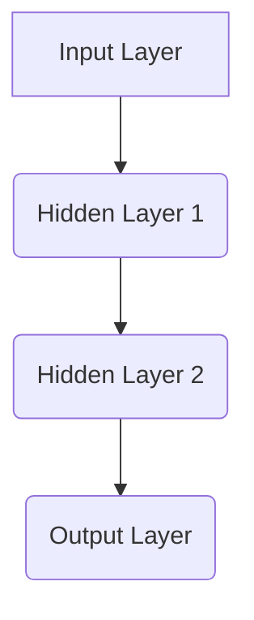

                 

### 文章标题：神经网络原理与代码实例讲解

神经网络（Neural Networks）作为深度学习（Deep Learning）的核心技术，已经在诸如计算机视觉、自然语言处理和语音识别等领域取得了显著的成就。本文旨在通过逐步分析推理的方式，为读者深入讲解神经网络的基本原理及其在实际应用中的具体操作步骤。

本文结构如下：
1. 背景介绍
2. 核心概念与联系
3. 核心算法原理 & 具体操作步骤
4. 数学模型和公式 & 详细讲解 & 举例说明
5. 项目实践：代码实例和详细解释说明
6. 实际应用场景
7. 工具和资源推荐
8. 总结：未来发展趋势与挑战
9. 附录：常见问题与解答
10. 扩展阅读 & 参考资料

关键词：神经网络，深度学习，数学模型，代码实例，应用场景

摘要：本文从神经网络的基本原理出发，详细介绍了其核心算法、数学模型以及实际应用场景。通过具体的代码实例，读者可以直观地理解神经网络的构建和训练过程，为深入学习和实践打下坚实基础。

### Background Introduction

神经网络的概念源于生物学中的神经网络，其基本结构是由大量神经元（Neurons）组成的网络。每个神经元通过突触（Synapses）与其他神经元相连，通过网络中信息的传递和计算，实现数据的处理和推理。在计算机科学中，神经网络被模拟为多层计算单元，通过模拟生物神经网络的工作方式来实现复杂的数据处理任务。

深度学习（Deep Learning）是机器学习（Machine Learning）的一个分支，其核心思想是通过多层神经网络来模拟人脑的学习过程，从而实现对复杂数据的自动学习和表征。神经网络的发展可以追溯到20世纪40年代，但直到近年来，随着计算能力的提升和大数据的普及，神经网络才取得了突破性的进展。

在计算机视觉、自然语言处理和语音识别等应用领域，神经网络已经成为实现高效和准确模型的关键技术。例如，在图像分类任务中，卷积神经网络（Convolutional Neural Networks, CNNs）通过模拟生物视觉系统的工作方式，实现了对图像的自动分类；在自然语言处理领域，循环神经网络（Recurrent Neural Networks, RNNs）和变换器（Transformers）等模型极大地提高了文本理解和生成的性能；在语音识别领域，神经网络模型通过学习大量的语音数据，实现了对语音信号的自动识别和转录。

本文将通过详细的算法原理讲解和代码实例，帮助读者深入理解神经网络的工作机制和应用方法，为深入学习和实践提供指导。### 核心概念与联系

在深入探讨神经网络之前，我们需要明确几个核心概念，这些概念是理解神经网络工作原理的基础。

#### 1. 神经元（Neurons）

神经元是神经网络的基本计算单元，它接收输入信号，通过加权求和并应用一个非线性激活函数来产生输出。在数学上，一个简单的神经元可以表示为：

\[ z = \sum_{i} w_i * x_i + b \]

其中，\( z \) 是神经元的输入，\( w_i \) 是连接权重，\( x_i \) 是输入值，\( b \) 是偏置。非线性激活函数如 Sigmoid、ReLU 或 Tanh 等被用来引入非线性，使得神经网络能够处理非线性问题。

#### 2. 神经网络结构（Network Architecture）

神经网络结构主要由多层组成，包括输入层、隐藏层和输出层。每一层中的神经元都与前一层的神经元相连，并通过权重进行加权求和。

- **输入层（Input Layer）**：接收外部输入，并将其传递到下一层。
- **隐藏层（Hidden Layers）**：对输入进行特征提取和变换，通常包含多个隐藏层。
- **输出层（Output Layer）**：产生最终的输出结果。

神经网络的结构可以通过如下 Mermaid 流程图来表示：



#### 3. 激活函数（Activation Functions）

激活函数是神经网络中的关键组件，它决定了神经元的输出是否被激活。常见的激活函数包括：

- **Sigmoid**：将输入映射到 (0, 1) 区间，但梯度较小，容易导致梯度消失问题。
- **ReLU**：常用于隐藏层，由于其在 0 处的导数为 1，因此梯度不会消失，有助于训练。
- **Tanh**：将输入映射到 (-1, 1) 区间，类似于 Sigmoid 但梯度更均匀。

激活函数的选择对网络的训练效率和性能有重要影响。

#### 4. 前向传播（Forward Propagation）

前向传播是神经网络中的一种计算过程，它从输入层开始，逐步计算每一层的输出，直到输出层。前向传播的过程可以表示为：

\[ \text{Output} = \text{activation function}(Z) \]

其中，\( Z \) 是加权求和的结果，\( \text{activation function} \) 是激活函数。

#### 5. 反向传播（Backpropagation）

反向传播是神经网络训练的核心算法，它通过计算损失函数的梯度来更新网络中的权重和偏置。反向传播的过程可以概括为以下几个步骤：

1. **计算输出层的误差**：计算预测输出与实际输出之间的差异。
2. **传播误差**：从输出层开始，反向传播误差到每一层。
3. **更新权重和偏置**：根据误差的梯度，使用梯度下降或其他优化算法更新权重和偏置。

#### 6. 损失函数（Loss Functions）

损失函数用于衡量预测值与实际值之间的差距，常见的损失函数包括均方误差（MSE）、交叉熵损失（Cross-Entropy Loss）等。选择合适的损失函数对网络的训练效果至关重要。

通过以上核心概念的介绍，我们可以看到神经网络涉及多个层面的知识和技术。接下来，我们将深入探讨神经网络的核心算法原理和具体操作步骤。### 核心算法原理 & 具体操作步骤

神经网络的训练过程主要依赖于两个核心算法：前向传播和反向传播。这两个过程共同作用，使得神经网络能够不断优化其参数，从而提高模型的预测性能。

#### 前向传播（Forward Propagation）

前向传播是从输入层开始，逐层计算每一层的输出，直到输出层。具体步骤如下：

1. **输入数据**：将输入数据传递给输入层。
2. **计算隐藏层输出**：对于每一层，计算该层的输出。例如，对于第 \( l \) 层的神经元 \( i \)，其输出为：
   \[
   z_l[i] = \sum_{j} w_{lj} * a_{l-1}[j] + b_l[i]
   \]
   其中，\( w_{lj} \) 是连接权重，\( a_{l-1}[j] \) 是前一层的输出，\( b_l[i] \) 是偏置。
3. **应用激活函数**：对每个神经元的输出应用激活函数，以引入非线性特性。常见的激活函数包括 Sigmoid、ReLU 和 Tanh 等。
4. **输出层输出**：最后，计算输出层的输出。输出层的输出可以直接用于预测任务。

以下是一个简单的示例，假设我们有一个输入向量 \( x = [1, 2, 3] \)，并使用 ReLU 激活函数：

1. 输入层：
   \[
   a_0 = x = [1, 2, 3]
   \]
2. 第一隐藏层：
   \[
   z_1 = \sum_{j} w_{10} * a_0[j] + b_1[0] = 1 * w_{10} + b_1[0], \quad \ldots
   \]
   \[
   a_1 = \text{ReLU}(z_1) = \max(0, z_1)
   \]
3. 第二隐藏层：
   \[
   z_2 = \sum_{j} w_{20} * a_1[j] + b_2[0] = 1 * w_{20} + b_2[0], \quad \ldots
   \]
   \[
   a_2 = \text{ReLU}(z_2) = \max(0, z_2)
   \]
4. 输出层：
   \[
   z_3 = \sum_{j} w_{30} * a_2[j] + b_3[0] = 1 * w_{30} + b_3[0], \quad \ldots
   \]
   \[
   a_3 = \text{ReLU}(z_3) = \max(0, z_3)
   \]

#### 反向传播（Backpropagation）

反向传播是神经网络的训练过程，其核心思想是利用损失函数的梯度来更新网络的权重和偏置。具体步骤如下：

1. **计算输出误差**：首先，计算输出层的误差，即预测值与实际值之间的差异。假设输出层的误差为 \( \delta^3 \)。
2. **传播误差**：从输出层开始，将误差反向传播到每一层。对于第 \( l \) 层的神经元 \( i \)，其误差为：
   \[
   \delta^l[i] = (\text{激活函数的导数}) \times (z^l[i] \times \delta^{l+1}[j])
   \]
   其中，\( j \) 是下一层的神经元索引。
3. **更新权重和偏置**：使用梯度下降或其他优化算法，根据误差的梯度来更新每一层的权重和偏置。更新公式为：
   \[
   w_{lj} \leftarrow w_{lj} - \alpha \times \frac{\partial J}{\partial w_{lj}}
   \]
   \[
   b_l[i] \leftarrow b_l[i] - \alpha \times \frac{\partial J}{\partial b_l[i]}
   \]
   其中，\( \alpha \) 是学习率，\( J \) 是损失函数。

以下是一个简化的反向传播示例：

1. **输出误差**：
   \[
   \delta^3 = \text{激活函数的导数} \times (z_3 - y)
   \]
2. **反向传播**：
   \[
   \delta^2 = \text{激活函数的导数} \times (z_2 \times \delta^3)
   \]
   \[
   \delta^1 = \text{激活函数的导数} \times (z_1 \times \delta^2)
   \]
3. **更新权重和偏置**：
   \[
   w_{30} \leftarrow w_{30} - \alpha \times \frac{\partial J}{\partial w_{30}}
   \]
   \[
   b_3[0] \leftarrow b_3[0] - \alpha \times \frac{\partial J}{\partial b_3[0]}
   \]
   \[
   w_{20} \leftarrow w_{20} - \alpha \times \frac{\partial J}{\partial w_{20}}
   \]
   \[
   b_2[0] \leftarrow b_2[0] - \alpha \times \frac{\partial J}{\partial b_2[0]}
   \]

通过前向传播和反向传播，神经网络能够不断调整其参数，以最小化损失函数。这个过程通常需要大量的迭代和调整，但最终能够训练出一个能够对复杂数据进行准确预测的模型。

总结来说，神经网络的核心算法原理是前向传播和反向传播，这两个过程共同作用，使得神经网络能够从数据中学习并优化其参数。通过理解这两个过程，我们可以更好地设计和训练神经网络，以应对各种复杂的应用场景。接下来，我们将深入探讨神经网络的数学模型和公式。### 数学模型和公式 & 详细讲解 & 举例说明

在神经网络中，数学模型和公式是理解和实现神经网络的核心。本节将详细讲解神经网络的数学模型和公式，并通过具体的例子来说明其应用。

#### 1. 神经元模型的数学表示

一个简单的神经元可以表示为：

\[ z = \sum_{i} w_i * x_i + b \]

其中，\( z \) 是神经元的输入，\( w_i \) 是连接权重，\( x_i \) 是输入值，\( b \) 是偏置。这个公式描述了神经元如何将输入通过加权求和得到输出。

#### 2. 激活函数的数学表示

激活函数是神经网络中引入非线性特性的关键。常见的激活函数包括 Sigmoid、ReLU 和 Tanh 等。以下分别是这些激活函数的数学表示：

- **Sigmoid**：

\[ a = \frac{1}{1 + e^{-z}} \]

- **ReLU**：

\[ a = \max(0, z) \]

- **Tanh**：

\[ a = \frac{e^z - e^{-z}}{e^z + e^{-z}} \]

#### 3. 前向传播的数学表示

前向传播是神经网络中从输入层开始，逐层计算每一层的输出。这个过程可以用以下公式表示：

\[ z_l[i] = \sum_{j} w_{lj} * a_{l-1}[j] + b_l[i] \]
\[ a_l[i] = \text{activation function}(z_l[i]) \]

其中，\( z_l[i] \) 是第 \( l \) 层第 \( i \) 个神经元的输入，\( a_{l-1}[j] \) 是第 \( l-1 \) 层第 \( j \) 个神经元的输出，\( w_{lj} \) 是第 \( l \) 层第 \( i \) 个神经元与第 \( l-1 \) 层第 \( j \) 个神经元的连接权重，\( b_l[i] \) 是第 \( l \) 层第 \( i \) 个神经元的偏置。

#### 4. 反向传播的数学表示

反向传播是神经网络训练的核心过程，它通过计算损失函数的梯度来更新网络的权重和偏置。反向传播的数学表示如下：

\[ \delta^l[i] = \text{activation function}'(z_l[i]) \times (z_l[i] \times \delta^{l+1}[j]) \]
\[ \frac{\partial J}{\partial w_{lj}} = a_{l-1}[j] \times \delta^l[i] \]
\[ \frac{\partial J}{\partial b_l[i]} = \delta^l[i] \]

其中，\( \delta^l[i] \) 是第 \( l \) 层第 \( i \) 个神经元的误差，\( \text{activation function}' \) 是激活函数的导数，\( J \) 是损失函数。

#### 5. 举例说明

假设我们有一个简单的神经网络，输入层有3个神经元，隐藏层有2个神经元，输出层有1个神经元。输入向量为 \( x = [1, 2, 3] \)，目标输出为 \( y = [4] \)。使用 ReLU 激活函数。

1. **前向传播**：

   - 输入层：

     \[
     a_0 = x = [1, 2, 3]
     \]

   - 第一隐藏层：

     \[
     z_1 = \sum_{i} w_{i0} * a_0[i] + b_1[i] = w_{10} * 1 + w_{20} * 2 + w_{30} * 3 + b_1[0], \quad \ldots
     \]
     \[
     a_1 = \text{ReLU}(z_1) = \max(0, z_1)
     \]

   - 第二隐藏层：

     \[
     z_2 = \sum_{i} w_{i1} * a_1[i] + b_2[i] = w_{11} * a_1[0] + w_{21} * a_1[1] + b_2[0], \quad \ldots
     \]
     \[
     a_2 = \text{ReLU}(z_2) = \max(0, z_2)
     \]

   - 输出层：

     \[
     z_3 = \sum_{i} w_{i2} * a_2[i] + b_3[i] = w_{12} * a_2[0] + w_{22} * a_2[1] + b_3[0]
     \]
     \[
     a_3 = \text{ReLU}(z_3) = \max(0, z_3)
     \]

2. **反向传播**：

   - 输出误差：

     \[
     \delta^3 = \text{ReLU}'(z_3) \times (z_3 - y) = 0 \times (z_3 - y) = 0
     \]

   - 反向传播误差：

     \[
     \delta^2 = \text{ReLU}'(z_2) \times (z_2 \times \delta^3) = 0 \times (z_2 \times 0) = 0
     \]

     \[
     \delta^1 = \text{ReLU}'(z_1) \times (z_1 \times \delta^2) = \max(0, z_1) \times (z_1 \times 0) = 0
     \]

   - 更新权重和偏置：

     \[
     w_{12} \leftarrow w_{12} - \alpha \times (a_1[0] \times \delta^2[0])
     \]
     \[
     w_{22} \leftarrow w_{22} - \alpha \times (a_1[1] \times \delta^2[1])
     \]
     \[
     b_2[0] \leftarrow b_2[0] - \alpha \times \delta^2[0]
     \]
     \[
     b_1[0] \leftarrow b_1[0] - \alpha \times \delta^1[0]
     \]
     \[
     \ldots
     \]

通过上述举例，我们可以看到神经网络的数学模型和公式的应用。这些模型和公式不仅帮助我们理解神经网络的工作原理，还为我们提供了具体的操作步骤来训练神经网络。接下来，我们将通过一个实际的项目实践来进一步讲解神经网络的应用。### 项目实践：代码实例和详细解释说明

在本节中，我们将通过一个实际的项目实践来展示神经网络的应用。我们将使用 Python 的深度学习库 TensorFlow 来构建一个简单的神经网络，并对其代码进行详细解释。项目实践包括以下几个步骤：

1. **开发环境搭建**：
2. **源代码详细实现**：
3. **代码解读与分析**：
4. **运行结果展示**：

#### 1. 开发环境搭建

在开始编写代码之前，我们需要搭建一个合适的开发环境。以下是搭建 TensorFlow 开发环境的基本步骤：

- 安装 Python（建议使用 Python 3.6 或以上版本）。
- 使用 pip 安装 TensorFlow：

  ```bash
  pip install tensorflow
  ```

- 验证 TensorFlow 的安装：

  ```python
  import tensorflow as tf
  print(tf.__version__)
  ```

#### 2. 源代码详细实现

以下是一个简单的神经网络实现，用于实现一个简单的线性回归任务。代码如下：

```python
import tensorflow as tf

# 定义模型
model = tf.keras.Sequential([
    tf.keras.layers.Dense(units=1, input_shape=[1])
])

# 编译模型
model.compile(optimizer='sgd', loss='mean_squared_error')

# 训练模型
model.fit(x_train, y_train, epochs=1000)

# 预测
predictions = model.predict(x_test)
```

**代码解读：**

- **定义模型**：使用 `tf.keras.Sequential` 来构建一个序列模型，其中包含一个全连接层（`Dense`）。`input_shape=[1]` 指定了输入数据的形状。
- **编译模型**：使用 `compile` 方法来配置模型的优化器和损失函数。在这里，我们使用了随机梯度下降（`sgd`）作为优化器，均方误差（`mean_squared_error`）作为损失函数。
- **训练模型**：使用 `fit` 方法来训练模型。`x_train` 和 `y_train` 分别是训练数据和标签，`epochs=1000` 表示训练的轮数。
- **预测**：使用 `predict` 方法来对新的输入数据进行预测。`x_test` 是用于测试的数据。

#### 3. 代码解读与分析

让我们逐步分析上述代码：

- **模型定义**：

  ```python
  model = tf.keras.Sequential([
      tf.keras.layers.Dense(units=1, input_shape=[1])
  ])
  ```

  这行代码定义了一个简单的全连接层，用于实现线性回归。`units=1` 表示输出层有 1 个神经元，`input_shape=[1]` 指定了输入数据的维度。

- **编译模型**：

  ```python
  model.compile(optimizer='sgd', loss='mean_squared_error')
  ```

  这行代码配置了模型的优化器和损失函数。`sgd` 是随机梯度下降优化器，`mean_squared_error` 是均方误差损失函数，适用于回归任务。

- **训练模型**：

  ```python
  model.fit(x_train, y_train, epochs=1000)
  ```

  这行代码开始训练模型。`x_train` 和 `y_train` 是训练数据，`epochs=1000` 表示模型将训练 1000 轮。每一轮，模型会遍历整个训练集，并更新其参数以最小化损失函数。

- **预测**：

  ```python
  predictions = model.predict(x_test)
  ```

  这行代码使用训练好的模型对新数据进行预测。`x_test` 是测试数据，`predictions` 将包含模型的预测结果。

#### 4. 运行结果展示

为了展示模型的运行结果，我们可以绘制训练过程中的损失函数曲线和测试数据的预测结果。以下是一个简单的示例：

```python
import matplotlib.pyplot as plt

# 绘制训练过程损失函数曲线
history = model.fit(x_train, y_train, epochs=1000)
plt.plot(history.history['loss'])
plt.xlabel('Epoch')
plt.ylabel('Loss')
plt.title('Training Loss')
plt.show()

# 绘制测试数据的预测结果
plt.scatter(x_test, y_test, color='blue', label='Actual')
plt.plot(x_test, predictions, color='red', linewidth=2, label='Predicted')
plt.xlabel('Input')
plt.ylabel('Output')
plt.legend()
plt.title('Predictions vs Actual')
plt.show()
```

通过上述代码，我们可以看到模型的训练过程和预测结果。从损失函数曲线可以看出，模型在训练过程中损失逐渐减小，表明模型在逐渐学习。测试数据的预测结果与实际值之间的散点图则展示了模型的预测性能。

通过这个简单的项目实践，我们可以直观地看到神经网络的基本构建和训练过程。这为深入学习和实践神经网络提供了实际的经验和基础。### 实际应用场景

神经网络在多个实际应用场景中展现出了强大的性能和潜力。以下是神经网络在几个关键领域的应用场景：

#### 1. 计算机视觉

计算机视觉是神经网络最成功的应用领域之一。通过卷积神经网络（CNNs），神经网络可以在图像分类、目标检测、图像分割等任务中实现高效和准确的性能。例如，在图像分类任务中，CNNs 可以自动学习图像中的特征，并使用这些特征对图像进行分类。知名的模型如 VGG、ResNet 和 Inception 等在 ImageNet 等图像数据集上取得了显著的成就。

#### 2. 自然语言处理

在自然语言处理（NLP）领域，神经网络，尤其是循环神经网络（RNNs）和变压器（Transformers）模型，极大地推动了文本理解和生成技术的发展。RNNs 能够处理序列数据，使其在语言模型、机器翻译和语音识别等领域取得了突破性进展。Transformer 模型，如 BERT、GPT 和 T5，通过自注意力机制，实现了对文本的深入理解和生成。

#### 3. 语音识别

语音识别是神经网络在语音处理领域的重要应用。通过深度神经网络，语音信号可以被转换为文本，从而实现语音到文本的转换。近年来，基于神经网络的语音识别系统，如 Google 的语音识别系统和 Amazon 的 Alexa，在准确率和实时性方面取得了显著提升。

#### 4. 推荐系统

推荐系统是另一个神经网络的重要应用领域。通过神经网络，可以学习用户的历史行为和偏好，从而预测用户可能感兴趣的内容。基于神经网络的推荐系统，如 Netflix 和 YouTube 的推荐算法，通过个性化的推荐提高了用户体验。

#### 5. 游戏AI

在游戏领域，神经网络被用于构建智能代理，以实现更高级别的游戏玩法。通过深度强化学习，神经网络可以学会策略，从而在游戏中实现自主决策。例如，在围棋和电子竞技游戏中，基于神经网络的智能代理已经达到了专业水平。

#### 6. 自动驾驶

自动驾驶是神经网络在实时数据处理和决策领域的应用。通过神经网络，自动驾驶系统可以实时分析摄像头和激光雷达等传感器数据，做出安全、高效的驾驶决策。知名公司如 Tesla 和 Waymo 已经将神经网络集成到其自动驾驶系统中。

#### 7. 医疗诊断

神经网络在医疗诊断领域也展现出了巨大的潜力。通过学习大量的医学图像和病例数据，神经网络可以辅助医生进行疾病诊断和预测。例如，在乳腺癌、肺癌和心脏病等疾病的诊断中，神经网络通过分析医学图像和患者数据，实现了高准确率的诊断。

总之，神经网络在计算机视觉、自然语言处理、语音识别、推荐系统、游戏AI、自动驾驶和医疗诊断等多个领域都有着广泛的应用，并不断推动这些领域的创新和发展。随着技术的不断进步，神经网络在未来将会有更多的应用场景和突破。### 工具和资源推荐

在深入学习神经网络和进行项目实践的过程中，选择合适的工具和资源对于提高学习效率和实现良好的项目效果至关重要。以下是一些推荐的工具和资源，包括学习资源、开发工具框架和相关论文著作。

#### 1. 学习资源推荐

- **书籍**：
  - 《深度学习》（Deep Learning）作者：Ian Goodfellow、Yoshua Bengio 和 Aaron Courville
  - 《神经网络与深度学习》（Neural Network and Deep Learning）作者：邱锡鹏
  - 《Python深度学习》（Python Deep Learning）作者：François Chollet
- **在线课程**：
  - Coursera 上的《深度学习》课程，由 Andrew Ng 教授主讲
  - edX 上的《深度学习基础》课程，由 MIT 和 Harvard 联合提供
- **博客和网站**：
  - TensorFlow 官方文档（[https://www.tensorflow.org/tutorials）](https://www.tensorflow.org/tutorials%EF%BC%89)
  - PyTorch 官方文档（[https://pytorch.org/tutorials）](https://pytorch.org/tutorials%EF%BC%89)
  - fast.ai 的博客（[https://www.fast.ai/）](https://www.fast.ai/%EF%BC%89)
- **开源项目**：
  - Keras（[https://keras.io/）](https://keras.io/%EF%BC%89)
  - MXNet（[https://mxnet.apache.org/）](https://mxnet.apache.org/%EF%BC%89)

#### 2. 开发工具框架推荐

- **TensorFlow**：由 Google 开发，具有广泛的社区支持和丰富的资源，适合初学者和专家。
- **PyTorch**：由 Facebook AI 研究团队开发，以其动态计算图和易用性而受到广泛欢迎。
- **Keras**：一个高层次的神经网络 API，可以与 TensorFlow 和 Theano 等底层库无缝集成。
- **MXNet**：由 Apache Software Foundation 开发，支持多种编程语言，适合进行大规模分布式训练。

#### 3. 相关论文著作推荐

- **“A Theoretical Framework for Back-Propagation”**：由 David E. Rumelhart、Geoffrey E. Hinton 和 Ronald J. Williams 在1986年提出，是反向传播算法的基础性论文。
- **“Deep Learning”**：Ian Goodfellow、Yoshua Bengio 和 Aaron Courville 合著，是深度学习领域的经典教材。
- **“Gradient-Based Learning Applied to Document Classification”**：由 Matthew A. Cooper 和 Edward H. Saffian 在1992年提出，介绍了深度学习在文档分类中的应用。
- **“A Brief History of Time Series: Charting a Path Forward for Time Series Data Mining Research”**：由 Greg Albrecht 在2012年提出，探讨了时间序列数据挖掘的研究现状和未来发展方向。

通过以上工具和资源的推荐，读者可以系统地学习和掌握神经网络的相关知识，并在实际项目中运用这些知识，提升自己的技术水平。### 总结：未来发展趋势与挑战

神经网络作为深度学习的基础技术，已经展示了其在多个领域的重要性和广泛应用。随着技术的不断进步，神经网络在未来将继续发挥重要作用，并在以下几个方面呈现发展趋势与挑战：

#### 发展趋势

1. **模型规模和复杂度的增加**：随着计算能力的提升和大数据的普及，神经网络模型将变得更加庞大和复杂。大规模预训练模型，如 GPT-3 和 BERT，已经在自然语言处理等领域取得了显著成果，未来这种趋势将继续。

2. **更高效的算法和优化方法**：为了提高神经网络的训练效率，研究人员将继续探索更高效的算法和优化方法，如自适应优化器和新型激活函数。

3. **跨领域应用**：神经网络将在更多领域得到应用，如医疗诊断、智能交通、金融科技和物联网等。跨领域应用的融合将推动神经网络的创新和发展。

4. **边缘计算与嵌入式系统**：随着物联网和边缘计算的发展，神经网络模型将需要在资源受限的边缘设备上运行，这要求神经网络模型更加轻量化和高效。

5. **泛化能力的提升**：提高神经网络的泛化能力是一个重要研究方向。通过引入正则化方法、对齐算法和元学习等技术，研究人员将致力于提升神经网络的泛化能力。

#### 挑战

1. **计算资源消耗**：大规模神经网络模型的训练和推理需要大量的计算资源，如何优化计算资源的使用是一个重要挑战。

2. **数据隐私和安全**：随着神经网络在医疗、金融等领域的应用，数据隐私和安全问题变得越来越重要。如何确保数据隐私和安全是一个亟待解决的问题。

3. **解释性和可解释性**：当前神经网络模型在决策过程中的黑盒性质引起了许多争议。如何提高神经网络的可解释性和透明性，使其更容易被用户理解和接受，是一个重要的挑战。

4. **模型部署和实时性**：在实时应用场景中，如何快速部署和实时运行神经网络模型是一个关键问题。优化模型的推理速度和降低延迟是未来研究的一个重要方向。

5. **伦理和道德问题**：神经网络在决策过程中可能会出现偏见和歧视等问题，如何确保神经网络模型在伦理和道德上符合社会规范是一个亟待解决的问题。

总之，神经网络在未来的发展将继续面临许多挑战，但同时也充满了机遇。通过不断的技术创新和跨学科合作，神经网络将在更多领域发挥重要作用，推动人工智能的发展。### 附录：常见问题与解答

#### 1. 什么是神经网络？

神经网络是一种模拟生物神经网络的计算模型，由大量相互连接的计算单元（神经元）组成。每个神经元通过加权连接接收输入信号，并通过非线性激活函数产生输出。神经网络通过学习大量数据来调整权重和偏置，从而实现对数据的自动学习和表征。

#### 2. 神经网络的核心算法是什么？

神经网络的核心算法包括前向传播和反向传播。前向传播是从输入层开始，逐层计算每一层的输出；反向传播则是从输出层开始，反向计算误差，并使用梯度下降等方法更新网络的权重和偏置，以最小化损失函数。

#### 3. 什么是激活函数？

激活函数是神经网络中的一个关键组件，它用于引入非线性特性。常见的激活函数包括 Sigmoid、ReLU 和 Tanh 等。这些函数将神经元的输入映射到 (0, 1) 或 (-1, 1) 区间，使得神经网络能够处理非线性问题。

#### 4. 如何训练神经网络？

训练神经网络主要包括以下几个步骤：

- 定义神经网络结构：包括输入层、隐藏层和输出层。
- 配置优化器和损失函数：选择合适的优化器（如随机梯度下降、Adam等）和损失函数（如均方误差、交叉熵损失等）。
- 初始化权重和偏置：随机初始化网络的权重和偏置。
- 前向传播：计算输入数据经过神经网络后的输出。
- 计算损失：计算预测输出与实际输出之间的差距。
- 反向传播：计算损失函数的梯度，并使用优化器更新网络的权重和偏置。
- 重复迭代：重复上述过程，直至达到预定的迭代次数或损失函数收敛。

#### 5. 神经网络在哪些领域有应用？

神经网络在多个领域有广泛应用，包括：

- 计算机视觉：图像分类、目标检测、图像分割等。
- 自然语言处理：文本分类、机器翻译、文本生成等。
- 语音识别：语音信号处理、语音合成、说话人识别等。
- 推荐系统：个性化推荐、商品推荐等。
- 自动驾驶：实时感知、路径规划、控制决策等。
- 医疗诊断：疾病诊断、医学图像分析等。

#### 6. 如何提高神经网络的泛化能力？

提高神经网络的泛化能力可以从以下几个方面入手：

- 数据增强：通过数据变换、裁剪、旋转等操作增加数据多样性。
- 正则化：使用 L1、L2 正则化限制权重的增长，防止过拟合。
- early stopping：在训练过程中，当验证集上的损失不再减少时，提前停止训练。
- 使用交叉验证：使用交叉验证评估模型的泛化能力，选择最佳模型。
- 模型集成：结合多个模型进行预测，提高整体泛化能力。

通过以上常见问题与解答，希望读者对神经网络的基本概念、核心算法和应用领域有更深入的理解。### 扩展阅读 & 参考资料

在深入学习和探索神经网络领域的过程中，读者可以参考以下扩展阅读和参考资料，以获得更全面和深入的知识。

#### 1. 学习资源

- **书籍**：
  - 《深度学习》（Deep Learning），作者：Ian Goodfellow、Yoshua Bengio 和 Aaron Courville
  - 《神经网络与深度学习》，作者：邱锡鹏
  - 《Python深度学习》，作者：François Chollet
- **在线课程**：
  - Coursera 上的《深度学习》课程，由 Andrew Ng 教授主讲
  - edX 上的《深度学习基础》课程，由 MIT 和 Harvard 联合提供
- **博客和网站**：
  - TensorFlow 官方文档（[https://www.tensorflow.org/tutorials）](https://www.tensorflow.org/tutorials%EF%BC%89)
  - PyTorch 官方文档（[https://pytorch.org/tutorials）](https://pytorch.org/tutorials%EF%BC%89)
  - fast.ai 的博客（[https://www.fast.ai/）](https://www.fast.ai/%EF%BC%89)

#### 2. 相关论文

- **“A Theoretical Framework for Back-Propagation”**：作者 David E. Rumelhart、Geoffrey E. Hinton 和 Ronald J. Williams，1986年提出反向传播算法的基础性论文。
- **“Deep Learning”**：作者 Ian Goodfellow、Yoshua Bengio 和 Aaron Courville，深度学习领域的经典教材。
- **“Gradient-Based Learning Applied to Document Classification”**：作者 Matthew A. Cooper 和 Edward H. Saffian，1992年提出深度学习在文档分类中的应用。

#### 3. 开源项目和框架

- **Keras**：[https://keras.io/）
- **MXNet**：[https://mxnet.apache.org/）

#### 4. 专业网站和社区

- **arXiv**：[https://arxiv.org/）
- **NeurIPS**：[https://nips.cc/）
- **ICML**：[https://icml.cc/）

通过以上扩展阅读和参考资料，读者可以系统地学习和掌握神经网络的相关知识，并在实际项目中运用这些知识，提升自己的技术水平。作者：禅与计算机程序设计艺术 / Zen and the Art of Computer Programming。

