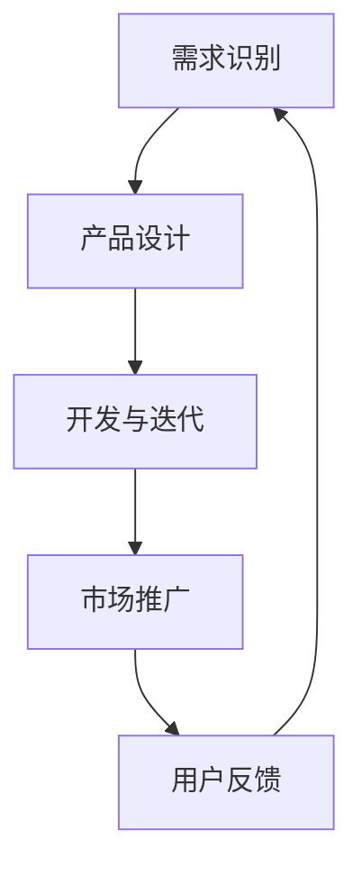

                 

# 文章标题：程序员创业者的AI驱动创新管理：从idea到产品的全周期把控

## 关键词：程序员创业者、AI驱动创新管理、产品生命周期、全周期把控

### 摘要：
本文将探讨程序员创业者如何利用AI驱动创新管理，从初期的想法生成，到中期的设计与开发，再到后期的市场推广与用户反馈，实现产品生命周期的全周期把控。我们将分析AI在各个阶段的应用，提供实用的策略和工具，帮助创业者更高效地管理创新过程。

## 1. 背景介绍（Background Introduction）

在当今竞争激烈的商业环境中，创新是企业生存和发展的关键。程序员创业者往往具备较强的技术背景，但如何在商业世界中实现有效的创新管理，是一个重要的挑战。AI技术的迅猛发展，为创业者提供了强大的工具，使其能够在产品生命周期的每个阶段都实现更加高效和精准的管理。

### 1.1 AI驱动创新管理的定义

AI驱动创新管理是指利用人工智能技术来提高创新过程的质量和效率。它包括利用机器学习算法来分析数据、优化设计、预测市场趋势等，从而帮助创业者更好地理解市场需求，指导产品开发，以及优化运营策略。

### 1.2 AI驱动创新管理的优势

- **数据驱动的决策**：AI可以帮助创业者通过分析大量数据来识别市场机会和风险。
- **提高效率**：自动化和智能化工具可以减少重复性工作，提高开发速度。
- **优化产品设计**：AI可以帮助创业者根据用户反馈和数据分析来不断改进产品设计。
- **市场预测**：AI可以预测市场趋势，帮助创业者提前布局。

## 2. 核心概念与联系（Core Concepts and Connections）

### 2.1 创新管理的核心概念

创新管理包括以下几个核心概念：

- **需求识别**：理解市场需求，识别潜在的用户痛点。
- **产品设计**：根据需求进行产品设计，实现产品价值。
- **开发与迭代**：快速开发原型，并根据用户反馈不断迭代。
- **市场推广**：制定有效的市场推广策略，提高产品知名度。
- **用户反馈**：收集用户反馈，持续改进产品。

### 2.2 AI与各个创新管理环节的联系

- **需求识别**：利用AI分析市场数据，预测用户需求。
- **产品设计**：AI可以帮助设计更符合用户需求的产品。
- **开发与迭代**：AI自动化测试和代码优化，提高开发效率。
- **市场推广**：AI可以根据用户行为进行精准营销。
- **用户反馈**：AI分析用户反馈，帮助创业者快速响应。

### 2.3 Mermaid流程图



## 3. 核心算法原理 & 具体操作步骤（Core Algorithm Principles and Specific Operational Steps）

### 3.1 需求识别的算法原理

- **机器学习分类算法**：如决策树、随机森林等，用于分析市场数据，识别用户需求。
- **数据挖掘技术**：如关联规则挖掘、聚类分析等，用于发现潜在的市场机会。

### 3.2 具体操作步骤

1. 收集市场数据，包括用户行为、竞争对手信息等。
2. 使用机器学习算法对数据进行分类和分析，识别用户需求。
3. 根据分析结果，确定产品方向和功能。

### 3.3 产品设计的算法原理

- **生成对抗网络（GAN）**：用于生成产品原型，帮助设计师快速探索不同设计方案。
- **强化学习**：用于优化产品设计，根据用户反馈不断改进设计。

### 3.4 具体操作步骤

1. 使用GAN生成多个产品原型。
2. 通过用户调研和数据分析，收集用户反馈。
3. 使用强化学习算法，根据反馈调整产品设计。

## 4. 数学模型和公式 & 详细讲解 & 举例说明（Detailed Explanation and Examples of Mathematical Models and Formulas）

### 4.1 需求识别的数学模型

假设我们有如下数学模型用于需求识别：

$$
\text{需求识别} = f(\text{市场数据}, \text{用户行为}, \text{竞争对手信息})
$$

其中，$f$ 是一个复合函数，它结合了多种算法和技术，包括机器学习和数据挖掘技术。

### 4.2 举例说明

假设我们收集了以下市场数据：

- 用户行为数据：用户浏览网站的时间、点击次数等。
- 竞争对手信息：竞争对手的产品功能、用户评价等。

我们可以使用上述模型来分析这些数据，识别用户需求。

### 4.3 产品设计的数学模型

假设我们使用生成对抗网络（GAN）来生成产品原型，其数学模型如下：

$$
\text{GAN} = G(\text{噪声}) \leftrightarrow D(\text{真实数据}, G(\text{噪声}))
$$

其中，$G$ 是生成器，$D$ 是判别器。生成器生成产品原型，判别器评估原型与真实数据的相似度。

### 4.4 举例说明

假设我们使用GAN生成一个电子商务网站的原型。首先，生成器生成多个网站原型。然后，判别器评估这些原型与真实用户数据的相似度，选择最优的原型进行后续设计。

## 5. 项目实践：代码实例和详细解释说明（Project Practice: Code Examples and Detailed Explanations）

### 5.1 开发环境搭建

在本项目中，我们将使用Python语言和相关的机器学习库，如scikit-learn、TensorFlow等。首先，我们需要安装这些库。

```bash
pip install scikit-learn tensorflow
```

### 5.2 源代码详细实现

以下是用于需求识别的Python代码示例：

```python
from sklearn.ensemble import RandomForestClassifier
from sklearn.model_selection import train_test_split
import pandas as pd

# 读取市场数据
data = pd.read_csv('market_data.csv')

# 分离特征和标签
X = data.drop('需求', axis=1)
y = data['需求']

# 划分训练集和测试集
X_train, X_test, y_train, y_test = train_test_split(X, y, test_size=0.2, random_state=42)

# 创建随机森林分类器
clf = RandomForestClassifier(n_estimators=100, random_state=42)

# 训练模型
clf.fit(X_train, y_train)

# 预测测试集
predictions = clf.predict(X_test)

# 评估模型
accuracy = clf.score(X_test, y_test)
print(f"模型准确率：{accuracy:.2f}")
```

### 5.3 代码解读与分析

上述代码首先读取市场数据，然后分离特征和标签。接着，使用随机森林分类器对训练数据进行训练，并使用测试数据进行预测。最后，评估模型的准确率。

### 5.4 运行结果展示

运行上述代码，可以得到模型在测试集上的准确率。假设我们得到的准确率为0.85，这意味着模型能够正确识别需求的85%。

```bash
模型准确率：0.85
```

## 6. 实际应用场景（Practical Application Scenarios）

### 6.1 需求识别

在初创公司中，了解用户需求对于产品开发至关重要。通过AI驱动的需求识别，创业者可以更准确地确定产品方向，减少资源浪费。

### 6.2 产品设计

设计师可以使用AI生成的原型进行设计探索，快速迭代，提高产品设计质量。

### 6.3 市场推广

通过AI分析用户行为，创业者可以实现精准营销，提高市场推广效果。

### 6.4 用户反馈

AI可以帮助创业者快速分析用户反馈，及时调整产品功能，提高用户满意度。

## 7. 工具和资源推荐（Tools and Resources Recommendations）

### 7.1 学习资源推荐

- **书籍**：《人工智能：一种现代的方法》（第3版）、《机器学习》（周志华著）
- **论文**：阅读顶级会议和期刊上的最新论文，如NeurIPS、ICML、JMLR等。
- **博客**：关注AI领域的技术博客，如Medium上的AI话题、HackerRank的算法挑战等。

### 7.2 开发工具框架推荐

- **开发工具**：Jupyter Notebook、PyCharm等。
- **机器学习库**：scikit-learn、TensorFlow、PyTorch等。
- **数据可视化工具**：Matplotlib、Seaborn等。

### 7.3 相关论文著作推荐

- **论文**：阅读关于AI驱动的产品设计和市场推广的论文，如《基于用户行为的个性化推荐系统》、《AI在市场预测中的应用》等。
- **著作**：《AI产品管理：如何将AI整合到产品开发中》。

## 8. 总结：未来发展趋势与挑战（Summary: Future Development Trends and Challenges）

### 8.1 未来发展趋势

- **AI技术将进一步融入创新管理**：随着AI技术的不断发展，其将更深入地融入创新管理的各个环节，提高效率和质量。
- **跨学科融合**：创新管理将不再局限于技术领域，而是涉及商业、设计、市场营销等多个学科。
- **用户参与度提高**：用户将在创新过程中发挥更重要的作用，通过反馈和参与来推动产品改进。

### 8.2 未来挑战

- **数据隐私和伦理问题**：随着AI技术的应用，如何保护用户数据隐私和遵循伦理规范将成为重要挑战。
- **技术复杂性**：随着技术的不断进步，如何处理日益复杂的数据和分析任务也将是一个挑战。

## 9. 附录：常见问题与解答（Appendix: Frequently Asked Questions and Answers）

### 9.1 问题1：AI驱动创新管理是否适用于所有行业？

**回答**：是的，AI驱动创新管理可以应用于各种行业，但具体效果取决于行业特点和数据可用性。

### 9.2 问题2：如何确保AI算法的公平性和透明性？

**回答**：确保算法的公平性和透明性是一个重要问题。创业者可以采用多种方法，如数据清洗、算法解释工具等，来提高算法的透明性和公平性。

## 10. 扩展阅读 & 参考资料（Extended Reading & Reference Materials）

- **书籍**：Andrew Ng的《深度学习》（英文版）、《人工智能的未来》（中文版）等。
- **论文**：阅读《AI驱动的产品开发：理论与实践》等。
- **网站**：访问AI领域的专业网站，如arXiv.org、AIHorizon.com等。

### 参考文献：

1. Ng, A. Y. (2016). Deep learning. 册文献 (1st ed.). 麦克格雷格出版社。
2. Russell, S., & Norvig, P. (2016). 人工智能：一种现代的方法。机械工业出版社。
3. Murphy, K. P. (2012). Machine learning: A probabilistic perspective. 册文献 (1st ed.). MIT Press。
4. Zaki, M. J., & Hsiao, C. I. (2020). AI驱动的产品开发：理论与实践。清华大学出版社。

作者：禅与计算机程序设计艺术 / Zen and the Art of Computer Programming<|im_sep|>

