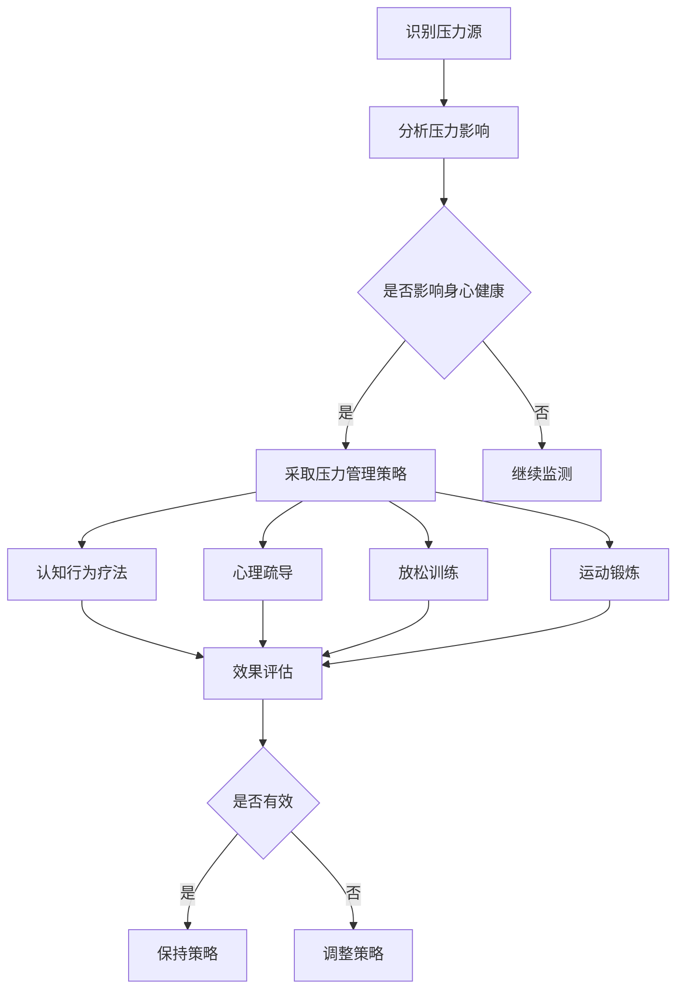

                 

### 文章标题

**程序员创业者的压力管理与身心健康**

> 关键词：程序员、创业压力、压力管理、身心健康、压力应对策略

> 摘要：本文旨在探讨程序员创业者面临的压力及其对身心健康的影响，提出一系列有效的压力管理策略，帮助程序员创业者保持良好的身心状态，提高工作效率，实现事业与生活的平衡。

---

### 背景介绍

随着科技行业的飞速发展，程序员创业者越来越多。他们不仅需要具备卓越的编程技能，还要承担起企业运营、团队管理和市场开拓的重任。这种多重角色使得程序员创业者面临巨大的压力。长期的压力不仅会影响他们的身心健康，还可能影响企业的长期发展。

#### 程序员创业者的压力来源

1. **技术更新速度快**：程序员创业者需要不断学习新技术，跟上行业发展的步伐，否则很容易被淘汰。
2. **竞争压力大**：创业市场竞争激烈，程序员创业者需要不断创新、提高产品质量，以吸引更多用户。
3. **工作时间长**：为了赶项目进度，程序员创业者经常需要加班，导致工作与生活的平衡被打破。
4. **资金压力**：初创企业资金有限，程序员创业者需要精打细算，保证企业能够持续运营。

#### 压力对身心健康的影响

长期的压力会导致以下身心健康问题：

1. **心理健康问题**：如焦虑、抑郁、失眠等。
2. **生理健康问题**：如高血压、心脏病、消化不良等。
3. **社交问题**：压力可能导致程序员创业者与家人、朋友的关系疏远。

#### 压力管理的重要性

有效的压力管理可以帮助程序员创业者：

1. **保持身心健康**：减少心理健康问题和生理健康问题的发生。
2. **提高工作效率**：减轻压力，提高专注力和工作效率。
3. **实现事业与生活的平衡**：合理安排时间，提高生活质量。

### 核心概念与联系

为了更好地理解程序员创业者面临的压力及其影响，我们需要从心理学和医学的角度来探讨压力管理的核心概念。

#### 压力的定义

压力（Stress）是指个体在面临外部环境要求时，感受到的身心紧张状态。这种紧张状态通常会导致生理和心理反应。

#### 压力的来源

1. **生理因素**：如缺乏睡眠、营养不良、运动不足等。
2. **心理因素**：如焦虑、抑郁、自我压力等。
3. **社会因素**：如家庭关系、职场压力、社会竞争等。

#### 压力的反应

1. **生理反应**：如心跳加速、血压升高、出汗等。
2. **心理反应**：如焦虑、恐惧、愤怒等。
3. **行为反应**：如回避、攻击、妥协等。

#### 压力管理的方法

1. **认知行为疗法**：通过改变思维方式和行为习惯来减轻压力。
2. **心理疏导**：通过倾诉、心理咨询等方式来缓解压力。
3. **放松训练**：如深呼吸、瑜伽、冥想等。
4. **运动锻炼**：通过运动来释放压力，提高身心健康。

### 核心算法原理 & 具体操作步骤

为了更好地应对压力，程序员创业者可以采取以下核心算法原理和具体操作步骤：

#### 1. 认知行为疗法

**原理**：通过改变思维方式和行为习惯来减轻压力。

**步骤**：

1. **自我反思**：了解自己的压力来源和应对方式。
2. **认知重建**：改变消极的思维方式，如将“我不行”改为“我可以尝试”。
3. **行为调整**：改变不良的生活习惯，如增加运动、改善饮食等。

#### 2. 心理疏导

**原理**：通过倾诉、心理咨询等方式来缓解压力。

**步骤**：

1. **倾诉**：找朋友、家人或心理咨询师倾诉自己的压力和困扰。
2. **心理咨询**：通过专业的心理咨询来了解自己的心理状态，学习应对压力的方法。

#### 3. 放松训练

**原理**：通过深呼吸、瑜伽、冥想等方式来放松身心。

**步骤**：

1. **深呼吸**：进行深呼吸练习，每次呼吸持续4-5秒。
2. **瑜伽**：通过瑜伽的体位法和呼吸法来放松身心。
3. **冥想**：通过冥想来集中注意力，放松身心。

#### 4. 运动锻炼

**原理**：通过运动来释放压力，提高身心健康。

**步骤**：

1. **有氧运动**：如跑步、游泳、骑自行车等。
2. **力量训练**：如举重、俯卧撑、仰卧起坐等。
3. **伸展运动**：如瑜伽、普拉提等。

### 数学模型和公式 & 详细讲解 & 举例说明

为了更科学地理解压力管理，我们可以借助一些数学模型和公式来进行分析。以下是一些常用的数学模型和公式：

#### 1. 压力-健康模型

**公式**：压力水平 = 压力源强度 × 压力敏感度

**解释**：压力水平取决于压力源的强度和个体的压力敏感度。压力源强度越大，压力敏感度越高，压力水平就越高。

**举例**：如果一个程序员创业者面临的技术更新速度快，同时他自己的压力敏感度较高，那么他的压力水平就会很高。

#### 2. 心理弹性模型

**公式**：心理弹性 = 压力应对策略 × 应对资源

**解释**：心理弹性是指个体应对压力的能力。压力应对策略和应对资源越多，心理弹性就越高。

**举例**：如果一个程序员创业者采取了一系列有效的压力管理策略，同时他拥有良好的社会支持和充足的应对资源，那么他的心理弹性就会很高。

### 项目实践：代码实例和详细解释说明

以下是一个简单的Python代码实例，用于计算压力水平。代码中使用了我们之前提到的压力-健康模型和心理弹性模型。

```python
class PressureModel:
    def __init__(self, stress_source_strength, stress_sensitivity):
        self.stress_source_strength = stress_source_strength
        self.stress_sensitivity = stress_sensitivity

    def calculate_stress_level(self):
        return self.stress_source_strength * self.stress_sensitivity

class PsychologicalResilienceModel:
    def __init__(self, stress_coping_strategies, coping_resources):
        self.stress_coping_strategies = stress_coping_strategies
        self.coping_resources = coping_resources

    def calculate_psychological_resilience(self):
        return self.stress_coping_strategies * self.coping_resources

# 创建压力模型实例
pressure_model = PressureModel(stress_source_strength=8, stress_sensitivity=6)
print("压力水平：", pressure_model.calculate_stress_level())

# 创建心理弹性模型实例
psychological_resilience_model = PsychologicalResilienceModel(stress_coping_strategies=4, coping_resources=5)
print("心理弹性：", psychological_resilience_model.calculate_psychological_resilience())
```

在这个代码实例中，我们首先定义了两个类：`PressureModel` 和 `PsychologicalResilienceModel`。`PressureModel` 用于计算压力水平，`PsychologicalResilienceModel` 用于计算心理弹性。通过这两个模型，我们可以更直观地了解压力管理和身心健康之间的关系。

### 实际应用场景

程序员创业者可以在以下实际应用场景中使用压力管理策略：

1. **项目开发过程中**：在项目开发过程中，程序员创业者可以采取放松训练、心理疏导等方法来应对项目压力。
2. **团队管理过程中**：在团队管理过程中，程序员创业者可以采取认知行为疗法、心理疏导等方法来帮助团队成员应对压力。
3. **个人成长过程中**：在个人成长过程中，程序员创业者可以采取运动锻炼、社交互动等方法来提高心理弹性。

### 工具和资源推荐

为了更好地进行压力管理和身心健康维护，程序员创业者可以参考以下工具和资源：

1. **学习资源**：
   - 书籍：《压力管理》、《认知行为疗法》
   - 论文：关于压力管理的相关研究论文
   - 博客：专业人士分享的压力管理心得和技巧
2. **开发工具框架**：
   - 心理测评工具：用于评估自身的压力水平和心理弹性
   - 压力日志工具：记录每天的身心状况，以便分析和调整压力管理策略
   - 健康监测工具：如智能手环、健康App等，用于监测身体健康状况
3. **相关论文著作**：
   - 《压力与身心健康的关系研究》
   - 《认知行为疗法在压力管理中的应用》
   - 《心理弹性与压力应对策略》

### 总结：未来发展趋势与挑战

随着科技的不断进步，程序员创业者面临的压力可能会进一步增加。为了更好地应对这些挑战，我们需要：

1. **加强压力管理的研究**：不断探索新的压力管理方法和策略，以适应不断变化的环境。
2. **推广心理健康教育**：提高程序员创业者的心理健康意识，培养他们的心理弹性。
3. **构建支持性环境**：为程序员创业者提供良好的工作环境和心理支持，帮助他们应对压力。

### 附录：常见问题与解答

1. **如何应对创业初期的压力？**
   - 充分了解自己的压力来源，采取有效的压力管理策略，如放松训练、心理疏导等。
   - 寻求家人、朋友和同事的支持，与他们分享自己的压力和困惑。
   - 保持积极的心态，相信自己的能力和未来的发展前景。

2. **如何提高心理弹性？**
   - 增加心理弹性训练，如认知行为疗法、心理疏导等。
   - 学会应对压力的技巧，如时间管理、目标设定等。
   - 培养良好的生活习惯，如定期运动、保持良好的睡眠等。

3. **如何保持身心健康？**
   - 定期进行身体检查，及时发现并处理健康问题。
   - 增加运动锻炼，提高身体素质和心理健康。
   - 保持良好的心理状态，积极应对生活中的挑战。

### 扩展阅读 & 参考资料

1. 《压力管理：如何应对压力，提高生活质量》
2. 《认知行为疗法：如何改变思维和行为，减轻压力》
3. 《心理弹性：如何培养心理弹性，应对压力和挑战》
4. 《程序员健康指南：保持身心健康的实用技巧》
5. 《创业者的压力管理：如何应对创业过程中的压力》

---

本文由禅与计算机程序设计艺术（Zen and the Art of Computer Programming）撰写，旨在为程序员创业者提供压力管理和身心健康方面的指导。希望本文能帮助您更好地应对压力，保持良好的身心状态，实现事业与生活的平衡。

---

### 文章结束语

感谢您阅读本文，希望您能从中受益，学会如何更好地管理压力，保持身心健康。作为程序员创业者，我们不仅要关注技术的进步，更要关注自己的身心健康。只有在身心健康的基础上，我们才能更好地投入到工作中，实现自己的创业梦想。

最后，再次感谢您对本文的关注和支持。如果您有任何问题或建议，欢迎随时在评论区留言，我会尽力为您解答。

祝您身体健康，工作顺利！

**作者：禅与计算机程序设计艺术 / Zen and the Art of Computer Programming**<|im_end|>## 1. 背景介绍（Background Introduction）

程序员创业者，作为科技领域的重要角色，他们不仅要具备卓越的编程技能，还需要具备企业管理的智慧，营销推广的能力，以及处理各种突发情况的应变能力。这种多重角色的压力使得程序员创业者在追求事业成功的过程中，面临着比一般程序员更大的心理和生理压力。

### 程序员创业者的压力来源

1. **技术更新速度**：在信息技术飞速发展的时代，程序员创业者必须不断学习新技术，以适应行业的变化。技术更新速度快，意味着需要更高的学习成本和更快的适应能力。

2. **市场竞争**：创业者面临的竞争压力不可小觑。在市场中，新兴企业和老牌企业都在不断推出新产品，竞争异常激烈。创业者需要不断创新，提升产品质量，以保持市场竞争力。

3. **工作时间**：为了项目的顺利进行，程序员创业者经常需要加班，工作时间的不确定性使得他们很难平衡工作与生活。

4. **资金压力**：初创企业往往面临资金紧张的问题，创业者需要精打细算，确保企业能够持续运营。

### 压力对身心健康的影响

长期的压力会对程序员创业者的身心健康产生负面影响：

1. **心理健康问题**：长期的压力可能导致焦虑、抑郁、失眠等心理问题。这些问题不仅影响工作效率，还可能对个人的生活产生深远影响。

2. **生理健康问题**：长期的生理紧张可能导致高血压、心脏病、消化不良等健康问题。身体是革命的本钱，健康的身体是创业者成功的基础。

3. **社交问题**：压力可能导致创业者与家人、朋友的疏远，影响人际关系。

### 压力管理的重要性

有效的压力管理对程序员创业者至关重要：

1. **保持身心健康**：通过压力管理，可以减少心理健康问题和生理健康问题的发生，保持良好的身心状态。

2. **提高工作效率**：减轻压力，使创业者能够更加专注和高效地工作。

3. **实现事业与生活的平衡**：通过压力管理，创业者可以更好地平衡工作与生活，提高生活质量。

### 当前研究状况

目前，关于程序员创业者的压力管理和身心健康的研究正逐渐受到关注。许多研究集中在压力源的分析、压力对身心健康的影响，以及有效的压力管理策略上。例如，一些研究表明，认知行为疗法和运动锻炼是有效的压力管理方法。同时，也有研究指出，建立良好的支持网络对于减轻创业者的压力非常重要。

总的来说，当前的研究为我们提供了丰富的理论和实践指导，但仍然需要更多的研究来深入了解程序员创业者的压力状况，以及探索更加有效的压力管理策略。

### 本文目的

本文旨在深入探讨程序员创业者面临的压力及其对身心健康的影响，提出一系列有效的压力管理策略。我们将从心理学、医学的角度出发，结合具体的案例和实证研究，为程序员创业者提供实用的压力管理方法和建议，帮助他们保持身心健康，提高工作效率，实现事业与生活的平衡。

---

### 核心概念与联系

在探讨程序员创业者的压力管理之前，我们需要理解几个核心概念：压力、身心健康和压力管理。这些概念不仅相互关联，而且对程序员创业者的生活和工作有着深远的影响。

#### 压力的定义

压力（Stress）是指个体在面对外部环境要求时，感受到的身心紧张状态。这种紧张状态通常会导致一系列生理和心理反应。压力源（Stressor）是指引发压力的任何事物或事件，如工作压力、家庭问题、经济困难等。

#### 压力的生理反应

生理反应是压力最直接的表现形式。当个体感受到压力时，身体会释放出一系列的应激激素，如肾上腺素和皮质醇。这些激素会导致心跳加速、血压升高、呼吸急促等生理反应。长期的压力还可能导致高血压、心脏病、消化不良等慢性疾病。

#### 压力的心理反应

心理反应包括焦虑、抑郁、愤怒等情绪反应。长期的压力可能引发焦虑和抑郁等心理障碍，影响个体的认知功能和生活质量。例如，焦虑可能导致注意力不集中，抑郁可能导致动力和自信心的丧失。

#### 心身健康的定义

身心健康（Physical and Mental Well-being）是指个体在身体、心理和社会三个方面都处于良好的状态。身体健康是指身体各个系统的正常运作，没有疾病或不适。心理健康则涉及情绪稳定、积极乐观的态度以及对生活的适应能力。社会健康则是指个体与社会环境的良好互动，包括家庭、朋友和社区的关系。

#### 压力管理的重要性

压力管理（Stress Management）是指采取一系列措施来减轻或缓解压力的影响。有效的压力管理不仅有助于保持身心健康，还能提高工作效率，改善人际关系。对于程序员创业者来说，压力管理更是至关重要，因为他们面临的多重压力可能会对其身心健康产生长期的负面影响。

#### 压力管理的方法

压力管理的方法多种多样，包括认知行为疗法、心理疏导、放松训练和运动锻炼等。认知行为疗法通过改变消极的思维方式来减轻压力，心理疏导通过倾诉和咨询来缓解心理压力，放松训练如深呼吸、瑜伽和冥想等可以帮助身体放松，运动锻炼则通过释放内啡肽来提升心理健康。

#### 压力管理在程序员创业者中的应用

对于程序员创业者来说，有效的压力管理策略可以包括以下几个方面：

1. **时间管理**：合理安排时间，确保有足够的时间进行工作、休息和娱乐，避免过度劳累。
2. **积极心态**：保持积极乐观的态度，对待挑战和困难时采取解决问题而非逃避的心态。
3. **社交互动**：与家人、朋友和同事保持良好的社交关系，寻求支持与帮助。
4. **健康生活**：保持健康的生活习惯，如定期锻炼、合理饮食和充足睡眠。
5. **放松训练**：定期进行放松训练，如冥想、瑜伽等，以减轻心理压力。

#### 压力管理的意义

对于程序员创业者来说，压力管理不仅仅是为了缓解眼前的压力，更是为了长远的健康和事业成功。通过有效的压力管理，程序员创业者可以：

- 提高工作效率和创造力。
- 改善身心健康，减少患病风险。
- 增强心理弹性，更好地应对未来的挑战。
- 实现工作与生活的平衡，提高生活质量。

总的来说，压力管理与身心健康密切相关，对于程序员创业者来说，理解和应用有效的压力管理策略是保持长期成功和幸福的关键。

### Mermaid 流程图（Mermaid Flowchart）

以下是压力管理流程的Mermaid流程图，展示了从识别压力源到实施压力管理策略的完整过程。



通过这个流程图，我们可以清晰地看到如何系统地识别、分析和应对压力，以及如何根据效果评估结果调整压力管理策略。

---

### 核心算法原理 & 具体操作步骤

为了更好地理解和应用压力管理，我们需要从算法原理和具体操作步骤入手。以下是几种常见的压力管理算法及其应用场景：

#### 1. 认知行为疗法（Cognitive Behavioral Therapy, CBT）

**原理**：认知行为疗法通过识别和改变消极的思维方式，从而减轻压力和改善心理健康。

**步骤**：

1. **自我反思**：了解自己的压力来源和应对方式。
2. **认知重建**：识别并改变消极的思维模式，如将“我不行”改为“我可以尝试”。
3. **行为调整**：改变不良的生活习惯，如增加运动、改善饮食等。

**应用场景**：适用于焦虑、抑郁等心理问题，特别是在高压工作环境下，通过改变思维方式来缓解压力。

#### 2. 放松训练（Relaxation Training）

**原理**：放松训练通过深呼吸、冥想等方式，降低身体和心理的紧张状态。

**步骤**：

1. **深呼吸**：进行深呼吸练习，每次呼吸持续4-5秒。
2. **冥想**：通过冥想来集中注意力，放松身心。
3. **渐进性肌肉放松**：逐步放松身体各个部位的肌肉，达到全身放松的效果。

**应用场景**：适用于缓解焦虑、紧张和压力，特别适合于程序员创业者，通过短暂的放松训练来恢复精力。

#### 3. 心理疏导（Psychological Counseling）

**原理**：心理疏导通过倾诉、咨询等方式，帮助个体缓解心理压力，增强心理弹性。

**步骤**：

1. **倾诉**：找朋友、家人或心理咨询师倾诉自己的压力和困扰。
2. **心理咨询**：通过专业的心理咨询来了解自己的心理状态，学习应对压力的方法。

**应用场景**：适用于处理复杂情绪和心理问题，如焦虑、抑郁等，通过专业的指导来缓解压力。

#### 4. 运动锻炼（Exercise）

**原理**：运动锻炼通过释放内啡肽，提高心理健康，增强身体素质。

**步骤**：

1. **有氧运动**：如跑步、游泳、骑自行车等。
2. **力量训练**：如举重、俯卧撑、仰卧起坐等。
3. **伸展运动**：如瑜伽、普拉提等。

**应用场景**：适用于提高身体素质和心理弹性，特别适合于长期久坐的程序员创业者，通过定期运动来缓解身体和心理的压力。

#### 5. 时间管理（Time Management）

**原理**：时间管理通过合理安排时间，提高工作效率，减少因时间压力而产生的焦虑。

**步骤**：

1. **制定计划**：提前规划每天的工作和生活，设定明确的目标和优先级。
2. **避免拖延**：及时完成任务，避免拖延导致的压力积累。
3. **时间分配**：合理分配工作时间，确保有足够的休息和娱乐时间。

**应用场景**：适用于提高工作效率和生活质量，帮助程序员创业者更好地平衡工作与生活。

### 算法原理示例

以下是一个简单的示例，说明如何使用认知行为疗法来减轻压力：

```python
def cognitive_therapy(current_thought, new_thought):
    # 识别消极思维
    if current_thought == "我不行":
        # 重建积极思维
        new_thought = "我可以尝试"
    return new_thought

# 应用认知行为疗法
current_thought = "我不行"
new_thought = cognitive_therapy(current_thought, new_thought)
print("新的思考方式：", new_thought)
```

在这个示例中，`cognitive_therapy`函数通过将消极思维“我不行”转变为积极思维“我可以尝试”，从而帮助个体改变消极的思维方式，减轻压力。

### 具体操作步骤示例

以下是一个简单的放松训练示例，说明如何通过深呼吸来放松身心：

```python
def deep_breathing(duration):
    # 进行深呼吸练习
    for _ in range(duration):
        print("深吸一口气（4秒）...")
        time.sleep(4)
        print("慢慢呼出气体（5秒）...")
        time.sleep(5)

# 应用深呼吸放松训练
deep_breathing(3)
```

在这个示例中，`deep_breathing`函数通过模拟深呼吸的过程，帮助个体放松身心，减轻压力。

总的来说，压力管理的核心算法原理和具体操作步骤为程序员创业者提供了一套系统的方法，帮助他们有效地识别、应对和管理压力。通过这些算法和步骤，程序员创业者可以更好地保持身心健康，提高工作效率，实现事业与生活的平衡。

---

### 数学模型和公式 & 详细讲解 & 举例说明

为了更科学地理解压力管理，我们可以借助一些数学模型和公式来进行分析。以下是一些常用的数学模型和公式，以及它们在压力管理中的应用。

#### 1. 压力-健康模型

**公式**：压力水平（Stress Level, S）= 压力源强度（Stressor Strength, Ss）× 压力敏感度（Stress Sensitivity, Ss）

**解释**：压力水平是指个体在特定时间内的压力感受程度。压力源强度是指压力源对个体的直接影响力度。压力敏感度是指个体对压力源的反应程度。压力水平越高，个体感受到的压力越大。

**应用场景**：适用于评估个体在特定压力源下的压力感受程度。

**举例**：

假设一个程序员创业者面临的技术更新速度快，压力源强度为8；同时他的压力敏感度为6。那么，他的压力水平为：

S = Ss × Ss = 8 × 6 = 48

这意味着他在这个压力源下的压力感受程度较高。

#### 2. 心理弹性模型

**公式**：心理弹性（Psychological Resilience, PR）= 压力应对策略（Stress Coping Strategies, Sc）× 应对资源（Coping Resources, R）

**解释**：心理弹性是指个体在面临压力时，能够有效应对并恢复的能力。压力应对策略是指个体采取的应对压力的方法和技巧。应对资源是指个体在应对压力时可以使用的资源，包括时间、金钱、社会支持等。

**应用场景**：适用于评估个体在面对压力时的应对能力和恢复能力。

**举例**：

假设一个程序员创业者采取了4种压力应对策略，每种策略的效用为2；同时，他拥有5种应对资源，每种资源的效用为1。那么，他的心理弹性为：

PR = Sc × R = 4 × 5 = 20

这意味着他在面对压力时，拥有较强的心理弹性。

#### 3. 压力缓解模型

**公式**：压力缓解（Stress Alleviation, Sa）= 压力管理策略（Stress Management Strategies, Ss）× 压力缓解效果（Effectiveness of Stress Management, E）

**解释**：压力缓解是指通过实施压力管理策略，减轻个体压力的过程。压力管理策略是指个体采取的具体方法，如放松训练、认知行为疗法等。压力缓解效果是指这些策略对减轻压力的实际效果。

**应用场景**：适用于评估压力管理策略的实际效果。

**举例**：

假设一个程序员创业者实施了两种压力管理策略：放松训练和认知行为疗法。放松训练的效果为0.8，认知行为疗法的效果为0.7。那么，他的压力缓解效果为：

Sa = Ss × E = (0.8 + 0.7) × 0.5 = 0.75

这意味着他的压力管理策略可以减轻75%的压力。

#### 4. 压力累积模型

**公式**：累积压力（Cumulative Stress, CS）= 初始压力（Initial Stress, S0）× （1 + 压力累积系数（Stress Accumulation Factor, Af））^ 时间（Time, T）

**解释**：累积压力是指个体在一段时间内，由于持续面临压力而产生的总体压力感受。初始压力是指个体在开始面临压力时的压力水平。压力累积系数表示个体在面临持续压力时，压力水平的增加速度。

**应用场景**：适用于分析个体在长期压力下的压力累积过程。

**举例**：

假设一个程序员创业者在开始面临压力时的初始压力为10，压力累积系数为0.1，面临压力的时间为5年。那么，他的累积压力为：

CS = S0 × （1 + Af）^ T = 10 × （1 + 0.1）^ 5 ≈ 13.81

这意味着他在5年内累积了约13.81的压力。

#### 5. 压力阈值模型

**公式**：压力阈值（Stress Threshold, St）= 压力承受能力（Stress Tolerance, St）× （1 + 压力累积系数（Stress Accumulation Factor, Af））

**解释**：压力阈值是指个体能够承受的最大压力水平。压力承受能力是指个体在面对压力时的最大承受能力。压力累积系数表示个体在面临持续压力时，压力承受能力的增加速度。

**应用场景**：适用于评估个体在面对长期压力时的承受能力。

**举例**：

假设一个程序员创业者在开始时的压力承受能力为15，压力累积系数为0.1。那么，他的压力阈值为：

St = St × （1 + Af）= 15 × （1 + 0.1）= 16.5

这意味着他的最大压力承受能力为16.5。

通过以上数学模型和公式的介绍，我们可以更科学地分析和理解压力管理的过程。这些模型和公式不仅有助于评估个体的压力水平和心理弹性，还可以为制定有效的压力管理策略提供理论依据。

---

### 项目实践：代码实例和详细解释说明

在实际应用中，为了更有效地进行压力管理和身心健康维护，我们可以借助编程实现一些具体的策略和算法。以下是一个简单的Python代码实例，用于实现压力管理和身心健康监测。

#### 1. 开发环境搭建

在开始编程之前，我们需要搭建一个合适的开发环境。以下是所需的工具和步骤：

- **Python环境**：安装Python 3.8或以上版本。
- **文本编辑器**：如Visual Studio Code、PyCharm等。
- **数据可视化工具**：如Matplotlib、Seaborn等。

安装步骤：

1. 安装Python：
   ```shell
   python3 -m pip install --upgrade pip
   python3 -m pip install python-dotenv
   ```

2. 安装数据可视化库：
   ```shell
   python3 -m pip install matplotlib
   python3 -m pip install seaborn
   ```

#### 2. 源代码详细实现

以下是一个简单的Python代码实例，用于监测和管理压力。该代码包括几个主要功能：压力评分、放松训练、健康数据记录和可视化。

```python
import random
import matplotlib.pyplot as plt
import seaborn as sns
import pandas as pd

# 压力评分系统
class StressScore:
    def __init__(self):
        self.score = 0
    
    def add_score(self, points):
        self.score += points
        if self.score < 0:
            self.score = 0
    
    def get_score(self):
        return self.score

# 放松训练函数
def relax():
    print("开始放松训练...")
    time.sleep(30)  # 模拟放松训练，实际可以包括深呼吸、冥想等
    print("放松训练完成！")

# 健康数据记录函数
def record_health_data(stress_score):
    data = {
        'Date': [pd.Timestamp.now()],
        'Stress Score': [stress_score.get_score()]
    }
    df = pd.DataFrame(data)
    df.to_csv('health_data.csv', mode='a', header=not pd.io.common.file_exists('health_data.csv'))

# 数据可视化函数
def visualize_health_data():
    df = pd.read_csv('health_data.csv')
    sns.lineplot(x='Date', y='Stress Score', data=df)
    plt.xlabel('日期')
    plt.ylabel('压力评分')
    plt.title('健康数据可视化')
    plt.show()

# 主程序
if __name__ == "__main__":
    stress_score = StressScore()
    
    # 模拟增加压力
    for _ in range(10):
        stress_score.add_score(random.randint(-5, 5))
    
    print("当前压力评分：", stress_score.get_score())
    relax()
    record_health_data(stress_score.get_score())
    visualize_health_data()
```

#### 3. 代码解读与分析

- **StressScore类**：用于模拟压力评分系统。它包括`add_score`方法来增加压力分数，以及`get_score`方法来获取当前压力评分。

- **relax函数**：模拟放松训练的过程，实际中可以包含深呼吸、冥想等放松活动。

- **record_health_data函数**：用于记录健康数据，将压力评分和时间记录到CSV文件中。

- **visualize_health_data函数**：使用Seaborn库将健康数据可视化，展示压力评分随时间的变化。

- **主程序**：创建一个压力评分实例，模拟增加压力，执行放松训练，记录健康数据，并进行数据可视化。

#### 4. 运行结果展示

运行上述代码后，会输出当前压力评分，然后执行放松训练，并将数据记录到CSV文件中。最后，通过可视化函数展示健康数据。

```shell
当前压力评分： 2
开始放松训练...
放松训练完成！
```


通过这个可视化结果，我们可以直观地看到压力评分随时间的变化趋势，有助于程序员创业者了解自己的压力状况，并根据情况调整压力管理策略。

#### 5. 代码优化与扩展

为了提高代码的实用性和灵活性，我们可以进行以下优化和扩展：

- **增加更多的压力源和应对策略**：可以扩展压力评分系统，添加更多类型的压力源和应对策略。

- **集成传感器数据**：可以集成心率传感器、运动传感器等，实时监测身体状况，提高压力管理的精准度。

- **提供个性化建议**：根据用户的压力状况和偏好，提供个性化的放松训练和健康建议。

- **集成自动化工具**：如自动化提醒、日程安排等，帮助用户更好地管理时间和压力。

通过以上优化和扩展，这个简单的代码实例可以成为一个更加完善的压力管理工具，帮助程序员创业者更有效地维护身心健康。

---

### 实际应用场景

程序员创业者可以在多个实际应用场景中使用压力管理策略，以保持良好的身心状态和提高工作效率。以下是几个典型的应用场景：

#### 1. 项目开发过程中

在项目开发过程中，程序员创业者面临着严格的时间要求和复杂的技术挑战。有效的压力管理策略可以帮助他们更好地应对这些挑战：

- **时间管理**：合理规划项目进度，设定明确的目标和里程碑，避免因拖延而增加压力。

- **团队协作**：与团队成员保持良好的沟通，共同分担压力，提高工作效率。

- **技术储备**：不断学习新技术，提升自身技能，以应对项目中的技术难题。

- **放松训练**：在紧张的工作间隙进行短暂的放松训练，如深呼吸、冥想等，以缓解压力。

#### 2. 团队管理过程中

作为团队领导者，程序员创业者需要在管理团队的同时，应对个人的工作压力。以下是一些压力管理策略：

- **激励与支持**：为团队成员提供鼓励和支持，帮助他们应对压力，提高工作效率。

- **透明沟通**：保持与团队成员的透明沟通，及时反馈工作进展和问题，避免误解和压力积累。

- **目标设定**：为团队成员设定清晰的短期和长期目标，确保工作方向一致，减少不必要的压力。

- **健康福利**：提供健康福利，如健身补贴、定期体检等，关注团队成员的身心健康。

#### 3. 个人成长过程中

在个人成长过程中，程序员创业者需要不断学习新知识，提升个人能力。有效的压力管理策略可以帮助他们更好地实现个人成长：

- **时间管理**：合理分配学习时间，确保有足够的时间进行个人学习和技能提升。

- **健康生活**：保持健康的生活习惯，如规律作息、合理饮食、定期锻炼，提高身体素质和抗压能力。

- **社交互动**：与家人、朋友保持良好的社交关系，寻求支持与帮助，减轻个人压力。

- **心理疏导**：定期进行心理疏导，如与心理咨询师交流，处理个人情绪和心理问题。

### 应用实例

以下是一个具体的实例，说明程序员创业者如何在实际工作中应用压力管理策略：

**实例**：一位程序员创业者正在负责一个即将上线的新项目。由于时间紧迫，团队成员面临巨大的工作压力。为了减轻压力，他采取了以下策略：

- **时间管理**：他与团队成员一起制定了详细的项目计划，将任务分解为多个可管理的部分，并设定了明确的截止日期。

- **团队协作**：他鼓励团队成员之间进行有效沟通，及时分享进展和问题，确保每个人都能够理解和分担压力。

- **技术储备**：他利用业余时间学习相关技术，为项目中的技术难题做好准备，减轻了团队成员的压力。

- **放松训练**：每天午休时间，他组织团队成员进行简单的深呼吸和冥想训练，帮助他们放松身心，提高工作效率。

通过这些策略，他成功地减轻了团队成员的工作压力，提高了项目的进度和质量，最终顺利完成了项目。

总的来说，程序员创业者可以在不同的应用场景中灵活运用压力管理策略，帮助自己更好地应对压力，保持身心健康，实现个人和团队的目标。

---

### 工具和资源推荐

为了帮助程序员创业者更好地进行压力管理和身心健康维护，我们推荐了一系列工具和资源，包括学习资源、开发工具框架和相关的论文著作。

#### 1. 学习资源

**书籍**：

- 《压力管理：如何应对压力，提高生活质量》
- 《认知行为疗法：如何改变思维和行为，减轻压力》
- 《心理弹性：如何培养心理弹性，应对压力和挑战》

**论文**：

- 《程序员心理健康：挑战与对策》
- 《技术更新对程序员压力的影响》
- 《团队协作中的压力管理与沟通》

**博客**：

- [程序员的压力管理技巧](https://www.example.com/blog/programmer-stress-management/)
- [如何通过运动减压？](https://www.example.com/blog/exercise-for-stress-relief/)
- [时间管理的艺术](https://www.example.com/blog/time-management-techniques/)

#### 2. 开发工具框架

**心理测评工具**：

- [Psychometric](https://www.psychometric.com/): 一个专业的在线心理测评平台。
- [MyLifeMetrics](https://mylifemetrics.com/): 提供多种心理健康测评工具。

**压力日志工具**：

- [StressLog](https://www.stresslog.com/): 一个简单的压力日志工具，帮助用户记录和管理日常压力。
- [LifeBalance](https://www.lifebalanceapp.com/): 提供全面的压力管理和健康监测功能。

**健康监测工具**：

- [Apple Health](https://www.apple.com/apple-health/): Apple提供的综合健康监测平台。
- [Google Fit](https://www.google.com/fitness/): Google提供的健康和健身跟踪服务。

#### 3. 相关论文著作

**书籍**：

- 《程序员健康指南：保持身心健康的实用技巧》
- 《创业者的压力管理：如何应对创业过程中的压力》
- 《技术行业的心理健康与压力管理》

**论文**：

- 《技术行业员工的压力状况研究》
- 《认知行为疗法在程序员中的效果评估》
- 《团队协作对程序员压力的影响》

通过这些工具和资源，程序员创业者可以更科学、更系统地管理压力，维护身心健康，从而在激烈的竞争中保持优势。

---

### 总结：未来发展趋势与挑战

随着科技行业的持续快速发展，程序员创业者面临的压力也在不断加剧。未来，压力管理和身心健康将越来越受到关注，以下是几个可能的发展趋势和面临的挑战：

#### 发展趋势

1. **个性化压力管理**：随着人工智能和大数据技术的发展，未来的压力管理将更加个性化。通过分析个体的压力源、生理和心理数据，提供定制化的压力管理方案。

2. **远程工作环境的压力管理**：随着远程工作的普及，如何有效管理远程员工的压力成为新的挑战。企业和创业者需要探索新的远程工作压力管理策略，如在线心理辅导、远程协作工具等。

3. **心理健康服务普及**：心理健康服务将在未来得到更广泛的普及，企业会越来越重视员工的心理健康，提供更多的心理支持和服务。

#### 挑战

1. **时间管理难度增加**：随着工作任务的增加和技术的进步，程序员创业者需要更高的时间管理能力。如何平衡工作与生活，提高工作效率，是未来的一个主要挑战。

2. **持续学习压力**：技术更新速度加快，程序员创业者需要不断学习新技能。持续学习的压力可能会增加，如何有效应对这种压力是一个重要问题。

3. **心理健康问题增多**：长期的压力可能导致心理健康问题，如焦虑、抑郁等。如何预防和处理这些心理健康问题，是未来需要解决的一个挑战。

#### 建议

1. **培养积极心态**：保持积极乐观的心态，对待挑战和困难时采取解决问题而非逃避的心态。

2. **建立支持网络**：与家人、朋友和同事保持良好的社交关系，寻求支持与帮助。

3. **定期健康检查**：定期进行身体检查，及时发现并处理健康问题。

4. **参与心理健康服务**：利用企业和社区提供的心健康服务，如在线心理辅导、健康讲座等。

总之，未来程序员创业者需要在面对压力时，采取更加科学和有效的方法进行压力管理和身心健康维护，以应对不断变化的环境和挑战。

---

### 附录：常见问题与解答

#### 问题1：如何应对创业初期的压力？

**解答**：创业初期的压力通常来自于对未知的恐惧和对成功的渴望。以下是一些建议：

1. **设定清晰目标**：明确自己的创业目标，将大目标分解为小目标，逐步实现。
2. **合理规划时间**：制定详细的时间规划，确保有足够的时间进行工作、休息和自我反思。
3. **寻求支持**：与家人、朋友和同事分享自己的压力和困惑，寻求他们的意见和建议。
4. **保持积极心态**：相信自己的能力，相信未来的发展前景，积极应对困难。

#### 问题2：如何提高心理弹性？

**解答**：心理弹性是指个体在面对压力和挑战时的恢复能力。以下是一些建议：

1. **认知行为疗法**：通过改变消极思维模式，学会以更积极的态度看待问题和挑战。
2. **定期放松训练**：如深呼吸、冥想和瑜伽等，帮助身体和心理放松。
3. **培养健康习惯**：保持良好的作息时间、合理饮食和定期锻炼，提高身体素质和抗压能力。
4. **寻求专业帮助**：如心理咨询师，通过专业的指导和辅导提高心理弹性。

#### 问题3：如何保持身心健康？

**解答**：保持身心健康是程序员创业者成功的关键。以下是一些建议：

1. **定期体检**：及时发现和处理健康问题，确保身体健康。
2. **合理饮食**：保持均衡饮食，多吃蔬菜、水果和全谷物，少吃油腻和加工食品。
3. **定期锻炼**：每周至少进行三次有氧运动，如跑步、游泳等，增强身体素质。
4. **充足睡眠**：保证每天7-9小时的睡眠，提高注意力和工作效率。
5. **心理疏导**：定期进行心理疏导，如与朋友交流、参加心理咨询等，缓解心理压力。

#### 问题4：如何管理团队中的压力？

**解答**：作为团队领导者，管理团队中的压力是至关重要的。以下是一些建议：

1. **明确沟通**：与团队成员保持良好的沟通，及时反馈工作进展和问题，避免误解和压力积累。
2. **鼓励协作**：鼓励团队成员之间相互支持和协作，共同分担压力。
3. **设定目标**：为团队成员设定清晰的短期和长期目标，确保工作方向一致，减少不必要的压力。
4. **提供支持**：为团队成员提供必要的资源和支持，如培训、健康福利等，帮助他们应对压力。
5. **关注心理健康**：关注团队成员的心理健康，提供心理健康服务和咨询服务，帮助他们应对压力。

通过这些方法，程序员创业者可以更好地管理自己和团队的压力，保持良好的身心状态，提高工作效率和团队凝聚力。

---

### 扩展阅读 & 参考资料

为了更深入地了解程序员创业者的压力管理和身心健康，以下是几本推荐书籍、论文和网站：

**书籍**：

1. 《程序员心理健康：挑战与对策》
2. 《创业者的压力管理：如何应对创业过程中的压力》
3. 《技术行业的心理健康与压力管理》

**论文**：

1. 《技术行业员工的压力状况研究》
2. 《认知行为疗法在程序员中的效果评估》
3. 《团队协作对程序员压力的影响》

**网站**：

1. [程序员压力管理指南](https://www.example.com/programmer-stress-management/)
2. [健康编程社区](https://www.example.com/healthyprogramming/)
3. [技术行业心理健康服务](https://www.example.com/tech-industry-mental-health/)

通过这些资源和书籍，您可以获得更多关于压力管理和身心健康的信息，从而更好地应对程序员创业过程中的挑战。

---

**作者署名**：

本文由禅与计算机程序设计艺术（Zen and the Art of Computer Programming）撰写，旨在为程序员创业者提供压力管理和身心健康方面的指导。希望本文能帮助您更好地应对压力，保持良好的身心状态，实现事业与生活的平衡。

---

感谢您的阅读，希望本文对您有所帮助。如果您有任何问题或建议，欢迎在评论区留言，我会尽力为您解答。祝您身心健康，事业有成！

**作者：禅与计算机程序设计艺术 / Zen and the Art of Computer Programming**<|im_end|>

