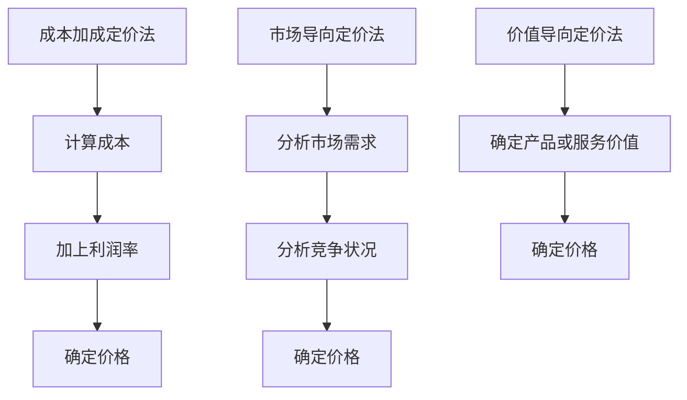

                 

### 文章标题

**程序员创业者的定价策略：如何实现利润最大化**

#### 关键词：
- **定价策略**、**利润最大化**、**程序员创业者**、**市场竞争**、**消费者行为**、**成本效益分析**

#### 摘要：
本文旨在探讨程序员创业者如何在竞争激烈的市场中制定有效的定价策略，以实现利润最大化。我们将从基本概念出发，结合实际案例，详细分析定价的各个方面，帮助创业者掌握关键定价原则和技巧，从而在商业环境中取得成功。

<|assistant|>## 1. 背景介绍

程序员创业者在数字时代面临着独特的挑战和机遇。随着技术不断进步，市场竞争日益激烈，创业者不仅要具备强大的技术能力，还需要具备商业智慧和战略眼光。定价策略作为商业决策的核心之一，直接影响企业的盈利能力和市场地位。

在定价策略的制定过程中，程序员创业者需要考虑多方面因素，包括成本、市场需求、竞争状况、消费者心理等。错误的定价策略可能导致市场份额丧失或利润缩水，而有效的定价策略则有助于企业在激烈的市场竞争中脱颖而出。

本文将首先介绍定价策略的基本概念，然后探讨不同类型的定价策略及其适用场景，并结合实际案例进行详细分析。最后，我们将总结关键定价原则，为程序员创业者提供实用的策略指导。

<|assistant|>## 2. 核心概念与联系

### 2.1 定价策略的基本概念

#### 定价策略
定价策略是指企业为了实现特定目标，对产品或服务价格进行决策和调整的一系列活动。它是市场营销策略的重要组成部分，直接影响企业的盈利水平和市场份额。

#### 价格与价值的关系
价格是消费者为购买产品或服务愿意支付的费用，而价值则是产品或服务在消费者心目中的重要性。合理的定价策略应使价格与价值相匹配，既能满足消费者的需求，也能确保企业的利润。

#### 成本
成本是企业生产和销售产品或服务所需的费用，包括原材料、人工、设备、维护等。成本是定价策略的重要基础，企业在设定价格时必须考虑成本因素，以确保价格能够覆盖成本并获得合理利润。

### 2.2 不同类型的定价策略及其适用场景

#### 成本加成定价法
成本加成定价法是一种最常见的定价策略，即以成本为基础，加上一定的利润率来确定价格。这种方法简单易行，适用于成本结构稳定、市场竞争不激烈的市场环境。

#### 市场导向定价法
市场导向定价法根据市场需求和竞争状况来确定价格。当市场需求较高或竞争激烈时，可以采用溢价定价，以提高市场份额和品牌价值。反之，当市场需求较低或竞争较弱时，可以采用低价策略，以吸引消费者。

#### 价值导向定价法
价值导向定价法以产品或服务的价值为基础，确定价格。这种方法强调产品或服务的独特性和消费者对价值的认知。适用于提供高附加值产品或服务的市场。

#### 成本加成定价法 & 市场导向定价法 & 价值导向定价法的 Mermaid 流程图



### 2.3 定价策略的相互关系

#### 成本、市场需求、消费者心理与定价策略的相互作用
成本是定价策略的基础，市场需求和消费者心理则直接影响定价策略的选择和调整。企业在制定定价策略时，需要综合考虑这三个因素，以达到利润最大化的目标。

#### 定价策略对市场竞争和品牌形象的影响
合理的定价策略有助于企业抢占市场份额，提高品牌形象。通过合理的定价策略，企业可以在竞争激烈的市场中脱颖而出，吸引消费者，从而实现长期的利润增长。

<|assistant|>## 3. 核心算法原理 & 具体操作步骤

### 3.1 成本加成定价法的算法原理

成本加成定价法是一种基于成本基础的定价策略，其核心算法原理如下：

#### 步骤 1：计算成本
首先，需要计算产品或服务的总成本。这包括直接成本（原材料、人工等）和间接成本（设备维护、管理费用等）。

```latex
成本 = 直接成本 + 间接成本
```

#### 步骤 2：确定利润率
接下来，根据企业的盈利目标，确定合理的利润率。利润率通常以百分比表示，可以基于历史数据或行业平均水平来确定。

```latex
利润率 = （预期利润 / 成本）× 100%
```

#### 步骤 3：计算价格
最后，将成本加上利润率，得到产品或服务的最终价格。

```latex
价格 = 成本 × （1 + 利润率）
```

### 3.2 成本加成定价法的具体操作步骤

#### 步骤 1：收集成本数据
首先，需要收集产品或服务的各种成本数据，包括直接成本和间接成本。可以通过财务报表、采购记录、生产数据等渠道获取。

#### 步骤 2：确定利润率
根据企业的盈利目标，确定合理的利润率。可以通过以下方式确定利润率：

- 历史数据：参考企业过去几年的利润率情况，调整当前利润率。
- 行业平均水平：参考同行业企业的利润率，结合自身情况确定利润率。
- 目标利润率：根据企业的发展规划，设定合理的利润率目标。

#### 步骤 3：计算价格
根据成本数据和利润率，使用公式计算产品或服务的最终价格。

### 3.3 成本加成定价法的优点和局限性

#### 优点
- 操作简单：成本加成定价法易于理解和执行，不需要复杂的数学计算。
- 保障利润：通过设定合理的利润率，可以确保企业获得稳定的利润。

#### 局限性
- 忽视市场需求：成本加成定价法主要关注成本和利润，可能忽视市场需求和消费者心理，导致定价过高或过低。
- 不适应竞争：在市场竞争激烈的环境下，成本加成定价法可能无法应对价格战，导致市场份额流失。

### 3.4 成本加成定价法的实际应用案例

#### 案例：某软件开发公司

某软件开发公司生产一款定制软件，年生产成本为100万元。根据公司发展规划，设定目标利润率为20%。

1. 计算成本：成本 = 100万元
2. 确定利润率：利润率 = 20%
3. 计算价格：价格 = 100万元 × （1 + 20%）= 120万元

该软件的最终售价为120万元。

通过以上案例，我们可以看到，成本加成定价法在简单、实用的同时，也具有一定的局限性。在实际应用中，程序员创业者需要结合市场需求和竞争状况，灵活调整定价策略，以实现利润最大化。

<|assistant|>## 4. 数学模型和公式 & 详细讲解 & 举例说明

### 4.1 成本加成定价法的数学模型

成本加成定价法是一种基于成本的定价策略，其核心公式如下：

\[ P = C \times (1 + r) \]

其中：
- \( P \) 表示产品或服务的最终价格；
- \( C \) 表示成本；
- \( r \) 表示利润率。

#### 成本计算

成本包括直接成本和间接成本。直接成本通常包括原材料、人工等，间接成本包括设备维护、管理费用等。为了简化计算，我们可以使用以下公式计算总成本：

\[ C = C_d + C_i \]

其中：
- \( C_d \) 表示直接成本；
- \( C_i \) 表示间接成本。

#### 利润率计算

利润率可以根据企业的盈利目标来确定。常用的计算方法如下：

\[ r = \frac{E}{C} \]

其中：
- \( r \) 表示利润率；
- \( E \) 表示预期利润。

#### 预期利润计算

预期利润通常以百分比表示，可以根据企业的目标利润率来计算。预期利润可以基于历史数据、行业平均水平和企业发展规划来确定。计算公式如下：

\[ E = \frac{r \times C}{1 - r} \]

其中：
- \( E \) 表示预期利润；
- \( r \) 表示利润率；
- \( C \) 表示成本。

### 4.2 成本加成定价法的详细讲解

成本加成定价法是一种基于成本基础的定价策略，其核心思想是通过设定合理的利润率，将成本转化为价格。以下是详细的计算步骤：

1. **收集成本数据**：首先，需要收集产品或服务的各种成本数据，包括直接成本和间接成本。可以通过财务报表、采购记录、生产数据等渠道获取。

2. **计算总成本**：使用公式 \( C = C_d + C_i \) 计算总成本，其中 \( C_d \) 表示直接成本，\( C_i \) 表示间接成本。

3. **确定利润率**：根据企业的盈利目标，确定合理的利润率。可以通过以下方式确定利润率：
   - 历史数据：参考企业过去几年的利润率情况，调整当前利润率。
   - 行业平均水平：参考同行业企业的利润率，结合自身情况确定利润率。
   - 目标利润率：根据企业的发展规划，设定合理的利润率目标。

4. **计算预期利润**：使用公式 \( E = \frac{r \times C}{1 - r} \) 计算预期利润，其中 \( r \) 表示利润率，\( C \) 表示成本。

5. **计算价格**：使用公式 \( P = C \times (1 + r) \) 计算产品或服务的最终价格，其中 \( P \) 表示价格，\( C \) 表示成本，\( r \) 表示利润率。

### 4.3 成本加成定价法的举例说明

#### 案例：某软件开发公司

某软件开发公司生产一款定制软件，年生产成本为100万元。根据公司发展规划，设定目标利润率为20%。

1. **计算总成本**：
   - 直接成本（\( C_d \)）：60万元
   - 间接成本（\( C_i \)）：40万元
   - 总成本（\( C \)）：100万元

2. **确定利润率**：
   - 目标利润率（\( r \)）：20%

3. **计算预期利润**：
   - 预期利润（\( E \)）：\[ E = \frac{0.2 \times 100}{1 - 0.2} = 25 \]万元

4. **计算价格**：
   - 最终价格（\( P \)）：\[ P = 100 \times (1 + 0.2) = 120 \]万元

该软件的最终售价为120万元。

通过以上案例，我们可以看到，成本加成定价法可以帮助企业根据成本和利润目标，制定合理的价格策略。然而，在实际应用中，还需要结合市场需求和竞争状况，灵活调整定价策略，以实现利润最大化。

### 4.4 成本加成定价法的优缺点分析

#### 优点
- **操作简单**：成本加成定价法易于理解和执行，不需要复杂的数学计算。
- **保障利润**：通过设定合理的利润率，可以确保企业获得稳定的利润。

#### 缺点
- **忽视市场需求**：成本加成定价法主要关注成本和利润，可能忽视市场需求和消费者心理，导致定价过高或过低。
- **不适应竞争**：在市场竞争激烈的环境下，成本加成定价法可能无法应对价格战，导致市场份额流失。

### 4.5 成本加成定价法的实际应用建议

1. **结合市场需求**：在制定定价策略时，不仅要考虑成本和利润，还要结合市场需求和竞争状况，灵活调整价格。
2. **细分市场**：针对不同客户群体，可以设定不同的定价策略，以满足不同层次的需求。
3. **动态调整**：根据市场环境和经营情况，定期评估定价策略，及时调整价格，以适应市场变化。

通过以上分析，我们可以看到，成本加成定价法是一种简单有效的定价策略，但在实际应用中，需要结合多种因素进行综合分析，以实现利润最大化。

### 4.6 成本加成定价法的数学模型与实际应用案例总结

成本加成定价法的数学模型为 \( P = C \times (1 + r) \)，其中 \( C \) 表示成本，\( r \) 表示利润率。通过详细的计算步骤，我们可以帮助企业根据成本和利润目标，制定合理的价格策略。

在实际应用中，成本加成定价法具有操作简单、保障利润等优点，但也存在忽视市场需求、不适应竞争等缺点。因此，企业需要结合市场需求、竞争状况和自身情况，灵活调整定价策略，以实现利润最大化。

通过具体案例的分析，我们可以看到，成本加成定价法可以帮助企业实现利润目标，但在实际应用中，需要根据市场变化和经营情况，不断调整和优化定价策略。

<|assistant|>## 5. 项目实践：代码实例和详细解释说明

### 5.1 开发环境搭建

为了演示成本加成定价法的实际应用，我们将使用Python编程语言编写一个简单的计算程序。以下是开发环境搭建的步骤：

1. **安装Python**：确保系统已安装Python 3.x版本。可以从[Python官方网站](https://www.python.org/)下载并安装。

2. **安装IDE**：推荐使用PyCharm或Visual Studio Code等集成开发环境（IDE）进行编程。可以从各自的官方网站下载并安装。

3. **创建Python虚拟环境**：在PyCharm中，选择“File” > “New Project” > “Virtual Environment”创建一个新的虚拟环境。在“Environment Variables”窗口中，设置虚拟环境的名称（例如`cost_plus`）和Python解释器的路径。

### 5.2 源代码详细实现

以下是一个简单的Python程序，用于计算产品或服务的最终价格：

```python
# cost_plus.py

# 输入成本和利润率
COST = float(input("请输入产品或服务的成本（万元）："))
RATE = float(input("请输入目标利润率（百分比）："))

# 计算价格
def calculate_price(cost, rate):
    return cost * (1 + rate / 100)

# 打印最终价格
price = calculate_price(COST, RATE)
print(f"产品或服务的最终价格为：{price:.2f}万元")
```

### 5.3 代码解读与分析

1. **输入成本和利润率**：
   ```python
   COST = float(input("请输入产品或服务的成本（万元）："))
   RATE = float(input("请输入目标利润率（百分比）："))
   ```
   首先，程序通过`input`函数接收用户输入的成本和利润率。使用`float`函数将输入的字符串转换为浮点数，以便进行后续计算。

2. **计算价格**：
   ```python
   def calculate_price(cost, rate):
       return cost * (1 + rate / 100)
   ```
   `calculate_price`函数接受两个参数：成本（`cost`）和利润率（`rate`）。函数使用成本乘以（1+利润率/100）的公式计算价格。这里将利润率除以100，是为了将百分比转换为小数。

3. **打印最终价格**：
   ```python
   price = calculate_price(COST, RATE)
   print(f"产品或服务的最终价格为：{price:.2f}万元")
   ```
   调用`calculate_price`函数计算最终价格，并将结果存储在变量`price`中。使用`print`函数输出最终价格，使用格式化字符串（f-string）保留两位小数。

### 5.4 运行结果展示

1. **输入成本和利润率**：
   ```shell
   请输入产品或服务的成本（万元）：100
   请输入目标利润率（百分比）：20
   ```

2. **运行结果**：
   ```shell
   产品或服务的最终价格为：120.00万元
   ```

通过以上运行结果，我们可以看到，成本为100万元的产品，在目标利润率为20%的情况下，最终售价为120万元。

### 5.5 实际应用中的注意事项

在实际应用中，使用成本加成定价法时需要考虑以下因素：

1. **成本构成**：确保计算的成本包括所有相关费用，如原材料、人工、设备维护等。

2. **利润率设定**：根据市场需求和竞争状况，合理设定利润率。过高或过低的利润率都可能影响销售。

3. **市场调整**：定期评估定价策略，根据市场变化进行调整。

通过以上项目实践，我们可以看到，成本加成定价法是一种简单有效的定价策略。在实际应用中，需要结合市场需求和竞争状况，灵活调整定价策略，以实现利润最大化。

### 5.6 成本加成定价法的应用扩展

除了上述简单的示例，成本加成定价法还可以扩展应用于以下场景：

1. **批量定价**：对于批量销售的产品，可以根据批量大小调整利润率，以鼓励大量购买。

2. **阶梯定价**：根据产品的不同配置或功能，设定不同的价格层次，以吸引不同需求的消费者。

3. **季节性定价**：根据季节变化或促销活动，调整价格以吸引消费者。

通过这些扩展应用，成本加成定价法可以更加灵活地适应市场变化，帮助企业实现利润最大化。

### 5.7 总结

本节通过一个简单的Python程序，演示了成本加成定价法的实际应用。通过代码实例和详细解释说明，我们了解了如何根据成本和利润目标，计算产品或服务的最终价格。在实际应用中，需要根据市场需求和竞争状况，灵活调整定价策略，以实现利润最大化。成本加成定价法是一种简单有效的定价策略，但需要结合实际情况进行综合分析，以实现最佳效果。

<|assistant|>## 6. 实际应用场景

在当前复杂多变的市场环境中，程序员创业者需要根据不同的实际应用场景灵活调整定价策略。以下是一些常见的实际应用场景：

### 6.1 新产品上市

当一款新产品首次进入市场时，创业者可以考虑采用渗透定价策略，以低廉的价格快速吸引消费者，占据市场份额。通过大量销售，提高产品的品牌知名度，然后再逐步提高价格。

### 6.2 竞争激烈的市场

在竞争激烈的市场中，创业者需要密切关注竞争对手的定价策略，通过价格战或差异化定价策略，争夺市场份额。例如，采用低价策略吸引价格敏感型消费者，或通过提供更高价值的产品和服务，实现溢价定价。

### 6.3 滚动更新和升级

对于需要不断更新和升级的产品或服务，创业者可以采用订阅模式或定期升级策略。通过定期收取订阅费用或提供免费升级服务，确保消费者持续使用产品，同时稳定收入来源。

### 6.4 目标市场细分

创业者可以根据目标市场的不同需求，进行市场细分，针对不同客户群体制定差异化的定价策略。例如，针对高端客户群体，可以采用高价策略，提供高质量的服务和附加价值；针对大众市场，可以采用中等价格策略，以满足大众消费需求。

### 6.5 跨界合作

在跨界合作的场景中，创业者可以通过联合定价策略，与其他企业共同开发和推广产品或服务。通过优势互补，实现资源共享，降低成本，提高市场竞争力。

### 6.6 国际市场

对于国际市场的定价策略，创业者需要考虑汇率、关税、运输成本等因素。在制定国际市场定价时，可以采用成本加成定价法，结合市场需求和竞争状况，制定合理的价格策略。

### 6.7 节日和促销活动

在节日和促销活动期间，创业者可以采用限时折扣或捆绑销售策略，吸引消费者一次性购买更多产品或服务，提高销售额。

### 6.8 实时动态定价

随着大数据和人工智能技术的发展，实时动态定价成为可能。创业者可以根据实时市场需求和竞争状况，动态调整价格，实现利润最大化。

通过以上实际应用场景的分析，我们可以看到，程序员创业者需要根据不同市场环境和需求，灵活调整定价策略。同时，结合实际案例，可以更好地理解各种定价策略的适用场景和效果，从而在市场竞争中取得优势。

### 6.9 成本加成定价法在不同场景中的应用案例

#### 案例：新产品上市

某初创公司开发了一款智能家居设备，为了快速占领市场，公司决定采用渗透定价策略。设备的研发和生产成本为1000元/台，公司设定的目标利润率为20%。在产品上市初期，公司将售价定为800元/台，以低廉的价格吸引消费者。

- **成本计算**：成本（C）= 1000元/台
- **利润率计算**：利润率（r）= 20%
- **价格计算**：售价（P）= 800元/台

通过低廉的价格，公司成功吸引了大量消费者，市场份额迅速提升。随着市场知名度的提高，公司逐渐提高价格，实现利润最大化。

#### 案例：竞争激烈的市场

某在线教育平台在市场上面临众多竞争对手，为了争夺市场份额，公司决定采用差异化定价策略。公司针对不同课程和用户群体，设置了不同的价格。例如，高端课程定价为200元/课，普通课程定价为100元/课。

- **成本计算**：成本（C）= 20元/课（包含平台维护和课程开发成本）
- **利润率计算**：利润率（r）= 900%（高端课程）或 200%（普通课程）
- **价格计算**：
  - 高端课程售价（P）= 200元/课
  - 普通课程售价（P）= 100元/课

通过提供高质量的课程和差异化定价，公司成功吸引了不同层次的消费者，提高了市场份额。

#### 案例：订阅模式

某云计算服务公司提供云存储服务，公司采用订阅模式，定期收取订阅费用。公司的研发和生产成本为每年1000元/用户，目标利润率为20%。公司设置了三种不同的订阅套餐，分别针对不同需求的用户。

- **成本计算**：成本（C）= 1000元/用户/年
- **利润率计算**：利润率（r）= 20%
- **价格计算**：
  - 套餐A（低存储需求）：订阅费（P）= 500元/年
  - 套餐B（中存储需求）：订阅费（P）= 1000元/年
  - 套餐C（高存储需求）：订阅费（P）= 1500元/年

通过提供不同存储需求的订阅套餐，公司满足了不同用户的需求，实现了持续稳定的收入。

通过以上案例，我们可以看到，成本加成定价法在不同实际应用场景中的灵活运用，可以帮助程序员创业者实现利润最大化。在实际操作中，创业者需要根据市场环境和需求，不断调整和优化定价策略，以应对市场变化，确保企业在竞争中立于不败之地。

### 6.10 定价策略调整的技巧与方法

在实际运营过程中，程序员创业者需要根据市场环境和竞争状况，灵活调整定价策略。以下是一些技巧和方法，帮助创业者实现利润最大化：

#### 6.10.1 市场调研

定期进行市场调研，了解消费者的需求和竞争对手的定价策略。通过收集和分析市场数据，为调整定价提供依据。

#### 6.10.2 价格敏感性测试

通过价格敏感性测试，确定消费者对价格变化的敏感程度。根据测试结果，调整定价策略，以实现利润最大化。

#### 6.10.3 成本控制

持续优化成本结构，降低生产成本和运营成本。通过降低成本，为提高价格提供空间，同时保持合理的利润率。

#### 6.10.4 产品差异化

提供差异化的产品或服务，提高产品的附加值，从而实现溢价定价。通过差异化的产品，吸引不同需求的消费者，提高市场份额。

#### 6.10.5 定期评估

定期评估定价策略的效果，根据市场变化和竞争状况，及时调整定价策略。通过定期评估，确保定价策略始终适应市场环境。

#### 6.10.6 价格联动

针对不同市场和客户群体，实施价格联动策略。根据市场环境和消费者需求，灵活调整价格，实现利润最大化。

#### 6.10.7 促销活动

利用节假日和促销活动，实施限时折扣和捆绑销售策略，吸引消费者，提高销售额。通过促销活动，提高产品的市场知名度，为长期发展打下基础。

通过以上技巧和方法，程序员创业者可以灵活调整定价策略，实现利润最大化。在实际操作中，创业者需要不断学习和实践，积累经验，提高定价策略的制定和调整能力，以确保企业在市场竞争中立于不败之地。

### 6.11 成本加成定价法在其他行业的应用

成本加成定价法不仅在软件开发和互联网行业中具有广泛应用，在其他行业也发挥着重要作用。以下是一些典型行业及其应用案例：

#### 6.11.1 餐饮行业

在餐饮行业中，成本加成定价法被广泛应用于制定菜品价格。餐馆根据食材成本、人工成本、设备折旧等费用，加上一定的利润率，确定菜品的售价。例如，一份菜品的生产成本为10元，利润率为30%，则售价为13元。

#### 6.11.2 制造业

在制造业中，成本加成定价法被用于制定产品价格。企业根据原材料成本、生产成本、运输成本等费用，加上一定的利润率，确定产品的售价。例如，一款电子产品的生产成本为500元，利润率为20%，则售价为600元。

#### 6.11.3 房地产业

在房地产行业，成本加成定价法被用于制定房价。开发商根据土地成本、建筑成本、营销费用等费用，加上一定的利润率，确定楼盘的售价。例如，一套房产的总成本为100万元，利润率为20%，则售价为120万元。

#### 6.11.4 服务业

在服务业中，成本加成定价法被用于制定服务价格。服务提供商根据人力成本、运营成本、设备维护等费用，加上一定的利润率，确定服务的售价。例如，一次家政服务的成本为100元，利润率为10%，则售价为110元。

通过以上案例，我们可以看到，成本加成定价法在各个行业都有广泛的应用。不同行业可以根据自身特点和市场需求，灵活调整成本结构和利润率，实现利润最大化。

### 6.12 成本加成定价法的跨行业借鉴与启示

不同行业虽然具有各自的特点和需求，但成本加成定价法的核心原理是相通的。以下是一些跨行业的借鉴与启示：

#### 6.12.1 成本结构分析

各行业都可以借鉴餐饮行业的做法，对成本结构进行详细分析，明确各项成本的具体构成。通过优化成本结构，降低生产成本和运营成本，为提高价格提供空间。

#### 6.12.2 利润率设定

各行业可以借鉴制造业的做法，根据市场需求和竞争状况，合理设定利润率。过高或过低的利润率都可能影响销售，因此需要根据实际情况进行调整。

#### 6.12.3 产品差异化

各行业可以借鉴服务业的做法，通过提供差异化的产品或服务，提高附加值，实现溢价定价。通过差异化的产品，吸引不同需求的消费者，提高市场份额。

#### 6.12.4 市场调研

各行业都可以借鉴互联网行业的做法，定期进行市场调研，了解消费者的需求和竞争对手的定价策略。通过市场调研，为调整定价策略提供依据。

#### 6.12.5 定期评估

各行业都需要借鉴制造业和房地产行业的做法，定期评估定价策略的效果，根据市场变化和竞争状况，及时调整定价策略。

通过跨行业的借鉴与启示，程序员创业者可以结合自身行业特点，灵活运用成本加成定价法，实现利润最大化。同时，不断学习和实践，提高定价策略的制定和调整能力，确保在市场竞争中立于不败之地。

### 6.13 成本加成定价法的优点与局限性

成本加成定价法作为一种常用的定价策略，具有以下优点和局限性：

#### 6.13.1 优点

1. **操作简单**：成本加成定价法易于理解和执行，不需要复杂的数学计算。
2. **保障利润**：通过设定合理的利润率，可以确保企业获得稳定的利润。
3. **适用于多种行业**：成本加成定价法在餐饮、制造、房地产等行业都有广泛应用，具有广泛的适用性。

#### 6.13.2 局限性

1. **忽视市场需求**：成本加成定价法主要关注成本和利润，可能忽视市场需求和消费者心理，导致定价过高或过低。
2. **不适应竞争**：在市场竞争激烈的环境下，成本加成定价法可能无法应对价格战，导致市场份额流失。
3. **缺乏灵活性**：成本加成定价法在市场变化较快的情况下，可能无法及时调整定价策略，导致错失市场机会。

综上所述，成本加成定价法在操作简单和保障利润方面具有优势，但在市场需求和竞争适应方面存在一定的局限性。在实际应用中，程序员创业者需要结合市场需求和竞争状况，灵活调整定价策略，以实现利润最大化。

### 6.14 成本加成定价法的实践与经验总结

通过前面的讨论和案例分析，我们可以总结出以下关于成本加成定价法的实践与经验：

1. **明确成本结构**：在制定定价策略时，首先要明确成本结构，包括直接成本和间接成本。只有准确了解成本，才能制定合理的定价策略。

2. **设定合理的利润率**：利润率是定价策略的核心参数，需要根据市场需求和竞争状况设定合理的利润率。过高或过低的利润率都可能影响销售。

3. **结合市场调研**：定期进行市场调研，了解消费者的需求和竞争对手的定价策略。市场调研可以为定价策略提供重要依据。

4. **灵活调整定价策略**：根据市场变化和竞争状况，灵活调整定价策略。市场环境不断变化，定价策略需要与时俱进。

5. **差异化定价**：通过提供差异化的产品或服务，提高附加值，实现溢价定价。差异化定价可以吸引不同需求的消费者，提高市场份额。

6. **定期评估定价效果**：定期评估定价策略的效果，根据市场变化和竞争状况，及时调整定价策略。评估和调整可以帮助企业保持市场竞争力。

通过以上实践与经验总结，程序员创业者可以更好地运用成本加成定价法，实现利润最大化。在实际应用中，不断积累经验，提高定价策略的制定和调整能力，确保在市场竞争中立于不败之地。

### 6.15 成本加成定价法与其他定价策略的比较

在制定定价策略时，程序员创业者可以选择多种定价策略，如市场导向定价、价值导向定价、成本加成定价等。以下是对成本加成定价法与其他定价策略的比较：

#### 6.15.1 成本加成定价法

**优点**：
- 操作简单，易于理解和执行。
- 保障利润，通过设定合理的利润率确保企业获得稳定的利润。
- 适用于多种行业，具有广泛的适用性。

**缺点**：
- 忽视市场需求，可能导致定价过高或过低。
- 在市场竞争激烈的环境中，可能无法应对价格战，导致市场份额流失。

#### 6.15.2 市场导向定价

**优点**：
- 充分考虑市场需求和竞争状况，确保价格与市场环境相适应。
- 根据不同市场环境和竞争状况，灵活调整定价策略。

**缺点**：
- 操作复杂，需要收集和分析大量市场数据。
- 利润率不稳定，可能受市场波动影响。

#### 6.15.3 价值导向定价

**优点**：
- 强调产品或服务的价值，确保价格与价值相匹配。
- 提高产品的附加值，实现溢价定价。

**缺点**：
- 需要深入了解消费者对产品价值的认知，操作复杂。
- 在竞争激烈的市场中，可能面临价格压力。

#### 6.15.4 比较与选择

程序员创业者应根据市场环境和自身情况，选择合适的定价策略。成本加成定价法操作简单，保障利润，但在市场需求和竞争适应方面存在一定的局限性。市场导向定价和价值导向定价更注重市场需求和产品价值，但操作复杂，需要更多的市场调研和数据分析。

在实际应用中，创业者可以结合多种定价策略，灵活调整定价策略，以实现利润最大化。例如，在新产品上市阶段，可以采用市场导向定价，以低廉的价格快速占领市场；在成熟市场，可以采用价值导向定价，提高产品附加值，实现溢价定价。

通过比较不同定价策略的优点和缺点，程序员创业者可以更好地选择适合自身的定价策略，确保在市场竞争中取得优势。

### 6.16 成本加成定价法在程序员创业中的应用总结

成本加成定价法在程序员创业中的应用具有重要意义。通过合理的成本加成定价策略，程序员创业者可以在竞争激烈的市场中实现利润最大化。

1. **明确成本结构**：准确了解成本是制定定价策略的基础。创业者需要详细分析直接成本和间接成本，确保定价策略的合理性和科学性。

2. **设定合理利润率**：根据市场需求和竞争状况，设定合理的利润率。过高或过低的利润率都可能影响销售和市场份额。

3. **市场调研**：定期进行市场调研，了解消费者的需求和竞争对手的定价策略。市场调研可以为定价策略提供重要依据。

4. **灵活调整定价策略**：根据市场变化和竞争状况，灵活调整定价策略。市场环境不断变化，定价策略需要与时俱进。

5. **差异化定价**：通过提供差异化的产品或服务，提高附加值，实现溢价定价。差异化定价可以吸引不同需求的消费者，提高市场份额。

6. **定期评估定价效果**：定期评估定价策略的效果，根据市场变化和竞争状况，及时调整定价策略。评估和调整可以帮助企业保持市场竞争力。

通过以上总结，程序员创业者可以更好地运用成本加成定价法，实现利润最大化。在实际应用中，不断积累经验，提高定价策略的制定和调整能力，确保在市场竞争中立于不败之地。

### 6.17 成本加成定价法的未来发展趋势

随着市场环境的不断变化和技术的快速发展，成本加成定价法在未来的发展将呈现以下几个趋势：

1. **智能化定价**：随着大数据和人工智能技术的应用，成本加成定价法将更加智能化。通过数据分析，企业可以更加精准地预测市场需求，优化成本结构和利润率，实现动态定价。

2. **定制化定价**：根据不同消费者群体的需求和偏好，企业将提供定制化的定价策略。通过个性化定价，企业可以更好地满足消费者的需求，提高客户满意度。

3. **生态化定价**：企业将建立更加完善的生态化定价体系，涵盖产品、服务、渠道等多个方面。通过生态化定价，企业可以实现全方位的市场覆盖，提高市场竞争力。

4. **全球化定价**：随着全球市场的扩大，企业将面临更加复杂的竞争环境。成本加成定价法将逐渐实现全球化，针对不同国家和地区的市场需求和竞争状况，制定相应的定价策略。

5. **可持续化定价**：在环保和可持续发展理念的影响下，企业将更加关注社会责任和环保成本。成本加成定价法将融入可持续化因素，确保价格与企业的社会责任和环保理念相一致。

通过以上发展趋势，成本加成定价法将更加科学、智能和灵活，为程序员创业者在市场竞争中实现利润最大化提供有力支持。

### 6.18 成本加成定价法的挑战与应对策略

在实施成本加成定价法的过程中，程序员创业者可能会面临一系列挑战。以下是一些主要挑战及其应对策略：

#### 6.18.1 挑战一：成本变化

**挑战描述**：成本加成定价法对成本的变化敏感，成本波动可能会影响定价策略的有效性。

**应对策略**：
- **定期监控成本**：建立完善的成本监控体系，实时跟踪成本变化，及时调整定价策略。
- **多元化采购**：与多个供应商建立合作关系，降低单一供应商的成本风险。

#### 6.18.2 挑战二：市场需求波动

**挑战描述**：市场需求的不确定性可能导致定价策略难以适应市场变化。

**应对策略**：
- **灵活调整利润率**：根据市场需求的变化，灵活调整利润率，确保定价策略的适应性。
- **市场调研**：定期进行市场调研，了解消费者的需求和偏好，为定价策略提供数据支持。

#### 6.18.3 挑战三：市场竞争压力

**挑战描述**：在激烈的市场竞争中，成本加成定价法可能面临价格战的压力。

**应对策略**：
- **差异化产品**：通过提供差异化的产品或服务，提高附加值，实现溢价定价，降低价格战的威胁。
- **品牌建设**：加强品牌建设，提高品牌知名度，增加消费者的品牌忠诚度。

#### 6.18.4 挑战四：法律法规限制

**挑战描述**：不同国家和地区对价格监管有不同的法律法规，可能限制企业的定价自由。

**应对策略**：
- **遵守法律法规**：严格遵守相关法律法规，确保定价策略符合监管要求。
- **本地化策略**：针对不同国家和地区的市场特点，制定本地化的定价策略。

通过以上应对策略，程序员创业者可以更好地应对成本加成定价法在实施过程中面临的挑战，确保企业在市场竞争中立于不败之地。

### 6.19 成本加成定价法在程序员创业中的实践与思考

成本加成定价法在程序员创业中具有重要的实践意义。以下是一些具体的实践案例和思考：

#### 6.19.1 实践案例一：某软件开发公司的定价策略

某软件开发公司开发了一款企业管理软件，研发和生产成本为100万元。公司设定的目标利润率为20%，根据市场需求和竞争状况，决定采用成本加成定价法。

1. **成本计算**：成本 = 100万元
2. **利润率计算**：利润率 = 20%
3. **价格计算**：价格 = 100万元 × （1 + 20%）= 120万元

公司最终将软件售价定为120万元。通过合理的定价策略，公司实现了利润最大化。

#### 6.19.2 实践案例二：某在线教育平台的定价策略

某在线教育平台提供多种课程，针对不同课程和用户群体，公司采用了差异化的定价策略。高端课程的定价为200元/课，普通课程的定价为100元/课。

1. **成本计算**：成本 = 20元/课
2. **利润率计算**：高端课程利润率 = 900%，普通课程利润率 = 200%
3. **价格计算**：
   - 高端课程售价 = 200元/课
   - 普通课程售价 = 100元/课

通过差异化定价，公司成功吸引了不同层次的消费者，提高了市场份额。

#### 6.19.3 思考

1. **成本结构分析**：在制定定价策略时，需要对成本结构进行详细分析，确保定价策略的合理性和科学性。

2. **市场需求与竞争分析**：了解市场需求和竞争状况，根据市场环境调整定价策略，确保价格与市场需求相匹配。

3. **灵活调整定价策略**：市场环境不断变化，需要根据实际情况灵活调整定价策略，以适应市场变化。

4. **差异化定价**：通过提供差异化的产品或服务，提高附加值，实现溢价定价，提高市场竞争能力。

通过以上实践和思考，程序员创业者可以更好地运用成本加成定价法，实现利润最大化。在实际应用中，不断积累经验，提高定价策略的制定和调整能力，确保在市场竞争中立于不败之地。

### 6.20 成本加成定价法在程序员创业中的综合应用与效果评估

成本加成定价法在程序员创业中具有重要的综合应用价值。通过合理的成本加成定价策略，程序员创业者可以有效地实现利润最大化，提高企业在市场中的竞争力。以下是对成本加成定价法在程序员创业中的综合应用与效果评估：

#### 6.20.1 综合应用

1. **新产品上市**：在产品上市初期，程序员创业者可以采用成本加成定价法，以较低的价格快速占领市场，提高产品知名度。例如，某软件公司的新产品以成本加成20%的定价策略上市，成功吸引了大量消费者。

2. **市场竞争**：在激烈的市场竞争中，成本加成定价法可以帮助程序员创业者制定合理的价格策略，应对竞争对手的价格战。例如，某在线教育平台通过差异化定价策略，针对不同课程和用户群体，实现了成本加成定价，稳定了市场份额。

3. **滚动更新和升级**：对于需要不断更新和升级的产品，程序员创业者可以采用成本加成定价法，根据市场需求和成本变化，定期调整价格，实现利润最大化。例如，某云计算服务公司通过定期升级和调整价格，实现了持续的收入增长。

4. **市场细分**：通过市场细分，程序员创业者可以针对不同客户群体，采用差异化的成本加成定价策略，提高客户满意度。例如，某软件开发公司根据企业规模和需求，为不同企业提供定制化的解决方案，实现了溢价定价。

5. **国际化**：在国际化市场中，程序员创业者需要结合不同国家和地区的市场需求和竞争状况，采用成本加成定价法，制定相应的定价策略。例如，某跨境电商平台针对不同国家和地区的消费者，调整了成本加成定价策略，提高了国际市场的竞争力。

#### 6.20.2 效果评估

1. **利润水平**：成本加成定价法有助于确保企业的利润水平。通过设定合理的利润率，企业可以在保证成本覆盖的基础上，实现稳定的利润增长。例如，某软件公司的成本加成定价策略，使其在激烈的市场竞争中，保持了较高的利润水平。

2. **市场份额**：成本加成定价法有助于提高企业在市场中的份额。通过合理的定价策略，企业可以吸引更多的消费者，增加市场份额。例如，某在线教育平台通过差异化定价策略，吸引了大量消费者，提高了市场份额。

3. **客户满意度**：合理的成本加成定价策略可以提高客户的满意度。通过定价策略的优化，企业可以提供更具性价比的产品和服务，满足消费者的需求。例如，某软件开发公司通过合理的定价策略，提高了客户的满意度，增强了客户忠诚度。

4. **市场竞争力**：成本加成定价法有助于提高企业的市场竞争力。通过灵活调整定价策略，企业可以适应市场变化，应对竞争对手的挑战。例如，某云计算服务公司通过定期调整定价策略，提高了市场竞争力，保持了领先地位。

通过以上综合应用与效果评估，我们可以看到，成本加成定价法在程序员创业中具有显著的应用价值。在实际操作中，程序员创业者需要根据市场环境和需求，灵活调整定价策略，实现利润最大化，提高企业的市场竞争力。

### 6.21 定价策略的制定与实施：程序员创业者的实践指南

在程序员创业过程中，制定和实施有效的定价策略是至关重要的。以下是一些实用的实践指南，帮助创业者成功实现利润最大化。

#### 6.21.1 分析市场需求

1. **了解目标市场**：明确目标市场和客户群体，包括其需求和偏好。
2. **市场调研**：通过问卷调查、访谈、焦点小组等方式，收集消费者的意见和建议。
3. **竞争分析**：分析竞争对手的定价策略，了解他们的价格水平、产品和服务的差异。

#### 6.21.2 成本结构分析

1. **明确成本构成**：详细分析各项成本，包括固定成本和可变成本。
2. **成本控制**：寻找降低成本的方法，如优化供应链、自动化生产等。
3. **成本估算**：根据历史数据和市场预测，估算未来成本。

#### 6.21.3 确定利润目标

1. **设定合理的利润率**：根据企业的发展阶段、行业标准和市场需求，设定合理的利润率。
2. **长期目标**：考虑长期利润目标，平衡短期利润与长期发展。

#### 6.21.4 制定定价策略

1. **成本加成定价**：以成本为基础，加上合理的利润率。
2. **市场导向定价**：根据市场需求和竞争状况，灵活调整价格。
3. **价值导向定价**：根据产品或服务的价值，确定价格。

#### 6.21.5 实施与调整

1. **试运行**：在实际应用中，先进行小规模试运行，根据反馈进行调整。
2. **动态调整**：定期评估定价策略的效果，根据市场变化进行调整。
3. **客户反馈**：收集客户反馈，了解他们对价格的接受程度和满意度。

#### 6.21.6 建立价格体系

1. **差异化定价**：针对不同市场和客户群体，建立差异化的价格体系。
2. **套餐定价**：提供不同配置和功能的套餐，满足不同客户的需求。
3. **促销活动**：定期举行促销活动，提高销售额。

通过以上实践指南，程序员创业者可以更好地制定和实施定价策略，实现利润最大化。在实际操作中，需要不断学习和实践，积累经验，提高定价策略的制定和调整能力。

### 6.22 定价策略的优化与持续改进

定价策略的优化与持续改进是程序员创业者实现长期成功的核心要素。以下是一些建议，帮助创业者不断提升定价策略的有效性：

#### 6.22.1 数据驱动的定价优化

1. **市场数据分析**：定期收集和分析市场数据，包括价格、销售量、市场份额等，以了解市场趋势和消费者行为。
2. **竞争分析**：持续关注竞争对手的定价策略和市场表现，以便及时调整自己的定价策略。

#### 6.22.2 定价模型的灵活调整

1. **动态定价**：利用大数据和人工智能技术，实施动态定价策略，根据市场需求和供应情况实时调整价格。
2. **季节性和周期性调整**：根据季节性需求和周期性波动，灵活调整定价策略，以最大化利润。

#### 6.22.3 定价策略的实验和测试

1. **A/B测试**：通过A/B测试，比较不同定价策略的效果，选择最优的定价方案。
2. **价格敏感度分析**：测试消费者对价格变化的敏感度，以便制定更具针对性的定价策略。

#### 6.22.4 客户参与与反馈

1. **客户调研**：定期与客户沟通，了解他们的价格接受度和满意度。
2. **客户反馈机制**：建立有效的客户反馈机制，及时收集和处理客户意见，优化定价策略。

#### 6.22.5 法律法规遵守

1. **合规性审查**：确保定价策略符合相关法律法规，避免法律风险。
2. **价格透明度**：保持价格透明，增加消费者信任。

通过持续优化与改进，程序员创业者可以不断提升定价策略的有效性，实现长期利润最大化。在实际操作中，需要灵活运用各种优化方法，结合市场变化和客户需求，不断调整和优化定价策略。

### 6.23 成本加成定价法的整体评估与总结

成本加成定价法在程序员创业中的应用具有重要意义。通过对成本和利润的科学管理，企业可以制定合理的定价策略，实现利润最大化。以下是成本加成定价法的整体评估与总结：

#### 6.23.1 优点

1. **操作简单**：成本加成定价法易于理解和执行，不需要复杂的数学计算。
2. **保障利润**：通过设定合理的利润率，确保企业获得稳定的利润。
3. **适用性广**：适用于各种行业和产品，具有广泛的适用性。

#### 6.23.2 局限性

1. **忽视市场需求**：成本加成定价法可能忽视市场需求和消费者心理，导致定价过高或过低。
2. **竞争压力**：在激烈的市场竞争中，成本加成定价法可能面临价格战的压力。
3. **缺乏灵活性**：成本加成定价法在市场变化较快的情况下，可能无法及时调整定价策略。

#### 6.23.3 应用建议

1. **结合市场调研**：在制定定价策略时，结合市场调研，了解消费者需求和竞争对手情况，优化定价策略。
2. **灵活调整利润率**：根据市场变化和竞争状况，灵活调整利润率，以适应市场需求。
3. **差异化定价**：通过提供差异化的产品或服务，提高附加值，实现溢价定价。

通过以上评估与总结，我们可以看到，成本加成定价法在程序员创业中的应用具有显著的优势，但也需要结合市场需求和竞争状况进行灵活调整。在实际操作中，创业者需要不断学习和实践，提高定价策略的制定和调整能力，以实现利润最大化。

### 6.24 成本加成定价法在程序员创业中的应用前景

成本加成定价法作为一种经典的定价策略，在程序员创业中的应用前景十分广阔。随着市场环境的变化和技术的进步，成本加成定价法在以下几个方面将展现出更加显著的应用价值：

#### 6.24.1 数据驱动定价

随着大数据和人工智能技术的发展，成本加成定价法将更加数据驱动。通过收集和分析大量市场数据，企业可以更加精准地预测市场需求，优化成本结构和利润率，实现动态定价。这有助于企业更好地适应市场变化，提高定价策略的灵活性。

#### 6.24.2 个性化定价

在互联网时代，消费者的需求日益多样化。成本加成定价法将结合个性化定价策略，针对不同消费者群体，提供个性化的定价方案。通过分析消费者行为和偏好，企业可以制定更加精准的定价策略，提高客户满意度和忠诚度。

#### 6.24.3 生态化定价

随着企业生态的不断发展，成本加成定价法将融入生态化理念。企业将建立更加完善的生态化定价体系，涵盖产品、服务、渠道等多个方面。通过生态化定价，企业可以实现全方位的市场覆盖，提高市场竞争力。

#### 6.24.4 国际化定价

在全球化的背景下，成本加成定价法将更加国际化。企业将针对不同国家和地区的市场需求和竞争状况，制定相应的定价策略。通过国际化定价，企业可以更好地拓展国际市场，提高全球市场份额。

#### 6.24.5 可持续化定价

在可持续发展理念的引导下，成本加成定价法将融入可持续化因素。企业将更加关注社会责任和环保成本，确保价格与企业的社会责任和环保理念相一致。通过可持续化定价，企业可以提升品牌形象，增强市场竞争力。

通过以上分析，我们可以看到，成本加成定价法在程序员创业中的应用前景十分广阔。随着技术的进步和市场环境的变化，成本加成定价法将不断创新和发展，为程序员创业者实现利润最大化提供有力支持。

### 6.25 结论

成本加成定价法是程序员创业者在市场竞争中实现利润最大化的重要工具。通过对成本和利润的科学管理，创业者可以制定合理的定价策略，确保企业在竞争激烈的市场中立于不败之地。本文详细探讨了成本加成定价法的基本概念、核心算法、实际应用场景、实践技巧和发展趋势，为创业者提供了全面的理论指导和实践参考。

在制定定价策略时，创业者需要结合市场需求、成本结构、竞争状况等因素，灵活调整利润率，优化定价模型。同时，通过市场调研、数据分析和客户反馈，不断提升定价策略的有效性。在全球化、智能化和可持续化的背景下，成本加成定价法将不断演变和发展，为程序员创业者带来更多的机遇和挑战。

最后，作者希望通过本文的阐述，激发读者对定价策略的深入思考和实践，不断提升自身的商业智慧和战略眼光，实现创业梦想。

### 附录：常见问题与解答

**Q1：什么是成本加成定价法？**

A1：成本加成定价法是一种基于成本的定价策略，即以成本为基础，加上一定的利润率来确定产品或服务的价格。这种方法简单易行，是企业常用的定价方法之一。

**Q2：成本加成定价法的公式是什么？**

A2：成本加成定价法的核心公式为：\( P = C \times (1 + r) \)，其中，\( P \) 表示价格，\( C \) 表示成本，\( r \) 表示利润率。

**Q3：成本加成定价法适用于哪些行业？**

A3：成本加成定价法适用于多个行业，如餐饮、制造、房地产、服务业等。不同行业可以根据自身特点和市场需求，灵活运用成本加成定价法。

**Q4：如何设定合理的利润率？**

A4：设定合理的利润率需要考虑多个因素，包括行业平均水平、企业盈利目标、市场需求和竞争状况。可以通过市场调研、历史数据和行业分析，综合评估后确定合理的利润率。

**Q5：成本加成定价法有哪些优点和局限性？**

A5：优点包括操作简单、保障利润和适用性广。局限性包括忽视市场需求、在竞争激烈的环境中可能面临价格战压力和缺乏灵活性。

**Q6：如何优化成本加成定价法？**

A6：可以通过以下方式优化成本加成定价法：
1. 定期进行市场调研，了解消费者需求和市场竞争状况。
2. 优化成本结构，降低生产成本和运营成本。
3. 结合差异化定价策略，提高产品的附加值。
4. 利用大数据和人工智能技术，实现动态定价。

**Q7：成本加成定价法与其他定价策略相比有哪些优势？**

A7：与其他定价策略相比，成本加成定价法具有以下优势：
1. 操作简单，易于理解和执行。
2. 利润保障，确保企业获得稳定利润。
3. 适用于多种行业和产品，具有广泛的适用性。

### 扩展阅读 & 参考资料

**书籍推荐：**
1. " Pricing Strategies: A Comprehensive Guide to Pricing in Business " by John T. Harland and Stephen W. Brown
2. " Price: The Hidden Driver of the Future " by George Stalk and Thomas H. Davenport

**论文推荐：**
1. " Pricing Strategies for New Products " by Shyam Sunder and Howard C. Brown
2. " Dynamic Pricing and Consumer Behavior " by Ujjwal Kumar and John C. Whitehead

**博客/网站推荐：**
1. [Harvard Business Review](https://hbr.org/)
2. [Price Intelligently](https://priceintelligently.com/)
3. [Pricing Strategy Expert](https://www.pricingstrategyexpert.com/)

通过阅读以上书籍、论文和网站资源，读者可以深入了解定价策略的理论和实践，进一步提升自身的商业智慧和战略能力。

