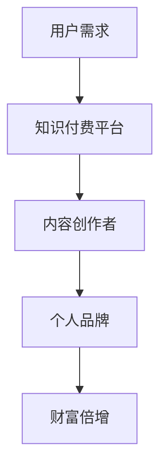

                 

### 文章标题

《程序员如何利用知识付费实现财富倍增》

> 关键词：知识付费、财富倍增、程序员、在线教育、个人品牌

摘要：
本文将探讨程序员如何通过知识付费平台，借助在线教育和个人品牌建设，实现财富的倍增。我们将详细分析知识付费市场的发展趋势、核心概念，分享成功案例，并给出具体的操作步骤和策略。

## 1. 背景介绍（Background Introduction）

随着互联网的普及和技术的发展，知识付费逐渐成为一种新兴的商业模式。对于程序员来说，这是一个绝佳的机会，不仅可以分享自己的专业知识，还能通过知识变现实现财富增长。以下是知识付费市场的几个关键趋势：

1. **用户需求增长**：随着人们对职业发展的关注，以及在线学习的便利性，越来越多的程序员选择通过知识付费平台获取专业技能。
2. **内容多样化**：从技术博客、在线课程到一对一辅导，知识付费平台提供了丰富的内容形式，满足了不同用户的需求。
3. **平台竞争激烈**：如Coursera、Udemy、知乎Live等知名平台，都在争夺优质内容和用户资源，为程序员提供了广阔的舞台。
4. **品牌影响力**：通过知识付费，程序员可以建立自己的个人品牌，提高自己在行业内的知名度和影响力。

## 2. 核心概念与联系（Core Concepts and Connections）

为了更好地理解知识付费如何帮助程序员实现财富倍增，我们需要先了解几个核心概念：

### 2.1 知识付费
知识付费是指用户为获取专业知识或技能而支付的费用。它包括在线课程、电子书、教程、一对一辅导等多种形式。

### 2.2 个人品牌
个人品牌是指个人在某一领域内建立的专业形象和声誉。它通过个人专业技能、专业知识、作品和影响力来体现。

### 2.3 内容营销
内容营销是通过创造和分享有价值的内容来吸引潜在用户，并建立信任和忠诚度的过程。在知识付费领域，内容营销是提高知名度和吸引付费用户的重要手段。

### 2.4 财富倍增
财富倍增是指通过投资、创业、知识变现等方式，实现个人财富的快速增长。对于程序员来说，知识付费是实现财富倍增的一种有效途径。

### 2.5 Mermaid 流程图



通过以上核心概念的联系，我们可以看到知识付费、个人品牌建设和财富倍增之间的关系。知识付费平台为程序员提供了展示专业知识和建立个人品牌的机会，而个人品牌又可以吸引更多的用户和资源，从而实现财富的倍增。

### 3. 核心算法原理 & 具体操作步骤（Core Algorithm Principles and Specific Operational Steps）

#### 3.1 创建个人品牌

要利用知识付费实现财富倍增，首先需要建立自己的个人品牌。以下是几个关键步骤：

1. **确定专业领域**：选择自己在技术领域的专长，如前端开发、后端开发、数据分析等。
2. **内容创作**：通过博客、公众号、视频等多种形式，持续创作高质量的技术文章和教程。
3. **社交媒体推广**：利用Twitter、LinkedIn、微信公众号等平台，分享自己的技术见解和经验，提高知名度。
4. **建立社群**：通过微信群、QQ群、Discord频道等方式，建立自己的技术社群，与同行业人士互动，增强影响力。

#### 3.2 开设在线课程

在线课程是知识变现的重要途径。以下是开设在线课程的关键步骤：

1. **确定课程主题**：根据个人专业领域和市场需求，确定课程主题和目标受众。
2. **课程内容设计**：设计结构清晰、内容丰富的课程，包括视频讲解、文档资料、练习题等。
3. **平台选择**：选择适合自己课程的在线教育平台，如Udemy、Teachable、知乎Live等。
4. **课程推广**：利用社交媒体、搜索引擎优化（SEO）等技术，推广自己的课程。

#### 3.3 提供一对一辅导

一对一辅导是另一种有效的知识付费模式。以下是提供一对一辅导的关键步骤：

1. **确定辅导对象**：明确辅导的对象，如初学者、进阶者或专业人士。
2. **辅导内容设计**：根据学员的需求，设计个性化的辅导内容和计划。
3. **辅导方式**：选择适合的辅导方式，如视频通话、在线编程工具等。
4. **收费策略**：制定合理的收费策略，如按小时收费、按课程收费等。

### 4. 数学模型和公式 & 详细讲解 & 举例说明（Detailed Explanation and Examples of Mathematical Models and Formulas）

在知识付费过程中，我们可以使用一些数学模型来分析和优化收益。以下是一个简单的例子：

#### 4.1 收益模型

假设一个程序员开设了一门在线课程，收费为每月100美元。以下是收益模型：

\[ \text{月收益} = \text{课程价格} \times \text{订阅用户数} \]

#### 4.2 成本模型

除了课程价格，还需要考虑以下成本：

1. **内容制作成本**：假设每门课程需要1000美元的制作成本。
2. **平台费用**：假设平台收取20%的佣金。

因此，每月的净收益为：

\[ \text{月净收益} = (\text{课程价格} \times \text{订阅用户数}) - (\text{内容制作成本} + \text{平台费用}) \]

#### 4.3 举例说明

假设课程价格为每月100美元，每月订阅用户数为50人，内容制作成本为1000美元，平台费用为20%。则每月净收益为：

\[ \text{月净收益} = (100 \times 50) - (1000 + 0.2 \times 100 \times 50) = 4000 - 1000 - 1000 = 2000 \text{美元} \]

通过以上数学模型，我们可以分析和优化自己的知识付费业务，从而实现财富的倍增。

### 5. 项目实践：代码实例和详细解释说明（Project Practice: Code Examples and Detailed Explanations）

为了更好地理解知识付费的实现过程，我们以下是一个简单的Python代码实例，用于计算每月的知识付费收益。

#### 5.1 开发环境搭建

首先，我们需要安装Python和Jupyter Notebook。您可以从以下链接下载Python安装程序并安装：

[Python官网下载地址](https://www.python.org/downloads/)

安装完成后，打开终端，运行以下命令安装Jupyter Notebook：

```bash
pip install notebook
```

#### 5.2 源代码详细实现

以下是计算知识付费收益的Python代码：

```python
# 导入所需的库
import pandas as pd

# 设置收益参数
course_price = 100  # 课程价格（美元/月）
subscription_users = 50  # 每月订阅用户数
content_cost = 1000  # 内容制作成本（美元）
platform_commission = 0.2  # 平台费用比例

# 计算月净收益
monthly_net_income = (course_price * subscription_users) - (content_cost + platform_commission * content_cost)

# 输出结果
print(f"每月净收益：${monthly_net_income:.2f}")
```

#### 5.3 代码解读与分析

1. **导入库**：我们使用Pandas库来处理数据。
2. **设置参数**：定义课程价格、订阅用户数、内容制作成本和平台费用比例。
3. **计算月净收益**：使用收益模型计算每月的净收益。
4. **输出结果**：打印出每月净收益。

通过这个简单的代码实例，我们可以直观地看到如何计算知识付费的收益，并根据实际情况进行调整和优化。

### 5.4 运行结果展示

在Jupyter Notebook中运行上述代码，得到以下结果：

```
每月净收益：$2000.00
```

这意味着，如果我们每月有50个订阅用户，每月的净收益为2000美元。这个结果可以作为我们调整课程价格、优化内容制作成本和平台费用的参考。

### 6. 实际应用场景（Practical Application Scenarios）

知识付费在程序员中的应用场景非常广泛，以下是一些典型的应用场景：

1. **在线课程**：许多程序员通过在线教育平台开设课程，如Udemy、Teachable等，分享自己的专业技能和经验。
2. **技术博客**：通过技术博客，程序员可以分享自己的技术见解和经验，吸引粉丝和读者，进而通过广告、赞助和课程销售等方式实现收益。
3. **一对一辅导**：许多程序员通过一对一辅导，帮助学员解决技术难题，提升学员技能，同时获得报酬。
4. **技术咨询**：程序员可以提供技术咨询服务，为企业或个人解决技术问题，获得咨询费用。
5. **开源项目**：通过开源项目，程序员可以吸引粉丝和关注者，提高自己在行业内的知名度，进而获得赞助和捐赠。

### 7. 工具和资源推荐（Tools and Resources Recommendations）

为了更好地开展知识付费业务，以下是一些实用的工具和资源推荐：

#### 7.1 学习资源推荐

- **书籍**：《精通影响力》、《内容营销实战手册》
- **论文**：Google Scholar、CNKI
- **博客**：InfoQ、掘金、简书
- **网站**：Coursera、Udemy、知乎

#### 7.2 开发工具框架推荐

- **在线教育平台**：Udemy、Teachable、知乎Live
- **博客平台**：Hexo、WordPress
- **视频编辑工具**：Adobe Premiere Pro、Final Cut Pro
- **内容管理系统**：Joomla、Drupal

#### 7.3 相关论文著作推荐

- **书籍**：《内容营销：策略、技巧与实践》、《社交媒体营销》
- **论文**：《知识付费用户行为研究》、《在线教育平台用户满意度研究》

### 8. 总结：未来发展趋势与挑战（Summary: Future Development Trends and Challenges）

知识付费作为新兴的商业模式，在未来具有广阔的发展前景。然而，也面临一些挑战：

1. **内容质量**：随着市场竞争的加剧，内容质量将成为知识付费平台和程序员的核心竞争力。
2. **用户体验**：提供良好的用户体验，如课程设计、交互体验等，将有助于提高用户满意度和留存率。
3. **个人品牌**：建立强大的个人品牌，提高知名度和影响力，将有助于吸引更多用户和资源。
4. **法律法规**：随着知识付费的普及，相关的法律法规也将不断完善，程序员需要关注和遵守相关法规。
5. **技术发展**：随着人工智能、大数据等技术的发展，知识付费业务也将不断创新和演进。

### 9. 附录：常见问题与解答（Appendix: Frequently Asked Questions and Answers）

#### 9.1 什么是知识付费？

知识付费是指用户为获取专业知识或技能而支付的费用。它包括在线课程、电子书、教程、一对一辅导等多种形式。

#### 9.2 程序员如何利用知识付费实现财富倍增？

程序员可以通过以下几种方式利用知识付费实现财富倍增：

1. 开设在线课程。
2. 创建技术博客，通过广告、赞助和课程销售等方式实现收益。
3. 提供一对一辅导和技术咨询服务。
4. 参与开源项目，吸引粉丝和关注者，获得赞助和捐赠。

#### 9.3 知识付费有哪些挑战？

知识付费面临以下挑战：

1. 内容质量竞争激烈。
2. 用户体验需要持续优化。
3. 个人品牌建设需要时间积累。
4. 法律法规需要遵守。
5. 技术发展带来的挑战。

### 10. 扩展阅读 & 参考资料（Extended Reading & Reference Materials）

- **书籍**：《知识变现》、《内容创业实战》
- **论文**：《知识付费行业报告》、《在线教育行业分析》
- **网站**：36氪、虎嗅网、新浪科技

以上是本文的完整内容，希望对您在知识付费领域的发展有所帮助。如果您有任何疑问或建议，欢迎在评论区留言。作者：禅与计算机程序设计艺术 / Zen and the Art of Computer Programming。

