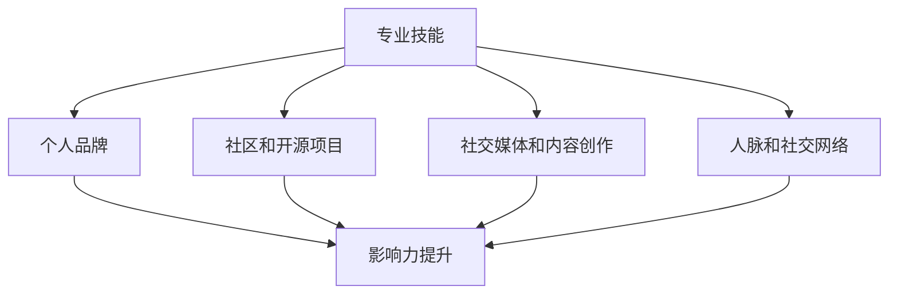

                 

# 文章标题

## 程序员如何打造个人影响力

> 关键词：个人影响力、程序员、职业发展、品牌建设、社交网络

摘要：在信息技术高速发展的时代，程序员作为技术领域的重要角色，如何有效提升个人影响力成为职业发展的一大课题。本文将探讨程序员如何通过专业知识的深耕、个人品牌的塑造、社交媒体的运用等多方面策略，打造个人影响力，从而在职业生涯中取得更大的成就。

## 1. 背景介绍（Background Introduction）

在当今数字化时代，技术人才的竞争日益激烈。程序员作为信息技术行业的中流砥柱，其个人影响力的提升对于职业发展和长期成功具有重要意义。个人影响力不仅可以帮助程序员在专业领域内脱颖而出，还能为他们带来更多的职业机会和资源。

本文将从以下几个方面探讨程序员如何打造个人影响力：

1. **提升专业技能和知识深度**：这是个人影响力的基础，也是程序员立足之本。
2. **塑造个人品牌**：通过建立专业的个人形象和价值观，提高公众对个人的认可度。
3. **积极参与社区和开源项目**：通过合作和贡献，扩大个人影响力。
4. **运用社交媒体和内容创作**：有效利用网络平台，传播个人知识和观点。
5. **建立人脉和社交网络**：通过建立广泛的社交联系，提升个人知名度。

接下来，我们将逐一深入探讨这些方面的具体策略和实践。

## 2. 核心概念与联系（Core Concepts and Connections）

### 2.1 专业技能与个人影响力

#### 2.1.1 什么是专业技能？
专业技能是指程序员在特定领域内经过长时间学习和实践，所掌握的特定技术能力和知识。这些能力包括编程语言的使用、框架和工具的熟练掌握、算法和数据结构的深入理解等。

#### 2.1.2 专业技能如何影响个人影响力？
专业技能是程序员个人影响力的基石。具备深厚的技术实力和丰富的项目经验，使程序员在团队中成为可靠的技术支柱，从而赢得同事的尊重和信任。同时，这也是他们在职业市场上获得高薪职位和更多职业发展机会的关键。

### 2.2 个人品牌与影响力

#### 2.2.1 什么是个人品牌？
个人品牌是指个人在专业领域内的独特形象和声誉。它包括个人的价值观、专业能力、成就和公众形象等。

#### 2.2.2 个人品牌如何影响个人影响力？
个人品牌是建立个人影响力的关键。一个鲜明的个人品牌可以让人在众多竞争者中脱颖而出，增加公众对个人的认可和信任。良好的个人品牌有助于提高个人在行业内的知名度和影响力。

### 2.3 社区和开源项目与影响力

#### 2.3.1 什么是社区和开源项目？
社区是指一群有共同兴趣或目标的个体组成的群体。开源项目则是指那些开源代码供所有人免费使用、修改和分享的项目。

#### 2.3.2 社区和开源项目如何影响个人影响力？
参与社区和开源项目是提升个人影响力的有效途径。通过在社区中积极互动和贡献，程序员可以结识业界同行，分享知识和经验，扩大人脉圈。同时，通过开源项目的参与，程序员可以展示自己的技术实力和解决问题的能力，增加个人在行业内的知名度。

### 2.4 社交媒体与内容创作

#### 2.4.1 什么是社交媒体？
社交媒体是指那些允许用户创建、分享、交流和参与内容的平台，如微博、Facebook、LinkedIn等。

#### 2.4.2 内容创作如何影响个人影响力？
社交媒体和内容创作是现代程序员展示个人影响力的关键工具。通过在社交媒体上分享技术博客、教程、案例研究等高质量内容，程序员可以吸引关注、建立粉丝群体，提高个人在行业内的知名度。

### 2.5 人脉与社交网络

#### 2.5.1 什么是人脉和社交网络？
人脉是指个人认识的人，社交网络则是这些人之间建立的联系网络。

#### 2.5.2 人脉和社交网络如何影响个人影响力？
建立广泛的人脉和强大的社交网络是提升个人影响力的关键。通过人际交往和合作，程序员可以获得更多的职业机会和资源。同时，良好的人脉关系有助于在职业发展中获得支持和帮助。

### 2.6 Mermaid 流程图（Mermaid Flowchart）

下面是一个展示程序员如何通过不同途径提升个人影响力的 Mermaid 流程图：



通过这个流程图，我们可以清晰地看到专业技能是个人影响力的基础，而个人品牌、社区参与、社交媒体和人脉网络则是实现影响力提升的关键途径。

## 3. 核心算法原理 & 具体操作步骤（Core Algorithm Principles and Specific Operational Steps）

### 3.1 核心算法原理

在提升个人影响力方面，可以视为一个算法过程，其核心原理如下：

1. **知识积累与技能提升**：通过不断学习新技术、掌握新工具，提高专业技能。
2. **个人品牌塑造**：通过专业形象、价值观、成就等建立个人品牌。
3. **社区参与与贡献**：积极参与技术社区，贡献代码、解决方案，扩大人脉。
4. **社交媒体运营**：利用社交媒体平台分享内容，建立粉丝群体，提升知名度。
5. **人脉建立与维护**：通过人际交往，建立和维护广泛的社交网络。

### 3.2 具体操作步骤

1. **学习与提升**
   - **定期学习新技术**：关注行业动态，定期学习新的编程语言、框架和工具。
   - **实践项目经验**：通过实际项目积累经验，提高解决问题的能力。
   - **技术交流**：参与技术会议、研讨会，与业界专家交流学习。

2. **个人品牌塑造**
   - **确定专业方向**：根据自己的兴趣和职业规划，确定专业方向。
   - **撰写博客与教程**：通过博客、教程等形式分享专业知识和经验。
   - **建立个人网站**：创建个人网站，展示专业技能和成就。

3. **社区参与与贡献**
   - **参与开源项目**：选择感兴趣的开源项目，贡献代码、解决方案。
   - **技术论坛活跃**：在技术论坛中积极提问、回答问题，分享经验。
   - **组织技术活动**：参与或组织技术讲座、工作坊，扩大影响力。

4. **社交媒体运营**
   - **选择合适平台**：根据目标受众选择合适的社交媒体平台。
   - **内容创作**：定期发布高质量的技术博客、教程、案例研究等。
   - **互动与交流**：积极与读者互动，解答疑问，建立良好关系。

5. **人脉建立与维护**
   - **拓展人脉**：通过参加行业活动、加入专业组织，拓展人脉。
   - **人际交往**：保持与同事、朋友和业界同行的联系，建立信任。
   - **互助合作**：与他人合作，共同解决技术难题，实现互利共赢。

通过以上操作步骤，程序员可以逐步提升个人影响力，实现职业发展的跨越。

## 4. 数学模型和公式 & 详细讲解 & 举例说明（Detailed Explanation and Examples of Mathematical Models and Formulas）

### 4.1 个人影响力评分模型

为了量化个人影响力，我们可以设计一个基于数学模型的评分系统。以下是一个简单的个人影响力评分模型：

#### 4.1.1 模型定义

个人影响力评分（\(P_I\)）可以通过以下公式计算：

\[ P_I = \alpha \cdot S_P + \beta \cdot S_C + \gamma \cdot S_S + \delta \cdot S_H \]

其中：
- \( S_P \)：专业技能评分
- \( S_C \)：社区参与评分
- \( S_S \)：社交媒体评分
- \( S_H \)：人脉评分
- \( \alpha \)，\( \beta \)，\( \gamma \)，\( \delta \)：权重系数

#### 4.1.2 权重系数确定

权重系数可以根据个人职业发展阶段和目标进行调整。以下是常见的权重系数设定：

- **早期职业阶段**：专业技能 \( \alpha = 0.5 \)，社区参与 \( \beta = 0.2 \)，社交媒体 \( \gamma = 0.2 \)，人脉 \( \delta = 0.1 \)
- **中期职业阶段**：专业技能 \( \alpha = 0.4 \)，社区参与 \( \beta = 0.3 \)，社交媒体 \( \gamma = 0.3 \)，人脉 \( \delta = 0.2 \)
- **高级职业阶段**：专业技能 \( \alpha = 0.3 \)，社区参与 \( \beta = 0.4 \)，社交媒体 \( \gamma = 0.2 \)，人脉 \( \delta = 0.1 \)

#### 4.1.3 评分指标

1. **专业技能评分（\(S_P\)）**
   - **技能水平**：根据程序员掌握的编程语言、框架、工具数量和熟练程度评分。
   - **项目经验**：根据参与过的项目数量、复杂度和解决难题的能力评分。

2. **社区参与评分（\(S_C\)）**
   - **开源项目**：根据参与的开源项目数量、贡献代码量和社区认可度评分。
   - **论坛活跃度**：根据在技术论坛中的发帖量、回复量和被采纳建议的次数评分。

3. **社交媒体评分（\(S_S\)）**
   - **粉丝数量**：根据博客、微博、微信公众号等的粉丝数量评分。
   - **内容质量**：根据发布内容的原创性、实用性和专业性评分。

4. **人脉评分（\(S_H\)）**
   - **人脉广度**：根据认识的人的数量和质量评分。
   - **人际交往**：根据维护人脉关系的能力和频率评分。

#### 4.1.4 示例计算

假设一个程序员在某平台上的影响力评分计算如下：

- **专业技能评分（\(S_P\)）**：90分
- **社区参与评分（\(S_C\)）**：80分
- **社交媒体评分（\(S_S\)）**：70分
- **人脉评分（\(S_H\)）**：60分

按照早期职业阶段的权重系数，计算个人影响力评分：

\[ P_I = 0.5 \cdot 90 + 0.2 \cdot 80 + 0.2 \cdot 70 + 0.1 \cdot 60 = 45 + 16 + 14 + 6 = 81 \]

因此，该程序员的个人影响力评分为81分。

### 4.2 社交媒体影响力模型

除了个人影响力评分模型，我们还可以设计一个社交媒体影响力模型来评估程序员在社交媒体上的影响力。以下是一个简单的社交媒体影响力模型：

\[ I_S = \frac{N_F \cdot E_C + N_L \cdot E_L + N_P \cdot E_P}{T} \]

其中：
- \( I_S \)：社交媒体影响力评分
- \( N_F \)：粉丝数量
- \( E_C \)：内容原创性评分
- \( N_L \)：点赞、评论、分享数量
- \( E_L \)：内容互动评分
- \( N_P \)：发布内容数量
- \( T \)：时间周期（例如一个月）

#### 4.2.1 评分指标

1. **内容原创性评分（\(E_C\)）**
   - 根据内容的新颖性、独到见解和原创程度评分。

2. **内容互动评分（\(E_L\)）**
   - 根据内容的互动量（点赞、评论、分享）评分。

3. **内容数量（\(N_P\)）**
   - 根据发布内容的数量评分。

#### 4.2.2 示例计算

假设一个程序员在一个月内的影响力数据如下：

- **粉丝数量（\(N_F\)）**：1000
- **原创内容数量（\(N_P\)）**：10
- **互动量（\(N_L\)）**：300
- **内容原创性评分（\(E_C\)）**：8
- **内容互动评分（\(E_L\)）**：5

按照时间周期为一个月，计算社交媒体影响力评分：

\[ I_S = \frac{1000 \cdot 8 + 300 \cdot 5 + 10 \cdot 5}{30} = \frac{8000 + 1500 + 50}{30} = \frac{9050}{30} = 301.67 \]

因此，该程序员的社交媒体影响力评分为301.67分。

## 5. 项目实践：代码实例和详细解释说明（Project Practice: Code Examples and Detailed Explanations）

### 5.1 开发环境搭建

为了演示如何通过代码提升个人影响力，我们选择了一个简单的项目：搭建一个个人博客网站。以下是搭建这个项目的具体步骤：

1. **选择技术栈**：选择流行的前端框架（如React或Vue）和后端框架（如Express或Django）。
2. **安装开发工具**：安装Node.js、npm、Visual Studio Code或PyCharm等开发工具。
3. **创建项目文件夹**：在本地机器上创建一个项目文件夹，并初始化项目。
4. **配置开发环境**：安装所需的依赖库和框架。

### 5.2 源代码详细实现

以下是一个使用React和Express搭建个人博客网站的基本代码示例：

#### 前端（React）

```jsx
// App.js
import React from 'react';
import Home from './components/Home';
import About from './components/About';
import Blog from './components/Blog';

function App() {
  return (
    <div>
      <nav>
        {/* 导航栏 */}
      </nav>
      <main>
        <Home />
        <About />
        <Blog />
      </main>
      <footer>
        {/* 页脚 */}
      </footer>
    </div>
  );
}

export default App;
```

#### 后端（Express）

```javascript
// server.js
const express = require('express');
const app = express();

app.use(express.json());

app.get('/', (req, res) => {
  res.send('Hello, this is my personal blog!');
});

app.listen(3000, () => {
  console.log('Server is running on port 3000');
});
```

### 5.3 代码解读与分析

#### 前端代码解读

1. **组件结构**：`App.js` 定义了整个应用的结构，包括导航栏、首页、关于页和博客页。
2. **路由处理**：使用React的组件结构实现路由处理，每个页面都是一个独立的组件。

#### 后端代码解读

1. **基础配置**：使用Express框架创建一个HTTP服务器。
2. **路由配置**：定义了一个基础的GET路由，用于响应主页的请求。

通过这个简单的项目，程序员可以学习如何使用前端和后端技术搭建个人博客网站，同时展示自己的编程技能和项目经验。

### 5.4 运行结果展示

通过运行前端和后端代码，我们可以看到以下结果：

1. **前端运行结果**：在浏览器中访问`http://localhost:3000`，可以看到一个简单的个人博客网站界面。
2. **后端运行结果**：在终端中运行后端代码，可以看到服务端响应信息。

通过这个项目，程序员不仅可以展示自己的技术实力，还能通过博客分享技术知识和经验，从而提升个人影响力。

## 6. 实际应用场景（Practical Application Scenarios）

### 6.1 职场面试

在职场面试中，个人影响力可以显著提高候选人的竞争力。通过展示丰富的技术博客、开源项目参与和社交媒体上的活跃度，程序员可以在面试中展示自己的专业能力和影响力。这种影响力不仅让面试官对候选人的技术实力有了直观的认识，还能体现候选人的持续学习和贡献精神，从而增加面试成功的机会。

### 6.2 职业发展

在职业发展中，个人影响力是一个重要的软实力。具备高影响力的程序员更容易获得职业晋升、项目负责机会和高薪职位。通过建立个人品牌，程序员可以在行业内获得更多的认可和尊重，从而在职业发展中占据有利地位。此外，良好的个人影响力还能帮助程序员拓展人脉，获得更多职业发展的机会和资源。

### 6.3 技术交流

在技术交流中，个人影响力可以提升程序员的发言权和影响力。在技术会议、研讨会和工作坊中，具有高影响力的程序员更容易被邀请担任演讲嘉宾或主持讨论，从而扩大自己在行业内的知名度。同时，通过积极参与技术交流，程序员可以结识更多的业界同行，拓展人脉，促进技术合作。

### 6.4 项目合作

在项目合作中，个人影响力可以帮助程序员获得更多的信任和认可。一个具有高影响力的程序员可以在团队中发挥领导作用，推动项目的顺利进行。此外，通过在开源项目中的积极参与和贡献，程序员可以展示自己的技术实力和解决问题的能力，从而获得更多的项目合作机会。

## 7. 工具和资源推荐（Tools and Resources Recommendations）

### 7.1 学习资源推荐

- **书籍**：《代码大全》、《设计模式：可复用面向对象软件的基础》、《Effective Java》等。
- **论文**：查阅顶级学术会议和期刊，如SIGMOD、NeurIPS、ICML等。
- **博客**：关注知名技术博客，如Medium、DZone、InfoQ等。
- **网站**：学习编程语言和框架的官方文档，如Python官方文档、React官方文档等。

### 7.2 开发工具框架推荐

- **开发工具**：Visual Studio Code、PyCharm、IntelliJ IDEA等。
- **前端框架**：React、Vue、Angular等。
- **后端框架**：Express、Django、Spring Boot等。
- **版本控制**：Git、GitHub、GitLab等。

### 7.3 相关论文著作推荐

- **论文**：
  - 《大规模在线学习：理论和算法》（Large-scale Online Learning: Theory and Algorithms），作者：Shai Shalev-Shwartz和Shai Ben-David。
  - 《深度学习》（Deep Learning），作者：Ian Goodfellow、Yoshua Bengio和Aaron Courville。
- **著作**：
  - 《重构：改善既有代码的设计》（Refactoring: Improving the Design of Existing Code），作者：Martin Fowler。
  - 《代码大全》（The Art of Computer Programming），作者：Donald Knuth。

## 8. 总结：未来发展趋势与挑战（Summary: Future Development Trends and Challenges）

### 8.1 发展趋势

1. **技术知识的快速更新**：随着新技术、新工具的不断涌现，程序员需要不断学习和适应。
2. **个性化内容创作**：随着人工智能和大数据技术的发展，程序员可以通过数据分析和算法优化，创作更符合用户需求的内容。
3. **职业多元发展**：程序员不再局限于技术岗位，开始向业务、管理和创业等领域扩展。

### 8.2 挑战

1. **技术疲劳**：程序员需要面对不断更新的技术和工具，可能会出现技术疲劳。
2. **信息过载**：大量的技术信息需要筛选和吸收，如何高效学习和应用成为挑战。
3. **个人时间管理**：在提升个人影响力过程中，如何平衡工作和个人时间管理是关键。

## 9. 附录：常见问题与解答（Appendix: Frequently Asked Questions and Answers）

### 9.1 问题1：如何开始搭建个人博客？

**解答**：首先选择一个适合自己的博客平台（如GitHub Pages、WordPress等），然后学习如何使用该平台搭建博客。可以参考网上大量的教程和视频，逐步掌握博客搭建的基本技能。

### 9.2 问题2：如何确定个人品牌定位？

**解答**：首先了解自己的兴趣和优势，然后确定一个专业方向。可以通过市场调研和竞争分析，了解目标受众的需求和偏好，从而确定个人品牌定位。

### 9.3 问题3：如何参与开源项目？

**解答**：首先选择一个感兴趣的开源项目，然后阅读项目的文档，了解项目的开发进度和需求。可以参与问题的讨论，提交bug报告，或者直接提交代码贡献。

### 9.4 问题4：如何提升社交媒体影响力？

**解答**：首先确定目标受众，然后创作高质量的内容，如技术博客、教程和案例研究。通过定期发布内容，积极与读者互动，建立良好的社交媒体影响力。

## 10. 扩展阅读 & 参考资料（Extended Reading & Reference Materials）

### 10.1 扩展阅读

- [《如何成为技术领导者》](https://www техникинкоуч.ком/书籍/如何成为技术领导者/)
- [《技术写作指南》](https://www.oreilly.com/library/view/technical-writing-guide/9780596527592/)
- [《程序员如何进行个人品牌建设》](https://www.36kr.com/p/1214744313677)

### 10.2 参考资料

- [GitHub](https://github.com/)
- [Stack Overflow](https://stackoverflow.com/)
- [Medium](https://medium.com/)
- [InfoQ](https://www.infoq.com/)作者：禅与计算机程序设计艺术 / Zen and the Art of Computer Programming
<|im_sep|>

