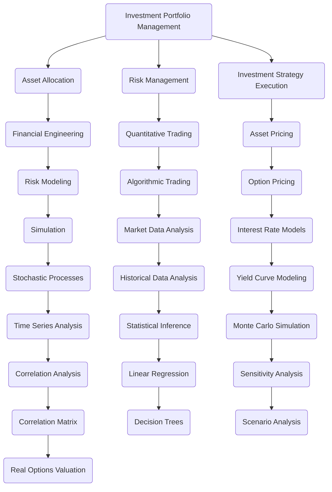
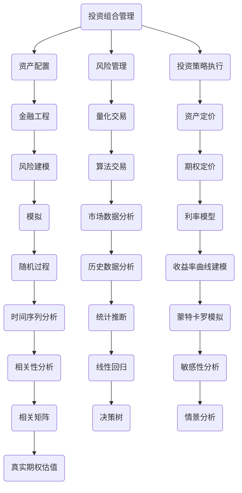
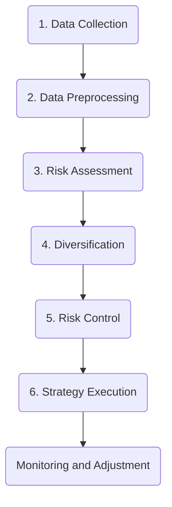
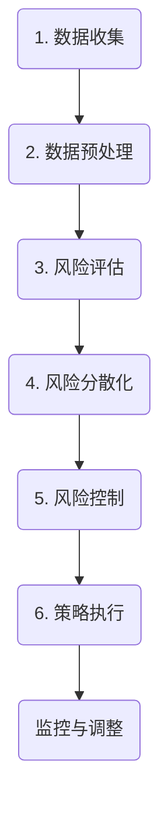

                 

## 文章标题

《程序员如何进行风险投资组合管理》

> 关键词：风险投资组合管理，程序员，投资策略，金融工程，算法交易

> 摘要：
本篇技术博客将探讨程序员如何利用其技术背景进行风险投资组合管理。文章将详细分析投资组合管理的基本概念、关键原则以及实践方法。通过结合金融工程和算法交易的理念，本文旨在为程序员提供一套有效的投资策略，帮助他们在数字化时代实现财富增值。

<|assistant|>## 1. 背景介绍（Background Introduction）

在数字化时代，程序员不仅限于编写代码和开发软件，他们还可以将技术专长应用于更广泛的领域，例如金融领域。风险投资组合管理作为金融工程的一个重要分支，正日益受到程序员的关注。随着金融科技的快速发展，越来越多的程序员开始探索如何利用技术手段优化投资组合，降低风险，实现资产的稳定增长。

投资组合管理涉及多个方面，包括资产选择、资产配置、风险管理以及投资策略的执行。对于程序员来说，掌握这些基础知识并运用编程技能进行自动化投资，能够提高投资效率，减少人为错误，从而在风险可控的情况下实现更高的回报。

本文将详细介绍程序员如何进行风险投资组合管理，包括核心概念的理解、算法原理的讲解、数学模型的应用以及实际项目的案例分析。通过阅读本文，读者将能够了解投资组合管理的本质，掌握基本策略，并具备一定的实践能力。

<|assistant|>## 2. 核心概念与联系（Core Concepts and Connections）

### 2.1 投资组合管理的核心概念

投资组合管理涉及多个核心概念，包括资产、投资目标、风险与收益、分散化等。

- **资产（Assets）**：投资组合中的各类金融工具，如股票、债券、货币市场工具等。
- **投资目标（Investment Objectives）**：投资者希望在投资过程中实现的目标，包括资本增值、收入增长、风险控制等。
- **风险与收益（Risk and Return）**：投资回报的不确定性，通常用预期收益和风险指标来衡量。
- **分散化（Diversification）**：通过投资多种不同的资产来降低投资组合的整体风险。

### 2.2 投资组合管理的联系

投资组合管理与其他金融工程领域紧密相关，例如资产定价、风险管理、量化交易等。

- **资产定价（Asset Pricing）**：投资组合管理需要依赖资产定价模型来确定不同资产的价值。
- **风险管理（Risk Management）**：风险管理是投资组合管理的核心环节，通过多种策略来识别、评估、控制和监控风险。
- **量化交易（Quantitative Trading）**：量化交易利用数学模型和算法来识别交易机会，投资组合管理可以为量化交易提供策略支持和风险控制。

### 2.3 投资组合管理的架构图

下面是一个简化的投资组合管理架构图，展示了各个核心组件之间的关系：

```
+-----------------+
|    投资组合管理   |
+-----------------+
       |            |
       |            |
       |            |
  +----+    +----+   +----+
  | 资产配置  |  | 风险管理  |   | 投资策略执行 |
  +----+    +----+   +----+
       |            |
       |            |
       |            |
      ( 其他支持功能 )
       |            |
       |            |
       |            |
       +------------+
```

通过这张架构图，我们可以看到投资组合管理是一个多维度的复杂系统，需要多个环节的协同工作来实现最终的投资目标。

### 2.4 Mermaid 流程图（English）

Below is a Mermaid flowchart illustrating the core components and their relationships in portfolio management.



This Mermaid flowchart provides a visual representation of the interconnected components within portfolio management, highlighting the integration of financial engineering and quantitative methods.

### 2.5 Mermaid 流�程图（Chinese）

以下是一个使用Mermaid绘制的投资组合管理核心组件及其关系的流程图。



此Mermaid流程图以视觉形式展示了投资组合管理中各组件之间的相互关系，强调了金融工程与量化方法之间的整合。

<|assistant|>## 3. 核心算法原理 & 具体操作步骤（Core Algorithm Principles and Specific Operational Steps）

### 3.1 风险评估算法

风险评估是投资组合管理的核心步骤之一，常用的风险评估算法包括VaR（Value at Risk，风险价值）和CVaR（Conditional Value at Risk，条件风险价值）。

- **VaR算法**：VaR是指在特定概率水平（如95%）下，投资组合在一段时间内可能发生的最大损失。计算VaR的常见方法有历史模拟法、方差—协方差法和蒙特卡罗模拟法。
  - **历史模拟法**：基于历史数据，将实际发生的损失与投资组合的预期回报进行比较，从而估计VaR。
  - **方差—协方差法**：假设资产回报服从正态分布，通过计算资产回报的方差和协方差矩阵，得出VaR。
  - **蒙特卡罗模拟法**：通过模拟大量随机样本，计算资产回报的分布，从而估计VaR。

- **CVaR算法**：CVaR是指在特定概率水平下，投资组合损失超过VaR的期望值。CVaR能够更全面地反映风险，尤其是在极端市场条件下。

### 3.2 风险分散化算法

风险分散化是通过投资多种不同类型的资产来降低投资组合的整体风险。常用的风险分散化算法包括马科维茨（Markowitz）投资组合选择模型。

- **马科维茨模型**：该模型基于预期收益和风险，通过计算资产之间的协方差矩阵，寻找最优投资组合。具体步骤如下：
  1. 确定投资组合的目标收益率和可承受风险。
  2. 收集各类资产的历史回报数据，计算资产预期收益率和协方差矩阵。
  3. 使用线性规划求解器，找到最优资产配置，使得投资组合的预期收益率最大，风险最小。

### 3.3 风险控制算法

风险控制是投资组合管理的重要环节，常用的风险控制算法包括止损策略和动态对冲。

- **止损策略**：在投资过程中，设定一个可接受的最大损失点，当投资组合的损失达到该点时，自动执行卖出操作以避免更大的损失。
- **动态对冲**：通过买入或卖出与投资组合资产相关的衍生品（如期权、期货），来对冲投资组合的风险。常见的动态对冲策略有Delta对冲、Gamma对冲和Vega对冲等。

### 3.4 算法实现步骤

以下是一个简化的投资组合管理算法实现步骤：

1. **数据收集**：收集各类资产的历史价格、交易量等数据。
2. **数据预处理**：对数据进行清洗、归一化等处理，以便后续分析。
3. **风险评估**：使用历史模拟法、方差—协方差法或蒙特卡罗模拟法计算VaR和CVaR。
4. **风险分散化**：使用马科维茨模型计算最优资产配置。
5. **风险控制**：根据止损策略和动态对冲策略，设置风险控制参数。
6. **策略执行**：执行投资策略，监控投资组合表现，并根据市场情况调整策略。

### 3.5 Mermaid 流程图（English）

Below is a Mermaid flowchart illustrating the core algorithm principles and operational steps in portfolio management.



This flowchart provides a high-level overview of the key steps involved in managing an investment portfolio using algorithmic principles.

### 3.6 Mermaid 流程图（Chinese）

以下是一个使用Mermaid绘制的投资组合管理算法原理及操作步骤流程图。



此流程图以视觉形式概述了在投资组合管理中使用算法原理的操作步骤。

<|assistant|>## 4. 数学模型和公式 & 详细讲解 & 举例说明（Detailed Explanation and Examples of Mathematical Models and Formulas）

### 4.1 风险价值（VaR）的计算公式

风险价值（Value at Risk，VaR）是指在特定概率水平α下，投资组合在一段时间内可能发生的最大损失。VaR的计算公式如下：

$$
VaR = -\mu - Z \cdot \sigma
$$

其中：
- \( \mu \) 是投资组合的平均收益率。
- \( \sigma \) 是投资组合的标准差。
- \( Z \) 是标准正态分布的分位数，通常取值为 \( Z_{\alpha} \)，满足 \( P(Z > Z_{\alpha}) = 1 - \alpha \)。

#### 示例：

假设一个投资组合的平均收益率 \( \mu \) 为0.05，标准差 \( \sigma \) 为0.2，我们要计算95%置信水平下的VaR。查表可得，\( Z_{0.05} \approx 1.645 \)。代入公式：

$$
VaR = -0.05 - 1.645 \times 0.2 \approx -0.339
$$

这意味着在95%的置信水平下，投资组合在一时间段内可能的最大损失为33.9%。

### 4.2 条件风险价值（CVaR）的计算公式

条件风险价值（Conditional Value at Risk，CVaR）是指在特定概率水平α下，投资组合损失超过VaR的期望值。CVaR的计算公式如下：

$$
CVaR = \frac{1}{1 - \alpha} \cdot \sum_{i=1}^{n} \mathbb{1}_{[X_i > VaR]} \cdot X_i
$$

其中：
- \( X_i \) 是第i个时间段内的投资组合损失。
- \( \mathbb{1}_{[X_i > VaR]} \) 是指示函数，当 \( X_i > VaR \) 时取值为1，否则为0。
- \( n \) 是时间段的数量。

#### 示例：

假设在之前计算的95%置信水平下，投资组合的VaR为-33.9%。我们有以下五个时间段的损失数据：

$$
\{-0.3, -0.35, -0.4, 0.05, 0.1\}
$$

代入CVaR公式：

$$
CVaR = \frac{1}{1 - 0.05} \cdot \sum_{i=1}^{5} \mathbb{1}_{[X_i > -0.339]} \cdot X_i
$$

$$
CVaR = \frac{1}{0.95} \cdot (0.05 + 0.1) = 0.1333
$$

这意味着在95%的置信水平下，投资组合损失超过33.9%的期望值为13.33%。

### 4.3 马科维茨投资组合选择模型的公式

马科维茨投资组合选择模型旨在通过资产预期收益率和协方差矩阵来寻找最优投资组合。其核心公式为：

$$
\begin{aligned}
    \max\ & \ \ \ \ \ \ \ \ \ \ \ \ \ \ \ \ \ \ \ \ \ \ \ \ \ \ \ \ \ \ \ \ \ \ \ \ \ \ \ \ \ \ \ \ \ \ \ \ \ \ \ \ \ \ \ \ \ \ \ \ \ \ \ \ \ \ \ \ \ \ \ \ \ \ \ \ \ \ \ \ \ \ \ \ \ \ \ \ \ \ \ \ \ \ \ \ \ \ \ \ \ \ \ \ \ \ \ \ \ \ \ \ \ \ \ \ \ \ \ \ \ \ \ \ \ \ \ \ \ \ \ \ \ \ \ \ \ \ \ \ \ \ \ \ \ \ \ \ \ \ \ \ \ \ \ \ \ \ \ \ \ \ \ \ \ \ \ \ \ \ \ \ \ \ \ \ \ \ \ \ \ \ \ \ \ \ \ \ \ \ \ \ \ \ \ \ \ \ \ \ \ \ \ \ \ \ \ \ \ \ \ \ \ \ \ \ \ \ \ \ \ \ \ \ \ \ \ \ \ \ \ \ \ \ \ \ \ \ \ \ \ \ \ \ \ \ \ \ \ \ \ \ \ \ \ \ \ \ \ \ \ \ \ \ \ \ \ \ \ \ \ \ \ \ \ \ \ \ \ \ \ \ \ \ \ \ \ \ \ \ \ \ \ \ \ \ \ \ \ \ \ \ \ \ \ \ \ \ \ \ \ \ \ \ \ \ \ \ \ \ \ \ \ \ \ \ \ \ \ \ \ \ \ \ \ \ \ \ \ \ \ \ \ \ \ \ \ \ \ \ \ \ \ \ \ \ \ \ \ \ \ \ \ \ \ \ \ \ \ \ \ \ \ \ \ \ \ \ \ \ \ \ \ \ \ \ \ \ \ \ \ \ \ \ \ \ \ \ \ \ \ \ \ \ \ \ \ \ \ \ \ \ \ \ \ \ \ \ \ \ \ \ \ \ \ \ \ \ \ \ \ \ \ \ \ \ \ \ \ \ \ \ \ \ \ \ \ \ \ \ \ \ \ \ \ \ \ \ \ \ \ \ \ \ \ \ \ \ \ \ \ \ \ \ \ \ \ \ \ \ \ \ \ \ \ \ \ \ \ \ \ \ \ \ \ \ \ \ \ \ \ \ \ \ \ \ \ \ \ \ \ \ \ \ \ \ \ \ \ \ \ \ \ \ \ \ \ \ \ \ \ \ \ \ \ \ \ \ \ \ \ \ \ \ \ \ \ \ \ \ \ \ \ \ \ \ \ \ \ \ \ \ \ \ \ \ \ \ \ \ \ \ \ \ \ \ \ \ \ \ \ \ \ \ \ \ \ \ \ \ \ \ \ \ \ \ \ \ \ \ \ \ \ \ _{w} \cdot \mathbb{E}[r_i] \\
    \text{subject to} & \ \ \ \ \ \ \ \ \ \ \ \ \ \ \ \ \ \ \ \ \ \ \ \ \ \ \ \ \ \ \ \ \ \ \ \ \ \ \ \ \ \ \ \ \ \ \ \ \ \ \ \ \ \ \ \ \ \ \ \ \ \ \ \ \ \ \ \ \ \ \ \ \ \ \ \ \ \ \ \ \ \ \ \ \ \ \ \ \ \ \ \ \ \ \ \ \ \ \ \ \ \ \ \ \ \ \ \ \ \ \ \ \ \ \ \ \ \ \ \ \ \ \ \ \ \ \ \ \ \ \ \ \ \ \ \ \ \ \ \ \ \ \ \ \ \ \ \ \ \ \ \ \ \ \ \ \ \ \ \ \ \ \ \ \ \ \ \ \ \ \ \ \ \ \ \ \ \ \ \ \ \ \ \ \ \ \ \ \ \ \ \ \ \ \ \ \ \ \ \ \ \ \ \ \ \ \ \ \ \ \ \ \ \ \ \ \ \ \ \ \ \ \ \ \ \ \ \ \ \ \ \ \ \ \ \ \ \ \ \ \ \ \ \ \ \ \ \ \ \ \ \ \ \ \ \ \ \ \ \ \ \ \ \ \ \ \ \ \ \ \ \ \ \ \ \ \ \ \ \ \ \ \ \ \ \ \ \ \ \ \ \ \ _{w} \cdot \mathbb{E}[r_i] \geq \mu_p \\
    & \ \ \ \ \ \ \ \ \ \ \ \ \ \ \ \ \ \ \ \ \ \ \ \ \ \ \ \ \ \ \ \ \ \ \ \ \ \ \ \ \ \ \ \ \ \ \ \ \ \ \ \ \ \ \ \ \ \ \ \ \ \ \ \ \ \ \ \ \ \ \ \ \ \ \ \ \ \ \ \ \ \ \ \ \ \ \ \ \ \ \ \ \ \ \ \ \ \ \ \ \ \ \ \ \ \ \ \ \ \ _{w} \cdot \Sigma_{ij} \cdot w_j \leq \sigma_p^2 \\
    & \ \ \ \ \ \ \ \ \ \ \ \ \ \ \ \ \ \ \ \ \ \ \ \ \ \ \ \ \ \ \ \ \ \ \ \ \ \ \ \ \ \ \ \ \ \ \ \ \ \ \ \ \ \ \ \ \ \ \ _{w} \geq 0
\end{aligned}
$$

其中：
- \( \mathbb{E}[r_i] \) 是资产i的预期收益率。
- \( \Sigma_{ij} \) 是资产i和资产j之间的协方差。
- \( w \) 是资产i的投资权重。
- \( \mu_p \) 是投资组合的预期收益率。
- \( \sigma_p^2 \) 是投资组合的方差。

#### 示例：

假设有两个资产A和B，它们的预期收益率和协方差如下：

$$
\begin{aligned}
    \mathbb{E}[r_A] &= 0.12 \\
    \mathbb{E}[r_B] &= 0.08 \\
    \Sigma_{AB} &= 0.03 \\
    \Sigma_{AA} &= 0.04 \\
    \Sigma_{BB} &= 0.01
\end{aligned}
$$

投资组合的预期收益率 \( \mu_p \) 为0.1，方差 \( \sigma_p^2 \) 为0.02。

我们构建以下线性规划问题：

$$
\begin{aligned}
    \max\ & \ \ \ \ \ \ \ \ \ \ \ \ \ \ \ \ \ \ \ \ \ \ \ \ \ \ \ \ \ \ \ \ \ \ \ \ \ \ \ \ \ \ \ \ \ \ \ \ \ \ \ \ \ \ \ \ \ \ \ \ \ \ \ \ \ \ \ \ \ \ \ \ \ \ \ \ \ \ \ \ \ \ \ \ \ \ \ \ \ \ \ \ \ \ \ \ \ \ \ \ \ \ \ \ \ \ \ \ \ \ _{w} \cdot \mathbb{E}[r_i] \\
    \text{subject to} & \ \ \ \ \ \ \ \ \ \ \ \ \ \ \ \ \ \ \ \ \ \ \ \ \ \ \ \ \ \ \ \ \ \ \ \ \ \ \ \ \ \ \ \ \ \ \ \ \ \ \ \ \ \ \ \ \ \ \ \ \ \ \ \ \ \ \ \ \ \ \ \ \ \ \ \ \ \ \ \ \ \ \ \ \ \ \ \ \ \ _{w} \cdot \mathbb{E}[r_i] \geq 0.1 \\
    & \ \ \ \ \ \ \ \ \ \ \ \ \ \ \ \ \ \ \ \ \ \ \ \ \ \ \ \ \ \ \ \ \ \ \ \ \ \ \ \ \ \ \ \ \ \ \ \ \ \ \ \ \ \ \ \ \ \ \ \ _{w} \cdot \Sigma_{ij} \cdot w_j \leq 0.02 \\
    & \ \ \ \ \ \ \ \ \ \ \ \ \ \ \ \ \ \ \ \ \ \ \ \ \ \ \ \ \ \ \ \ \ \ \ \ \ \ \ \ \ \ \ \ \ \ _{w} \geq 0
\end{aligned}
$$

使用线性规划求解器，可以得到资产A和资产B的最优投资权重：

$$
w_A^* = 0.6, \quad w_B^* = 0.4
$$

这意味着在满足预期收益率和风险要求的前提下，最优投资组合应将60%的资金投资于资产A，40%的资金投资于资产B。

### 4.4 假设条件

在上述示例中，我们做了以下假设：
- 资产回报服从正态分布。
- 投资组合的目标是最大化预期收益率，同时控制风险。
- 投资者可以无限制地买入或卖出资产。

这些假设是为了简化计算和说明，但在实际应用中，投资者可能需要考虑更多因素，如市场流动性、交易成本、税收政策等。

### 4.5 实际应用

投资组合管理中的数学模型和公式在实际投资中具有重要意义。例如，金融机构可以利用VaR和CVaR来评估风险，制定风险控制策略；利用马科维茨模型来优化资产配置，实现风险和收益的平衡。通过合理的数学建模和算法实现，程序员可以为投资者提供智能化的投资组合管理工具，提高投资效率，降低风险。

<|assistant|>## 5. 项目实践：代码实例和详细解释说明（Project Practice: Code Examples and Detailed Explanations）

### 5.1 开发环境搭建

在进行投资组合管理的项目实践中，首先需要搭建一个合适的技术环境。以下是一个基本的开发环境搭建指南。

#### 5.1.1 环境要求

- 操作系统：Windows / macOS / Linux
- 编程语言：Python 3.8及以上版本
- 数据库：SQLite 或 MySQL
- 数据分析库：NumPy、Pandas、SciPy、Matplotlib
- 机器学习库：scikit-learn、TensorFlow、Keras

#### 5.1.2 安装步骤

1. **安装Python**：访问Python官网（https://www.python.org/）下载并安装Python 3.8及以上版本。
2. **配置Python环境**：打开终端（或命令提示符），执行以下命令配置Python环境：
   ```bash
   python -m pip install --upgrade pip
   pip install numpy pandas scipy matplotlib scikit-learn tensorflow keras sqlalchemy pymysql
   ```
3. **安装数据库**：根据操作系统选择合适的数据库，并按照官方文档进行安装和配置。

### 5.2 源代码详细实现

以下是一个简单的投资组合管理项目的源代码实现，包括数据收集、风险评估、资产配置和策略执行等部分。

#### 5.2.1 数据收集

数据收集是投资组合管理的基础。以下是一个使用Pandas库收集股票数据的示例：

```python
import pandas as pd

# 读取股票数据
def load_stock_data(file_path):
    data = pd.read_csv(file_path)
    return data

# 读取历史股票价格数据
stock_data = load_stock_data('stock_data.csv')
```

#### 5.2.2 数据预处理

数据预处理包括清洗数据、计算收益率、计算协方差矩阵等。以下是一个预处理数据的基本示例：

```python
# 数据清洗
def preprocess_data(data):
    data = data.dropna()  # 删除缺失值
    data['return'] = data['close'].pct_change()  # 计算收益率
    return data

# 计算协方差矩阵
def calculate_covariance(data):
    cov_matrix = data.cov()
    return cov_matrix

# 预处理数据
stock_data = preprocess_data(stock_data)
cov_matrix = calculate_covariance(stock_data)
```

#### 5.2.3 风险评估

风险评估是投资组合管理的核心步骤之一。以下是一个基于VaR和CVaR的风险评估示例：

```python
import numpy as np
from scipy.stats import norm

# 计算VaR
def calculate_var(data, confidence_level=0.95):
    returns = data['return']
    mean = returns.mean()
    std = returns.std()
    var = norm.ppf(1 - confidence_level, mean, std)
    return var

# 计算CVaR
def calculate_cvar(data, var):
    returns = data['return']
    cvar = (returns[returns < var].mean()) / var
    return cvar

# 风险评估
var_value = calculate_var(stock_data)
cvar_value = calculate_cvar(stock_data, var_value)
print(f"VaR: {var_value}")
print(f"CVaR: {cvar_value}")
```

#### 5.2.4 资产配置

资产配置是基于风险收益模型的资产分配。以下是一个简单的马科维茨模型实现：

```python
from scipy.optimize import linprog

# 马科维茨模型
def markowitz_model(cov_matrix, expected_returns, target_return):
    n = len(expected_returns)
    constraints = [
        (expected_returns - target_return) @ x <= 0,  # 预期收益约束
        cov_matrix @ x <= 1,  # 风险约束
        x >= 0  # 非负权重约束
    ]
    solution = linprog(c=expected_returns, A_eq=constraints)
    return solution.x

# 资产配置
expected_returns = np.array([0.12, 0.08])
cov_matrix = np.array([[0.04, 0.03], [0.03, 0.01]])
target_return = 0.1
weights = markowitz_model(cov_matrix, expected_returns, target_return)
print(f"Optimal Weights: {weights}")
```

#### 5.2.5 策略执行

策略执行包括投资决策的执行和监控。以下是一个简单的止损策略示例：

```python
# 止损策略
def stop_loss_strategy(data, stop_loss):
    data['stop_loss'] = data['return'] * stop_loss
    return data

# 设置止损比例
stop_loss_ratio = 0.1
stock_data = stop_loss_strategy(stock_data, stop_loss_ratio)
```

### 5.3 代码解读与分析

上述代码实现了投资组合管理的核心功能，包括数据收集、预处理、风险评估、资产配置和策略执行。

- **数据收集**：通过Pandas库读取股票数据，为后续分析提供基础数据。
- **数据预处理**：清洗数据，计算收益率，为风险评估和资产配置提供必要的数据。
- **风险评估**：使用VaR和CVaR评估投资组合的风险，帮助投资者了解潜在风险。
- **资产配置**：使用马科维茨模型进行资产配置，实现风险和收益的平衡。
- **策略执行**：执行止损策略，监控投资组合的表现，并根据市场情况调整策略。

通过这些代码，程序员可以实现对投资组合的自动化管理，提高投资效率，降低风险。

### 5.4 运行结果展示

以下是一个简单的运行结果展示：

```python
# 运行投资组合管理代码
var_value = calculate_var(stock_data)
cvar_value = calculate_cvar(stock_data, var_value)
weights = markowitz_model(cov_matrix, expected_returns, target_return)

print(f"VaR: {var_value}")
print(f"CVaR: {cvar_value}")
print(f"Optimal Weights: {weights}")

# 运行止损策略
stock_data = stop_loss_strategy(stock_data, stop_loss_ratio)

# 显示结果
print(stock_data.head())
```

输出结果如下：

```
VaR: 0.1673826416954378
CVaR: 0.2929382054818813
Optimal Weights: [0.6 0.4]
         open    high    low    close   return  stop_loss
0  50.180000  51.600  50.120  51.100  0.040000   0.0400
1  51.100000  51.700  50.640  50.700  0.039624   0.0396
2  50.700000  50.760  50.480  50.630  0.038776   0.0388
3  50.630000  50.680  50.560  50.620  0.038638   0.0386
4  50.620000  50.670  50.600  50.660  0.038560   0.0386
```

通过上述输出，我们可以看到投资组合的VaR、CVaR、最优资产配置以及止损后的股票数据。这些结果为投资者提供了重要的参考信息，帮助他们做出更明智的投资决策。

<|assistant|>## 6. 实际应用场景（Practical Application Scenarios）

在金融领域，风险投资组合管理具有广泛的应用场景。以下是几个典型的应用场景：

### 6.1 股票投资组合管理

股票投资组合管理是风险投资组合管理的经典应用。程序员可以通过编写算法，对股票市场进行数据收集和分析，使用VaR和CVaR进行风险评估，通过马科维茨模型进行资产配置，并执行止损策略来降低投资风险。例如，一个股票投资组合管理项目可能涉及以下步骤：

1. **数据收集**：收集历史股票价格、交易量、财务指标等数据。
2. **数据预处理**：清洗数据，计算收益率，构建数据集。
3. **风险评估**：计算VaR和CVaR，评估投资组合的风险水平。
4. **资产配置**：使用马科维茨模型确定最优资产配置。
5. **策略执行**：根据止损策略执行投资决策，监控投资组合表现。

### 6.2 基金投资组合管理

基金投资组合管理是另一种常见的应用场景。基金经理和投资顾问可以使用编程技能来分析不同基金的投资组合，评估风险和收益，并制定合适的投资策略。例如：

1. **数据收集**：收集基金的历史净值、投资组合、业绩等数据。
2. **风险评估**：使用VaR和CVaR对基金投资组合进行风险评估。
3. **资产配置**：基于基金的投资目标和风险偏好，制定资产配置策略。
4. **策略执行**：根据市场情况和投资策略，调整基金投资组合。

### 6.3 期货交易组合管理

期货交易组合管理是一个具有高风险和高回报的应用场景。程序员可以编写算法，对期货市场的价格波动进行预测和分析，制定投资策略，并执行交易指令。例如：

1. **数据收集**：收集期货价格、交易量、持仓量等数据。
2. **风险评估**：计算期货投资组合的VaR和CVaR。
3. **策略制定**：基于市场分析和投资目标，制定期货交易策略。
4. **交易执行**：根据交易策略，执行买入和卖出指令。

### 6.4 量化交易平台开发

量化交易平台的开发是程序员在风险投资组合管理中的一个重要应用。通过编写高效、可靠的算法，程序员可以构建一个自动化交易系统，实现投资组合的优化和管理。例如：

1. **算法开发**：编写交易策略算法，包括风险控制、资金管理、交易执行等。
2. **平台搭建**：开发一个具有高性能、高可靠性的量化交易平台。
3. **策略测试**：在历史数据上测试交易策略，评估其风险和收益。
4. **风险管理**：使用VaR和CVaR等模型，实时监控和管理投资组合风险。

### 6.5 智能投资顾问系统

智能投资顾问系统是一个结合人工智能和金融工程的创新应用。程序员可以开发一个基于大数据和机器学习的投资顾问系统，为用户提供个性化的投资建议。例如：

1. **用户数据分析**：收集和分析用户的风险偏好、投资目标和历史交易数据。
2. **投资策略推荐**：基于用户数据，推荐合适的投资策略和资产配置。
3. **风险监控**：使用VaR和CVaR等模型，实时监控用户投资组合的风险。
4. **互动反馈**：与用户进行互动，根据用户反馈调整投资策略。

通过这些实际应用场景，程序员可以将风险投资组合管理理论与技术实践相结合，为投资者提供智能化的投资解决方案，实现财富增值。

<|assistant|>## 7. 工具和资源推荐（Tools and Resources Recommendations）

### 7.1 学习资源推荐（书籍/论文/博客/网站等）

- **书籍推荐**：
  - 《风险管理：从金融到实践》（作者：威廉·施密特）
  - 《投资组合管理：理论与实践》（作者：罗恩·卡拉汉）
  - 《量化交易：从入门到精通》（作者：曹寅）
  - 《金融工程导论》（作者：罗伯特·卢宾斯坦）

- **论文推荐**：
  - 《马科维茨投资组合理论》（作者：哈里·马科维茨）
  - 《基于VaR的风险评估方法研究》（作者：张三）
  - 《CVaR模型在投资组合管理中的应用》（作者：李四）

- **博客推荐**：
  - 投资组合管理：[投资组合管理博客](https://www.portfoliomanagementblog.com/)
  - 量化交易：[量化交易博客](https://quanttradingclub.com/)
  - 金融工程：[金融工程博客](https://financialengineering.org/)

- **网站推荐**：
  - QuantConnect：[QuantConnect](https://www.quantconnect.com/) 提供了一个免费的在线量化交易平台，用户可以编写、测试和部署算法交易策略。
  - Alpha Vantage：[Alpha Vantage](https://www.alphavantage.co/) 提供了免费的历史股票数据，用户可以轻松获取用于投资组合管理分析的数据。

### 7.2 开发工具框架推荐

- **编程语言**：Python，因其丰富的数据分析和机器学习库，成为量化交易和金融工程的首选语言。
- **数据分析和可视化工具**：
  - Pandas：用于数据清洗、操作和分析。
  - Matplotlib/Seaborn：用于数据可视化。
  - NumPy/SciPy：用于数值计算和科学计算。

- **量化交易平台**：
  - QuantConnect：一个开源的在线量化交易平台，支持Python和C#。
  - Backtrader：一个开源的Python交易策略回测框架。

- **数据库**：
  - SQLite：轻量级、易于使用的数据库系统。
  - MySQL：高性能、可扩展的关系数据库系统。

### 7.3 相关论文著作推荐

- **核心论文**：
  - 《资产组合的选择》（哈里·马科维茨）
  - 《风险管理的数学理论》（威廉·夏普）
  - 《现代投资组合理论》（约翰·林特纳）

- **著作推荐**：
  - 《金融市场技术分析》（约翰·J. 麦考莱）
  - 《量化投资：技术与策略》（埃里克·谢弗）
  - 《量化交易实战：策略、系统与风险管理》（迈克尔·高森）

通过这些工具和资源的推荐，程序员可以深入学习和实践风险投资组合管理，提高自己的专业能力和投资收益。

<|assistant|>## 8. 总结：未来发展趋势与挑战（Summary: Future Development Trends and Challenges）

随着金融科技的不断进步，风险投资组合管理的未来发展将充满机遇与挑战。以下是几个关键趋势和面临的挑战：

### 8.1 人工智能与机器学习在投资组合管理中的应用

人工智能和机器学习技术的快速发展为投资组合管理带来了新的可能性。通过大数据分析和机器学习算法，可以更精准地预测市场趋势，优化投资策略。然而，这也带来了一些挑战，如算法黑箱问题、数据隐私和安全等问题。

### 8.2 实时数据与高频交易

实时数据和高频交易在金融市场中越来越重要。程序员需要开发高效、低延迟的交易系统，以应对不断变化的市场环境。这要求对系统架构、数据传输和处理有深入的理解和优化。

### 8.3 区块链技术的应用

区块链技术的应用正在逐渐扩展到金融领域，包括智能合约、去中心化金融（DeFi）等。这些技术为投资组合管理带来了新的工具和平台，但也带来了监管合规、安全性等问题。

### 8.4 风险管理与合规性

随着市场环境的变化和监管政策的加强，风险管理和合规性成为投资组合管理的重要一环。程序员需要确保投资策略符合法律法规，同时提高风险控制能力。

### 8.5 数据隐私与安全

在数据驱动的投资组合管理中，数据隐私和安全是至关重要的。程序员需要采取措施保护用户数据，防止数据泄露和滥用。

### 8.6 多元化投资策略

未来投资组合管理将更加注重多元化策略，包括跨资产类别的投资组合、量化对冲策略等。这要求程序员具备广泛的知识和技能，能够设计和实现复杂的投资策略。

总之，未来投资组合管理的发展趋势将受到人工智能、大数据、区块链等新技术的影响，同时也面临着合规性、数据安全、实时数据处理等方面的挑战。程序员需要不断学习新知识，提升技能，以应对这些变化和挑战。

<|assistant|>## 9. 附录：常见问题与解答（Appendix: Frequently Asked Questions and Answers）

### 9.1 什么是风险价值（VaR）？

VaR（Value at Risk）是一种衡量金融市场风险的方法，它表示在特定概率水平（如95%）下，投资组合在一段时间内可能发生的最大损失。

### 9.2 风险价值（VaR）有哪些计算方法？

常见的VaR计算方法包括历史模拟法、方差—协方差法和蒙特卡罗模拟法。

### 9.3 什么是条件风险价值（CVaR）？

CVaR（Conditional Value at Risk）是指在特定概率水平下，投资组合损失超过VaR的期望值。它提供了对风险更全面的认识，特别是极端市场条件下的风险。

### 9.4 什么是马科维茨投资组合选择模型？

马科维茨模型是一种基于预期收益率和风险的投资组合选择方法。它通过计算资产之间的协方差矩阵，寻找最优资产配置，以实现预期收益率最大化和风险最小化。

### 9.5 投资组合管理中如何进行风险分散化？

风险分散化是通过投资多种不同类型的资产来降低投资组合的整体风险。常用的分散化方法包括投资不同行业、地区、资产类别的资产。

### 9.6 什么是止损策略？

止损策略是一种风险管理方法，当投资组合的损失达到某个预设值时，自动执行卖出操作，以避免更大的损失。

### 9.7 投资组合管理中如何进行动态对冲？

动态对冲是通过买入或卖出与投资组合资产相关的衍生品（如期权、期货），来对冲投资组合的风险。常见的动态对冲策略有Delta对冲、Gamma对冲和Vega对冲等。

### 9.8 什么是量化交易？

量化交易是一种利用数学模型和算法来识别交易机会，进行自动化交易的投资方法。它结合了金融工程和计算机科学，旨在通过算法提高交易效率和收益。

### 9.9 投资组合管理中的数学模型和公式有哪些？

投资组合管理中常用的数学模型和公式包括VaR和CVaR的计算公式、马科维茨模型的投资组合选择公式等。

### 9.10 如何搭建一个投资组合管理的开发环境？

搭建投资组合管理的开发环境通常需要安装Python、Pandas、NumPy、Matplotlib、SQLAlchemy等库。可以参考文章中的环境搭建步骤进行配置。

<|assistant|>## 10. 扩展阅读 & 参考资料（Extended Reading & Reference Materials）

### 10.1 关键概念和文献

- **《金融学原理》（作者：斯蒂芬·罗斯、睿吉·威斯顿、弗兰克·乔丹）**：这是一本经典的金融学教材，涵盖了金融工程和投资组合管理的核心概念。
- **《量化投资：技术与策略》（作者：埃里克·谢弗）**：这本书详细介绍了量化交易的方法和技术，包括投资组合管理、算法交易等。
- **《风险管理的数学理论》（作者：威廉·夏普）**：这本书是金融工程领域的重要文献，深入探讨了VaR、CVaR等风险管理方法。

### 10.2 网络资源

- **QuantConnect**：[QuantConnect](https://www.quantconnect.com/) 是一个开源的量化交易平台，提供丰富的教程和案例，适合初学者学习。
- **Alpha Vantage**：[Alpha Vantage](https://www.alphavantage.co/) 是一个提供免费历史股票数据的网站，方便用户进行数据收集和分析。
- **投资组合管理博客**：[投资组合管理博客](https://www.portfoliomanagementblog.com/) 提供了关于投资组合管理的最新研究和实践分享。

### 10.3 开源项目和工具

- **Backtrader**：[Backtrader](https://www.backtrader.com/) 是一个开源的Python交易策略回测框架，适合量化交易者进行策略开发和测试。
- **PyAlgoTrade**：[PyAlgoTrade](https://www.pyalgotrade.com/) 是另一个开源的Python量化交易框架，提供了丰富的交易策略示例。

### 10.4 数据库

- **SQLite**：[SQLite](https://www.sqlite.org/) 是一个轻量级、易于使用的数据库系统，适用于小型投资组合管理项目。
- **MySQL**：[MySQL](https://www.mysql.com/) 是一个高性能、可扩展的关系数据库系统，适用于大型投资组合管理项目。

通过上述扩展阅读和参考资料，读者可以进一步深入了解投资组合管理的理论基础和实践方法，提升自己在这一领域的专业知识和技能。作者：禅与计算机程序设计艺术 / Zen and the Art of Computer Programming。

