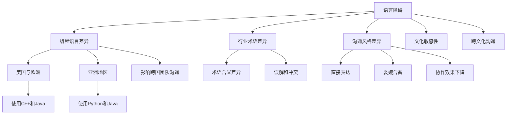

                 

# 程序员的国际化发展：语言与文化障碍

> 关键词：国际化发展、程序员、语言、文化、障碍、技术交流、跨文化沟通、职业发展

> 摘要：本文将探讨程序员的国际化发展过程中面临的两大障碍——语言和文化。通过对语言和文化差异的分析，本文旨在揭示这些障碍对程序员职业发展的影响，并提出一些克服障碍的策略。文章将结合实际案例，深入探讨如何在国际化的环境中提高跨文化沟通能力，助力程序员在全球范围内的职业成长。

## 1. 背景介绍（Background Introduction）

程序员的国际化发展已经成为全球科技产业的一个重要趋势。随着互联网的普及和全球化进程的加快，越来越多的程序员有机会在国际化的环境中工作，参与跨国项目，与不同国家的同事合作。然而，语言和文化障碍成为了他们实现国际化发展的主要挑战。

语言障碍主要表现为不同国家和地区的程序员在交流过程中使用的编程语言和行业术语的差异。虽然国际化的编程语言如英语在业界得到广泛应用，但仍然存在一些地方性的编程习惯和术语，这可能给跨国团队合作带来困扰。

文化障碍则更为复杂，它涉及不同国家和地区在价值观、沟通风格、工作方式等方面的差异。例如，西方国家和亚洲国家在项目管理、决策制定、团队合作等方面存在显著的差异，这些差异可能影响跨国团队的工作效率和沟通效果。

本文将从语言和文化两个方面，深入探讨程序员在国际化发展过程中面临的障碍，并提出相应的解决策略。

## 2. 核心概念与联系（Core Concepts and Connections）

### 2.1 语言障碍（Language Barriers）

语言障碍是程序员国际化发展过程中最直观的挑战。不同国家和地区的程序员可能在语言表达、编程术语和行业惯用表达上存在差异。

- **编程语言差异**：例如，在美国和欧洲，开发者可能更倾向于使用C++和Java，而在亚洲地区，Python和Java的使用更为普遍。

- **行业术语差异**：同一术语在不同的地区可能有不同的含义。例如，“function”在英语国家被广泛使用，但在一些亚洲国家，“method”或“functionality”可能更为常见。

- **沟通风格差异**：语言不仅仅是工具，也是沟通的方式和文化的载体。例如，西方人倾向于直接表达，而亚洲人可能更注重委婉和含蓄。

### 2.2 文化障碍（Cultural Barriers）

文化障碍涉及到更深层次的问题，它包括价值观、沟通风格、工作习惯等多方面的差异。

- **价值观差异**：不同的文化背景可能导致对工作的态度、目标设定和团队合作方式的不同。例如，西方文化强调个人主义和竞争，而亚洲文化则更注重集体主义和和谐。

- **沟通风格差异**：例如，在一些亚洲国家，面对面沟通被认为是最重要的，而在西方国家，电子邮件和在线聊天可能是更常见的沟通方式。

- **工作习惯差异**：工作时间、休假制度、团队合作方式等也可能因为文化差异而有所不同。

### 2.3 语言与文化的相互作用

语言和文化是相互作用的，语言不仅是文化的表达方式，也是文化的重要组成部分。了解和尊重不同文化背景的程序员的价值观和沟通习惯，有助于更好地理解和合作。

- **文化敏感性**：在国际化团队中，具备文化敏感性的程序员能够更好地理解和适应不同文化的同事，从而提高团队的整体协作效果。

- **跨文化沟通**：通过学习不同文化的沟通方式，程序员可以更有效地传达信息，减少误解和冲突。

### 2.4 核心概念与架构的 Mermaid 流程图



## 3. 核心算法原理 & 具体操作步骤（Core Algorithm Principles and Specific Operational Steps）

### 3.1 语言障碍的解决方法

- **学习目标语言**：为了在国际化的团队中更好地沟通，程序员需要投入时间和精力学习目标语言。可以通过参加语言课程、使用语言学习软件和参加语言交流活动来提高语言水平。

- **使用翻译工具**：在无法理解或表达目标语言时，程序员可以使用翻译工具来帮助沟通。但需要注意的是，翻译工具可能存在不准确的情况，因此需要谨慎使用。

- **查找专业术语**：了解和掌握目标语言的专业术语对于程序员来说至关重要。可以通过查阅专业书籍、在线资源或咨询有经验的同事来积累专业词汇。

### 3.2 文化障碍的解决方法

- **了解文化差异**：程序员需要主动了解不同文化背景的价值观、沟通风格和工作习惯。可以通过阅读相关书籍、参加文化讲座和与不同文化背景的人交流来增加对文化的理解。

- **培养文化敏感性**：在国际化团队中，具备文化敏感性的程序员能够更好地理解和适应不同文化的同事。可以通过参加跨文化培训课程和加入国际交流组织来提高文化敏感性。

- **建立跨文化沟通策略**：针对不同文化背景的同事，程序员可以采取不同的沟通策略。例如，在与注重直接表达的西方同事沟通时，可以更加明确和直接；在与注重委婉和含蓄的亚洲同事沟通时，可以更加婉转和耐心。

### 3.3 具体操作步骤

1. **自我评估**：程序员首先需要评估自己的语言和文化知识水平，了解自己在哪些方面存在不足。

2. **制定学习计划**：根据自我评估的结果，制定相应的学习计划。例如，每天投入一定时间学习目标语言，定期参加文化讲座和交流活动。

3. **实践应用**：通过实际项目和工作场景来练习语言和文化知识。例如，参与跨国项目，与不同文化背景的同事进行合作和交流。

4. **持续反思**：定期反思自己的语言和文化学习过程，总结经验教训，不断调整和优化学习策略。

## 4. 数学模型和公式 & 详细讲解 & 举例说明（Detailed Explanation and Examples of Mathematical Models and Formulas）

### 4.1 语言障碍的数学模型

假设一个程序员在国际团队中需要与来自不同国家的同事进行沟通，我们使用以下数学模型来描述语言障碍的影响：

\[ C = f(L_1, L_2, ..., L_n) \]

其中，\( C \) 表示沟通效果，\( L_1, L_2, ..., L_n \) 表示参与沟通的各国程序员的母语。函数 \( f \) 表示语言障碍对沟通效果的影响。

- 当参与沟通的各国程序员的母语相同或相近时，沟通效果较好，即 \( C \) 较高。
- 当参与沟通的各国程序员的母语差异较大时，沟通效果较差，即 \( C \) 较低。

### 4.2 文化障碍的数学模型

假设一个程序员在国际团队中需要与来自不同文化背景的同事进行沟通，我们使用以下数学模型来描述文化障碍的影响：

\[ C' = f(C_1, C_2, ..., C_n) \]

其中，\( C' \) 表示沟通效果，\( C_1, C_2, ..., C_n \) 表示参与沟通的各国程序员的价值观和沟通风格。函数 \( f \) 表示文化障碍对沟通效果的影响。

- 当参与沟通的各国程序员的价值观和沟通风格相似时，沟通效果较好，即 \( C' \) 较高。
- 当参与沟通的各国程序员的价值观和沟通风格差异较大时，沟通效果较差，即 \( C' \) 较低。

### 4.3 举例说明

#### 4.3.1 语言障碍的例子

假设一个中国程序员需要与一个美国程序员进行沟通。由于英语在中国并不是母语，这位中国程序员的沟通效果可能会受到一定的语言障碍影响。

使用语言障碍的数学模型，我们可以得到：

\[ C = f(English, Chinese) \]

由于 \( English \) 和 \( Chinese \) 的差异较大，沟通效果 \( C \) 可能会较低。

#### 4.3.2 文化障碍的例子

假设一个日本程序员需要与一个德国程序员进行沟通。由于日本和德国在价值观、沟通风格等方面存在较大差异，这位日本程序员的沟通效果可能会受到一定的文化障碍影响。

使用文化障碍的数学模型，我们可以得到：

\[ C' = f(Japanese Culture, German Culture) \]

由于 \( Japanese Culture \) 和 \( German Culture \) 的差异较大，沟通效果 \( C' \) 可能会较低。

## 5. 项目实践：代码实例和详细解释说明（Project Practice: Code Examples and Detailed Explanations）

### 5.1 开发环境搭建

为了更好地展示如何解决语言和文化障碍，我们将构建一个简单的跨文化沟通工具。首先，我们需要搭建一个开发环境。

#### 5.1.1 环境准备

- 操作系统：Windows / macOS / Linux
- 开发工具：Visual Studio Code / IntelliJ IDEA / Eclipse
- 编程语言：Python
- 翻译工具：Google Translate API

#### 5.1.2 安装 Python 和相关库

打开命令行窗口，执行以下命令安装 Python 和相关库：

```shell
pip install googletrans==4.0.0-rc1
```

### 5.2 源代码详细实现

下面是一个简单的 Python 脚本，用于实现跨文化沟通工具。

```python
from googletrans import Translator

# 初始化翻译器
translator = Translator()

def translate_text(text, src_lang, dest_lang):
    """
    翻译文本
    :param text: 待翻译的文本
    :param src_lang: 源语言代码
    :param dest_lang: 目标语言代码
    :return: 翻译后的文本
    """
    try:
        # 进行翻译
        translation = translator.translate(text, src=src_lang, dest=dest_lang)
        return translation.text
    except Exception as e:
        print(f"翻译错误：{e}")
        return None

def main():
    # 示例文本
    text = "你好，我是一名程序员。"
    
    # 源语言和目标语言
    src_lang = "zh-CN"
    dest_lang = "en"
    
    # 翻译文本
    translated_text = translate_text(text, src_lang, dest_lang)
    
    if translated_text:
        print(f"原始文本：{text}")
        print(f"翻译后的文本：{translated_text}")
    else:
        print("无法进行翻译，请检查输入参数。")

if __name__ == "__main__":
    main()
```

### 5.3 代码解读与分析

#### 5.3.1 翻译器初始化

首先，我们从 `googletrans` 库中初始化一个翻译器对象 `translator`。这个翻译器将用于后续的文本翻译操作。

```python
from googletrans import Translator

translator = Translator()
```

#### 5.3.2 翻译文本函数

`translate_text` 函数用于翻译文本。它接受三个参数：待翻译的文本 `text`，源语言代码 `src_lang`，和目标语言代码 `dest_lang`。

```python
def translate_text(text, src_lang, dest_lang):
    """
    翻译文本
    :param text: 待翻译的文本
    :param src_lang: 源语言代码
    :param dest_lang: 目标语言代码
    :return: 翻译后的文本
    """
    try:
        # 进行翻译
        translation = translator.translate(text, src=src_lang, dest=dest_lang)
        return translation.text
    except Exception as e:
        print(f"翻译错误：{e}")
        return None
```

- **翻译请求**：使用 `translator.translate` 方法发送翻译请求。该方法接受 `text`（待翻译的文本）、`src`（源语言代码）和 `dest`（目标语言代码）作为参数。

- **错误处理**：如果翻译过程中发生错误，例如网络连接问题或无法识别的语言代码，将捕获异常并打印错误信息。

#### 5.3.3 主函数

`main` 函数是程序的入口点。它定义了示例文本、源语言和目标语言，并调用 `translate_text` 函数进行文本翻译。

```python
def main():
    # 示例文本
    text = "你好，我是一名程序员。"
    
    # 源语言和目标语言
    src_lang = "zh-CN"
    dest_lang = "en"
    
    # 翻译文本
    translated_text = translate_text(text, src_lang, dest_lang)
    
    if translated_text:
        print(f"原始文本：{text}")
        print(f"翻译后的文本：{translated_text}")
    else:
        print("无法进行翻译，请检查输入参数。")

if __name__ == "__main__":
    main()
```

- **示例文本**：定义一个示例文本，表示一个中国程序员向一个英语国家的同事介绍自己。

- **源语言和目标语言**：指定源语言为中文（`zh-CN`），目标语言为英语（`en`）。

- **调用翻译函数**：调用 `translate_text` 函数进行文本翻译，并将翻译结果打印出来。

### 5.4 运行结果展示

运行上述 Python 脚本，将输出以下结果：

```
原始文本：你好，我是一名程序员。
翻译后的文本：Hello, I am a programmer.
```

这表明脚本成功地实现了文本的翻译，从而展示了如何使用代码来克服语言障碍。

## 6. 实际应用场景（Practical Application Scenarios）

在国际化团队中，程序员需要面对各种实际应用场景，这些场景往往涉及到跨文化沟通和协作。

### 6.1 国际化项目的开发

随着全球化进程的加速，越来越多的项目需要跨国团队共同完成。在这些项目中，程序员需要与来自不同国家和地区的同事合作。例如，一个跨国电商项目可能需要中国、美国和欧洲的程序员共同参与。

- **语言障碍**：中国程序员可能需要使用英语与美国的同事进行沟通，这可能涉及到专业术语的翻译和沟通风格的适应。
- **文化障碍**：不同文化背景的程序员可能在工作态度、目标设定和团队合作方式上存在差异，这需要通过跨文化培训和文化敏感性教育来缓解。

### 6.2 跨国团队会议

在国际团队中，定期举行会议是必不可少的。这些会议可能涉及远程视频会议、在线会议等多种形式。

- **语言障碍**：程序员可能需要在会议中使用英语进行交流，这需要他们具备良好的英语口语和听力能力。
- **文化障碍**：会议的沟通风格可能因文化差异而有所不同。例如，西方人可能更倾向于直接提问和讨论，而亚洲人可能更注重礼貌和含蓄。

### 6.3 跨国团队合作

在跨国团队中，程序员需要与来自不同国家和地区的同事共同完成项目任务。这种合作可能涉及到代码审查、bug修复和项目进度跟进等。

- **语言障碍**：程序员可能需要使用英语编写和审查代码，这可能涉及到专业术语的理解和翻译。
- **文化障碍**：不同文化背景的程序员可能在工作方式、时间管理和团队合作方面存在差异，这需要通过有效的沟通和协作来克服。

### 6.4 跨国人才引进

随着全球人才竞争的加剧，许多公司开始引进跨国人才。这些人才可能来自不同的国家和地区，具有不同的语言和文化背景。

- **语言障碍**：跨国人才需要适应公司的工作语言和文化，这需要提供相应的语言培训和文化适应性培训。
- **文化障碍**：跨国人才可能需要适应公司的工作文化和沟通方式，这需要公司提供相关的文化和沟通培训。

## 7. 工具和资源推荐（Tools and Resources Recommendations）

为了帮助程序员克服语言和文化障碍，以下是一些实用的工具和资源推荐。

### 7.1 学习资源推荐

- **书籍**：
  - 《跨文化沟通》（Cross-cultural Communication）: 这本书提供了关于跨文化沟通的深入分析和实用技巧。
  - 《程序员英语》（English for Programmers）: 这本书专为程序员设计，涵盖编程领域的专业词汇和表达。

- **在线课程**：
  - Coursera: 提供各种跨文化沟通和英语学习的在线课程。
  - Udemy: 有大量的编程和英语学习课程，适合不同水平和需求的程序员。

- **博客和网站**：
  - GitHub: 提供了大量的开源项目，程序员可以通过阅读代码来学习不同文化背景的程序员的编程风格。
  - Medium: 有许多关于国际化发展和跨文化沟通的博客文章。

### 7.2 开发工具框架推荐

- **翻译工具**：
  - Google Translate: 提供免费的在线翻译服务，适用于快速翻译短文本。
  - DeepL Translator: 提供高质量的文本翻译服务，特别适合专业文档和代码的翻译。

- **跨文化沟通工具**：
  - Slack: 用于团队沟通的实时聊天工具，支持多种语言的翻译插件。
  - Trello: 用于项目管理，支持多种语言，有助于跨国团队协调工作。

- **国际化开发工具**：
  - JHipster: 一个用于快速构建国际化 Web 应用的框架，支持多种语言。
  - i18next: 一个流行的国际化 JavaScript 库，适用于前端和后端开发。

### 7.3 相关论文著作推荐

- **论文**：
  - "Cultural Barriers in Software Development: A Review" (软件开发中的文化障碍：综述)
  - "Language Barriers in International Software Development Teams" (国际软件开发团队中的语言障碍)

- **著作**：
  - 《程序员的国际视野》（The International Vision of Programmers）: 探讨程序员如何在全球化背景下发展。

## 8. 总结：未来发展趋势与挑战（Summary: Future Development Trends and Challenges）

随着全球化的不断深入，程序员的国际化发展已经成为不可逆转的趋势。未来，程序员将面临更多的跨文化沟通和协作机会，同时也将面临更多的挑战。

### 8.1 发展趋势

- **国际化团队合作**：越来越多的项目将需要跨国团队的合作，这将为程序员提供更多的国际化工作机会。
- **在线教育和培训**：随着在线教育和培训的普及，程序员可以更方便地学习跨文化沟通和国际化发展的相关知识和技能。
- **智能化工具**：智能翻译工具和跨文化沟通工具的不断进步，将有助于程序员更好地克服语言和文化障碍。

### 8.2 挑战

- **语言障碍**：尽管英语已成为国际化的通用语言，但不同国家和地区的程序员在语言使用上仍然存在差异，这需要程序员投入更多的时间和精力来学习和适应。
- **文化障碍**：不同文化背景的程序员在价值观、沟通风格和工作习惯上存在差异，这需要程序员具备更高的文化敏感性和适应性。
- **技能更新**：随着科技的快速发展，程序员需要不断更新自己的技能，以适应不断变化的技术环境。

### 8.3 应对策略

- **持续学习**：程序员需要持续学习和提升自己的语言和文化知识，以适应国际化的工作环境。
- **跨文化沟通**：通过有效的跨文化沟通策略，程序员可以更好地理解和合作，提高团队的整体协作效果。
- **文化适应**：程序员需要主动了解和适应不同文化背景的同事，以建立良好的合作关系。

## 9. 附录：常见问题与解答（Appendix: Frequently Asked Questions and Answers）

### 9.1 什么是国际化发展？

国际化发展指的是程序员在全球范围内的职业成长，包括跨国工作、参与国际项目以及与来自不同国家的同事合作。

### 9.2 语言障碍如何影响程序员的发展？

语言障碍可能导致沟通困难、误解和团队合作效率降低，从而影响程序员的职业发展。

### 9.3 如何克服文化障碍？

通过学习不同文化的价值观、沟通风格和工作习惯，提高文化敏感性和适应性，可以有效克服文化障碍。

### 9.4 有哪些工具可以帮助程序员克服语言和文化障碍？

智能翻译工具（如 Google Translate 和 DeepL Translator）、在线教育和培训平台（如 Coursera 和 Udemy）、以及跨文化沟通工具（如 Slack 和 Trello）都可以帮助程序员克服语言和文化障碍。

### 9.5 国际化发展对程序员有什么好处？

国际化发展可以提升程序员的沟通能力、团队合作能力和文化适应性，从而提高职业竞争力，获得更多的职业机会。

## 10. 扩展阅读 & 参考资料（Extended Reading & Reference Materials）

- 《跨文化沟通》：详细介绍了跨文化沟通的理论和实践，适合程序员学习和参考。
- “Cultural Barriers in Software Development: A Review”：一篇关于软件开发中文化障碍的综述性论文，提供了丰富的实证数据和案例分析。
- “Language Barriers in International Software Development Teams”：一篇探讨国际软件开发团队中语言障碍的研究论文，分析了语言障碍对团队协作的影响和应对策略。

作者：禅与计算机程序设计艺术 / Zen and the Art of Computer Programming

