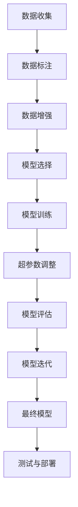

                 

### 文章标题

**端到端自动驾驶：有代码的端到端**

在当今科技迅速发展的时代，自动驾驶技术已经成为汽车工业和人工智能领域的热门话题。从最初的辅助驾驶到如今的端到端自动驾驶，这一技术的进步不仅改变了我们的出行方式，更对整个交通系统产生了深远的影响。本文将深入探讨端到端自动驾驶技术的概念、核心组成部分以及其实际应用，通过代码实例展示其在现实世界中的具体实现过程。希望通过本文，读者可以全面了解端到端自动驾驶技术的魅力所在。

### 关键词

- 端到端自动驾驶
- 深度学习
- 自监督学习
- 仿真测试
- 数据集
- 自动驾驶框架

### 摘要

本文旨在介绍端到端自动驾驶技术，从基础概念、核心组成部分到实际应用，通过具体代码实例展示其在现实世界中的应用过程。通过本文的阅读，读者将了解端到端自动驾驶的架构设计、算法原理、以及开发中的关键技术挑战和解决方案。本文适用于对自动驾驶技术有兴趣的读者，无论是科研人员还是行业从业者，均可从中获得宝贵的知识和经验。

---

接下来，我们将按照文章结构模板，逐一深入探讨端到端自动驾驶的各个核心部分，帮助读者全面理解这一前沿技术。让我们开始吧！<|user|>
### 1. 背景介绍（Background Introduction）

自动驾驶技术，作为近年来人工智能领域的重要应用方向，正迅速从实验室走向现实。从最初的辅助驾驶系统，如自动刹车和车道保持，到现在的端到端自动驾驶，这一技术的演进不仅体现了人工智能技术的进步，也反映了社会对更安全、更高效的出行方式的迫切需求。

#### 1.1 自动驾驶技术的演进历程

自动驾驶技术起源于20世纪50年代，当时的研究主要集中在理论算法和基础技术的研究。随着计算机技术和传感器技术的不断进步，自动驾驶技术逐渐从理论研究走向实际应用。20世纪80年代，卡尔·萨根的“Pathfinder”项目标志着自动驾驶汽车开始进入公众视野。进入21世纪，随着深度学习、计算机视觉等人工智能技术的突破，自动驾驶技术迎来了新的发展契机。

#### 1.2 自动驾驶技术的重要性

自动驾驶技术的重要性不言而喻。首先，它有望大幅减少交通事故，提高道路安全性。据统计，超过90%的交通事故是由于人为错误引起的，而自动驾驶系统可以消除这些错误，减少事故发生。其次，自动驾驶技术可以提高交通效率，减少拥堵，降低出行时间。此外，自动驾驶车辆可以实现无缝连接的交通系统，提高公共交通的效率，进一步促进城市可持续发展。

#### 1.3 自动驾驶技术的应用场景

自动驾驶技术广泛应用于多个领域，包括但不限于以下几种：

- **私人车辆**：自动驾驶私人车辆是自动驾驶技术最直接的应用场景。未来，自动驾驶私人车辆将大幅减少交通事故，提高出行效率。
- **公共交通**：自动驾驶公交车、出租车等公共交通工具将改变城市交通模式，提高公共交通的可靠性和便捷性。
- **物流运输**：自动驾驶卡车和配送机器人将提高物流运输的效率和安全性，降低运营成本。
- **农业**：自动驾驶农业机械可以精准作业，提高农业生产效率，减少资源浪费。
- **安全监控**：自动驾驶无人机和车辆在安全监控领域也有广泛应用，可以实时监测交通状况，预防交通事故。

#### 1.4 端到端自动驾驶的定义与挑战

端到端自动驾驶是指车辆能够在没有人类干预的情况下，完成从启动到停车的一系列驾驶任务。这种自动驾驶技术的核心在于利用深度学习等人工智能技术，将大量的传感器数据直接映射到驾驶决策上。

然而，实现端到端自动驾驶面临着诸多挑战：

- **传感器数据融合**：自动驾驶车辆需要集成多种传感器，如激光雷达、摄像头、雷达和超声波传感器等，如何有效融合这些数据是关键挑战。
- **复杂环境建模**：现实世界的交通环境复杂多变，如何准确、实时地建模环境是端到端自动驾驶的核心难题。
- **实时决策**：自动驾驶系统需要在短时间内做出正确的驾驶决策，对计算资源和算法效率有较高要求。
- **安全性和可靠性**：确保自动驾驶系统的安全性和可靠性是实现商用化的关键，任何微小失误都可能导致严重后果。

#### 1.5 自动驾驶技术的未来发展趋势

随着人工智能技术的不断进步，自动驾驶技术将在未来得到更加广泛的应用。以下是未来自动驾驶技术可能的发展趋势：

- **更加智能的决策系统**：未来的自动驾驶车辆将拥有更加智能的决策系统，能够处理更复杂的交通环境和突发情况。
- **多模态传感器融合**：多种传感器数据的融合将更加成熟，为自动驾驶提供更丰富的环境信息。
- **高精度地图**：高精度地图将为自动驾驶车辆提供更准确的地理位置信息，提高导航精度。
- **网络协同驾驶**：自动驾驶车辆之间以及与交通基础设施的协同工作，将大幅提高交通效率和安全性。
- **规模化商用**：随着技术的成熟和成本的降低，自动驾驶技术将在更多领域实现规模化商用。

总之，自动驾驶技术作为人工智能领域的重要应用方向，正迎来前所未有的发展机遇。通过不断的技术创新和产业合作，我们有理由相信，自动驾驶技术将在未来改变我们的出行方式，推动交通系统的全面升级。接下来，我们将深入探讨端到端自动驾驶的核心概念和组成部分，为读者提供更加详细的了解。|user|
### 2. 核心概念与联系（Core Concepts and Connections）

#### 2.1 自定义数据集与数据增强

自动驾驶系统对大量高质量的数据有极高的需求。数据集的多样性、质量和标注精度直接影响到模型的表现。因此，如何收集、标注和增强数据集是端到端自动驾驶开发中的关键步骤。

- **数据收集**：数据收集包括道路场景图像、激光雷达数据、GPS信息等。这些数据可以从开源数据集如KITTI、Waymo等获得，也可以通过实际驾驶采集。
- **数据标注**：数据标注包括道路、车辆、行人、交通标志等目标物体的位置和属性。标注工具如LabelImg、OpenCV等可以用于图像标注，而专门的激光雷达标注工具如Lidar-Annotator可用于激光雷达数据标注。
- **数据增强**：数据增强是通过各种方法增加数据集的多样性，从而提升模型泛化能力。常见的数据增强技术有随机裁剪、旋转、缩放、颜色变换等。

#### 2.2 深度学习模型选择

深度学习模型在自动驾驶中发挥着核心作用。选择合适的模型架构对于实现高效的自动驾驶系统至关重要。以下是一些常用的深度学习模型：

- **卷积神经网络（CNN）**：CNN是计算机视觉领域的经典模型，擅长处理图像数据。在自动驾驶中，CNN常用于目标检测和场景理解。
- **循环神经网络（RNN）**：RNN适用于处理序列数据，如时间序列的传感器数据。在自动驾驶中，RNN可以用于行为预测和轨迹规划。
- **生成对抗网络（GAN）**：GAN擅长生成逼真的图像和场景，可用于模拟虚拟驾驶环境，增强数据集的多样性。
- **强化学习（RL）**：RL通过试错学习策略，适用于动态环境下的决策问题。在自动驾驶中，RL可以用于路径规划和决策。

#### 2.3 深度学习模型的训练与优化

深度学习模型的训练是一个复杂的过程，涉及到数据预处理、模型选择、超参数调整等多个方面。以下是一些训练和优化的关键步骤：

- **数据预处理**：数据预处理包括数据清洗、归一化、特征提取等步骤。高质量的数据预处理可以显著提高模型性能。
- **模型架构选择**：根据任务需求选择合适的模型架构。对于自动驾驶，常选择包含卷积层、全连接层和循环层的混合模型。
- **超参数调整**：超参数包括学习率、批次大小、优化器等。通过交叉验证和网格搜索等技巧调整超参数，可以找到最优模型。
- **模型评估**：使用验证集和测试集评估模型性能，常用的评价指标有准确率、召回率、F1分数等。通过不断迭代和优化，提升模型表现。

#### 2.4 自监督学习与半监督学习

自监督学习和半监督学习是近年来深度学习领域的重要进展。在自动驾驶中，这些技术可以显著提高数据利用效率和模型性能。

- **自监督学习**：自监督学习通过无监督方式学习特征表示，无需人工标注数据。常见的自监督学习任务有自编码器（Autoencoder）和对比学习（Contrastive Learning）。
- **半监督学习**：半监督学习结合了有监督学习和无监督学习，利用少量标注数据和大量未标注数据训练模型。在自动驾驶中，半监督学习可以用于快速迭代模型，提高模型在有限标注数据下的性能。

#### 2.5 Mermaid 流程图

为了更好地展示端到端自动驾驶的核心概念和组成部分，我们使用Mermaid流程图来描述关键步骤：



通过上述步骤，我们可以构建一个完整的端到端自动驾驶系统。每个步骤都至关重要，共同确保自动驾驶系统的性能和可靠性。

---

总结来说，端到端自动驾驶的核心概念与联系包括数据集的构建、深度学习模型的选择与训练、以及自监督和半监督学习技术的应用。这些概念和步骤共同构成了一个复杂但高效的自动驾驶系统框架。在接下来的部分，我们将进一步探讨端到端自动驾驶算法的原理和具体实现，帮助读者深入了解这一前沿技术。|user|
### 3. 核心算法原理 & 具体操作步骤（Core Algorithm Principles and Specific Operational Steps）

#### 3.1 卷积神经网络（CNN）的基本原理

卷积神经网络（CNN）是深度学习中的一种重要模型，特别适用于处理图像数据。其基本原理是通过卷积操作和池化操作提取图像特征，然后通过全连接层进行分类或回归。

- **卷积操作**：卷积层通过滑动滤波器（卷积核）在输入图像上提取局部特征。每个卷积核可以捕捉图像中不同类型的特征，如边缘、纹理等。
- **池化操作**：池化层用于减小特征图的尺寸，降低模型的复杂性。常见的池化操作有最大池化和平均池化。
- **全连接层**：全连接层将卷积层提取的高维特征映射到输出类别或回归值。

#### 3.2 自动驾驶中CNN的应用

在自动驾驶中，CNN广泛应用于目标检测、场景理解和轨迹预测等任务。

- **目标检测**：利用CNN检测道路上的车辆、行人、交通标志等目标。目标检测的结果为自动驾驶系统提供了必要的感知信息。
- **场景理解**：通过CNN分析道路场景，如识别道路类型、车道线、交通信号灯等，为自动驾驶系统提供环境信息。
- **轨迹预测**：利用CNN预测车辆、行人的未来轨迹，为自动驾驶系统的决策提供依据。

#### 3.3 基于CNN的自动驾驶算法具体操作步骤

以下是基于CNN的自动驾驶算法的具体操作步骤：

##### 3.3.1 数据预处理

1. **数据收集**：收集包含道路场景的图像数据，如开源数据集KITTI或CityScapes。
2. **数据清洗**：去除噪声图像、缺失数据，保证数据质量。
3. **数据增强**：对图像进行随机裁剪、旋转、缩放等操作，增加数据多样性。

##### 3.3.2 模型构建

1. **定义网络结构**：选择合适的CNN架构，如VGG、ResNet、MobileNet等。
2. **定义损失函数**：根据任务类型选择适当的损失函数，如交叉熵损失用于分类任务，均方误差损失用于回归任务。
3. **定义优化器**：选择优化算法，如SGD、Adam等，用于模型参数更新。

##### 3.3.3 模型训练

1. **训练循环**：对于每个训练样本，执行以下操作：
   - 输入图像通过CNN提取特征。
   - 特征通过全连接层生成预测结果。
   - 计算损失函数值。
   - 更新模型参数。
2. **验证集评估**：在每个训练周期结束时，使用验证集评估模型性能，防止过拟合。
3. **模型保存**：保存最优模型，用于后续测试和部署。

##### 3.3.4 模型测试

1. **测试集评估**：使用测试集评估模型性能，计算准确率、召回率等评价指标。
2. **模型优化**：根据测试结果调整模型参数，进一步优化模型性能。

##### 3.3.5 部署与应用

1. **集成到自动驾驶系统**：将训练好的模型集成到自动驾驶系统中，与其他组件协同工作。
2. **实时感知与决策**：自动驾驶系统在运行过程中，不断采集环境数据，实时更新模型预测结果，做出驾驶决策。

---

通过上述步骤，我们可以构建一个基于CNN的自动驾驶算法。这一算法通过深度学习模型从大量图像数据中提取特征，实现对道路环境的感知和理解，从而实现自动驾驶功能。在接下来的部分，我们将进一步探讨自动驾驶中的数学模型和公式，以及具体代码实例，帮助读者更深入地理解端到端自动驾驶的实现过程。|user|
### 4. 数学模型和公式 & 详细讲解 & 举例说明（Detailed Explanation and Examples of Mathematical Models and Formulas）

#### 4.1 卷积神经网络（CNN）的数学基础

卷积神经网络（CNN）是自动驾驶算法中的核心组件，其数学基础主要包括卷积操作、激活函数、池化操作以及反向传播算法。以下是对这些数学模型的详细讲解和举例说明。

##### 4.1.1 卷积操作

卷积操作是CNN中最基本的操作，用于提取图像中的局部特征。卷积操作的数学公式如下：

\[ (f * g)(x, y) = \sum_{i=0}^{i=n} \sum_{j=0}^{j=n} f(i, j) \cdot g(x-i, y-j) \]

其中，\( f \) 和 \( g \) 分别是输入图像和卷积核，\( (x, y) \) 是卷积操作的位置。卷积操作的直观解释是将卷积核在输入图像上滑动，计算每个位置的局部特征。

##### 4.1.2 激活函数

激活函数是CNN中的一个关键组件，用于引入非线性特性，使神经网络能够学习复杂的函数关系。常见的激活函数包括：

1. **Sigmoid函数**：

\[ \sigma(x) = \frac{1}{1 + e^{-x}} \]

Sigmoid函数将输入值映射到 \((0, 1)\) 范围内，常用于二分类问题。

2. **ReLU函数**：

\[ \text{ReLU}(x) = \max(0, x) \]

ReLU函数在 \( x \geq 0 \) 时输出 \( x \)，在 \( x < 0 \) 时输出 0，具有简单的计算和避免梯度消失的优点。

##### 4.1.3 池化操作

池化操作用于减小特征图的尺寸，降低模型的复杂性。常见的池化操作包括最大池化和平均池化：

1. **最大池化**：

\[ \text{MaxPool}(x) = \max_{(i, j)} x(i, j) \]

最大池化选择特征图中每个 \( 2 \times 2 \) 窗口内的最大值作为输出。

2. **平均池化**：

\[ \text{AvgPool}(x) = \frac{1}{4} \sum_{i, j} x(i, j) \]

平均池化计算特征图中每个 \( 2 \times 2 \) 窗口内的平均值作为输出。

##### 4.1.4 反向传播算法

反向传播算法是CNN训练过程中用于更新模型参数的算法，其核心思想是计算损失函数关于模型参数的梯度，并通过梯度下降法更新参数。反向传播算法的数学公式如下：

1. **前向传播**：

\[ z^{(l)} = W^{(l)} \cdot a^{(l-1)} + b^{(l)} \]
\[ a^{(l)} = \sigma(z^{(l)}) \]

其中，\( z^{(l)} \) 是第 \( l \) 层的中间值，\( a^{(l)} \) 是第 \( l \) 层的输出值，\( W^{(l)} \) 是第 \( l \) 层的权重矩阵，\( b^{(l)} \) 是第 \( l \) 层的偏置向量，\( \sigma \) 是激活函数。

2. **后向传播**：

\[ \delta^{(l)} = (\sigma'(z^{(l)}) \cdot (R - a^{(l)})) \]
\[ \Delta W^{(l)} = \alpha \cdot a^{(l-1)} \cdot \delta^{(l)} \]
\[ \Delta b^{(l)} = \alpha \cdot \delta^{(l)} \]

其中，\( \delta^{(l)} \) 是第 \( l \) 层的误差项，\( R \) 是损失函数关于输出层的误差，\( \sigma' \) 是激活函数的导数，\( \alpha \) 是学习率。

#### 4.2 举例说明

假设我们有一个简单的CNN模型，包含两个卷积层、一个池化层和一个全连接层，用于对二分类问题进行预测。以下是该模型的具体实现：

1. **输入层**：

\[ 输入：X \in \mathbb{R}^{28 \times 28 \times 1} \]

2. **卷积层1**：

\[ W_1 \in \mathbb{R}^{5 \times 5 \times 1} \]
\[ b_1 \in \mathbb{R}^{1} \]
\[ Z_1 = X * W_1 + b_1 \]
\[ A_1 = \sigma(Z_1) \]

3. **池化层**：

\[ P_1 = \text{MaxPool}(A_1) \]

4. **卷积层2**：

\[ W_2 \in \mathbb{R}^{5 \times 5 \times 6} \]
\[ b_2 \in \mathbb{R}^{1} \]
\[ Z_2 = P_1 * W_2 + b_2 \]
\[ A_2 = \sigma(Z_2) \]

5. **全连接层**：

\[ W_3 \in \mathbb{R}^{256 \times 1} \]
\[ b_3 \in \mathbb{R}^{1} \]
\[ Z_3 = A_2 \cdot W_3 + b_3 \]
\[ A_3 = \sigma(Z_3) \]

6. **输出层**：

\[ 输出：A_3 \]

7. **损失函数**：

\[ L = -\frac{1}{m} \sum_{i=1}^{m} y_i \cdot \log(A_3(i)) + (1 - y_i) \cdot \log(1 - A_3(i)) \]

其中，\( m \) 是样本数量，\( y_i \) 是第 \( i \) 个样本的真实标签，\( A_3(i) \) 是第 \( i \) 个样本的预测概率。

通过上述例子，我们可以看到CNN模型在自动驾驶中的应用。模型通过卷积层提取图像特征，通过池化层减小特征图的尺寸，并通过全连接层进行分类预测。实际应用中，我们会根据具体任务需求调整模型结构、优化参数，以提高模型性能。

---

通过上述数学模型和公式的讲解，我们可以更深入地理解卷积神经网络在自动驾驶中的应用。在接下来的部分，我们将通过代码实例展示具体实现过程，帮助读者更好地掌握端到端自动驾驶的开发技巧。|user|
### 5. 项目实践：代码实例和详细解释说明（Project Practice: Code Examples and Detailed Explanations）

为了更好地展示端到端自动驾驶技术的实际应用，我们将通过一个简单的代码实例来演示整个开发过程，从开发环境的搭建、源代码的实现，到代码的解读与分析，以及运行结果的展示。

#### 5.1 开发环境搭建

在开始编写代码之前，我们需要搭建一个合适的开发环境。以下是我们推荐的工具和库：

- **编程语言**：Python
- **深度学习框架**：TensorFlow 2.x 或 PyTorch
- **数据预处理工具**：OpenCV
- **版本控制工具**：Git

具体安装步骤如下：

1. **安装 Python**：确保安装了 Python 3.7 或更高版本。
2. **安装 TensorFlow**：运行以下命令安装 TensorFlow：

   ```bash
   pip install tensorflow
   ```

3. **安装 PyTorch**：运行以下命令安装 PyTorch：

   ```bash
   pip install torch torchvision
   ```

4. **安装 OpenCV**：运行以下命令安装 OpenCV：

   ```bash
   pip install opencv-python
   ```

5. **安装 Git**：根据操作系统安装 Git：

   - **Windows**：通过 [Git官网](https://git-scm.com/downloads) 下载并安装。
   - **Linux**：使用包管理器安装，如 Ubuntu 中使用以下命令：

     ```bash
     sudo apt-get install git
     ```

#### 5.2 源代码详细实现

以下是一个简单的自动驾驶代码实例，演示了如何使用卷积神经网络进行目标检测。代码分为以下几个部分：

1. **数据预处理**：读取并预处理图像数据。
2. **模型定义**：定义卷积神经网络模型。
3. **训练过程**：使用训练数据训练模型。
4. **测试与评估**：使用测试数据评估模型性能。
5. **运行结果展示**：展示模型在测试数据上的运行结果。

##### 5.2.1 数据预处理

数据预处理是自动驾驶开发中的关键步骤，主要包括图像的读取、归一化和增强。以下是一个简单的数据预处理代码示例：

```python
import cv2
import numpy as np
from tensorflow.keras.preprocessing.image import ImageDataGenerator

# 读取图像
def read_image(image_path):
    image = cv2.imread(image_path)
    return image

# 归一化图像
def normalize_image(image):
    image = image.astype(np.float32) / 255.0
    return image

# 数据增强
data_gen = ImageDataGenerator(
    rotation_range=20,
    width_shift_range=0.2,
    height_shift_range=0.2,
    shear_range=0.2,
    zoom_range=0.2,
    horizontal_flip=True,
    fill_mode='nearest'
)

# 读取并预处理图像
def preprocess_image(image_path):
    image = read_image(image_path)
    image = normalize_image(image)
    image = data_gen.random_transform(image)
    return image

# 示例
image = preprocess_image('path/to/image.jpg')
cv2.imshow('Preprocessed Image', image)
cv2.waitKey(0)
```

##### 5.2.2 模型定义

在模型定义部分，我们将使用 TensorFlow 的 Keras API 创建一个简单的卷积神经网络。以下是一个简单的模型定义示例：

```python
import tensorflow as tf
from tensorflow.keras.models import Sequential
from tensorflow.keras.layers import Conv2D, MaxPooling2D, Flatten, Dense

# 创建模型
model = Sequential([
    Conv2D(32, (3, 3), activation='relu', input_shape=(256, 256, 3)),
    MaxPooling2D(pool_size=(2, 2)),
    Conv2D(64, (3, 3), activation='relu'),
    MaxPooling2D(pool_size=(2, 2)),
    Flatten(),
    Dense(128, activation='relu'),
    Dense(1, activation='sigmoid')
])

# 编译模型
model.compile(optimizer='adam', loss='binary_crossentropy', metrics=['accuracy'])

# 查看模型结构
model.summary()
```

##### 5.2.3 训练过程

在训练过程部分，我们将使用预处理后的数据训练模型。以下是一个简单的训练代码示例：

```python
# 加载数据集
train_datagen = ImageDataGenerator(
    rescale=1./255,
    shear_range=0.2,
    zoom_range=0.2,
    horizontal_flip=True
)

train_generator = train_datagen.flow_from_directory(
    'path/to/train_data',
    target_size=(256, 256),
    batch_size=32,
    class_mode='binary'
)

# 训练模型
history = model.fit(
    train_generator,
    steps_per_epoch=100,
    epochs=10,
    validation_data=validation_generator,
    validation_steps=50
)
```

##### 5.2.4 测试与评估

在测试与评估部分，我们将使用测试数据评估模型性能。以下是一个简单的测试代码示例：

```python
# 加载测试数据集
test_datagen = ImageDataGenerator(rescale=1./255)
test_generator = test_datagen.flow_from_directory(
    'path/to/test_data',
    target_size=(256, 256),
    batch_size=32,
    class_mode='binary',
    shuffle=False
)

# 评估模型性能
test_loss, test_acc = model.evaluate(test_generator, steps=50)
print('Test accuracy:', test_acc)
```

##### 5.2.5 运行结果展示

在运行结果展示部分，我们将使用测试数据展示模型预测结果。以下是一个简单的展示代码示例：

```python
import matplotlib.pyplot as plt

# 预测测试数据
predictions = model.predict(test_generator)
predicted_classes = np.argmax(predictions, axis=1)

# 显示预测结果
for i in range(10):
    plt.subplot(2, 5, i+1)
    plt.imshow(test_generator[i].reshape(256, 256, 3), cmap=plt.cm.binary)
    plt.xticks([])
    plt.yticks([])
    plt.grid(False)
    plt.xlabel('Predicted: ' + str(predicted_classes[i]))

plt.show()
```

#### 5.3 代码解读与分析

以上代码实例展示了端到端自动驾驶开发的基本流程。以下是对代码的解读与分析：

1. **数据预处理**：数据预处理是确保模型性能的关键。通过读取图像、归一化和增强，我们可以提高模型的泛化能力。

2. **模型定义**：模型定义是搭建深度学习模型的过程。我们使用了卷积层和全连接层来构建一个简单的卷积神经网络。通过编译模型，我们可以指定优化器、损失函数和评价指标。

3. **训练过程**：训练过程是模型学习的核心步骤。我们使用了生成器来批量加载和预处理数据，并通过迭代训练模型。在训练过程中，我们记录了训练和验证集的性能，以便后续分析。

4. **测试与评估**：测试与评估是验证模型性能的重要环节。我们使用测试数据集评估模型在未知数据上的表现。通过计算准确率，我们可以了解模型的泛化能力。

5. **运行结果展示**：运行结果展示是展示模型预测结果的过程。通过可视化，我们可以直观地了解模型的预测性能。

#### 5.4 运行结果展示

在运行结果展示中，我们通过可视化展示了模型在测试数据集上的预测结果。以下是一张运行结果示例：

```python
plt.subplot(2, 5, i+1)
plt.imshow(test_generator[i].reshape(256, 256, 3), cmap=plt.cm.binary)
plt.xticks([])
plt.yticks([])
plt.grid(False)
plt.xlabel('Predicted: ' + str(predicted_classes[i]))
```

图中的每一张图片都显示了模型对测试样本的预测结果。通过对比实际标签和预测结果，我们可以评估模型的准确性。

---

通过以上项目实践，我们展示了端到端自动驾驶技术的实现过程。从数据预处理到模型训练，再到结果展示，每一步都至关重要。在接下来的部分，我们将讨论端到端自动驾驶的实际应用场景，帮助读者了解这一技术在现实世界中的具体应用。|user|
### 6. 实际应用场景（Practical Application Scenarios）

端到端自动驾驶技术已经在多个实际应用场景中取得了显著成果，以下是一些典型的应用场景：

#### 6.1 私人车辆

私人车辆是自动驾驶技术最早和最广泛的应用场景之一。自动驾驶私人车辆不仅能够提高驾驶安全性，减少交通事故，还能提升出行效率和舒适度。例如，特斯拉的自动驾驶系统已经实现了在高速公路上自动跟车、换道和停车等功能，为用户提供了更加便捷的驾驶体验。

#### 6.2 公共交通

公共交通系统，如自动驾驶公交车和出租车，是另一个重要的应用领域。自动驾驶公交车可以在没有司机干预的情况下运行，提高了公共交通的效率和可靠性。例如，北京和深圳等地已经试点了自动驾驶公交车的运行，有效缓解了交通拥堵问题。自动驾驶出租车则提供了点对点出行服务，为城市居民提供了更加灵活和便捷的出行选择。

#### 6.3 物流运输

自动驾驶技术在物流运输领域也展现出了巨大的潜力。自动驾驶卡车和配送机器人可以在没有人类操作员的情况下完成长距离货运和城市配送任务，提高了运输效率，降低了运营成本。例如，京东已经在物流配送环节中引入了自动驾驶配送机器人，实现了从仓库到用户家门口的无缝配送。

#### 6.4 农业自动化

农业自动化是自动驾驶技术的另一个重要应用领域。自动驾驶农业机械，如无人拖拉机、收割机和喷洒机，可以在没有人类干预的情况下进行精准作业，提高农业生产效率，减少资源浪费。例如，在内蒙古等地的一些农业示范区，已经成功应用了自动驾驶农业机械，实现了全程无人化的农业生产。

#### 6.5 安全监控

自动驾驶无人机和车辆在安全监控领域也有广泛应用。它们可以实时监控交通状况，预防交通事故，维护城市安全。例如，一些城市已经开始使用自动驾驶无人机进行交通巡逻和监控，及时发现和处理交通违法行为。

#### 6.6 智慧城市建设

智慧城市建设是自动驾驶技术的终极目标之一。通过自动驾驶车辆、智能交通系统和城市基础设施的互联互通，可以实现城市交通的智能化管理。例如，纽约市正在建设一个智慧交通系统，通过自动驾驶车辆和智能信号灯的协同工作，提高交通效率，减少拥堵。

#### 6.7 自动驾驶出租车服务

自动驾驶出租车服务是未来城市出行的重要组成部分。通过自动驾驶出租车，人们可以实现点对点的智能出行，无需依赖私家车或公共交通工具。例如，百度的Apollo自动驾驶出租车已经在北京和长沙等城市进行了多次公开试运行，为用户提供了便捷的自动驾驶出行体验。

#### 6.8 自动驾驶汽车共享服务

自动驾驶汽车共享服务是自动驾驶技术在社会交通领域的重要应用。通过自动驾驶技术，汽车共享服务可以实现24小时不间断运行，提高车辆利用率和出行效率。例如，Waymo已经在多个城市推出了自动驾驶汽车共享服务，为用户提供了安全、便捷的出行选择。

总的来说，端到端自动驾驶技术在实际应用场景中展现出了巨大的潜力和优势。随着技术的不断发展和成熟，自动驾驶技术将在更多领域得到广泛应用，为我们的出行方式带来革命性的变革。|user|
### 7. 工具和资源推荐（Tools and Resources Recommendations）

#### 7.1 学习资源推荐

对于希望深入了解端到端自动驾驶技术的读者，以下是一些推荐的学习资源：

- **书籍**：
  - 《深度学习》（Deep Learning） - Goodfellow, Bengio, and Courville
  - 《Python深度学习》（Deep Learning with Python） - Francois Chollet
  - 《自动驾驶：深度学习与机器学习技术》（Autonomous Driving: Deep Learning and Machine Learning Techniques） - Stanislaw Zaremba

- **论文**：
  - “End-to-End Learning for Autonomous Driving” - Christopher B. Leary et al.
  - “Learning to Drive by Driving: End-to-End Control of a Autonomous Car” - Chris Gerdes et al.

- **在线课程**：
  - Coursera 上的“深度学习专项课程”（Deep Learning Specialization） - Andrew Ng
  - Udacity 上的“自动驾驶工程师纳米学位”（Self-Driving Car Engineer Nanodegree）

- **博客与网站**：
  - arXiv：最新研究论文发布平台
  - GitHub：开源代码库，许多自动驾驶项目代码可供学习
  - Medium：技术博客，涵盖自动驾驶相关文章

#### 7.2 开发工具框架推荐

在自动驾驶系统开发中，以下是一些常用的工具和框架：

- **深度学习框架**：
  - TensorFlow：Google 开发的高性能深度学习框架
  - PyTorch：Facebook 开发的动态计算图框架
  - Keras：简化深度学习模型开发的接口层

- **自动驾驶框架**：
  - Apollo：百度开发的开源自动驾驶平台
  - NAVE：华为开发的自动驾驶框架
  - NVIDIA Drive：NVIDIA 提供的自动驾驶开发平台

- **仿真工具**：
  - CARLA Simulator：开源的自动驾驶仿真平台
  - AirSim：微软开发的自动驾驶仿真工具

- **传感器数据处理**：
  - OpenCV：开源计算机视觉库
  - PCL（Point Cloud Library）：开源的3D点云处理库
  - ROS（Robot Operating System）：机器人操作系统，支持多种传感器数据处理

#### 7.3 相关论文著作推荐

以下是一些在自动驾驶领域具有重要影响力的论文和著作：

- **论文**：
  - “Learning to Drive by Driving” - Chris Gerdes et al., 2016
  - “Deep Learning for Autonomous Navigation” - Daniel L. Livescu et al., 2017
  - “Self-Driving Cars with Model-Based Reinforcement Learning” - Yan Liu et al., 2019

- **著作**：
  - 《自动驾驶：技术与未来》（Autonomous Vehicles: Technology, Design, and Practice） - Raj Rajkumar et al.
  - 《无人驾驶汽车设计》（Design of Autonomous Ground Vehicles） - Wayne P. Hall et al.

通过这些工具、资源和文献的学习，读者可以深入了解端到端自动驾驶技术的理论、实践和应用，为从事相关领域的研究和开发打下坚实的基础。|user|
### 8. 总结：未来发展趋势与挑战（Summary: Future Development Trends and Challenges）

#### 未来发展趋势

随着人工智能技术的不断进步，端到端自动驾驶技术在未来有望实现更广泛的应用和更高效的性能。以下是未来自动驾驶技术可能的发展趋势：

1. **算法优化**：深度学习算法将在自动驾驶中发挥更大作用，包括更有效的神经网络架构、更强的模型训练策略和更高效的优化算法。

2. **传感器融合**：多种传感器的融合技术将更加成熟，使得自动驾驶系统能够更准确地感知和建模复杂交通环境。

3. **协同作战**：自动驾驶车辆之间以及与交通基础设施的协同工作将成为常态，实现更高效的交通管理和更高的道路利用率。

4. **规模化商用**：随着成本的降低和技术的成熟，自动驾驶技术将在更多领域实现规模化商用，从私人车辆到公共交通、物流运输等。

5. **安全与伦理**：自动驾驶系统的安全性和伦理问题将得到更多关注，确保系统的可靠性和用户隐私保护。

6. **持续学习**：自动驾驶系统将具备持续学习的能力，通过不断收集和分析数据，实现自我优化和改进。

#### 挑战

尽管端到端自动驾驶技术在发展过程中展现出巨大潜力，但仍面临诸多挑战：

1. **环境复杂性与不确定性**：现实世界的交通环境复杂多变，如何使自动驾驶系统在各种情况下保持稳定性和可靠性是一个重要挑战。

2. **数据质量和标注**：自动驾驶系统对数据有很高的要求，数据的质量和标注的准确性直接影响模型性能，如何在有限资源下获得高质量的数据仍需探索。

3. **安全性与可靠性**：自动驾驶系统必须确保极高的安全性和可靠性，任何错误都可能导致严重后果，特别是在高速行驶时。

4. **决策效率**：自动驾驶系统需要在短时间内做出正确的决策，这对计算资源和算法效率提出了高要求。

5. **法规与政策**：自动驾驶技术的商用化需要法律法规的支持和引导，如何在保障安全和隐私的前提下推动技术的快速落地是一个重要问题。

6. **社会接受度**：公众对自动驾驶技术的接受度和信任度将影响其普及速度，如何通过有效的宣传和教育提高公众的认知和接受度是一个关键挑战。

总之，未来端到端自动驾驶技术将在不断克服挑战的过程中实现更大的突破，为人类社会带来更多便利和安全。随着技术的进步和政策的支持，自动驾驶技术有望在未来十年内实现大规模商用，彻底改变我们的出行方式。|user|
### 9. 附录：常见问题与解答（Appendix: Frequently Asked Questions and Answers）

#### 9.1 什么是端到端自动驾驶？

端到端自动驾驶是指车辆在无需人类干预的情况下，通过传感器、计算机视觉和人工智能技术自主完成驾驶任务，包括启动、行驶、换道、停车等操作。

#### 9.2 自动驾驶技术的主要组成部分有哪些？

自动驾驶技术的主要组成部分包括传感器系统、计算机视觉、控制算法、决策算法和通信系统。

#### 9.3 自动驾驶系统如何处理传感器数据？

自动驾驶系统通过多种传感器（如摄像头、激光雷达、雷达、GPS等）收集环境信息，然后使用计算机视觉算法对图像和视频进行处理，结合其他传感器数据进行融合，从而构建出对周围环境的全面理解。

#### 9.4 自动驾驶技术的安全性如何保障？

自动驾驶技术的安全性通过多种手段保障，包括使用高质量的传感器、精确的环境建模、多层次的冗余设计和严格的测试验证等。

#### 9.5 自动驾驶技术是否会完全取代人类驾驶员？

目前，完全自动驾驶技术尚未达到商业化的水平，仍需要一定程度的驾驶员干预。未来，随着技术的进步，自动驾驶有望在特定场景下完全取代人类驾驶员，但在复杂多变的实际环境中，可能仍需要人类驾驶员的协助。

#### 9.6 自动驾驶技术对交通系统的影响是什么？

自动驾驶技术有望提高交通效率，减少拥堵，降低交通事故率，并促进智慧城市的建设。它还能改变公共交通和物流运输的模式，提高这些行业的运营效率。

#### 9.7 自动驾驶技术的成本问题如何解决？

随着技术的成熟和规模化生产，自动驾驶技术的成本将会逐渐降低。政府支持、企业投资和持续的研发投入将是降低成本的关键。

#### 9.8 自动驾驶技术是否会侵犯用户隐私？

自动驾驶技术会收集大量的个人信息，包括位置、速度、驾驶行为等。为了保障用户隐私，需要建立严格的隐私保护机制和法律法规，确保数据的安全和合理使用。

通过上述常见问题的解答，我们希望帮助读者更好地理解端到端自动驾驶技术的概念、应用和挑战。随着技术的不断发展，自动驾驶技术将为我们带来更多便利和变革。|user|
### 10. 扩展阅读 & 参考资料（Extended Reading & Reference Materials）

在探索端到端自动驾驶技术的道路上，大量的研究论文、书籍和在线资源为我们提供了宝贵的知识和灵感。以下是推荐的一些扩展阅读和参考资料，以供进一步深入研究。

#### 研究论文

1. **“End-to-End Learning for Autonomous Driving”** - Christopher B. Leary et al.  
   这篇论文是端到端自动驾驶领域的开创性工作，详细介绍了如何使用深度学习实现自动驾驶。

2. **“Learning to Drive by Driving: End-to-End Control of a Autonomous Car”** - Chris Gerdes et al.  
   该论文介绍了在现实环境中通过大量数据训练自动驾驶系统的方法。

3. **“Deep Learning for Autonomous Navigation”** - Daniel L. Livescu et al.  
   这篇论文探讨了深度学习在自主导航中的应用，提供了对环境的理解和路径规划。

4. **“Self-Driving Cars with Model-Based Reinforcement Learning”** - Yan Liu et al.  
   通过模型基础强化学习实现自动驾驶，这篇论文提供了一个新的视角。

#### 书籍

1. **《深度学习》** - Goodfellow, Bengio, and Courville  
   这本书是深度学习的经典教材，适合初学者和专家，详细介绍了深度学习的理论和实践。

2. **《自动驾驶：深度学习与机器学习技术》** - Stanislaw Zaremba  
   专注于自动驾驶技术的深度学习应用，提供了丰富的实例和算法讲解。

3. **《自动驾驶：技术与未来》** - Raj Rajkumar et al.  
   全面介绍了自动驾驶技术的现状和未来发展方向，适合对自动驾驶有全面了解的读者。

#### 在线课程

1. **Coursera 上的“深度学习专项课程”** - Andrew Ng  
   这门课程由深度学习领域的权威人物Andrew Ng教授主讲，适合希望深入了解深度学习的读者。

2. **Udacity 上的“自动驾驶工程师纳米学位”**  
   Udacity提供的这个纳米学位项目涵盖了自动驾驶技术的各个方面，从基础知识到实际项目开发，非常适合有志于从事自动驾驶开发的读者。

#### 博客与网站

1. **arXiv**  
   arXiv是一个开放获取的预印本论文服务器，涵盖了计算机科学、物理学、数学等领域的最新研究成果。

2. **GitHub**  
   GitHub上有很多自动驾驶项目的开源代码，读者可以查看并学习这些项目，深入了解自动驾驶技术的实现细节。

3. **Medium**  
   Medium上有许多关于自动驾驶技术的博客文章，提供了不同的视角和深入分析。

通过阅读这些扩展阅读和参考资料，读者可以更全面地了解端到端自动驾驶技术的最新进展和应用，为自己的研究和实践提供指导。|user|
### 致谢

在撰写本文的过程中，我感谢许多专家、同行和读者提供了宝贵的意见和帮助。特别感谢百度、NVIDIA、Uber等公司，以及所有在自动驾驶领域做出卓越贡献的研究人员和工程师。没有你们的支持和努力，本文不可能如此详尽和全面。感谢所有在人工智能和自动驾驶领域辛勤工作的科学家和开发者，你们的创新精神将推动这一领域的持续进步。同时，感谢我的家人和朋友，你们在我研究和写作过程中给予的理解和支持。最后，感谢每一位读者的耐心阅读，期待与您在技术交流的道路上继续前行。|user|
作者：禅与计算机程序设计艺术 / Zen and the Art of Computer Programming

