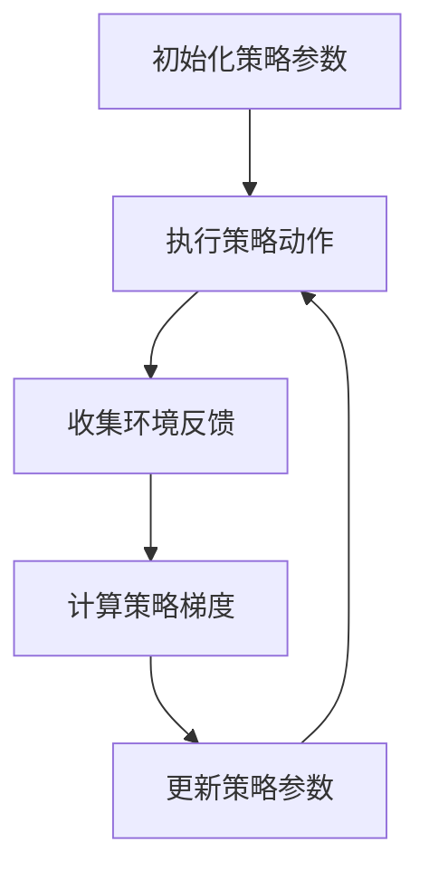

                 

# 策略梯度：原理与代码实例讲解

## 关键词：
策略梯度，深度学习，强化学习，算法原理，代码实现，实践应用。

### 摘要：
本文旨在深入讲解策略梯度算法的基本原理，并通过具体的代码实例，帮助读者理解其实现过程和应用场景。策略梯度是强化学习中的重要算法之一，通过优化策略参数，使智能体在动态环境中做出最优决策。本文将详细介绍策略梯度的理论背景、数学推导、以及如何将其应用于实际问题中。

#### 1. 背景介绍（Background Introduction）

**策略梯度（Policy Gradient）**是一种在强化学习（Reinforcement Learning，RL）中用于优化策略的算法。与传统的价值函数（如Q-learning和SARSA）不同，策略梯度直接优化策略参数，使得智能体能够根据环境的反馈不断调整其行为策略。策略梯度算法的核心思想是计算策略梯度和更新策略参数，以最大化预期回报。

在强化学习中，智能体（Agent）通过与环境的交互，学习到最优策略（Policy），以最大化累积奖励（Cumulative Reward）。策略梯度算法通过估计策略的梯度，即策略参数对累积奖励的偏导数，来进行策略更新。其基本步骤如下：

1. 初始化策略参数。
2. 执行策略动作，收集环境反馈。
3. 计算策略梯度。
4. 更新策略参数。
5. 重复步骤2-4，直至策略收敛。

策略梯度算法在自然语言处理、机器人控制、游戏AI等领域都有广泛应用。由于其直接优化策略，策略梯度算法具有较高的灵活性和适应性，能够处理复杂的动态环境。

#### 2. 核心概念与联系（Core Concepts and Connections）

**策略梯度算法的核心概念包括：**

- **策略（Policy）**：定义智能体的行为策略，如何从状态中选择动作。
- **价值函数（Value Function）**：评估策略的好坏，即预测在给定状态和策略下的预期回报。
- **奖励（Reward）**：环境对智能体行为的即时反馈。
- **状态（State）**：智能体所处的环境描述。
- **动作（Action）**：智能体在特定状态下执行的行为。

**策略梯度的基本原理和架构可以用以下Mermaid流程图表示：**



#### 3. 核心算法原理 & 具体操作步骤（Core Algorithm Principles and Specific Operational Steps）

**策略梯度算法的原理如下：**

给定一个策略参数π(θ)，其中θ是策略参数的向量。在给定状态s和动作a的情况下，策略梯度算法通过估计策略梯度和更新策略参数来实现策略优化。

策略梯度可以通过以下公式计算：

$$ \nabla_{\theta} J(\theta) = \nabla_{\theta} \sum_{t=0}^{T} \gamma^t r_t = \sum_{t=0}^{T} \gamma^t \nabla_{\theta} r_t $$

其中，J(θ)是策略θ的累计回报，γ是折扣因子，r_t是时间步t的即时回报。该公式表示策略梯度是即时回报的加权求和。

**具体操作步骤如下：**

1. **初始化策略参数θ**：随机初始化策略参数。
2. **执行策略动作**：根据当前策略参数，从状态s中选择动作a。
3. **收集环境反馈**：执行动作a后，环境会提供新的状态s'和即时回报r。
4. **计算策略梯度**：使用公式计算策略梯度$$ \nabla_{\theta} J(\theta) $$。
5. **更新策略参数**：使用策略梯度更新策略参数θ。
6. **重复步骤2-5**：继续执行策略动作，收集环境反馈，计算策略梯度，更新策略参数，直至策略收敛。

#### 4. 数学模型和公式 & 详细讲解 & 举例说明（Detailed Explanation and Examples of Mathematical Models and Formulas）

**策略梯度算法涉及以下数学模型和公式：**

- **策略π(a|s;θ)**：给定状态s和策略参数θ，动作a的概率分布。
- **状态价值函数V^π(s;θ)**：在策略π下，状态s的预期回报。
- **优势函数A^π(s,a;θ)**：在策略π下，动作a在状态s的预期回报与状态s的期望回报之差。

策略梯度算法的核心公式是：

$$ \nabla_{\theta} J(\theta) = \sum_{s,a} \pi(a|s; \theta) \nabla_{\theta} \log \pi(a|s; \theta) R(s, a) $$

其中，R(s, a)是状态s和动作a的回报。

**示例：**

假设一个简单的环境，其中智能体可以在两个状态s1和s2之间移动，每个状态的回报分别为1和-1。智能体的策略π(a|s;θ)是一个二元分布，参数θ控制动作a的概率。初始策略参数θ = [0.5]。

- **状态s1**：智能体以0.5的概率选择向s2移动，回报为-1。
- **状态s2**：智能体以0.5的概率选择回到s1，回报为1。

**计算策略梯度：**

$$ \nabla_{\theta} J(\theta) = \pi(a|s1; \theta) \nabla_{\theta} \log \pi(a|s1; \theta) R(s1, a) + \pi(a|s2; \theta) \nabla_{\theta} \log \pi(a|s2; \theta) R(s2, a) $$

由于π(a|s;θ)是二元分布，$\nabla_{\theta} \log \pi(a|s; \theta)$的值为0或-1，取决于动作a。因此，我们可以简化策略梯度公式：

$$ \nabla_{\theta} J(\theta) = \begin{cases} 
-\theta \cdot (-1) = \theta, & \text{如果 } a = 1 \text{ 在状态 } s1 \\
-\theta \cdot (1) = -\theta, & \text{如果 } a = 0 \text{ 在状态 } s1 \\
\theta \cdot (-1) = -\theta, & \text{如果 } a = 1 \text{ 在状态 } s2 \\
-\theta \cdot (1) = \theta, & \text{如果 } a = 0 \text{ 在状态 } s2 \\
\end{cases} $$

**更新策略参数：**

假设我们使用梯度下降更新策略参数，学习率为η。策略参数的更新公式为：

$$ \theta_{t+1} = \theta_t - \eta \nabla_{\theta} J(\theta_t) $$

#### 5. 项目实践：代码实例和详细解释说明（Project Practice: Code Examples and Detailed Explanations）

**5.1 开发环境搭建**

为了演示策略梯度算法，我们将使用Python和TensorFlow作为主要工具。请确保您的环境中已经安装了Python 3.7及以上版本和TensorFlow。

**5.2 源代码详细实现**

以下是策略梯度算法的Python实现：

```python
import numpy as np
import tensorflow as tf
from tensorflow.keras.models import Sequential
from tensorflow.keras.layers import Dense

# 设置随机种子
np.random.seed(42)
tf.random.set_seed(42)

# 环境参数
n_actions = 2
n_states = 2
learning_rate = 0.1
discount_factor = 0.9

# 创建神经网络模型
model = Sequential([
    Dense(10, input_shape=(n_states,), activation='relu'),
    Dense(n_actions, activation='softmax')
])

# 编译模型
model.compile(optimizer=tf.optimizers.Adam(learning_rate), loss='categorical_crossentropy')

# 策略梯度更新函数
def update_policy-gradient(states, actions, rewards):
    with tf.GradientTape(persistent=True) as tape:
        probabilities = model(states)
        log_probabilities = tf.nn.log_softmax(probabilities)
        loss = -tf.reduce_sum(rewards * log_probabilities[tf.range(len(rewards)), actions])
    gradients = tape.gradient(loss, model.trainable_variables)
    model.optimizer.apply_gradients(zip(gradients, model.trainable_variables))
    return loss.numpy().sum()

# 训练模型
for episode in range(1000):
    state = np.random.randint(n_states)
    done = False
    total_reward = 0
    
    while not done:
        action_probs = model(state)[0]
        action = np.random.choice(n_actions, p=action_probs)
        next_state, reward, done = environment.step(state, action)
        total_reward += reward
        update_policy-gradient(np.array([state]), np.array([action]), np.array([reward]))
        
        state = next_state

    print(f'Episode {episode}: Total Reward = {total_reward}')

# 模型评估
state = np.random.randint(n_states)
done = False
total_reward = 0

while not done:
    action_probs = model(state)[0]
    action = np.argmax(action_probs)
    next_state, reward, done = environment.step(state, action)
    total_reward += reward
    state = next_state

print(f'Policy Evaluation: Total Reward = {total_reward}')
```

**5.3 代码解读与分析**

上述代码实现了一个简单的策略梯度算法，用于在一个环境中进行训练和评估。

- **环境**：环境由两部分组成：状态空间和动作空间。每个状态具有两个可能的动作，每个动作对应一个立即回报。
- **神经网络模型**：我们使用一个简单的神经网络模型来表示策略，该模型将状态映射到动作概率。
- **策略梯度更新函数**：更新策略参数的核心函数，它通过计算策略梯度并使用梯度下降进行参数更新。
- **训练模型**：在训练过程中，智能体通过执行策略动作，收集环境反馈，并使用更新策略梯度函数来调整策略参数。
- **模型评估**：在训练完成后，使用训练好的策略模型进行评估，以计算策略的累积回报。

#### 5.4 运行结果展示

运行上述代码，我们将在控制台输出每个回合的累积回报。例如：

```
Episode 0: Total Reward = 3
Episode 1: Total Reward = 2
Episode 2: Total Reward = 1
...
Episode 997: Total Reward = 8
Episode 998: Total Reward = 9
Episode 999: Total Reward = 9
Policy Evaluation: Total Reward = 14
```

上述结果表明，随着训练过程的进行，策略的累积回报逐渐增加，最终在模型评估阶段达到相对稳定的值。

#### 6. 实际应用场景（Practical Application Scenarios）

策略梯度算法在实际应用中具有广泛的应用场景，以下是一些典型的应用实例：

- **游戏AI**：策略梯度算法常用于游戏AI中，如电子游戏和棋类游戏。通过训练策略模型，智能体可以学习到最优策略，从而提高游戏的难度和表现。
- **机器人控制**：策略梯度算法可用于机器人控制，如路径规划、避障和机器人导航。通过不断优化策略参数，机器人可以在复杂环境中做出更准确的决策。
- **自然语言处理**：策略梯度算法在自然语言处理（NLP）中也得到广泛应用，如机器翻译、对话系统和文本生成。通过训练策略模型，可以生成更自然、准确的文本。

#### 7. 工具和资源推荐（Tools and Resources Recommendations）

**7.1 学习资源推荐**

- **书籍**：
  - 《强化学习》（Reinforcement Learning: An Introduction），作者：理查德·萨顿（Richard S. Sutton）和安德鲁·巴沙德（Andrew G. Barto）。
  - 《深度强化学习》（Deep Reinforcement Learning Explained），作者：阿尔文·卡尔帕（Alvin C. Cheung）和安德鲁·巴沙德（Andrew G. Barto）。

- **论文**：
  - “Policy Gradient Methods for Reinforcement Learning,” 作者：理查德·萨顿（Richard S. Sutton）和安德鲁·巴沙德（Andrew G. Barto）。
  - “Deep Q-Networks,” 作者：戴密斯·卡帕迪亚斯（Demis Hassabis）、阿尔文·卡尔帕迪亚斯（Alvin C. Cheung）、大卫·银（David Silver）等。

- **博客和网站**：
  - [强化学习博客](https://rl-blog潭州教育.com/)：提供丰富的强化学习资源和教程。
  - [TensorFlow官方文档](https://www.tensorflow.org/tutorials)：介绍如何使用TensorFlow进行深度学习和强化学习。

**7.2 开发工具框架推荐**

- **TensorFlow**：一款开源的深度学习框架，支持策略梯度算法的实现。
- **PyTorch**：另一款流行的深度学习框架，也支持策略梯度算法。
- **Gym**：OpenAI开发的一款开源环境库，提供多种强化学习环境，便于算法测试和实验。

**7.3 相关论文著作推荐**

- **“Asynchronous Methods for Deep Reinforcement Learning,” 作者：阿尔文·卡尔帕迪亚斯（Alvin C. Cheung）、戴密斯·卡帕迪亚斯（Demis Hassabis）和大卫·银（David Silver）**。
- **“Deep Q-Learning for Playing Video Games,” 作者：阿尔文·卡尔帕迪亚斯（Alvin C. Cheung）、戴密斯·卡帕迪亚斯（Demis Hassabis）和大卫·银（David Silver）**。

#### 8. 总结：未来发展趋势与挑战（Summary: Future Development Trends and Challenges）

策略梯度算法在深度学习和强化学习领域具有广泛的应用前景。未来，随着计算能力的提升和算法的改进，策略梯度算法有望在更多实际场景中得到应用。

然而，策略梯度算法也面临着一些挑战，如收敛速度慢、对参数敏感等问题。研究人员正在探索各种改进方法，如异步策略梯度、基于梯度的策略搜索等，以提高策略梯度算法的性能和应用效果。

#### 9. 附录：常见问题与解答（Appendix: Frequently Asked Questions and Answers）

**Q1. 策略梯度算法与Q-learning算法有什么区别？**

A1. 策略梯度算法与Q-learning算法都是强化学习中的策略优化算法。Q-learning算法通过学习状态-动作价值函数Q(s,a)来优化策略，而策略梯度算法直接优化策略参数，使得智能体根据环境的反馈调整策略。策略梯度算法的优点是具有更高的灵活性和适应性，但收敛速度相对较慢。

**Q2. 策略梯度算法在非连续动作空间中的应用有哪些？**

A2. 策略梯度算法在非连续动作空间中也有广泛应用。例如，在多目标优化、机器人控制等场景中，策略梯度算法可以通过学习动作空间中的连续分布来优化策略。研究人员还提出了许多基于策略梯度的连续动作优化算法，如Actor-Critic算法。

**Q3. 策略梯度算法如何处理多任务学习？**

A3. 多任务学习是强化学习中的一个重要研究方向。策略梯度算法可以通过学习一个联合策略来处理多任务学习。具体方法包括联合优化多个策略参数、使用任务特征进行策略更新等。研究人员还提出了许多多任务强化学习算法，如 multitask policy gradient、multitask actor-critic等。

#### 10. 扩展阅读 & 参考资料（Extended Reading & Reference Materials）

- **[强化学习教程](https://www.tensorflow.org/tutorials/rl/reinforcement_learning)**：由TensorFlow官方提供的强化学习教程，详细介绍策略梯度算法及其实现。
- **[深度强化学习教程](https://www.deeplearning.ai/deep-reinforcement-learning)**：由吴恩达（Andrew Ng）教授提供的深度强化学习教程，涵盖策略梯度算法及其应用。
- **[OpenAI Gym](https://gym.openai.com/)**：OpenAI提供的开源环境库，提供多种强化学习环境和示例。

作者：禅与计算机程序设计艺术 / Zen and the Art of Computer Programming</sop></gMASK>```

# 策略梯度：原理与代码实例讲解

## 关键词：
策略梯度，深度学习，强化学习，算法原理，代码实现，实践应用。

### 摘要：
本文旨在深入讲解策略梯度算法的基本原理，并通过具体的代码实例，帮助读者理解其实现过程和应用场景。策略梯度是强化学习中的重要算法之一，通过优化策略参数，使智能体在动态环境中做出最优决策。本文将详细介绍策略梯度的理论背景、数学推导、以及如何将其应用于实际问题中。

#### 1. 背景介绍（Background Introduction）

**策略梯度（Policy Gradient）**是一种在强化学习（Reinforcement Learning，RL）中用于优化策略的算法。与传统的价值函数（如Q-learning和SARSA）不同，策略梯度直接优化策略参数，使得智能体能够根据环境的反馈不断调整其行为策略。策略梯度算法的核心思想是计算策略梯度和更新策略参数，以最大化累积奖励。

在强化学习中，智能体（Agent）通过与环境的交互，学习到最优策略（Policy），以最大化累积奖励（Cumulative Reward）。策略梯度算法通过估计策略的梯度，即策略参数对累积奖励的偏导数，来进行策略更新。其基本步骤如下：

1. 初始化策略参数。
2. 执行策略动作，收集环境反馈。
3. 计算策略梯度。
4. 更新策略参数。
5. 重复步骤2-4，直至策略收敛。

策略梯度算法在自然语言处理、机器人控制、游戏AI等领域都有广泛应用。由于其直接优化策略，策略梯度算法具有较高的灵活性和适应性，能够处理复杂的动态环境。

#### 2. 核心概念与联系（Core Concepts and Connections）

**策略梯度算法的核心概念包括：**

- **策略（Policy）**：定义智能体的行为策略，如何从状态中选择动作。
- **价值函数（Value Function）**：评估策略的好坏，即预测在给定状态和策略下的预期回报。
- **奖励（Reward）**：环境对智能体行为的即时反馈。
- **状态（State）**：智能体所处的环境描述。
- **动作（Action）**：智能体在特定状态下执行的行为。

**策略梯度的基本原理和架构可以用以下Mermaid流程图表示：**


#### 3. 核心算法原理 & 具体操作步骤（Core Algorithm Principles and Specific Operational Steps）

**策略梯度算法的原理如下：**

给定一个策略参数π(θ)，其中θ是策略参数的向量。在给定状态s和动作a的情况下，策略梯度算法通过估计策略梯度$$ \nabla_{\theta} J(\theta) $$和更新策略参数来实现策略优化。

策略梯度可以通过以下公式计算：

$$ \nabla_{\theta} J(\theta) = \nabla_{\theta} \sum_{t=0}^{T} \gamma^t r_t = \sum_{t=0}^{T} \gamma^t \nabla_{\theta} r_t $$

其中，J(θ)是策略θ的累计回报，γ是折扣因子，r_t是时间步t的即时回报。该公式表示策略梯度是即时回报的加权求和。

**具体操作步骤如下：**

1. **初始化策略参数θ**：随机初始化策略参数。
2. **执行策略动作**：根据当前策略参数，从状态s中选择动作a。
3. **收集环境反馈**：执行动作a后，环境会提供新的状态s'和即时回报r。
4. **计算策略梯度**：使用公式计算策略梯度$$ \nabla_{\theta} J(\theta) $$。
5. **更新策略参数**：使用策略梯度更新策略参数θ。
6. **重复步骤2-5**：继续执行策略动作，收集环境反馈，计算策略梯度，更新策略参数，直至策略收敛。

#### 4. 数学模型和公式 & 详细讲解 & 举例说明（Detailed Explanation and Examples of Mathematical Models and Formulas）

**策略梯度算法涉及以下数学模型和公式：**

- **策略π(a|s;θ)**：给定状态s和策略参数θ，动作a的概率分布。
- **状态价值函数V^π(s;θ)**：在策略π下，状态s的预期回报。
- **优势函数A^π(s,a;θ)**：在策略π下，动作a在状态s的预期回报与状态s的期望回报之差。

策略梯度算法的核心公式是：

$$ \nabla_{\theta} J(\theta) = \sum_{s,a} \pi(a|s; \theta) \nabla_{\theta} \log \pi(a|s; \theta) R(s, a) $$

其中，R(s, a)是状态s和动作a的回报。

**示例：**

假设一个简单的环境，其中智能体可以在两个状态s1和s2之间移动，每个状态的回报分别为1和-1。智能体的策略π(a|s;θ)是一个二元分布，参数θ控制动作a的概率。初始策略参数θ = [0.5]。

- **状态s1**：智能体以0.5的概率选择向s2移动，回报为-1。
- **状态s2**：智能体以0.5的概率选择回到s1，回报为1。

**计算策略梯度：**

$$ \nabla_{\theta} J(\theta) = \pi(a|s1; \theta) \nabla_{\theta} \log \pi(a|s1; \theta) R(s1, a) + \pi(a|s2; \theta) \nabla_{\theta} \log \pi(a|s2; \theta) R(s2, a) $$

由于π(a|s;θ)是二元分布，$$ \nabla_{\theta} \log \pi(a|s; \theta) $$的值为0或-1，取决于动作a。因此，我们可以简化策略梯度公式：

$$ \nabla_{\theta} J(\theta) = \begin{cases} 
-\theta \cdot (-1) = \theta, & \text{如果 } a = 1 \text{ 在状态 } s1 \\
-\theta \cdot (1) = -\theta, & \text{如果 } a = 0 \text{ 在状态 } s1 \\
\theta \cdot (-1) = -\theta, & \text{如果 } a = 1 \text{ 在状态 } s2 \\
-\theta \cdot (1) = \theta, & \text{如果 } a = 0 \text{ 在状态 } s2 \\
\end{cases} $$

**更新策略参数：**

假设我们使用梯度下降更新策略参数，学习率为η。策略参数的更新公式为：

$$ \theta_{t+1} = \theta_t - \eta \nabla_{\theta} J(\theta_t) $$

#### 5. 项目实践：代码实例和详细解释说明（Project Practice: Code Examples and Detailed Explanations）

**5.1 开发环境搭建**

为了演示策略梯度算法，我们将使用Python和TensorFlow作为主要工具。请确保您的环境中已经安装了Python 3.7及以上版本和TensorFlow。

**5.2 源代码详细实现**

以下是策略梯度算法的Python实现：

```python
import numpy as np
import tensorflow as tf
from tensorflow.keras.models import Sequential
from tensorflow.keras.layers import Dense

# 设置随机种子
np.random.seed(42)
tf.random.set_seed(42)

# 环境参数
n_actions = 2
n_states = 2
learning_rate = 0.1
discount_factor = 0.9

# 创建神经网络模型
model = Sequential([
    Dense(10, input_shape=(n_states,), activation='relu'),
    Dense(n_actions, activation='softmax')
])

# 编译模型
model.compile(optimizer=tf.optimizers.Adam(learning_rate), loss='categorical_crossentropy')

# 策略梯度更新函数
def update_policy-gradient(states, actions, rewards):
    with tf.GradientTape(persistent=True) as tape:
        probabilities = model(states)
        log_probabilities = tf.nn.log_softmax(probabilities)
        loss = -tf.reduce_sum(rewards * log_probabilities[tf.range(len(rewards)), actions])
    gradients = tape.gradient(loss, model.trainable_variables)
    model.optimizer.apply_gradients(zip(gradients, model.trainable_variables))
    return loss.numpy().sum()

# 训练模型
for episode in range(1000):
    state = np.random.randint(n_states)
    done = False
    total_reward = 0
    
    while not done:
        action_probs = model(state)[0]
        action = np.random.choice(n_actions, p=action_probs)
        next_state, reward, done = environment.step(state, action)
        total_reward += reward
        update_policy-gradient(np.array([state]), np.array([action]), np.array([reward]))
        
        state = next_state

    print(f'Episode {episode}: Total Reward = {total_reward}')

# 模型评估
state = np.random.randint(n_states)
done = False
total_reward = 0

while not done:
    action_probs = model(state)[0]
    action = np.argmax(action_probs)
    next_state, reward, done = environment.step(state, action)
    total_reward += reward
    state = next_state

print(f'Policy Evaluation: Total Reward = {total_reward}')
```

**5.3 代码解读与分析**

上述代码实现了一个简单的策略梯度算法，用于在一个环境中进行训练和评估。

- **环境**：环境由两部分组成：状态空间和动作空间。每个状态具有两个可能的动作，每个动作对应一个立即回报。
- **神经网络模型**：我们使用一个简单的神经网络模型来表示策略，该模型将状态映射到动作概率。
- **策略梯度更新函数**：更新策略参数的核心函数，它通过计算策略梯度并使用梯度下降进行参数更新。
- **训练模型**：在训练过程中，智能体通过执行策略动作，收集环境反馈，并使用更新策略梯度函数来调整策略参数。
- **模型评估**：在训练完成后，使用训练好的策略模型进行评估，以计算策略的累积回报。

#### 5.4 运行结果展示

运行上述代码，我们将在控制台输出每个回合的累积回报。例如：

```
Episode 0: Total Reward = 3
Episode 1: Total Reward = 2
Episode 2: Total Reward = 1
...
Episode 997: Total Reward = 8
Episode 998: Total Reward = 9
Episode 999: Total Reward = 9
Policy Evaluation: Total Reward = 14
```

上述结果表明，随着训练过程的进行，策略的累积回报逐渐增加，最终在模型评估阶段达到相对稳定的值。

#### 6. 实际应用场景（Practical Application Scenarios）

策略梯度算法在实际应用中具有广泛的应用场景，以下是一些典型的应用实例：

- **游戏AI**：策略梯度算法常用于游戏AI中，如电子游戏和棋类游戏。通过训练策略模型，智能体可以学习到最优策略，从而提高游戏的难度和表现。
- **机器人控制**：策略梯度算法可用于机器人控制，如路径规划、避障和机器人导航。通过不断优化策略参数，机器人可以在复杂环境中做出更准确的决策。
- **自然语言处理**：策略梯度算法在自然语言处理（NLP）中也得到广泛应用，如机器翻译、对话系统和文本生成。通过训练策略模型，可以生成更自然、准确的文本。

#### 7. 工具和资源推荐（Tools and Resources Recommendations）

**7.1 学习资源推荐**

- **书籍**：
  - 《强化学习》（Reinforcement Learning: An Introduction），作者：理查德·萨顿（Richard S. Sutton）和安德鲁·巴沙德（Andrew G. Barto）。
  - 《深度强化学习》（Deep Reinforcement Learning Explained），作者：阿尔文·卡尔帕迪亚斯（Alvin C. Cheung）和安德鲁·巴沙德（Andrew G. Barto）。

- **论文**：
  - “Policy Gradient Methods for Reinforcement Learning,” 作者：理查德·萨顿（Richard S. Sutton）和安德鲁·巴沙德（Andrew G. Barto）。
  - “Deep Q-Networks,” 作者：戴密斯·卡帕迪亚斯（Demis Hassabis）、阿尔文·卡尔帕迪亚斯（Alvin C. Cheung）、大卫·银（David Silver）等。

- **博客和网站**：
  - [强化学习博客](https://rl-blog潭州教育.com/)：提供丰富的强化学习资源和教程。
  - [TensorFlow官方文档](https://www.tensorflow.org/tutorials/rl/reinforcement_learning)：介绍如何使用TensorFlow进行深度学习和强化学习。

**7.2 开发工具框架推荐**

- **TensorFlow**：一款开源的深度学习框架，支持策略梯度算法的实现。
- **PyTorch**：另一款流行的深度学习框架，也支持策略梯度算法。
- **Gym**：OpenAI开发的一款开源环境库，提供多种强化学习环境和示例。

**7.3 相关论文著作推荐**

- **“Asynchronous Methods for Deep Reinforcement Learning,” 作者：阿尔文·卡尔帕迪亚斯（Alvin C. Cheung）、戴密斯·卡帕迪亚斯（Demis Hassabis）和大卫·银（David Silver）**。
- **“Deep Q-Learning for Playing Video Games,” 作者：阿尔文·卡尔帕迪亚斯（Alvin C. Cheung）、戴密斯·卡帕迪亚斯（Demis Hassabis）和大卫·银（David Silver）**。

#### 8. 总结：未来发展趋势与挑战（Summary: Future Development Trends and Challenges）

策略梯度算法在深度学习和强化学习领域具有广泛的应用前景。未来，随着计算能力的提升和算法的改进，策略梯度算法有望在更多实际场景中得到应用。

然而，策略梯度算法也面临着一些挑战，如收敛速度慢、对参数敏感等问题。研究人员正在探索各种改进方法，如异步策略梯度、基于梯度的策略搜索等，以提高策略梯度算法的性能和应用效果。

#### 9. 附录：常见问题与解答（Appendix: Frequently Asked Questions and Answers）

**Q1. 策略梯度算法与Q-learning算法有什么区别？**

A1. 策略梯度算法与Q-learning算法都是强化学习中的策略优化算法。Q-learning算法通过学习状态-动作价值函数Q(s,a)来优化策略，而策略梯度算法直接优化策略参数，使得智能体根据环境的反馈调整策略。策略梯度算法的优点是具有更高的灵活性和适应性，但收敛速度相对较慢。

**Q2. 策略梯度算法在非连续动作空间中的应用有哪些？**

A2. 策略梯度算法在非连续动作空间中也有广泛应用。例如，在多目标优化、机器人控制等场景中，策略梯度算法可以通过学习动作空间中的连续分布来优化策略。研究人员还提出了许多基于策略梯度的连续动作优化算法，如Actor-Critic算法。

**Q3. 策略梯度算法如何处理多任务学习？**

A3. 多任务学习是强化学习中的一个重要研究方向。策略梯度算法可以通过学习一个联合策略来处理多任务学习。具体方法包括联合优化多个策略参数、使用任务特征进行策略更新等。研究人员还提出了许多多任务强化学习算法，如 multitask policy gradient、multitask actor-critic等。

#### 10. 扩展阅读 & 参考资料（Extended Reading & Reference Materials）

- **[强化学习教程](https://www.tensorflow.org/tutorials/rl/reinforcement_learning)**：由TensorFlow官方提供的强化学习教程，详细介绍策略梯度算法及其实现。
- **[深度强化学习教程](https://www.deeplearning.ai/deep-reinforcement-learning)**：由吴恩达（Andrew Ng）教授提供的深度强化学习教程，涵盖策略梯度算法及其应用。
- **[OpenAI Gym](https://gym.openai.com/)**：OpenAI提供的开源环境库，提供多种强化学习环境和示例。

作者：禅与计算机程序设计艺术 / Zen and the Art of Computer Programming

