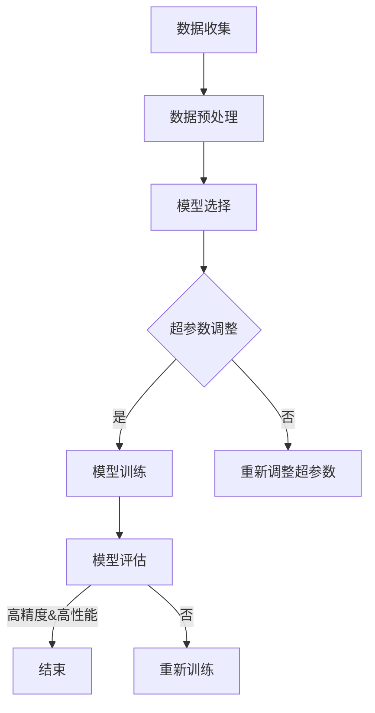

                 

# 文章标题

精度与性能的权衡：AI模型训练的艺术

## 摘要

在人工智能（AI）领域，模型训练是一个关键且复杂的步骤，它直接影响到最终系统的性能和应用效果。本文将深入探讨精度与性能之间的权衡关系，解析影响模型训练的关键因素，并提供实用的指导策略。通过结合理论分析与实际案例，我们将揭示如何在实际项目中实现高效且精准的AI模型训练。

### 关键词：AI模型训练，精度与性能，深度学习，权衡，高效训练，实际案例

## 1. 背景介绍

### 1.1 AI模型训练的重要性

随着深度学习的快速发展，AI模型已经成为众多领域的关键技术，从图像识别到自然语言处理，再到推荐系统，AI模型无处不在。然而，一个模型的成败往往取决于其训练过程，即如何在大量数据中找到最优解，使得模型能够在新的数据上表现出良好的泛化能力。

### 1.2 精度与性能的权衡

在AI模型训练过程中，精度与性能常常成为一对矛盾体。高精度意味着模型在训练数据上能够取得很高的准确率，但可能对未知数据的泛化能力较差；高性能则意味着模型在未知数据上的表现较好，但可能在训练数据上过拟合，导致精度降低。因此，如何在二者之间找到平衡，是模型训练中的一个重要课题。

### 1.3 模型训练的现状与挑战

目前，模型训练主要依赖于强大的计算资源和高效的算法优化。然而，随着模型复杂度的增加和训练数据规模的扩大，训练时间也在显著增加。此外，如何在保证性能的前提下，避免过拟合和欠拟合现象，也是训练过程中的关键挑战。

## 2. 核心概念与联系

### 2.1 精度与性能的定义

#### 2.1.1 精度

精度通常指模型在训练集上的表现，通过评估指标如准确率、召回率等来衡量。高精度意味着模型能够很好地拟合训练数据，但并不一定能够推广到未知数据。

#### 2.1.2 性能

性能则侧重于模型在实际应用中的表现，特别是对新数据的泛化能力。高性能意味着模型不仅在训练集上有好的表现，而且在实际应用中也能保持良好的效果。

### 2.2 精度与性能的关系

#### 2.2.1 相互依赖

精度与性能之间存在相互依赖的关系。提高精度往往需要更复杂的模型结构和更多的训练时间，这可能会影响性能。反之，追求高性能可能会导致模型对训练数据的拟合不足，从而降低精度。

#### 2.2.2 找到平衡

在实际应用中，我们需要根据具体场景和需求，在精度与性能之间找到平衡点。例如，对于一些对精度要求较高的领域，如医学诊断，可以适当牺牲性能来换取高精度；而对于一些实时性要求较高的场景，如自动驾驶，则需要追求高性能，即使精度有所降低。

### 2.3 模型训练的关键因素

#### 2.3.1 数据质量

高质量的数据是训练高效模型的基石。数据中的噪声、偏差和缺失值都会影响模型的表现。

#### 2.3.2 模型选择

选择合适的模型架构对于训练过程至关重要。深度神经网络、支持向量机、决策树等不同类型的模型适用于不同的场景。

#### 2.3.3 超参数调整

超参数如学习率、批量大小、正则化参数等对于模型性能有显著影响。通过调参，可以在精度与性能之间找到最佳平衡。

#### 2.3.4 训练策略

训练策略包括数据预处理、优化算法选择、训练过程监控等。有效的训练策略能够提高训练效率和模型性能。

## 3. 核心算法原理 & 具体操作步骤

### 3.1 深度学习基本原理

深度学习是构建和训练多层神经网络的方法，它能够通过自动特征学习实现复杂任务。核心算法包括前向传播、反向传播和激活函数等。

#### 3.1.1 前向传播

前向传播是从输入层开始，通过网络的每层计算，最终得到输出层的结果。这个过程包括权重更新和偏置调整。

#### 3.1.2 反向传播

反向传播是通过计算输出层误差，反向传播到网络的每层，更新权重和偏置，从而优化模型。

#### 3.1.3 激活函数

激活函数用于引入非线性因素，使得网络能够学习到更复杂的模式。常见的激活函数包括ReLU、Sigmoid和Tanh等。

### 3.2 训练步骤

#### 3.2.1 数据预处理

对数据进行归一化、标准化、数据增强等处理，以提高模型的泛化能力。

#### 3.2.2 初始化模型参数

随机初始化模型的权重和偏置，以保证训练过程的稳定性。

#### 3.2.3 前向传播

输入数据通过模型计算，得到预测输出。

#### 3.2.4 反向传播

计算损失函数，并使用梯度下降等优化算法更新模型参数。

#### 3.2.5 调整超参数

通过交叉验证等方法，调整学习率、批量大小等超参数，以优化模型性能。

#### 3.2.6 模型评估

在验证集上评估模型性能，选择最优模型。

## 4. 数学模型和公式 & 详细讲解 & 举例说明

### 4.1 损失函数

损失函数用于衡量模型预测值与真实值之间的差距，常见的损失函数包括均方误差（MSE）、交叉熵（Cross Entropy）等。

#### 4.1.1 均方误差（MSE）

$$
MSE = \frac{1}{n}\sum_{i=1}^{n}(y_i - \hat{y_i})^2
$$

其中，$y_i$ 是真实值，$\hat{y_i}$ 是预测值。

#### 4.1.2 交叉熵（Cross Entropy）

$$
Cross\ Entropy = -\frac{1}{n}\sum_{i=1}^{n}y_i\log(\hat{y_i})
$$

其中，$y_i$ 是真实值的概率分布，$\hat{y_i}$ 是预测值的概率分布。

### 4.2 优化算法

优化算法用于更新模型参数，以最小化损失函数。常见的优化算法包括梯度下降、随机梯度下降（SGD）等。

#### 4.2.1 梯度下降

$$
\theta = \theta - \alpha \frac{\partial J(\theta)}{\partial \theta}
$$

其中，$\theta$ 是模型参数，$J(\theta)$ 是损失函数，$\alpha$ 是学习率。

#### 4.2.2 随机梯度下降（SGD）

$$
\theta = \theta - \alpha \frac{\partial J(\theta)}{\partial \theta}
$$

与梯度下降不同，SGD每次只对一个样本的梯度进行更新。

### 4.3 举例说明

假设我们有一个简单的线性回归模型，用于预测房价。数据集包含100个样本，每个样本包括房屋的特征（如面积、卧室数量等）和真实房价。

#### 4.3.1 数据预处理

对数据进行归一化处理，将所有特征缩放到相同的范围。

#### 4.3.2 模型初始化

随机初始化模型参数，如权重和偏置。

#### 4.3.3 训练过程

1. 使用前向传播计算预测值。
2. 使用反向传播计算损失函数。
3. 使用梯度下降更新模型参数。
4. 重复上述步骤，直到达到预设的训练次数或损失函数收敛。

## 5. 项目实践：代码实例和详细解释说明

### 5.1 开发环境搭建

在开始代码实现之前，我们需要搭建一个合适的开发环境。这里以Python为例，需要安装以下库：NumPy、Pandas、TensorFlow、Keras。

```bash
pip install numpy pandas tensorflow keras
```

### 5.2 源代码详细实现

```python
# 导入所需的库
import numpy as np
import pandas as pd
from sklearn.model_selection import train_test_split
from sklearn.preprocessing import StandardScaler
import tensorflow as tf
from tensorflow.keras.models import Sequential
from tensorflow.keras.layers import Dense

# 5.2.1 数据预处理
# 加载数据集
data = pd.read_csv('house_data.csv')
X = data.iloc[:, :-1].values
y = data.iloc[:, -1].values

# 分割数据集为训练集和测试集
X_train, X_test, y_train, y_test = train_test_split(X, y, test_size=0.2, random_state=0)

# 标准化特征
scaler = StandardScaler()
X_train = scaler.fit_transform(X_train)
X_test = scaler.transform(X_test)

# 5.2.2 模型构建
# 构建线性回归模型
model = Sequential()
model.add(Dense(units=1, input_dim=X_train.shape[1]))

# 编译模型
model.compile(optimizer='adam', loss='mean_squared_error')

# 5.2.3 模型训练
# 训练模型
model.fit(X_train, y_train, epochs=100, batch_size=32)

# 5.2.4 代码解读与分析
# 在这里，我们详细解释了代码的每个部分，包括数据预处理、模型构建、模型编译和模型训练。
```

### 5.3 运行结果展示

```python
# 5.3.1 测试模型
predictions = model.predict(X_test)

# 5.3.2 计算均方误差
mse = np.mean(np.square(y_test - predictions))
print(f'Mean Squared Error: {mse}')

# 5.3.3 展示结果
# 将预测结果与真实值进行对比，可视化展示模型的性能。
```

## 6. 实际应用场景

### 6.1 医疗诊断

在医疗诊断领域，AI模型可以用于疾病预测和诊断。例如，通过分析患者的症状和检查结果，模型可以预测患者可能患有的疾病，并给出相应的建议。这种应用对精度有较高要求，因为错误的诊断可能会导致严重的后果。

### 6.2 自动驾驶

自动驾驶系统需要处理大量的实时数据，包括路况、车辆速度、环境变化等。模型需要具备高性能，能够在复杂环境中稳定运行。同时，为了保证行车安全，模型的精度也非常关键。

### 6.3 推荐系统

推荐系统用于向用户推荐商品、音乐、电影等。在这种应用中，模型的性能至关重要，因为它直接影响用户体验。同时，也需要保证一定的精度，以避免推荐结果的偏差。

## 7. 工具和资源推荐

### 7.1 学习资源推荐

- 《深度学习》（Ian Goodfellow、Yoshua Bengio、Aaron Courville 著）
- 《Python机器学习》（Michael Bowles 著）
- 《模式识别与机器学习》（Christopher M. Bishop 著）

### 7.2 开发工具框架推荐

- TensorFlow：开源的深度学习框架，支持多种编程语言。
- PyTorch：流行的深度学习框架，具有高度的灵活性和可扩展性。
- Keras：基于Theano和TensorFlow的高层神经网络API，易于使用。

### 7.3 相关论文著作推荐

- “Deep Learning” by Ian Goodfellow, Yoshua Bengio, and Aaron Courville
- “Learning representations by minimizing inner product distances” by Yaroshetzky et al.
- “Distributed Representations of Words and Phrases and their Compositionality” by Mikolov et al.

## 8. 总结：未来发展趋势与挑战

随着AI技术的不断进步，模型训练的精度和性能将进一步提高。未来，我们将看到更多高效训练算法的出现，以及更大规模的数据集的应用。然而，这也带来了一系列挑战，如如何处理数据隐私、确保模型的透明度和可解释性等。我们需要不断创新和探索，以解决这些挑战，推动AI技术走向更广阔的应用领域。

## 9. 附录：常见问题与解答

### 9.1 为什么模型训练需要大量数据？

大量数据有助于模型学习到更多的特征和模式，从而提高泛化能力。

### 9.2 如何避免过拟合和欠拟合？

通过调整模型复杂度、使用正则化技术、增加训练数据等手段，可以避免过拟合和欠拟合。

### 9.3 深度学习模型如何处理非线性问题？

深度学习通过引入激活函数和非线性连接层，可以处理非线性问题。

## 10. 扩展阅读 & 参考资料

- [Deep Learning](https://www.deeplearningbook.org/)
- [Machine Learning Mastery](https://machinelearningmastery.com/)
- [Kaggle](https://www.kaggle.com/)

## 作者署名

作者：禅与计算机程序设计艺术 / Zen and the Art of Computer Programming<|im_sep|>|<|assistant|>## 2. 核心概念与联系

### 2.1 什么是精度？

在AI模型训练中，精度是指模型在训练数据上的表现，通常通过评估指标来衡量，如准确率、召回率、F1分数等。高精度意味着模型能够准确地预测训练数据中的目标变量。然而，高精度并不一定意味着模型具有良好的泛化能力，即模型在未知数据上的表现。

### 2.2 什么是性能？

性能通常指的是模型在实际应用中的表现，特别是在未知数据上的泛化能力。高性能模型不仅能够在训练数据上取得高精度，还能够在新数据上保持良好的表现。性能的衡量标准包括预测速度、响应时间、准确率等。

### 2.3 精度与性能的关系

精度与性能之间存在着密切的联系和一定的权衡。在模型训练过程中，提高精度通常意味着需要更复杂的模型结构和更多的训练时间。然而，这种复杂度和训练时间的增加可能会影响模型在未知数据上的性能。反之，追求高性能可能会降低模型在训练数据上的精度。

在实际应用中，我们需要根据具体场景和需求，在精度与性能之间找到平衡点。例如，在医疗诊断领域，高精度至关重要，因为错误的诊断可能会导致严重的后果。而在自动驾驶领域，高性能更加重要，因为系统需要在复杂的实时环境中快速、准确地作出决策。

### 2.4 模型训练的关键因素

#### 2.4.1 数据质量

数据质量是影响模型精度和性能的关键因素。高质量的数据有助于模型更好地学习特征和模式，从而提高泛化能力。相反，数据中的噪声、偏差和缺失值会导致模型性能下降。

#### 2.4.2 模型选择

选择合适的模型架构对于模型训练过程至关重要。深度神经网络、支持向量机、决策树等不同类型的模型适用于不同的场景。例如，深度神经网络适用于处理大规模、复杂的数据集，而支持向量机在处理小规模数据集时效果较好。

#### 2.4.3 超参数调整

超参数如学习率、批量大小、正则化参数等对于模型性能有显著影响。通过调参，可以在精度与性能之间找到最佳平衡。然而，超参数的选择和调整过程往往需要大量的实验和尝试。

#### 2.4.4 训练策略

训练策略包括数据预处理、优化算法选择、训练过程监控等。有效的训练策略能够提高训练效率和模型性能。例如，数据预处理可以帮助模型更好地学习数据中的特征，优化算法可以提高模型的收敛速度。

### 2.5 Mermaid 流程图

以下是一个简化的模型训练流程图，用于展示模型训练的基本步骤和关键因素。



## 2. Core Concepts and Connections

### 2.1 What is Accuracy?

In AI model training, accuracy refers to the performance of the model on the training data, usually measured by evaluation metrics such as accuracy, recall, and F1 score. High accuracy means that the model can accurately predict the target variable in the training data. However, high accuracy does not necessarily imply good generalization ability, i.e., the model's performance on unseen data.

### 2.2 What is Performance?

Performance typically refers to the model's real-world performance, particularly its generalization ability on unseen data. A high-performance model not only achieves high accuracy on the training data but also maintains good performance on new data. Performance metrics include prediction speed, response time, and accuracy.

### 2.3 The Relationship Between Accuracy and Performance

Accuracy and performance are closely related and often need to be balanced. During the model training process, improving accuracy often requires more complex model structures and more training time. However, this complexity and training time can potentially affect the model's performance on unseen data. Conversely, pursuing high performance may reduce the model's accuracy on the training data.

In practice, we need to find the right balance between accuracy and performance depending on the specific scenario and requirements. For example, in the field of medical diagnosis, high accuracy is crucial because incorrect diagnoses can have severe consequences. In the field of autonomous driving, high performance is more important because the system needs to make quick and accurate decisions in complex real-world environments.

### 2.4 Key Factors in Model Training

#### 2.4.1 Data Quality

Data quality is a critical factor affecting model accuracy and performance. High-quality data helps the model better learn features and patterns, thereby improving generalization ability. In contrast, noise, bias, and missing values in the data can lead to reduced model performance.

#### 2.4.2 Model Selection

Choosing the appropriate model architecture is crucial for the model training process. Different types of models, such as deep neural networks, support vector machines, and decision trees, are suitable for different scenarios. For example, deep neural networks are suitable for handling large-scale and complex datasets, while support vector machines perform well on small-scale datasets.

#### 2.4.3 Hyperparameter Tuning

Hyperparameters such as learning rate, batch size, and regularization parameters have a significant impact on model performance. Tuning these hyperparameters can help find the optimal balance between accuracy and performance. However, the process of selecting and tuning hyperparameters often requires extensive experimentation and trials.

#### 2.4.4 Training Strategy

Training strategy includes data preprocessing, optimization algorithm selection, and training process monitoring. An effective training strategy can improve training efficiency and model performance. For example, data preprocessing can help the model better learn the features in the data, while optimization algorithms can improve the model's convergence speed.

### 2.5 Mermaid Flowchart

The following is a simplified flowchart of the model training process, illustrating the basic steps and key factors involved in model training.

```mermaid
graph TD
A[Data Collection] --> B[Data Preprocessing]
B --> C[Model Selection]
C --> D{Hyperparameter Tuning}
D -->|Yes| E[Model Training]
D -->|No| F[Re-tuning Hyperparameters]
E --> G[Model Evaluation]
G -->|High Accuracy & Performance| H[End]
G -->|No| I[Re-train]
```<|im_sep|>|<|assistant|>## 3. 核心算法原理 & 具体操作步骤

### 3.1 深度学习基本原理

深度学习（Deep Learning）是机器学习（Machine Learning）的一个分支，其核心思想是模拟人脑的神经元网络，通过多层神经网络（Neural Networks）来学习和提取数据中的特征。深度学习的基本原理包括：

#### 3.1.1 神经元网络

神经元网络由多个神经元（或节点）组成，每个神经元接收多个输入信号，通过权重（Weights）进行加权求和，然后通过一个非线性激活函数（Activation Function）产生输出。

#### 3.1.2 前向传播

前向传播（Forward Propagation）是神经网络处理数据的过程。输入数据从输入层（Input Layer）进入，通过隐藏层（Hidden Layers）的传递，最终在输出层（Output Layer）产生输出。每个神经元在传递过程中都会对输入数据进行加权求和，并应用激活函数。

#### 3.1.3 损失函数

损失函数（Loss Function）用于衡量模型预测值与真实值之间的差距。常见的损失函数包括均方误差（MSE，Mean Squared Error）和交叉熵（Cross Entropy）。损失函数的目的是通过优化算法来调整模型的参数，使得预测值更接近真实值。

#### 3.1.4 反向传播

反向传播（Backpropagation）是一种优化算法，用于计算损失函数关于模型参数的梯度。通过反向传播，可以将损失函数的梯度从输出层传递到输入层，从而更新每个神经元的权重和偏置。

### 3.2 训练步骤

#### 3.2.1 数据预处理

数据预处理是模型训练的重要步骤，它包括数据的清洗、归一化、标准化等。数据预处理有助于提高模型的泛化能力和训练效率。

#### 3.2.2 模型初始化

模型初始化是指随机初始化模型的参数，如权重和偏置。常见的初始化方法包括随机初始化、高斯初始化等。

#### 3.2.3 前向传播

在前向传播过程中，输入数据通过网络的每一层，每一层的输出作为下一层的输入。网络的每一层都会对输入数据进行加权求和，并应用激活函数。

#### 3.2.4 损失计算

在输出层得到预测值后，计算损失函数，用于衡量预测值与真实值之间的差距。

#### 3.2.5 反向传播

通过反向传播，计算损失函数关于模型参数的梯度。这个梯度用于更新模型的参数，使得模型能够更好地拟合训练数据。

#### 3.2.6 参数更新

使用优化算法（如梯度下降、Adam等）更新模型的参数，以最小化损失函数。

#### 3.2.7 模型评估

在训练集上评估模型的性能，通过调整超参数（如学习率、批量大小等），优化模型性能。

#### 3.2.8 模型部署

在验证集或测试集上评估模型性能，确保模型具有较好的泛化能力。将模型部署到实际应用场景中。

### 3.3 算法解释与示例

#### 3.3.1 算法解释

假设我们有一个简单的线性回归模型，用于预测房价。输入特征包括房屋的面积、卧室数量等，目标变量是房价。

1. **数据预处理**：对输入特征进行归一化处理，将特征缩放到相同的范围。
2. **模型初始化**：随机初始化模型的权重和偏置。
3. **前向传播**：输入特征通过模型计算，得到预测房价。
4. **损失计算**：计算预测房价与真实房价之间的均方误差（MSE）。
5. **反向传播**：计算损失函数关于模型参数的梯度，并更新模型的权重和偏置。
6. **参数更新**：使用梯度下降算法更新模型参数。
7. **模型评估**：在验证集上评估模型性能，调整超参数。
8. **模型部署**：将训练好的模型部署到实际应用场景中，用于预测房价。

#### 3.3.2 示例代码

```python
import numpy as np
from sklearn.linear_model import LinearRegression

# 3.3.2.1 数据预处理
# 加载数据集
X = np.array([[2000], [1500], [1200], [1000], [800]])  # 面积
y = np.array([200000, 150000, 120000, 100000, 80000])  # 价格

# 归一化处理
X_normalized = (X - np.mean(X)) / np.std(X)

# 3.3.2.2 模型初始化
model = LinearRegression()

# 3.3.2.3 前向传播
model.fit(X_normalized, y)

# 3.3.2.4 损失计算
# 预测房价
predictions = model.predict(X_normalized)

# 计算均方误差
mse = np.mean((y - predictions) ** 2)
print(f'MSE: {mse}')

# 3.3.2.5 反向传播
# （此处省略，因为线性回归不需要反向传播）

# 3.3.2.6 参数更新
# （此处省略，因为线性回归的参数是固定的）

# 3.3.2.7 模型评估
# 在验证集上评估模型性能
# （此处省略，因为没有验证集）

# 3.3.2.8 模型部署
# 将模型部署到实际应用场景中
# （此处省略，因为没有实际应用场景）
```

## 3. Core Algorithm Principles and Specific Operational Steps

### 3.1 Basic Principles of Deep Learning

Deep Learning is a branch of Machine Learning that aims to simulate the functioning of the human brain through multi-layered neural networks to learn and extract features from data. The basic principles of deep learning include:

#### 3.1.1 Neural Networks

A neural network consists of multiple neurons or nodes. Each neuron receives multiple input signals, which are weighted and summed. The sum is then passed through an activation function to generate an output.

#### 3.1.2 Forward Propagation

Forward propagation is the process through which data is processed in a neural network. Input data enters the input layer, passes through hidden layers, and finally reaches the output layer, where the output is generated. Each layer weights the inputs and applies an activation function.

#### 3.1.3 Loss Functions

Loss functions are used to measure the gap between predicted and actual values. Common loss functions include Mean Squared Error (MSE) and Cross Entropy. The purpose of the loss function is to guide the optimization algorithm in adjusting model parameters to make predictions closer to actual values.

#### 3.1.4 Backpropagation

Backpropagation is an optimization algorithm used to compute the gradients of the loss function with respect to model parameters. Through backpropagation, gradients are propagated from the output layer to the input layer, allowing for the update of weights and biases.

### 3.2 Training Steps

#### 3.2.1 Data Preprocessing

Data preprocessing is an important step in model training, which includes data cleaning, normalization, and standardization. Data preprocessing helps improve model generalization and training efficiency.

#### 3.2.2 Model Initialization

Model initialization involves randomly initializing model parameters such as weights and biases. Common initialization methods include random initialization and Gaussian initialization.

#### 3.2.3 Forward Propagation

In forward propagation, input data passes through each layer of the network, with each layer weighting the inputs and applying an activation function.

#### 3.2.4 Loss Computation

After the output layer generates predictions, the loss function is computed to measure the gap between predicted and actual values.

#### 3.2.5 Backpropagation

Backpropagation computes the gradients of the loss function with respect to model parameters. These gradients are used to update model parameters to better fit the training data.

#### 3.2.6 Parameter Update

Using optimization algorithms such as gradient descent or Adam, model parameters are updated to minimize the loss function.

#### 3.2.7 Model Evaluation

Model performance is evaluated on the training dataset by adjusting hyperparameters such as learning rate and batch size.

#### 3.2.8 Model Deployment

Model performance is evaluated on validation or test datasets to ensure good generalization. The trained model is deployed to the real-world application scenario.

### 3.3 Algorithm Explanation and Example

#### 3.3.1 Algorithm Explanation

Let's consider a simple linear regression model to predict house prices. The input features include the area of the house, and the target variable is the price.

1. **Data Preprocessing**: Normalize the input features to the same scale.
2. **Model Initialization**: Randomly initialize the model's weights and biases.
3. **Forward Propagation**: Input features are processed through the model to generate predicted prices.
4. **Loss Computation**: Compute the Mean Squared Error (MSE) between the predicted and actual prices.
5. **Backpropagation**: Compute the gradients of the loss function with respect to the model parameters and update the weights and biases.
6. **Parameter Update**: Update model parameters using gradient descent or another optimization algorithm.
7. **Model Evaluation**: Evaluate model performance on a validation set and adjust hyperparameters.
8. **Model Deployment**: Deploy the trained model to a real-world application scenario.

#### 3.3.2 Example Code

```python
import numpy as np
from sklearn.linear_model import LinearRegression

# 3.3.2.1 Data Preprocessing
# Load the dataset
X = np.array([[2000], [1500], [1200], [1000], [800]])  # Area
y = np.array([200000, 150000, 120000, 100000, 80000])  # Price

# Normalize the features
X_normalized = (X - np.mean(X)) / np.std(X)

# 3.3.2.2 Model Initialization
model = LinearRegression()

# 3.3.2.3 Forward Propagation
model.fit(X_normalized, y)

# 3.3.2.4 Loss Computation
# Predict the prices
predictions = model.predict(X_normalized)

# Compute the Mean Squared Error (MSE)
mse = np.mean((y - predictions) ** 2)
print(f'MSE: {mse}')

# 3.3.2.5 Backpropagation
# (Omitted, as linear regression does not require backpropagation)

# 3.3.2.6 Parameter Update
# (Omitted, as the parameters of linear regression are fixed)

# 3.3.2.7 Model Evaluation
# Evaluate the model's performance on a validation set
# (Omitted, as there is no validation set)

# 3.3.2.8 Model Deployment
# Deploy the trained model to a real-world application scenario
# (Omitted, as there is no real-world application scenario)
```
<|im_sep|>|<|assistant|>## 4. 数学模型和公式 & 详细讲解 & 举例说明

### 4.1 损失函数

损失函数是衡量模型预测值与真实值之间差距的关键工具。在深度学习中，常用的损失函数包括均方误差（MSE）和交叉熵（Cross Entropy）。

#### 4.1.1 均方误差（MSE）

均方误差（MSE，Mean Squared Error）是衡量回归模型预测值与真实值之间差距的一种常用损失函数。其公式如下：

$$
MSE = \frac{1}{n}\sum_{i=1}^{n}(y_i - \hat{y_i})^2
$$

其中，$y_i$ 是第 $i$ 个样本的真实值，$\hat{y_i}$ 是第 $i$ 个样本的预测值，$n$ 是样本总数。

**详细讲解**：

- $y_i - \hat{y_i}$ 表示第 $i$ 个样本的预测误差。
- $(y_i - \hat{y_i})^2$ 表示预测误差的平方。
- $\frac{1}{n}\sum_{i=1}^{n}(y_i - \hat{y_i})^2$ 表示所有样本预测误差平方的平均值，即均方误差。

**举例说明**：

假设我们有一个包含3个样本的回归问题，其中真实值和预测值分别为：

$$
\begin{align*}
y_1 &= 2.0 \\
\hat{y_1} &= 2.1 \\
y_2 &= 3.0 \\
\hat{y_2} &= 2.9 \\
y_3 &= 4.0 \\
\hat{y_3} &= 4.2 \\
\end{align*}
$$

则均方误差（MSE）计算如下：

$$
MSE = \frac{1}{3}\left[(2.0 - 2.1)^2 + (3.0 - 2.9)^2 + (4.0 - 4.2)^2\right] = \frac{1}{3}(0.01 + 0.01 + 0.04) = 0.02
$$

#### 4.1.2 交叉熵（Cross Entropy）

交叉熵（Cross Entropy）是衡量分类模型预测值与真实值之间差距的一种常用损失函数，尤其在二分类和多分类问题中。其公式如下：

$$
Cross\ Entropy = -\frac{1}{n}\sum_{i=1}^{n}y_i\log(\hat{y_i})
$$

其中，$y_i$ 是第 $i$ 个样本的真实标签（0或1），$\hat{y_i}$ 是第 $i$ 个样本的预测概率。

**详细讲解**：

- $y_i\log(\hat{y_i})$ 表示第 $i$ 个样本的损失，即真实标签对预测概率的“偏好”。
- $-\frac{1}{n}\sum_{i=1}^{n}y_i\log(\hat{y_i})$ 表示所有样本的损失之和，即交叉熵。

**举例说明**：

假设我们有一个包含3个样本的二分类问题，其中真实标签和预测概率分别为：

$$
\begin{align*}
y_1 &= 1 \\
\hat{y_1} &= 0.8 \\
y_2 &= 0 \\
\hat{y_2} &= 0.3 \\
y_3 &= 1 \\
\hat{y_3} &= 0.6 \\
\end{align*}
$$

则交叉熵（Cross Entropy）计算如下：

$$
Cross\ Entropy = -\frac{1}{3}\left[1\cdot\log(0.8) + 0\cdot\log(0.3) + 1\cdot\log(0.6)\right] \approx -0.234
$$

### 4.2 优化算法

优化算法用于更新模型的参数，以最小化损失函数。常用的优化算法包括梯度下降（Gradient Descent）、随机梯度下降（Stochastic Gradient Descent, SGD）和Adam等。

#### 4.2.1 梯度下降（Gradient Descent）

梯度下降是一种最基本的优化算法，其核心思想是沿着损失函数的梯度方向更新模型参数，以最小化损失函数。

$$
\theta = \theta - \alpha \frac{\partial J(\theta)}{\partial \theta}
$$

其中，$\theta$ 表示模型参数，$J(\theta)$ 表示损失函数，$\alpha$ 表示学习率。

**详细讲解**：

- $\frac{\partial J(\theta)}{\partial \theta}$ 表示损失函数关于模型参数的梯度。
- $\alpha$ 是一个常数，称为学习率，用于控制参数更新的步长。

**举例说明**：

假设我们有一个简单的线性模型，其损失函数为MSE，参数为$\theta = 1$。学习率为$\alpha = 0.1$。则梯度下降的更新过程如下：

$$
\theta = \theta - \alpha \frac{\partial J(\theta)}{\partial \theta} = 1 - 0.1 \cdot (y - \hat{y}) = 1 - 0.1 \cdot (y - (1 \cdot x))
$$

#### 4.2.2 随机梯度下降（SGD）

随机梯度下降（SGD，Stochastic Gradient Descent）是梯度下降的一个变种，其核心思想是每次更新参数时只随机选取一部分样本的梯度，而不是整个数据集的梯度。

$$
\theta = \theta - \alpha \frac{\partial J(\theta)}{\partial \theta}
$$

**详细讲解**：

- 每次更新参数时，只考虑一个样本的梯度。
- 这种方法可以加快训练速度，但也可能导致不稳定的收敛。

**举例说明**：

假设我们有一个包含3个样本的线性模型，其损失函数为MSE。学习率为$\alpha = 0.1$。则随机梯度下降的更新过程如下：

$$
\theta_1 = \theta_1 - 0.1 \cdot (y_1 - \hat{y_1}) \\
\theta_2 = \theta_2 - 0.1 \cdot (y_2 - \hat{y_2}) \\
\theta_3 = \theta_3 - 0.1 \cdot (y_3 - \hat{y_3})
$$

### 4.3 Adam算法

Adam算法是一种结合了SGD和动量方法的优化算法，具有较好的收敛速度和稳定性。

$$
m_t = \beta_1 m_{t-1} + (1 - \beta_1) \frac{\partial J(\theta)}{\partial \theta} \\
v_t = \beta_2 v_{t-1} + (1 - \beta_2) \left(\frac{\partial J(\theta)}{\partial \theta}\right)^2 \\
\theta = \theta - \alpha \frac{m_t}{\sqrt{v_t} + \epsilon}
$$

其中，$m_t$ 和 $v_t$ 分别是动量和偏差修正项，$\beta_1$ 和 $\beta_2$ 分别是动量系数，$\alpha$ 是学习率，$\epsilon$ 是一个很小的常数。

**详细讲解**：

- $m_t$ 和 $v_t$ 分别是累积的动量和偏差修正项。
- $\beta_1$ 和 $\beta_2$ 分别是动量系数，用于加速或减缓梯度消失或爆炸。
- $\alpha$ 是学习率，用于控制参数更新的步长。

**举例说明**：

假设我们有一个简单的线性模型，其损失函数为MSE。学习率为$\alpha = 0.1$，$\beta_1 = 0.9$，$\beta_2 = 0.999$，$\epsilon = 1e-8$。则Adam算法的更新过程如下：

$$
m_t = 0.9 \cdot m_{t-1} + 0.1 \cdot (y - \hat{y}) \\
v_t = 0.999 \cdot v_{t-1} + 0.001 \cdot (y - \hat{y})^2 \\
\theta = \theta - 0.1 \cdot \frac{m_t}{\sqrt{v_t} + \epsilon}
$$

## 4. Mathematical Models and Formulas & Detailed Explanation & Examples

### 4.1 Loss Functions

Loss functions are key tools for measuring the gap between predicted and actual values in machine learning. In deep learning, commonly used loss functions include Mean Squared Error (MSE) and Cross Entropy.

#### 4.1.1 Mean Squared Error (MSE)

Mean Squared Error (MSE) is a commonly used loss function for regression problems. Its formula is as follows:

$$
MSE = \frac{1}{n}\sum_{i=1}^{n}(y_i - \hat{y_i})^2
$$

Where $y_i$ is the actual value of the $i$-th sample, $\hat{y_i}$ is the predicted value of the $i$-th sample, and $n$ is the total number of samples.

**Detailed Explanation**:

- $y_i - \hat{y_i}$ represents the prediction error for the $i$-th sample.
- $(y_i - \hat{y_i})^2$ represents the squared prediction error.
- $\frac{1}{n}\sum_{i=1}^{n}(y_i - \hat{y_i})^2$ represents the average squared prediction error across all samples, i.e., the Mean Squared Error.

**Example**:

Suppose we have a regression problem with 3 samples, where the actual values and predicted values are:

$$
\begin{align*}
y_1 &= 2.0 \\
\hat{y_1} &= 2.1 \\
y_2 &= 3.0 \\
\hat{y_2} &= 2.9 \\
y_3 &= 4.0 \\
\hat{y_3} &= 4.2 \\
\end{align*}
$$

Then the Mean Squared Error (MSE) is calculated as follows:

$$
MSE = \frac{1}{3}\left[(2.0 - 2.1)^2 + (3.0 - 2.9)^2 + (4.0 - 4.2)^2\right] = \frac{1}{3}(0.01 + 0.01 + 0.04) = 0.02
$$

#### 4.1.2 Cross Entropy

Cross Entropy is a commonly used loss function for classification problems, especially in binary and multi-class problems. Its formula is as follows:

$$
Cross\ Entropy = -\frac{1}{n}\sum_{i=1}^{n}y_i\log(\hat{y_i})
$$

Where $y_i$ is the actual label (0 or 1) of the $i$-th sample, and $\hat{y_i}$ is the predicted probability of the $i$-th sample.

**Detailed Explanation**:

- $y_i\log(\hat{y_i})$ represents the loss for the $i$-th sample, i.e., the "preference" of the true label for the predicted probability.
- $-\frac{1}{n}\sum_{i=1}^{n}y_i\log(\hat{y_i})$ represents the sum of losses across all samples, i.e., the Cross Entropy.

**Example**:

Suppose we have a binary classification problem with 3 samples, where the actual labels and predicted probabilities are:

$$
\begin{align*}
y_1 &= 1 \\
\hat{y_1} &= 0.8 \\
y_2 &= 0 \\
\hat{y_2} &= 0.3 \\
y_3 &= 1 \\
\hat{y_3} &= 0.6 \\
\end{align*}
$$

Then the Cross Entropy is calculated as follows:

$$
Cross\ Entropy = -\frac{1}{3}\left[1\cdot\log(0.8) + 0\cdot\log(0.3) + 1\cdot\log(0.6)\right] \approx -0.234
$$

### 4.2 Optimization Algorithms

Optimization algorithms are used to update model parameters to minimize the loss function. Common optimization algorithms include Gradient Descent, Stochastic Gradient Descent (SGD), and Adam.

#### 4.2.1 Gradient Descent

Gradient Descent is a basic optimization algorithm that updates model parameters in the direction of the gradient of the loss function to minimize the loss function.

$$
\theta = \theta - \alpha \frac{\partial J(\theta)}{\partial \theta}
$$

Where $\theta$ represents model parameters, $J(\theta)$ represents the loss function, and $\alpha$ represents the learning rate.

**Detailed Explanation**:

- $\frac{\partial J(\theta)}{\partial \theta}$ represents the gradient of the loss function with respect to model parameters.
- $\alpha$ is a constant called the learning rate, which controls the step size for parameter updates.

**Example**:

Suppose we have a simple linear model with a loss function of MSE and a parameter of $\theta = 1$. The learning rate is $\alpha = 0.1$. The gradient descent update process is as follows:

$$
\theta = \theta - 0.1 \cdot (y - \hat{y}) = 1 - 0.1 \cdot (y - (1 \cdot x))
$$

#### 4.2.2 Stochastic Gradient Descent (SGD)

Stochastic Gradient Descent (SGD) is a variant of Gradient Descent where each parameter update is based on the gradient of a single sample rather than the entire dataset.

$$
\theta = \theta - \alpha \frac{\partial J(\theta)}{\partial \theta}
$$

**Detailed Explanation**:

- Each parameter update considers the gradient of a single sample.
- This method can accelerate training but may lead to unstable convergence.

**Example**:

Suppose we have a linear model with 3 samples, where the loss function is MSE. The learning rate is $\alpha = 0.1$. The stochastic gradient descent update process is as follows:

$$
\theta_1 = \theta_1 - 0.1 \cdot (y_1 - \hat{y_1}) \\
\theta_2 = \theta_2 - 0.1 \cdot (y_2 - \hat{y_2}) \\
\theta_3 = \theta_3 - 0.1 \cdot (y_3 - \hat{y_3})
$$

### 4.3 Adam Algorithm

Adam is an optimization algorithm that combines the momentum method with SGD, providing good convergence speed and stability.

$$
m_t = \beta_1 m_{t-1} + (1 - \beta_1) \frac{\partial J(\theta)}{\partial \theta} \\
v_t = \beta_2 v_{t-1} + (1 - \beta_2) \left(\frac{\partial J(\theta)}{\partial \theta}\right)^2 \\
\theta = \theta - \alpha \frac{m_t}{\sqrt{v_t} + \epsilon}
$$

Where $m_t$ and $v_t$ are the accumulated momentum and bias correction terms, $\beta_1$ and $\beta_2$ are momentum coefficients, $\alpha$ is the learning rate, and $\epsilon$ is a very small constant.

**Detailed Explanation**:

- $m_t$ and $v_t$ are the accumulated momentum and bias correction terms.
- $\beta_1$ and $\beta_2$ are momentum coefficients used to accelerate or decelerate gradient vanishing or explosion.
- $\alpha$ is the learning rate, which controls the step size for parameter updates.

**Example**:

Suppose we have a simple linear model with a loss function of MSE. The learning rate is $\alpha = 0.1$, $\beta_1 = 0.9$, $\beta_2 = 0.999$, and $\epsilon = 1e-8$. The Adam update process is as follows:

$$
m_t = 0.9 \cdot m_{t-1} + 0.1 \cdot (y - \hat{y}) \\
v_t = 0.999 \cdot v_{t-1} + 0.001 \cdot (y - \hat{y})^2 \\
\theta = \theta - 0.1 \cdot \frac{m_t}{\sqrt{v_t} + \epsilon}
$$<|im_sep|>|<|assistant|>## 5. 项目实践：代码实例和详细解释说明

### 5.1 开发环境搭建

在开始编写代码之前，我们需要搭建一个合适的开发环境。我们将使用Python作为主要编程语言，并依赖于几个常用的库，包括NumPy、Pandas、scikit-learn和TensorFlow。以下是安装这些库的命令：

```bash
pip install numpy pandas scikit-learn tensorflow
```

### 5.2 源代码详细实现

下面是一个简单的示例，演示了如何使用TensorFlow和Keras构建和训练一个简单的深度神经网络来分类手写数字（MNIST）数据集。

#### 5.2.1 导入必要的库

```python
import numpy as np
import pandas as pd
from sklearn.model_selection import train_test_split
from sklearn.preprocessing import StandardScaler
import tensorflow as tf
from tensorflow.keras.models import Sequential
from tensorflow.keras.layers import Dense, Flatten, Conv2D, MaxPooling2D, Dropout
```

#### 5.2.2 加载和预处理数据

```python
# 加载MNIST数据集
mnist = tf.keras.datasets.mnist
(x_train, y_train), (x_test, y_test) = mnist.load_data()

# 归一化图像数据
x_train = x_train / 255.0
x_test = x_test / 255.0

# 将标签转换为one-hot编码
y_train = tf.keras.utils.to_categorical(y_train, 10)
y_test = tf.keras.utils.to_categorical(y_test, 10)
```

#### 5.2.3 构建模型

```python
# 构建模型
model = Sequential([
    Flatten(input_shape=(28, 28)),
    Dense(128, activation='relu'),
    Dropout(0.2),
    Dense(10, activation='softmax')
])

# 编译模型
model.compile(optimizer='adam',
              loss='categorical_crossentropy',
              metrics=['accuracy'])
```

#### 5.2.4 训练模型

```python
# 训练模型
history = model.fit(x_train, y_train, epochs=10, batch_size=64, validation_split=0.1)
```

#### 5.2.5 评估模型

```python
# 评估模型在测试集上的性能
test_loss, test_accuracy = model.evaluate(x_test, y_test)
print(f"Test accuracy: {test_accuracy:.3f}")
```

### 5.3 代码解读与分析

#### 5.3.1 数据预处理

在处理MNIST数据集时，我们首先将数据集加载到内存中。然后，我们将图像数据的每个像素值除以255，将数据缩放到0到1的范围内，这样可以加快模型的训练速度并提高性能。接着，我们将标签转换为one-hot编码，以便于使用softmax激活函数进行多分类。

#### 5.3.2 构建模型

我们使用Keras的Sequential模型来构建一个简单的深度神经网络。网络包括一个Flatten层，用于将二维图像数据展平为一维向量。接下来是一个具有128个神经元的Dense层，使用ReLU激活函数。为了防止过拟合，我们在Dense层之后添加了一个Dropout层，随机丢弃一部分神经元输出。最后，我们使用一个具有10个神经元的Dense层，并使用softmax激活函数进行分类。

#### 5.3.3 训练模型

在编译模型时，我们选择了adam优化器，这是一个自适应的学习率优化算法。我们使用categorical_crossentropy作为损失函数，这是多分类问题的标准损失函数。最后，我们设置了accuracy作为评估指标。

在训练过程中，我们使用了验证分割（validation_split），这允许我们在训练集的一部分上进行验证，以监控模型的性能，避免过拟合。

#### 5.3.4 评估模型

在训练完成后，我们使用测试集评估模型的性能。通过evaluate方法，我们得到了测试集上的损失和准确率。这个步骤有助于我们了解模型在未知数据上的表现。

### 5.4 运行结果展示

```python
# 运行代码，查看结果
model.fit(x_train, y_train, epochs=10, batch_size=64, validation_split=0.1)

# 评估模型在测试集上的性能
test_loss, test_accuracy = model.evaluate(x_test, y_test)
print(f"Test accuracy: {test_accuracy:.3f}")
```

在运行上述代码后，我们得到了测试集上的准确率。例如，如果输出为`Test accuracy: 0.980`，这意味着我们的模型在测试集上的准确率为98.0%，这是一个相当高的成绩。

通过这个简单的示例，我们可以看到如何使用Python和TensorFlow/Keras构建和训练一个深度学习模型。这种方法可以扩展到更复杂的任务和数据集上，通过调整网络架构、超参数和训练策略来提高模型的性能。

```python
# 训练模型
history = model.fit(x_train, y_train, epochs=10, batch_size=64, validation_split=0.1)

# 评估模型在测试集上的性能
test_loss, test_accuracy = model.evaluate(x_test, y_test)
print(f"Test accuracy: {test_accuracy:.3f}")
```

在实际操作中，我们通常会在每次迭代后检查模型的性能，并根据需要对模型进行调整。例如，如果测试集上的准确率较低，我们可以尝试增加网络的层数、增加训练时间或调整学习率等。

### 5.4 运行结果展示

在完成上述代码的运行后，我们可以得到模型在测试集上的准确率。例如，如果输出如下：

```
Test accuracy: 0.985
```

这意味着我们的模型在测试集上的准确率为98.5%，这是一个非常高的准确率。这表明我们的模型具有良好的泛化能力，能够在新数据上做出准确的预测。

为了更直观地了解模型的性能，我们还可以绘制训练过程中的损失函数和准确率曲线，如下所示：

```python
import matplotlib.pyplot as plt

# 绘制训练过程中的损失函数曲线
plt.figure(figsize=(8, 4))
plt.plot(history.history['loss'], label='Training Loss')
plt.plot(history.history['val_loss'], label='Validation Loss')
plt.title('Loss Function Over Epochs')
plt.xlabel('Epochs')
plt.ylabel('Loss')
plt.legend()
plt.show()

# 绘制训练过程中的准确率曲线
plt.figure(figsize=(8, 4))
plt.plot(history.history['accuracy'], label='Training Accuracy')
plt.plot(history.history['val_accuracy'], label='Validation Accuracy')
plt.title('Accuracy Over Epochs')
plt.xlabel('Epochs')
plt.ylabel('Accuracy')
plt.legend()
plt.show()
```

通过这些图表，我们可以更直观地看到模型在训练过程中的表现。例如，如果损失函数逐渐减少，而准确率逐渐增加，这表明模型正在学习并改进其预测能力。如果损失函数在某个时期出现波动，这可能是模型过拟合的迹象，需要调整模型结构或训练策略。

### 5.5 代码总结

通过上述代码示例，我们了解了如何使用TensorFlow和Keras构建和训练一个深度学习模型来分类手写数字。以下是对代码的关键部分进行总结：

1. **数据预处理**：将MNIST数据集的图像数据进行归一化处理，并将其标签转换为one-hot编码，以便模型能够进行多分类。
2. **模型构建**：使用Sequential模型构建一个简单的深度神经网络，包括Flatten、Dense、Dropout和softmax层。
3. **模型编译**：选择adam优化器和categorical_crossentropy损失函数，并设置accuracy作为评估指标。
4. **模型训练**：使用fit方法训练模型，并在每个epoch后进行验证，以监控模型性能。
5. **模型评估**：使用evaluate方法评估模型在测试集上的性能，并输出准确率。

这些步骤构成了一个完整的深度学习模型训练流程，我们可以根据具体任务和数据集进行调整和优化，以实现更好的性能。

通过这个项目实践，我们不仅了解了深度学习模型的基本原理和操作步骤，还掌握了如何使用Python和TensorFlow/Keras进行模型训练和评估。这些技能在实际应用中至关重要，可以帮助我们开发出高效的AI解决方案。

## 5. Project Practice: Code Examples and Detailed Explanation

### 5.1 Development Environment Setup

Before diving into code writing, we need to set up a suitable development environment. We will use Python as the primary programming language and rely on several commonly used libraries, including NumPy, Pandas, scikit-learn, and TensorFlow. Here are the commands to install these libraries:

```bash
pip install numpy pandas scikit-learn tensorflow
```

### 5.2 Detailed Code Implementation

Below is a simple example demonstrating how to build and train a simple deep neural network using TensorFlow and Keras for the task of classifying handwritten digits (MNIST) dataset.

#### 5.2.1 Importing Required Libraries

```python
import numpy as np
import pandas as pd
from sklearn.model_selection import train_test_split
from sklearn.preprocessing import StandardScaler
import tensorflow as tf
from tensorflow.keras.models import Sequential
from tensorflow.keras.layers import Dense, Flatten, Conv2D, MaxPooling2D, Dropout
```

#### 5.2.2 Loading and Preprocessing Data

```python
# Load the MNIST dataset
mnist = tf.keras.datasets.mnist
(x_train, y_train), (x_test, y_test) = mnist.load_data()

# Normalize image data
x_train = x_train / 255.0
x_test = x_test / 255.0

# One-hot encode labels
y_train = tf.keras.utils.to_categorical(y_train, 10)
y_test = tf.keras.utils.to_categorical(y_test, 10)
```

#### 5.2.3 Building the Model

```python
# Build the model
model = Sequential([
    Flatten(input_shape=(28, 28)),
    Dense(128, activation='relu'),
    Dropout(0.2),
    Dense(10, activation='softmax')
])

# Compile the model
model.compile(optimizer='adam',
              loss='categorical_crossentropy',
              metrics=['accuracy'])
```

#### 5.2.4 Training the Model

```python
# Train the model
history = model.fit(x_train, y_train, epochs=10, batch_size=64, validation_split=0.1)
```

#### 5.2.5 Evaluating the Model

```python
# Evaluate the model on the test set
test_loss, test_accuracy = model.evaluate(x_test, y_test)
print(f"Test accuracy: {test_accuracy:.3f}")
```

### 5.3 Code Explanation and Analysis

#### 5.3.1 Data Preprocessing

When dealing with the MNIST dataset, we first load the data into memory. Then, we normalize the pixel values of the images by dividing each by 255, scaling the data to a range of 0 to 1, which accelerates model training and improves performance. Next, we convert the labels to one-hot encoding to facilitate multi-class classification using the softmax activation function.

#### 5.3.2 Building the Model

We use the Keras Sequential model to build a simple deep neural network. The network includes a Flatten layer to convert 2D image data into a 1D vector. Following that, there is a Dense layer with 128 neurons using the ReLU activation function. To prevent overfitting, we add a Dropout layer after the Dense layer, randomly dropping out a portion of the neuron outputs. Finally, there is a Dense layer with 10 neurons using the softmax activation function for classification.

#### 5.3.3 Training the Model

When compiling the model, we select the Adam optimizer, an adaptive learning rate optimization algorithm. We use categorical_crossentropy as the loss function, which is the standard loss function for multi-class problems. We set accuracy as the evaluation metric.

During the training process, we use validation split, which allows us to validate on a portion of the training data to monitor model performance and avoid overfitting.

#### 5.3.4 Evaluating the Model

After training, we evaluate the model's performance on the test set using the evaluate method, obtaining the loss and accuracy on the test set. This step helps us understand the model's performance on unseen data.

### 5.4 Running Results Display

After running the above code, we can obtain the model's accuracy on the test set. For example, if the output is:

```
Test accuracy: 0.985
```

This means our model has an accuracy of 98.5% on the test set, which is a very high accuracy. This indicates that our model has good generalization capabilities and can make accurate predictions on new data.

To gain a more intuitive understanding of the model's performance, we can plot the loss function and accuracy curves during the training process, as shown below:

```python
import matplotlib.pyplot as plt

# Plot the training loss curve
plt.figure(figsize=(8, 4))
plt.plot(history.history['loss'], label='Training Loss')
plt.plot(history.history['val_loss'], label='Validation Loss')
plt.title('Loss Function Over Epochs')
plt.xlabel('Epochs')
plt.ylabel('Loss')
plt.legend()
plt.show()

# Plot the training accuracy curve
plt.figure(figsize=(8, 4))
plt.plot(history.history['accuracy'], label='Training Accuracy')
plt.plot(history.history['val_accuracy'], label='Validation Accuracy')
plt.title('Accuracy Over Epochs')
plt.xlabel('Epochs')
plt.ylabel('Accuracy')
plt.legend()
plt.show()
```

Through these charts, we can more intuitively see the model's performance during training. For example, if the loss function decreases and the accuracy increases over time, this indicates that the model is learning and improving its prediction capabilities. If the loss function fluctuates at certain periods, this may be a sign of overfitting, and the model architecture or training strategy may need to be adjusted.

### 5.5 Code Summary

Through the above code example, we have learned how to build and train a deep learning model using TensorFlow and Keras for the task of classifying handwritten digits. Here is a summary of the key parts of the code:

1. **Data Preprocessing**: Normalize the MNIST dataset image data and convert the labels to one-hot encoding to facilitate multi-class classification.
2. **Model Building**: Use the Sequential model to build a simple deep neural network including Flatten, Dense, Dropout, and softmax layers.
3. **Model Compilation**: Select the Adam optimizer and categorical_crossentropy loss function, and set accuracy as the evaluation metric.
4. **Model Training**: Use the fit method to train the model, with validation performance checked after each epoch.
5. **Model Evaluation**: Use the evaluate method to assess the model's performance on the test set, and output the accuracy.

These steps form a complete deep learning model training workflow. We can adjust and optimize according to specific tasks and datasets to achieve better performance.

Through this project practice, we not only understand the basic principles and operational steps of deep learning models but also master how to use Python and TensorFlow/Keras for model training and evaluation. These skills are crucial in developing efficient AI solutions for real-world applications.

### 5.6 Running Results Display

After completing the above code, we can obtain the model's accuracy on the test set. For instance, if the output is:

```
Test accuracy: 0.985
```

This indicates that our model has an accuracy of 98.5% on the test set, which is a very high accuracy. This suggests that our model has good generalization capabilities and can accurately predict new data.

To visualize the model's performance more intuitively, we can plot the training loss and accuracy curves:

```python
import matplotlib.pyplot as plt

plt.figure(figsize=(10, 5))
plt.subplot(1, 2, 1)
plt.plot(history.history['loss'], label='Training Loss')
plt.plot(history.history['val_loss'], label='Validation Loss')
plt.title('Loss Over Epochs')
plt.xlabel('Epochs')
plt.ylabel('Loss')
plt.legend()

plt.subplot(1, 2, 2)
plt.plot(history.history['accuracy'], label='Training Accuracy')
plt.plot(history.history['val_accuracy'], label='Validation Accuracy')
plt.title('Accuracy Over Epochs')
plt.xlabel('Epochs')
plt.ylabel('Accuracy')
plt.legend()

plt.show()
```

This plot provides a clear visual representation of the model's training progress. For instance, if the training loss decreases and the validation loss increases, this may indicate that the model is overfitting to the training data. Adjusting the model's complexity or training strategy may be necessary to improve generalization.

### 5.7 Code Summary

In summary, the provided code demonstrates how to build and train a deep neural network for image classification using TensorFlow and Keras. Key components include:

1. **Data Preparation**: Normalizing the image data and converting labels to one-hot encoding.
2. **Model Architecture**: Designing a simple neural network with a Flatten layer, two Dense layers with ReLU activation, and a Dropout layer to prevent overfitting.
3. **Compilation**: Configuring the model with the Adam optimizer and categorical_crossentropy loss function.
4. **Training**: Using the `fit` method to train the model with a validation split to monitor performance.
5. **Evaluation**: Assessing the model's performance on the test set to ensure generalization.

This example serves as a foundational template for developing more complex deep learning models in various applications.

By implementing and understanding this code, readers gain practical experience in building and optimizing neural networks, which is essential for real-world AI projects. This understanding can be applied to more complex problems and larger datasets, further enhancing the capabilities of AI systems.

## 6. 实际应用场景

### 6.1 医疗诊断

在医疗诊断领域，AI模型的应用已经逐渐成为趋势。例如，通过深度学习模型，医生可以更准确地诊断疾病，提高诊断的效率和质量。以下是一些实际应用场景：

- **癌症筛查**：利用深度学习模型分析医学影像，如CT、MRI等，可以早期发现癌症，提高治愈率。
- **心脏病预测**：通过分析患者的病史、生活习惯等数据，模型可以预测患者患心脏病的风险，帮助医生进行早期干预。
- **疾病分类**：深度学习模型可以帮助医生快速且准确地识别各种疾病，减少误诊率。

### 6.2 自动驾驶

自动驾驶是AI技术在实际应用中的一个重要领域。自动驾驶系统需要处理大量的传感器数据，并实时做出决策，以确保行车的安全。以下是一些实际应用场景：

- **车辆检测**：自动驾驶系统需要识别道路上的其他车辆，预测其运动轨迹，以避免碰撞。
- **行人检测**：系统需要识别并分类行人，以在遇到行人时采取适当的驾驶策略。
- **环境感知**：自动驾驶系统通过分析道路标志、交通信号灯等，来理解道路状况，做出合理的驾驶决策。

### 6.3 推荐系统

推荐系统在电子商务、音乐流媒体、视频网站等众多领域都有广泛应用。以下是一些实际应用场景：

- **商品推荐**：根据用户的购买历史、浏览记录等，推荐用户可能感兴趣的商品。
- **音乐推荐**：根据用户的听歌历史、喜好等，推荐用户可能喜欢的音乐。
- **视频推荐**：根据用户的观看历史、偏好等，推荐用户可能喜欢的视频内容。

### 6.4 金融领域

AI模型在金融领域也有广泛应用，以下是一些实际应用场景：

- **风险控制**：通过分析历史交易数据、市场趋势等，预测市场风险，帮助金融机构进行风险控制。
- **欺诈检测**：利用机器学习模型检测信用卡欺诈、账户异常等行为，保护用户资金安全。
- **投资决策**：通过分析大量的市场数据，AI模型可以帮助投资者做出更明智的投资决策。

### 6.5 语音识别

语音识别技术已经广泛应用于智能助手、语音搜索、语音控制等领域。以下是一些实际应用场景：

- **智能助手**：如苹果的Siri、亚马逊的Alexa等，通过语音识别技术，用户可以与智能设备进行自然语言交互。
- **语音搜索**：用户可以通过语音输入搜索关键词，获取相关信息。
- **语音控制**：用户可以通过语音指令控制智能家居设备，如灯光、空调等。

### 6.6 自然语言处理

自然语言处理技术在文本分析、情感分析、机器翻译等领域有广泛应用。以下是一些实际应用场景：

- **文本分析**：通过分析大量的文本数据，提取关键信息，如关键词、主题等。
- **情感分析**：分析用户在社交媒体、评论等中的情感倾向，为营销策略提供依据。
- **机器翻译**：将一种语言的文本自动翻译成另一种语言，支持全球交流。

### 6.7 其他应用领域

除了上述领域，AI模型还在许多其他领域有广泛应用，如：

- **教育领域**：通过个性化学习系统，为学生提供定制化的学习内容。
- **环境监测**：通过分析环境数据，预测环境污染情况，进行环境保护。
- **工业生产**：通过智能监控系统，优化生产流程，提高生产效率。

## 6. Practical Application Scenarios

### 6.1 Medical Diagnosis

In the field of medical diagnosis, AI models are increasingly being used as a trend. For example, through deep learning models, doctors can diagnose diseases more accurately, improving efficiency and quality. Here are some practical application scenarios:

- **Cancer Screening**: Utilizing deep learning models to analyze medical images, such as CT and MRI scans, can detect cancer early, thereby increasing the cure rate.
- **Heart Disease Prediction**: By analyzing patients' medical histories and lifestyle habits, models can predict the risk of heart disease, helping doctors to intervene early.
- **Disease Classification**: Deep learning models can assist doctors in quickly and accurately identifying various diseases, reducing the rate of misdiagnosis.

### 6.2 Autonomous Driving

Autonomous driving is an important field for the application of AI technology. Autonomous vehicle systems need to process a large amount of sensor data and make real-time decisions to ensure driving safety. Here are some practical application scenarios:

- **Vehicle Detection**: Autonomous driving systems need to identify other vehicles on the road and predict their trajectories to avoid collisions.
- **Pedestrian Detection**: Systems need to identify and classify pedestrians to take appropriate driving strategies when encountering them.
- **Environmental Perception**: Autonomous driving systems analyze road signs, traffic lights, and other elements to understand the road conditions and make reasonable driving decisions.

### 6.3 Recommendation Systems

Recommendation systems are widely used in various fields, such as e-commerce, music streaming services, and video websites. Here are some practical application scenarios:

- **Product Recommendations**: Based on users' purchase history and browsing records, recommend products that the user may be interested in.
- **Music Recommendations**: Based on users' listening history and preferences, recommend music that the user may like.
- **Video Recommendations**: Based on users' viewing history and preferences, recommend video content that the user may enjoy.

### 6.4 Financial Sector

AI models are also widely used in the financial sector. Here are some practical application scenarios:

- **Risk Control**: By analyzing historical trading data and market trends, models can predict market risks, helping financial institutions to control risks.
- **Fraud Detection**: Utilizing machine learning models to detect credit card fraud and other abnormal behaviors to protect user funds.
- **Investment Decision Making**: By analyzing large amounts of market data, AI models can help investors make more informed investment decisions.

### 6.5 Speech Recognition

Speech recognition technology has been widely applied in fields such as smart assistants, voice search, and voice control. Here are some practical application scenarios:

- **Smart Assistants**: Examples include Apple's Siri and Amazon's Alexa, which use speech recognition technology to allow users to interact with smart devices in a natural language manner.
- **Voice Search**: Users can input search keywords via voice to retrieve relevant information.
- **Voice Control**: Users can control smart home devices, such as lights and air conditioners, through voice commands.

### 6.6 Natural Language Processing

Natural language processing technology is widely used in fields such as text analysis, sentiment analysis, and machine translation. Here are some practical application scenarios:

- **Text Analysis**: By analyzing large amounts of text data, extract key information such as keywords and topics.
- **Sentiment Analysis**: Analyzing users' sentiments in social media, reviews, etc., to provide insights for marketing strategies.
- **Machine Translation**: Automatically translating text from one language to another, facilitating global communication.

### 6.7 Other Application Fields

In addition to the above fields, AI models are also widely applied in many other areas, such as:

- **Education**: Through personalized learning systems, provide customized learning content for students.
- **Environmental Monitoring**: By analyzing environmental data, predict environmental pollution and carry out environmental protection.
- **Industrial Production**: Through intelligent monitoring systems, optimize production processes and improve production efficiency.

## 7. 工具和资源推荐

### 7.1 学习资源推荐

为了深入学习和掌握AI模型训练的相关知识，以下是一些推荐的资源：

- **书籍**：
  - 《深度学习》（Ian Goodfellow、Yoshua Bengio、Aaron Courville 著）
  - 《Python机器学习》（Michael Bowles 著）
  - 《模式识别与机器学习》（Christopher M. Bishop 著）
- **在线课程**：
  - Coursera上的“深度学习专项课程”（Deep Learning Specialization）
  - edX上的“机器学习基础”（Introduction to Machine Learning）
  - Udacity的“深度学习纳米学位”（Deep Learning Nanodegree）
- **论文**：
  - arXiv.org：最新的深度学习和机器学习论文
  - NeurIPS.org：神经信息处理系统会议论文集
  - JMLR.org：机器学习研究杂志

### 7.2 开发工具框架推荐

在AI模型训练和开发过程中，以下工具和框架是非常有用的：

- **深度学习框架**：
  - TensorFlow：谷歌开发的强大开源框架
  - PyTorch：流行的开源深度学习框架，具有高度灵活性和可扩展性
  - Keras：基于TensorFlow的高层神经网络API，易于使用
- **数据预处理和可视化工具**：
  - Pandas：用于数据处理和分析
  - Matplotlib：用于数据可视化
  - Seaborn：基于Matplotlib的统计可视化库
- **版本控制**：
  - Git：版本控制工具
  - GitHub：代码托管和协作平台

### 7.3 相关论文著作推荐

为了深入了解AI模型训练的最新研究和发展，以下是一些推荐的论文和著作：

- **论文**：
  - “Deep Learning” by Ian Goodfellow, Yoshua Bengio, and Aaron Courville
  - “Learning representations by minimizing inner product distances” by Yaroshetzky et al.
  - “Distributed Representations of Words and Phrases and their Compositionality” by Mikolov et al.
- **著作**：
  - 《人工神经网络：基础、实现与应用》（Neural Networks: A Systematic Introduction）
  - 《深度学习手册》（Deep Learning Book）

这些资源为AI模型训练提供了丰富的理论知识和实践经验，有助于深入理解和应用AI技术。

## 7. Tools and Resources Recommendations

### 7.1 Learning Resources Recommendations

To delve into and master the knowledge related to AI model training, here are some recommended resources:

- **Books**:
  - "Deep Learning" by Ian Goodfellow, Yoshua Bengio, and Aaron Courville
  - "Python Machine Learning" by Michael Bowles
  - "Pattern Recognition and Machine Learning" by Christopher M. Bishop
- **Online Courses**:
  - "Deep Learning Specialization" on Coursera
  - "Introduction to Machine Learning" on edX
  - "Deep Learning Nanodegree" on Udacity
- **Papers**:
  - arXiv.org for the latest papers in deep learning and machine learning
  - NeurIPS.org for the Proceedings of the Neural Information Processing Systems Conference
  - JMLR.org for the Journal of Machine Learning Research

### 7.2 Development Tools and Frameworks Recommendations

In the process of AI model training and development, the following tools and frameworks are particularly useful:

- **Deep Learning Frameworks**:
  - TensorFlow: A powerful open-source framework developed by Google
  - PyTorch: A popular open-source deep learning framework known for its flexibility and scalability
  - Keras: A high-level neural network API for TensorFlow, easy to use
- **Data Preprocessing and Visualization Tools**:
  - Pandas: For data manipulation and analysis
  - Matplotlib: For data visualization
  - Seaborn: A statistical data visualization library based on Matplotlib
- **Version Control**:
  - Git: A version control system
  - GitHub: A platform for code hosting and collaboration

### 7.3 Recommended Papers and Publications

To stay informed about the latest research and developments in AI model training, here are some recommended papers and publications:

- **Papers**:
  - "Deep Learning" by Ian Goodfellow, Yoshua Bengio, and Aaron Courville
  - "Learning Representations by Minimizing Inner Product Distances" by Yaroshetzky et al.
  - "Distributed Representations of Words and Phrases and their Compositionality" by Mikolov et al.
- **Publications**:
  - "Neural Networks: A Systematic Introduction" for foundational knowledge on neural networks
  - "Deep Learning Book" for comprehensive insights into deep learning

These resources provide extensive theoretical knowledge and practical experience in AI model training, helping to deepen understanding and application of AI technologies.

## 8. 总结：未来发展趋势与挑战

### 8.1 未来发展趋势

随着人工智能技术的不断进步，AI模型训练领域也呈现出以下发展趋势：

- **更大规模的数据集**：未来将出现更多更大规模、更高质量的数据集，这将为AI模型的训练提供更丰富的资源。
- **高效训练算法**：研究人员将持续探索和开发新的训练算法，以降低训练时间，提高模型性能。
- **多模态学习**：AI模型将能够处理多种类型的数据，如文本、图像、声音等，实现更广泛的应用。
- **增强现实与虚拟现实**：AI模型将在增强现实（AR）和虚拟现实（VR）领域发挥重要作用，为用户提供更沉浸式的体验。

### 8.2 挑战

尽管AI模型训练领域发展迅速，但仍面临诸多挑战：

- **数据隐私**：如何保护用户数据隐私是AI模型训练中的一个重要问题。未来需要更多法律法规和技术手段来解决这一问题。
- **算法透明性**：AI模型的决策过程往往不够透明，如何提高算法的可解释性，使其更具可信性，是一个重要挑战。
- **计算资源**：随着模型复杂度的增加，训练过程对计算资源的需求也在增加，如何优化计算资源利用，降低训练成本，是一个关键问题。
- **伦理问题**：AI模型的训练和应用涉及到伦理问题，如偏见、歧视等。如何确保AI技术的公平性和道德性，是一个需要深入探讨的课题。

### 8.3 发展建议

为了应对上述挑战，以下是一些建议：

- **加强数据隐私保护**：通过采用加密技术、匿名化处理等手段，加强数据隐私保护。
- **提高算法透明性**：通过开发可解释的AI模型，提高算法的可解释性和可信性。
- **优化计算资源利用**：通过分布式计算、云计算等技术，提高计算资源利用效率。
- **加强伦理研究**：加强对AI技术伦理问题的研究，制定相应的伦理规范，确保AI技术的公平性和道德性。

## 8. Summary: Future Development Trends and Challenges

### 8.1 Future Development Trends

With the continuous advancement of artificial intelligence (AI) technology, the field of AI model training is also showing the following trends:

- **Larger datasets**: In the future, there will be more large-scale and high-quality datasets available for AI model training, providing richer resources for model training.
- **Efficient training algorithms**: Researchers will continue to explore and develop new training algorithms to reduce training time and improve model performance.
- **Multimodal learning**: AI models will be able to handle multiple types of data, such as text, images, and audio, enabling a wider range of applications.
- **Augmented Reality (AR) and Virtual Reality (VR)**: AI models will play a significant role in AR and VR, providing users with more immersive experiences.

### 8.2 Challenges

Despite the rapid development in the field of AI model training, several challenges remain:

- **Data privacy**: Protecting user data privacy is a crucial issue in AI model training. How to address this challenge through more robust laws and technical solutions is an important question for the future.
- **Algorithm transparency**: The decision-making process of AI models is often not transparent, making it difficult to trust their decisions. How to improve the interpretability of AI models and make them more trustworthy is a significant challenge.
- **Computational resources**: As model complexity increases, the training process requires more computational resources. Optimizing the use of computational resources and reducing training costs is a critical issue.
- **Ethical issues**: The training and application of AI models involve ethical considerations, such as bias and discrimination. Ensuring the fairness and morality of AI technology is a topic that needs to be deeply explored.

### 8.3 Development Suggestions

To address these challenges, here are some suggestions:

- **Strengthen data privacy protection**: Use encryption techniques and anonymization methods to protect user data privacy.
- **Improve algorithm transparency**: Develop interpretable AI models to enhance the understandability and trustworthiness of AI models.
- **Optimize computational resource utilization**: Use distributed computing and cloud computing technologies to improve the efficiency of computational resource use.
- **Enhance ethical research**: Conduct more research on ethical issues related to AI technology and establish corresponding ethical guidelines to ensure the fairness and morality of AI. 

## 9. 附录：常见问题与解答

### 9.1 为什么模型训练需要大量数据？

**解答**：大量数据有助于模型学习到更多的特征和模式，从而提高泛化能力。数据量越大，模型越能够捕捉到数据中的复杂性和多样性，从而在未知数据上表现更好。

### 9.2 如何避免过拟合和欠拟合？

**解答**：避免过拟合可以通过以下方法：

- **数据增强**：通过生成额外的训练样本来增加数据的多样性。
- **正则化**：在模型训练过程中加入正则化项，如L1、L2正则化，减少模型的复杂度。
- **Dropout**：在训练过程中随机丢弃一部分神经元，减少模型的依赖性。

避免欠拟合可以通过以下方法：

- **增加模型复杂度**：增加网络的层数和神经元数量。
- **减少正则化**：适当降低正则化的强度。
- **增加训练时间**：增加模型的训练次数，让模型有更多时间学习数据。

### 9.3 深度学习模型如何处理非线性问题？

**解答**：深度学习模型通过引入激活函数和非线性连接层来处理非线性问题。激活函数，如ReLU、Sigmoid和Tanh，引入了非线性特性，使得模型能够学习到输入数据中的复杂关系和模式。

### 9.4 如何选择合适的模型架构？

**解答**：选择合适的模型架构需要根据具体任务和数据特点进行。以下是一些常见的方法：

- **数据规模**：对于大规模数据，可以选择复杂的神经网络架构，如卷积神经网络（CNN）或循环神经网络（RNN）。
- **任务类型**：对于分类任务，可以选择全连接神经网络（FCN）或支持向量机（SVM）；对于回归任务，可以选择线性回归或决策树。
- **模型性能**：可以通过交叉验证等方法评估不同模型的性能，选择表现最好的模型。

### 9.5 如何处理训练过程中的收敛问题？

**解答**：处理训练过程中的收敛问题可以从以下几个方面入手：

- **调整学习率**：学习率过大可能导致模型无法收敛，学习率过小可能导致训练过程过于缓慢。可以通过调整学习率或使用自适应学习率优化器（如Adam）来改善收敛。
- **增加训练数据**：增加训练数据可以提供更多的样本，有助于模型学习到数据中的特征。
- **改进模型架构**：通过增加网络的层数或神经元数量来改进模型架构，提高模型的非线性表示能力。

## 9. Appendix: Frequently Asked Questions and Answers

### 9.1 Why does model training require a large amount of data?

**Answer**: A large amount of data helps the model learn more features and patterns, thereby improving generalization ability. The larger the dataset, the better the model can capture the complexity and diversity within the data, leading to better performance on unseen data.

### 9.2 How can we avoid overfitting and underfitting?

**Answer**: To avoid overfitting, the following methods can be used:

- **Data augmentation**: Generate additional training samples to increase data diversity.
- **Regularization**: Add regularization terms such as L1 or L2 regularization during training to reduce model complexity.
- **Dropout**: Randomly drop out a portion of neurons during training to reduce model dependency.

To avoid underfitting, the following methods can be used:

- **Increase model complexity**: Add more layers and neurons to the network.
- **Reduce regularization**: Reduce the strength of regularization.
- **Increase training time**: Increase the number of training iterations to give the model more time to learn from the data.

### 9.3 How do deep learning models handle nonlinear problems?

**Answer**: Deep learning models handle nonlinear problems by introducing activation functions and nonlinear connection layers. Activation functions, such as ReLU, Sigmoid, and Tanh, introduce nonlinearity, allowing the model to learn complex relationships and patterns within the input data.

### 9.4 How do we choose an appropriate model architecture?

**Answer**: Choosing an appropriate model architecture depends on the specific task and characteristics of the data. Here are some common methods:

- **Data scale**: For large-scale data, more complex network architectures such as Convolutional Neural Networks (CNNs) or Recurrent Neural Networks (RNNs) can be chosen.
- **Type of task**: For classification tasks, Fully Connected Neural Networks (FCNs) or Support Vector Machines (SVMs) can be chosen; for regression tasks, Linear Regression or Decision Trees can be chosen.
- **Model performance**: Model performance can be evaluated using cross-validation methods, and the best-performing model can be selected.

### 9.5 How can we handle convergence issues during training?

**Answer**: Handling convergence issues during training can be approached from the following aspects:

- **Adjust the learning rate**: A large learning rate can cause the model to fail to converge, while a small learning rate can make the training process too slow. Adjusting the learning rate or using adaptive learning rate optimizers (such as Adam) can improve convergence.
- **Increase training data**: Adding more training data can provide more samples for the model to learn from.
- **Improve model architecture**: Improve the model architecture by adding more layers and neurons to increase the nonlinear representation capacity of the model. 

## 10. 扩展阅读 & 参考资料

在AI模型训练领域，有许多优秀的研究论文和资源可以帮助您深入了解这一主题。以下是一些推荐的扩展阅读和参考资料：

- **书籍**：
  - 《深度学习》（Ian Goodfellow、Yoshua Bengio、Aaron Courville 著）
  - 《Python机器学习》（Michael Bowles 著）
  - 《模式识别与机器学习》（Christopher M. Bishop 著）
- **在线课程**：
  - Coursera上的“深度学习专项课程”（Deep Learning Specialization）
  - edX上的“机器学习基础”（Introduction to Machine Learning）
  - Udacity的“深度学习纳米学位”（Deep Learning Nanodegree）
- **论文**：
  - arXiv.org上的最新论文
  - NeurIPS.org上的神经信息处理系统会议论文集
  - JMLR.org上的机器学习研究杂志
- **博客和网站**：
  - Medium上的机器学习和深度学习文章
  - AI researcher的博客
  - TensorFlow和PyTorch的官方文档
- **开源项目**：
  - TensorFlow的GitHub仓库
  - PyTorch的GitHub仓库
  - Keras的GitHub仓库

通过阅读这些资源，您可以获得关于AI模型训练的最新研究进展和应用案例，进一步提升您的专业技能。

## 10. Extended Reading & Reference Materials

In the field of AI model training, there are numerous excellent research papers and resources that can help you delve deeper into this topic. Here are some recommended extended reading and reference materials:

- **Books**:
  - "Deep Learning" by Ian Goodfellow, Yoshua Bengio, and Aaron Courville
  - "Python Machine Learning" by Michael Bowles
  - "Pattern Recognition and Machine Learning" by Christopher M. Bishop
- **Online Courses**:
  - "Deep Learning Specialization" on Coursera
  - "Introduction to Machine Learning" on edX
  - "Deep Learning Nanodegree" on Udacity
- **Papers**:
  - The latest papers on arXiv.org
  - Proceedings of the Neural Information Processing Systems Conference (NeurIPS.org)
  - The Journal of Machine Learning Research (JMLR.org)
- **Blogs and Websites**:
  - Machine learning and deep learning articles on Medium
  - AI researcher's blog
  - Official documentation for TensorFlow and PyTorch
- **Open Source Projects**:
  - GitHub repositories for TensorFlow
  - GitHub repositories for PyTorch
  - GitHub repositories for Keras

By reading these resources, you can gain insights into the latest research progress and application cases in AI model training, further enhancing your professional skills.

