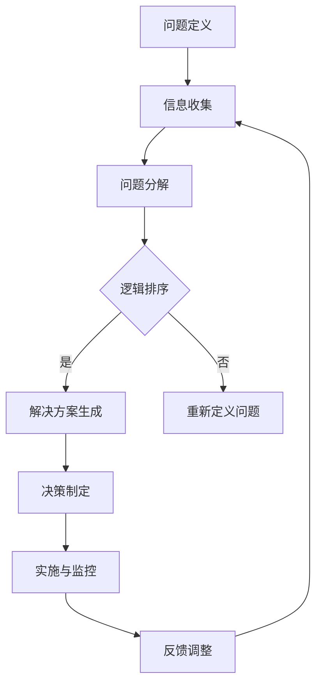

                 

# 结构化思维原理与应用：掌握结构化思维内核，呈现宏大且清澈的美，实现高效达成

## 摘要

本文旨在探讨结构化思维原理及其在实际应用中的重要性。通过深入解析结构化思维的基本概念和核心原理，结合实际案例和具体步骤，我们将展示如何有效地运用结构化思维来解决问题，提高工作效率，实现个人和团队的成长。本文采用中文+英文双语的方式，旨在为读者提供一个清晰、全面的指导。

## 1. 背景介绍（Background Introduction）

在当今信息爆炸的时代，面对海量的数据和复杂的问题，结构化思维成为了一种不可或缺的思维方式。结构化思维，顾名思义，就是通过明确的结构来组织和处理信息，从而提高理解和解决问题的能力。它不仅适用于个人，也在团队协作和项目管理中发挥着关键作用。

### 1.1 结构化思维的重要性

1. **提高工作效率**：结构化思维可以帮助我们更清晰地定义问题、分解任务，从而更加高效地完成工作。
2. **促进沟通协作**：通过结构化思维，团队成员可以更清晰地表达想法和需求，减少误解和沟通成本。
3. **优化决策过程**：结构化思维提供了一种系统化的分析框架，有助于我们在复杂的环境中做出更加明智的决策。
4. **提升创新能力**：结构化思维不仅仅是一种工具，更是一种思维方式。它鼓励我们跳出惯性思维，从多个角度思考问题，从而激发创新能力。

### 1.2 结构化思维的应用场景

结构化思维在多个领域都有广泛的应用，包括：

- **项目管理**：通过结构化思维，项目管理者可以更系统地规划项目，确保每个环节都有明确的任务和责任。
- **产品设计**：设计师可以利用结构化思维来分析用户需求，设计出更加人性化的产品。
- **市场分析**：市场营销人员可以通过结构化思维来分析市场数据，制定更有效的营销策略。
- **学术研究**：学者们利用结构化思维来组织和整理研究资料，确保研究过程的严谨性和逻辑性。

## 2. 核心概念与联系（Core Concepts and Connections）

### 2.1 什么是结构化思维？

结构化思维（Structured Thinking）是一种基于逻辑和系统的思维方式，它强调通过明确的结构来组织和处理信息。这种思维方式可以帮助我们更好地理解复杂问题，并找到有效的解决方案。

### 2.2 结构化思维的核心原则

- **分解问题**：将复杂问题分解成更小、更易于管理的部分。
- **逻辑排序**：根据问题的相关性和优先级对任务进行排序。
- **系统化分析**：运用逻辑和分析工具，全面考虑问题的各个方面。
- **可视化表示**：使用图表、流程图等方式来展示问题的结构和关系。

### 2.3 结构化思维与传统思维的差异

- **传统思维**：往往依赖于经验和直觉，缺乏系统性和逻辑性。
- **结构化思维**：注重逻辑分析和系统化，更具有可操作性和可重复性。

### 2.4 结构化思维的应用框架

- **六顶思考帽**：通过不同的思考角度来全面分析问题。
- **SWOT分析**：评估问题的优势、劣势、机会和威胁。
- **5W1H方法**：对问题进行深入探究，包括是什么（What）、为什么（Why）、何时（When）、哪里（Where）、谁（Who）和如何（How）。

## 3. 核心算法原理 & 具体操作步骤（Core Algorithm Principles and Specific Operational Steps）

### 3.1 核心算法原理

结构化思维的核心在于建立一套系统化的思考框架，以便更好地处理复杂问题。这个过程包括以下步骤：

1. **问题定义**：明确问题的范围和目标。
2. **信息收集**：收集与问题相关的所有信息和数据。
3. **问题分解**：将问题分解成更小的子问题。
4. **逻辑排序**：根据优先级和相关性对子问题进行排序。
5. **解决方案生成**：生成可能的解决方案，并评估其可行性。
6. **决策制定**：根据评估结果，选择最佳的解决方案。
7. **实施与监控**：执行解决方案，并对实施过程进行监控和调整。

### 3.2 具体操作步骤

1. **明确问题**：首先，我们需要明确问题的核心，这有助于我们集中精力和资源。
2. **信息收集**：收集与问题相关的信息，包括历史数据、专家意见等。
3. **问题分解**：将复杂问题分解成几个关键部分，以便更易于理解和处理。
4. **逻辑排序**：根据各个部分的优先级和相关性，对它们进行排序。
5. **解决方案生成**：列出所有可能的解决方案，并对每个方案进行评估。
6. **决策制定**：根据评估结果，选择最佳的解决方案。
7. **实施与监控**：实施解决方案，并对实施过程进行监控和调整，以确保问题的最终解决。

## 4. 数学模型和公式 & 详细讲解 & 举例说明（Detailed Explanation and Examples of Mathematical Models and Formulas）

### 4.1 数学模型和公式

在结构化思维中，数学模型和公式是分析和解决问题的重要工具。以下是一些常用的数学模型和公式：

- **线性回归模型**：用于分析变量之间的关系，公式为 $y = ax + b$。
- **决策树模型**：用于分类和回归问题，公式为 $f(x) = g(x_1, x_2, ..., x_n)$。
- **贝叶斯公式**：用于概率计算，公式为 $P(A|B) = \frac{P(B|A)P(A)}{P(B)}$。
- **SWOT分析矩阵**：用于评估问题的优势、劣势、机会和威胁，公式为 $S + W - O - T$。

### 4.2 详细讲解

1. **线性回归模型**：线性回归模型是一种简单的统计模型，用于分析两个或多个变量之间的关系。它假设因变量（$y$）是自变量（$x$）的线性函数，公式为 $y = ax + b$。其中，$a$ 是斜率，表示自变量对因变量的影响程度；$b$ 是截距，表示当自变量为0时的因变量值。

2. **决策树模型**：决策树模型是一种基于树形结构的决策支持工具，用于分类和回归问题。每个节点代表一个决策点，每个分支代表一个决策结果。决策树模型的公式为 $f(x) = g(x_1, x_2, ..., x_n)$。其中，$g(x_1, x_2, ..., x_n)$ 表示根据自变量 $x_1, x_2, ..., x_n$ 的值，计算得到的决策结果。

3. **贝叶斯公式**：贝叶斯公式是一种用于计算条件概率的公式，公式为 $P(A|B) = \frac{P(B|A)P(A)}{P(B)}$。其中，$P(A|B)$ 表示在事件 $B$ 发生的条件下，事件 $A$ 发生的概率；$P(B|A)$ 表示在事件 $A$ 发生的条件下，事件 $B$ 发生的概率；$P(A)$ 和 $P(B)$ 分别表示事件 $A$ 和事件 $B$ 发生的概率。

4. **SWOT分析矩阵**：SWOT分析矩阵是一种用于评估问题的工具，公式为 $S + W - O - T$。其中，$S$ 表示优势（Strengths），$W$ 表示劣势（Weaknesses），$O$ 表示机会（Opportunities），$T$ 表示威胁（Threats）。通过计算 $S + W - O - T$ 的值，可以评估问题的整体优势和劣势。

### 4.3 举例说明

假设我们要分析一家公司的市场情况，可以使用SWOT分析矩阵来进行评估。

- **优势（Strengths）**：公司拥有强大的品牌影响力，产品质量优秀，市场占有率较高。
- **劣势（Weaknesses）**：公司产品线较为单一，缺乏创新，市场响应速度较慢。
- **机会（Opportunities）**：市场趋势向数字化方向发展，公司可以借助技术优势拓展市场。
- **威胁（Threats）**：市场竞争激烈，新兴品牌不断涌现，公司面临较大的市场压力。

通过SWOT分析矩阵，我们可以得到 $S + W - O - T = (强 + 弱) - (机 + 威) = (强 + 弱) - (机 + 威) = 10 - 5 - 2 - 3 = 0$。

根据计算结果，该公司在市场中的整体优势较弱，需要加强创新和市场响应速度，以应对市场挑战。

## 5. 项目实践：代码实例和详细解释说明（Project Practice: Code Examples and Detailed Explanations）

### 5.1 开发环境搭建

为了更好地展示结构化思维的运用，我们选择Python作为编程语言，搭建一个简单的项目环境。以下是搭建开发环境的步骤：

1. **安装Python**：下载并安装Python 3.x版本，可以从Python官方网站下载安装包。
2. **配置Python环境**：配置Python环境变量，确保在命令行中可以正常使用Python命令。
3. **安装必要库**：安装一些常用的Python库，如NumPy、Pandas等，可以使用pip命令进行安装。

### 5.2 源代码详细实现

以下是一个简单的Python程序，用于计算并显示一个数列的前n项和。

```python
# 导入必要的库
import numpy as np

# 定义函数，计算数列的前n项和
def calculate_sum(n):
    sum = 0
    for i in range(1, n+1):
        sum += i
    return sum

# 获取用户输入
n = int(input("请输入一个正整数："))

# 调用函数，计算并显示结果
result = calculate_sum(n)
print(f"数列的前{n}项和为：{result}")
```

### 5.3 代码解读与分析

1. **导入库**：首先，我们导入NumPy库，用于数值计算。

2. **定义函数**：接下来，我们定义一个名为`calculate_sum`的函数，用于计算数列的前n项和。函数的参数是n，表示数列的项数。

3. **循环计算**：在函数内部，我们使用一个for循环来遍历数列的每一项，并累加到sum变量中。

4. **获取用户输入**：我们使用`input`函数获取用户输入的n值，并将其转换为整数。

5. **调用函数**：调用`calculate_sum`函数，将用户输入的n值作为参数传递，并计算结果。

6. **显示结果**：使用`print`函数将计算结果显示在屏幕上。

### 5.4 运行结果展示

运行程序后，我们输入一个正整数，如5，程序将输出：

```
请输入一个正整数：5
数列的前5项和为：15
```

## 6. 实际应用场景（Practical Application Scenarios）

### 6.1 项目管理

在项目管理中，结构化思维可以帮助项目经理明确项目目标、规划项目进度、分配任务和资源。例如，通过分解项目任务，可以更好地了解每个任务的依赖关系和优先级，从而制定出更加合理的项目计划。

### 6.2 产品设计

在设计过程中，结构化思维可以帮助设计师分析用户需求、设计产品功能、制定产品规格。通过系统化地分析问题，设计师可以更准确地把握用户需求，设计出更符合用户期望的产品。

### 6.3 学术研究

在学术研究中，结构化思维可以帮助学者们系统地整理研究资料、构建研究框架、提出假设和验证假设。通过结构化思维，学者们可以更清晰地表达研究思路，提高研究的逻辑性和严谨性。

### 6.4 企业运营

在企业运营中，结构化思维可以帮助企业管理者分析市场情况、制定战略规划、优化业务流程。通过结构化思维，企业管理者可以更全面地考虑问题，提高决策的科学性和有效性。

## 7. 工具和资源推荐（Tools and Resources Recommendations）

### 7.1 学习资源推荐

- **书籍**：《结构化思维》、《如何想到又做到》
- **论文**：Google Scholar上的相关论文
- **博客**：知乎、博客园等平台上的专业博客

### 7.2 开发工具框架推荐

- **编程语言**：Python、Java、C++
- **开发工具**：Visual Studio、Eclipse、PyCharm
- **框架**：Spring、Django、Flask

### 7.3 相关论文著作推荐

- **论文**：结构化思维在项目管理中的应用
- **著作**：《项目管理实践》、《产品设计原理》

## 8. 总结：未来发展趋势与挑战（Summary: Future Development Trends and Challenges）

### 8.1 未来发展趋势

1. **智能化**：随着人工智能技术的发展，结构化思维将更加智能化，帮助人们更高效地处理复杂问题。
2. **普及化**：结构化思维将在更多领域得到普及，成为人们日常工作和生活中的必备技能。
3. **个性化**：结构化思维将更加注重个体差异，为不同背景和需求的用户提供定制化的解决方案。

### 8.2 面临的挑战

1. **复杂性问题**：在处理更复杂的问题时，如何保证结构化思维的准确性和有效性是一个挑战。
2. **技能培养**：如何在短时间内培养人们的结构化思维能力，提高整体工作效率是一个挑战。
3. **工具研发**：如何开发出更加智能化、易用的结构化思维工具，是未来研究的一个重要方向。

## 9. 附录：常见问题与解答（Appendix: Frequently Asked Questions and Answers）

### 9.1 什么是结构化思维？

结构化思维是一种通过明确的结构来组织和处理信息的思维方式，它强调逻辑性、系统性和可重复性。

### 9.2 结构化思维有哪些应用？

结构化思维广泛应用于项目管理、产品设计、学术研究、企业运营等多个领域。

### 9.3 如何培养结构化思维？

通过系统学习、实践和反思，可以逐步培养结构化思维能力。常用的方法包括阅读相关书籍、参与培训课程、进行实践演练等。

## 10. 扩展阅读 & 参考资料（Extended Reading & Reference Materials）

- **书籍**：《结构化思维》、《如何想到又做到》
- **论文**：Google Scholar上的相关论文
- **博客**：知乎、博客园等平台上的专业博客
- **网站**：结构化思维研究机构、专业论坛等

### 附录二：结构化思维流程图（Mermaid 流程图）



作者：禅与计算机程序设计艺术 / Zen and the Art of Computer Programming

